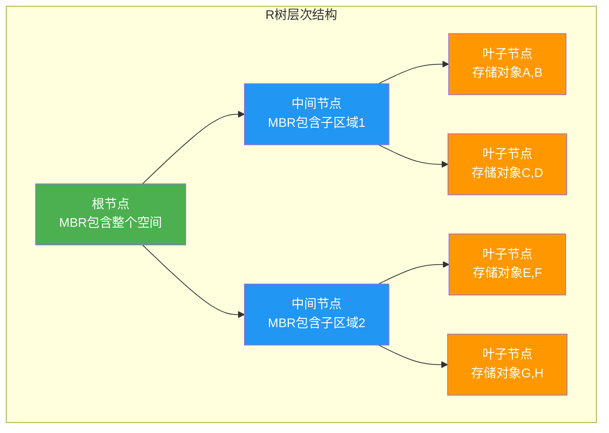
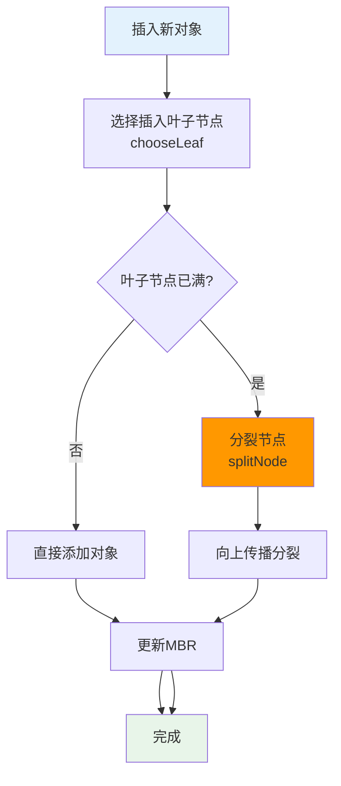
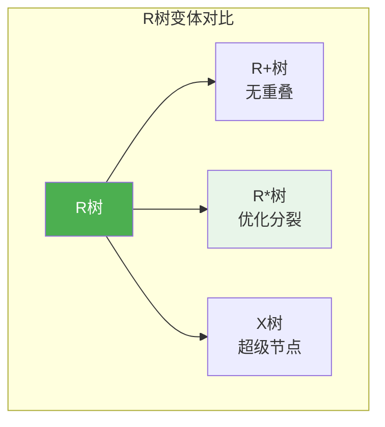

# R树

## 概述

R树（R-Tree）是一种平衡树数据结构，专门用于空间索引。它通过层次化的最小外接矩形（Minimum Bounding Rectangle，MBR）组织多维空间对象，是GIS系统和空间数据库的核心索引结构。

<div style="background: #E3F2FD; border-left: 4px solid #2196F3; padding: 12px; margin: 10px 0;">
<strong>核心思想</strong>：用最小外接矩形（MBR）近似表示空间对象，通过MBR的包含关系组织成树形结构。查询时先检查MBR是否相交，减少精确几何计算的次数。
</div>

## R树特点

| 特性 | 说明 |
|------|------|
| 空间索引 | 专为几何对象设计的高效索引 |
| B树变体 | 类似B树的多路平衡树结构 |
| 层次包围盒 | 用MBR递归组织空间对象 |
| 动态更新 | 支持动态插入、删除操作 |
| 范围查询 | 高效的空间范围查询 |
| 最近邻 | 支持最近邻搜索 |

## R树结构可视化

### 层次结构



### MBR 包围盒示意

<div style="background: #F5F5F5; border-radius: 8px; padding: 20px; margin: 10px 0;">
<p style="font-weight: bold; margin: 0 0 15px 0;">二维空间中的R树结构</p>
<svg width="400" height="280" viewBox="0 0 400 280">
  <!-- 根节点MBR -->
  <rect x="20" y="20" width="360" height="240" fill="none" stroke="#4CAF50" stroke-width="3" stroke-dasharray="5,3"/>
  <text x="200" y="15" text-anchor="middle" fill="#4CAF50" font-size="12" font-weight="bold">根节点MBR</text>
  <!-- MBR1 -->
  <rect x="40" y="40" width="150" height="200" fill="#E3F2FD" fill-opacity="0.5" stroke="#2196F3" stroke-width="2"/>
  <text x="115" y="35" text-anchor="middle" fill="#2196F3" font-size="11" font-weight="bold">MBR1</text>
  <!-- MBR2 -->
  <rect x="210" y="40" width="150" height="200" fill="#FFF3E0" fill-opacity="0.5" stroke="#FF9800" stroke-width="2"/>
  <text x="285" y="35" text-anchor="middle" fill="#FF9800" font-size="11" font-weight="bold">MBR2</text>
  <!-- 对象A-H -->
  <rect x="50" y="50" width="35" height="35" fill="#4CAF50" stroke="#388E3C" stroke-width="2" rx="3"/>
  <text x="67" y="72" text-anchor="middle" fill="white" font-weight="bold" font-size="14">A</text>
  <rect x="95" y="50" width="35" height="35" fill="#4CAF50" stroke="#388E3C" stroke-width="2" rx="3"/>
  <text x="112" y="72" text-anchor="middle" fill="white" font-weight="bold" font-size="14">B</text>
  <rect x="50" y="100" width="35" height="35" fill="#2196F3" stroke="#1976D2" stroke-width="2" rx="3"/>
  <text x="67" y="122" text-anchor="middle" fill="white" font-weight="bold" font-size="14">C</text>
  <rect x="95" y="100" width="35" height="35" fill="#2196F3" stroke="#1976D2" stroke-width="2" rx="3"/>
  <text x="112" y="122" text-anchor="middle" fill="white" font-weight="bold" font-size="14">D</text>
  <rect x="220" y="50" width="35" height="35" fill="#FF9800" stroke="#F57C00" stroke-width="2" rx="3"/>
  <text x="237" y="72" text-anchor="middle" fill="white" font-weight="bold" font-size="14">E</text>
  <rect x="265" y="50" width="35" height="35" fill="#FF9800" stroke="#F57C00" stroke-width="2" rx="3"/>
  <text x="282" y="72" text-anchor="middle" fill="white" font-weight="bold" font-size="14">F</text>
  <rect x="220" y="100" width="35" height="35" fill="#9C27B0" stroke="#7B1FA2" stroke-width="2" rx="3"/>
  <text x="237" y="122" text-anchor="middle" fill="white" font-weight="bold" font-size="14">G</text>
  <rect x="265" y="100" width="35" height="35" fill="#9C27B0" stroke="#7B1FA2" stroke-width="2" rx="3"/>
  <text x="282" y="122" text-anchor="middle" fill="white" font-weight="bold" font-size="14">H</text>
</svg>
<p style="font-size: 13px; margin: 10px 0 0 0; color: #666;">A,B,C,D,E,F,G,H 为实际空间对象，MBR1, MBR2 为中间节点的包围盒，根节点MBR包含所有对象</p>
</div>

### R树节点结构

<div style="background: #F5F5F5; border-radius: 8px; padding: 20px; margin: 10px 0;">
<div style="display: flex; gap: 20px; flex-wrap: wrap;">
<div style="flex: 1; min-width: 280px;">
<div style="background: #E3F2FD; border: 2px solid #2196F3; border-radius: 8px; padding: 15px;">
<p style="margin: 0 0 10px 0; font-weight: bold; color: #2196F3; text-align: center;">非叶子节点结构</p>
<div style="background: #fff; border-radius: 4px; padding: 10px; font-size: 12px;">
<div style="padding: 5px 0; border-bottom: 1px solid #e0e0e0;"><strong>节点MBR:</strong> (x_min, y_min, x_max, y_max)</div>
<div style="padding: 8px 0; border-bottom: 1px solid #e0e0e0;"><strong>条目1:</strong> (子节点指针, 子节点MBR)</div>
<div style="padding: 8px 0; border-bottom: 1px solid #e0e0e0;"><strong>条目2:</strong> (子节点指针, 子节点MBR)</div>
<div style="padding: 8px 0; border-bottom: 1px solid #e0e0e0;">...</div>
<div style="padding: 8px 0;"><strong>条目n:</strong> (子节点指针, 子节点MBR)</div>
</div>
</div>
</div>
<div style="flex: 1; min-width: 280px;">
<div style="background: #E8F5E9; border: 2px solid #4CAF50; border-radius: 8px; padding: 15px;">
<p style="margin: 0 0 10px 0; font-weight: bold; color: #4CAF50; text-align: center;">叶子节点结构</p>
<div style="background: #fff; border-radius: 4px; padding: 10px; font-size: 12px;">
<div style="padding: 5px 0; border-bottom: 1px solid #e0e0e0;"><strong>节点MBR:</strong> (x_min, y_min, x_max, y_max)</div>
<div style="padding: 8px 0; border-bottom: 1px solid #e0e0e0;"><strong>条目1:</strong> (数据指针, 对象MBR)</div>
<div style="padding: 8px 0; border-bottom: 1px solid #e0e0e0;"><strong>条目2:</strong> (数据指针, 对象MBR)</div>
<div style="padding: 8px 0; border-bottom: 1px solid #e0e0e0;">...</div>
<div style="padding: 8px 0;"><strong>条目n:</strong> (数据指针, 对象MBR)</div>
</div>
</div>
</div>
</div>
</div>

## 数据结构定义

```c
#define MAX_ENTRIES 4    // 节点最大条目数
#define MIN_ENTRIES 2    // 节点最小条目数

// 最小外接矩形
typedef struct {
    double x_min, y_min;
    double x_max, y_max;
} MBR;

// 空间对象
typedef struct SpatialObject {
    MBR mbr;           // 对象的包围盒
    void *data;        // 实际数据指针
} SpatialObject;

// R树节点
typedef struct RTreeNode {
    int isLeaf;                      // 是否为叶子节点
    int count;                       // 当前条目数
    MBR mbr;                         // 节点的MBR
    struct RTreeNode *children[MAX_ENTRIES];  // 子节点指针
    SpatialObject *objects[MAX_ENTRIES];       // 数据对象指针
} RTreeNode;

// R树
typedef struct {
    RTreeNode *root;    // 根节点
    int height;         // 树高度
} RTree;
```

## MBR 操作

### MBR 创建与合并

```c
// 创建MBR
MBR createMBR(double x1, double y1, double x2, double y2) {
    MBR mbr;
    mbr.x_min = (x1 < x2) ? x1 : x2;
    mbr.y_min = (y1 < y2) ? y1 : y2;
    mbr.x_max = (x1 > x2) ? x1 : x2;
    mbr.y_max = (y1 > y2) ? y1 : y2;
    return mbr;
}

// 合并两个MBR（求最小包围矩形）
MBR combineMBR(MBR a, MBR b) {
    MBR result;
    result.x_min = (a.x_min < b.x_min) ? a.x_min : b.x_min;
    result.y_min = (a.y_min < b.y_min) ? a.y_min : b.y_min;
    result.x_max = (a.x_max > b.x_max) ? a.x_max : b.x_max;
    result.y_max = (a.y_max > b.y_max) ? a.y_max : b.y_max;
    return result;
}
```

**MBR合并示意**：

<div style="background: #F5F5F5; border-radius: 8px; padding: 20px; margin: 10px 0;">
<div style="display: flex; gap: 40px; align-items: center; justify-content: center;">
<div style="text-align: center;">
<p style="margin: 0 0 10px 0; font-weight: bold;">合并前</p>
<svg width="120" height="80" viewBox="0 0 120 80">
  <rect x="10" y="10" width="40" height="40" fill="#E3F2FD" stroke="#2196F3" stroke-width="2" rx="3"/>
  <text x="30" y="35" text-anchor="middle" fill="#2196F3" font-weight="bold" font-size="14">A</text>
  <rect x="70" y="30" width="40" height="40" fill="#FFF3E0" stroke="#FF9800" stroke-width="2" rx="3"/>
  <text x="90" y="55" text-anchor="middle" fill="#FF9800" font-weight="bold" font-size="14">B</text>
</svg>
</div>
<div style="font-size: 24px; color: #4CAF50;">→</div>
<div style="text-align: center;">
<p style="margin: 0 0 10px 0; font-weight: bold;">合并后</p>
<svg width="120" height="90" viewBox="0 0 120 90">
  <rect x="5" y="5" width="110" height="80" fill="none" stroke="#4CAF50" stroke-width="2" stroke-dasharray="4,2" rx="5"/>
  <rect x="10" y="10" width="40" height="40" fill="#E3F2FD" stroke="#2196F3" stroke-width="2" rx="3"/>
  <text x="30" y="35" text-anchor="middle" fill="#2196F3" font-weight="bold" font-size="14">A</text>
  <rect x="70" y="40" width="40" height="40" fill="#FFF3E0" stroke="#FF9800" stroke-width="2" rx="3"/>
  <text x="90" y="65" text-anchor="middle" fill="#FF9800" font-weight="bold" font-size="14">B</text>
</svg>
<p style="margin: 5px 0 0 0; font-size: 12px; color: #4CAF50;">combine(A, B)</p>
</div>
</div>
</div>

### MBR 计算与判断

```c
// 计算MBR面积
double areaMBR(MBR mbr) {
    return (mbr.x_max - mbr.x_min) * (mbr.y_max - mbr.y_min);
}

// 判断两个MBR是否重叠
int overlapMBR(MBR a, MBR b) {
    return (a.x_min <= b.x_max && a.x_max >= b.x_min &&
            a.y_min <= b.y_max && a.y_max >= b.y_min);
}

// 判断MBR包含关系
int containMBR(MBR outer, MBR inner) {
    return (outer.x_min <= inner.x_min && outer.x_max >= inner.x_max &&
            outer.y_min <= inner.y_min && outer.y_max >= inner.y_max);
}

// 计算MBR扩张面积
double enlargementMBR(MBR original, MBR added) {
    MBR combined = combineMBR(original, added);
    return areaMBR(combined) - areaMBR(original);
}
```

## R树创建

```c
RTreeNode* createRTreeNode(int isLeaf) {
    RTreeNode *node = (RTreeNode*)malloc(sizeof(RTreeNode));
    node->isLeaf = isLeaf;
    node->count = 0;
    node->mbr = createMBR(0, 0, 0, 0);
    
    for (int i = 0; i < MAX_ENTRIES; i++) {
        node->children[i] = NULL;
        node->objects[i] = NULL;
    }
    
    return node;
}

RTree* createRTree() {
    RTree *tree = (RTree*)malloc(sizeof(RTree));
    tree->root = createRTreeNode(1);  // 初始为叶子节点
    tree->height = 1;
    return tree;
}
```

## 插入操作

### 选择插入节点

选择使MBR扩张面积最小的节点：

```c
RTreeNode* chooseLeaf(RTreeNode *node, MBR mbr) {
    if (node->isLeaf) return node;
    
    int best = 0;
    double minEnlargement = 1e18;
    double minArea = 1e18;
    
    for (int i = 0; i < node->count; i++) {
        MBR combined = combineMBR(node->children[i]->mbr, mbr);
        double enlargement = areaMBR(combined) - areaMBR(node->children[i]->mbr);
        
        // 选择扩张面积最小的，若相同则选择面积最小的
        if (enlargement < minEnlargement || 
            (enlargement == minEnlargement && areaMBR(node->children[i]->mbr) < minArea)) {
            minEnlargement = enlargement;
            minArea = areaMBR(node->children[i]->mbr);
            best = i;
        }
    }
    
    return chooseLeaf(node->children[best], mbr);
}
```

**选择策略示意**：

<div style="background: #F5F5F5; border-radius: 8px; padding: 20px; margin: 10px 0;">
<p style="font-weight: bold; margin: 0 0 15px 0;">插入新对象X时的选择策略</p>
<div style="display: flex; gap: 15px; justify-content: center; flex-wrap: wrap;">
<div style="text-align: center;">
<svg width="80" height="80" viewBox="0 0 80 80">
  <rect x="10" y="10" width="60" height="60" fill="#E3F2FD" stroke="#2196F3" stroke-width="2" rx="5"/>
  <text x="40" y="45" text-anchor="middle" fill="#2196F3" font-weight="bold" font-size="14">M1</text>
</svg>
<p style="margin: 5px 0 0 0; font-size: 12px;">扩张 <span style="color: #F44336; font-weight: bold;">3单位</span></p>
</div>
<div style="text-align: center;">
<svg width="80" height="80" viewBox="0 0 80 80">
  <rect x="10" y="10" width="60" height="60" fill="#E8F5E9" stroke="#4CAF50" stroke-width="2" rx="5"/>
  <text x="40" y="45" text-anchor="middle" fill="#4CAF50" font-weight="bold" font-size="14">M2</text>
</svg>
<p style="margin: 5px 0 0 0; font-size: 12px;">扩张 <span style="color: #4CAF50; font-weight: bold;">1单位</span> ✓</p>
</div>
<div style="text-align: center;">
<svg width="80" height="80" viewBox="0 0 80 80">
  <rect x="10" y="10" width="60" height="60" fill="#FFEBEE" stroke="#F44336" stroke-width="2" rx="5"/>
  <text x="40" y="45" text-anchor="middle" fill="#F44336" font-weight="bold" font-size="14">M3</text>
</svg>
<p style="margin: 5px 0 0 0; font-size: 12px;">扩张 <span style="color: #F44336; font-weight: bold;">5单位</span></p>
</div>
</div>
<p style="margin: 15px 0 0 0; text-align: center; font-size: 13px; color: #4CAF50;"><strong>选择 M2：扩张面积最小</strong></p>
</div>

### 更新MBR

```c
void updateMBR(RTreeNode *node) {
    if (node->count == 0) return;
    
    if (node->isLeaf) {
        node->mbr = node->objects[0]->mbr;
        for (int i = 1; i < node->count; i++) {
            node->mbr = combineMBR(node->mbr, node->objects[i]->mbr);
        }
    } else {
        node->mbr = node->children[0]->mbr;
        for (int i = 1; i < node->count; i++) {
            node->mbr = combineMBR(node->mbr, node->children[i]->mbr);
        }
    }
}
```

### 插入流程



## 范围查询

```c
void rangeSearch(RTreeNode *node, MBR query, SpatialObject **results, int *count) {
    // 如果查询MBR与节点MBR不相交，直接返回
    if (!overlapMBR(node->mbr, query)) return;
    
    if (node->isLeaf) {
        // 叶子节点：检查每个对象
        for (int i = 0; i < node->count; i++) {
            if (overlapMBR(node->objects[i]->mbr, query)) {
                results[(*count)++] = node->objects[i];
            }
        }
    } else {
        // 中间节点：递归搜索子节点
        for (int i = 0; i < node->count; i++) {
            rangeSearch(node->children[i], query, results, count);
        }
    }
}
```

**范围查询示意**：

<div style="background: #F5F5F5; border-radius: 8px; padding: 20px; margin: 10px 0;">
<p style="font-weight: bold; margin: 0 0 15px 0;">查询区域 Q（虚线框）</p>
<svg width="380" height="240" viewBox="0 0 380 240">
  <!-- MBR1 -->
  <rect x="30" y="30" width="150" height="180" fill="#E3F2FD" fill-opacity="0.3" stroke="#2196F3" stroke-width="2"/>
  <!-- MBR2 -->
  <rect x="200" y="30" width="150" height="180" fill="#FFF3E0" fill-opacity="0.3" stroke="#FF9800" stroke-width="2"/>
  <!-- 查询区域Q -->
  <rect x="40" y="50" width="130" height="140" fill="#E8F5E9" fill-opacity="0.4" stroke="#4CAF50" stroke-width="2" stroke-dasharray="5,3" rx="5"/>
  <text x="105" y="45" text-anchor="middle" fill="#4CAF50" font-size="12" font-weight="bold">Q</text>
  <!-- 对象 -->
  <rect x="50" y="60" width="30" height="30" fill="#4CAF50" stroke="#388E3C" stroke-width="2" rx="2"/>
  <text x="65" y="80" text-anchor="middle" fill="white" font-weight="bold" font-size="12">A</text>
  <rect x="90" y="60" width="30" height="30" fill="#4CAF50" stroke="#388E3C" stroke-width="2" rx="2"/>
  <text x="105" y="80" text-anchor="middle" fill="white" font-weight="bold" font-size="12">B</text>
  <rect x="50" y="100" width="30" height="30" fill="#4CAF50" stroke="#388E3C" stroke-width="2" rx="2"/>
  <text x="65" y="120" text-anchor="middle" fill="white" font-weight="bold" font-size="12">C</text>
  <rect x="90" y="100" width="30" height="30" fill="#4CAF50" stroke="#388E3C" stroke-width="2" rx="2"/>
  <text x="105" y="120" text-anchor="middle" fill="white" font-weight="bold" font-size="12">D</text>
  <rect x="220" y="60" width="30" height="30" fill="#9E9E9E" stroke="#757575" stroke-width="2" rx="2"/>
  <text x="235" y="80" text-anchor="middle" fill="white" font-weight="bold" font-size="12">E</text>
  <rect x="220" y="100" width="30" height="30" fill="#9E9E9E" stroke="#757575" stroke-width="2" rx="2"/>
  <text x="235" y="120" text-anchor="middle" fill="white" font-weight="bold" font-size="12">G</text>
</svg>
<div style="margin-top: 10px; padding: 10px; background: #E8F5E9; border-radius: 4px; text-align: center;">
<strong style="color: #4CAF50;">结果: A, B, C, D</strong> <span style="color: #666;">（与Q相交的对象）</span>
</div>
</div>

## 最近邻查询

```c
// 计算点到MBR的最小距离
double distanceMBR(MBR mbr, double x, double y) {
    double dx = 0, dy = 0;
    
    if (x < mbr.x_min) dx = mbr.x_min - x;
    else if (x > mbr.x_max) dx = x - mbr.x_max;
    
    if (y < mbr.y_min) dy = mbr.y_min - y;
    else if (y > mbr.y_max) dy = y - mbr.y_max;
    
    return sqrt(dx * dx + dy * dy);
}

void nearestNeighbor(RTreeNode *node, double x, double y, 
                     SpatialObject **nearest, double *minDist) {
    if (node->isLeaf) {
        // 叶子节点：检查每个对象
        for (int i = 0; i < node->count; i++) {
            double cx = (node->objects[i]->mbr.x_min + node->objects[i]->mbr.x_max) / 2;
            double cy = (node->objects[i]->mbr.y_min + node->objects[i]->mbr.y_max) / 2;
            double dist = sqrt((cx - x) * (cx - x) + (cy - y) * (cy - y));
            
            if (dist < *minDist) {
                *minDist = dist;
                *nearest = node->objects[i];
            }
        }
    } else {
        // 按距离排序子节点（剪枝优化）
        int order[MAX_ENTRIES];
        for (int i = 0; i < node->count; i++) order[i] = i;
        
        // 按MBR到查询点的距离排序
        for (int i = 0; i < node->count - 1; i++) {
            for (int j = i + 1; j < node->count; j++) {
                double di = distanceMBR(node->children[order[i]]->mbr, x, y);
                double dj = distanceMBR(node->children[order[j]]->mbr, x, y);
                if (di > dj) {
                    int temp = order[i];
                    order[i] = order[j];
                    order[j] = temp;
                }
            }
        }
        
        // 递归搜索，利用距离剪枝
        for (int i = 0; i < node->count; i++) {
            if (distanceMBR(node->children[order[i]]->mbr, x, y) < *minDist) {
                nearestNeighbor(node->children[order[i]], x, y, nearest, minDist);
            }
        }
    }
}
```

<div style="background: #E8F5E9; border-left: 4px solid #4CAF50; padding: 12px; margin: 10px 0;">
<strong>剪枝优化</strong>：按MBR到查询点的距离排序，如果某子节点的MBR距离已超过当前最近距离，则无需搜索该子树。
</div>

## C++ 实现

```cpp
#include <vector>
#include <memory>
#include <cmath>
#include <algorithm>

class RTree {
private:
    static const int MAX_ENTRIES = 4;
    static const int MIN_ENTRIES = 2;
    
    struct MBR {
        double x_min, y_min, x_max, y_max;
        
        MBR(double x1 = 0, double y1 = 0, double x2 = 0, double y2 = 0) {
            x_min = std::min(x1, x2);
            y_min = std::min(y1, y2);
            x_max = std::max(x1, x2);
            y_max = std::max(y1, y2);
        }
        
        double area() const { 
            return (x_max - x_min) * (y_max - y_min); 
        }
        
        bool overlaps(const MBR& other) const {
            return x_min <= other.x_max && x_max >= other.x_min &&
                   y_min <= other.y_max && y_max >= other.y_min;
        }
        
        MBR combine(const MBR& other) const {
            return MBR(std::min(x_min, other.x_min), std::min(y_min, other.y_min),
                       std::max(x_max, other.x_max), std::max(y_max, other.y_max));
        }
        
        double distance(double x, double y) const {
            double dx = std::max({0.0, x_min - x, x - x_max});
            double dy = std::max({0.0, y_min - y, y - y_max});
            return std::sqrt(dx * dx + dy * dy);
        }
    };
    
    struct Node {
        bool isLeaf;
        MBR mbr;
        std::vector<std::unique_ptr<Node>> children;
        std::vector<std::pair<MBR, void*>> objects;
        
        Node(bool leaf) : isLeaf(leaf) {}
    };
    
    std::unique_ptr<Node> root;
    
public:
    RTree() : root(std::make_unique<Node>(true)) {}
    
    std::vector<void*> rangeQuery(const MBR& query) {
        std::vector<void*> results;
        rangeSearch(root.get(), query, results);
        return results;
    }
    
private:
    void rangeSearch(Node* node, const MBR& query, std::vector<void*>& results) {
        if (!node || !node->mbr.overlaps(query)) return;
        
        if (node->isLeaf) {
            for (auto& obj : node->objects) {
                if (obj.first.overlaps(query)) {
                    results.push_back(obj.second);
                }
            }
        } else {
            for (auto& child : node->children) {
                rangeSearch(child.get(), query, results);
            }
        }
    }
};
```

## R树变体

| 变体 | 特点 | 适用场景 |
|------|------|---------|
| R+树 | 子节点MBR不重叠 | 点查询效率高 |
| R*树 | 优化分裂策略，减少重叠 | 通用场景，性能最优 |
| R树 | 针对时序数据优化 | 时间序列数据 |
| X树 | 减少节点重叠，超级节点 | 高维数据 |



## 时间复杂度

| 操作 | 时间复杂度 | 说明 |
|------|-----------|------|
| 插入 | O(log n) | 平均情况 |
| 删除 | O(log n) | 平均情况 |
| 范围查询 | O(n^(d/(d+1))) | d为空间维度 |
| 最近邻 | O(log n) | 平均情况 |

<div style="background: #FFF3E0; border-left: 4px solid #FF9800; padding: 12px; margin: 10px 0;">
<strong>查询复杂度说明</strong>：范围查询复杂度与空间维度 d 相关，二维情况下约为 O(√n)，高维时性能下降明显。
</div>

## 空间复杂度

- **节点数量**：O(n/M)，其中 n 为对象数，M 为最小填充因子
- **总空间**：O(n)

## 应用场景

| 应用领域 | 具体场景 |
|---------|---------|
| GIS系统 | 地图索引、空间查询 |
| 空间数据库 | PostGIS、MySQL空间索引 |
| 计算机图形 | 碰撞检测、视锥剔除 |
| 游戏开发 | 场景管理、物体查找 |
| 机器学习 | 空间聚类、近邻搜索 |

## R树 vs 其他空间索引

| 索引结构 | 优势 | 劣势 |
|---------|------|------|
| R树 | 动态更新、适合范围查询 | 高维性能下降 |
| KD树 | 最近邻效率高 | 动态更新困难 |
| 四叉树 | 结构简单 | 对象分布敏感 |
| 网格索引 | 实现简单 | 空间浪费 |

## 参考资料

- Guttman, A. (1984). R-Trees: A Dynamic Index Structure for Spatial Searching
- Beckmann, N. et al. (1990). The R*-Tree: An Efficient and Robust Access Method
- 《空间数据库原理》
