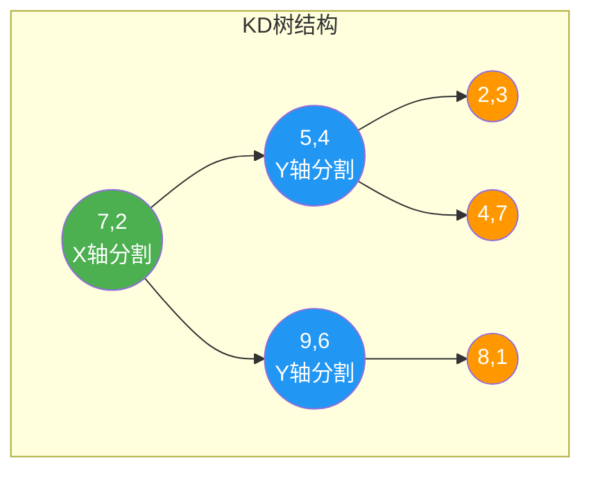
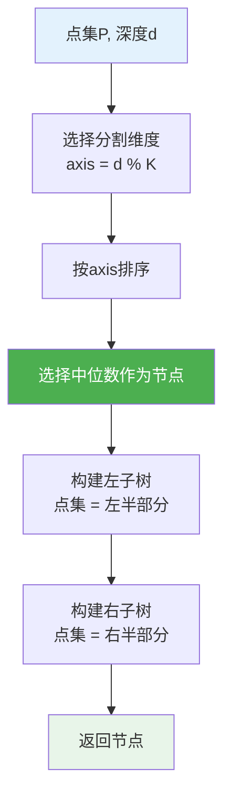
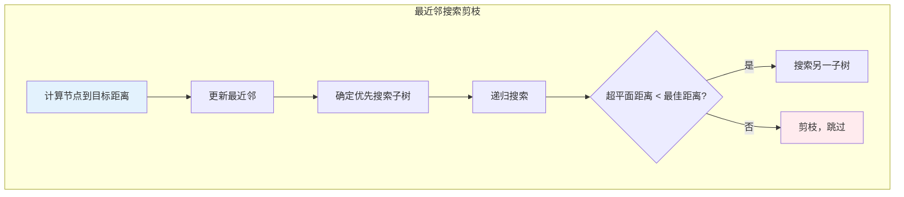
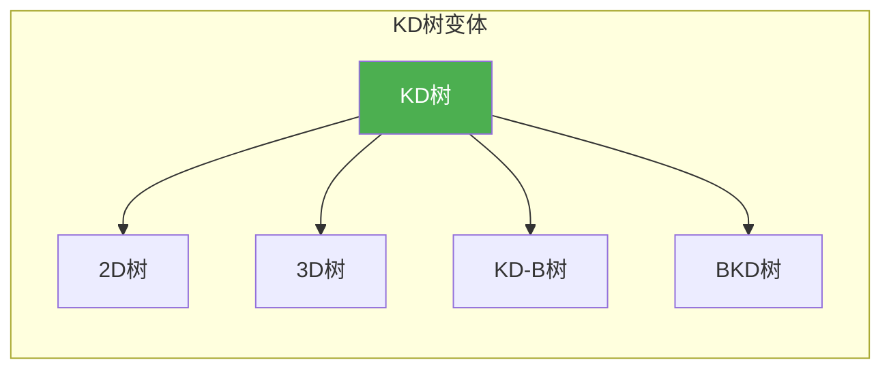

# KD树

## 概述

KD树（K-Dimensional Tree）是一种空间划分数据结构，用于组织K维空间中的点。通过交替选择不同维度进行划分，将空间递归分割成超矩形区域，支持高效的范围搜索和最近邻搜索。

<div style="background: #E3F2FD; border-left: 4px solid #2196F3; padding: 12px; margin: 10px 0;">
<strong>核心思想</strong>：每一层选择一个维度进行划分，将空间分成两部分。对于2D空间，第一层按X轴划分，第二层按Y轴划分，第三层再按X轴划分，以此类推。
</div>

## KD树特点

| 特性 | 说明 |
|------|------|
| 多维索引 | 支持任意维度空间 |
| 二叉树结构 | 每个节点划分一个维度 |
| 交替分割 | 不同层使用不同维度分割 |
| 高效查询 | 最近邻查询平均 O(log n) |
| 空间划分 | 每个节点对应一个超矩形区域 |

## KD树结构可视化

### 2D KD树构建过程

**点集**：{(2,3), (5,4), (9,6), (4,7), (8,1), (7,2)}

**第1层（按X轴划分）**：

<div style="background: #F5F5F5; border-radius: 8px; padding: 20px; margin: 10px 0;">
<p style="margin: 0 0 10px 0; font-size: 13px;"><strong>点集按X排序:</strong> (2,3), (4,7), (5,4), (7,2), (8,1), (9,6)</p>
<p style="margin: 0 0 15px 0; font-size: 13px;"><strong>中位数:</strong> (7,2)</p>
<div style="display: flex; justify-content: center;">
<svg width="200" height="120" viewBox="0 0 200 120">
  <circle cx="100" cy="30" r="20" fill="#4CAF50" stroke="#388E3C" stroke-width="2"/>
  <text x="100" y="35" text-anchor="middle" fill="white" font-weight="bold" font-size="12">(7,2)</text>
  <line x1="100" y1="50" x2="60" y2="80" stroke="#bdbdbd" stroke-width="2"/>
  <line x1="100" y1="50" x2="140" y2="80" stroke="#bdbdbd" stroke-width="2"/>
  <rect x="30" y="85" width="60" height="25" fill="#E3F2FD" stroke="#2196F3" stroke-width="2" rx="4"/>
  <text x="60" y="102" text-anchor="middle" fill="#2196F3" font-weight="bold" font-size="11">X &lt; 7</text>
  <rect x="110" y="85" width="60" height="25" fill="#FFF3E0" stroke="#FF9800" stroke-width="2" rx="4"/>
  <text x="140" y="102" text-anchor="middle" fill="#FF9800" font-weight="bold" font-size="11">X &gt; 7</text>
</svg>
</div>
</div>

**完整KD树**：



### 空间划分可视化

<div style="background: #F5F5F5; border-radius: 8px; padding: 20px; margin: 10px 0;">
<p style="font-weight: bold; margin: 0 0 15px 0;">空间划分过程</p>
<div style="display: grid; gap: 15px;">
<div>
<p style="margin: 0 0 8px 0; font-size: 13px; font-weight: bold; color: #2196F3;">原始空间</p>
<svg width="320" height="180" viewBox="0 0 320 180">
  <rect x="10" y="10" width="300" height="160" fill="#fafafa" stroke="#bdbdbd" stroke-width="2"/>
  <circle cx="50" cy="50" r="8" fill="#2196F3"/>
  <text x="50" y="70" text-anchor="middle" fill="#2196F3" font-size="10">(2,3)</text>
  <circle cx="100" cy="30" r="8" fill="#FF9800"/>
  <text x="100" y="50" text-anchor="middle" fill="#FF9800" font-size="10">(4,7)</text>
  <circle cx="140" cy="60" r="8" fill="#9C27B0"/>
  <text x="140" y="80" text-anchor="middle" fill="#9C27B0" font-size="10">(5,4)</text>
  <circle cx="180" cy="100" r="8" fill="#4CAF50"/>
  <text x="180" y="120" text-anchor="middle" fill="#4CAF50" font-size="10">(7,2)</text>
  <circle cx="240" cy="130" r="8" fill="#E91E63"/>
  <text x="240" y="150" text-anchor="middle" fill="#E91E63" font-size="10">(8,1)</text>
  <circle cx="280" cy="40" r="8" fill="#F44336"/>
  <text x="280" y="60" text-anchor="middle" fill="#F44336" font-size="10">(9,6)</text>
</svg>
</div>
<div>
<p style="margin: 0 0 8px 0; font-size: 13px; font-weight: bold; color: #4CAF50;">第1层分割（X=7）</p>
<svg width="320" height="180" viewBox="0 0 320 180">
  <rect x="10" y="10" width="145" height="160" fill="#E3F2FD" fill-opacity="0.5" stroke="#2196F3" stroke-width="2"/>
  <rect x="165" y="10" width="145" height="160" fill="#FFF3E0" fill-opacity="0.5" stroke="#FF9800" stroke-width="2"/>
  <line x1="165" y1="10" x2="165" y2="170" stroke="#4CAF50" stroke-width="3" stroke-dasharray="5,3"/>
  <text x="165" y="8" text-anchor="middle" fill="#4CAF50" font-size="10" font-weight="bold">X=7</text>
  <circle cx="50" cy="50" r="6" fill="#2196F3"/>
  <circle cx="100" cy="30" r="6" fill="#FF9800"/>
  <circle cx="140" cy="60" r="6" fill="#9C27B0"/>
  <circle cx="180" cy="100" r="6" fill="#4CAF50"/>
  <circle cx="240" cy="130" r="6" fill="#E91E63"/>
  <circle cx="280" cy="40" r="6" fill="#F44336"/>
  <text x="82" y="175" text-anchor="middle" fill="#2196F3" font-size="11">左子树</text>
  <text x="237" y="175" text-anchor="middle" fill="#FF9800" font-size="11">右子树</text>
</svg>
</div>
<div>
<p style="margin: 0 0 8px 0; font-size: 13px; font-weight: bold; color: #FF9800;">第2层分割（左Y=4, 右Y=6）</p>
<svg width="320" height="180" viewBox="0 0 320 180">
  <rect x="10" y="10" width="145" height="70" fill="#E8F5E9" fill-opacity="0.5" stroke="#4CAF50" stroke-width="2"/>
  <rect x="10" y="90" width="145" height="80" fill="#E3F2FD" fill-opacity="0.5" stroke="#2196F3" stroke-width="2"/>
  <rect x="165" y="10" width="145" height="110" fill="#FFF3E0" fill-opacity="0.5" stroke="#FF9800" stroke-width="2"/>
  <rect x="165" y="130" width="145" height="40" fill="#FFEBEE" fill-opacity="0.5" stroke="#F44336" stroke-width="2"/>
  <line x1="10" y1="90" x2="155" y2="90" stroke="#FF9800" stroke-width="2" stroke-dasharray="4,2"/>
  <line x1="165" y1="130" x2="310" y2="130" stroke="#FF9800" stroke-width="2" stroke-dasharray="4,2"/>
  <circle cx="50" cy="110" r="6" fill="#2196F3"/>
  <circle cx="100" cy="40" r="6" fill="#FF9800"/>
  <circle cx="140" cy="110" r="6" fill="#9C27B0"/>
  <circle cx="180" cy="100" r="6" fill="#4CAF50"/>
  <circle cx="240" cy="150" r="6" fill="#E91E63"/>
  <circle cx="280" cy="50" r="6" fill="#F44336"/>
</svg>
</div>
</div>
</div>

<div style="background: #E8F5E9; border-left: 4px solid #4CAF50; padding: 12px; margin: 10px 0;">
<strong>划分规则</strong>：第 d 层使用维度 d % K 进行划分。对于2D树，奇数层用X轴，偶数层用Y轴。
</div>

## 数据结构定义

```c
#define MAX_DIM 3

typedef struct {
    double coords[MAX_DIM];
} Point;

typedef struct KDNode {
    Point point;              // 该节点存储的点
    int splitDim;             // 分割维度
    struct KDNode *left;      // 左子树
    struct KDNode *right;     // 右子树
} KDNode;

typedef struct {
    KDNode *root;
    int dim;
} KDTree;
```

## 创建KD树

### 节点创建

```c
KDNode* createKDNode(Point point, int splitDim) {
    KDNode *node = (KDNode*)malloc(sizeof(KDNode));
    node->point = point;
    node->splitDim = splitDim;
    node->left = NULL;
    node->right = NULL;
    return node;
}

KDTree* createKDTree(int dim) {
    KDTree *tree = (KDTree*)malloc(sizeof(KDTree));
    tree->root = NULL;
    tree->dim = dim;
    return tree;
}
```

### 构建KD树

```c
int comparePoints(const void *a, const void *b, int dim) {
    Point *pa = (Point*)a;
    Point *pb = (Point*)b;
    if (pa->coords[dim] < pb->coords[dim]) return -1;
    if (pa->coords[dim] > pb->coords[dim]) return 1;
    return 0;
}

KDNode* buildKDTree(Point points[], int n, int depth, int k) {
    if (n <= 0) return NULL;
    
    // 选择分割维度
    int axis = depth % k;
    
    // 按当前维度排序
    // 这里需要自定义比较函数
    qsort(points, n, sizeof(Point), /* 比较函数 */);
    
    // 选择中位数作为当前节点
    int mid = n / 2;
    
    KDNode *node = createKDNode(points[mid], axis);
    
    // 递归构建左右子树
    node->left = buildKDTree(points, mid, depth + 1, k);
    node->right = buildKDTree(points + mid + 1, n - mid - 1, depth + 1, k);
    
    return node;
}
```

### 构建过程示意



## 插入操作

```c
KDNode* insertKD(KDNode *root, Point point, int depth, int k) {
    // 空节点，创建新节点
    if (root == NULL) {
        return createKDNode(point, depth % k);
    }
    
    // 确定分割维度
    int axis = root->splitDim;
    
    // 根据当前维度决定插入左子树还是右子树
    if (point.coords[axis] < root->point.coords[axis]) {
        root->left = insertKD(root->left, point, depth + 1, k);
    } else {
        root->right = insertKD(root->right, point, depth + 1, k);
    }
    
    return root;
}

void insert(KDTree *tree, Point point) {
    tree->root = insertKD(tree->root, point, 0, tree->dim);
}
```

**插入示例**：

<div style="background: #F5F5F5; border-radius: 8px; padding: 20px; margin: 10px 0;">
<p style="font-weight: bold; margin: 0 0 15px 0;">KD树插入点 (6,5)</p>
<div style="display: flex; gap: 30px; align-items: center; justify-content: center;">
<div style="text-align: center;">
<p style="margin: 0 0 10px 0; font-weight: bold;">插入前</p>
<svg width="180" height="160" viewBox="0 0 180 160">
  <circle cx="90" cy="25" r="16" fill="#4CAF50" stroke="#388E3C" stroke-width="2"/>
  <text x="90" y="30" text-anchor="middle" fill="white" font-weight="bold" font-size="11">(7,2)</text>
  <line x1="90" y1="41" x2="50" y2="70" stroke="#bdbdbd" stroke-width="2"/>
  <line x1="90" y1="41" x2="130" y2="70" stroke="#bdbdbd" stroke-width="2"/>
  <circle cx="50" cy="85" r="14" fill="#2196F3" stroke="#1976D2" stroke-width="2"/>
  <text x="50" y="90" text-anchor="middle" fill="white" font-weight="bold" font-size="10">(5,4)</text>
  <circle cx="130" cy="85" r="14" fill="#FF9800" stroke="#F57C00" stroke-width="2"/>
  <text x="130" y="90" text-anchor="middle" fill="white" font-weight="bold" font-size="10">(9,6)</text>
  <line x1="50" y1="99" x2="30" y2="125" stroke="#bdbdbd" stroke-width="2"/>
  <line x1="50" y1="99" x2="70" y2="125" stroke="#bdbdbd" stroke-width="2"/>
  <line x1="130" y1="99" x2="150" y2="125" stroke="#bdbdbd" stroke-width="2"/>
  <circle cx="30" cy="138" r="12" fill="#9E9E9E" stroke="#757575" stroke-width="2"/>
  <text x="30" y="142" text-anchor="middle" fill="white" font-weight="bold" font-size="9">(2,3)</text>
  <circle cx="70" cy="138" r="12" fill="#9E9E9E" stroke="#757575" stroke-width="2"/>
  <text x="70" y="142" text-anchor="middle" fill="white" font-weight="bold" font-size="9">(4,7)</text>
  <circle cx="150" cy="138" r="12" fill="#9E9E9E" stroke="#757575" stroke-width="2"/>
  <text x="150" y="142" text-anchor="middle" fill="white" font-weight="bold" font-size="9">(8,1)</text>
</svg>
</div>
<div style="font-size: 24px; color: #4CAF50;">→</div>
<div style="text-align: center;">
<p style="margin: 0 0 10px 0; font-weight: bold;">插入后</p>
<svg width="180" height="180" viewBox="0 0 180 180">
  <circle cx="90" cy="25" r="16" fill="#4CAF50" stroke="#388E3C" stroke-width="2"/>
  <text x="90" y="30" text-anchor="middle" fill="white" font-weight="bold" font-size="11">(7,2)</text>
  <line x1="90" y1="41" x2="50" y2="70" stroke="#bdbdbd" stroke-width="2"/>
  <line x1="90" y1="41" x2="130" y2="70" stroke="#bdbdbd" stroke-width="2"/>
  <circle cx="50" cy="85" r="14" fill="#2196F3" stroke="#1976D2" stroke-width="2"/>
  <text x="50" y="90" text-anchor="middle" fill="white" font-weight="bold" font-size="10">(5,4)</text>
  <circle cx="130" cy="85" r="14" fill="#FF9800" stroke="#F57C00" stroke-width="2"/>
  <text x="130" y="90" text-anchor="middle" fill="white" font-weight="bold" font-size="10">(9,6)</text>
  <line x1="50" y1="99" x2="30" y2="125" stroke="#bdbdbd" stroke-width="2"/>
  <line x1="50" y1="99" x2="70" y2="125" stroke="#bdbdbd" stroke-width="2"/>
  <line x1="130" y1="99" x2="150" y2="125" stroke="#bdbdbd" stroke-width="2"/>
  <circle cx="30" cy="138" r="12" fill="#9E9E9E" stroke="#757575" stroke-width="2"/>
  <text x="30" y="142" text-anchor="middle" fill="white" font-weight="bold" font-size="9">(2,3)</text>
  <circle cx="70" cy="138" r="12" fill="#9E9E9E" stroke="#757575" stroke-width="2"/>
  <text x="70" y="142" text-anchor="middle" fill="white" font-weight="bold" font-size="9">(4,7)</text>
  <circle cx="150" cy="138" r="12" fill="#9E9E9E" stroke="#757575" stroke-width="2"/>
  <text x="150" y="142" text-anchor="middle" fill="white" font-weight="bold" font-size="9">(8,1)</text>
  <line x1="150" y1="150" x2="150" y2="165" stroke="#4CAF50" stroke-width="2"/>
  <circle cx="150" cy="170" r="12" fill="#E91E63" stroke="#C2185B" stroke-width="2"/>
  <text x="150" y="174" text-anchor="middle" fill="white" font-weight="bold" font-size="9">(6,5)</text>
</svg>
</div>
</div>
<div style="margin-top: 15px; padding: 10px; background: #E8F5E9; border-radius: 4px; font-size: 13px;">
<strong>路径:</strong> (7,2) → X≥7 → (9,6) → Y≤6 → (8,1) → X≤8 → 插入(6,5)
</div>
</div>

## 最近邻搜索

### 距离计算

```c
double distance(Point a, Point b, int k) {
    double dist = 0;
    for (int i = 0; i < k; i++) {
        double diff = a.coords[i] - b.coords[i];
        dist += diff * diff;
    }
    return sqrt(dist);
}

double distanceSquared(Point a, Point b, int k) {
    double dist = 0;
    for (int i = 0; i < k; i++) {
        double diff = a.coords[i] - b.coords[i];
        dist += diff * diff;
    }
    return dist;
}
```

### 最近邻搜索算法

```c
void nearestNeighbor(KDNode *node, Point target, int k,
                     KDNode **best, double *bestDist) {
    if (node == NULL) return;
    
    // 计算当前节点到目标点的距离
    double dist = distanceSquared(node->point, target, k);
    if (dist < *bestDist) {
        *bestDist = dist;
        *best = node;
    }
    
    // 确定分割维度
    int axis = node->splitDim;
    double diff = target.coords[axis] - node->point.coords[axis];
    
    // 决定先搜索哪个子树
    KDNode *first = (diff < 0) ? node->left : node->right;
    KDNode *second = (diff < 0) ? node->right : node->left;
    
    // 递归搜索第一子树
    nearestNeighbor(first, target, k, best, bestDist);
    
    // 剪枝：如果分割超平面到目标的距离小于当前最优距离，需要搜索另一子树
    if (diff * diff < *bestDist) {
        nearestNeighbor(second, target, k, best, bestDist);
    }
}

KDNode* findNearest(KDTree *tree, Point target) {
    KDNode *best = NULL;
    double bestDist = 1e18;
    nearestNeighbor(tree->root, target, tree->dim, &best, &bestDist);
    return best;
}
```

### 最近邻搜索示意

<div style="background: #F5F5F5; border-radius: 8px; padding: 20px; margin: 10px 0;">
<p style="font-weight: bold; margin: 0 0 15px 0;">查询点 Q=(6,3) 的最近邻</p>
<div style="display: flex; gap: 20px; flex-wrap: wrap;">
<div style="flex: 1; min-width: 200px;">
<svg width="200" height="180" viewBox="0 0 200 180">
  <circle cx="100" cy="30" r="16" fill="#4CAF50" stroke="#388E3C" stroke-width="2"/>
  <text x="100" y="35" text-anchor="middle" fill="white" font-weight="bold" font-size="11">(7,2)</text>
  <line x1="100" y1="46" x2="60" y2="80" stroke="#bdbdbd" stroke-width="2"/>
  <line x1="100" y1="46" x2="140" y2="80" stroke="#bdbdbd" stroke-width="2"/>
  <circle cx="60" cy="95" r="14" fill="#2196F3" stroke="#1976D2" stroke-width="2"/>
  <text x="60" y="100" text-anchor="middle" fill="white" font-weight="bold" font-size="10">(5,4)</text>
  <circle cx="140" cy="95" r="14" fill="#FF9800" stroke="#F57C00" stroke-width="2"/>
  <text x="140" y="100" text-anchor="middle" fill="white" font-weight="bold" font-size="10">(9,6)</text>
  <line x1="60" y1="109" x2="40" y2="140" stroke="#bdbdbd" stroke-width="2"/>
  <line x1="60" y1="109" x2="80" y2="140" stroke="#bdbdbd" stroke-width="2"/>
  <line x1="140" y1="109" x2="160" y2="140" stroke="#bdbdbd" stroke-width="2"/>
  <circle cx="40" cy="155" r="12" fill="#9E9E9E" stroke="#757575" stroke-width="2"/>
  <text x="40" y="159" text-anchor="middle" fill="white" font-weight="bold" font-size="9">(2,3)</text>
  <circle cx="80" cy="155" r="12" fill="#9E9E9E" stroke="#757575" stroke-width="2"/>
  <text x="80" y="159" text-anchor="middle" fill="white" font-weight="bold" font-size="9">(4,7)</text>
  <circle cx="160" cy="155" r="12" fill="#9E9E9E" stroke="#757575" stroke-width="2"/>
  <text x="160" y="159" text-anchor="middle" fill="white" font-weight="bold" font-size="9">(8,1)</text>
</svg>
</div>
<div style="flex: 1; min-width: 280px;">
<p style="font-weight: bold; margin: 0 0 10px 0;">搜索过程</p>
<div style="font-size: 12px; line-height: 1.6;">
<div style="padding: 8px; background: #E3F2FD; border-radius: 4px; margin-bottom: 6px;"><strong style="color: #2196F3;">1.</strong> 访问 (7,2), 距离 = √2 ≈ 1.41<br/>best = (7,2), bestDist = 2</div>
<div style="padding: 8px; background: #E8F5E9; border-radius: 4px; margin-bottom: 6px;"><strong style="color: #4CAF50;">2.</strong> Q.x=6 &lt; 7，先搜左子树 (5,4)<br/>距离 = √2 ≈ 1.41, best = (5,4)</div>
<div style="padding: 8px; background: #FFF3E0; border-radius: 4px; margin-bottom: 6px;"><strong style="color: #FF9800;">3.</strong> Q.y=3 &lt; 4，先搜 (2,3)<br/>距离 = 4，不更新best</div>
<div style="padding: 8px; background: #FFEBEE; border-radius: 4px;"><strong style="color: #F44336;">4.</strong> 检查剪枝条件，继续搜索...</div>
</div>
</div>
</div>
<div style="margin-top: 15px; padding: 12px; background: #4CAF50; color: white; border-radius: 4px; text-align: center; font-weight: bold;">
最终结果: (5,4) 或 (7,2)
</div>
</div>



<div style="background: #E8F5E9; border-left: 4px solid #4CAF50; padding: 12px; margin: 10px 0;">
<strong>剪枝原理</strong>：如果分割超平面到目标点的距离超过当前最优距离，则另一子树中不可能存在更近的点，可以跳过搜索。
</div>

## 范围搜索

```c
void rangeSearch(KDNode *node, Point min, Point max, int k,
                 Point results[], int *count) {
    if (node == NULL) return;
    
    // 检查当前节点是否在范围内
    int inRange = 1;
    for (int i = 0; i < k; i++) {
        if (node->point.coords[i] < min.coords[i] ||
            node->point.coords[i] > max.coords[i]) {
            inRange = 0;
            break;
        }
    }
    
    if (inRange) {
        results[(*count)++] = node->point;
    }
    
    // 确定分割维度
    int axis = node->splitDim;
    
    // 递归搜索可能包含范围内点的子树
    if (min.coords[axis] <= node->point.coords[axis]) {
        rangeSearch(node->left, min, max, k, results, count);
    }
    
    if (max.coords[axis] >= node->point.coords[axis]) {
        rangeSearch(node->right, min, max, k, results, count);
    }
}
```

**范围搜索示意**：

<div style="background: #F5F5F5; border-radius: 8px; padding: 20px; margin: 10px 0;">
<p style="font-weight: bold; margin: 0 0 15px 0;">查询范围 [4,8] × [2,6]</p>
<svg width="320" height="200" viewBox="0 0 320 200">
  <rect x="10" y="10" width="300" height="180" fill="#fafafa" stroke="#bdbdbd" stroke-width="2"/>
  <!-- 查询范围 -->
  <rect x="100" y="70" width="120" height="100" fill="#E8F5E9" fill-opacity="0.5" stroke="#4CAF50" stroke-width="2" stroke-dasharray="5,3" rx="5"/>
  <text x="160" y="65" text-anchor="middle" fill="#4CAF50" font-size="11" font-weight="bold">[4,8] × [2,6]</text>
  <!-- 点 -->
  <circle cx="50" cy="100" r="8" fill="#9E9E9E"/>
  <text x="50" y="120" text-anchor="middle" fill="#757575" font-size="10">(2,3)</text>
  <circle cx="140" cy="130" r="8" fill="#4CAF50" stroke="#388E3C" stroke-width="2"/>
  <text x="140" y="150" text-anchor="middle" fill="#4CAF50" font-size="10">(5,4)</text>
  <circle cx="180" cy="160" r="8" fill="#4CAF50" stroke="#388E3C" stroke-width="2"/>
  <text x="180" y="180" text-anchor="middle" fill="#4CAF50" font-size="10">(7,2)</text>
  <circle cx="100" cy="40" r="8" fill="#9E9E9E"/>
  <text x="100" y="60" text-anchor="middle" fill="#757575" font-size="10">(4,7)</text>
  <circle cx="240" cy="170" r="8" fill="#9E9E9E"/>
  <text x="240" y="190" text-anchor="middle" fill="#757575" font-size="10">(8,1)</text>
  <circle cx="280" cy="50" r="8" fill="#9E9E9E"/>
  <text x="280" y="70" text-anchor="middle" fill="#757575" font-size="10">(9,6)</text>
</svg>
<div style="margin-top: 10px; padding: 10px; background: #E8F5E9; border-radius: 4px; text-align: center;">
<strong style="color: #4CAF50;">结果: (5,4), (7,2)</strong>
</div>
</div>

## C++ 实现

```cpp
#include <vector>
#include <array>
#include <algorithm>
#include <cmath>
#include <memory>

template<int K>
class KDTree {
private:
    struct Node {
        std::array<double, K> point;
        int splitDim;
        std::unique_ptr<Node> left, right;
        
        Node(const std::array<double, K>& p, int d) 
            : point(p), splitDim(d) {}
    };
    
    std::unique_ptr<Node> root;
    
    double distanceSquared(const std::array<double, K>& a, 
                          const std::array<double, K>& b) {
        double dist = 0;
        for (int i = 0; i < K; i++) {
            dist += (a[i] - b[i]) * (a[i] - b[i]);
        }
        return dist;
    }
    
    void nearestNeighbor(Node* node, const std::array<double, K>& target,
                        Node** best, double* bestDist) {
        if (!node) return;
        
        double dist = distanceSquared(node->point, target);
        if (dist < *bestDist) {
            *bestDist = dist;
            *best = node;
        }
        
        int axis = node->splitDim;
        double diff = target[axis] - node->point[axis];
        
        Node* first = (diff < 0) ? node->left.get() : node->right.get();
        Node* second = (diff < 0) ? node->right.get() : node->left.get();
        
        nearestNeighbor(first, target, best, bestDist);
        
        if (diff * diff < *bestDist) {
            nearestNeighbor(second, target, best, bestDist);
        }
    }
    
    void rangeSearch(Node* node, 
                    const std::array<double, K>& min,
                    const std::array<double, K>& max,
                    std::vector<std::array<double, K>>& results) {
        if (!node) return;
        
        // 检查是否在范围内
        bool inRange = true;
        for (int i = 0; i < K; i++) {
            if (node->point[i] < min[i] || node->point[i] > max[i]) {
                inRange = false;
                break;
            }
        }
        
        if (inRange) results.push_back(node->point);
        
        int axis = node->splitDim;
        
        if (min[axis] <= node->point[axis]) {
            rangeSearch(node->left.get(), min, max, results);
        }
        if (max[axis] >= node->point[axis]) {
            rangeSearch(node->right.get(), min, max, results);
        }
    }
    
public:
    std::array<double, K> findNearest(const std::array<double, K>& target) {
        Node* best = nullptr;
        double bestDist = 1e18;
        nearestNeighbor(root.get(), target, &best, &bestDist);
        return best ? best->point : std::array<double, K>{};
    }
    
    std::vector<std::array<double, K>> rangeQuery(
        const std::array<double, K>& min,
        const std::array<double, K>& max) {
        std::vector<std::array<double, K>> results;
        rangeSearch(root.get(), min, max, results);
        return results;
    }
};
```

## KD树变体

| 变体 | 特点 | 适用场景 |
|------|------|---------|
| 2D树 | 二维空间划分 | 图像处理、计算几何 |
| 3D树 | 三维空间划分 | 点云处理、3D图形 |
| KD-B树 | 结合B树，减少树高度 | 大规模数据 |
| BKD树 | 批量构建KD树 | 只读数据集 |



## 时间复杂度

| 操作 | 平均 | 最坏 | 说明 |
|------|------|------|------|
| 构建 | O(n log n) | O(n log n) | 每层排序 |
| 插入 | O(log n) | O(n) | 依赖树平衡性 |
| 删除 | O(log n) | O(n) | 需要重新平衡 |
| 最近邻 | O(log n) | O(n) | 点均匀分布时最优 |
| 范围查询 | O(n^(1-1/k) + m) | O(n) | m为结果数 |

<div style="background: #FFF3E0; border-left: 4px solid #FF9800; padding: 12px; margin: 10px 0;">
<strong>最坏情况</strong>：当所有点都在一条线上时，KD树退化为链表，查询复杂度变为 O(n)。
</div>

## 空间复杂度

- **树节点**：O(n)
- **递归栈**：O(log n) 平均，O(n) 最坏

## 应用场景

| 应用领域 | 具体场景 |
|---------|---------|
| 机器学习 | K近邻算法（KNN） |
| 空间数据库 | 多维索引查询 |
| 图像处理 | 特征点匹配 |
| 计算机视觉 | 点云配准 |
| 计算几何 | 最近点对问题 |
| 游戏开发 | 碰撞检测 |

## KD树 vs 其他空间索引

| 索引结构 | 最近邻 | 范围查询 | 动态更新 | 高维性能 |
|---------|--------|---------|---------|---------|
| KD树 | O(log n) | 良好 | 困难 | 较差 |
| R树 | O(log n) | 良好 | 容易 | 较好 |
| 四叉树 | O(log n) | 良好 | 容易 | 仅限低维 |
| 网格索引 | O(1) | 良好 | 容易 | 空间爆炸 |

<div style="background: #E8F5E9; border-left: 4px solid #4CAF50; padding: 12px; margin: 10px 0;">
<strong>选择建议</strong>：静态数据且维度较低（≤20）时，KD树是最近邻搜索的最佳选择。动态更新频繁或高维数据，考虑R树或近似最近邻算法。
</div>

## 实际应用示例

### 点云最近邻搜索

```cpp
// 3D点云最近邻
KDTree<3> tree;
// ... 构建树

std::array<double, 3> query = {x, y, z};
auto nearest = tree.findNearest(query);
```

### K近邻搜索（KNN）

```cpp
template<int K, int Dim>
std::vector<std::array<double, Dim>> kNearest(
    KDTree<Dim>& tree, 
    const std::array<double, Dim>& target, 
    int k) {
    // 使用优先队列维护K个最近邻
    std::priority_queue<std::pair<double, std::array<double, Dim>>> pq;
    // ... 实现
    return results;
}
```

## 参考资料

- Bentley, J. L. (1975). Multidimensional Binary Search Trees Used for Associative Searching
- Friedman, J. H. et al. (1977). An Algorithm for Finding Best Matches in Logarithmic Expected Time
- 《计算几何：算法与应用》
