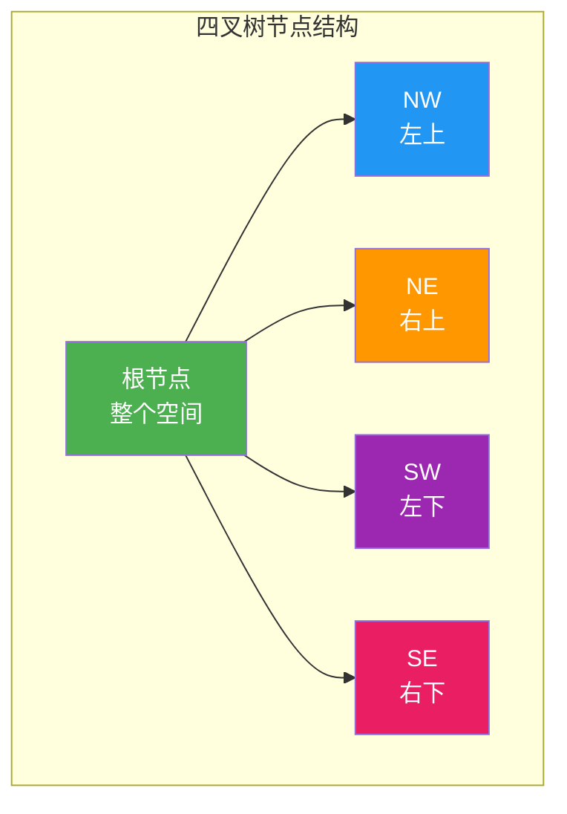
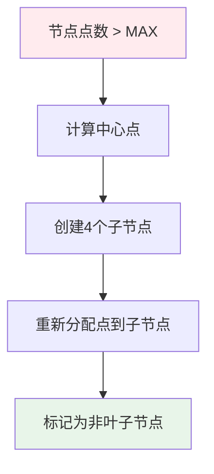
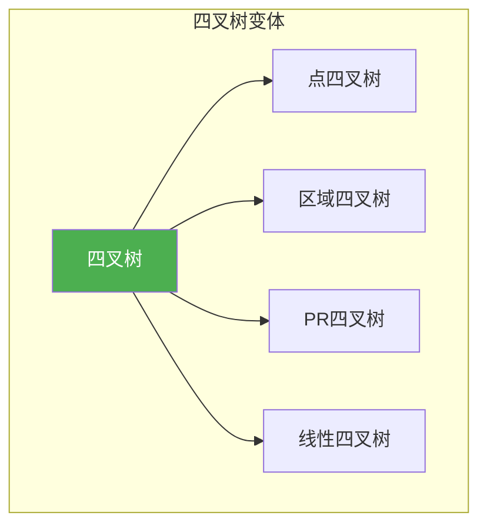

# 四叉树与八叉树

## 概述

四叉树（Quadtree）和八叉树（Octree）是用于空间划分的树形数据结构。四叉树将2D空间递归划分为四个象限，八叉树将3D空间递归划分为八个卦限，广泛应用于图像处理、游戏开发、空间索引等领域。

<div style="background: #E3F2FD; border-left: 4px solid #2196F3; padding: 12px; margin: 10px 0;">
<strong>核心思想</strong>：当节点包含的对象超过阈值时，将空间均匀分割成 2^d 个子区域（d为维度），每个子区域对应一个子节点，直到满足停止条件。
</div>

## 四叉树

### 四叉树结构可视化

**空间划分过程**：

<div style="background: #F5F5F5; border-radius: 8px; padding: 20px; margin: 10px 0;">
<div style="display: grid; gap: 15px;">
<div>
<p style="margin: 0 0 8px 0; font-weight: bold;">原始空间</p>
<svg width="320" height="160" viewBox="0 0 320 160">
  <rect x="10" y="10" width="300" height="140" fill="#fafafa" stroke="#bdbdbd" stroke-width="2"/>
  <circle cx="50" cy="40" r="10" fill="#2196F3"/>
  <text x="50" y="60" text-anchor="middle" fill="#2196F3" font-size="12" font-weight="bold">A</text>
  <circle cx="100" cy="40" r="10" fill="#4CAF50"/>
  <text x="100" y="60" text-anchor="middle" fill="#4CAF50" font-size="12" font-weight="bold">B</text>
  <circle cx="150" cy="80" r="10" fill="#FF9800"/>
  <text x="150" y="100" text-anchor="middle" fill="#FF9800" font-size="12" font-weight="bold">C</text>
  <circle cx="220" cy="60" r="10" fill="#9C27B0"/>
  <text x="220" y="80" text-anchor="middle" fill="#9C27B0" font-size="12" font-weight="bold">D</text>
  <circle cx="50" cy="120" r="10" fill="#E91E63"/>
  <text x="50" y="140" text-anchor="middle" fill="#E91E63" font-size="12" font-weight="bold">E</text>
  <circle cx="280" cy="100" r="10" fill="#F44336"/>
  <text x="280" y="120" text-anchor="middle" fill="#F44336" font-size="12" font-weight="bold">F</text>
</svg>
</div>
<div>
<p style="margin: 0 0 8px 0; font-weight: bold; color: #FF9800;">第一次分裂（超过容量4）</p>
<svg width="320" height="160" viewBox="0 0 320 160">
  <rect x="10" y="10" width="150" height="70" fill="#E3F2FD" fill-opacity="0.5" stroke="#2196F3" stroke-width="2"/>
  <rect x="170" y="10" width="140" height="70" fill="#E8F5E9" fill-opacity="0.5" stroke="#4CAF50" stroke-width="2"/>
  <rect x="10" y="90" width="150" height="60" fill="#FFF3E0" fill-opacity="0.5" stroke="#FF9800" stroke-width="2"/>
  <rect x="170" y="90" width="140" height="60" fill="#FFEBEE" fill-opacity="0.5" stroke="#F44336" stroke-width="2"/>
  <circle cx="50" cy="40" r="8" fill="#2196F3"/>
  <circle cx="100" cy="40" r="8" fill="#4CAF50"/>
  <circle cx="150" cy="110" r="8" fill="#FF9800"/>
  <circle cx="220" cy="50" r="8" fill="#9C27B0"/>
  <circle cx="50" cy="115" r="8" fill="#E91E63"/>
  <circle cx="280" cy="115" r="8" fill="#F44336"/>
</svg>
</div>
<div>
<p style="margin: 0 0 8px 0; font-weight: bold; color: #F44336;">继续分裂（左上象限超过容量）</p>
<svg width="320" height="160" viewBox="0 0 320 160">
  <rect x="10" y="10" width="75" height="35" fill="#E3F2FD" fill-opacity="0.5" stroke="#2196F3" stroke-width="2"/>
  <rect x="95" y="10" width="65" height="35" fill="#E8F5E9" fill-opacity="0.5" stroke="#4CAF50" stroke-width="2"/>
  <rect x="10" y="55" width="75" height="25" fill="#FFF3E0" fill-opacity="0.5" stroke="#FF9800" stroke-width="2"/>
  <rect x="95" y="55" width="65" height="25" fill="#FFEBEE" fill-opacity="0.5" stroke="#F44336" stroke-width="2"/>
  <rect x="170" y="10" width="140" height="70" fill="#E8F5E9" fill-opacity="0.3" stroke="#4CAF50" stroke-width="2"/>
  <rect x="10" y="90" width="150" height="60" fill="#FFF3E0" fill-opacity="0.3" stroke="#FF9800" stroke-width="2"/>
  <rect x="170" y="90" width="140" height="60" fill="#FFEBEE" fill-opacity="0.3" stroke="#F44336" stroke-width="2"/>
  <circle cx="50" cy="30" r="6" fill="#2196F3"/>
  <circle cx="120" cy="30" r="6" fill="#4CAF50"/>
  <circle cx="150" cy="110" r="6" fill="#FF9800"/>
  <circle cx="220" cy="50" r="6" fill="#9C27B0"/>
  <circle cx="50" cy="115" r="6" fill="#E91E63"/>
  <circle cx="280" cy="115" r="6" fill="#F44336"/>
</svg>
</div>
</div>
</div>

### 四叉树节点结构



**象限编号**：

<div style="background: #F5F5F5; border-radius: 8px; padding: 20px; margin: 10px 0;">
<svg width="200" height="150" viewBox="0 0 200 150">
  <rect x="10" y="10" width="85" height="60" fill="#E3F2FD" stroke="#2196F3" stroke-width="2"/>
  <text x="52" y="35" text-anchor="middle" fill="#2196F3" font-weight="bold" font-size="14">0 (NW)</text>
  <rect x="105" y="10" width="85" height="60" fill="#E8F5E9" stroke="#4CAF50" stroke-width="2"/>
  <text x="147" y="35" text-anchor="middle" fill="#4CAF50" font-weight="bold" font-size="14">1 (NE)</text>
  <rect x="10" y="80" width="85" height="60" fill="#FFF3E0" stroke="#FF9800" stroke-width="2"/>
  <text x="52" y="115" text-anchor="middle" fill="#FF9800" font-weight="bold" font-size="14">2 (SW)</text>
  <rect x="105" y="80" width="85" height="60" fill="#FFEBEE" stroke="#F44336" stroke-width="2"/>
  <text x="147" y="115" text-anchor="middle" fill="#F44336" font-weight="bold" font-size="14">3 (SE)</text>
</svg>
</div>

### 数据结构定义

```c
#define MAX_POINTS 4    // 节点最大点数

typedef struct {
    double x, y;
} Point2D;

typedef struct {
    double x_min, y_min;
    double x_max, y_max;
} Bounds2D;

typedef struct QuadTreeNode {
    Bounds2D bounds;                 // 节点边界
    Point2D points[MAX_POINTS];      // 存储的点
    int pointCount;                  // 点数量
    int isLeaf;                      // 是否为叶子节点
    struct QuadTreeNode *children[4]; // 四个子节点
} QuadTreeNode;

typedef struct {
    QuadTreeNode *root;
} QuadTree;
```

### 创建四叉树

```c
QuadTreeNode* createQuadNode(Bounds2D bounds) {
    QuadTreeNode *node = (QuadTreeNode*)malloc(sizeof(QuadTreeNode));
    node->bounds = bounds;
    node->pointCount = 0;
    node->isLeaf = 1;
    
    for (int i = 0; i < 4; i++) {
        node->children[i] = NULL;
    }
    
    return node;
}

QuadTree* createQuadTree(double x_min, double y_min, double x_max, double y_max) {
    QuadTree *tree = (QuadTree*)malloc(sizeof(QuadTree));
    Bounds2D bounds = {x_min, y_min, x_max, y_max};
    tree->root = createQuadNode(bounds);
    return tree;
}
```

### 分裂节点

```c
void subdivide(QuadTreeNode *node) {
    double x_mid = (node->bounds.x_min + node->bounds.x_max) / 2;
    double y_mid = (node->bounds.y_min + node->bounds.y_max) / 2;
    
    // 创建四个子节点的边界
    Bounds2D bounds[4] = {
        {node->bounds.x_min, node->bounds.y_min, x_mid, y_mid},      // SW (左下)
        {x_mid, node->bounds.y_min, node->bounds.x_max, y_mid},      // SE (右下)
        {node->bounds.x_min, y_mid, x_mid, node->bounds.y_max},      // NW (左上)
        {x_mid, y_mid, node->bounds.x_max, node->bounds.y_max}       // NE (右上)
    };
    
    // 创建四个子节点
    for (int i = 0; i < 4; i++) {
        node->children[i] = createQuadNode(bounds[i]);
    }
    
    node->isLeaf = 0;
    
    // 将现有点重新分配到子节点
    for (int i = 0; i < node->pointCount; i++) {
        Point2D p = node->points[i];
        int quadrant = 0;
        if (p.x >= x_mid) quadrant += 1;
        if (p.y >= y_mid) quadrant += 2;
        
        node->children[quadrant]->points[node->children[quadrant]->pointCount++] = p;
    }
    
    node->pointCount = 0;
}
```

**分裂过程可视化**：



### 插入操作

```c
int inBounds(Bounds2D bounds, Point2D p) {
    return p.x >= bounds.x_min && p.x <= bounds.x_max &&
           p.y >= bounds.y_min && p.y <= bounds.y_max;
}

void insertQuad(QuadTreeNode *node, Point2D point) {
    // 检查点是否在边界内
    if (!inBounds(node->bounds, point)) return;
    
    if (node->isLeaf) {
        // 如果未满，直接添加
        if (node->pointCount < MAX_POINTS) {
            node->points[node->pointCount++] = point;
            return;
        }
        
        // 已满，分裂节点
        subdivide(node);
    }
    
    // 确定所属象限
    double x_mid = (node->bounds.x_min + node->bounds.x_max) / 2;
    double y_mid = (node->bounds.y_min + node->bounds.y_max) / 2;
    
    int quadrant = 0;
    if (point.x >= x_mid) quadrant += 1;
    if (point.y >= y_mid) quadrant += 2;
    
    // 递归插入到子节点
    insertQuad(node->children[quadrant], point);
}
```

### 范围查询

```c
void rangeQueryQuad(QuadTreeNode *node, Bounds2D query, 
                    Point2D results[], int *count) {
    // 边界不相交，直接返回
    if (node->bounds.x_max < query.x_min || node->bounds.x_min > query.x_max ||
        node->bounds.y_max < query.y_min || node->bounds.y_min > query.y_max) {
        return;
    }
    
    if (node->isLeaf) {
        // 叶子节点：检查每个点
        for (int i = 0; i < node->pointCount; i++) {
            Point2D p = node->points[i];
            if (p.x >= query.x_min && p.x <= query.x_max &&
                p.y >= query.y_min && p.y <= query.y_max) {
                results[(*count)++] = p;
            }
        }
    } else {
        // 非叶子节点：递归查询子节点
        for (int i = 0; i < 4; i++) {
            rangeQueryQuad(node->children[i], query, results, count);
        }
    }
}
```

**范围查询示意**：

<div style="background: #F5F5F5; border-radius: 8px; padding: 20px; margin: 10px 0;">
<p style="font-weight: bold; margin: 0 0 15px 0;">查询区域（虚线框）</p>
<svg width="320" height="200" viewBox="0 0 320 200">
  <rect x="10" y="10" width="145" height="90" fill="#E3F2FD" fill-opacity="0.3" stroke="#2196F3" stroke-width="2"/>
  <rect x="165" y="10" width="145" height="90" fill="#E8F5E9" fill-opacity="0.3" stroke="#4CAF50" stroke-width="2"/>
  <rect x="10" y="110" width="145" height="80" fill="#FFF3E0" fill-opacity="0.3" stroke="#FF9800" stroke-width="2"/>
  <rect x="165" y="110" width="145" height="80" fill="#FFEBEE" fill-opacity="0.3" stroke="#F44336" stroke-width="2"/>
  <!-- 查询区域 -->
  <rect x="20" y="20" width="130" height="160" fill="#E8F5E9" fill-opacity="0.4" stroke="#4CAF50" stroke-width="2" stroke-dasharray="5,3" rx="5"/>
  <circle cx="50" cy="40" r="10" fill="#4CAF50" stroke="#388E3C" stroke-width="2"/>
  <text x="50" y="60" text-anchor="middle" fill="#4CAF50" font-size="12" font-weight="bold">A</text>
  <circle cx="100" cy="50" r="10" fill="#4CAF50" stroke="#388E3C" stroke-width="2"/>
  <text x="100" y="70" text-anchor="middle" fill="#4CAF50" font-size="12" font-weight="bold">B</text>
  <circle cx="80" cy="130" r="10" fill="#4CAF50" stroke="#388E3C" stroke-width="2"/>
  <text x="80" y="150" text-anchor="middle" fill="#4CAF50" font-size="12" font-weight="bold">C</text>
  <circle cx="50" cy="170" r="10" fill="#9E9E9E"/>
  <text x="50" y="190" text-anchor="middle" fill="#757575" font-size="12" font-weight="bold">E</text>
  <circle cx="220" cy="50" r="10" fill="#9E9E9E"/>
  <text x="220" y="70" text-anchor="middle" fill="#757575" font-size="12" font-weight="bold">D</text>
  <circle cx="280" cy="150" r="10" fill="#9E9E9E"/>
  <text x="280" y="170" text-anchor="middle" fill="#757575" font-size="12" font-weight="bold">F</text>
</svg>
<div style="margin-top: 10px; padding: 10px; background: #E8F5E9; border-radius: 4px; text-align: center;">
<strong style="color: #4CAF50;">结果: A, B, C</strong> <span style="color: #666;">（查询区域内的点）</span>
</div>
</div>

## 八叉树

### 八叉树结构可视化

**3D空间划分**：

<div style="background: #F5F5F5; border-radius: 8px; padding: 20px; margin: 10px 0;">
<p style="font-weight: bold; margin: 0 0 15px 0;">3D空间分裂与卦限编号</p>
<svg width="300" height="250" viewBox="0 0 300 250">
  <!-- 3D立方体 -->
  <!-- 后面 -->
  <polygon points="50,80 150,80 150,200 50,200" fill="#E3F2FD" fill-opacity="0.3" stroke="#2196F3" stroke-width="2"/>
  <!-- 前面 -->
  <polygon points="100,40 200,40 200,160 100,160" fill="#E8F5E9" fill-opacity="0.3" stroke="#4CAF50" stroke-width="2"/>
  <!-- 连接线 -->
  <line x1="50" y1="80" x2="100" y2="40" stroke="#bdbdbd" stroke-width="2"/>
  <line x1="150" y1="80" x2="200" y2="40" stroke="#bdbdbd" stroke-width="2"/>
  <line x1="150" y1="200" x2="200" y2="160" stroke="#bdbdbd" stroke-width="2"/>
  <line x1="50" y1="200" x2="100" y2="160" stroke="#bdbdbd" stroke-width="2"/>
  <!-- 分割线 -->
  <line x1="100" y1="120" x2="175" y2="100" stroke="#FF9800" stroke-width="2" stroke-dasharray="4,2"/>
  <line x1="100" y1="120" x2="75" y2="140" stroke="#FF9800" stroke-width="2" stroke-dasharray="4,2"/>
  <!-- 卦限标注 -->
  <text x="70" y="150" fill="#2196F3" font-size="12" font-weight="bold">0</text>
  <text x="130" y="100" fill="#4CAF50" font-size="12" font-weight="bold">1</text>
  <text x="160" y="150" fill="#FF9800" font-size="12" font-weight="bold">2</text>
  <text x="180" y="100" fill="#F44336" font-size="12" font-weight="bold">3</text>
  <text x="70" y="180" fill="#9C27B0" font-size="12" font-weight="bold">4</text>
  <text x="130" y="130" fill="#E91E63" font-size="12" font-weight="bold">5</text>
  <text x="160" y="180" fill="#00BCD4" font-size="12" font-weight="bold">6</text>
  <text x="180" y="130" fill="#FF5722" font-size="12" font-weight="bold">7</text>
</svg>
<div style="display: grid; grid-template-columns: repeat(2, 1fr); gap: 8px; font-size: 12px; margin-top: 15px;">
<div style="padding: 8px; background: #E3F2FD; border-radius: 4px;"><strong>0:</strong> 左下后 (x&lt;mid, y&lt;mid, z&lt;mid)</div>
<div style="padding: 8px; background: #E8F5E9; border-radius: 4px;"><strong>1:</strong> 左下前 (x&lt;mid, y&lt;mid, z&gt;mid)</div>
<div style="padding: 8px; background: #FFF3E0; border-radius: 4px;"><strong>2:</strong> 右下后 (x&gt;mid, y&lt;mid, z&lt;mid)</div>
<div style="padding: 8px; background: #FFEBEE; border-radius: 4px;"><strong>3:</strong> 右下前 (x&gt;mid, y&lt;mid, z&gt;mid)</div>
<div style="padding: 8px; background: #F3E5F5; border-radius: 4px;"><strong>4:</strong> 左上后 (x&lt;mid, y&gt;mid, z&lt;mid)</div>
<div style="padding: 8px; background: #FCE4EC; border-radius: 4px;"><strong>5:</strong> 左上前 (x&lt;mid, y&gt;mid, z&gt;mid)</div>
<div style="padding: 8px; background: #E0F7FA; border-radius: 4px;"><strong>6:</strong> 右上后 (x&gt;mid, y&gt;mid, z&lt;mid)</div>
<div style="padding: 8px; background: #FBE9E7; border-radius: 4px;"><strong>7:</strong> 右上前 (x&gt;mid, y&gt;mid, z&gt;mid)</div>
</div>
</div>

### 数据结构定义

```c
typedef struct {
    double x, y, z;
} Point3D;

typedef struct {
    double x_min, y_min, z_min;
    double x_max, y_max, z_max;
} Bounds3D;

typedef struct OctTreeNode {
    Bounds3D bounds;                 // 节点边界
    Point3D points[MAX_POINTS];      // 存储的点
    int pointCount;                  // 点数量
    int isLeaf;                      // 是否为叶子节点
    struct OctTreeNode *children[8]; // 八个子节点
} OctTreeNode;

typedef struct {
    OctTreeNode *root;
} OctTree;
```

### 创建八叉树节点

```c
OctTreeNode* createOctNode(Bounds3D bounds) {
    OctTreeNode *node = (OctTreeNode*)malloc(sizeof(OctTreeNode));
    node->bounds = bounds;
    node->pointCount = 0;
    node->isLeaf = 1;
    
    for (int i = 0; i < 8; i++) {
        node->children[i] = NULL;
    }
    
    return node;
}

OctTree* createOctTree(double x_min, double y_min, double z_min,
                       double x_max, double y_max, double z_max) {
    OctTree *tree = (OctTree*)malloc(sizeof(OctTree));
    Bounds3D bounds = {x_min, y_min, z_min, x_max, y_max, z_max};
    tree->root = createOctNode(bounds);
    return tree;
}
```

### 分裂八叉树节点

```c
void subdivideOct(OctTreeNode *node) {
    double x_mid = (node->bounds.x_min + node->bounds.x_max) / 2;
    double y_mid = (node->bounds.y_min + node->bounds.y_max) / 2;
    double z_mid = (node->bounds.z_min + node->bounds.z_max) / 2;
    
    // 创建八个子节点
    for (int i = 0; i < 8; i++) {
        Bounds3D b;
        b.x_min = (i & 1) ? x_mid : node->bounds.x_min;
        b.x_max = (i & 1) ? node->bounds.x_max : x_mid;
        b.y_min = (i & 2) ? y_mid : node->bounds.y_min;
        b.y_max = (i & 2) ? node->bounds.y_max : y_mid;
        b.z_min = (i & 4) ? z_mid : node->bounds.z_min;
        b.z_max = (i & 4) ? node->bounds.z_max : z_mid;
        
        node->children[i] = createOctNode(b);
    }
    
    node->isLeaf = 0;
    
    // 重新分配点到子节点
    for (int i = 0; i < node->pointCount; i++) {
        Point3D p = node->points[i];
        int octant = 0;
        if (p.x >= x_mid) octant |= 1;
        if (p.y >= y_mid) octant |= 2;
        if (p.z >= z_mid) octant |= 4;
        
        node->children[octant]->points[node->children[octant]->pointCount++] = p;
    }
    
    node->pointCount = 0;
}
```

### 八叉树插入

```c
void insertOct(OctTreeNode *node, Point3D point) {
    if (!inBounds3D(node->bounds, point)) return;
    
    if (node->isLeaf) {
        if (node->pointCount < MAX_POINTS) {
            node->points[node->pointCount++] = point;
            return;
        }
        subdivideOct(node);
    }
    
    double x_mid = (node->bounds.x_min + node->bounds.x_max) / 2;
    double y_mid = (node->bounds.y_min + node->bounds.y_max) / 2;
    double z_mid = (node->bounds.z_min + node->bounds.z_max) / 2;
    
    int octant = 0;
    if (point.x >= x_mid) octant |= 1;
    if (point.y >= y_mid) octant |= 2;
    if (point.z >= z_mid) octant |= 4;
    
    insertOct(node->children[octant], point);
}
```

## C++ 实现

```cpp
#include <vector>
#include <memory>
#include <array>

class QuadTree {
private:
    static const int MAX_POINTS = 4;
    
    struct Point { double x, y; };
    struct Bounds { double x_min, y_min, x_max, y_max; };
    
    struct Node {
        Bounds bounds;
        std::vector<Point> points;
        std::array<std::unique_ptr<Node>, 4> children;
        bool isLeaf;
        
        Node(Bounds b) : bounds(b), isLeaf(true) {}
    };
    
    std::unique_ptr<Node> root;
    
    void subdivide(Node* node) {
        double x_mid = (node->bounds.x_min + node->bounds.x_max) / 2;
        double y_mid = (node->bounds.y_min + node->bounds.y_max) / 2;
        
        std::array<Bounds, 4> bounds = {{
            {node->bounds.x_min, node->bounds.y_min, x_mid, y_mid},
            {x_mid, node->bounds.y_min, node->bounds.x_max, y_mid},
            {node->bounds.x_min, y_mid, x_mid, node->bounds.y_max},
            {x_mid, y_mid, node->bounds.x_max, node->bounds.y_max}
        }};
        
        for (int i = 0; i < 4; i++) {
            node->children[i] = std::make_unique<Node>(bounds[i]);
        }
        
        node->isLeaf = false;
        
        for (const auto& p : node->points) {
            int quadrant = 0;
            if (p.x >= x_mid) quadrant |= 1;
            if (p.y >= y_mid) quadrant |= 2;
            node->children[quadrant]->points.push_back(p);
        }
        
        node->points.clear();
    }
    
    void insert(Node* node, const Point& point) {
        if (!inBounds(node->bounds, point)) return;
        
        if (node->isLeaf) {
            if (node->points.size() < MAX_POINTS) {
                node->points.push_back(point);
                return;
            }
            subdivide(node);
        }
        
        double x_mid = (node->bounds.x_min + node->bounds.x_max) / 2;
        double y_mid = (node->bounds.y_min + node->bounds.y_max) / 2;
        
        int quadrant = 0;
        if (point.x >= x_mid) quadrant |= 1;
        if (point.y >= y_mid) quadrant |= 2;
        
        insert(node->children[quadrant].get(), point);
    }
    
    void rangeQuery(Node* node, const Bounds& query, std::vector<Point>& results) {
        if (!intersects(node->bounds, query)) return;
        
        if (node->isLeaf) {
            for (const auto& p : node->points) {
                if (inBounds(query, p)) {
                    results.push_back(p);
                }
            }
        } else {
            for (int i = 0; i < 4; i++) {
                rangeQuery(node->children[i].get(), query, results);
            }
        }
    }
    
public:
    QuadTree(double x_min, double y_min, double x_max, double y_max) {
        root = std::make_unique<Node>(Bounds{x_min, y_min, x_max, y_max});
    }
    
    void insert(double x, double y) {
        insert(root.get(), {x, y});
    }
    
    std::vector<Point> rangeQuery(double x_min, double y_min, double x_max, double y_max) {
        std::vector<Point> results;
        rangeQuery(root.get(), Bounds{x_min, y_min, x_max, y_max}, results);
        return results;
    }
};
```

## 四叉树/八叉树变体

| 变体 | 特点 | 应用 |
|------|------|------|
| 点四叉树 | 存储点数据 | 空间索引 |
| 区域四叉树 | 存储区域信息 | 图像处理 |
| 边四叉树 | 存储边界信息 | 地理信息系统 |
| PR四叉树 | 点区域四叉树 | 数据库索引 |
| 线性四叉树 | 用编码表示节点 | 压缩存储 |



## 时间复杂度

### 四叉树

| 操作 | 平均 | 最坏 | 说明 |
|------|------|------|------|
| 插入 | O(log n) | O(n) | 依赖点分布 |
| 删除 | O(log n) | O(n) | |
| 范围查询 | O(log n + m) | O(n) | m为结果数 |
| 最近邻 | O(log n) | O(n) | |

### 八叉树

| 操作 | 平均 | 最坏 | 说明 |
|------|------|------|------|
| 插入 | O(log n) | O(n) | |
| 范围查询 | O(log n + m) | O(n) | |
| 最近邻 | O(log n) | O(n) | |

<div style="background: #FFF3E0; border-left: 4px solid #FF9800; padding: 12px; margin: 10px 0;">
<strong>性能依赖</strong>：四叉树/八叉树的性能高度依赖数据分布。点均匀分布时效率最高，点聚集时可能退化为线性结构。
</div>

## 空间复杂度

| 结构 | 空间复杂度 | 说明 |
|------|-----------|------|
| 四叉树 | O(n) | n为点数 |
| 八叉树 | O(n) | n为点数 |
| 最大深度 | O(log n) | 点均匀分布 |

## 应用场景

### 四叉树应用

| 应用领域 | 具体场景 |
|---------|---------|
| 图像处理 | 图像压缩、区域分割 |
| 地形渲染 | LOD（细节层次）管理 |
| 碰撞检测 | 2D空间物体检测 |
| 地理信息系统 | 空间索引、地图渲染 |
| 游戏 | 视锥剔除、地形管理 |

### 八叉树应用

| 应用领域 | 具体场景 |
|---------|---------|
| 点云处理 | 点云压缩、法向量估计 |
| 3D碰撞检测 | 空间划分、碰撞检测 |
| 体素渲染 | 体素数据管理 |
| 3D图形 | 视锥剔除、LOD |
| 医学影像 | CT/MRI数据处理 |

## 四叉树 vs 八叉树 vs 其他结构

| 结构 | 维度 | 子节点数 | 优势 | 劣势 |
|------|------|---------|------|------|
| 四叉树 | 2D | 4 | 简单、高效 | 仅限2D |
| 八叉树 | 3D | 8 | 适合3D | 高维扩展差 |
| KD树 | 任意 | 2 | 维度无关 | 动态更新难 |
| R树 | 任意 | M | 动态更新 | 实现复杂 |

<div style="background: #E8F5E9; border-left: 4px solid #4CAF50; padding: 12px; margin: 10px 0;">
<strong>选择建议</strong>：2D空间优先选择四叉树，3D空间选择八叉树，更高维度或动态更新频繁时选择R树或KD树。
</div>

## 实际应用示例

### 图像压缩（区域四叉树）

<div style="background: #F5F5F5; border-radius: 8px; padding: 20px; margin: 10px 0;">
<div style="display: flex; gap: 40px; align-items: center; justify-content: center;">
<div style="text-align: center;">
<p style="margin: 0 0 10px 0; font-weight: bold;">原始图像</p>
<svg width="120" height="120" viewBox="0 0 120 120">
  <rect x="10" y="10" width="45" height="45" fill="#424242" stroke="#bdbdbd" stroke-width="2"/>
  <rect x="65" y="10" width="45" height="45" fill="#fafafa" stroke="#bdbdbd" stroke-width="2"/>
  <rect x="10" y="65" width="45" height="45" fill="#fafafa" stroke="#bdbdbd" stroke-width="2"/>
  <rect x="65" y="65" width="45" height="45" fill="#fafafa" stroke="#bdbdbd" stroke-width="2"/>
</svg>
</div>
<div style="font-size: 24px; color: #4CAF50;">→</div>
<div style="text-align: center;">
<p style="margin: 0 0 10px 0; font-weight: bold;">压缩后</p>
<svg width="120" height="120" viewBox="0 0 120 120">
  <rect x="10" y="10" width="45" height="45" fill="#4CAF50" stroke="#388E3C" stroke-width="2"/>
  <text x="32" y="40" text-anchor="middle" fill="white" font-weight="bold" font-size="18">1</text>
  <rect x="65" y="10" width="45" height="45" fill="#E8F5E9" stroke="#4CAF50" stroke-width="2"/>
  <text x="87" y="40" text-anchor="middle" fill="#4CAF50" font-weight="bold" font-size="18">0</text>
  <rect x="10" y="65" width="45" height="45" fill="#E8F5E9" stroke="#4CAF50" stroke-width="2"/>
  <text x="32" y="95" text-anchor="middle" fill="#4CAF50" font-weight="bold" font-size="18">0</text>
  <rect x="65" y="65" width="45" height="45" fill="#E8F5E9" stroke="#4CAF50" stroke-width="2"/>
  <text x="87" y="95" text-anchor="middle" fill="#4CAF50" font-weight="bold" font-size="18">0</text>
</svg>
</div>
</div>
<div style="margin-top: 15px; text-align: center; font-size: 13px;">
<span style="padding: 4px 12px; background: #424242; color: white; border-radius: 4px; margin-right: 10px;">1: 黑色区域</span>
<span style="padding: 4px 12px; background: #fafafa; color: #424242; border: 1px solid #bdbdbd; border-radius: 4px;">0: 白色区域</span>
</div>
</div>

### 点云压缩（八叉树）

```cpp
// 点云体素化
class PointCloudOctree {
    OctTree tree;
    double voxelSize;
    
public:
    void addPoint(double x, double y, double z) {
        // 体素化坐标
        int vx = floor(x / voxelSize);
        int vy = floor(y / voxelSize);
        int vz = floor(z / voxelSize);
        
        // 插入到八叉树
        tree.insert(vx * voxelSize, vy * voxelSize, vz * voxelSize);
    }
};
```

### 地形LOD（四叉树）

<div style="background: #F5F5F5; border-radius: 8px; padding: 20px; margin: 10px 0;">
<p style="font-weight: bold; margin: 0 0 15px 0;">地形渲染LOD</p>
<div style="display: flex; gap: 40px; align-items: center; justify-content: center;">
<div style="text-align: center;">
<p style="margin: 0 0 10px 0; font-weight: bold; color: #2196F3;">近距离（高细节）</p>
<svg width="140" height="140" viewBox="0 0 140 140">
  <rect x="10" y="10" width="25" height="25" fill="#E3F2FD" stroke="#2196F3" stroke-width="2"/>
  <rect x="40" y="10" width="25" height="25" fill="#E3F2FD" stroke="#2196F3" stroke-width="2"/>
  <rect x="70" y="10" width="25" height="25" fill="#E3F2FD" stroke="#2196F3" stroke-width="2"/>
  <rect x="100" y="10" width="25" height="25" fill="#E3F2FD" stroke="#2196F3" stroke-width="2"/>
  <rect x="10" y="40" width="25" height="25" fill="#E3F2FD" stroke="#2196F3" stroke-width="2"/>
  <rect x="40" y="40" width="25" height="25" fill="#E3F2FD" stroke="#2196F3" stroke-width="2"/>
  <rect x="70" y="40" width="25" height="25" fill="#E3F2FD" stroke="#2196F3" stroke-width="2"/>
  <rect x="100" y="40" width="25" height="25" fill="#E3F2FD" stroke="#2196F3" stroke-width="2"/>
  <rect x="10" y="70" width="25" height="25" fill="#E3F2FD" stroke="#2196F3" stroke-width="2"/>
  <rect x="40" y="70" width="25" height="25" fill="#E3F2FD" stroke="#2196F3" stroke-width="2"/>
  <rect x="70" y="70" width="25" height="25" fill="#E3F2FD" stroke="#2196F3" stroke-width="2"/>
  <rect x="100" y="70" width="25" height="25" fill="#E3F2FD" stroke="#2196F3" stroke-width="2"/>
  <rect x="10" y="100" width="25" height="25" fill="#E3F2FD" stroke="#2196F3" stroke-width="2"/>
  <rect x="40" y="100" width="25" height="25" fill="#E3F2FD" stroke="#2196F3" stroke-width="2"/>
  <rect x="70" y="100" width="25" height="25" fill="#E3F2FD" stroke="#2196F3" stroke-width="2"/>
  <rect x="100" y="100" width="25" height="25" fill="#E3F2FD" stroke="#2196F3" stroke-width="2"/>
</svg>
</div>
<div style="font-size: 24px; color: #4CAF50;">→</div>
<div style="text-align: center;">
<p style="margin: 0 0 10px 0; font-weight: bold; color: #FF9800;">远距离（低细节）</p>
<svg width="140" height="140" viewBox="0 0 140 140">
  <rect x="10" y="10" width="85" height="85" fill="#FFF3E0" stroke="#FF9800" stroke-width="2"/>
  <rect x="100" y="10" width="25" height="55" fill="#FFF3E0" stroke="#FF9800" stroke-width="2"/>
  <rect x="100" y="70" width="25" height="55" fill="#FFF3E0" stroke="#FF9800" stroke-width="2"/>
  <rect x="10" y="100" width="85" height="25" fill="#FFF3E0" stroke="#FF9800" stroke-width="2"/>
</svg>
</div>
</div>
</div>

## 参考资料

- Finkel, R. A., Bentley, J. L. (1974). Quad Trees: A Data Structure for Retrieval on Composite Keys
- Samet, H. (1990). The Design and Analysis of Spatial Data Structures
- Meagher, D. (1982). Geometric Modeling Using Octree Encoding
