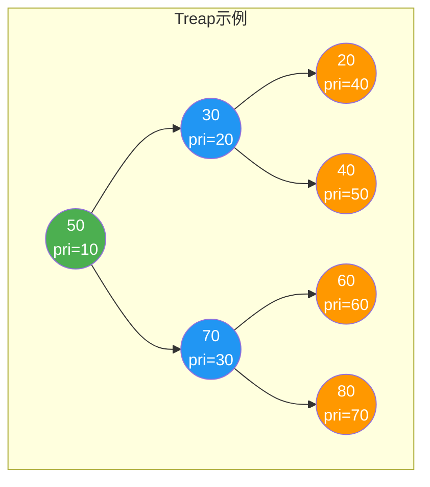
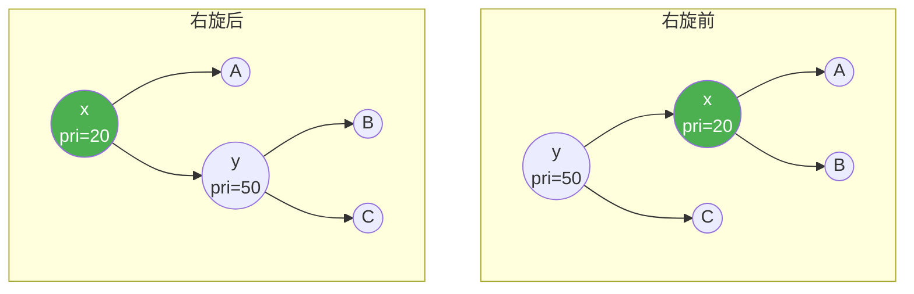
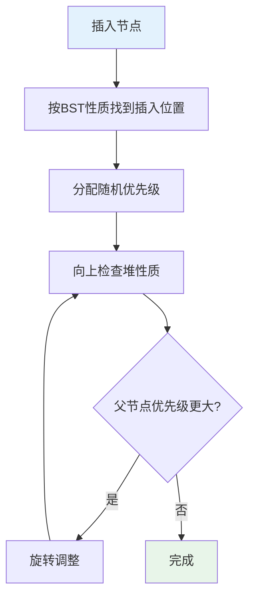
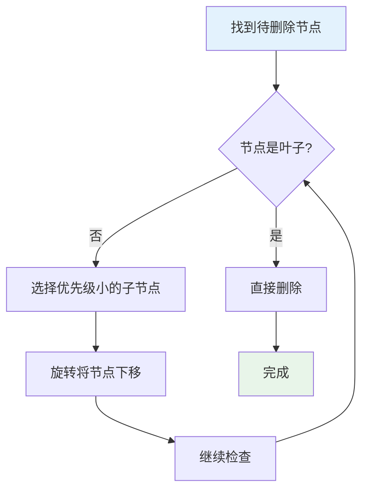
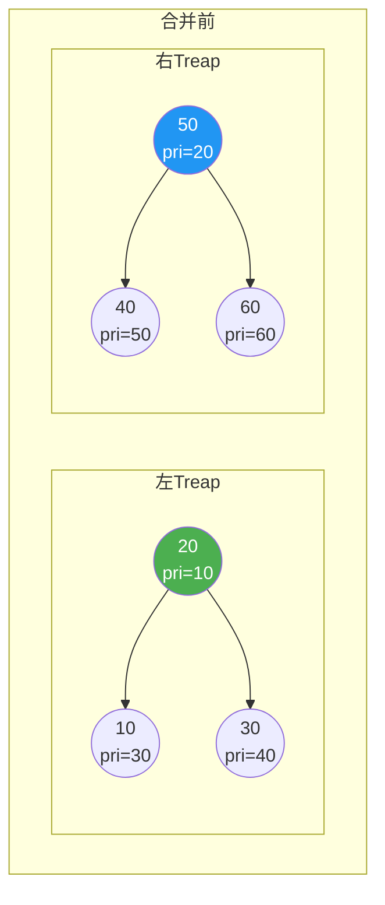
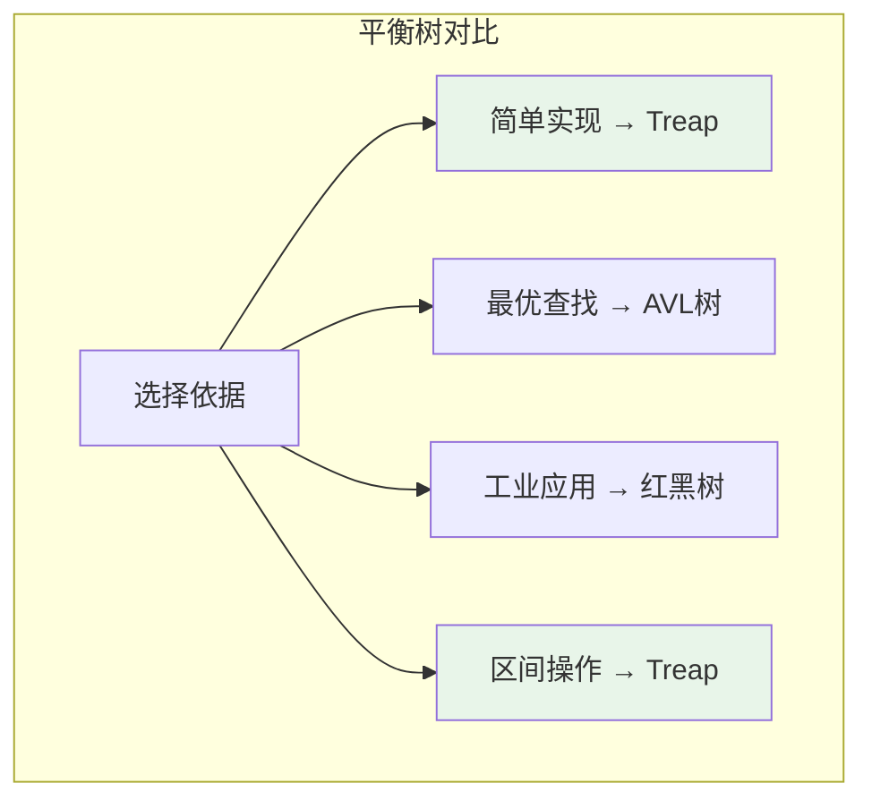

# Treap（树堆）

## 概述

Treap（Tree + Heap）是二叉搜索树（BST）和堆（Heap）的结合体。每个节点同时存储一个键值（key）和一个随机优先级（priority），键值满足BST性质，优先级满足堆性质。通过随机优先级实现概率平衡，期望树高为 O(log n)。

<div style="background: #E3F2FD; border-left: 4px solid #2196F3; padding: 12px; margin: 10px 0;">
<strong>核心思想</strong>：键值决定节点的BST位置，优先级决定节点的堆位置。通过随机优先级，避免了复杂的平衡操作，实现简单且效率高。
</div>

## Treap特点

| 特性 | 说明 |
|------|------|
| BST性质 | 左子树键值 < 根键值 < 右子树键值 |
| 堆性质 | 父节点优先级 ≤ 子节点优先级（小根堆） |
| 随机平衡 | 优先级随机分配，期望高度 O(log n) |
| 简单实现 | 无需复杂旋转判断，相比AVL、红黑树更简单 |
| 分裂合并 | 支持高效的分裂和合并操作 |

## Treap结构可视化

### BST性质与堆性质

<div style="background: #F5F5F5; border-radius: 8px; padding: 20px; margin: 10px 0;">
<div style="text-align: center; font-weight: bold; margin-bottom: 15px;">Treap节点结构</div>
<div style="display: flex; justify-content: center;">
<div style="background: #E3F2FD; border: 2px solid #2196F3; border-radius: 8px; padding: 15px 25px;">
<div style="font-family: monospace; font-size: 14px;">
<div><strong>key = 50</strong> <span style="color: #2196F3;">← 键值（满足BST性质）</span></div>
<div><strong>pri = 30</strong> <span style="color: #2196F3;">← 优先级（满足堆性质）</span></div>
</div>
</div>
</div>
</div>

**一个有效的Treap**：



**验证**：
- BST性质：中序遍历 = 20, 30, 40, 50, 60, 70, 80（有序）✓
- 堆性质：优先级从上到下递增 ✓

<div style="background: #E8F5E9; border-left: 4px solid #4CAF50; padding: 12px; margin: 10px 0;">
<strong>关键观察</strong>：优先级决定树的形状。当所有优先级互不相同且随机时，Treap的期望高度为 O(log n)。
</div>

## 数据结构

```c
#include <stdlib.h>
#include <time.h>

typedef struct TreapNode {
    int key;                      // 键值（BST性质）
    int priority;                 // 优先级（堆性质）
    struct TreapNode *left;
    struct TreapNode *right;
} TreapNode;

typedef struct {
    TreapNode *root;
} Treap;
```

## 创建节点

```c
TreapNode* createTreapNode(int key) {
    TreapNode *node = (TreapNode*)malloc(sizeof(TreapNode));
    node->key = key;
    node->priority = rand();      // 随机优先级
    node->left = NULL;
    node->right = NULL;
    return node;
}

Treap* createTreap() {
    Treap *treap = (Treap*)malloc(sizeof(Treap));
    treap->root = NULL;
    srand(time(NULL));           // 初始化随机种子
    return treap;
}
```

## 旋转操作

### 右旋（维护堆性质）

<div style="background: #F5F5F5; border-radius: 8px; padding: 20px; margin: 10px 0;">
<div style="display: flex; justify-content: space-around; align-items: center;">
<div style="text-align: center;">
<div style="font-weight: bold; margin-bottom: 10px;">旋转前</div>
<div style="display: inline-block;">
<div style="background: #FF9800; color: white; padding: 8px 15px; border-radius: 4px; margin-bottom: 5px;">y</div>
<div style="display: flex; justify-content: center; gap: 20px;">
<div>
<div style="background: #4CAF50; color: white; padding: 8px 15px; border-radius: 4px; margin-bottom: 5px;">x</div>
<div style="display: flex; gap: 10px;">
<div style="background: #E3F2FD; padding: 5px 10px; border-radius: 4px;">A</div>
<div style="background: #E3F2FD; padding: 5px 10px; border-radius: 4px;">B</div>
</div>
</div>
<div style="background: #E3F2FD; padding: 8px 15px; border-radius: 4px;">C</div>
</div>
</div>
</div>
<div style="font-size: 24px; color: #2196F3;">→</div>
<div style="text-align: center;">
<div style="font-weight: bold; margin-bottom: 10px;">旋转后</div>
<div style="display: inline-block;">
<div style="background: #4CAF50; color: white; padding: 8px 15px; border-radius: 4px; margin-bottom: 5px;">x</div>
<div style="display: flex; justify-content: center; gap: 20px;">
<div style="background: #E3F2FD; padding: 8px 15px; border-radius: 4px;">A</div>
<div>
<div style="background: #FF9800; color: white; padding: 8px 15px; border-radius: 4px; margin-bottom: 5px;">y</div>
<div style="display: flex; gap: 10px;">
<div style="background: #E3F2FD; padding: 5px 10px; border-radius: 4px;">B</div>
<div style="background: #E3F2FD; padding: 5px 10px; border-radius: 4px;">C</div>
</div>
</div>
</div>
</div>
</div>
</div>
<div style="background: #FFF3E0; border-left: 4px solid #FF9800; padding: 12px; margin: 10px 0;">
<strong>条件</strong>：x.priority < y.priority（违反小根堆性质）
</div>
</div>

### 左旋（维护堆性质）

<div style="background: #F5F5F5; border-radius: 8px; padding: 20px; margin: 10px 0;">
<div style="display: flex; justify-content: space-around; align-items: center;">
<div style="text-align: center;">
<div style="font-weight: bold; margin-bottom: 10px;">旋转前</div>
<div style="display: inline-block;">
<div style="background: #FF9800; color: white; padding: 8px 15px; border-radius: 4px; margin-bottom: 5px;">x</div>
<div style="display: flex; justify-content: center; gap: 20px;">
<div style="background: #E3F2FD; padding: 8px 15px; border-radius: 4px;">A</div>
<div>
<div style="background: #4CAF50; color: white; padding: 8px 15px; border-radius: 4px; margin-bottom: 5px;">y</div>
<div style="display: flex; gap: 10px;">
<div style="background: #E3F2FD; padding: 5px 10px; border-radius: 4px;">B</div>
<div style="background: #E3F2FD; padding: 5px 10px; border-radius: 4px;">C</div>
</div>
</div>
</div>
</div>
</div>
<div style="font-size: 24px; color: #2196F3;">→</div>
<div style="text-align: center;">
<div style="font-weight: bold; margin-bottom: 10px;">旋转后</div>
<div style="display: inline-block;">
<div style="background: #4CAF50; color: white; padding: 8px 15px; border-radius: 4px; margin-bottom: 5px;">y</div>
<div style="display: flex; justify-content: center; gap: 20px;">
<div>
<div style="background: #FF9800; color: white; padding: 8px 15px; border-radius: 4px; margin-bottom: 5px;">x</div>
<div style="display: flex; gap: 10px;">
<div style="background: #E3F2FD; padding: 5px 10px; border-radius: 4px;">A</div>
<div style="background: #E3F2FD; padding: 5px 10px; border-radius: 4px;">B</div>
</div>
</div>
<div style="background: #E3F2FD; padding: 8px 15px; border-radius: 4px;">C</div>
</div>
</div>
</div>
</div>
<div style="background: #FFF3E0; border-left: 4px solid #FF9800; padding: 12px; margin: 10px 0;">
<strong>条件</strong>：y.priority < x.priority（违反小根堆性质）
</div>
</div>

**旋转示意**：



### 实现代码

```c
TreapNode* rotateRight(TreapNode *y) {
    TreapNode *x = y->left;
    y->left = x->right;
    x->right = y;
    return x;
}

TreapNode* rotateLeft(TreapNode *x) {
    TreapNode *y = x->right;
    x->right = y->left;
    y->left = x;
    return y;
}
```

## 插入操作

### 插入流程



### 插入示例

<div style="background: #F5F5F5; border-radius: 8px; padding: 20px; margin: 10px 0;">
<div style="background: #E8F5E9; border-left: 4px solid #4CAF50; padding: 12px; margin-bottom: 15px;">
<strong>插入键值 35，随机优先级 = 15</strong>
</div>
<div style="margin-bottom: 20px;">
<div style="font-weight: bold; color: #2196F3; margin-bottom: 10px;">步骤1: 按BST性质找到位置（作为30的右子节点）</div>
<div style="text-align: center; font-family: monospace; background: white; padding: 15px; border-radius: 8px;">
<pre style="margin: 0;">        50(pri=10)
       /        \
    30(pri=20)  70(pri=30)
    /    \
  20(40) 40(50)
         /
       <span style="color: #4CAF50; font-weight: bold;">35(15)  ← 新节点</span></pre>
</div>
</div>
<div style="margin-bottom: 20px;">
<div style="font-weight: bold; color: #FF9800; margin-bottom: 10px;">步骤2: 检查堆性质，35的优先级15 < 40的优先级50，左旋调整</div>
<div style="text-align: center; font-family: monospace; background: white; padding: 15px; border-radius: 8px;">
<pre style="margin: 0;">        50(pri=10)
       /        \
    30(pri=20)  70(pri=30)
    /    \
  20(40) <span style="color: #4CAF50; font-weight: bold;">35(15)  ← 已上移</span>
           \
           <span style="color: #FF9800;">40(50)  ← 已下移</span></pre>
</div>
</div>
<div>
<div style="font-weight: bold; color: #FF9800; margin-bottom: 10px;">步骤3: 继续检查，35的优先级15 < 30的优先级20，右旋调整</div>
<div style="text-align: center; font-family: monospace; background: white; padding: 15px; border-radius: 8px;">
<pre style="margin: 0;">        50(pri=10)
       /        \
    <span style="color: #4CAF50; font-weight: bold;">35(pri=15)</span>  70(pri=30)  ← 最终位置
    /    \
  30(20) 40(50)
  /
20(40)</pre>
</div>
</div>
</div>

### 实现代码

```c
TreapNode* insertTreap(TreapNode *root, int key) {
    // 空节点，创建新节点
    if (root == NULL) {
        return createTreapNode(key);
    }
    
    // 按BST性质插入
    if (key <= root->key) {
        root->left = insertTreap(root->left, key);
        
        // 检查堆性质，若违反则右旋
        if (root->left->priority < root->priority) {
            root = rotateRight(root);
        }
    } else {
        root->right = insertTreap(root->right, key);
        
        // 检查堆性质，若违反则左旋
        if (root->right->priority < root->priority) {
            root = rotateLeft(root);
        }
    }
    
    return root;
}

void insert(Treap *treap, int key) {
    treap->root = insertTreap(treap->root, key);
}
```

## 删除操作

### 删除策略

将待删除节点旋转到叶子节点，然后直接删除：



### 实现代码

```c
TreapNode* deleteTreap(TreapNode *root, int key) {
    if (root == NULL) return NULL;
    
    if (key < root->key) {
        root->left = deleteTreap(root->left, key);
    } else if (key > root->key) {
        root->right = deleteTreap(root->right, key);
    } else {
        // 找到待删除节点
        if (root->left == NULL) {
            TreapNode *temp = root->right;
            free(root);
            return temp;
        }
        if (root->right == NULL) {
            TreapNode *temp = root->left;
            free(root);
            return temp;
        }
        
        // 选择优先级小的子节点进行旋转
        if (root->left->priority < root->right->priority) {
            root = rotateRight(root);
            root->right = deleteTreap(root->right, key);
        } else {
            root = rotateLeft(root);
            root->left = deleteTreap(root->left, key);
        }
    }
    
    return root;
}

void delete(Treap *treap, int key) {
    treap->root = deleteTreap(treap->root, key);
}
```

## 查找操作

```c
TreapNode* searchTreap(TreapNode *root, int key) {
    if (root == NULL || root->key == key) {
        return root;
    }
    
    if (key < root->key) {
        return searchTreap(root->left, key);
    }
    return searchTreap(root->right, key);
}

TreapNode* search(Treap *treap, int key) {
    return searchTreap(treap->root, key);
}
```

## 分裂操作

将Treap按键值k分裂为两部分：键值≤k的和键值>k的。

```c
void split(TreapNode *root, int key, TreapNode **left, TreapNode **right) {
    if (root == NULL) {
        *left = NULL;
        *right = NULL;
        return;
    }
    
    if (key < root->key) {
        // 当前节点属于右部分
        split(root->left, key, left, &root->left);
        *right = root;
    } else {
        // 当前节点属于左部分
        split(root->right, key, &root->right, right);
        *left = root;
    }
}
```

**分裂示意**：

<div style="background: #F5F5F5; border-radius: 8px; padding: 20px; margin: 10px 0;">
<div style="display: flex; justify-content: space-around; align-items: flex-start;">
<div style="text-align: center;">
<div style="font-weight: bold; margin-bottom: 10px;">原Treap</div>
<div style="background: white; padding: 15px; border-radius: 8px; font-family: monospace;">
<pre style="margin: 0;">    50
   /  \
  30  70
 / \    \
20 35   80
    \
    40</pre>
</div>
</div>
<div style="text-align: center;">
<div style="font-weight: bold; margin-bottom: 10px; color: #2196F3;">按35分裂</div>
<div style="display: flex; gap: 20px;">
<div style="background: #E8F5E9; padding: 15px; border-radius: 8px; border: 2px solid #4CAF50;">
<div style="font-weight: bold; margin-bottom: 8px; color: #4CAF50;">左部分</div>
<div style="font-family: monospace; text-align: left;">
<pre style="margin: 0;">  30
 /  \
20  35</pre>
</div>
</div>
<div style="background: #E3F2FD; padding: 15px; border-radius: 8px; border: 2px solid #2196F3;">
<div style="font-weight: bold; margin-bottom: 8px; color: #2196F3;">右部分</div>
<div style="font-family: monospace; text-align: left;">
<pre style="margin: 0;">  50
 /  \
40  70</pre>
</div>
</div>
</div>
</div>
</div>
</div>

## 合并操作

合并两个Treap，要求左Treap的所有键值 < 右Treap的所有键值。

```c
TreapNode* merge(TreapNode *left, TreapNode *right) {
    if (left == NULL) return right;
    if (right == NULL) return left;
    
    // 选择优先级小的作为根
    if (left->priority < right->priority) {
        left->right = merge(left->right, right);
        return left;
    } else {
        right->left = merge(left, right->left);
        return right;
    }
}
```

**合并示意**：



<div style="background: #E8F5E9; border-left: 4px solid #4CAF50; padding: 12px; margin: 10px 0;">
<strong>分裂合并的应用</strong>：通过分裂和合并操作，可以高效实现区间插入、区间删除、区间翻转等操作，常用于解决区间问题。
</div>

## C++ 实现

```cpp
#include <random>
#include <memory>

class Treap {
private:
    struct Node {
        int key;
        int priority;
        std::unique_ptr<Node> left, right;
        
        Node(int k) : key(k), priority(rng()) {}
    };
    
    std::unique_ptr<Node> root;
    static std::mt19937 rng;
    
    std::unique_ptr<Node> rotateRight(std::unique_ptr<Node> y) {
        auto x = std::move(y->left);
        y->left = std::move(x->right);
        x->right = std::move(y);
        return x;
    }
    
    std::unique_ptr<Node> rotateLeft(std::unique_ptr<Node> x) {
        auto y = std::move(x->right);
        x->right = std::move(y->left);
        y->left = std::move(x);
        return y;
    }
    
    std::unique_ptr<Node> insert(std::unique_ptr<Node> root, int key) {
        if (!root) {
            return std::make_unique<Node>(key);
        }
        
        if (key <= root->key) {
            root->left = insert(std::move(root->left), key);
            if (root->left->priority < root->priority) {
                root = rotateRight(std::move(root));
            }
        } else {
            root->right = insert(std::move(root->right), key);
            if (root->right->priority < root->priority) {
                root = rotateLeft(std::move(root));
            }
        }
        
        return root;
    }
    
public:
    void insert(int key) {
        root = insert(std::move(root), key);
    }
    
    bool search(int key) {
        Node* curr = root.get();
        while (curr) {
            if (key == curr->key) return true;
            curr = (key < curr->key) ? curr->left.get() : curr->right.get();
        }
        return false;
    }
};

std::mt19937 Treap::rng(std::random_device{}());
```

## 时间复杂度

| 操作 | 期望 | 最坏 | 说明 |
|------|------|------|------|
| 插入 | O(log n) | O(n) | 随机优先级保证期望高度 |
| 删除 | O(log n) | O(n) | |
| 查找 | O(log n) | O(n) | |
| 分裂 | O(log n) | O(n) | |
| 合并 | O(log n) | O(n) | |

<div style="background: #FFF3E0; border-left: 4px solid #FF9800; padding: 12px; margin: 10px 0;">
<strong>概率保证</strong>：Treap不保证每次操作都是 O(log n)，但在期望意义下，树高为 O(log n)，操作效率很高。最坏情况概率极低。
</div>

## Treap vs 其他平衡树

| 特性 | Treap | AVL树 | 红黑树 |
|------|-------|-------|--------|
| 实现复杂度 | 简单 | 复杂 | 复杂 |
| 查找效率 | 好 | 最优 | 好 |
| 插入删除 | O(log n)期望 | O(log n) | O(log n) |
| 空间开销 | 存储优先级 | 存储高度 | 存储颜色 |
| 分裂合并 | 高效 | 困难 | 困难 |
| 并发支持 | 较好 | 较好 | 好 |



## 应用场景

| 应用领域 | 具体场景 |
|---------|---------|
| 动态集合 | 支持动态插入删除查找 |
| 区间问题 | 区间插入、删除、翻转 |
| 竞赛编程 | 实现简单，适合比赛 |
| 随机化算法 | 利用随机性简化实现 |
| 序列操作 | 维护序列的动态操作 |

## 参考资料

- Seidel, R., Aragon, C. R. (1989). Randomized Search Trees
- 《数据结构与算法分析》
- 《算法竞赛入门经典》
