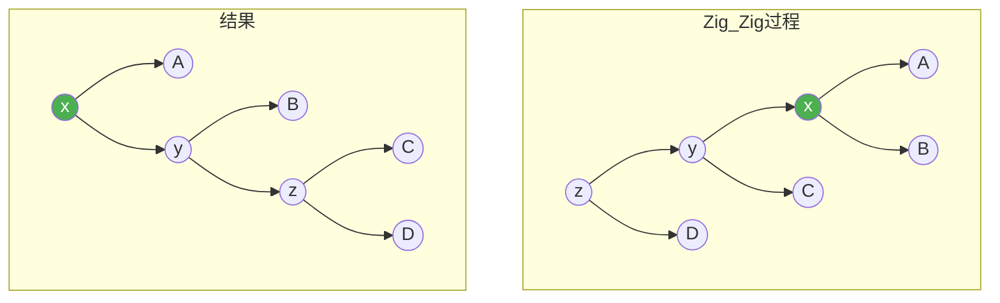
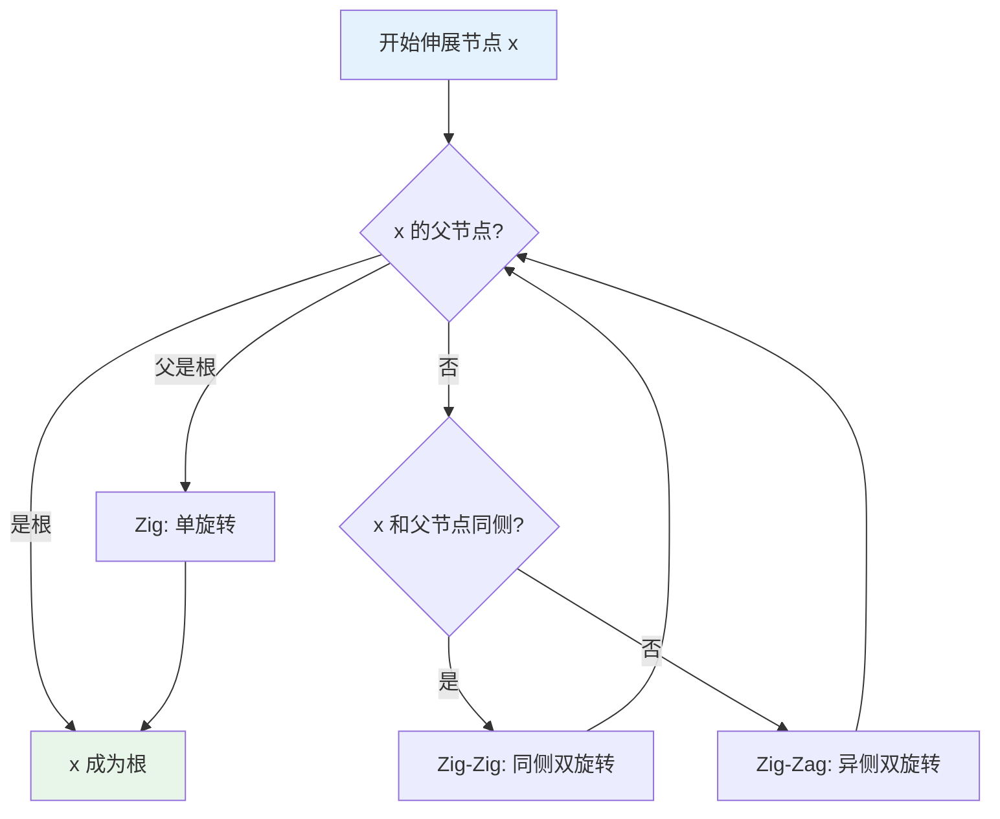
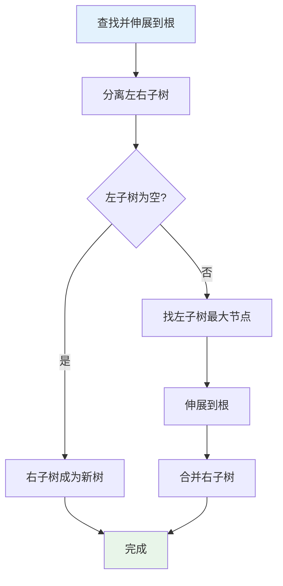

# 伸展树（Splay Tree）

## 概述

伸展树（Splay Tree）是一种自调整二叉搜索树，无需显式维护平衡信息。每次访问（查找、插入、删除）后，将访问的节点通过旋转移动到根节点位置，使得频繁访问的节点靠近树根，利用访问局部性提高效率。

<div style="background: #E3F2FD; border-left: 4px solid #2196F3; padding: 12px; margin: 10px 0;">
<strong>核心思想</strong>：不保证每次操作都是 O(log n)，但保证 m 次操作的总时间为 O(m log n + n)，即摊还时间复杂度为 O(log n)。
</div>

## 伸展树特点

| 特性 | 说明 |
|------|------|
| 自调整 | 无需显式平衡信息（高度、颜色等） |
| 访问局部性 | 频繁访问的节点自动靠近根 |
| 摊还分析 | m 次操作总时间 O(m log n + n) |
| 简单实现 | 无需额外存储空间 |
| 分裂合并 | 支持高效的分裂和合并操作 |

## 伸展操作

伸展操作是将节点 x 旋转到根的过程，分为三种情况：

### 1. Zig（单旋转）

当 x 的父节点是根时，进行单旋转：

<div style="background: #F5F5F5; border-radius: 8px; padding: 20px; margin: 10px 0;">
<div style="display: flex; justify-content: space-around; align-items: center;">
<div style="text-align: center;">
<div style="font-weight: bold; margin-bottom: 10px;">旋转前</div>
<div style="display: inline-block;">
<div style="background: #FF9800; color: white; padding: 8px 15px; border-radius: 4px; margin-bottom: 5px;">y</div>
<div style="display: flex; justify-content: center; gap: 20px;">
<div>
<div style="background: #4CAF50; color: white; padding: 8px 15px; border-radius: 4px; margin-bottom: 5px;">x</div>
<div style="display: flex; gap: 10px;">
<div style="background: #E3F2FD; padding: 5px 10px; border-radius: 4px;">A</div>
<div style="background: #E3F2FD; padding: 5px 10px; border-radius: 4px;">B</div>
</div>
</div>
<div style="background: #E3F2FD; padding: 8px 15px; border-radius: 4px;">C</div>
</div>
</div>
</div>
<div style="font-size: 24px; color: #2196F3;">→</div>
<div style="text-align: center;">
<div style="font-weight: bold; margin-bottom: 10px;">旋转后</div>
<div style="display: inline-block;">
<div style="background: #4CAF50; color: white; padding: 8px 15px; border-radius: 4px; margin-bottom: 5px;">x</div>
<div style="display: flex; justify-content: center; gap: 20px;">
<div style="background: #E3F2FD; padding: 8px 15px; border-radius: 4px;">A</div>
<div>
<div style="background: #FF9800; color: white; padding: 8px 15px; border-radius: 4px; margin-bottom: 5px;">y</div>
<div style="display: flex; gap: 10px;">
<div style="background: #E3F2FD; padding: 5px 10px; border-radius: 4px;">B</div>
<div style="background: #E3F2FD; padding: 5px 10px; border-radius: 4px;">C</div>
</div>
</div>
</div>
</div>
</div>
</div>
<div style="background: #E3F2FD; border-left: 4px solid #2196F3; padding: 12px; margin: 10px 0;">
x 是 y 的左孩子，右旋
</div>
</div>

### 2. Zig-Zig（同侧双旋转）

当 x 和 x 的父节点都是左孩子（或都是右孩子）时：

<div style="background: #F5F5F5; border-radius: 8px; padding: 20px; margin: 10px 0;">
<div style="display: flex; justify-content: space-around; align-items: center;">
<div style="text-align: center;">
<div style="font-weight: bold; margin-bottom: 10px;">旋转前</div>
<div style="display: inline-block;">
<div style="background: #F44336; color: white; padding: 8px 15px; border-radius: 4px; margin-bottom: 5px;">z</div>
<div style="display: flex; justify-content: center; gap: 30px;">
<div>
<div style="background: #FF9800; color: white; padding: 8px 15px; border-radius: 4px; margin-bottom: 5px;">y</div>
<div style="display: flex; justify-content: center; gap: 15px;">
<div>
<div style="background: #4CAF50; color: white; padding: 8px 15px; border-radius: 4px; margin-bottom: 5px;">x</div>
<div style="display: flex; gap: 10px;">
<div style="background: #E3F2FD; padding: 5px 10px; border-radius: 4px;">A</div>
<div style="background: #E3F2FD; padding: 5px 10px; border-radius: 4px;">B</div>
</div>
</div>
<div style="background: #E3F2FD; padding: 8px 15px; border-radius: 4px;">C</div>
</div>
</div>
<div style="background: #E3F2FD; padding: 8px 15px; border-radius: 4px;">D</div>
</div>
</div>
</div>
<div style="font-size: 24px; color: #2196F3;">→</div>
<div style="text-align: center;">
<div style="font-weight: bold; margin-bottom: 10px;">旋转后</div>
<div style="display: inline-block;">
<div style="background: #4CAF50; color: white; padding: 8px 15px; border-radius: 4px; margin-bottom: 5px;">x</div>
<div style="display: flex; justify-content: center; gap: 30px;">
<div style="background: #E3F2FD; padding: 8px 15px; border-radius: 4px;">A</div>
<div>
<div style="background: #FF9800; color: white; padding: 8px 15px; border-radius: 4px; margin-bottom: 5px;">y</div>
<div style="display: flex; justify-content: center; gap: 15px;">
<div style="background: #E3F2FD; padding: 8px 15px; border-radius: 4px;">B</div>
<div>
<div style="background: #F44336; color: white; padding: 8px 15px; border-radius: 4px; margin-bottom: 5px;">z</div>
<div style="display: flex; gap: 10px;">
<div style="background: #E3F2FD; padding: 5px 10px; border-radius: 4px;">C</div>
<div style="background: #E3F2FD; padding: 5px 10px; border-radius: 4px;">D</div>
</div>
</div>
</div>
</div>
</div>
</div>
</div>
</div>
<div style="background: #FFF3E0; border-left: 4px solid #FF9800; padding: 12px; margin: 10px 0;">
x、y 都是左孩子，先右旋 z，再右旋 y
</div>
</div>

### 3. Zig-Zag（异侧双旋转）

当 x 是左孩子，x 的父节点是右孩子（或相反）时：

<div style="background: #F5F5F5; border-radius: 8px; padding: 20px; margin: 10px 0;">
<div style="display: flex; justify-content: space-around; align-items: center;">
<div style="text-align: center;">
<div style="font-weight: bold; margin-bottom: 10px;">旋转前</div>
<div style="display: inline-block;">
<div style="background: #F44336; color: white; padding: 8px 15px; border-radius: 4px; margin-bottom: 5px;">z</div>
<div style="display: flex; justify-content: center; gap: 30px;">
<div style="background: #E3F2FD; padding: 8px 15px; border-radius: 4px;">A</div>
<div>
<div style="background: #FF9800; color: white; padding: 8px 15px; border-radius: 4px; margin-bottom: 5px;">y</div>
<div style="display: flex; justify-content: center; gap: 15px;">
<div>
<div style="background: #4CAF50; color: white; padding: 8px 15px; border-radius: 4px; margin-bottom: 5px;">x</div>
<div style="display: flex; gap: 10px;">
<div style="background: #E3F2FD; padding: 5px 10px; border-radius: 4px;">B</div>
<div style="background: #E3F2FD; padding: 5px 10px; border-radius: 4px;">C</div>
</div>
</div>
<div style="background: #E3F2FD; padding: 8px 15px; border-radius: 4px;">D</div>
</div>
</div>
</div>
</div>
</div>
<div style="font-size: 24px; color: #2196F3;">→</div>
<div style="text-align: center;">
<div style="font-weight: bold; margin-bottom: 10px;">旋转后</div>
<div style="display: inline-block;">
<div style="background: #4CAF50; color: white; padding: 8px 15px; border-radius: 4px; margin-bottom: 5px;">x</div>
<div style="display: flex; justify-content: center; gap: 15px;">
<div>
<div style="background: #F44336; color: white; padding: 8px 15px; border-radius: 4px; margin-bottom: 5px;">z</div>
<div style="display: flex; gap: 10px;">
<div style="background: #E3F2FD; padding: 5px 10px; border-radius: 4px;">A</div>
<div style="background: #E3F2FD; padding: 5px 10px; border-radius: 4px;">B</div>
</div>
</div>
<div>
<div style="background: #FF9800; color: white; padding: 8px 15px; border-radius: 4px; margin-bottom: 5px;">y</div>
<div style="display: flex; gap: 10px;">
<div style="background: #E3F2FD; padding: 5px 10px; border-radius: 4px;">C</div>
<div style="background: #E3F2FD; padding: 5px 10px; border-radius: 4px;">D</div>
</div>
</div>
</div>
</div>
</div>
</div>
<div style="background: #FFF3E0; border-left: 4px solid #FF9800; padding: 12px; margin: 10px 0;">
x 是左孩子，y 是右孩子，先左旋 y，再右旋 z
</div>
</div>

**伸展操作可视化**：



<div style="background: #E8F5E9; border-left: 4px solid #4CAF50; padding: 12px; margin: 10px 0;">
<strong>伸展操作的作用</strong>：每次伸展后，被访问节点成为根，且伸展路径上的节点深度减半（摊还意义上），这是摊还分析的关键。
</div>

## 数据结构

```c
typedef struct SplayNode {
    int key;
    struct SplayNode *left;
    struct SplayNode *right;
    struct SplayNode *parent;    // 需要父指针
} SplayNode;

typedef struct {
    SplayNode *root;
} SplayTree;
```

## 创建节点

```c
SplayNode* createSplayNode(int key) {
    SplayNode *node = (SplayNode*)malloc(sizeof(SplayNode));
    node->key = key;
    node->left = NULL;
    node->right = NULL;
    node->parent = NULL;
    return node;
}

SplayTree* createSplayTree() {
    SplayTree *tree = (SplayTree*)malloc(sizeof(SplayTree));
    tree->root = NULL;
    return tree;
}
```

## 旋转操作

### 左旋

```c
void leftRotate(SplayTree *tree, SplayNode *x) {
    SplayNode *y = x->right;
    x->right = y->left;
    
    if (y->left != NULL) {
        y->left->parent = x;
    }
    
    y->parent = x->parent;
    
    if (x->parent == NULL) {
        tree->root = y;
    } else if (x == x->parent->left) {
        x->parent->left = y;
    } else {
        x->parent->right = y;
    }
    
    y->left = x;
    x->parent = y;
}
```

### 右旋

```c
void rightRotate(SplayTree *tree, SplayNode *x) {
    SplayNode *y = x->left;
    x->left = y->right;
    
    if (y->right != NULL) {
        y->right->parent = x;
    }
    
    y->parent = x->parent;
    
    if (x->parent == NULL) {
        tree->root = y;
    } else if (x == x->parent->left) {
        x->parent->left = y;
    } else {
        x->parent->right = y;
    }
    
    y->right = x;
    x->parent = y;
}
```

### 旋转示意图

<div style="background: #F5F5F5; border-radius: 8px; padding: 20px; margin: 10px 0;">
<div style="display: flex; justify-content: space-around;">
<div style="text-align: center;">
<div style="font-weight: bold; margin-bottom: 15px;">左旋</div>
<div style="display: flex; justify-content: center; align-items: center; gap: 20px;">
<div style="display: inline-block;">
<div style="background: #FF9800; color: white; padding: 8px 15px; border-radius: 4px; margin-bottom: 5px;">x</div>
<div style="display: flex; justify-content: center; gap: 15px;">
<div style="background: #E3F2FD; padding: 8px 15px; border-radius: 4px;">A</div>
<div>
<div style="background: #4CAF50; color: white; padding: 8px 15px; border-radius: 4px; margin-bottom: 5px;">y</div>
<div style="display: flex; gap: 10px;">
<div style="background: #E3F2FD; padding: 5px 10px; border-radius: 4px;">B</div>
<div style="background: #E3F2FD; padding: 5px 10px; border-radius: 4px;">C</div>
</div>
</div>
</div>
</div>
</div>
<div style="font-size: 24px; color: #2196F3;">→</div>
<div style="display: inline-block;">
<div style="background: #4CAF50; color: white; padding: 8px 15px; border-radius: 4px; margin-bottom: 5px;">y</div>
<div style="display: flex; justify-content: center; gap: 15px;">
<div>
<div style="background: #FF9800; color: white; padding: 8px 15px; border-radius: 4px; margin-bottom: 5px;">x</div>
<div style="display: flex; gap: 10px;">
<div style="background: #E3F2FD; padding: 5px 10px; border-radius: 4px;">A</div>
<div style="background: #E3F2FD; padding: 5px 10px; border-radius: 4px;">B</div>
</div>
</div>
<div style="background: #E3F2FD; padding: 8px 15px; border-radius: 4px;">C</div>
</div>
</div>
</div>
</div>
<div style="text-align: center;">
<div style="font-weight: bold; margin-bottom: 15px;">右旋</div>
<div style="display: flex; justify-content: center; align-items: center; gap: 20px;">
<div style="display: inline-block;">
<div style="background: #FF9800; color: white; padding: 8px 15px; border-radius: 4px; margin-bottom: 5px;">y</div>
<div style="display: flex; justify-content: center; gap: 15px;">
<div>
<div style="background: #4CAF50; color: white; padding: 8px 15px; border-radius: 4px; margin-bottom: 5px;">x</div>
<div style="display: flex; gap: 10px;">
<div style="background: #E3F2FD; padding: 5px 10px; border-radius: 4px;">A</div>
<div style="background: #E3F2FD; padding: 5px 10px; border-radius: 4px;">B</div>
</div>
</div>
<div style="background: #E3F2FD; padding: 8px 15px; border-radius: 4px;">C</div>
</div>
</div>
<div style="font-size: 24px; color: #2196F3;">→</div>
<div style="display: inline-block;">
<div style="background: #4CAF50; color: white; padding: 8px 15px; border-radius: 4px; margin-bottom: 5px;">x</div>
<div style="display: flex; justify-content: center; gap: 15px;">
<div style="background: #E3F2FD; padding: 8px 15px; border-radius: 4px;">A</div>
<div>
<div style="background: #FF9800; color: white; padding: 8px 15px; border-radius: 4px; margin-bottom: 5px;">y</div>
<div style="display: flex; gap: 10px;">
<div style="background: #E3F2FD; padding: 5px 10px; border-radius: 4px;">B</div>
<div style="background: #E3F2FD; padding: 5px 10px; border-radius: 4px;">C</div>
</div>
</div>
</div>
</div>
</div>
</div>
</div>
</div>

## 伸展操作实现

```c
void splay(SplayTree *tree, SplayNode *x) {
    while (x->parent != NULL) {
        if (x->parent->parent == NULL) {
            // Zig: 父节点是根
            if (x == x->parent->left) {
                rightRotate(tree, x->parent);
            } else {
                leftRotate(tree, x->parent);
            }
        } else if (x == x->parent->left && 
                   x->parent == x->parent->parent->left) {
            // Zig-Zig: 都是左孩子
            rightRotate(tree, x->parent->parent);
            rightRotate(tree, x->parent);
        } else if (x == x->parent->right && 
                   x->parent == x->parent->parent->right) {
            // Zig-Zig: 都是右孩子
            leftRotate(tree, x->parent->parent);
            leftRotate(tree, x->parent);
        } else if (x == x->parent->right && 
                   x->parent == x->parent->parent->left) {
            // Zig-Zag: x是右孩子，父是左孩子
            leftRotate(tree, x->parent);
            rightRotate(tree, x->parent);
        } else {
            // Zig-Zag: x是左孩子，父是右孩子
            rightRotate(tree, x->parent);
            leftRotate(tree, x->parent);
        }
    }
}
```

### 伸展过程示例

<div style="background: #F5F5F5; border-radius: 8px; padding: 20px; margin: 10px 0;">
<div style="background: #E8F5E9; border-left: 4px solid #4CAF50; padding: 12px; margin-bottom: 15px;">
<strong>伸展节点 20</strong>
</div>
<div style="margin-bottom: 20px;">
<div style="font-weight: bold; margin-bottom: 10px;">初始状态：</div>
<div style="text-align: center; font-family: monospace; background: white; padding: 15px; border-radius: 8px;">
<pre style="margin: 0;">        50
       /  \
      30  60
     /  \
    20  40
   /
  10</pre>
</div>
</div>
<div>
<div style="font-weight: bold; color: #FF9800; margin-bottom: 10px;">步骤1: Zig-Zig（20、30都是左孩子）- 右旋 50，右旋 30：</div>
<div style="text-align: center; font-family: monospace; background: white; padding: 15px; border-radius: 8px;">
<pre style="margin: 0;">        <span style="color: #4CAF50; font-weight: bold;">20</span>
       /  \
      10  30
         /  \
        40  50
             \
             60</pre>
</div>
<div style="background: #E8F5E9; border-left: 4px solid #4CAF50; padding: 12px; margin-top: 10px;">
20 已成为根，伸展完成
</div>
</div>
</div>



## 查找操作

查找后将找到的节点（或其前驱/后继）伸展到根：

```c
SplayNode* search(SplayTree *tree, int key) {
    SplayNode *curr = tree->root;
    SplayNode *prev = NULL;
    
    while (curr != NULL && curr->key != key) {
        prev = curr;
        if (key < curr->key) {
            curr = curr->left;
        } else {
            curr = curr->right;
        }
    }
    
    // 找到则伸展该节点，否则伸展最后访问的节点
    if (curr != NULL) {
        splay(tree, curr);
    } else if (prev != NULL) {
        splay(tree, prev);
    }
    
    return curr;
}
```

## 插入操作

插入后将新节点伸展到根：

```c
void insert(SplayTree *tree, int key) {
    SplayNode *newNode = createSplayNode(key);
    
    if (tree->root == NULL) {
        tree->root = newNode;
        return;
    }
    
    // 按BST性质找到插入位置
    SplayNode *curr = tree->root;
    SplayNode *prev = NULL;
    
    while (curr != NULL) {
        prev = curr;
        if (key < curr->key) {
            curr = curr->left;
        } else {
            curr = curr->right;
        }
    }
    
    // 插入新节点
    newNode->parent = prev;
    if (key < prev->key) {
        prev->left = newNode;
    } else {
        prev->right = newNode;
    }
    
    // 伸展到根
    splay(tree, newNode);
}
```

**插入示例**：

<div style="background: #F5F5F5; border-radius: 8px; padding: 20px; margin: 10px 0;">
<div style="background: #E8F5E9; border-left: 4px solid #4CAF50; padding: 12px; margin-bottom: 15px;">
<strong>插入 25</strong>
</div>
<div style="margin-bottom: 20px;">
<div style="font-weight: bold; color: #2196F3; margin-bottom: 10px;">步骤1: 找到插入位置（30的左子节点）</div>
<div style="text-align: center; font-family: monospace; background: white; padding: 15px; border-radius: 8px;">
<pre style="margin: 0;">        50
       /  \
      30  60
     /  \
    20  40
   / \
  10  <span style="color: #4CAF50; font-weight: bold;">25  ← 新节点</span></pre>
</div>
</div>
<div>
<div style="font-weight: bold; color: #FF9800; margin-bottom: 10px;">步骤2: 伸展 25 到根</div>
<div style="font-weight: bold; margin-top: 10px;">最终结果：</div>
<div style="text-align: center; font-family: monospace; background: white; padding: 15px; border-radius: 8px;">
<pre style="margin: 0;">        <span style="color: #4CAF50; font-weight: bold;">25</span>
       /  \
      20  50
     /    / \
    10   30 60
          \
          40</pre>
</div>
</div>
</div>

## 删除操作

删除后需要合并左右子树：

```c
SplayNode* findMax(SplayNode *node) {
    while (node->right != NULL) {
        node = node->right;
    }
    return node;
}

void delete(SplayTree *tree, int key) {
    // 查找并伸展到根
    SplayNode *node = search(tree, key);
    
    if (node == NULL) return;
    
    SplayNode *leftTree = node->left;
    SplayNode *rightTree = node->right;
    
    free(node);
    
    if (leftTree == NULL) {
        // 左子树为空，右子树成为新树
        tree->root = rightTree;
        if (rightTree != NULL) {
            rightTree->parent = NULL;
        }
    } else {
        // 左子树不为空
        leftTree->parent = NULL;
        tree->root = leftTree;
        
        // 找到左子树最大节点并伸展到根
        SplayNode *maxNode = findMax(leftTree);
        splay(tree, maxNode);
        
        // 将右子树挂到根的右边
        tree->root->right = rightTree;
        if (rightTree != NULL) {
            rightTree->parent = tree->root;
        }
    }
}
```

**删除示意**：



## C++ 实现

```cpp
class SplayTree {
private:
    struct Node {
        int key;
        Node *left, *right, *parent;
        Node(int k) : key(k), left(nullptr), right(nullptr), parent(nullptr) {}
    };
    
    Node *root;
    
    void rotate(Node *x) {
        Node *p = x->parent;
        Node *g = p->parent;
        
        if (p->left == x) {
            p->left = x->right;
            if (x->right) x->right->parent = p;
            x->right = p;
        } else {
            p->right = x->left;
            if (x->left) x->left->parent = p;
            x->left = p;
        }
        
        p->parent = x;
        x->parent = g;
        
        if (g) {
            if (g->left == p) g->left = x;
            else g->right = x;
        } else {
            root = x;
        }
    }
    
    void splay(Node *x) {
        while (x->parent) {
            Node *p = x->parent;
            Node *g = p->parent;
            
            if (!g) {
                rotate(x);
            } else if ((g->left == p) == (p->left == x)) {
                // 同侧：Zig-Zig
                rotate(p);
                rotate(x);
            } else {
                // 异侧：Zig-Zag
                rotate(x);
                rotate(x);
            }
        }
    }
    
public:
    SplayTree() : root(nullptr) {}
    
    bool search(int key) {
        Node *curr = root;
        Node *prev = nullptr;
        
        while (curr && curr->key != key) {
            prev = curr;
            curr = (key < curr->key) ? curr->left : curr->right;
        }
        
        if (curr) {
            splay(curr);
            return true;
        }
        if (prev) splay(prev);
        return false;
    }
    
    void insert(int key) {
        if (!root) {
            root = new Node(key);
            return;
        }
        
        Node *curr = root;
        Node *prev = nullptr;
        
        while (curr) {
            prev = curr;
            curr = (key < curr->key) ? curr->left : curr->right;
        }
        
        Node *newNode = new Node(key);
        newNode->parent = prev;
        
        if (key < prev->key) prev->left = newNode;
        else prev->right = newNode;
        
        splay(newNode);
    }
};
```

## 分裂操作

按键值 k 将树分裂为两部分，伸展后直接断开连接：

```cpp
pair<Node*, Node*> split(int k) {
    if (!root) return {nullptr, nullptr};
    
    // 找到 k 的位置并伸展
    search(k);
    
    if (root->key <= k) {
        Node *right = root->right;
        if (right) right->parent = nullptr;
        root->right = nullptr;
        return {root, right};
    } else {
        Node *left = root->left;
        if (left) left->parent = nullptr;
        root->left = nullptr;
        return {left, root};
    }
}
```

## 合并操作

合并两棵树，要求左树的最大值 < 右树的最小值：

```cpp
Node* merge(Node *left, Node *right) {
    if (!left) return right;
    if (!right) return left;
    
    // 将左树的最大值伸展到根
    // 此时根没有右子树
    Node *maxNode = left;
    while (maxNode->right) maxNode = maxNode->right;
    splay(maxNode);
    
    root->right = right;
    if (right) right->parent = root;
    
    return root;
}
```

## 摊还分析

### 势能函数

定义势能函数 Φ(T) = Σ log(size(x))，其中 size(x) 是以 x 为根的子树大小。

### 摊还复杂度

| 操作 | 摊还时间 | 说明 |
|------|---------|------|
| 查找 | O(log n) | 包括伸展操作 |
| 插入 | O(log n) | |
| 删除 | O(log n) | |
| m 次操作 | O(m log n + n) | 初始势能为 O(n) |

<div style="background: #FFF3E0; border-left: 4px solid #FF9800; padding: 12px; margin: 10px 0;">
<strong>摊还分析关键</strong>：每次伸展操作的摊还代价为 O(log n)，这是因为伸展会将节点移动到根，同时减少路径上其他节点的深度。
</div>

### 伸展树 vs 其他平衡树

| 特性 | 伸展树 | AVL树 | 红黑树 | Treap |
|------|--------|-------|--------|-------|
| 额外空间 | 无 | 高度信息 | 颜色信息 | 优先级 |
| 单次操作 | O(n) 最坏 | O(log n) | O(log n) | O(n) 最坏 |
| 摊还操作 | O(log n) | O(log n) | O(log n) | O(log n) 期望 |
| 查找局部性 | 最优 | 一般 | 一般 | 一般 |
| 实现复杂度 | 中等 | 复杂 | 复杂 | 简单 |

<div style="background: #E8F5E9; border-left: 4px solid #4CAF50; padding: 12px; margin: 10px 0;">
<strong>访问局部性优势</strong>：如果访问模式具有局部性（某些节点频繁访问），伸展树的性能会优于其他平衡树，因为频繁访问的节点会自动靠近根。
</div>

## 应用场景

| 应用领域 | 具体场景 |
|---------|---------|
| 缓存实现 | 利用访问局部性优化 |
| 内存分配器 | 动态内存管理 |
| 网络路由 | 路由表实现 |
| 文件系统 | 目录缓存 |
| 区间操作 | 支持高效的分裂合并 |
| 竞赛编程 | Link-Cut Tree 的基础 |

## 实际应用示例

### LRU 缓存

```cpp
class LRUCache {
    SplayTree tree;
    unordered_map<int, int> cache;
    int capacity;
    
public:
    int get(int key) {
        if (cache.find(key) == cache.end()) return -1;
        tree.search(key);  // 伸展到根
        return cache[key];
    }
    
    void put(int key, int value) {
        cache[key] = value;
        tree.insert(key);  // 新插入的在根
        // ... 处理容量溢出
    }
};
```

### 区间操作

```cpp
// 区间翻转
void reverse(int l, int r) {
    auto [left, mid_right] = split(l - 1);
    auto [mid, right] = split(r - l + 1, mid_right);
    
    // 翻转 mid
    mid->flip = !mid->flip;
    
    merge(left, merge(mid, right));
}
```

## 参考资料

- Sleator, D. D., Tarjan, R. E. (1985). Self-Adjusting Binary Search Trees
- 《数据结构与算法分析》
- 《算法导论》摊还分析章节
