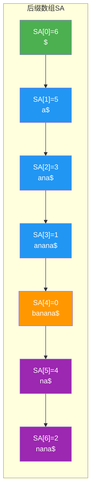
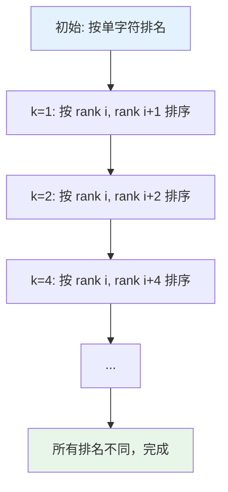

# 后缀树与后缀数组

## 概述

后缀树（Suffix Tree）是一种紧凑的 Trie 结构，用于高效处理字符串问题。后缀数组（Suffix Array）是后缀树的空间优化版本，通过存储所有后缀的字典序排列实现相同功能，在实际应用中更为广泛。

<div style="background: #E3F2FD; border-left: 4px solid #2196F3; padding: 12px; margin: 10px 0;">
<strong>核心应用</strong>：字符串匹配、最长重复子串、最长公共子串、回文检测、字符串压缩等。后缀数组配合 LCP 数组，可以解决大多数字符串问题。
</div>

## 后缀树特点

| 特性 | 说明 |
|------|------|
| 压缩Trie | 压缩单分支路径，空间 O(n) |
| 线性构建 | Ukkonen 算法 O(n) 构建 |
| 高效查询 | 子串查找 O(m) |
| 强大功能 | 支持多种字符串操作 |

## 后缀数组详解

### 后缀数组定义

对于字符串 S，后缀数组 SA 是一个整数数组，SA[i] 表示按字典序排序后第 i 个后缀的起始位置。

### 示例：字符串 "banana$"

**所有后缀**：

<div style="background: #F5F5F5; border-radius: 8px; padding: 20px; margin: 10px 0;">
<table style="width: 100%; border-collapse: collapse;">
<thead>
<tr style="background: #2196F3; color: white;">
<th style="padding: 10px; text-align: left;">索引</th>
<th style="padding: 10px; text-align: left;">后缀</th>
</tr>
</thead>
<tbody>
<tr style="background: white;"><td style="padding: 10px; font-family: monospace;">0</td><td style="padding: 10px; font-family: monospace;">banana$</td></tr>
<tr style="background: #F5F5F5;"><td style="padding: 10px; font-family: monospace;">1</td><td style="padding: 10px; font-family: monospace;">anana$</td></tr>
<tr style="background: white;"><td style="padding: 10px; font-family: monospace;">2</td><td style="padding: 10px; font-family: monospace;">nana$</td></tr>
<tr style="background: #F5F5F5;"><td style="padding: 10px; font-family: monospace;">3</td><td style="padding: 10px; font-family: monospace;">ana$</td></tr>
<tr style="background: white;"><td style="padding: 10px; font-family: monospace;">4</td><td style="padding: 10px; font-family: monospace;">na$</td></tr>
<tr style="background: #F5F5F5;"><td style="padding: 10px; font-family: monospace;">5</td><td style="padding: 10px; font-family: monospace;">a$</td></tr>
<tr style="background: white;"><td style="padding: 10px; font-family: monospace;">6</td><td style="padding: 10px; font-family: monospace;">$</td></tr>
</tbody>
</table>
</div>

**按字典序排序**：

<div style="background: #F5F5F5; border-radius: 8px; padding: 20px; margin: 10px 0;">
<table style="width: 100%; border-collapse: collapse;">
<thead>
<tr style="background: #4CAF50; color: white;">
<th style="padding: 10px; text-align: left;">排序序号</th>
<th style="padding: 10px; text-align: left;">起始索引</th>
<th style="padding: 10px; text-align: left;">后缀</th>
</tr>
</thead>
<tbody>
<tr style="background: white;"><td style="padding: 10px; font-family: monospace;">0</td><td style="padding: 10px; font-family: monospace;">6</td><td style="padding: 10px; font-family: monospace;">$</td></tr>
<tr style="background: #F5F5F5;"><td style="padding: 10px; font-family: monospace;">1</td><td style="padding: 10px; font-family: monospace;">5</td><td style="padding: 10px; font-family: monospace;">a$</td></tr>
<tr style="background: white;"><td style="padding: 10px; font-family: monospace;">2</td><td style="padding: 10px; font-family: monospace;">3</td><td style="padding: 10px; font-family: monospace;">ana$</td></tr>
<tr style="background: #F5F5F5;"><td style="padding: 10px; font-family: monospace;">3</td><td style="padding: 10px; font-family: monospace;">1</td><td style="padding: 10px; font-family: monospace;">anana$</td></tr>
<tr style="background: white;"><td style="padding: 10px; font-family: monospace;">4</td><td style="padding: 10px; font-family: monospace;">0</td><td style="padding: 10px; font-family: monospace;">banana$</td></tr>
<tr style="background: #F5F5F5;"><td style="padding: 10px; font-family: monospace;">5</td><td style="padding: 10px; font-family: monospace;">4</td><td style="padding: 10px; font-family: monospace;">na$</td></tr>
<tr style="background: white;"><td style="padding: 10px; font-family: monospace;">6</td><td style="padding: 10px; font-family: monospace;">2</td><td style="padding: 10px; font-family: monospace;">nana$</td></tr>
</tbody>
</table>
</div>

<div style="background: #E8F5E9; border-left: 4px solid #4CAF50; padding: 12px; margin: 10px 0;">
<strong>后缀数组</strong>：SA = [6, 5, 3, 1, 0, 4, 2]
</div>

### 后缀数组可视化



## LCP 数组

### LCP 定义

LCP（Longest Common Prefix）数组，LCP[i] 表示后缀 SA[i] 和 SA[i-1] 的最长公共前缀长度。

### LCP 数组计算

<div style="background: #F5F5F5; border-radius: 8px; padding: 20px; margin: 10px 0;">
<div style="margin-bottom: 15px;">
<strong>字符串:</strong> <code style="background: white; padding: 3px 8px; border-radius: 4px;">banana$</code>
</div>
<div style="margin-bottom: 15px;">
<strong>SA:</strong> <code style="background: white; padding: 3px 8px; border-radius: 4px;">[6, 5, 3, 1, 0, 4, 2]</code>
</div>
<div style="margin-bottom: 15px;">
<strong>后缀:</strong> <code style="background: white; padding: 3px 8px; border-radius: 4px;">[$, a$, ana$, anana$, banana$, na$, nana$]</code>
</div>
<div style="background: white; padding: 15px; border-radius: 8px; font-family: monospace;">
<div style="color: #2196F3;">LCP[0] = 0  <span style="color: #666;">(第一个后缀没有前驱)</span></div>
<div>LCP[1] = LCP("$", "a$") = 0</div>
<div>LCP[2] = LCP("a$", "ana$") = 1  <span style="color: #4CAF50;">("a")</span></div>
<div>LCP[3] = LCP("ana$", "anana$") = 3  <span style="color: #4CAF50;">("ana")</span></div>
<div>LCP[4] = LCP("anana$", "banana$") = 0</div>
<div>LCP[5] = LCP("banana$", "na$") = 0</div>
<div>LCP[6] = LCP("na$", "nana$") = 2  <span style="color: #4CAF50;">("na")</span></div>
</div>
<div style="background: #E8F5E9; border-left: 4px solid #4CAF50; padding: 12px; margin-top: 15px;">
<strong>LCP:</strong> <code style="background: white; padding: 3px 8px; border-radius: 4px;">[0, 0, 1, 3, 0, 0, 2]</code>
</div>
</div>

### LCP 可视化

<div style="background: #F5F5F5; border-radius: 8px; padding: 20px; margin: 10px 0;">
<table style="width: 100%; border-collapse: collapse;">
<thead>
<tr style="background: #2196F3; color: white;">
<th style="padding: 10px; text-align: center;">SA</th>
<th style="padding: 10px; text-align: center;">后缀</th>
<th style="padding: 10px; text-align: center;">LCP</th>
<th style="padding: 10px; text-align: center;">公共前缀</th>
</tr>
</thead>
<tbody>
<tr style="background: white;">
<td style="padding: 10px; text-align: center; font-family: monospace;">6</td>
<td style="padding: 10px; text-align: center; font-family: monospace;">$</td>
<td style="padding: 10px; text-align: center; font-family: monospace;">0</td>
<td style="padding: 10px; text-align: center; color: #999;">-</td>
</tr>
<tr style="background: #F5F5F5;">
<td style="padding: 10px; text-align: center; font-family: monospace;">5</td>
<td style="padding: 10px; text-align: center; font-family: monospace;">a$</td>
<td style="padding: 10px; text-align: center; font-family: monospace;">0</td>
<td style="padding: 10px; text-align: center; color: #999;">-</td>
</tr>
<tr style="background: white;">
<td style="padding: 10px; text-align: center; font-family: monospace;">3</td>
<td style="padding: 10px; text-align: center; font-family: monospace;">ana$</td>
<td style="padding: 10px; text-align: center; font-family: monospace; color: #4CAF50; font-weight: bold;">1</td>
<td style="padding: 10px; text-align: center; font-family: monospace; color: #4CAF50;">"a"</td>
</tr>
<tr style="background: #F5F5F5;">
<td style="padding: 10px; text-align: center; font-family: monospace;">1</td>
<td style="padding: 10px; text-align: center; font-family: monospace;">anana$</td>
<td style="padding: 10px; text-align: center; font-family: monospace; color: #4CAF50; font-weight: bold;">3</td>
<td style="padding: 10px; text-align: center; font-family: monospace; color: #4CAF50;">"ana"</td>
</tr>
<tr style="background: white;">
<td style="padding: 10px; text-align: center; font-family: monospace;">0</td>
<td style="padding: 10px; text-align: center; font-family: monospace;">banana$</td>
<td style="padding: 10px; text-align: center; font-family: monospace;">0</td>
<td style="padding: 10px; text-align: center; color: #999;">-</td>
</tr>
<tr style="background: #F5F5F5;">
<td style="padding: 10px; text-align: center; font-family: monospace;">4</td>
<td style="padding: 10px; text-align: center; font-family: monospace;">na$</td>
<td style="padding: 10px; text-align: center; font-family: monospace;">0</td>
<td style="padding: 10px; text-align: center; color: #999;">-</td>
</tr>
<tr style="background: white;">
<td style="padding: 10px; text-align: center; font-family: monospace;">2</td>
<td style="padding: 10px; text-align: center; font-family: monospace;">nana$</td>
<td style="padding: 10px; text-align: center; font-family: monospace; color: #4CAF50; font-weight: bold;">2</td>
<td style="padding: 10px; text-align: center; font-family: monospace; color: #4CAF50;">"na"</td>
</tr>
</tbody>
</table>
</div>

<div style="background: #E8F5E9; border-left: 4px solid #4CAF50; padding: 12px; margin: 10px 0;">
<strong>LCP 数组的作用</strong>：LCP 数组揭示了相邻排序后缀的相似程度，是解决许多字符串问题的关键。结合后缀数组和 LCP 数组，可以高效解决最长重复子串、最长公共子串等问题。
</div>

## 数据结构

```c
typedef struct {
    char *text;    // 原字符串
    int *sa;       // 后缀数组
    int *lcp;      // LCP 数组
    int n;         // 字符串长度
} SuffixArray;
```

## 构建后缀数组

### 朴素构建 O(n² log n)

```c
SuffixArray* buildSuffixArrayNaive(char *text) {
    int n = strlen(text);
    
    SuffixArray *sa = (SuffixArray*)malloc(sizeof(SuffixArray));
    sa->text = strdup(text);
    sa->n = n;
    sa->sa = (int*)malloc(sizeof(int) * n);
    
    // 初始化：每个位置作为一个后缀
    for (int i = 0; i < n; i++) {
        sa->sa[i] = i;
    }
    
    // 按后缀字典序排序
    for (int i = 0; i < n - 1; i++) {
        for (int j = 0; j < n - i - 1; j++) {
            if (strcmp(text + sa->sa[j], text + sa->sa[j + 1]) > 0) {
                int temp = sa->sa[j];
                sa->sa[j] = sa->sa[j + 1];
                sa->sa[j + 1] = temp;
            }
        }
    }
    
    return sa;
}
```

### 倍增算法 O(n log² n)

```c
int* buildSuffixArrayDC3(char *text, int n) {
    int *sa = (int*)malloc(sizeof(int) * n);
    int *rank = (int*)malloc(sizeof(int) * 2 * n);
    int *tmp = (int*)malloc(sizeof(int) * n);
    
    // 初始排名：按字符值
    for (int i = 0; i < n; i++) {
        sa[i] = i;
        rank[i] = (unsigned char)text[i];
    }
    
    // 倍增排序
    for (int k = 1; k < n; k *= 2) {
        // 按二元组 (rank[i], rank[i+k]) 排序
        for (int i = 0; i < n - 1; i++) {
            for (int j = 0; j < n - i - 1; j++) {
                int a = sa[j], b = sa[j + 1];
                int ra = rank[a], rb = rank[b];
                int rak = (a + k < n) ? rank[a + k] : -1;
                int rbk = (b + k < n) ? rank[b + k] : -1;
                
                if (ra > rb || (ra == rb && rak > rbk)) {
                    int temp = sa[j];
                    sa[j] = sa[j + 1];
                    sa[j + 1] = temp;
                }
            }
        }
        
        // 重新计算排名
        tmp[sa[0]] = 0;
        for (int i = 1; i < n; i++) {
            int a = sa[i - 1], b = sa[i];
            int ra = rank[a], rb = rank[b];
            int rak = (a + k < n) ? rank[a + k] : -1;
            int rbk = (b + k < n) ? rank[b + k] : -1;
            
            tmp[b] = tmp[a] + (ra != rb || rak != rbk);
        }
        
        for (int i = 0; i < n; i++) {
            rank[i] = tmp[i];
        }
        
        // 所有排名不同，排序完成
        if (rank[sa[n - 1]] == n - 1) break;
    }
    
    free(rank);
    free(tmp);
    return sa;
}
```

**倍增算法示意**：



## 构建 LCP 数组

### Kasai 算法 O(n)

```c
int* buildLCP(char *text, int *sa, int n) {
    int *lcp = (int*)calloc(n, sizeof(int));
    int *rank = (int*)malloc(sizeof(int) * n);
    
    // 计算 rank 数组：rank[i] 表示后缀 i 在 SA 中的位置
    for (int i = 0; i < n; i++) {
        rank[sa[i]] = i;
    }
    
    int h = 0;
    for (int i = 0; i < n; i++) {
        if (rank[i] > 0) {
            int j = sa[rank[i] - 1];  // 排名相邻的后缀
            
            // 利用之前的 h 值，从 h-1 开始比较
            while (i + h < n && j + h < n && text[i + h] == text[j + h]) {
                h++;
            }
            
            lcp[rank[i]] = h;
            if (h > 0) h--;  // 下一个后缀的 LCP 至少为 h-1
        }
    }
    
    free(rank);
    return lcp;
}
```

<div style="background: #FFF3E0; border-left: 4px solid #FF9800; padding: 12px; margin: 10px 0;">
<strong>Kasai 算法关键</strong>：利用 LCP 的性质，后缀 i+1 和 j+1 的 LCP 至少为 LCP(i,j)-1，从而避免重复比较，实现 O(n) 时间构建。
</div>

## 子串查找

### 利用后缀数组二分查找

```c
int searchSubstring(SuffixArray *sa, char *pattern) {
    int m = strlen(pattern);
    int n = sa->n;
    
    // 找到第一个 ≥ pattern 的后缀
    int left = 0, right = n;
    while (left < right) {
        int mid = (left + right) / 2;
        if (strncmp(sa->text + sa->sa[mid], pattern, m) < 0) {
            left = mid + 1;
        } else {
            right = mid;
        }
    }
    int start = left;
    
    // 找到第一个 > pattern 的后缀
    right = n;
    while (left < right) {
        int mid = (left + right) / 2;
        if (strncmp(sa->text + sa->sa[mid], pattern, m) <= 0) {
            left = mid + 1;
        } else {
            right = mid;
        }
    }
    
    // 出现次数 = right - start
    return right - start;
}
```

**查找示例**：

<div style="background: #F5F5F5; border-radius: 8px; padding: 20px; margin: 10px 0;">
<div style="margin-bottom: 15px;">
<strong>字符串:</strong> <code style="background: white; padding: 3px 8px; border-radius: 4px;">banana$</code>
</div>
<div style="margin-bottom: 15px;">
<strong>模式:</strong> <code style="background: #FF9800; color: white; padding: 3px 8px; border-radius: 4px;">"ana"</code>
</div>
<div style="margin-bottom: 15px;">
<strong>SA:</strong> <code style="background: white; padding: 3px 8px; border-radius: 4px;">[6, 5, 3, 1, 0, 4, 2]</code>
</div>
<div style="margin-bottom: 15px;">
<strong>后缀:</strong> <code style="background: white; padding: 3px 8px; border-radius: 4px;">[$, a$, ana$, anana$, banana$, na$, nana$]</code>
</div>
<div style="background: white; padding: 15px; border-radius: 8px; margin-bottom: 15px;">
<div style="font-weight: bold; color: #2196F3; margin-bottom: 10px;">二分查找 "ana":</div>
<div style="margin-left: 15px;">找到第一个 ≥ "ana": <span style="color: #4CAF50; font-weight: bold;">SA[2]=3 (ana$)</span></div>
<div style="margin-left: 15px;">找到第一个 > "ana": <span style="color: #FF9800; font-weight: bold;">SA[4]=0 (banana$)</span></div>
</div>
<div style="background: #E8F5E9; border-left: 4px solid #4CAF50; padding: 12px; margin-bottom: 15px;">
<strong>出现次数</strong> = 4 - 2 = <span style="font-size: 18px; font-weight: bold;">2</span>
</div>
<div style="background: white; padding: 15px; border-radius: 8px;">
<strong>匹配位置:</strong> SA[2]=3, SA[3]=1<br/>
即 "ana" 出现在位置 <span style="color: #4CAF50; font-weight: bold;">3</span> 和位置 <span style="color: #4CAF50; font-weight: bold;">1</span>
</div>
</div>

## 最长公共子串

```c
char* longestCommonSubstring(char *s1, char *s2) {
    int n1 = strlen(s1);
    int n2 = strlen(s2);
    
    // 拼接两个字符串，用特殊字符分隔
    char *combined = (char*)malloc(n1 + n2 + 2);
    sprintf(combined, "%s#%s", s1, s2);
    
    int n = n1 + n2 + 1;
    int *sa = buildSuffixArrayDC3(combined, n);
    int *lcp = buildLCP(combined, sa, n);
    
    int maxLen = 0;
    int maxIndex = 0;
    
    // 找到最大的 LCP，且两个后缀来自不同字符串
    for (int i = 1; i < n; i++) {
        int j1 = sa[i - 1];
        int j2 = sa[i];
        
        // 一个来自 s1，一个来自 s2
        if ((j1 < n1 && j2 > n1) || (j1 > n1 && j2 < n1)) {
            if (lcp[i] > maxLen) {
                maxLen = lcp[i];
                maxIndex = sa[i];
            }
        }
    }
    
    char *result = (char*)malloc(maxLen + 1);
    strncpy(result, combined + maxIndex, maxLen);
    result[maxLen] = '\0';
    
    free(combined);
    free(sa);
    free(lcp);
    
    return result;
}
```

**最长公共子串示意**：

<div style="background: #F5F5F5; border-radius: 8px; padding: 20px; margin: 10px 0;">
<div style="margin-bottom: 15px;">
<strong>s1 = </strong><code style="background: #E3F2FD; padding: 3px 8px; border-radius: 4px;">"banana"</code>
</div>
<div style="margin-bottom: 15px;">
<strong>s2 = </strong><code style="background: #FFF3E0; padding: 3px 8px; border-radius: 4px;">"canada"</code>
</div>
<div style="margin-bottom: 15px;">
<strong>拼接:</strong> <code style="background: white; padding: 3px 8px; border-radius: 4px;">"banana#canada"</code>
</div>
<div style="background: white; padding: 15px; border-radius: 8px; margin-bottom: 15px;">
<div style="font-weight: bold; color: #2196F3; margin-bottom: 10px;">找到来自不同字符串的后缀对的最大 LCP:</div>
<div style="margin-left: 15px; margin-bottom: 5px;">
<span style="color: #4CAF50;">"ana"</span> (来自 s1 位置 1 和 3)
</div>
<div style="margin-left: 15px;">
<span style="color: #4CAF50;">"ana"</span> (来自 s2 位置 1)
</div>
</div>
<div style="background: #E8F5E9; border-left: 4px solid #4CAF50; padding: 12px;">
<strong>最长公共子串:</strong> <span style="font-size: 18px; font-weight: bold; color: #4CAF50;">"ana"</span> (长度 3)
</div>
</div>

## C++ 实现

```cpp
#include <vector>
#include <string>
#include <algorithm>

class SuffixArray {
private:
    std::string text;
    std::vector<int> sa;
    std::vector<int> lcp;
    std::vector<int> rank;
    int n;
    
public:
    SuffixArray(const std::string& s) : text(s), n(s.length()) {
        sa.resize(n);
        lcp.resize(n);
        rank.resize(n);
        buildSA();
        buildLCP();
    }
    
    void buildSA() {
        for (int i = 0; i < n; i++) sa[i] = i;
        for (int i = 0; i < n; i++) rank[i] = text[i];
        
        std::vector<int> tmp(n);
        for (int k = 1; k < n; k *= 2) {
            auto cmp = [&](int a, int b) {
                if (rank[a] != rank[b]) return rank[a] < rank[b];
                int ra = (a + k < n) ? rank[a + k] : -1;
                int rb = (b + k < n) ? rank[b + k] : -1;
                return ra < rb;
            };
            
            std::sort(sa.begin(), sa.end(), cmp);
            
            tmp[sa[0]] = 0;
            for (int i = 1; i < n; i++) {
                tmp[sa[i]] = tmp[sa[i - 1]] + (cmp(sa[i - 1], sa[i]) ? 1 : 0);
            }
            rank = tmp;
            
            if (rank[sa[n - 1]] == n - 1) break;
        }
    }
    
    void buildLCP() {
        for (int i = 0; i < n; i++) rank[sa[i]] = i;
        
        int h = 0;
        for (int i = 0; i < n; i++) {
            if (rank[i] > 0) {
                int j = sa[rank[i] - 1];
                while (i + h < n && j + h < n && text[i + h] == text[j + h]) h++;
                lcp[rank[i]] = h;
                if (h > 0) h--;
            }
        }
    }
    
    int countOccurrences(const std::string& pattern) {
        int m = pattern.length();
        
        int left = 0, right = n;
        while (left < right) {
            int mid = (left + right) / 2;
            if (text.compare(sa[mid], m, pattern) < 0) left = mid + 1;
            else right = mid;
        }
        int start = left;
        
        right = n;
        while (left < right) {
            int mid = (left + right) / 2;
            if (text.compare(sa[mid], m, pattern) <= 0) left = mid + 1;
            else right = mid;
        }
        
        return right - start;
    }
    
    // 最长重复子串
    std::string longestRepeatedSubstring() {
        int maxLen = 0, maxIdx = 0;
        for (int i = 1; i < n; i++) {
            if (lcp[i] > maxLen) {
                maxLen = lcp[i];
                maxIdx = sa[i];
            }
        }
        return text.substr(maxIdx, maxLen);
    }
};
```

## 时间复杂度

| 操作 | 后缀树 | 后缀数组 | 说明 |
|------|--------|---------|------|
| 构建 | O(n) | O(n log n) | 后缀树用 Ukkonen，后缀数组用倍增 |
| 子串查找 | O(m) | O(m log n) | m 为模式长度 |
| LCP 查询 | O(1) | O(log n) | 需要 RMQ 预处理 |
| 最长重复子串 | O(n) | O(n) | |
| 空间 | O(n) | O(n) | |

## 后缀树 vs 后缀数组

| 特性 | 后缀树 | 后缀数组 |
|------|--------|---------|
| 构建复杂度 | O(n) | O(n log n) |
| 空间 | O(n) 指针开销大 | O(n) 紧凑 |
| 实现复杂度 | 复杂 | 相对简单 |
| 实际应用 | 理论研究 | 广泛应用 |
| 子串查找 | O(m) | O(m log n) |

<div style="background: #E8F5E9; border-left: 4px solid #4CAF50; padding: 12px; margin: 10px 0;">
<strong>选择建议</strong>：实际应用中优先选择后缀数组，空间紧凑、实现简单、常数因子小。后缀树适合理论研究或需要最优时间复杂度的场景。
</div>

## 应用场景

| 应用领域 | 具体问题 |
|---------|---------|
| 字符串匹配 | 多模式匹配、子串计数 |
| 重复结构 | 最长重复子串、重复子串计数 |
| 序列比对 | 最长公共子串、多个字符串公共子串 |
| 回文检测 | 最长回文子串 |
| 字符串压缩 | LZ 因子分解 |
| 生物信息 | DNA 序列分析、基因组比对 |

## 参考资料

- Weiner, P. (1973). Linear Pattern Matching Algorithms
- Kärkkäinen, J., Sanders, P. (2003). Simple Linear Work Suffix Array Construction
- Kasai, T. et al. (2001). Linear-Time Longest-Common-Prefix Computation
- 《算法导论》字符串匹配章节
