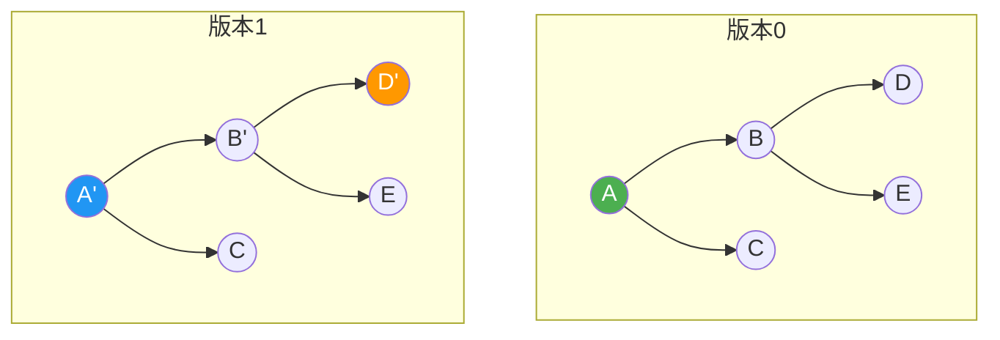
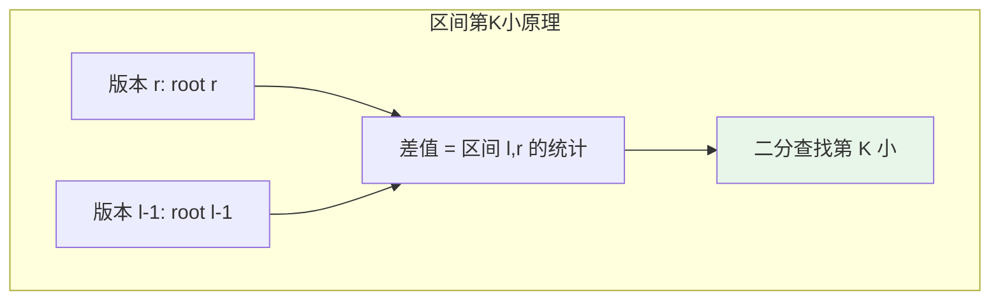

# 主席树（可持久化线段树）

## 概述

主席树（Persistent Segment Tree）是一种可持久化数据结构，能够保存所有历史版本，支持在任意历史版本上进行查询和修改。通过路径复制技术，每次修改只新增 O(log n) 个节点，空间复杂度为 O(n log n)。

<div style="background: #E3F2FD; border-left: 4px solid #2196F3; padding: 12px; margin: 10px 0;">
<strong>命名由来</strong>：由黄嘉泰（网名"主席"）引入国内竞赛圈，故称"主席树"。本质是可持久化权值线段树。
</div>

## 主席树特点

| 特性 | 说明 |
|------|------|
| 可持久化 | 保留所有历史版本，可回溯 |
| 空间高效 | 路径复制，每次修改 O(log n) 空间 |
| 版本查询 | 支持任意版本上的查询 |
| 函数式 | 操作不修改原结构，返回新版本 |
| 静态查询 | 静态区间第 K 小的经典解法 |

## 可持久化原理

### 路径复制

修改时，只复制从根到修改点的路径，其他节点共享：

<div style="background: #F5F5F5; border-radius: 8px; padding: 20px; margin: 10px 0;">
<div style="display: flex; justify-content: space-around; align-items: center;">
<div style="text-align: center;">
<div style="font-weight: bold; margin-bottom: 15px; color: #2196F3;">原线段树</div>
<div style="display: inline-block;">
<div style="background: #4CAF50; color: white; padding: 10px 20px; border-radius: 4px; margin-bottom: 5px;">A</div>
<div style="display: flex; justify-content: center; gap: 30px;">
<div>
<div style="background: #2196F3; color: white; padding: 10px 20px; border-radius: 4px; margin-bottom: 5px;">B</div>
<div style="display: flex; gap: 15px;">
<div style="background: #FF9800; color: white; padding: 8px 15px; border-radius: 4px;">D</div>
<div style="background: #E3F2FD; padding: 8px 15px; border-radius: 4px;">E</div>
</div>
</div>
<div style="background: #E3F2FD; padding: 10px 20px; border-radius: 4px;">C</div>
</div>
</div>
</div>
<div style="font-size: 24px; color: #2196F3;">→</div>
<div style="text-align: center;">
<div style="font-weight: bold; margin-bottom: 15px; color: #4CAF50;">修改节点 D</div>
<div style="display: inline-block;">
<div style="background: #4CAF50; color: white; padding: 10px 20px; border-radius: 4px; margin-bottom: 5px;">A'</div>
<div style="display: flex; justify-content: center; gap: 30px;">
<div>
<div style="background: #2196F3; color: white; padding: 10px 20px; border-radius: 4px; margin-bottom: 5px;">B'</div>
<div style="display: flex; gap: 15px;">
<div style="background: #FF9800; color: white; padding: 8px 15px; border-radius: 4px;">D'</div>
<div style="background: #E3F2FD; padding: 8px 15px; border-radius: 4px;">E</div>
</div>
</div>
<div style="background: #E3F2FD; padding: 10px 20px; border-radius: 4px;">C</div>
</div>
</div>
</div>
</div>
<div style="background: #E8F5E9; border-left: 4px solid #4CAF50; padding: 12px; margin-top: 15px;">
<div><strong>版本 0:</strong> A</div>
<div><strong>版本 1:</strong> A' <span style="color: #2196F3;">（A'、B'、D' 新建，C、E 共享）</span></div>
</div>
</div>

### 路径复制可视化



<div style="background: #E8F5E9; border-left: 4px solid #4CAF50; padding: 12px; margin: 10px 0;">
<strong>空间分析</strong>：每次修改创建 O(log n) 个新节点。n 次修改后，总节点数为 O(n log n)。
</div>

## 数据结构

```c
#define MAXN 200005
#define LOG 20

typedef struct PersistNode {
    int count;        // 区间内元素个数
    int left;         // 左子节点索引
    int right;        // 右子节点索引
} PersistNode;

typedef struct {
    PersistNode nodes[MAXN * LOG];  // 节点池
    int roots[MAXN];                 // 各版本的根节点
    int nodeCount;                   // 节点计数
    int versionCount;                // 版本计数
} PersistentSegmentTree;
```

## 创建主席树

```c
PersistentSegmentTree* createPersistTree(int n) {
    PersistentSegmentTree *tree = (PersistentSegmentTree*)calloc(1, sizeof(PersistentSegmentTree));
    tree->nodeCount = 0;
    tree->versionCount = 0;
    tree->roots[0] = 0;
    return tree;
}

int newNode(PersistentSegmentTree *tree) {
    int id = tree->nodeCount++;
    tree->nodes[id].count = 0;
    tree->nodes[id].left = 0;
    tree->nodes[id].right = 0;
    return id;
}
```

## 构建主席树

```c
int build(PersistentSegmentTree *tree, int left, int right) {
    int node = newNode(tree);
    
    if (left == right) {
        return node;
    }
    
    int mid = (left + right) / 2;
    tree->nodes[node].left = build(tree, left, mid);
    tree->nodes[node].right = build(tree, mid + 1, right);
    
    return node;
}

void initPersistTree(PersistentSegmentTree *tree, int n) {
    tree->roots[0] = build(tree, 1, n);
    tree->versionCount = 1;
}
```

## 插入操作（创建新版本）

```c
int insert(PersistentSegmentTree *tree, int prevRoot, 
           int left, int right, int pos, int value) {
    // 创建新节点，复制旧节点信息
    int node = newNode(tree);
    tree->nodes[node] = tree->nodes[prevRoot];
    tree->nodes[node].count += value;
    
    if (left == right) {
        return node;
    }
    
    int mid = (left + right) / 2;
    
    if (pos <= mid) {
        // 修改左子树，右子树共享
        tree->nodes[node].left = insert(tree, tree->nodes[prevRoot].left, 
                                        left, mid, pos, value);
    } else {
        // 修改右子树，左子树共享
        tree->nodes[node].right = insert(tree, tree->nodes[prevRoot].right, 
                                         mid + 1, right, pos, value);
    }
    
    return node;
}

void addVersion(PersistentSegmentTree *tree, int pos, int value, int n) {
    int prevRoot = tree->roots[tree->versionCount - 1];
    tree->roots[tree->versionCount] = insert(tree, prevRoot, 1, n, pos, value);
    tree->versionCount++;
}
```

### 插入过程示意

<div style="background: #F5F5F5; border-radius: 8px; padding: 20px; margin: 10px 0;">
<div style="background: #E8F5E9; border-left: 4px solid #4CAF50; padding: 12px; margin-bottom: 15px;">
<strong>初始:</strong> 空树 → <strong>插入位置 3，值 +1</strong>
</div>
<div style="background: white; padding: 15px; border-radius: 8px; margin-bottom: 15px;">
<div style="font-weight: bold; color: #2196F3; margin-bottom: 10px;">执行步骤：</div>
<div style="margin-left: 15px; margin-bottom: 5px;">步骤1: 创建根节点 root[1]，复制 root[0]</div>
<div style="margin-left: 15px; margin-bottom: 5px;">步骤2: 进入左子树 [1,4]，创建新节点</div>
<div style="margin-left: 15px; margin-bottom: 5px;">步骤3: 进入右子树 [3,4]，创建新节点</div>
<div style="margin-left: 15px;">步骤4: 到达叶子 [3,3]，count = 1</div>
</div>
<div style="text-align: center; font-family: monospace;">
<div style="font-weight: bold; margin-bottom: 10px;">新创建的节点（带 * 标记）：</div>
<div style="background: white; padding: 15px; border-radius: 8px; display: inline-block;">
<pre style="margin: 0;">        <span style="color: #4CAF50; font-weight: bold;">[1,4]*</span>
       /    \
    [1,2]   <span style="color: #4CAF50; font-weight: bold;">[3,4]*</span>
            /  \
          <span style="color: #4CAF50; font-weight: bold;">[3,3]*</span> [4,4]</pre>
</div>
</div>
<div style="background: #FFF3E0; border-left: 4px solid #FF9800; padding: 12px; margin-top: 15px;">
* 表示新建节点，其他节点与前一版本共享
</div>
</div>

## 查询操作

```c
int query(PersistentSegmentTree *tree, int root, 
          int left, int right, int ql, int qr) {
    if (ql > right || qr < left) return 0;
    if (ql <= left && right <= qr) {
        return tree->nodes[root].count;
    }
    
    int mid = (left + right) / 2;
    return query(tree, tree->nodes[root].left, left, mid, ql, qr) +
           query(tree, tree->nodes[root].right, mid + 1, right, ql, qr);
}

int queryVersion(PersistentSegmentTree *tree, int version, 
                 int ql, int qr, int n) {
    return query(tree, tree->roots[version], 1, n, ql, qr);
}
```

## 静态区间第 K 小

### 原理

利用前缀和思想：区间 [l, r] 的信息 = 版本 r 的信息 - 版本 (l-1) 的信息



### 实现

```c
int queryKth(PersistentSegmentTree *tree, int rootLeft, int rootRight,
             int left, int right, int k) {
    if (left == right) return left;
    
    int mid = (left + right) / 2;
    
    // 左子树元素个数 = 版本 r 的左子树 - 版本 l-1 的左子树
    int leftCount = tree->nodes[tree->nodes[rootRight].left].count - 
                    tree->nodes[tree->nodes[rootLeft].left].count;
    
    if (leftCount >= k) {
        // 第 k 小在左子树
        return queryKth(tree, tree->nodes[rootLeft].left, 
                       tree->nodes[rootRight].left, left, mid, k);
    } else {
        // 第 k 小在右子树
        return queryKth(tree, tree->nodes[rootLeft].right,
                       tree->nodes[rootRight].right, mid + 1, right, k - leftCount);
    }
}

int kthSmallest(PersistentSegmentTree *tree, int l, int r, int k, int n) {
    return queryKth(tree, tree->roots[l - 1], tree->roots[r], 1, n, k);
}
```

### 查询示例

<div style="background: #F5F5F5; border-radius: 8px; padding: 20px; margin: 10px 0;">
<div style="margin-bottom: 15px;">
<strong>数组:</strong> <code style="background: white; padding: 3px 8px; border-radius: 4px;">[3, 1, 4, 1, 5]</code>
</div>
<div style="margin-bottom: 15px;">
<strong>离散化后:</strong> <code style="background: #E3F2FD; padding: 3px 8px; border-radius: 4px;">[2, 1, 3, 1, 4]</code> <span style="color: #666;">(值域 1-4)</span>
</div>
<div style="background: #FFF3E0; border-left: 4px solid #FF9800; padding: 12px; margin-bottom: 15px;">
<strong>询问:</strong> 区间 [2, 5] 第 3 小
</div>
<div style="background: white; padding: 15px; border-radius: 8px; margin-bottom: 15px;">
<div style="font-weight: bold; color: #2196F3; margin-bottom: 10px;">版本构建：</div>
<div style="margin-left: 15px; font-family: monospace;">
<div>版本 1 (处理 A[1]=3): root[1]</div>
<div>版本 2 (处理 A[2]=1): root[2]</div>
<div>版本 3 (处理 A[3]=4): root[3]</div>
<div>版本 4 (处理 A[4]=1): root[4]</div>
<div>版本 5 (处理 A[5]=5): root[5]</div>
</div>
</div>
<div style="background: white; padding: 15px; border-radius: 8px; margin-bottom: 15px;">
<div style="font-weight: bold; color: #2196F3; margin-bottom: 10px;">查询区间 [2, 5]:</div>
<div style="margin-left: 15px;">
rootLeft = root[1]<br/>
rootRight = root[5]
</div>
</div>
<div style="background: white; padding: 15px; border-radius: 8px; margin-bottom: 15px;">
<div style="font-weight: bold; color: #FF9800; margin-bottom: 10px;">步骤1: 查找第 3 小</div>
<div style="margin-left: 15px;">
左子树 [1,2] 元素数 = (root[5] 左子树) - (root[1] 左子树) = 2 - 0 = <span style="font-weight: bold;">2</span><br/>
2 < 3，第 3 小在右子树 [3,4]<br/>
新 k = 3 - 2 = <span style="font-weight: bold;">1</span>
</div>
</div>
<div style="background: white; padding: 15px; border-radius: 8px; margin-bottom: 15px;">
<div style="font-weight: bold; color: #FF9800; margin-bottom: 10px;">步骤2: 查找第 1 小（右子树）</div>
<div style="margin-left: 15px;">
左子树 [3,3] 元素数 = <span style="font-weight: bold;">1</span><br/>
1 >= 1，第 1 小在 [3,3]
</div>
</div>
<div style="background: #E8F5E9; border-left: 4px solid #4CAF50; padding: 12px;">
<strong>结果:</strong> 3（对应原数组值 <span style="font-size: 18px; font-weight: bold; color: #4CAF50;">4</span>）
</div>
</div>

<div style="background: #FFF3E0; border-left: 4px solid #FF9800; padding: 12px; margin: 10px 0;">
<strong>注意事项</strong>：需要先对原数组离散化，将值域压缩到 [1, n]。每个版本对应原数组的前缀，root[i] 存储 A[1..i] 的权值分布。
</div>

## C++ 实现

```cpp
#include <vector>

class PersistentSegmentTree {
private:
    struct Node {
        int count;
        int left, right;
        Node() : count(0), left(0), right(0) {}
    };
    
    std::vector<Node> nodes;
    std::vector<int> roots;
    int n;
    
    int newNode() {
        nodes.push_back(Node());
        return nodes.size() - 1;
    }
    
    int build(int left, int right) {
        int node = newNode();
        if (left == right) return node;
        
        int mid = (left + right) / 2;
        nodes[node].left = build(left, mid);
        nodes[node].right = build(mid + 1, right);
        return node;
    }
    
    int insert(int prev, int left, int right, int pos, int value) {
        int node = newNode();
        nodes[node] = nodes[prev];
        nodes[node].count += value;
        
        if (left == right) return node;
        
        int mid = (left + right) / 2;
        if (pos <= mid) {
            nodes[node].left = insert(nodes[prev].left, left, mid, pos, value);
        } else {
            nodes[node].right = insert(nodes[prev].right, mid + 1, right, pos, value);
        }
        
        return node;
    }
    
    int queryKth(int rootLeft, int rootRight, int left, int right, int k) {
        if (left == right) return left;
        
        int mid = (left + right) / 2;
        int count = nodes[nodes[rootRight].left].count - 
                   nodes[nodes[rootLeft].left].count;
        
        if (count >= k) {
            return queryKth(nodes[rootLeft].left, nodes[rootRight].left, 
                           left, mid, k);
        } else {
            return queryKth(nodes[rootLeft].right, nodes[rootRight].right,
                           mid + 1, right, k - count);
        }
    }
    
public:
    PersistentSegmentTree(int size) : n(size) {
        roots.push_back(build(1, n));
    }
    
    void insert(int pos, int value) {
        roots.push_back(insert(roots.back(), 1, n, pos, value));
    }
    
    int kthSmallest(int l, int r, int k) {
        return queryKth(roots[l - 1], roots[r], 1, n, k);
    }
    
    int versionCount() { return roots.size(); }
};
```

## 时间复杂度

| 操作 | 时间复杂度 | 空间复杂度 | 说明 |
|------|-----------|-----------|------|
| 构建 | O(n log n) | O(n log n) | n 次插入 |
| 单次插入 | O(log n) | O(log n) | 创建 log n 个节点 |
| 区间查询 | O(log n) | O(1) | |
| 区间第 K 小 | O(log n) | O(1) | 两次查询的差 |

## 空间复杂度分析

<div style="background: #F5F5F5; border-radius: 8px; padding: 20px; margin: 10px 0;">
<div style="background: white; padding: 15px; border-radius: 8px; font-family: monospace;">
<div style="margin-bottom: 10px;"><span style="color: #2196F3;">初始构建:</span> n 个节点（空树）</div>
<div style="margin-bottom: 10px;"><span style="color: #2196F3;">每次插入:</span> log n 个新节点</div>
<div style="margin-bottom: 10px;"><span style="color: #4CAF50; font-weight: bold;">n 次插入后:</span> n + n log n = <span style="color: #4CAF50; font-weight: bold;">O(n log n)</span> 个节点</div>
<div style="border-top: 1px solid #ddd; padding-top: 10px; margin-top: 10px;">
<div style="margin-bottom: 10px;"><span style="color: #FF9800;">每个节点存储:</span> count + left + right = O(1)</div>
<div><span style="color: #4CAF50; font-weight: bold;">总空间:</span> O(n log n)</div>
</div>
</div>
</div>

## 应用场景

| 应用领域 | 具体问题 |
|---------|---------|
| 区间第 K 小 | 静态/动态区间第 K 小值 |
| 区间数颜色 | 区间不同数字个数 |
| 历史版本查询 | 回溯到任意历史状态 |
| 树上路径查询 | 结合树链剖分 |
| 可持久化并查集 | 历史连通性查询 |

## 主席树 vs 其他方法

| 方法 | 区间第 K 小 | 空间 | 预处理 |
|------|------------|------|--------|
| 排序 | O(n log n) 每次 | O(n) | 无 |
| 划分树 | O(log n) | O(n log n) | O(n log n) |
| 主席树 | O(log n) | O(n log n) | O(n log n) |
| 莫队+分块 | O(√n) | O(n) | O(n) |

<div style="background: #E8F5E9; border-left: 4px solid #4CAF50; padding: 12px; margin: 10px 0;">
<strong>选择建议</strong>：静态区间第 K 小优先选择主席树，实现简单、查询高效。需要在线查询时主席树是最佳选择。
</div>

## 扩展：动态主席树

支持修改操作，结合树状数组：

```cpp
// 树状数组套主席树
class DynamicPersistentSegmentTree {
    vector<PersistentSegmentTree> bits;
    
    void update(int i, int pos, int value) {
        for (; i <= n; i += i & (-i)) {
            bits[i].insert(pos, value);
        }
    }
    
    int queryKth(int l, int r, int k) {
        // 利用树状数组的前缀和性质
        // ...
    }
};
```

## 参考资料

- 黄嘉泰（主席）《可持久化数据结构研究》
- 《算法竞赛进阶指南》可持久化数据结构章节
- 《数据结构》可持久化线段树
