# 哈希表

## 概述

哈希表（Hash Table），也称为散列表，是一种根据键（Key）直接访问值（Value）的数据结构。通过哈希函数将键映射到数组索引，实现 **O(1) 平均时间复杂度**的查找、插入和删除操作，是计算机科学中最重要的数据结构之一。

<div style="background-color: #E3F2FD; border-left: 4px solid #2196F3; padding: 12px; margin: 10px 0;">
<strong>核心思想：</strong>哈希表通过<strong>哈希函数</strong>将任意大小的键转换为固定范围的数组索引，从而实现快速定位。理想情况下，每个键都映射到唯一的位置，但实际中存在<strong>哈希冲突</strong>，需要冲突解决策略。
</div>

### 哈希表的重要性

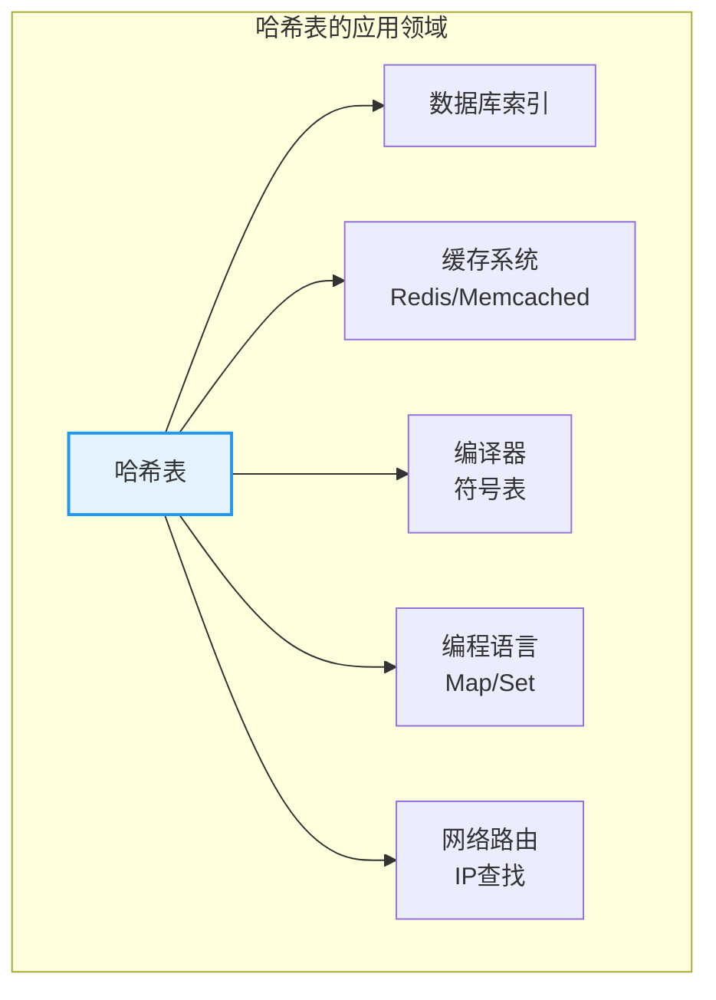

## 哈希表特点

| 特点 | 说明 | 优势 |
|------|------|------|
| **快速访问** | 平均 O(1) 时间复杂度 | 查找、插入、删除都很快 |
| **键值映射** | 键到值的一一对应 | 灵活的数据关联 |
| **冲突处理** | 处理不同键映射到相同位置 | 保证正确性 |
| **动态扩容** | 负载因子过高时自动扩容 | 保持高效性能 |

## 核心原理

### 哈希表结构

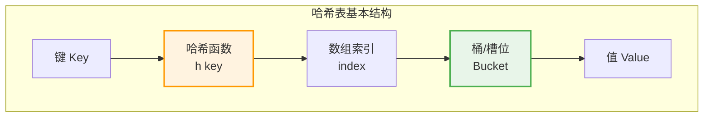

**工作流程：**

1. **存储时**：`index = hash(key) % size`，将 (key, value) 存入数组[index]
2. **查找时**：计算 `index = hash(key) % size`，在数组[index] 处查找
3. **冲突时**：多个 key 映射到同一 index，使用冲突解决策略

### 哈希函数

哈希函数是哈希表的核心，负责将键转换为数组索引。

**好的哈希函数特征：**
- **确定性**：相同的键总是产生相同的哈希值
- **均匀性**：键均匀分布在数组中，减少冲突
- **高效性**：计算速度快

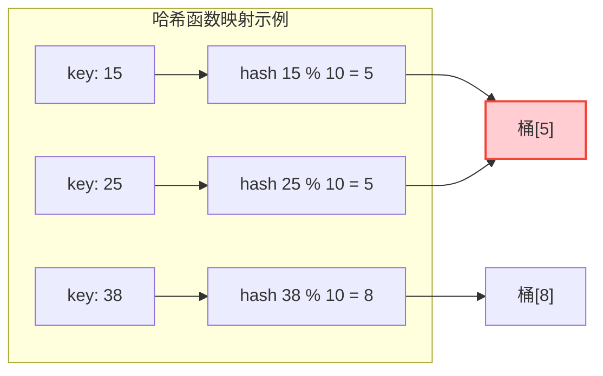

<div style="background-color: #FFF3E0; border-left: 4px solid #FF9800; padding: 12px; margin: 10px 0;">
<strong>⚠️ 哈希冲突：</strong>key=15 和 key=25 都映射到索引 5，这就是<strong>哈希冲突</strong>。冲突是不可避免的（鸽巢原理），需要冲突解决策略。
</div>

#### 常用哈希函数

| 哈希函数 | 公式 | 特点 | 应用场景 |
|---------|------|------|----------|
| **取模法** | h(k) = k mod m | 简单高效 | 整数键 |
| **乘数法** | h(k) = ⌊m(kA mod 1)⌋ | 分布均匀 | 通用 |
| **平方取中** | 取 k² 的中间几位 | 减少冲突 | 整数键 |
| **FNV** | 快速散列算法 | 高质量散列 | 字符串 |
| **MurmurHash** | 非加密哈希 | 高性能 | 通用 |

=== "C"
    ```c
    // 整数哈希函数（取模法）
    unsigned int hash(int key, int size) {
        return key % size;
    }
    
    // 字符串哈希函数（FNV-1a）
    unsigned int hashString(const char *str, int size) {
        unsigned int hash = 5381;
        int c;
        while ((c = *str++)) {
            hash = ((hash << 5) + hash) + c;
        }
        return hash % size;
    }
    
    // 乘数法（Knuth推荐 A = (√5-1)/2 ≈ 0.618）
    unsigned int hashMultiply(int key, int size) {
        const double A = 0.6180339887;
        double val = key * A;
        val = val - (int)val;
        return (int)(size * val);
    }
    ```

=== "C++"
    ```cpp
    // 使用标准库哈希
    template<typename K>
    size_t hash(const K& key, size_t size) {
        return std::hash<K>{}(key) % size;
    }
    ```

=== "Python"
    ```python
    def hash_int(key: int, size: int) -> int:
        return key % size
    
    def hash_string(s: str, size: int) -> int:
        hash_val = 5381
        for c in s:
            hash_val = ((hash_val << 5) + hash_val) + ord(c)
        return hash_val % size
    ```

=== "Java"
    ```java
    public int hashInt(int key, int size) {
        return Math.abs(key % size);
    }
    
    public int hashString(String str, int size) {
        int hash = 5381;
        for (char c : str.toCharArray()) {
            hash = ((hash << 5) + hash) + c;
        }
        return Math.abs(hash % size);
    }
    ```

=== "Go"
    ```go
    func hashInt(key, size int) int {
        return key % size
    }
    
    func hashString(s string, size int) int {
        hash := 5381
        for _, c := range s {
            hash = ((hash << 5) + hash) + int(c)
        }
        return hash % size
    }
    ```

=== "Rust"
    ```rust
    use std::collections::hash_map::DefaultHasher;
    use std::hash::{Hash, Hasher};
    
    fn hash<T: Hash>(key: &T, size: usize) -> usize {
        let mut hasher = DefaultHasher::new();
        key.hash(&mut hasher);
        hasher.finish() as usize % size
    }
    ```

### 负载因子

负载因子（Load Factor）衡量哈希表的填充程度：

$$\alpha = \frac{n}{m}$$

- n：已存储元素数量
- m：哈希表大小（桶的数量）

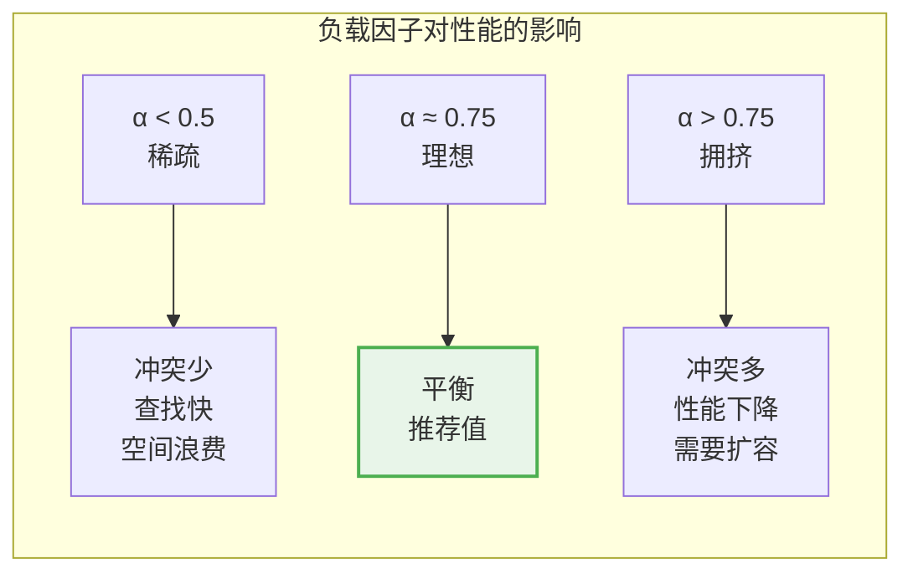

| 负载因子范围 | 性能表现 | 建议 |
|-------------|---------|------|
| α < 0.5 | 空间浪费，查找快 | 可缩小容量 |
| **0.5 ≤ α ≤ 0.75** | **最佳平衡** | **推荐** |
| α > 0.75 | 冲突增加，性能下降 | 需要扩容 |

## 冲突解决方法

当两个不同的键映射到同一个数组位置时，就发生了哈希冲突。有两种主要的解决策略：

### 方法对比

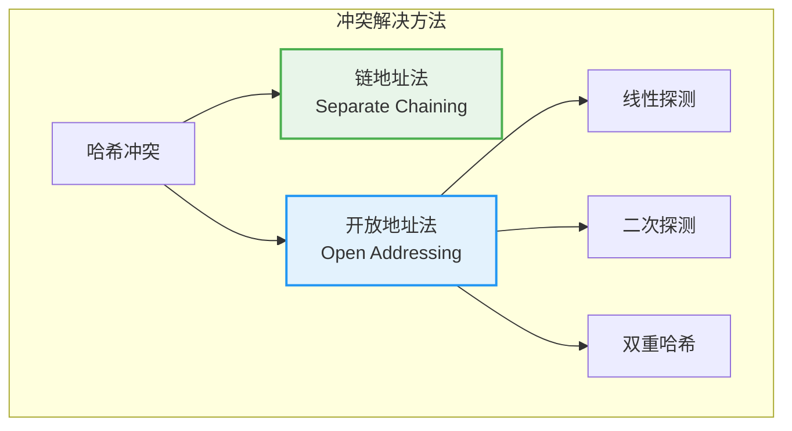

### 链地址法（Separate Chaining）

每个桶存储一个链表，冲突的元素追加到链表中。

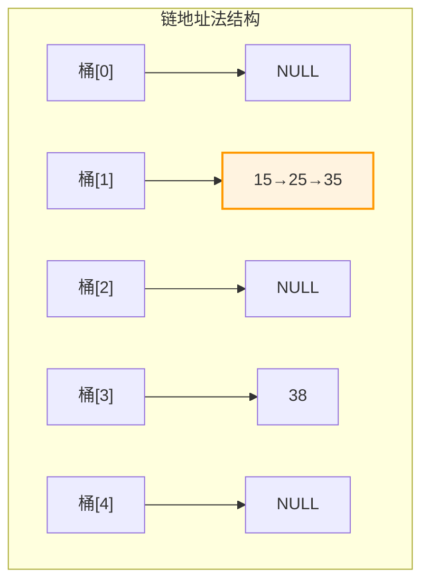

**操作流程：**

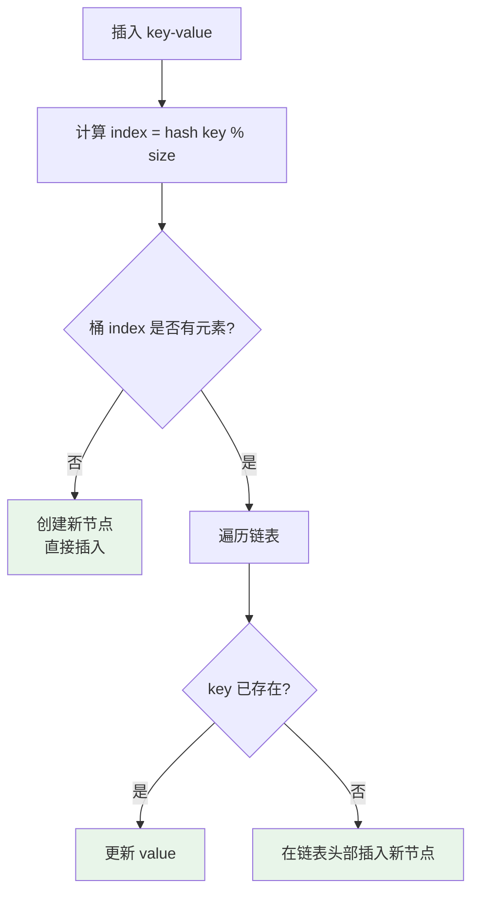

**查找过程示例：**

```
查找 key = 25，哈希表大小 = 5

步骤1: 计算哈希值
       index = hash(25) % 5 = 0

步骤2: 访问桶[0]
       桶[0] → 15 → 25 → 35

步骤3: 遍历链表
       检查节点 15: key ≠ 25，继续
       检查节点 25: key = 25，找到！

结果: 返回 value
时间复杂度: O(1 + α)，α 为负载因子
```

**代码实现：**

=== "C"
    ```c
    typedef struct HashNode {
        int key;
        int value;
        struct HashNode *next;
    } HashNode;
    
    typedef struct {
        HashNode **buckets;
        int size;
        int count;
    } HashMap;
    
    HashMap* createHashMap(int size) {
        HashMap *map = (HashMap*)malloc(sizeof(HashMap));
        map->size = size;
        map->count = 0;
        map->buckets = (HashNode**)calloc(size, sizeof(HashNode*));
        return map;
    }
    
    void insert(HashMap *map, int key, int value) {
        int index = key % map->size;
        HashNode *curr = map->buckets[index];
        while (curr != NULL) {
            if (curr->key == key) {
                curr->value = value;
                return;
            }
            curr = curr->next;
        }
        HashNode *newNode = (HashNode*)malloc(sizeof(HashNode));
        newNode->key = key;
        newNode->value = value;
        newNode->next = map->buckets[index];
        map->buckets[index] = newNode;
        map->count++;
    }
    
    int get(HashMap *map, int key, int *found) {
        int index = key % map->size;
        HashNode *curr = map->buckets[index];
        while (curr != NULL) {
            if (curr->key == key) {
                *found = 1;
                return curr->value;
            }
            curr = curr->next;
        }
        *found = 0;
        return -1;
    }
    
    void removeKey(HashMap *map, int key) {
        int index = key % map->size;
        HashNode *curr = map->buckets[index];
        HashNode *prev = NULL;
        while (curr != NULL) {
            if (curr->key == key) {
                if (prev == NULL) map->buckets[index] = curr->next;
                else prev->next = curr->next;
                free(curr);
                map->count--;
                return;
            }
            prev = curr;
            curr = curr->next;
        }
    }
    ```

=== "C++"
    ```cpp
    template<typename K, typename V>
    class HashMap {
    private:
        struct Node {
            K key;
            V value;
            Node *next;
            Node(const K& k, const V& v) : key(k), value(v), next(nullptr) {}
        };
        std::vector<Node*> buckets;
        int count;
        
        size_t hash(const K& key) {
            return std::hash<K>{}(key) % buckets.size();
        }
        
    public:
        HashMap(int size = 16) : buckets(size, nullptr), count(0) {}
        
        void insert(const K& key, const V& value) {
            size_t index = hash(key);
            Node *curr = buckets[index];
            while (curr) {
                if (curr->key == key) {
                    curr->value = value;
                    return;
                }
                curr = curr->next;
            }
            Node *newNode = new Node(key, value);
            newNode->next = buckets[index];
            buckets[index] = newNode;
            count++;
        }
        
        V* get(const K& key) {
            size_t index = hash(key);
            Node *curr = buckets[index];
            while (curr) {
                if (curr->key == key) return &curr->value;
                curr = curr->next;
            }
            return nullptr;
        }
    };
    ```

=== "Python"
    ```python
    class HashMap:
        def __init__(self, size: int = 16):
            self.size = size
            self.buckets = [[] for _ in range(size)]
            self.count = 0
        
        def _hash(self, key):
            return hash(key) % self.size
        
        def insert(self, key, value):
            index = self._hash(key)
            for i, (k, v) in enumerate(self.buckets[index]):
                if k == key:
                    self.buckets[index][i] = (key, value)
                    return
            self.buckets[index].append((key, value))
            self.count += 1
        
        def get(self, key, default=None):
            index = self._hash(key)
            for k, v in self.buckets[index]:
                if k == key:
                    return v
            return default
        
        def remove(self, key):
            index = self._hash(key)
            for i, (k, v) in enumerate(self.buckets[index]):
                if k == key:
                    del self.buckets[index][i]
                    self.count -= 1
                    return
    ```

=== "Java"
    ```java
    import java.util.LinkedList;
    
    public class HashMap<K, V> {
        private static class Node<K, V> {
            K key;
            V value;
            Node(K k, V v) { key = k; value = v; }
        }
        
        private LinkedList<Node<K, V>>[] buckets;
        private int count;
        
        @SuppressWarnings("unchecked")
        public HashMap(int size) {
            buckets = new LinkedList[size];
            for (int i = 0; i < size; i++) {
                buckets[i] = new LinkedList<>();
            }
            count = 0;
        }
        
        private int hash(K key) {
            return Math.abs(key.hashCode()) % buckets.length;
        }
        
        public void insert(K key, V value) {
            int index = hash(key);
            for (Node<K, V> node : buckets[index]) {
                if (node.key.equals(key)) {
                    node.value = value;
                    return;
                }
            }
            buckets[index].add(new Node<>(key, value));
            count++;
        }
        
        public V get(K key) {
            int index = hash(key);
            for (Node<K, V> node : buckets[index]) {
                if (node.key.equals(key)) return node.value;
            }
            return null;
        }
    }
    ```

=== "Go"
    ```go
    type hashNode struct {
        key   int
        value int
        next  *hashNode
    }
    
    type HashMap struct {
        buckets []*hashNode
        size    int
        count   int
    }
    
    func NewHashMap(size int) *HashMap {
        return &HashMap{
            buckets: make([]*hashNode, size),
            size:    size,
            count:   0,
        }
    }
    
    func (m *HashMap) Insert(key, value int) {
        index := key % m.size
        curr := m.buckets[index]
        for curr != nil {
            if curr.key == key {
                curr.value = value
                return
            }
            curr = curr.next
        }
        newNode := &hashNode{key: key, value: value, next: m.buckets[index]}
        m.buckets[index] = newNode
        m.count++
    }
    
    func (m *HashMap) Get(key int) (int, bool) {
        index := key % m.size
        curr := m.buckets[index]
        for curr != nil {
            if curr.key == key {
                return curr.value, true
            }
            curr = curr.next
        }
        return 0, false
    }
    
    func (m *HashMap) Remove(key int) {
        index := key % m.size
        curr := m.buckets[index]
        var prev *hashNode
        for curr != nil {
            if curr.key == key {
                if prev == nil {
                    m.buckets[index] = curr.next
                } else {
                    prev.next = curr.next
                }
                m.count--
                return
            }
            prev = curr
            curr = curr.next
        }
    }
    ```

=== "Rust"
    ```rust
    use std::collections::LinkedList;
    
    struct Node<K, V> {
        key: K,
        value: V,
    }
    
    pub struct HashMap<K, V> {
        buckets: Vec<LinkedList<Node<K, V>>>,
        count: usize,
    }
    
    impl<K: std::hash::Hash + Eq, V> HashMap<K, V> {
        pub fn new(size: usize) -> Self {
            let mut buckets = Vec::with_capacity(size);
            for _ in 0..size {
                buckets.push(LinkedList::new());
            }
            HashMap { buckets, count: 0 }
        }
        
        fn hash(&self, key: &K) -> usize {
            use std::collections::hash_map::DefaultHasher;
            use std::hash::{Hash, Hasher};
            let mut hasher = DefaultHasher::new();
            key.hash(&mut hasher);
            hasher.finish() as usize % self.buckets.len()
        }
        
        pub fn insert(&mut self, key: K, value: V) {
            let index = self.hash(&key);
            for node in self.buckets[index].iter_mut() {
                if node.key == key {
                    node.value = value;
                    return;
                }
            }
            self.buckets[index].push_back(Node { key, value });
            self.count += 1;
        }
        
        pub fn get(&self, key: &K) -> Option<&V> {
            let index = self.hash(key);
            for node in self.buckets[index].iter() {
                if &node.key == key {
                    return Some(&node.value);
                }
            }
            None
        }
    }
    ```

### 开放地址法（Open Addressing）

所有元素都存储在数组中，冲突时按照规则寻找下一个空位。

#### 线性探测（Linear Probing）

$$h_i(k) = (h(k) + i) \mod m, \quad i = 0, 1, 2, ...$$

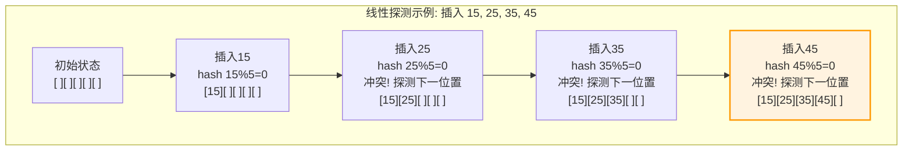

**缺点：容易出现聚集现象**

```
聚集现象:
[15][25][35][45][55]  ← 连续填充，形成聚集
     ↑
  插入 26, hash(26)%5=1
  需要探测到位置5才能插入
  查找效率下降
```

#### 二次探测（Quadratic Probing）

$$h_i(k) = (h(k) + c_1 \cdot i + c_2 \cdot i^2) \mod m$$

常用形式：$h_i(k) = (h(k) + i^2) \mod m$

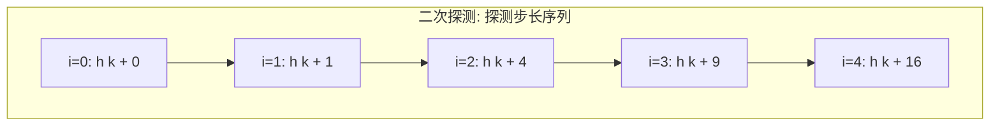

**优点：减少聚集现象**
**缺点：可能无法遍历所有位置**

#### 双重哈希（Double Hashing）

$$h_i(k) = (h_1(k) + i \cdot h_2(k)) \mod m$$

使用两个不同的哈希函数，分布最均匀。

```c
int doubleHash(int key, int size, int i) {
    int h1 = key % size;
    int h2 = 1 + (key % (size - 1));  // 保证不为0
    return (h1 + i * h2) % size;
}
```

**开放地址法实现：**

```c
typedef struct {
    int *keys;
    int *values;
    int *occupied;  // 标记位置是否被占用
    int size;
    int count;
} OpenHashMap;

// 线性探测
int probe(OpenHashMap *map, int key) {
    int index = hash(key, map->size);
    int i = 0;
    
    while (map->occupied[(index + i) % map->size] && 
           map->keys[(index + i) % map->size] != key) {
        i++;
    }
    
    return (index + i) % map->size;
}

void insertOpen(OpenHashMap *map, int key, int value) {
    if (map->count >= map->size * 0.75) {
        // 需要扩容
        return;
    }
    
    int index = probe(map, key);
    
    if (!map->occupied[index]) {
        map->count++;
    }
    
    map->keys[index] = key;
    map->values[index] = value;
    map->occupied[index] = 1;
}
```

### 冲突解决方法比较

| 方法 | 优点 | 缺点 | 适用场景 |
|------|------|------|----------|
| **链地址法** | 实现简单，删除方便，负载因子可 > 1 | 额外指针开销，缓存不友好 | 通用，Java HashMap |
| **线性探测** | 缓存友好，无需额外空间 | 聚集现象严重 | 小规模数据 |
| **二次探测** | 减少聚集 | 可能不遍历全表 | 中等规模 |
| **双重哈希** | 分布最均匀，最少聚集 | 计算两次哈希 | 大规模数据 |

## 动态扩容

当负载因子超过阈值时，需要进行扩容以保持高效性能。

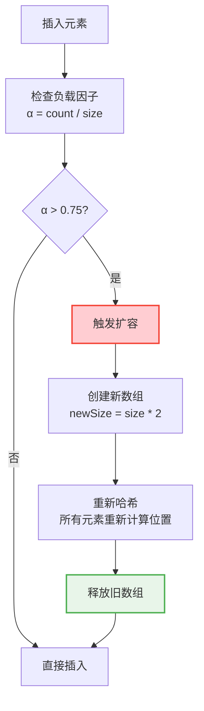

**扩容示例：**

```
扩容前 (size = 4, count = 3):
桶[0]: 12 → 16
桶[1]: NULL
桶[2]: 5
桶[3]: NULL
负载因子 α = 3/4 = 0.75 → 触发扩容

扩容后 (size = 8):
桶[0]: 16    (hash(16)%8 = 0)
桶[1]: NULL
桶[2]: NULL
桶[3]: NULL
桶[4]: 12    (hash(12)%8 = 4)
桶[5]: 5     (hash(5)%8 = 5)
桶[6]: NULL
桶[7]: NULL
负载因子 α = 3/8 = 0.375
```

```c
void resize(HashMap *map, int newSize) {
    HashNode **oldBuckets = map->buckets;
    int oldSize = map->size;
    
    // 创建新桶数组
    map->buckets = (HashNode**)calloc(newSize, sizeof(HashNode*));
    map->size = newSize;
    map->count = 0;
    
    // 重新哈希所有元素
    for (int i = 0; i < oldSize; i++) {
        HashNode *curr = oldBuckets[i];
        while (curr != NULL) {
            HashNode *next = curr->next;
            insert(map, curr->key, curr->value);
            free(curr);
            curr = next;
        }
    }
    
    free(oldBuckets);
}

void checkResize(HashMap *map) {
    double loadFactor = (double)map->count / map->size;
    if (loadFactor > 0.75) {
        resize(map, map->size * 2);
    }
}
```

## 可视化演示

### 插入操作演示

```
哈希表初始状态 (size = 5):
桶[0]: NULL
桶[1]: NULL
桶[2]: NULL
桶[3]: NULL
桶[4]: NULL

═══════════════════════════════════════════════════════════════
插入 (15, "apple")
═══════════════════════════════════════════════════════════════

hash(15) % 5 = 0
桶[0]: (15, "apple")
桶[1]: NULL
桶[2]: NULL
桶[3]: NULL
桶[4]: NULL

═══════════════════════════════════════════════════════════════
插入 (25, "banana") - 冲突！
═══════════════════════════════════════════════════════════════

hash(25) % 5 = 0 ← 与 15 冲突
链地址法：追加到链表

桶[0]: (15, "apple") → (25, "banana")
桶[1]: NULL
桶[2]: NULL
桶[3]: NULL
桶[4]: NULL

═══════════════════════════════════════════════════════════════
插入 (38, "cherry")
═══════════════════════════════════════════════════════════════

hash(38) % 5 = 3

桶[0]: (15, "apple") → (25, "banana")
桶[1]: NULL
桶[2]: NULL
桶[3]: (38, "cherry")
桶[4]: NULL

负载因子 α = 3/5 = 0.6
```

## C++ 模板实现

```cpp
template<typename K, typename V>
class HashMap {
private:
    struct Node {
        K key;
        V value;
        Node *next;
        Node(const K& k, const V& v) : key(k), value(v), next(nullptr) {}
    };
    
    std::vector<Node*> buckets;
    int count;
    
    size_t hash(const K& key) {
        return std::hash<K>{}(key) % buckets.size();
    }
    
public:
    HashMap(int size = 16) : buckets(size, nullptr), count(0) {}
    
    void insert(const K& key, const V& value) {
        size_t index = hash(key);
        Node *curr = buckets[index];
        
        while (curr) {
            if (curr->key == key) {
                curr->value = value;
                return;
            }
            curr = curr->next;
        }
        
        Node *newNode = new Node(key, value);
        newNode->next = buckets[index];
        buckets[index] = newNode;
        count++;
    }
    
    V* get(const K& key) {
        size_t index = hash(key);
        Node *curr = buckets[index];
        
        while (curr) {
            if (curr->key == key) return &curr->value;
            curr = curr->next;
        }
        return nullptr;
    }
    
    bool remove(const K& key) {
        size_t index = hash(key);
        Node *curr = buckets[index];
        Node *prev = nullptr;
        
        while (curr) {
            if (curr->key == key) {
                if (prev) prev->next = curr->next;
                else buckets[index] = curr->next;
                delete curr;
                count--;
                return true;
            }
            prev = curr;
            curr = curr->next;
        }
        return false;
    }
    
    bool contains(const K& key) {
        return get(key) != nullptr;
    }
    
    int size() { return count; }
};
```

## STL 使用

```cpp
#include <unordered_map>
#include <unordered_set>

// unordered_map 使用
std::unordered_map<std::string, int> map;
map["apple"] = 1;
map["banana"] = 2;
map["cherry"] = 3;

// 查找
if (map.find("apple") != map.end()) {
    std::cout << "apple: " << map["apple"] << std::endl;
}

// 遍历
for (const auto& pair : map) {
    std::cout << pair.first << ": " << pair.second << std::endl;
}

// 删除
map.erase("apple");

// unordered_set 使用
std::unordered_set<int> set;
set.insert(1);
set.insert(2);
set.insert(3);

if (set.count(2)) {
    std::cout << "Found 2" << std::endl;
}
```

## 时间复杂度分析

| 操作 | 平均情况 | 最坏情况 | 说明 |
|------|---------|---------|------|
| **查找** | O(1) | O(n) | 最坏情况：所有元素冲突 |
| **插入** | O(1) | O(n) | 最坏情况：需要遍历链表 |
| **删除** | O(1) | O(n) | 最坏情况：需要遍历链表 |
| **扩容** | O(n) | O(n) | 重新哈希所有元素 |

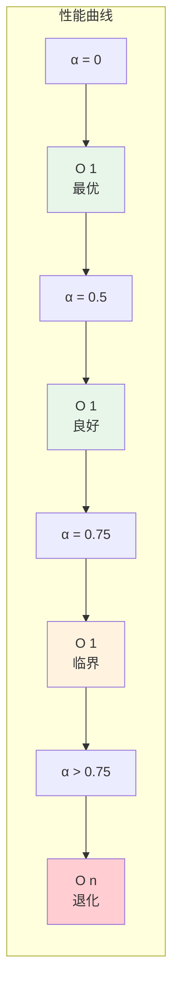

## 经典应用

### 1. 两数之和

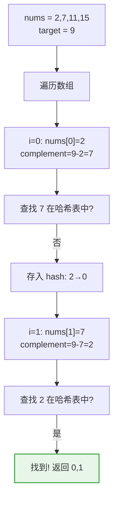

```c
int* twoSum(int nums[], int n, int target, int *returnSize) {
    HashMap *map = createHashMap(n);
    int *result = (int*)malloc(2 * sizeof(int));
    *returnSize = 2;
    
    for (int i = 0; i < n; i++) {
        int complement = target - nums[i];
        int found;
        int index = get(map, complement, &found);
        
        if (found) {
            result[0] = index;
            result[1] = i;
            return result;
        }
        
        insert(map, nums[i], i);
    }
    
    return result;
}
```

### 2. 字符频率统计

```c
void charCount(const char *str) {
    int count[256] = {0};  // ASCII字符哈希表
    
    for (int i = 0; str[i]; i++) {
        count[(unsigned char)str[i]]++;
    }
    
    for (int i = 0; i < 256; i++) {
        if (count[i] > 0) {
            printf("%c: %d\n", i, count[i]);
        }
    }
}
```

### 3. LRU 缓存

```cpp
class LRUCache {
private:
    int capacity;
    std::list<std::pair<int, int>> cache;  // 双向链表
    std::unordered_map<int, std::list<std::pair<int, int>>::iterator> map;  // 哈希表
    
public:
    LRUCache(int cap) : capacity(cap) {}
    
    int get(int key) {
        if (map.find(key) == map.end()) return -1;
        cache.splice(cache.begin(), cache, map[key]);  // 移到头部
        return map[key]->second;
    }
    
    void put(int key, int value) {
        if (map.find(key) != map.end()) {
            map[key]->second = value;
            cache.splice(cache.begin(), cache, map[key]);
            return;
        }
        
        if (cache.size() == capacity) {
            int oldKey = cache.back().first;
            cache.pop_back();
            map.erase(oldKey);
        }
        
        cache.push_front({key, value});
        map[key] = cache.begin();
    }
};
```

## 应用场景

| 应用场景 | 说明 | 示例 |
|---------|------|------|
| **符号表** | 编译器变量管理 | 变量名 → 变量信息 |
| **缓存系统** | 快速数据访问 | Redis、Memcached |
| **数据去重** | 判断元素是否存在 | Set 集合 |
| **频率统计** | 计数器 | 单词频率 |
| **数据库索引** | 加速查询 | 哈希索引 |
| **路由查找** | IP 路由 | IP → 接口 |

## 参考资料

- 《算法导论》第11章：哈希表
- 《数据结构与算法分析》第5章：散列
- [Wikipedia - Hash Table](https://en.wikipedia.org/wiki/Hash_table)
