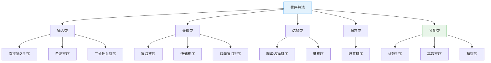
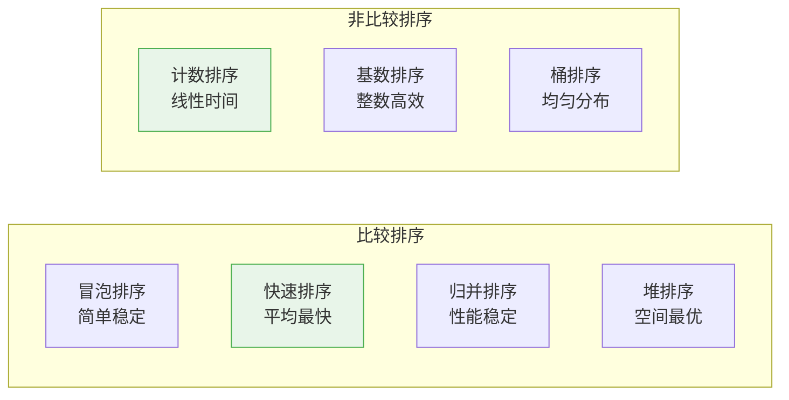
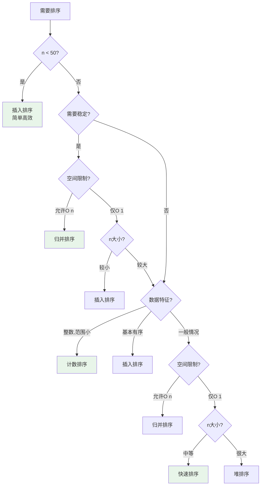

# 排序算法概述

排序算法是计算机科学中最基础、最重要的算法类别之一。排序问题可形式化定义为:

给定n个元素的序列{a₁, a₂, ..., aₙ},找出一个排列{a'₁, a'₂, ..., a'ₙ},使得a'₁ ≤ a'₂ ≤ ... ≤ a'ₙ。

<div style="background-color: #E3F2FD; padding: 15px; margin: 10px 0; border-left: 4px solid #2196F3; border-radius: 5px;">
    <strong>排序的重要性</strong>
    <ul style="margin: 5px 0;">
        <li><strong>基础算法</strong>: 许多算法以排序为预处理步骤</li>
        <li><strong>实际应用</strong>: 数据库、搜索引擎、推荐系统等核心组件</li>
        <li><strong>理论意义</strong>: 算法设计与分析的典型范例</li>
        <li><strong>性能优化</strong>: 有序数据可大幅提升查找效率</li>
    </ul>
</div>

## 排序算法分类

### 按算法思想分类



### 按处理方式分类

| 类别 | 算法 | 核心思想 | 特点 |
|------|------|---------|------|
| 插入排序 | 直接插入、希尔排序 | 构建有序序列,逐个插入 | 适合小规模或基本有序数据 |
| 交换排序 | 冒泡排序、快速排序、双向冒泡 | 通过交换元素位置排序 | 快速排序是实践中的首选 |
| 选择排序 | 简单选择、堆排序 | 每次选择最值放入正确位置 | 堆排序空间复杂度最优 |
| 归并排序 | 归并排序 | 分治思想,先分后合 | 稳定排序,性能稳定 |
| 分配排序 | 计数排序、基数排序、桶排序 | 根据元素值分配位置 | 非比较排序,可突破O(n log n)下界 |

## 排序算法比较

### 时间空间复杂度对比

| 算法 | 最好时间 | 平均时间 | 最坏时间 | 空间复杂度 | 稳定性 |
|------|---------|---------|---------|-----------|--------|
| 冒泡排序 | O(n) | O(n²) | O(n²) | O(1) | 稳定 |
| 选择排序 | O(n²) | O(n²) | O(n²) | O(1) | 不稳定 |
| 插入排序 | O(n) | O(n²) | O(n²) | O(1) | 稳定 |
| 希尔排序 | O(n log n) | O(n^1.3) | O(n²) | O(1) | 不稳定 |
| 归并排序 | O(n log n) | O(n log n) | O(n log n) | O(n) | 稳定 |
| 快速排序 | O(n log n) | O(n log n) | O(n²) | O(log n) | 不稳定 |
| 堆排序 | O(n log n) | O(n log n) | O(n log n) | O(1) | 不稳定 |
| 计数排序 | O(n+k) | O(n+k) | O(n+k) | O(k) | 稳定 |
| 基数排序 | O(d(n+k)) | O(d(n+k)) | O(d(n+k)) | O(n+k) | 稳定 |
| 桶排序 | O(n+k) | O(n+k) | O(n²) | O(n+k) | 稳定 |

### 算法特性对比



## 稳定性详解

### 稳定排序的定义

**稳定排序**: 如果排序前后,相等元素的相对顺序保持不变,则称为稳定排序。

```
原序列: 3A, 1, 3B, 2
        ↑        ↑
      第一个3  第二个3

稳定排序后: 1, 2, 3A, 3B  (3A仍在3B前面)
不稳定排序: 1, 2, 3B, 3A  (顺序改变)
```

### 稳定性的重要性

<div style="background-color: #FFF3E0; padding: 15px; margin: 10px 0; border-left: 4px solid #FF9800; border-radius: 5px;">
    <strong>需要稳定排序的场景</strong>
    <ul style="margin: 5px 0;">
        <li><strong>多关键字排序</strong>: 先按A排序,再按B排序,要求A相同的元素B顺序不变</li>
        <li><strong>数据库查询</strong>: ORDER BY score, age 需要保持之前的排序结果</li>
        <li><strong>用户界面</strong>: 表格多列排序,保持用户操作的直观性</li>
        <li><strong>对象排序</strong>: 保持对象的原始顺序或优先级</li>
    </ul>
</div>

### 各算法稳定性分析

| 算法 | 稳定性 | 原因 |
|------|--------|------|
| 冒泡排序 | 稳定 | 相等元素不交换(`>`而非`>=`) |
| 插入排序 | 稳定 | 相等元素不移动,保持相对位置 |
| 归并排序 | 稳定 | 合并时左边优先 |
| 选择排序 | 不稳定 | 可能跨越相等元素交换 |
| 希尔排序 | 不稳定 | 不同间隔的分组排序打乱顺序 |
| 快速排序 | 不稳定 | 分区交换可能改变相对顺序 |
| 堆排序 | 不稳定 | 堆调整可能改变相等元素顺序 |
| 计数排序 | 稳定 | 从后向前放置保证稳定 |
| 基数排序 | 稳定 | 每一位使用稳定排序(计数排序) |

## 内部排序 vs 外部排序

### 内部排序

**定义**: 数据完全在内存中完成排序

```
特点:
- 数据规模: n较小,可全部装入内存
- 访问速度: 快,直接内存访问
- 适用算法: 所有本目录讨论的排序算法
- 实际应用: 小文件排序、数组排序、集合排序
```

### 外部排序

**定义**: 数据量大于内存容量,需要借助外存(磁盘)完成排序

```
特点:
- 数据规模: n极大,超过内存容量
- 访问速度: 慢,涉及磁盘I/O
- 核心算法: 归并排序(多路归并)
- 优化目标: 减少磁盘I/O次数

外部排序过程:
1. 将大文件分块,每块可装入内存
2. 对每块使用内部排序,写入临时文件
3. 对多个有序临时文件进行归并
4. 生成最终有序文件

示例: 排序100GB文件(内存8GB)
- 分成13个块,每块约7.7GB
- 每块内部排序后写临时文件
- 13路归并生成最终文件
```

## 排序下界理论

### 比较排序的下界

**定理**: 任何基于比较的排序算法,最坏情况下至少需要 **Ω(n log n)** 次比较。

**证明(决策树方法)**:

```
n个元素有n!种可能的排列
决策树至少需要n!个叶子节点
高度为h的二叉树最多有2^h个叶子
因此: 2^h ≥ n!
      h ≥ log(n!)
      h ≥ n log n - n + O(log n)  (Stirling公式)
      h = Ω(n log n)

结论: 比较排序的最坏情况下界为Ω(n log n)
```

### 非比较排序的突破

非比较排序(计数、基数、桶排序)通过利用数据的特殊性质,可以突破O(n log n)下界:

```
计数排序: O(n + k),k为数据范围
基数排序: O(d(n + k)),d为位数,k为基数
桶排序:   O(n + k),k为桶数(数据均匀分布时)

当k或d相对较小时,可达到线性时间O(n)
```

## 常用排序函数

### C标准库

```c
#include <stdlib.h>

// qsort函数原型
void qsort(
    void *base,       // 数组起始地址
    size_t nmemb,     // 元素个数
    size_t size,      // 每个元素大小
    int (*compar)(const void *, const void *)  // 比较函数
);

// 使用示例
int compare(const void *a, const void *b) {
    return (*(int*)a - *(int*)b);
}

int arr[] = {3, 1, 4, 1, 5, 9, 2, 6};
qsort(arr, 8, sizeof(int), compare);

// 注意: qsort的实现通常是快速排序变体
//      C标准未规定具体算法,只要求排序正确
```

### C++ STL

```cpp
#include <algorithm>
#include <vector>

std::vector<int> v = {3, 1, 4, 1, 5, 9, 2, 6};

// 1. sort: 通常是Introsort(快排+堆排混合)
std::sort(v.begin(), v.end());
// 时间: O(n log n)
// 空间: O(log n)
// 稳定性: 不稳定

// 2. stable_sort: 归并排序变体
std::stable_sort(v.begin(), v.end());
// 时间: O(n log n)
// 空间: O(n)
// 稳定性: 稳定

// 3. partial_sort: 堆排序,找前k小元素
std::partial_sort(v.begin(), v.begin() + 3, v.end());
// 时间: O(n log k)
// 用途: Top-K问题

// 4. nth_element: 快速选择,找第k小元素
std::nth_element(v.begin(), v.begin() + 3, v.end());
// 时间: 平均O(n)
// 用途: 中位数、第k大元素
```

### Java Arrays

```java
import java.util.Arrays;

int[] arr = {3, 1, 4, 1, 5, 9, 2, 6};

// 1. 基本类型数组排序
Arrays.sort(arr);
// 实现: Dual-Pivot Quicksort(双轴快速排序)
// 时间: O(n log n)
// 稳定性: 不稳定

// 2. 对象数组排序
Integer[] objArr = {3, 1, 4, 1, 5, 9, 2, 6};
Arrays.sort(objArr);
// 实现: TimSort(归并+插入混合)
// 时间: O(n log n)
// 稳定性: 稳定

// 3. 并行排序(大数据量)
Arrays.parallelSort(arr);
// 利用多核并行加速
```

### Python sorted

```python
# Python的sort使用TimSort
arr = [3, 1, 4, 1, 5, 9, 2, 6]

# 1. 原地排序
arr.sort()
# 时间: O(n log n)
# 空间: O(n)最坏,平均O(1)
# 稳定性: 稳定

# 2. 返回新列表
sorted_arr = sorted(arr)

# 3. 自定义key
arr.sort(key=lambda x: abs(x))  # 按绝对值排序
arr.sort(key=lambda x: (x[0], x[1]))  # 多关键字排序

# TimSort特点:
# - 归并排序 + 插入排序混合
# - 对基本有序数据高效
# - 稳定排序
# - Python/Java/Android等广泛使用
```

### Go sort

```go
import "sort"

// 1. 基本类型排序
arr := []int{3, 1, 4, 1, 5, 9, 2, 6}
sort.Ints(arr)        // int切片
sort.Float64s(arr)    // float64切片
sort.Strings(arr)     // string切片

// 2. 自定义排序
sort.Slice(arr, func(i, j int) bool {
    return arr[i] < arr[j]
})

// 3. 自定义类型排序
type Person struct {
    Name string
    Age  int
}
people := []Person{...}

sort.Slice(people, func(i, j int) bool {
    return people[i].Age < people[j].Age
})

// Go sort实现:
// - 快速排序 + 堆排序 + 插入排序混合
// - 根据数据规模和递归深度自动切换
// - 不稳定排序
```

## 选择排序算法

### 决策树



### 快速选择表

| 场景 | 推荐算法 | 时间复杂度 | 原因 |
|------|---------|-----------|------|
| n < 50 | 插入排序 | O(n²) | 简单高效,常数小 |
| n中等,无特殊需求 | 快速排序 | O(n log n) | 实际最快 |
| n大,需要稳定 | 归并排序 | O(n log n) | 稳定且高效 |
| n大,空间受限 | 堆排序 | O(n log n) | O(1)空间 |
| 整数,范围小 | 计数排序 | O(n+k) | 线性时间 |
| 基本有序 | 插入排序 | O(n+逆序对) | 自适应 |
| 大量重复元素 | 三路快排 | O(n log n) | 高效处理重复 |

### 实际应用场景

#### 1. 数据库索引排序

```
场景: 构建B+树索引,需要排序大量记录
数据规模: 百万级以上
需求: 稳定排序,支持外部排序

推荐: 
- 内存排序: 归并排序(稳定)
- 外部排序: 多路归并排序
```

#### 2. 搜索引擎结果排序

```
场景: 搜索结果按相关性排序
数据规模: 千级到万级
需求: 快速排序,实时性要求高

推荐: 快速排序
- 平均性能最优
- 缓存友好
- 可中断(获取Top-K)
```

#### 3. 推荐系统排序

```
场景: 推荐物品按评分排序
数据规模: 万级到百万级
需求: 稳定排序,可能多关键字

推荐: 
- 单关键字: 归并排序/TimSort
- 多关键字: 先按次关键字,再按主关键字(稳定排序)
```

#### 4. 实时数据流排序

```
场景: 实时接收数据,维护Top-K
数据规模: 流式数据,内存有限
需求: 在线算法,快速插入

推荐: 
- 小Top-K: 堆排序(维护大小为K的小顶堆)
- 全排序: 插入排序(适合基本有序的增量数据)
```

## 排序算法的发展

### 历史演进

```
1950s:
- 冒泡排序、插入排序、选择排序(早期计算机)
- 希尔排序(1959,第一个突破O(n²)的算法)

1960s:
- 快速排序(1960,Hoare,分治思想)
- 归并排序(优化应用)

1970s-1980s:
- 堆排序(1970s,优先队列应用)
- Introsort(1997,Musser,快排+堆排混合)
- TimSort(2002,归并+插入混合)

现代:
- 双轴快速排序(2009,Yaroslavskiy,Java默认)
- 并行排序算法(利用多核)
- SIMD优化排序(利用向量指令)
```

### 现代优化方向

1. **混合算法**: 结合多种算法优点(Introsort, TimSort)
2. **并行化**: 利用多核并行排序
3. **SIMD优化**: 使用向量指令加速比较和交换
4. **缓存友好**: 优化内存访问模式
5. **自适应算法**: 根据数据特征动态选择策略

## 学习路线建议

### 初级阶段

1. **掌握基本算法**: 冒泡、插入、选择排序
2. **理解复杂度**: 时间、空间、稳定性概念
3. **实现练习**: 手写代码,理解每个步骤

### 中级阶段

1. **学习高效算法**: 快速、归并、堆排序
2. **理解算法思想**: 分治、贪心、递归
3. **优化技巧**: 减少比较、减少交换、空间优化

### 高级阶段

1. **非比较排序**: 计数、基数、桶排序
2. **混合算法**: Introsort、TimSort实现原理
3. **实际应用**: 标准库实现、数据库排序、大数据排序

### 研究方向

1. **并行排序算法**: 多线程、GPU、分布式排序
2. **外部排序**: 磁盘I/O优化、多路归并
3. **特殊场景**: 字符串排序、并行排序、近似排序

## 参考资料

### 经典教材

- 《算法导论》(Introduction to Algorithms) 第6-8章
- 《数据结构与算法分析》(Data Structures and Algorithm Analysis) 第7章
- 《算法》(Algorithms, Sedgewick) 第2章

### 在线资源

- VisuAlgo: 排序算法可视化
- Sorting.at: 多种排序算法动画演示
- GeeksforGeeks: 排序算法详解与实现
- Wikipedia: Sorting algorithm

### 经典论文

- Hoare, C. A. R. (1961). "Quicksort"
- Shell, D. L. (1959). "A High-Speed Sorting Procedure"
- Williams, J. W. J. (1964). "Heapsort"
- Knuth, D. E. (1998). "The Art of Computer Programming, Volume 3"

## 目录导航

本系列文档详细介绍了各种排序算法:

1. [排序算法概述](001-排序算法概述.md) (本文)
2. [冒泡排序](002-冒泡排序.md) - 最简单的排序算法
3. [快速排序](003-快速排序.md) - 实践中最常用的排序算法
4. [归并排序](004-归并排序.md) - 稳定高效的分治排序
5. [插入排序](005-插入排序.md) - 适合小规模和基本有序数据
6. [选择排序](006-选择排序.md) - 简单直观的选择策略
7. [堆排序](007-堆排序.md) - 基于堆的O(1)空间排序
8. [计数排序](008-计数排序.md) - 线性时间的非比较排序
9. [基数排序](009-基数排序.md) - 整数排序的高效算法
10. [桶排序](010-桶排序.md) - 利用分布特性的排序
11. [希尔排序](011-希尔排序.md) - 插入排序的高效改进
12. [双向冒泡排序](012-双向冒泡排序.md) - 冒泡排序的双向变体
13. [排序算法性能对比与选择](013-排序算法性能对比与选择.md) - 实际应用指南
