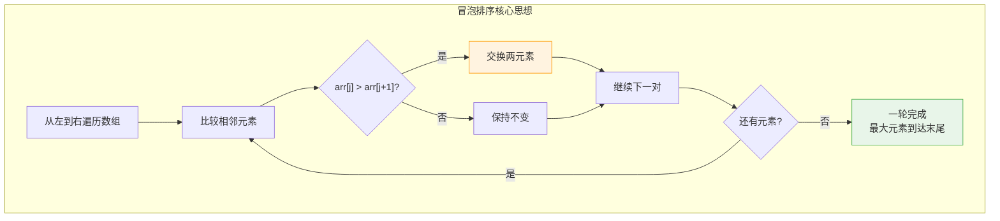
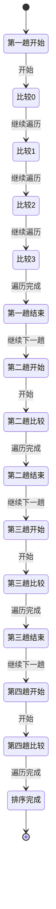
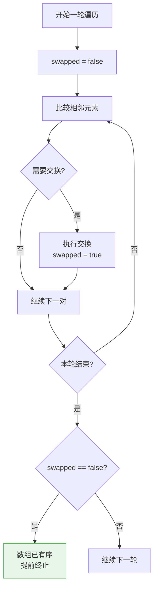
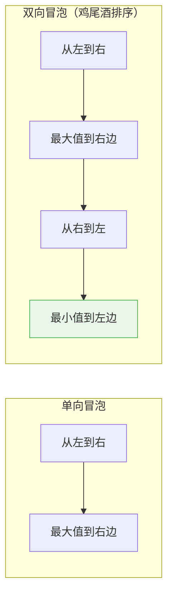
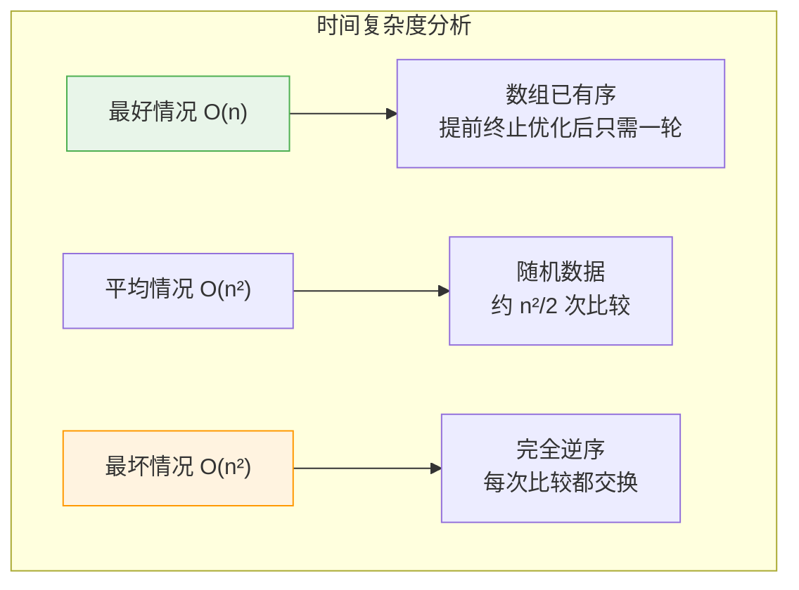
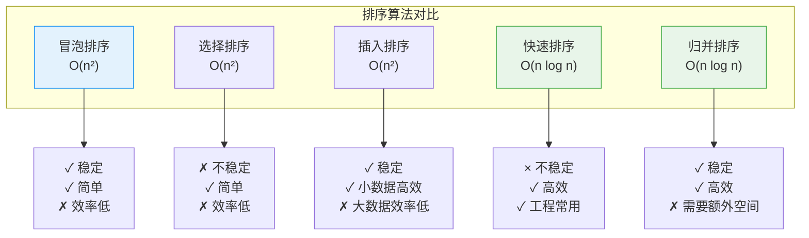
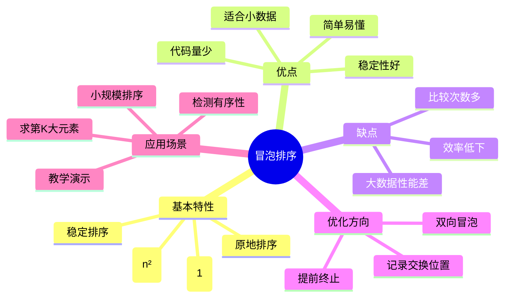

# 冒泡排序

## 概述

冒泡排序（Bubble Sort）是最简单直观的排序算法，其基本思想是：**通过重复交换相邻的逆序元素，使最大（或最小）元素逐渐"冒泡"到数组末尾**。

<div style="background-color: #E3F2FD; padding: 15px; margin: 10px 0; border-left: 4px solid #2196F3; border-radius: 5px;">
    <strong>核心特性</strong>
    <ul style="margin: 5px 0;">
        <li><strong>稳定排序</strong>：相等元素的相对顺序保持不变</li>
        <li><strong>原地排序</strong>：空间复杂度 O(1)</li>
        <li><strong>比较排序</strong>：通过比较确定元素顺序</li>
        <li><strong>简单易懂</strong>：适合教学和入门</li>
    </ul>
</div>

!!! note "生活类比"
    想象水中的气泡：轻的气泡会逐渐上浮到水面。在冒泡排序中，每轮比较让较大的元素"上浮"到数组末尾，就像气泡从水底浮到水面一样。

## 算法原理

### 基本思想



### 排序过程可视化

```
排序数组: [5, 3, 8, 4, 2]

第 1 趟（i=0）: 比较前 4 对元素
┌──────────────────────────────────────────────────────────┐
│ 初始:   [5, 3, 8, 4, 2]                                   │
│         ↓                                                  │
│ 比较0:  [5, 3] → 5>3 → 交换 → [3, 5, 8, 4, 2]            │
│                ↓                                          │
│ 比较1:  [5, 8] → 5<8 → 不换 → [3, 5, 8, 4, 2]            │
│                     ↓                                     │
│ 比较2:  [8, 4] → 8>4 → 交换 → [3, 5, 4, 8, 2]            │
│                          ↓                                │
│ 比较3:  [8, 2] → 8>2 → 交换 → [3, 5, 4, 2, 8]            │
│                                                 ↑         │
│ 第1趟结果: [3, 5, 4, 2, 8] ← 最大值8已"冒泡"到末尾       │
└──────────────────────────────────────────────────────────┘

第 2 趟（i=1）: 比较前 3 对元素（末尾8已排序）
┌──────────────────────────────────────────────────────────┐
│ 初始:   [3, 5, 4, 2, 8]                                   │
│         ↓                                                  │
│ 比较0:  [3, 5] → 3<5 → 不换 → [3, 5, 4, 2, 8]            │
│                ↓                                          │
│ 比较1:  [5, 4] → 5>4 → 交换 → [3, 4, 5, 2, 8]            │
│                     ↓                                     │
│ 比较2:  [5, 2] → 5>2 → 交换 → [3, 4, 2, 5, 8]            │
│                                        ↑                  │
│ 第2趟结果: [3, 4, 2, 5, 8] ← 次大值5已到位               │
└──────────────────────────────────────────────────────────┘

第 3 趟（i=2）: 比较前 2 对元素
┌──────────────────────────────────────────────────────────┐
│ 初始:   [3, 4, 2, 5, 8]                                   │
│         ↓                                                  │
│ 比较0:  [3, 4] → 3<4 → 不换 → [3, 4, 2, 5, 8]            │
│                ↓                                          │
│ 比较1:  [4, 2] → 4>2 → 交换 → [3, 2, 4, 5, 8]            │
│                              ↑                            │
│ 第3趟结果: [3, 2, 4, 5, 8] ← 第3大值4已到位              │
└──────────────────────────────────────────────────────────┘

第 4 趟（i=3）: 比较前 1 对元素
┌──────────────────────────────────────────────────────────┐
│ 初始:   [3, 2, 4, 5, 8]                                   │
│         ↓                                                  │
│ 比较0:  [3, 2] → 3>2 → 交换 → [2, 3, 4, 5, 8]            │
│                         ↑                                 │
│ 第4趟结果: [2, 3, 4, 5, 8] ← 排序完成！                  │
└──────────────────────────────────────────────────────────┘
```

### 算法状态转移图



## 基本实现

### 多语言实现

=== "C"
    ```c
    #include <stdio.h>
    
    // 基本冒泡排序
    void bubbleSort(int arr[], int n) {
        // 外层循环：控制趟数，共 n-1 趟
        for (int i = 0; i < n - 1; i++) {
            // 内层循环：每趟比较次数递减
            for (int j = 0; j < n - 1 - i; j++) {
                // 如果前一个元素大于后一个元素，交换
                if (arr[j] > arr[j + 1]) {
                    int temp = arr[j];
                    arr[j] = arr[j + 1];
                    arr[j + 1] = temp;
                }
            }
            
            // 打印每趟结果（可选）
            printf("第 %d 趟: ", i + 1);
            for (int k = 0; k < n; k++) {
                printf("%d ", arr[k]);
            }
            printf("\n");
        }
    }

    // 打印数组
    void printArray(int arr[], int n) {
        for (int i = 0; i < n; i++) {
            printf("%d ", arr[i]);
        }
        printf("\n");
    }

    int main() {
        int arr[] = {5, 3, 8, 4, 2};
        int n = sizeof(arr) / sizeof(arr[0]);
        
        printf("原始数组: ");
        printArray(arr, n);
        
        bubbleSort(arr, n);
        
        printf("排序结果: ");
        printArray(arr, n);
        
        return 0;
    }
    ```

=== "C++"

    ```cpp
    #include <iostream>
    #include <vector>
    using namespace std;
    
    // 基本冒泡排序
    void bubbleSort(vector<int>& arr) {
        int n = arr.size();
        // 外层循环：控制趟数，共 n-1 趟
        for (int i = 0; i < n - 1; i++) {
            // 内层循环：每趟比较次数递减
            for (int j = 0; j < n - 1 - i; j++) {
                // 如果前一个元素大于后一个元素，交换
                if (arr[j] > arr[j + 1]) {
                    swap(arr[j], arr[j + 1]);
                }
            }
            
            // 打印每趟结果（可选）
            cout << "第 " << i + 1 << " 趟: ";
            for (int k = 0; k < n; k++) {
                cout << arr[k] << " ";
            }
            cout << endl;
        }
    }

    int main() {
        vector<int> arr = {5, 3, 8, 4, 2};
        
        cout << "原始数组: ";
        for (int num : arr) cout << num << " ";
        cout << endl;
        
        bubbleSort(arr);
        
        cout << "排序结果: ";
        for (int num : arr) cout << num << " ";
        cout << endl;
        
        return 0;
    }
    ```

=== "Python"

    ```python
    def bubble_sort(arr):
        """基本冒泡排序"""
        n = len(arr)
        # 外层循环：控制趟数，共 n-1 趟
        for i in range(n - 1):
            # 内层循环：每趟比较次数递减
            for j in range(n - 1 - i):
                # 如果前一个元素大于后一个元素，交换
                if arr[j] > arr[j + 1]:
                    arr[j], arr[j + 1] = arr[j + 1], arr[j]
            
            # 打印每趟结果（可选）
            print(f"第 {i + 1} 趟: {arr}")
        return arr
    
    # 测试
    if __name__ == "__main__":
        arr = [5, 3, 8, 4, 2]
        print(f"原始数组: {arr}")
        bubble_sort(arr)
        print(f"排序结果: {arr}")
    ```

=== "Java"

    ```java
    public class BubbleSort {
        // 基本冒泡排序
        public static void bubbleSort(int[] arr) {
            int n = arr.length;
            // 外层循环：控制趟数，共 n-1 趟
            for (int i = 0; i < n - 1; i++) {
                // 内层循环：每趟比较次数递减
                for (int j = 0; j < n - 1 - i; j++) {
                    // 如果前一个元素大于后一个元素，交换
                    if (arr[j] > arr[j + 1]) {
                        int temp = arr[j];
                        arr[j] = arr[j + 1];
                        arr[j + 1] = temp;
                    }
                }
                
                // 打印每趟结果（可选）
                System.out.print("第 " + (i + 1) + " 趟: ");
                printArray(arr);
            }
        }
        
        // 打印数组
        private static void printArray(int[] arr) {
            for (int num : arr) {
                System.out.print(num + " ");
            }
            System.out.println();
        }
        
        public static void main(String[] args) {
            int[] arr = {5, 3, 8, 4, 2};
            
            System.out.print("原始数组: ");
            printArray(arr);
            
            bubbleSort(arr);
            
            System.out.print("排序结果: ");
            printArray(arr);
        }
    }
    ```

=== "Go"

    ```go
    package main
    
    import "fmt"
    
    // 基本冒泡排序
    func bubbleSort(arr []int) {
        n := len(arr)
        // 外层循环：控制趟数，共 n-1 趟
        for i := 0; i < n-1; i++ {
            // 内层循环：每趟比较次数递减
            for j := 0; j < n-1-i; j++ {
                // 如果前一个元素大于后一个元素，交换
                if arr[j] > arr[j+1] {
                    arr[j], arr[j+1] = arr[j+1], arr[j]
                }
            }
            
            // 打印每趟结果（可选）
            fmt.Printf("第 %d 趟: %v\n", i+1, arr)
        }
    }
    
    func main() {
        arr := []int{5, 3, 8, 4, 2}
        
        fmt.Printf("原始数组: %v\n", arr)
        bubbleSort(arr)
        fmt.Printf("排序结果: %v\n", arr)
    }
    ```

=== "Rust"

    ```rust
    // 基本冒泡排序
    fn bubble_sort(arr: &mut [i32]) {
        let n = arr.len();
        // 外层循环：控制趟数，共 n-1 趟
        for i in 0..n-1 {
            // 内层循环：每趟比较次数递减
            for j in 0..n-1-i {
                // 如果前一个元素大于后一个元素，交换
                if arr[j] > arr[j+1] {
                    arr.swap(j, j+1);
                }
            }
            
            // 打印每趟结果（可选）
            println!("第 {} 趟: {:?}", i+1, arr);
        }
    }

    fn main() {
        let mut arr = [5, 3, 8, 4, 2];
        
        println!("原始数组: {:?}", arr);
        bubble_sort(&mut arr);
        println!("排序结果: {:?}", arr);
    }
    ```

<div></div>

## 优化版本

### 优化一：提前终止（检测是否已有序）



```
优化效果示例:

数组: [1, 2, 3, 4, 5] (已有序)

无优化版本: 执行 4 趟，每趟都遍历
┌─────────────────────────────────┐
│ 第1趟: 比较4次，无交换           │
│ 第2趟: 比较3次，无交换           │
│ 第3趟: 比较2次，无交换           │
│ 第4趟: 比较1次，无交换           │
│ 总比较次数: 10次                 │
└─────────────────────────────────┘

有优化版本: 第1趟检测到无交换，立即终止
┌─────────────────────────────────┐
│ 第1趟: 比较4次，无交换           │
│ swapped = false → 提前终止      │
│ 总比较次数: 4次                  │
│ 节省 60% 比较次数！              │
└─────────────────────────────────┘
```

=== "C"
    ```c
    void bubbleSortOptimized1(int arr[], int n) {
        for (int i = 0; i < n - 1; i++) {
            int swapped = 0;  // 标记本轮是否发生交换
            
            for (int j = 0; j < n - 1 - i; j++) {
                if (arr[j] > arr[j + 1]) {
                    int temp = arr[j];
                    arr[j] = arr[j + 1];
                    arr[j + 1] = temp;
                    swapped = 1;  // 标记发生了交换
                }
            }
            
            // 如果本轮没有交换，说明数组已有序
            if (!swapped) {
                printf("第 %d 趟后数组已有序，提前终止\n", i + 1);
                break;
            }
        }
    }
    ```

=== "C++"
    ```cpp
    void bubbleSortOptimized1(vector<int>& arr) {
        int n = arr.size();
        for (int i = 0; i < n - 1; i++) {
            bool swapped = false;  // 标记本轮是否发生交换
            
            for (int j = 0; j < n - 1 - i; j++) {
                if (arr[j] > arr[j + 1]) {
                    swap(arr[j], arr[j + 1]);
                    swapped = true;  // 标记发生了交换
                }
            }
            
            // 如果本轮没有交换，说明数组已有序
            if (!swapped) {
                cout << "第 " << i + 1 << " 趟后数组已有序，提前终止" << endl;
                break;
            }
        }
    }
    ```

=== "Python"
    ```python
    def bubble_sort_optimized1(arr):
        """优化一：提前终止"""
        n = len(arr)
        for i in range(n - 1):
            swapped = False  # 标记本轮是否发生交换
            
            for j in range(n - 1 - i):
                if arr[j] > arr[j + 1]:
                    arr[j], arr[j + 1] = arr[j + 1], arr[j]
                    swapped = True  # 标记发生了交换
            
            # 如果本轮没有交换，说明数组已有序
            if not swapped:
                print(f"第 {i + 1} 趟后数组已有序，提前终止")
                break
        return arr
    ```

=== "Java"
    ```java
    public static void bubbleSortOptimized1(int[] arr) {
        int n = arr.length;
        for (int i = 0; i < n - 1; i++) {
            boolean swapped = false;  // 标记本轮是否发生交换
            
            for (int j = 0; j < n - 1 - i; j++) {
                if (arr[j] > arr[j + 1]) {
                    int temp = arr[j];
                    arr[j] = arr[j + 1];
                    arr[j + 1] = temp;
                    swapped = true;  // 标记发生了交换
                }
            }
            
            // 如果本轮没有交换，说明数组已有序
            if (!swapped) {
                System.out.println("第 " + (i + 1) + " 趟后数组已有序，提前终止");
                break;
            }
        }
    }
    ```

=== "Go"
    ```go
    func bubbleSortOptimized1(arr []int) {
        n := len(arr)
        for i := 0; i < n-1; i++ {
            swapped := false  // 标记本轮是否发生交换
            
            for j := 0; j < n-1-i; j++ {
                if arr[j] > arr[j+1] {
                    arr[j], arr[j+1] = arr[j+1], arr[j]
                    swapped = true  // 标记发生了交换
                }
            }
            
            // 如果本轮没有交换，说明数组已有序
            if !swapped {
                fmt.Printf("第 %d 趟后数组已有序，提前终止\n", i+1)
                break
            }
        }
    }
    ```

=== "Rust"
    ```rust
    fn bubble_sort_optimized1(arr: &mut [i32]) {
        let n = arr.len();
        for i in 0..n-1 {
            let mut swapped = false;  // 标记本轮是否发生交换
            
            for j in 0..n-1-i {
                if arr[j] > arr[j+1] {
                    arr.swap(j, j+1);
                    swapped = true;  // 标记发生了交换
                }
            }
            
            // 如果本轮没有交换，说明数组已有序
            if !swapped {
                println!("第 {} 趟后数组已有序，提前终止", i+1);
                break;
            }
        }
    }
    ```

<div></div>

### 优化二：记录最后交换位置


原理: 每趟最后一次交换位置之后的所有元素已经有序

示例: [3, 2, 1, 5, 6, 7]

第1趟遍历:
┌────────────────────────────────────────────────────┐
│ [3, 2] → 交换, lastSwap=0                          │
│ [3, 1] → 交换, lastSwap=1                          │
│ [3, 5] → 不换                                      │
│ [5, 6] → 不换                                      │
│ [6, 7] → 不换                                      │
│                                                    │
│ lastSwap=1 表示位置1之后的元素[5,6,7]已经有序      │
│ 下一趟只需遍历到位置1                              │
└────────────────────────────────────────────────────┘

普通版本下一趟需要遍历到位置4
优化版本下一趟只需遍历到位置1
节省 75% 比较次数！


=== "C"
    ```c
    void bubbleSortOptimized2(int arr[], int n) {
        int lastSwap = n - 1;  // 记录最后交换的位置
        
        while (lastSwap > 0) {
            int currSwap = 0;  // 本轮最后交换位置
            
            for (int j = 0; j < lastSwap; j++) {
                if (arr[j] > arr[j + 1]) {
                    int temp = arr[j];
                    arr[j] = arr[j + 1];
                    arr[j + 1] = temp;
                    currSwap = j;  // 记录交换位置
                }
            }
            
            printf("本轮最后交换位置: %d, 下趟只需遍历到 %d\n", 
                   currSwap, currSwap);
            lastSwap = currSwap;  // 下一趟只需遍历到这里
        }
    }
    ```

=== "C++"
    ```cpp
    void bubbleSortOptimized2(vector<int>& arr) {
        int n = arr.size();
        int lastSwap = n - 1;  // 记录最后交换的位置
        
        while (lastSwap > 0) {
            int currSwap = 0;  // 本轮最后交换位置
            
            for (int j = 0; j < lastSwap; j++) {
                if (arr[j] > arr[j + 1]) {
                    swap(arr[j], arr[j + 1]);
                    currSwap = j;  // 记录交换位置
                }
            }
            
            cout << "本轮最后交换位置: " << currSwap 
                 << ", 下趟只需遍历到 " << currSwap << endl;
            lastSwap = currSwap;  // 下一趟只需遍历到这里
        }
    }
    ```

=== "Python"
    ```python
    def bubble_sort_optimized2(arr):
        """优化二：记录最后交换位置"""
        n = len(arr)
        last_swap = n - 1  # 记录最后交换的位置
        
        while last_swap > 0:
            curr_swap = 0  # 本轮最后交换位置
            
            for j in range(last_swap):
                if arr[j] > arr[j + 1]:
                    arr[j], arr[j + 1] = arr[j + 1], arr[j]
                    curr_swap = j  # 记录交换位置
            
            print(f"本轮最后交换位置: {curr_swap}, 下趟只需遍历到 {curr_swap}")
            last_swap = curr_swap  # 下一趟只需遍历到这里
        return arr
    ```

=== "Java"
    ```java
    public static void bubbleSortOptimized2(int[] arr) {
        int n = arr.length;
        int lastSwap = n - 1;  // 记录最后交换的位置
        
        while (lastSwap > 0) {
            int currSwap = 0;  // 本轮最后交换位置
            
            for (int j = 0; j < lastSwap; j++) {
                if (arr[j] > arr[j + 1]) {
                    int temp = arr[j];
                    arr[j] = arr[j + 1];
                    arr[j + 1] = temp;
                    currSwap = j;  // 记录交换位置
                }
            }
            
            System.out.println("本轮最后交换位置: " + currSwap + 
                             ", 下趟只需遍历到 " + currSwap);
            lastSwap = currSwap;  // 下一趟只需遍历到这里
        }
    }
    ```

=== "Go"
    ```go
    func bubbleSortOptimized2(arr []int) {
        n := len(arr)
        lastSwap := n - 1  // 记录最后交换的位置
        
        for lastSwap > 0 {
            currSwap := 0  // 本轮最后交换位置
            
            for j := 0; j < lastSwap; j++ {
                if arr[j] > arr[j+1] {
                    arr[j], arr[j+1] = arr[j+1], arr[j]
                    currSwap = j  // 记录交换位置
                }
            }
            
            fmt.Printf("本轮最后交换位置: %d, 下趟只需遍历到 %d\n", 
                      currSwap, currSwap)
            lastSwap = currSwap  // 下一趟只需遍历到这里
        }
    }
    ```

=== "Rust"
    ```rust
    fn bubble_sort_optimized2(arr: &mut [i32]) {
        let n = arr.len();
        let mut last_swap = n - 1;  // 记录最后交换的位置
        
        while last_swap > 0 {
            let mut curr_swap = 0;  // 本轮最后交换位置
            
            for j in 0..last_swap {
                if arr[j] > arr[j+1] {
                    arr.swap(j, j+1);
                    curr_swap = j;  // 记录交换位置
                }
            }
            
            println!("本轮最后交换位置: {}, 下趟只需遍历到 {}", 
                    curr_swap, curr_swap);
            last_swap = curr_swap;  // 下一趟只需遍历到这里
        }
    }
    ```

<div></div>

### 优化三：双向冒泡（鸡尾酒排序）



```
双向冒泡示例: [5, 1, 4, 2, 3]

第1趟正向（从左到右）:
┌────────────────────────────────────────┐
│ [5, 1] → 交换 → [1, 5, 4, 2, 3]        │
│ [5, 4] → 交换 → [1, 4, 5, 2, 3]        │
│ [5, 2] → 交换 → [1, 4, 2, 5, 3]        │
│ [5, 3] → 交换 → [1, 4, 2, 3, 5]        │
│ 结果: 最大值5到达右端                   │
└────────────────────────────────────────┘

第1趟反向（从右到左）:
┌────────────────────────────────────────┐
│ [2, 3] → 不换                          │
│ [4, 2] → 交换 → [1, 2, 4, 3, 5]        │
│ [1, 2] → 不换                          │
│ 结果: 最小值1到达左端                   │
└────────────────────────────────────────┘

第2趟正向:
┌────────────────────────────────────────┐
│ [2, 4] → 不换                          │
│ [4, 3] → 交换 → [1, 2, 3, 4, 5]        │
│ 结果: 次大值4到达位置                   │
└────────────────────────────────────────┘

已有序，排序完成！
```

=== "C"
    ```c
    void cocktailSort(int arr[], int n) {
        int left = 0, right = n - 1;
        int swapped;
        
        while (left < right) {
            swapped = 0;
            
            // 正向：把最大值移到右边
            printf("正向遍历 [%d, %d]:\n", left, right);
            for (int j = left; j < right; j++) {
                if (arr[j] > arr[j + 1]) {
                    int temp = arr[j];
                    arr[j] = arr[j + 1];
                    arr[j + 1] = temp;
                    swapped = 1;
                    printf("  交换位置 %d: ", j);
                    for (int k = 0; k < n; k++) printf("%d ", arr[k]);
                    printf("\n");
                }
            }
            right--;  // 右边界左移
            
            if (!swapped) break;
            
            swapped = 0;
            
            // 反向：把最小值移到左边
            printf("反向遍历 [%d, %d]:\n", left, right);
            for (int j = right; j > left; j--) {
                if (arr[j - 1] > arr[j]) {
                    int temp = arr[j - 1];
                    arr[j - 1] = arr[j];
                    arr[j] = temp;
                    swapped = 1;
                    printf("  交换位置 %d: ", j - 1);
                    for (int k = 0; k < n; k++) printf("%d ", arr[k]);
                    printf("\n");
                }
            }
            left++;  // 左边界右移
            
            if (!swapped) break;
        }
        
        printf("排序完成!\n");
    }
    ```

=== "C++"
    ```cpp
    void cocktailSort(vector<int>& arr) {
        int n = arr.size();
        int left = 0, right = n - 1;
        bool swapped;
        
        while (left < right) {
            swapped = false;
            
            // 正向：把最大值移到右边
            cout << "正向遍历 [" << left << ", " << right << "]:" << endl;
            for (int j = left; j < right; j++) {
                if (arr[j] > arr[j + 1]) {
                    swap(arr[j], arr[j + 1]);
                    swapped = true;
                    cout << "  交换位置 " << j << ": ";
                    for (int k = 0; k < n; k++) cout << arr[k] << " ";
                    cout << endl;
                }
            }
            right--;  // 右边界左移
            
            if (!swapped) break;
            
            swapped = false;
            
            // 反向：把最小值移到左边
            cout << "反向遍历 [" << left << ", " << right << "]:" << endl;
            for (int j = right; j > left; j--) {
                if (arr[j - 1] > arr[j]) {
                    swap(arr[j - 1], arr[j]);
                    swapped = true;
                    cout << "  交换位置 " << j - 1 << ": ";
                    for (int k = 0; k < n; k++) cout << arr[k] << " ";
                    cout << endl;
                }
            }
            left++;  // 左边界右移
            
            if (!swapped) break;
        }
        
        cout << "排序完成!" << endl;
    }
    ```

=== "Python"
    ```python
    def cocktail_sort(arr):
        """优化三：双向冒泡（鸡尾酒排序）"""
        n = len(arr)
        left, right = 0, n - 1
        
        while left < right:
            swapped = False
            
            # 正向：把最大值移到右边
            print(f"正向遍历 [{left}, {right}]:")
            for j in range(left, right):
                if arr[j] > arr[j + 1]:
                    arr[j], arr[j + 1] = arr[j + 1], arr[j]
                    swapped = True
                    print(f"  交换位置 {j}: {arr}")
            right -= 1  # 右边界左移
            
            if not swapped:
                break
            
            swapped = False
            
            # 反向：把最小值移到左边
            print(f"反向遍历 [{left}, {right}]:")
            for j in range(right, left, -1):
                if arr[j - 1] > arr[j]:
                    arr[j - 1], arr[j] = arr[j], arr[j - 1]
                    swapped = True
                    print(f"  交换位置 {j - 1}: {arr}")
            left += 1  # 左边界右移
            
            if not swapped:
                break
        
        print("排序完成!")
        return arr
    ```

=== "Java"
    ```java
    public static void cocktailSort(int[] arr) {
        int n = arr.length;
        int left = 0, right = n - 1;
        boolean swapped;
        
        while (left < right) {
            swapped = false;
            
            // 正向：把最大值移到右边
            System.out.println("正向遍历 [" + left + ", " + right + "]:");
            for (int j = left; j < right; j++) {
                if (arr[j] > arr[j + 1]) {
                    int temp = arr[j];
                    arr[j] = arr[j + 1];
                    arr[j + 1] = temp;
                    swapped = true;
                    System.out.print("  交换位置 " + j + ": ");
                    for (int k = 0; k < n; k++) System.out.print(arr[k] + " ");
                    System.out.println();
                }
            }
            right--;  // 右边界左移
            
            if (!swapped) break;
            
            swapped = false;
            
            // 反向：把最小值移到左边
            System.out.println("反向遍历 [" + left + ", " + right + "]:");
            for (int j = right; j > left; j--) {
                if (arr[j - 1] > arr[j]) {
                    int temp = arr[j - 1];
                    arr[j - 1] = arr[j];
                    arr[j] = temp;
                    swapped = true;
                    System.out.print("  交换位置 " + (j - 1) + ": ");
                    for (int k = 0; k < n; k++) System.out.print(arr[k] + " ");
                    System.out.println();
                }
            }
            left++;  // 左边界右移
            
            if (!swapped) break;
        }
        
        System.out.println("排序完成!");
    }
    ```

=== "Go"
    ```go
    func cocktailSort(arr []int) {
        n := len(arr)
        left, right := 0, n-1
        
        for left < right {
            swapped := false
            
            // 正向：把最大值移到右边
            fmt.Printf("正向遍历 [%d, %d]:\n", left, right)
            for j := left; j < right; j++ {
                if arr[j] > arr[j+1] {
                    arr[j], arr[j+1] = arr[j+1], arr[j]
                    swapped = true
                    fmt.Printf("  交换位置 %d: %v\n", j, arr)
                }
            }
            right--  // 右边界左移
            
            if !swapped {
                break
            }
            
            swapped = false
            
            // 反向：把最小值移到左边
            fmt.Printf("反向遍历 [%d, %d]:\n", left, right)
            for j := right; j > left; j-- {
                if arr[j-1] > arr[j] {
                    arr[j-1], arr[j] = arr[j], arr[j-1]
                    swapped = true
                    fmt.Printf("  交换位置 %d: %v\n", j-1, arr)
                }
            }
            left++  // 左边界右移
            
            if !swapped {
                break
            }
        }
        
        fmt.Println("排序完成!")
    }
    ```

=== "Rust"
    ```rust
    fn cocktail_sort(arr: &mut [i32]) {
        let n = arr.len();
        let mut left = 0;
        let mut right = n - 1;
        
        while left < right {
            let mut swapped = false;
            
            // 正向：把最大值移到右边
            println!("正向遍历 [{}, {}]:", left, right);
            for j in left..right {
                if arr[j] > arr[j+1] {
                    arr.swap(j, j+1);
                    swapped = true;
                    println!("  交换位置 {}: {:?}", j, arr);
                }
            }
            right -= 1;  // 右边界左移
            
            if !swapped {
                break;
            }
            
            swapped = false;
            
            // 反向：把最小值移到左边
            println!("反向遍历 [{}, {}]:", left, right);
            for j in (left..right).rev() {
                if arr[j] > arr[j+1] {
                    arr.swap(j, j+1);
                    swapped = true;
                    println!("  交换位置 {}: {:?}", j, arr);
                }
            }
            left += 1;  // 左边界右移
            
            if !swapped {
                break;
            }
        }
        
        println!("排序完成!");
    }
    ```

<div></div>

### 优化效果对比

```
测试数据: 部分有序数组 [1, 2, 3, 5, 4]

┌─────────────────────────────────────────────────────────────┐
│ 版本           │ 比较次数 │ 交换次数 │ 说明               │
├─────────────────────────────────────────────────────────────┤
│ 基本版本       │ 10       │ 1        │ 固定执行所有趟数   │
│ 提前终止       │ 7        │ 1        │ 检测有序提前结束   │
│ 记录交换位置   │ 5        │ 1        │ 减少每趟比较范围   │
│ 双向冒泡       │ 6        │ 1        │ 双向同时有序       │
└─────────────────────────────────────────────────────────────┘

测试数据: 完全逆序 [5, 4, 3, 2, 1]

┌─────────────────────────────────────────────────────────────┐
│ 版本           │ 比较次数 │ 交换次数 │ 说明               │
├─────────────────────────────────────────────────────────────┤
│ 所有版本       │ 10       │ 10       │ 最坏情况，优化无效 │
└─────────────────────────────────────────────────────────────┘
```

## 复杂度分析

### 时间复杂度



#### 详细推导

<div style="background-color: #F3E5F5; padding: 15px; margin: 10px 0; border-left: 4px solid #9C27B0; border-radius: 5px;">
    <strong>比较次数推导</strong>
    <p>第 i 趟需要比较 n-i 次（i 从 0 开始）</p>
    <p>总比较次数 = (n-1) + (n-2) + ... + 1 = n(n-1)/2</p>
    <p>时间复杂度 = O(n²)</p>
</div>

<div style="background-color: #F3E5F5; padding: 15px; margin: 10px 0; border-left: 4px solid #9C27B0; border-radius: 5px;">
    <strong>交换次数推导</strong>
    <p>最坏情况（完全逆序）：每次比较都交换</p>
    <p>交换次数 = n(n-1)/2</p>
    <p>最好情况（已有序）：0 次交换</p>
</div>

### 空间复杂度

| 变量 | 空间 | 说明 |
|------|------|------|
| 临时变量 temp | O(1) | 交换时使用 |
| 循环变量 i, j | O(1) | 控制循环 |
| 标记变量 swapped | O(1) | 优化使用 |
| **总空间** | **O(1)** | **原地排序** |

### 逆序对分析

```
逆序对: 如果 i < j 但 arr[i] > arr[j]，则 (arr[i], arr[j]) 是一个逆序对

逆序对数量与排序工作量:
┌────────────────────────────────────────────────────┐
│ 数组状态          │ 逆序对数量 │ 交换次数         │
├────────────────────────────────────────────────────┤
│ [1,2,3,4,5] 有序  │ 0          │ 0                │
│ [5,4,3,2,1] 逆序  │ 10         │ 10               │
│ [3,1,4,2,5] 随机  │ 3          │ 3                │
└────────────────────────────────────────────────────┘

冒泡排序每次交换恰好减少一个逆序对
排序完成 = 逆序对数量为 0
```

## 稳定性分析

### 为什么冒泡排序是稳定的

```
稳定性证明:

假设有两个相等的元素 a 和 a'，且 a 在 a' 之前

比较时使用 arr[j] > arr[j+1]:
┌────────────────────────────────────────┐
│ 情况1: arr[j] = a, arr[j+1] = a'       │
│        a > a' ? → 否（相等不触发交换） │
│        a 仍然在 a' 之前               │
├────────────────────────────────────────┤
│ 情况2: arr[j] = a', arr[j+1] = a       │
│        这不可能，因为 a 在 a' 之前     │
└────────────────────────────────────────┘

结论: 相等元素的相对顺序不会改变 → 稳定排序 ✓
```

### 保持稳定性的关键

```c
// 稳定版本（正确）
if (arr[j] > arr[j + 1]) {  // 只在严格大于时交换
    swap(arr[j], arr[j + 1]);
}

// 不稳定版本（错误）
if (arr[j] >= arr[j + 1]) {  // 等于时也交换会破坏稳定性
    swap(arr[j], arr[j + 1]);
}
```

## 与其他排序算法对比



### 性能对比表

```
n = 10000 个随机整数的排序时间:

┌─────────────────────────────────────────────────────────────┐
│ 算法         │ 时间 (ms)  │ 比较次数    │ 交换次数         │
├─────────────────────────────────────────────────────────────┤
│ 冒泡排序     │ 245        │ 49,995,000  │ ~25,000,000      │
│ 选择排序     │ 158        │ 49,995,000  │ <10,000          │
│ 插入排序     │ 89         │ ~25,000,000 │ ~25,000,000      │
│ 快速排序     │ 2          │ ~150,000    │ ~50,000          │
│ 归并排序     │ 3          │ ~133,000    │ ~100,000         │
└─────────────────────────────────────────────────────────────┘

结论: 冒泡排序是最慢的 O(n²) 排序算法之一
```

## 变体应用

### 1. 求第 K 大/小元素

```c
// 利用冒泡排序的部分特性求第K大元素
// 只需要执行K趟冒泡
int findKthLargest(int arr[], int n, int k) {
    // 执行k趟，每趟把当前最大的移到右边
    for (int i = 0; i < k; i++) {
        for (int j = 0; j < n - 1 - i; j++) {
            if (arr[j] > arr[j + 1]) {
                int temp = arr[j];
                arr[j] = arr[j + 1];
                arr[j + 1] = temp;
            }
        }
    }
    // 第K大元素在位置 n-k
    return arr[n - k];
}

// 示例
int arr[] = {3, 1, 4, 1, 5, 9, 2, 6};
int k = 3;
printf("第%d大元素: %d\n", k, findKthLargest(arr, 8, k));
// 输出: 第3大元素: 5
```

### 2. 检测数组是否有序

```c
// 利用冒泡排序的提前终止特性
int isSorted(int arr[], int n) {
    for (int i = 0; i < n - 1; i++) {
        if (arr[i] > arr[i + 1]) {
            return 0;  // 发现逆序对
        }
    }
    return 1;  // 完全有序
}
```

### 3. 统计逆序对数量

```c
// 利用冒泡排序过程统计逆序对
int countInversions(int arr[], int n) {
    int inversions = 0;
    
    for (int i = 0; i < n - 1; i++) {
        for (int j = 0; j < n - 1 - i; j++) {
            if (arr[j] > arr[j + 1]) {
                // 每次交换减少一个逆序对
                int temp = arr[j];
                arr[j] = arr[j + 1];
                arr[j + 1] = temp;
                inversions++;
            }
        }
    }
    
    return inversions;
}
```

### 4. 奇偶排序（并行冒泡排序）

```c
// 奇偶排序 - 适合并行计算
void oddEvenSort(int arr[], int n) {
    int sorted = 0;
    
    while (!sorted) {
        sorted = 1;
        
        // 奇数阶段：比较奇数索引的相邻对
        for (int j = 1; j < n - 1; j += 2) {
            if (arr[j] > arr[j + 1]) {
                int temp = arr[j];
                arr[j] = arr[j + 1];
                arr[j + 1] = temp;
                sorted = 0;
            }
        }
        
        // 偶数阶段：比较偶数索引的相邻对
        for (int j = 0; j < n - 1; j += 2) {
            if (arr[j] > arr[j + 1]) {
                int temp = arr[j];
                arr[j] = arr[j + 1];
                arr[j + 1] = temp;
                sorted = 0;
            }
        }
    }
}
```

## 适用场景分析

### 适用场景

<div style="background-color: #E8F5E9; padding: 15px; margin: 10px 0; border-left: 4px solid #4CAF50; border-radius: 5px;">
    <strong>适合使用冒泡排序的场景</strong>
    <ul style="margin: 5px 0;">
        <li><strong>教学演示</strong>：算法简单，易于理解和实现</li>
        <li><strong>小规模数据</strong>：n < 50 时效率可接受</li>
        <li><strong>基本有序数据</strong>：配合提前终止优化效果好</li>
        <li><strong>稳定性要求</strong>：需要保持相等元素原有顺序</li>
        <li><strong>资源受限环境</strong>：代码简单，内存占用极小</li>
    </ul>
</div>

### 不适用场景

<div style="background-color: #FFF3E0; padding: 15px; margin: 10px 0; border-left: 4px solid #FF9800; border-radius: 5px;">
    <strong>不适合使用冒泡排序的场景</strong>
    <ul style="margin: 5px 0;">
        <li><strong>大规模数据</strong>：O(n²) 效率太低</li>
        <li><strong>性能要求高</strong>：应选择快速排序、归并排序等</li>
        <li><strong>实时系统</strong>：排序时间不可预测</li>
        <li><strong>大量数据排序</strong>：n > 1000 时效率显著下降</li>
    </ul>
</div>

## 常见错误与陷阱

### 1. 边界条件错误

```c
// 错误：内层循环边界
for (int j = 0; j < n - i; j++) {  // 错误：应该是 n - 1 - i
    if (arr[j] > arr[j + 1]) {
        // 当 j = n - i 时，arr[j+1] 会越界
    }
}

// 正确
for (int j = 0; j < n - 1 - i; j++) {
    if (arr[j] > arr[j + 1]) {
        // 安全
    }
}
```

### 2. 优化后忘记更新边界

```c
// 错误：记录交换位置后忘记更新
int lastSwap = n - 1;
for (int j = 0; j < lastSwap; j++) {
    // ...
    currSwap = j;
}
// 错误：忘记 lastSwap = currSwap;

// 正确
int lastSwap = n - 1;
while (lastSwap > 0) {
    int currSwap = 0;
    for (int j = 0; j < lastSwap; j++) {
        // ...
        currSwap = j;
    }
    lastSwap = currSwap;  // 更新边界
}
```

### 3. 双向冒泡边界处理

```c
// 错误：双向冒泡边界更新错误
void cocktailSortWrong(int arr[], int n) {
    int left = 0, right = n - 1;
    while (left < right) {
        for (int j = left; j < right; j++) { /* ... */ }
        right--;
        for (int j = right; j > left; j--) { /* ... */ }
        // 错误：忘记 left++
    }
}

// 正确
void cocktailSortCorrect(int arr[], int n) {
    int left = 0, right = n - 1;
    while (left < right) {
        for (int j = left; j < right; j++) { /* ... */ }
        right--;
        for (int j = right; j > left; j--) { /* ... */ }
        left++;  // 正确：更新左边界
    }
}
```

## 总结

### 算法特点总结



### 学习建议

1. **理解原理**：掌握相邻交换和冒泡的核心思想
2. **动手实现**：从基本版本开始，逐步添加优化
3. **分析复杂度**：理解最好、最坏、平均情况
4. **对比学习**：与选择排序、插入排序对比理解
5. **了解局限**：认识到 O(n²) 算法的局限性

## 参考资料

- 《算法导论》第2章 - 插入排序与归并排序
- 《数据结构与算法分析》第7章 - 排序
- [Bubble Sort - Wikipedia](https://en.wikipedia.org/wiki/Bubble_sort)
- [Sorting Algorithm Animations](https://www.toptal.com/developers/sorting-algorithms)
