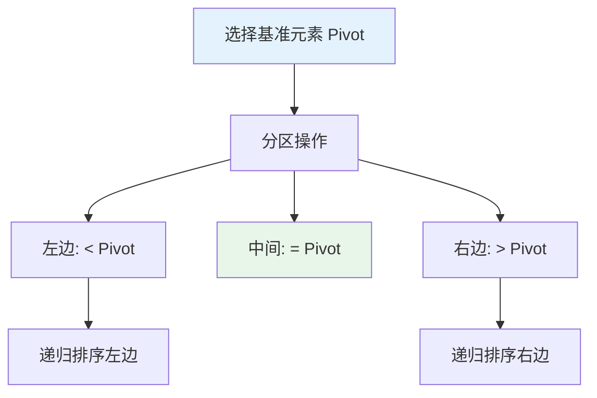
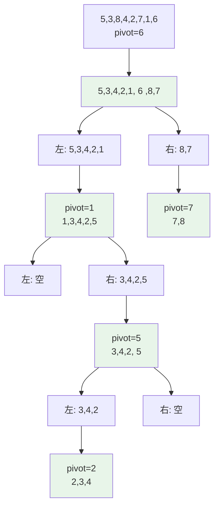
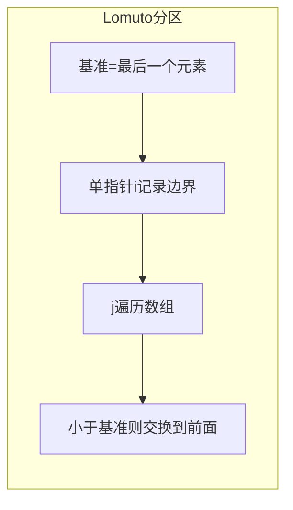
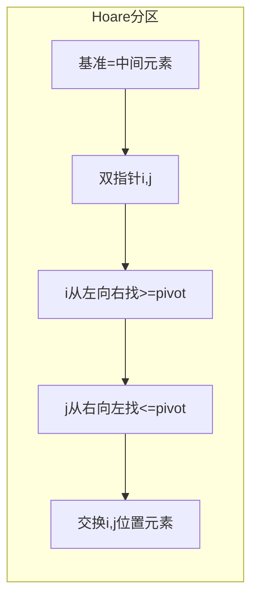
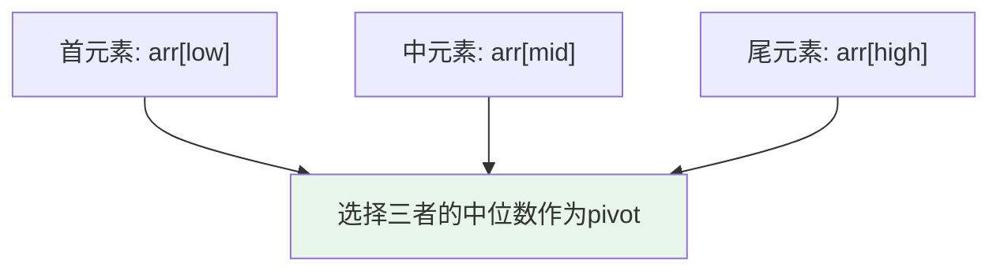
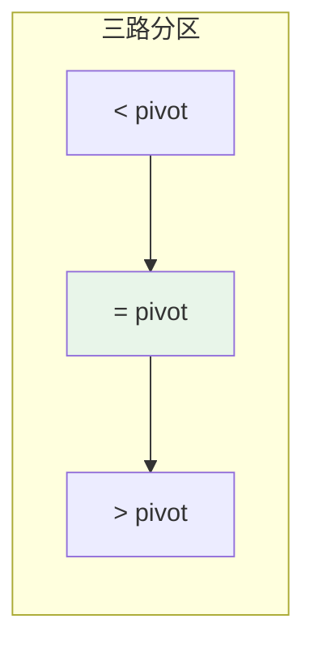

# 快速排序

## 概述

快速排序（Quick Sort）是由Tony Hoare于1960年提出的高效排序算法，采用**分治策略**（Divide and Conquer）。通过选择基准元素（Pivot）将数组分为两部分，递归排序，是实践中最常用的排序算法之一。

!!! note "快速排序的重要性"
    快速排序是许多标准库排序函数的实现基础，如C的`qsort`、C++的`std::sort`（通常结合其他算法）。它以其优秀的平均性能和良好的缓存局部性而著称。

## 算法思想详解

快速排序的核心是**分区（Partition）**操作：



### 三步分治过程

1. **选择基准（Choose Pivot）**：从数组中选择一个元素作为基准
2. **分区（Partition）**：重排数组，使小于基准的元素在左，大于的在右
3. **递归（Recurse）**：对左右子数组递归排序

## 算法可视化演示

### 分区过程详解

```
初始数组: [5, 3, 8, 4, 2, 7, 1, 6]
选择基准: pivot = 6 (最后一个元素)

分区过程（Lomuto方案）:
┌─────────────────────────────────────────┐
│ i = -1 (指向小于pivot区域的最后一个元素) │
│ j 从 0 遍历到 6                          │
└─────────────────────────────────────────┘

j=0: arr[0]=5 < 6, i=0, 交换arr[0]和arr[0]
     [5, 3, 8, 4, 2, 7, 1, 6]
      ↑

j=1: arr[1]=3 < 6, i=1, 交换arr[1]和arr[1]
     [5, 3, 8, 4, 2, 7, 1, 6]
         ↑

j=2: arr[2]=8 > 6, 跳过
     [5, 3, 8, 4, 2, 7, 1, 6]

j=3: arr[3]=4 < 6, i=2, 交换arr[2]和arr[3]
     [5, 3, 4, 8, 2, 7, 1, 6]
            ↑

j=4: arr[4]=2 < 6, i=3, 交换arr[3]和arr[4]
     [5, 3, 4, 2, 8, 7, 1, 6]
               ↑

j=5: arr[5]=7 > 6, 跳过

j=6: arr[6]=1 < 6, i=4, 交换arr[4]和arr[6]
     [5, 3, 4, 2, 1, 7, 8, 6]
                  ↑

最后: i=4, 交换arr[5]和arr[7]，将pivot放入正确位置
     [5, 3, 4, 2, 1, 6, 8, 7]
                     ↑
                   pivot位置
```

### 完整排序过程



```
最终结果: [1, 2, 3, 4, 5, 6, 7, 8]
```

## 两种分区方案

### 1. Lomuto分区方案

**特点**：简单易懂，基准选择最后一个元素



=== "C"
    ```c
    int partition(int arr[], int low, int high) {
        int pivot = arr[high];    // 选择最后一个元素作为基准
        int i = low - 1;          // i指向小于pivot区域的最后一个元素
        
        for (int j = low; j < high; j++) {
            if (arr[j] <= pivot) {
                i++;
                // 交换arr[i]和arr[j]
                int temp = arr[i];
                arr[i] = arr[j];
                arr[j] = temp;
            }
        }
        
        // 将pivot放入正确位置
        int temp = arr[i + 1];
        arr[i + 1] = arr[high];
        arr[high] = temp;
        
        return i + 1;  // 返回pivot的最终位置
    }
    
    void quickSort(int arr[], int low, int high) {
        if (low < high) {
            int pi = partition(arr, low, high);  // 分区
            quickSort(arr, low, pi - 1);          // 递归左半部分
            quickSort(arr, pi + 1, high);         // 递归右半部分
        }
    }
    ```

=== "C++"
    ```cpp
    template<typename T>
    int partition(std::vector<T>& arr, int low, int high) {
        T pivot = arr[high];
        int i = low - 1;
        
        for (int j = low; j < high; j++) {
            if (arr[j] <= pivot) {
                std::swap(arr[++i], arr[j]);
            }
        }
        std::swap(arr[i + 1], arr[high]);
        
        return i + 1;
    }
    
    template<typename T>
    void quickSort(std::vector<T>& arr, int low, int high) {
        if (low < high) {
            int pi = partition(arr, low, high);
            quickSort(arr, low, pi - 1);
            quickSort(arr, pi + 1, high);
        }
    }
    ```

=== "Python"
    ```python
    def partition(arr, low, high):
        pivot = arr[high]
        i = low - 1
        
        for j in range(low, high):
            if arr[j] <= pivot:
                i += 1
                arr[i], arr[j] = arr[j], arr[i]
        
        arr[i + 1], arr[high] = arr[high], arr[i + 1]
        return i + 1
    
    def quick_sort(arr, low, high):
        if low < high:
            pi = partition(arr, low, high)
            quick_sort(arr, low, pi - 1)
            quick_sort(arr, pi + 1, high)
    ```

=== "Java"
    ```java
    public class QuickSort {
        private static int partition(int[] arr, int low, int high) {
            int pivot = arr[high];
            int i = low - 1;
            
            for (int j = low; j < high; j++) {
                if (arr[j] <= pivot) {
                    i++;
                    int temp = arr[i];
                    arr[i] = arr[j];
                    arr[j] = temp;
                }
            }
            
            int temp = arr[i + 1];
            arr[i + 1] = arr[high];
            arr[high] = temp;
            
            return i + 1;
        }
        
        public static void quickSort(int[] arr, int low, int high) {
            if (low < high) {
                int pi = partition(arr, low, high);
                quickSort(arr, low, pi - 1);
                quickSort(arr, pi + 1, high);
            }
        }
    }
    ```

=== "Go"
    ```go
    func partition(arr []int, low, high int) int {
        pivot := arr[high]
        i := low - 1
        
        for j := low; j < high; j++ {
            if arr[j] <= pivot {
                i++
                arr[i], arr[j] = arr[j], arr[i]
            }
        }
        
        arr[i+1], arr[high] = arr[high], arr[i+1]
        return i + 1
    }
    
    func quickSort(arr []int, low, high int) {
        if low < high {
            pi := partition(arr, low, high)
            quickSort(arr, low, pi-1)
            quickSort(arr, pi+1, high)
        }
    }
    ```

=== "Rust"
    ```rust
    fn partition(arr: &mut [i32], low: usize, high: usize) -> usize {
        let pivot = arr[high];
        let mut i = low as i32 - 1;
        
        for j in low..high {
            if arr[j] <= pivot {
                i += 1;
                arr.swap(i as usize, j);
            }
        }
        
        arr.swap((i + 1) as usize, high);
        (i + 1) as usize
    }
    
    fn quick_sort(arr: &mut [i32], low: i32, high: i32) {
        if low < high {
            let pi = partition(arr, low as usize, high as usize);
            quick_sort(arr, low, pi as i32 - 1);
            quick_sort(arr, pi as i32 + 1, high);
        }
    }
    ```

### 2. Hoare分区方案

**特点**：效率更高，双指针从两端向中间扫描



```
Hoare分区示意:

初始: [5, 3, 8, 4, 2, 7, 1, 6]
       ↑                    ↑
       i                    j
       pivot = 4 (中间元素)

Step 1: arr[i]=5 >= 4, arr[j]=6 >= 4, j左移
        [5, 3, 8, 4, 2, 7, 1, 6]
         ↑                 ↑
         i                 j

Step 2: arr[j]=1 <= 4, 交换arr[i]和arr[j]
        [1, 3, 8, 4, 2, 7, 5, 6]
            ↑           ↑
            i           j

Step 3: i右移找>=4, arr[i]=8 >= 4
        j左移找<=4, arr[j]=2 <= 4
        交换
        [1, 3, 2, 4, 8, 7, 5, 6]
               ↑     ↑
               i     j

Step 4: i >= j, 分区结束
        返回j=3

结果: [1, 3, 2, 4] [8, 7, 5, 6]
      所有<=4的元素在左边
```

=== "C"
    ```c
    int partitionHoare(int arr[], int low, int high) {
        int pivot = arr[low + (high - low) / 2];  // 选择中间元素
        int i = low - 1;
        int j = high + 1;
        
        while (1) {
            // i向右找第一个>=pivot的元素
            do { i++; } while (arr[i] < pivot);
            
            // j向左找第一个<=pivot的元素
            do { j--; } while (arr[j] > pivot);
            
            // 如果指针相遇或交叉，返回
            if (i >= j) return j;
            
            // 交换arr[i]和arr[j]
            int temp = arr[i];
            arr[i] = arr[j];
            arr[j] = temp;
        }
    }
    
    void quickSortHoare(int arr[], int low, int high) {
        if (low < high) {
            int pi = partitionHoare(arr, low, high);
            quickSortHoare(arr, low, pi);       // 注意: 包含pi
            quickSortHoare(arr, pi + 1, high);
        }
    }
    ```

=== "C++"
    ```cpp
    template<typename T>
    int partitionHoare(std::vector<T>& arr, int low, int high) {
        T pivot = arr[low + (high - low) / 2];
        int i = low - 1;
        int j = high + 1;
        
        while (true) {
            do { i++; } while (arr[i] < pivot);
            do { j--; } while (arr[j] > pivot);
            
            if (i >= j) return j;
            std::swap(arr[i], arr[j]);
        }
    }
    
    template<typename T>
    void quickSortHoare(std::vector<T>& arr, int low, int high) {
        if (low < high) {
            int pi = partitionHoare(arr, low, high);
            quickSortHoare(arr, low, pi);
            quickSortHoare(arr, pi + 1, high);
        }
    }
    ```

=== "Python"
    ```python
    def partition_hoare(arr, low, high):
        pivot = arr[low + (high - low) // 2]
        i = low - 1
        j = high + 1
        
        while True:
            i += 1
            while arr[i] < pivot:
                i += 1
            
            j -= 1
            while arr[j] > pivot:
                j -= 1
            
            if i >= j:
                return j
            
            arr[i], arr[j] = arr[j], arr[i]
    
    def quick_sort_hoare(arr, low, high):
        if low < high:
            pi = partition_hoare(arr, low, high)
            quick_sort_hoare(arr, low, pi)
            quick_sort_hoare(arr, pi + 1, high)
    ```

=== "Java"
    ```java
    private static int partitionHoare(int[] arr, int low, int high) {
        int pivot = arr[low + (high - low) / 2];
        int i = low - 1;
        int j = high + 1;
        
        while (true) {
            do { i++; } while (arr[i] < pivot);
            do { j--; } while (arr[j] > pivot);
            
            if (i >= j) return j;
            
            int temp = arr[i];
            arr[i] = arr[j];
            arr[j] = temp;
        }
    }
    
    public static void quickSortHoare(int[] arr, int low, int high) {
        if (low < high) {
            int pi = partitionHoare(arr, low, high);
            quickSortHoare(arr, low, pi);
            quickSortHoare(arr, pi + 1, high);
        }
    }
    ```

=== "Go"
    ```go
    func partitionHoare(arr []int, low, high int) int {
        pivot := arr[low+(high-low)/2]
        i := low - 1
        j := high + 1
        
        for {
            for {
                i++
                if arr[i] >= pivot {
                    break
                }
            }
            
            for {
                j--
                if arr[j] <= pivot {
                    break
                }
            }
            
            if i >= j {
                return j
            }
            
            arr[i], arr[j] = arr[j], arr[i]
        }
    }
    
    func quickSortHoare(arr []int, low, high int) {
        if low < high {
            pi := partitionHoare(arr, low, high)
            quickSortHoare(arr, low, pi)
            quickSortHoare(arr, pi+1, high)
        }
    }
    ```

=== "Rust"
    ```rust
    fn partition_hoare(arr: &mut [i32], low: usize, high: usize) -> usize {
        let pivot = arr[low + (high - low) / 2];
        let mut i = low as i32 - 1;
        let mut j = high as i32 + 1;
        
        loop {
            loop {
                i += 1;
                if arr[i as usize] >= pivot {
                    break;
                }
            }
            
            loop {
                j -= 1;
                if arr[j as usize] <= pivot {
                    break;
                }
            }
            
            if i >= j {
                return j as usize;
            }
            
            arr.swap(i as usize, j as usize);
        }
    }
    
    fn quick_sort_hoare(arr: &mut [i32], low: i32, high: i32) {
        if low < high {
            let pi = partition_hoare(arr, low as usize, high as usize);
            quick_sort_hoare(arr, low, pi as i32);
            quick_sort_hoare(arr, pi as i32 + 1, high);
        }
    }
    ```

### 两种方案对比

| 特性 | Lomuto | Hoare |
|------|--------|-------|
| 交换次数 | 较多 | 较少 |
| 实现难度 | 简单 | 中等 |
| 效率 | 稍低 | 更高 |
| 基准位置 | 最后元素 | 可选择任意 |

## 优化策略

### 1. 三数取中（Median of Three）

避免最坏情况，选择首、中、尾三元素的中位数作为基准。



```c
int medianOfThree(int arr[], int low, int high) {
    int mid = low + (high - low) / 2;
    
    // 对三个元素排序
    if (arr[low] > arr[mid]) {
        int temp = arr[low]; arr[low] = arr[mid]; arr[mid] = temp;
    }
    if (arr[low] > arr[high]) {
        int temp = arr[low]; arr[low] = arr[high]; arr[high] = temp;
    }
    if (arr[mid] > arr[high]) {
        int temp = arr[mid]; arr[mid] = arr[high]; arr[high] = temp;
    }
    
    // 将中位数放到high-1位置
    int temp = arr[mid];
    arr[mid] = arr[high - 1];
    arr[high - 1] = temp;
    
    return high - 1;  // 返回中位数位置
}
```

### 2. 小数组用插入排序

对于小数组（通常<10个元素），插入排序更高效。

```c
void insertionSort(int arr[], int low, int high) {
    for (int i = low + 1; i <= high; i++) {
        int key = arr[i];
        int j = i - 1;
        while (j >= low && arr[j] > key) {
            arr[j + 1] = arr[j];
            j--;
        }
        arr[j + 1] = key;
    }
}

void quickSortOptimized(int arr[], int low, int high) {
    // 小数组使用插入排序
    if (high - low < 10) {
        insertionSort(arr, low, high);
        return;
    }
    
    // 三数取中选择基准
    int pi = medianOfThree(arr, low, high);
    int pivot = arr[pi];
    
    // Hoare分区
    int i = low, j = high;
    while (i <= j) {
        while (arr[i] < pivot) i++;
        while (arr[j] > pivot) j--;
        if (i <= j) {
            int temp = arr[i]; arr[i] = arr[j]; arr[j] = temp;
            i++; j--;
        }
    }
    
    quickSortOptimized(arr, low, j);
    quickSortOptimized(arr, i, high);
}
```

### 3. 三路分区（处理大量重复元素）



```
三路分区示意:

初始: [3, 1, 4, 3, 5, 3, 2, 3]
       pivot = 3

分区后: [1, 2, 3, 3, 3, 3, 4, 5]
        └──┘  └──────┘  └──┘
        <pivot  =pivot  >pivot

只需递归排序 <pivot 和 >pivot 部分
=pivot 部分已经有序
```

```c
void quickSort3Way(int arr[], int low, int high) {
    if (low >= high) return;
    
    int pivot = arr[low];
    int lt = low;    // < pivot区域的边界
    int gt = high;   // > pivot区域的边界
    int i = low + 1; // 当前元素
    
    while (i <= gt) {
        if (arr[i] < pivot) {
            // 交换到<pivot区域
            int temp = arr[lt];
            arr[lt] = arr[i];
            arr[i] = temp;
            lt++;
            i++;
        } else if (arr[i] > pivot) {
            // 交换到>pivot区域
            int temp = arr[i];
            arr[i] = arr[gt];
            arr[gt] = temp;
            gt--;
        } else {
            // 等于pivot，直接跳过
            i++;
        }
    }
    
    // 递归排序左右两部分
    quickSort3Way(arr, low, lt - 1);
    quickSort3Way(arr, gt + 1, high);
}
```

### 4. 随机化基准选择

```c
#include <stdlib.h>
#include <time.h>

int partitionRandom(int arr[], int low, int high) {
    // 随机选择基准
    int randomIndex = low + rand() % (high - low + 1);
    
    // 交换到high位置
    int temp = arr[randomIndex];
    arr[randomIndex] = arr[high];
    arr[high] = temp;
    
    return partition(arr, low, high);  // 使用Lomuto分区
}
```

## 非递归实现

避免递归栈溢出，使用显式栈。

```c
typedef struct {
    int low;
    int high;
} Range;

void quickSortIterative(int arr[], int low, int high) {
    Range *stack = (Range*)malloc(sizeof(Range) * (high - low + 1));
    int top = -1;
    
    // 初始范围入栈
    stack[++top] = (Range){low, high};
    
    while (top >= 0) {
        Range range = stack[top--];
        low = range.low;
        high = range.high;
        
        if (low < high) {
            int pi = partition(arr, low, high);
            
            // 先处理较小的子数组，减少栈深度
            if (pi - 1 - low > high - pi - 1) {
                stack[++top] = (Range){low, pi - 1};
                stack[++top] = (Range){pi + 1, high};
            } else {
                stack[++top] = (Range){pi + 1, high};
                stack[++top] = (Range){low, pi - 1};
            }
        }
    }
    
    free(stack);
}
```

## 复杂度分析

### 时间复杂度

| 情况 | 时间复杂度 | 发生条件 |
|------|-----------|----------|
| 最好 | O(n log n) | 每次均匀分割，pivot在中位数位置 |
| 平均 | O(n log n) | 随机数据，随机pivot |
| 最坏 | O(n²) | 已排序数组 + 选择首/尾元素作为pivot |

**递推关系分析**：

```
最好情况:
T(n) = 2T(n/2) + O(n)  →  T(n) = O(n log n)

最坏情况:
T(n) = T(n-1) + O(n)   →  T(n) = O(n²)

平均情况:
T(n) = O(n log n)
```

### 空间复杂度

| 情况 | 空间复杂度 | 说明 |
|------|-----------|------|
| 最好 | O(log n) | 均匀分割，递归深度最小 |
| 平均 | O(log n) | 随机数据 |
| 最坏 | O(n) | 退化为链表，递归深度=n |

### 比较次数分析

```
平均比较次数: C(n) ≈ 2n ln n ≈ 1.39 n log₂ n

比归并排序多约39%的比较，但实际更快因为：
1. 原地排序，数据移动少
2. 缓存局部性好
3. 内循环非常高效
```

## 稳定性

快速排序是**不稳定排序**：

```
原序列: [3A, 2, 3B, 1]
          ↑        ↑
        3A       3B

排序后可能: [1, 2, 3B, 3A]
                   ↑   ↑
                 3B   3A

3A和3B的相对顺序改变了！
```

## 快速排序 vs 其他排序

| 特性 | 快速排序 | 归并排序 | 堆排序 |
|------|---------|---------|--------|
| 平均时间 | O(n log n) | O(n log n) | O(n log n) |
| 最坏时间 | O(n²) | O(n log n) | O(n log n) |
| 空间 | O(log n) | O(n) | O(1) |
| 稳定性 | 不稳定 | 稳定 | 不稳定 |
| 缓存友好 | 是 ✓ | 否 ✗ | 否 ✗ |
| 实际速度 | 最快 | 较快 | 较慢 |

## 应用场景

1. **通用排序**：大多数情况下的最优选择
2. **大规模数据**：缓存友好，实际效率高
3. **标准库实现**：C的qsort、Java的Arrays.sort
4. **不需要稳定性**：不需要保持相等元素原顺序

## 常见问题与陷阱

### 1. 最坏情况

```c
// 已排序数组 + 选择最后一个元素作为pivot
int arr[] = {1, 2, 3, 4, 5, 6, 7, 8};

// 每次分区只能减少一个元素
// 时间复杂度退化为O(n²)
```

**解决**：使用三数取中或随机化基准选择

### 2. 栈溢出

```c
// 递归深度过大导致栈溢出
// 解决：使用非递归实现或尾递归优化
```

### 3. 重复元素处理

```c
// 大量重复元素导致分区不平衡
// 解决：使用三路分区
```

## 参考资料

- 《算法导论》第7章 - 快速排序
- Hoare, C.A.R. (1962). "Quicksort"
- [Quicksort - Wikipedia](https://en.wikipedia.org/wiki/Quicksort)
- Bentley, J.L. and McIlroy, M.D. (1993). "Engineering a Sort Function"
