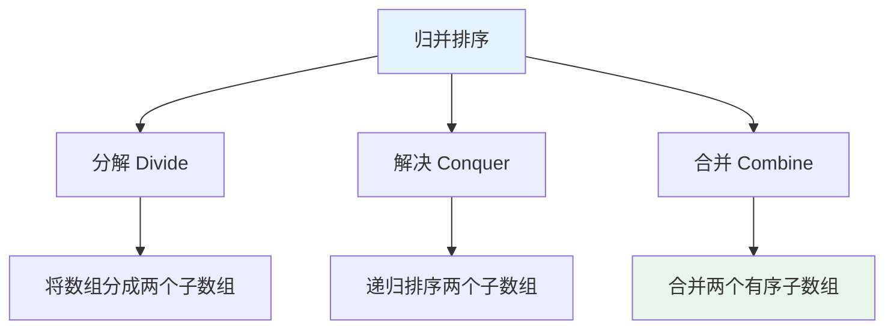
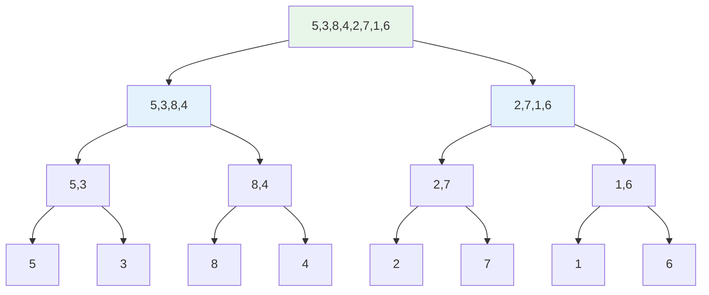
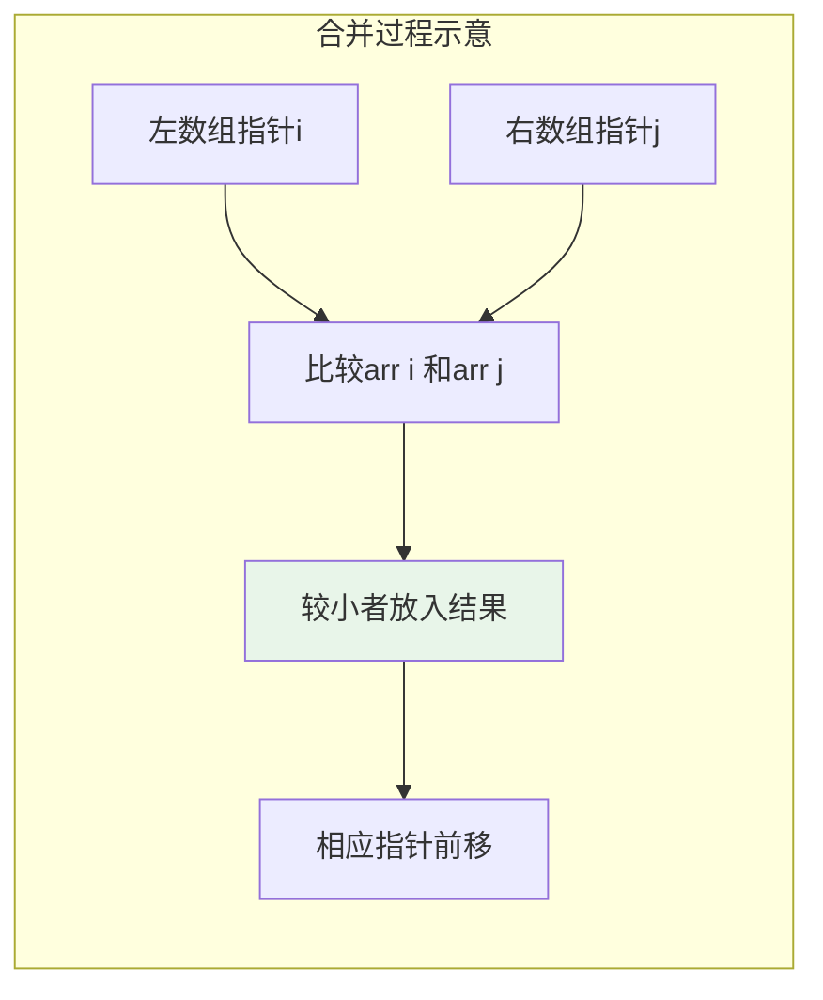
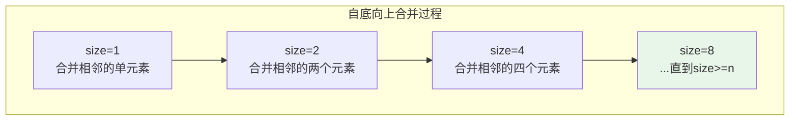
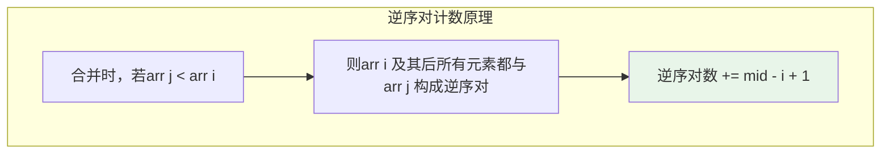
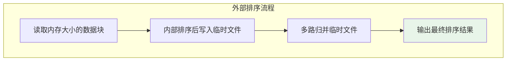

# 归并排序

## 概述

归并排序（Merge Sort）是建立在**归并操作**基础上的一种稳定排序算法，采用**分治策略**（Divide and Conquer）。将数组分成两部分分别排序，然后将两个有序部分合并成一个有序数组。

!!! note "归并排序的特点"
    归并排序的时间复杂度在所有情况下都是O(n log n)，是最坏情况性能保证最好的比较排序算法。它还是稳定排序，适合需要保持相等元素原顺序的场景。

## 算法思想详解

归并排序遵循分治策略的三个步骤：



### 分治过程

1. **分解（Divide）**：将n个元素的数组分成两个n/2个元素的子数组
2. **解决（Conquer）**：递归排序两个子数组
3. **合并（Merge）**：将两个有序子数组合并成一个有序数组

## 算法可视化演示

### 完整排序过程

```
排序数组: [5, 3, 8, 4, 2, 7, 1, 6]

分解阶段（自顶向下）:
┌─────────────────────────────────────────────────────────┐
│ [5, 3, 8, 4, 2, 7, 1, 6]                               │
│         ↓ 分解                                         │
│ [5, 3, 8, 4]              [2, 7, 1, 6]                 │
│     ↓ 分解                   ↓ 分解                    │
│ [5, 3]    [8, 4]          [2, 7]    [1, 6]            │
│   ↓ 分解    ↓ 分解            ↓ 分解    ↓ 分解          │
│ [5] [3]   [8] [4]          [2] [7]   [1] [6]         │
└─────────────────────────────────────────────────────────┘

合并阶段（自底向上）:
┌─────────────────────────────────────────────────────────┐
│ [5] [3]   [8] [4]          [2] [7]   [1] [6]          │
│   ↓ 合并    ↓ 合并            ↓ 合并    ↓ 合并          │
│ [3, 5]    [4, 8]          [2, 7]    [1, 6]            │
│     ↓ 合并                    ↓ 合并                    │
│ [3, 4, 5, 8]              [1, 2, 6, 7]                 │
│         ↓ 合并                                         │
│ [1, 2, 3, 4, 5, 6, 7, 8]                               │
└─────────────────────────────────────────────────────────┘
```

### 分治树结构



### 合并操作详解

合并是归并排序的核心操作，将两个有序数组合并成一个有序数组。

```
合并两个有序数组:

左数组: [3, 4, 5, 8]     右数组: [1, 2, 6, 7]
        ↑i                      ↑j

Step 1: arr[i]=3 > arr[j]=1, 取1, j++
        结果: [1]
              ↑

Step 2: arr[i]=3 > arr[j]=2, 取2, j++
        结果: [1, 2]
                  ↑

Step 3: arr[i]=3 < arr[j]=6, 取3, i++
        结果: [1, 2, 3]
                     ↑

Step 4: arr[i]=4 < arr[j]=6, 取4, i++
        结果: [1, 2, 3, 4]
                        ↑

Step 5: arr[i]=5 < arr[j]=6, 取5, i++
        结果: [1, 2, 3, 4, 5]
                           ↑

Step 6: arr[i]=8 > arr[j]=6, 取6, j++
        结果: [1, 2, 3, 4, 5, 6]
                              ↑

Step 7: arr[i]=8 > arr[j]=7, 取7, j++
        结果: [1, 2, 3, 4, 5, 6, 7]
                                 ↑

Step 8: 右数组已空，复制左数组剩余元素
        结果: [1, 2, 3, 4, 5, 6, 7, 8]
```



## 基本实现

### 递归版本（自顶向下）

=== "C"
    ```c
    #include <stdlib.h>
    
    // 合并两个有序子数组
    void merge(int arr[], int left, int mid, int right, int temp[]) {
        int i = left;      // 左子数组起始位置
        int j = mid + 1;   // 右子数组起始位置
        int k = left;      // 临时数组起始位置
        
        // 比较并合并
        while (i <= mid && j <= right) {
            if (arr[i] <= arr[j]) {
                temp[k++] = arr[i++];
            } else {
                temp[k++] = arr[j++];
            }
        }
        
        // 复制剩余元素
        while (i <= mid) temp[k++] = arr[i++];
        while (j <= right) temp[k++] = arr[j++];
        
        // 将合并结果复制回原数组
        for (i = left; i <= right; i++) {
            arr[i] = temp[i];
        }
    }
    
    // 递归排序
    void mergeSortRecursive(int arr[], int left, int right, int temp[]) {
        if (left >= right) return;
        
        int mid = left + (right - left) / 2;
        mergeSortRecursive(arr, left, mid, temp);
        mergeSortRecursive(arr, mid + 1, right, temp);
        merge(arr, left, mid, right, temp);
    }
    
    // 归并排序入口
    void mergeSort(int arr[], int n) {
        int *temp = (int*)malloc(sizeof(int) * n);
        mergeSortRecursive(arr, 0, n - 1, temp);
        free(temp);
    }
    ```

=== "C++"
    ```cpp
    #include <vector>
    #include <algorithm>
    
    template<typename T>
    void merge(std::vector<T>& arr, int left, int mid, int right, 
               std::vector<T>& temp) {
        int i = left, j = mid + 1, k = left;
        
        while (i <= mid && j <= right) {
            temp[k++] = (arr[i] <= arr[j]) ? arr[i++] : arr[j++];
        }
        
        while (i <= mid) temp[k++] = arr[i++];
        while (j <= right) temp[k++] = arr[j++];
        
        for (i = left; i <= right; i++) {
            arr[i] = temp[i];
        }
    }
    
    template<typename T>
    void mergeSort(std::vector<T>& arr, int left, int right, 
                   std::vector<T>& temp) {
        if (left >= right) return;
        
        int mid = left + (right - left) / 2;
        mergeSort(arr, left, mid, temp);
        mergeSort(arr, mid + 1, right, temp);
        merge(arr, left, mid, right, temp);
    }
    
    template<typename T>
    void mergeSort(std::vector<T>& arr) {
        std::vector<T> temp(arr.size());
        mergeSort(arr, 0, arr.size() - 1, temp);
    }
    ```

=== "Python"
    ```python
    def merge_sort(arr):
        if len(arr) <= 1:
            return arr
        
        mid = len(arr) // 2
        left = merge_sort(arr[:mid])
        right = merge_sort(arr[mid:])
        
        # 合并
        result = []
        i = j = 0
        while i < len(left) and j < len(right):
            if left[i] <= right[j]:
                result.append(left[i])
                i += 1
            else:
                result.append(right[j])
                j += 1
        
        result.extend(left[i:])
        result.extend(right[j:])
        return result
    ```

=== "Java"
    ```java
    public class MergeSort {
        private static void merge(int[] arr, int left, int mid, int right, 
                                  int[] temp) {
            int i = left, j = mid + 1, k = left;
            
            while (i <= mid && j <= right) {
                if (arr[i] <= arr[j]) {
                    temp[k++] = arr[i++];
                } else {
                    temp[k++] = arr[j++];
                }
            }
            
            while (i <= mid) temp[k++] = arr[i++];
            while (j <= right) temp[k++] = arr[j++];
            
            for (i = left; i <= right; i++) {
                arr[i] = temp[i];
            }
        }
        
        private static void mergeSort(int[] arr, int left, int right, 
                                       int[] temp) {
            if (left >= right) return;
            
            int mid = left + (right - left) / 2;
            mergeSort(arr, left, mid, temp);
            mergeSort(arr, mid + 1, right, temp);
            merge(arr, left, mid, right, temp);
        }
        
        public static void mergeSort(int[] arr) {
            int[] temp = new int[arr.length];
            mergeSort(arr, 0, arr.length - 1, temp);
        }
    }
    ```

=== "Go"
    ```go
    func merge(arr []int, left, mid, right int, temp []int) {
        i, j, k := left, mid+1, left
        
        for i <= mid && j <= right {
            if arr[i] <= arr[j] {
                temp[k] = arr[i]
                i++
            } else {
                temp[k] = arr[j]
                j++
            }
            k++
        }
        
        for i <= mid {
            temp[k] = arr[i]
            i++
            k++
        }
        
        for j <= right {
            temp[k] = arr[j]
            j++
            k++
        }
        
        for i := left; i <= right; i++ {
            arr[i] = temp[i]
        }
    }
    
    func mergeSortRecursive(arr []int, left, right int, temp []int) {
        if left >= right {
            return
        }
        
        mid := left + (right-left)/2
        mergeSortRecursive(arr, left, mid, temp)
        mergeSortRecursive(arr, mid+1, right, temp)
        merge(arr, left, mid, right, temp)
    }
    
    func mergeSort(arr []int) {
        temp := make([]int, len(arr))
        mergeSortRecursive(arr, 0, len(arr)-1, temp)
    }
    ```

=== "Rust"
    ```rust
    fn merge(arr: &mut [i32], left: usize, mid: usize, right: usize, 
             temp: &mut [i32]) {
        let mut i = left;
        let mut j = mid + 1;
        let mut k = left;
        
        while i <= mid && j <= right {
            if arr[i] <= arr[j] {
                temp[k] = arr[i];
                i += 1;
            } else {
                temp[k] = arr[j];
                j += 1;
            }
            k += 1;
        }
        
        while i <= mid {
            temp[k] = arr[i];
            i += 1;
            k += 1;
        }
        
        while j <= right {
            temp[k] = arr[j];
            j += 1;
            k += 1;
        }
        
        for i in left..=right {
            arr[i] = temp[i];
        }
    }
    
    fn merge_sort_recursive(arr: &mut [i32], left: usize, right: usize, 
                            temp: &mut [i32]) {
        if left >= right {
            return;
        }
        
        let mid = left + (right - left) / 2;
        merge_sort_recursive(arr, left, mid, temp);
        merge_sort_recursive(arr, mid + 1, right, temp);
        merge(arr, left, mid, right, temp);
    }
    
    fn merge_sort(arr: &mut [i32]) {
        let n = arr.len();
        let mut temp = vec![0; n];
        merge_sort_recursive(arr, 0, n - 1, &mut temp);
    }
    ```

### 迭代版本（自底向上）

避免递归调用，使用循环实现。



```c
void mergeSortIterative(int arr[], int n) {
    int *temp = (int*)malloc(sizeof(int) * n);
    
    // size为当前子数组大小，从1开始每次翻倍
    for (int size = 1; size < n; size *= 2) {
        // 遍历所有需要合并的子数组对
        for (int left = 0; left < n - size; left += 2 * size) {
            int mid = left + size - 1;
            int right = (left + 2 * size - 1 < n - 1) ? 
                        left + 2 * size - 1 : n - 1;
            merge(arr, left, mid, right, temp);
        }
    }
    
    free(temp);
}
```

```
迭代过程示例: n=8

size=1: 合并相邻单元素
[5] [3] [8] [4] [2] [7] [1] [6]
 ↓   ↓   ↓   ↓   ↓   ↓   ↓   ↓
[3, 5] [4, 8] [2, 7] [1, 6]

size=2: 合并相邻两元素
[3, 5] [4, 8] [2, 7] [1, 6]
   ↓       ↓       ↓       ↓
[3, 4, 5, 8] [1, 2, 6, 7]

size=4: 合并相邻四元素
[3, 4, 5, 8] [1, 2, 6, 7]
       ↓
[1, 2, 3, 4, 5, 6, 7, 8]
```

## 复杂度分析

### 时间复杂度

| 情况 | 时间复杂度 | 说明 |
|------|-----------|------|
| 最好 | O(n log n) | 所有情况相同 |
| 平均 | O(n log n) | 所有情况相同 |
| 最坏 | O(n log n) | 所有情况相同 |

### 递推公式求解

```
归并排序的递推关系:
T(n) = 2T(n/2) + O(n)

其中:
- 2T(n/2): 递归排序两个n/2的子数组
- O(n): 合并两个子数组的代价

使用主定理求解:
a = 2, b = 2, f(n) = O(n)
n^(log_b a) = n^1 = n

f(n) = Θ(n^(log_b a))
所以 T(n) = Θ(n log n)
```

### 合并操作分析

```
每次合并的时间复杂度: O(n)
- 比较次数: 最多 n-1 次
- 移动次数: n 次

总合并次数: log n 次
总时间复杂度: O(n log n)
```

### 空间复杂度

| 情况 | 空间复杂度 | 说明 |
|------|-----------|------|
| 递归版本 | O(n) | 临时数组 + 递归栈 |
| 迭代版本 | O(n) | 仅临时数组 |
| 递归栈 | O(log n) | 递归深度 |

!!! warning "空间开销"
    归并排序需要O(n)的额外空间，这是它相对于快速排序的主要劣势。

## 稳定性

归并排序是**稳定排序**：

```
证明:
合并时使用 <= 比较:
if (arr[i] <= arr[j]) {
    temp[k++] = arr[i++];  // 优先取左边元素
}

当arr[i] == arr[j]时，优先取左边的元素
因此相等元素的相对顺序保持不变
```

```
示例:
原序列: [3A, 1, 2, 3B]
          ↑        ↑
        先出现   后出现

排序后: [1, 2, 3A, 3B]
              ↑   ↑
            仍保持原顺序

稳定性保证!
```

## 重要应用

### 1. 计算逆序对

逆序对：数组中满足i < j但arr[i] > arr[j]的数对。



```
示例: [5, 3, 8, 4, 2, 7, 1, 6]

逆序对:
(5,3), (5,4), (5,2), (5,1)
(3,2), (3,1)
(8,4), (8,2), (8,7), (8,1), (8,6)
(4,2), (4,1)
(7,1), (7,6)
(2,1)

总计: 15个逆序对
```

```c
long long mergeCount(int arr[], int left, int mid, int right, int temp[]) {
    long long count = 0;
    int i = left, j = mid + 1, k = left;
    
    while (i <= mid && j <= right) {
        if (arr[i] <= arr[j]) {
            temp[k++] = arr[i++];
        } else {
            temp[k++] = arr[j++];
            // arr[i..mid] 都与 arr[j] 构成逆序对
            count += mid - i + 1;
        }
    }
    
    while (i <= mid) temp[k++] = arr[i++];
    while (j <= right) temp[k++] = arr[j++];
    
    for (i = left; i <= right; i++) arr[i] = temp[i];
    
    return count;
}

long long countInversions(int arr[], int left, int right, int temp[]) {
    if (left >= right) return 0;
    
    int mid = left + (right - left) / 2;
    long long count = 0;
    
    count += countInversions(arr, left, mid, temp);
    count += countInversions(arr, mid + 1, right, temp);
    count += mergeCount(arr, left, mid, right, temp);
    
    return count;
}

long long countInversions(int arr[], int n) {
    int *temp = (int*)malloc(sizeof(int) * n);
    long long result = countInversions(arr, 0, n - 1, temp);
    free(temp);
    return result;
}
```

### 2. 外部排序（External Sort）

处理超出内存容量的大数据排序。



```c
void externalSort(FILE *input, FILE *output, int memorySize) {
    int *buffer = (int*)malloc(sizeof(int) * memorySize);
    FILE **tempFiles = (FILE**)malloc(sizeof(FILE*) * 100);
    int fileCount = 0;
    
    // 阶段1: 分段读取并排序
    while (!feof(input)) {
        int count = fread(buffer, sizeof(int), memorySize, input);
        mergeSort(buffer, count);  // 内部排序
        tempFiles[fileCount] = tmpfile();
        fwrite(buffer, sizeof(int), count, tempFiles[fileCount]);
        fileCount++;
    }
    
    // 阶段2: 多路归并
    kWayMerge(tempFiles, fileCount, output);
    
    free(buffer);
    free(tempFiles);
}
```

### 3. 链表排序

归并排序非常适合链表，因为：
- 不需要随机访问
- 合并操作对链表很高效
- 空间复杂度O(1)

```c
typedef struct ListNode {
    int val;
    struct ListNode *next;
} ListNode;

ListNode* mergeList(ListNode *l1, ListNode *l2) {
    ListNode dummy = {0, NULL};
    ListNode *tail = &dummy;
    
    while (l1 && l2) {
        if (l1->val <= l2->val) {
            tail->next = l1;
            l1 = l1->next;
        } else {
            tail->next = l2;
            l2 = l2->next;
        }
        tail = tail->next;
    }
    
    tail->next = l1 ? l1 : l2;
    return dummy.next;
}

ListNode* mergeSortList(ListNode *head) {
    if (!head || !head->next) return head;
    
    // 快慢指针找中点
    ListNode *slow = head, *fast = head->next;
    while (fast && fast->next) {
        slow = slow->next;
        fast = fast->next->next;
    }
    
    ListNode *mid = slow->next;
    slow->next = NULL;  // 断开链表
    
    // 递归排序
    ListNode *left = mergeSortList(head);
    ListNode *right = mergeSortList(mid);
    
    // 合并
    return mergeList(left, right);
}
```

## 归并排序变体

### 自然归并排序

利用已有的有序子序列。

```c
void naturalMergeSort(int arr[], int n) {
    int *temp = (int*)malloc(sizeof(int) * n);
    int sorted = 0;
    
    while (!sorted) {
        sorted = 1;
        int left = 0;
        
        while (left < n) {
            // 找第一个有序段
            int mid = left;
            while (mid < n - 1 && arr[mid] <= arr[mid + 1]) mid++;
            
            if (mid < n - 1) {
                // 找第二个有序段
                int right = mid + 1;
                while (right < n - 1 && arr[right] <= arr[right + 1]) right++;
                
                // 合并两个有序段
                merge(arr, left, mid, right, temp);
                left = right + 1;
                sorted = 0;
            } else {
                break;
            }
        }
    }
    
    free(temp);
}
```

## 归并排序 vs 快速排序

| 特性 | 归并排序 | 快速排序 |
|------|---------|---------|
| 时间复杂度（最坏） | O(n log n) ✓ | O(n²) ✗ |
| 时间复杂度（平均） | O(n log n) | O(n log n) |
| 空间复杂度 | O(n) ✗ | O(log n) ✓ |
| 稳定性 | 稳定 ✓ | 不稳定 ✗ |
| 缓存局部性 | 差 ✗ | 好 ✓ |
| 原地排序 | 否 ✗ | 是 ✓ |
| 适合链表 | 是 ✓ | 否 ✗ |
| 适合外部排序 | 是 ✓ | 否 ✗ |

## 应用场景

1. **外部排序**：处理大数据，数据量超过内存
2. **稳定排序需求**：需要保持相等元素原顺序
3. **链表排序**：链表结构最适合归并排序
4. **逆序对计数**：算法竞赛经典问题
5. **数据库排序**：需要稳定性的场景

## 参考资料

- 《算法导论》第2章 - 归并排序
- Knuth, 《计算机程序设计艺术》第3卷
- [Merge Sort - Wikipedia](https://en.wikipedia.org/wiki/Merge_sort)
