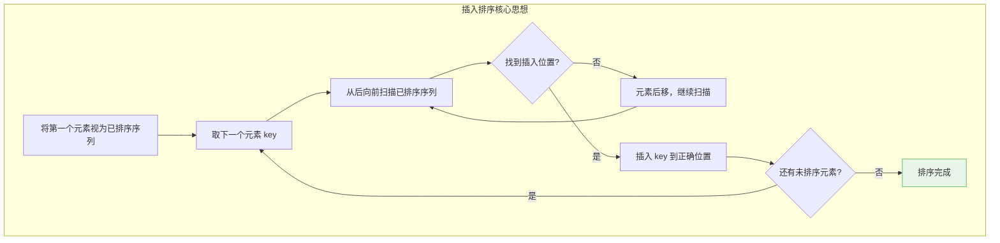
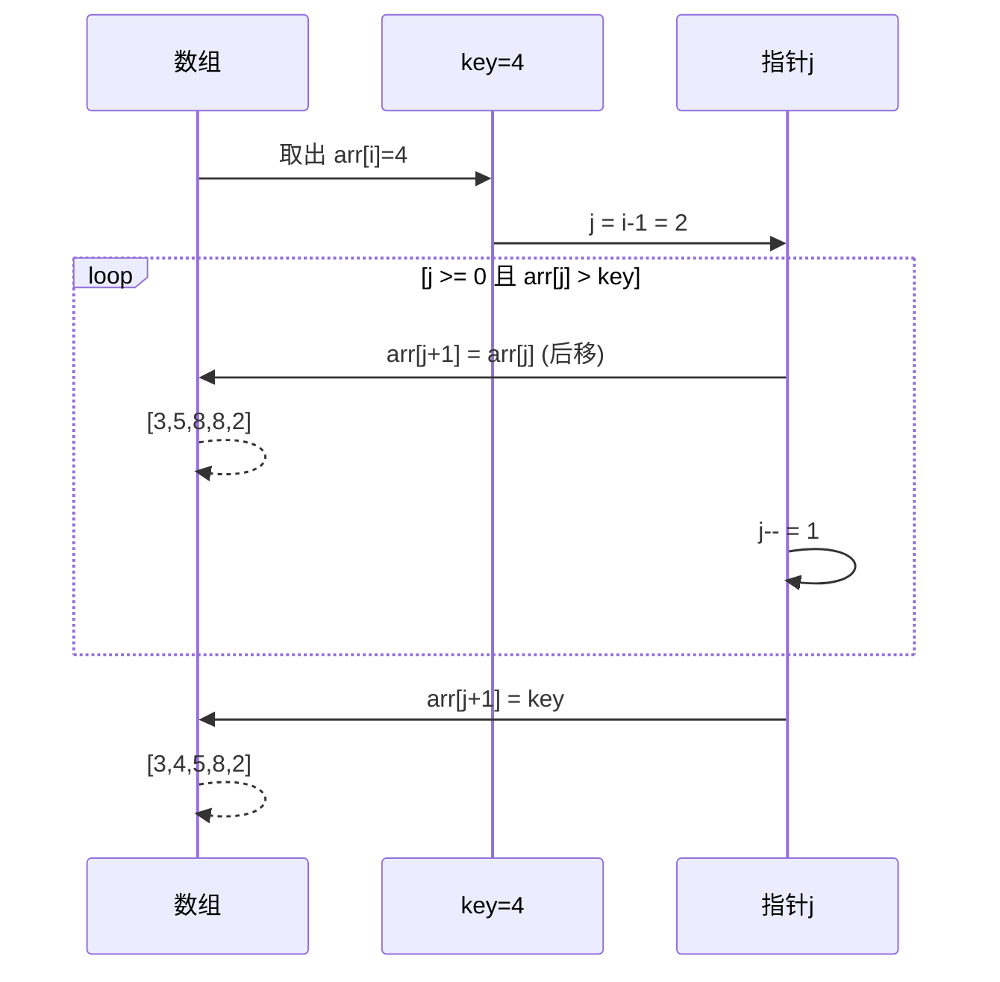
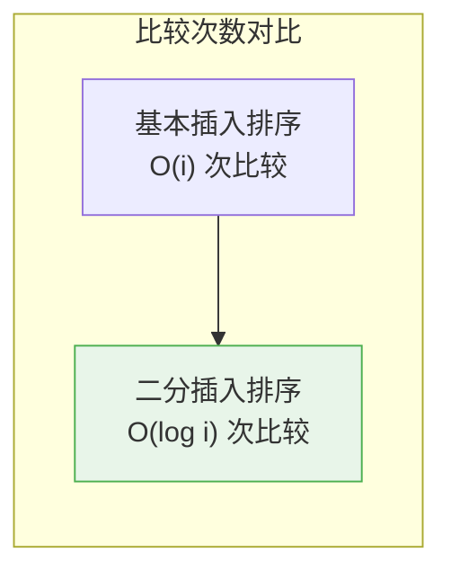
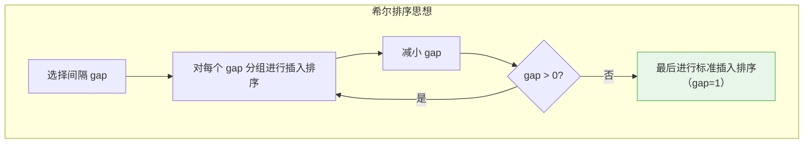
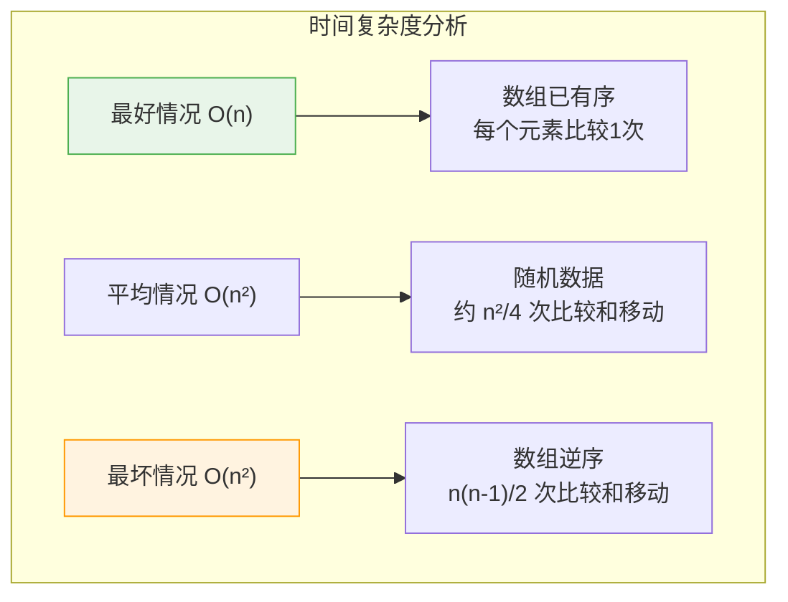
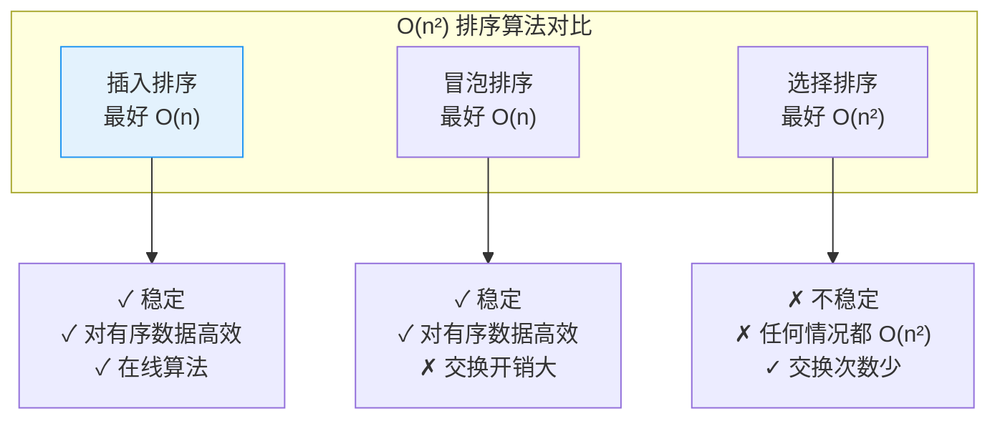
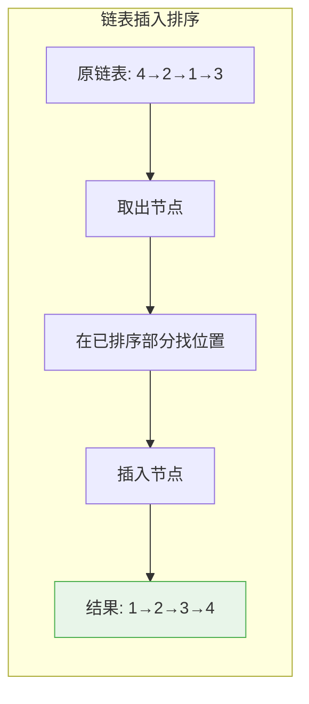
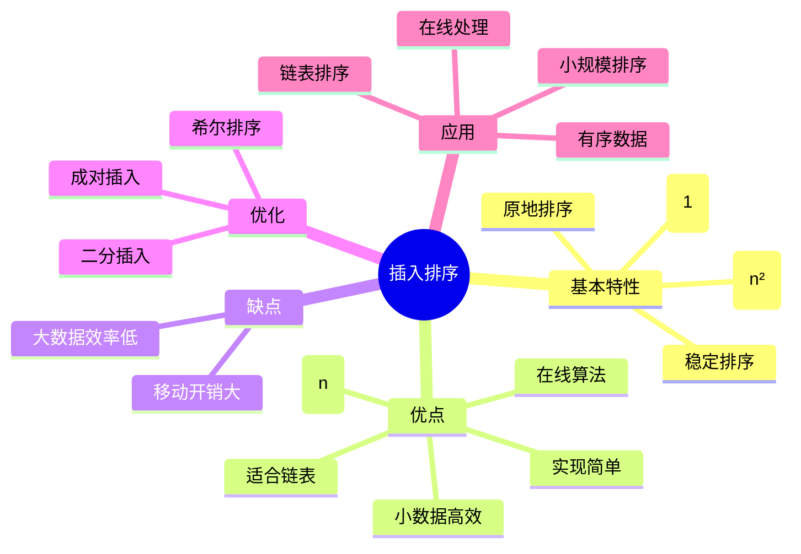

# 插入排序

## 概述

插入排序（Insertion Sort）是一种简单直观的排序算法，其基本思想是：**将数组分为已排序和未排序两部分，每次将未排序部分的第一个元素插入到已排序部分的适当位置**。

<div style="background-color: #E3F2FD; padding: 15px; margin: 10px 0; border-left: 4px solid #2196F3; border-radius: 5px;">
    <strong>核心特性</strong>
    <ul style="margin: 5px 0;">
        <li><strong>稳定排序</strong>：相等元素的相对顺序保持不变</li>
        <li><strong>原地排序</strong>：空间复杂度 O(1)</li>
        <li><strong>在线算法</strong>：可以边接收数据边排序</li>
        <li><strong>自适应排序</strong>：对基本有序的数据效率高</li>
    </ul>
</div>

!!! note "生活类比"
    想象你在玩扑克牌整理手牌：你拿着已排好序的牌，每次从牌堆抽一张新牌，然后从右往左找到合适的位置插入。插入排序的工作方式完全一样——每次取一个元素，插入到正确位置。

## 算法原理

### 基本思想



### 排序过程可视化

```
排序数组: [5, 3, 8, 4, 2]

初始状态:
┌─────────────────────────────────────────────────────────────┐
│ [5] | 3  8  4  2                                             │
│  ↑   ↑                                                       │
│ 已排序 未排序                                                 │
│                                                             │
│ 已排序部分: [5]                                               │
│ 未排序部分: [3, 8, 4, 2]                                      │
└─────────────────────────────────────────────────────────────┘

第1轮: 插入 3
┌─────────────────────────────────────────────────────────────┐
│ key = 3                                                      │
│ 比较: arr[0]=5 > 3 → 后移 5                                  │
│       [5, 5, 8, 4, 2]                                        │
│ 到达边界，插入位置 = 0                                        │
│ 结果: [3, 5] | 8  4  2                                       │
│                                                             │
│ 示意:  [5] ←─ 比较key=3                                     │
│         ↓                                                    │
│        后移                                                  │
│         ↓                                                    │
│       [3, 5]                                                 │
└─────────────────────────────────────────────────────────────┘

第2轮: 插入 8
┌─────────────────────────────────────────────────────────────┐
│ key = 8                                                      │
│ 比较: arr[1]=5 < 8 → 找到插入位置                            │
│ 结果: [3, 5, 8] | 4  2                                       │
│                                                             │
│ 示意:  [3, 5] ←─ 比较key=8                                  │
│              5 < 8，不用移动                                 │
│       [3, 5, 8]                                              │
└─────────────────────────────────────────────────────────────┘

第3轮: 插入 4
┌─────────────────────────────────────────────────────────────┐
│ key = 4                                                      │
│ 比较: arr[2]=8 > 4 → 后移 8                                  │
│       [3, 5, 8, 8, 2]                                        │
│ 比较: arr[1]=5 > 4 → 后移 5                                  │
│       [3, 5, 5, 8, 2]                                        │
│ 比较: arr[0]=3 < 4 → 找到插入位置                            │
│ 插入位置 = 1                                                  │
│ 结果: [3, 4, 5, 8] | 2                                       │
└─────────────────────────────────────────────────────────────┘

第4轮: 插入 2
┌─────────────────────────────────────────────────────────────┐
│ key = 2                                                      │
│ 比较: arr[3]=8 > 2 → 后移                                    │
│ 比较: arr[2]=5 > 2 → 后移                                    │
│ 比较: arr[1]=4 > 2 → 后移                                    │
│ 比较: arr[0]=3 > 2 → 后移                                    │
│ 到达边界，插入位置 = 0                                        │
│ 结果: [2, 3, 4, 5, 8]                                        │
└─────────────────────────────────────────────────────────────┘

最终结果: [2, 3, 4, 5, 8]
```

### 插入操作详解



## 基本实现

=== "C"
    ```c
    void insertionSort(int arr[], int n) {
        for (int i = 1; i < n; i++) {
            int key = arr[i];  // 待插入元素
            int j = i - 1;
            
            // 从后向前找插入位置，同时后移元素
            while (j >= 0 && arr[j] > key) {
                arr[j + 1] = arr[j];
                j--;
            }
            
            // 插入到正确位置
            arr[j + 1] = key;
        }
    }
    ```

=== "C++"
    ```cpp
    template<typename T>
    void insertionSort(std::vector<T>& arr) {
        int n = arr.size();
        for (int i = 1; i < n; i++) {
            T key = arr[i];
            int j = i - 1;
            
            while (j >= 0 && arr[j] > key) {
                arr[j + 1] = arr[j];
                j--;
            }
            
            arr[j + 1] = key;
        }
    }
    ```

=== "Python"
    ```python
    def insertion_sort(arr):
        n = len(arr)
        for i in range(1, n):
            key = arr[i]
            j = i - 1
            
            # 从后向前找插入位置
            while j >= 0 and arr[j] > key:
                arr[j + 1] = arr[j]
                j -= 1
            
            arr[j + 1] = key
        
        return arr
    ```

=== "Java"
    ```java
    public class InsertionSort {
        public static void insertionSort(int[] arr) {
            int n = arr.length;
            for (int i = 1; i < n; i++) {
                int key = arr[i];
                int j = i - 1;
                
                while (j >= 0 && arr[j] > key) {
                    arr[j + 1] = arr[j];
                    j--;
                }
                
                arr[j + 1] = key;
            }
        }
    }
    ```

=== "Go"
    ```go
    func insertionSort(arr []int) {
        n := len(arr)
        for i := 1; i < n; i++ {
            key := arr[i]
            j := i - 1
            
            for j >= 0 && arr[j] > key {
                arr[j+1] = arr[j]
                j--
            }
            
            arr[j+1] = key
        }
    }
    ```

=== "Rust"
    ```rust
    fn insertion_sort(arr: &mut [i32]) {
        let n = arr.len();
        for i in 1..n {
            let key = arr[i];
            let mut j = i as i32 - 1;
            
            while j >= 0 && arr[j as usize] > key {
                arr[(j + 1) as usize] = arr[j as usize];
                j -= 1;
            }
            
            arr[(j + 1) as usize] = key;
        }
    }
    ```

## 优化版本

### 二分插入排序

使用二分查找确定插入位置，减少比较次数。



```
二分查找示例: 在 [1, 3, 5, 7, 9] 中找 key=4 的插入位置

步骤1: left=0, right=4
┌─────────────────────────────────────────────────────────────┐
│ [1, 3, 5, 7, 9]                                              │
│  ↑      ↑        ↑                                          │
│ left   mid=2   right                                        │
│                                                             │
│ arr[mid]=5 > 4 → right = mid - 1 = 1                        │
└─────────────────────────────────────────────────────────────┘

步骤2: left=0, right=1
┌─────────────────────────────────────────────────────────────┐
│ [1, 3]                                                       │
│  ↑  ↑                                                        │
│ left right                                                   │
│  mid=0                                                       │
│                                                             │
│ arr[mid]=1 < 4 → left = mid + 1 = 1                         │
└─────────────────────────────────────────────────────────────┘

步骤3: left=1, right=1
┌─────────────────────────────────────────────────────────────┐
│ [1, 3]                                                       │
│     ↑                                                        │
│  left=right                                                  │
│   mid=1                                                      │
│                                                             │
│ arr[mid]=3 < 4 → left = mid + 1 = 2                         │
└─────────────────────────────────────────────────────────────┘

结果: left = 2，插入位置为索引 2
验证: [1, 3, 4, 5, 7, 9] ✓
```

```c
// 二分查找插入位置
int binarySearch(int arr[], int left, int right, int key) {
    while (left <= right) {
        int mid = left + (right - left) / 2;
        
        if (arr[mid] == key) {
            return mid + 1;  // 相等元素插入到后面，保持稳定性
        }
        
        if (arr[mid] < key) {
            left = mid + 1;
        } else {
            right = mid - 1;
        }
    }
    
    return left;  // 返回插入位置
}

// 二分插入排序
void binaryInsertionSort(int arr[], int n) {
    printf("二分插入排序:\n\n");
    
    for (int i = 1; i < n; i++) {
        int key = arr[i];
        
        // 二分查找插入位置
        int pos = binarySearch(arr, 0, i - 1, key);
        
        printf("插入 key=%d, 二分查找位置=%d\n", key, pos);
        
        // 后移元素
        for (int j = i - 1; j >= pos; j--) {
            arr[j + 1] = arr[j];
        }
        
        // 插入
        arr[pos] = key;
        
        printf("结果: ");
        for (int k = 0; k < n; k++) printf("%d ", arr[k]);
        printf("\n\n");
    }
}
```

### 希尔排序（分组插入排序）

希尔排序是插入排序的高效改进版本，通过分组实现远距离元素的快速移动。



```
希尔排序示例: [8, 9, 1, 7, 2, 3, 5, 4, 6, 0], gap = 5

初始数组索引: 0  1  2  3  4  5  6  7  8  9
初始数组:    [8, 9, 1, 7, 2, 3, 5, 4, 6, 0]

gap = 5 分组:
┌─────────────────────────────────────────────────────────────┐
│ 分组1: 索引 0, 5 → [8, 3] → 排序后 [3, 8]                    │
│ 分组2: 索引 1, 6 → [9, 5] → 排序后 [5, 9]                    │
│ 分组3: 索引 2, 7 → [1, 4] → 排序后 [1, 4]                    │
│ 分组4: 索引 3, 8 → [7, 6] → 排序后 [6, 7]                    │
│ 分组5: 索引 4, 9 → [2, 0] → 排序后 [0, 2]                    │
└─────────────────────────────────────────────────────────────┘

结果: [3, 5, 1, 6, 0, 8, 9, 4, 7, 2]

gap = 2 分组:
┌─────────────────────────────────────────────────────────────┐
│ 分组1: 索引 0, 2, 4, 6, 8 → [3, 1, 0, 9, 7] → [0, 1, 3, 7, 9]│
│ 分组2: 索引 1, 3, 5, 7, 9 → [5, 6, 8, 4, 2] → [2, 4, 5, 6, 8]│
└─────────────────────────────────────────────────────────────┘

结果: [0, 2, 1, 4, 3, 5, 7, 6, 9, 8]

gap = 1: 标准插入排序
结果: [0, 1, 2, 3, 4, 5, 6, 7, 8, 9]
```

```c
void shellSort(int arr[], int n) {
    printf("希尔排序:\n\n");
    
    // 初始 gap = n/2，逐步减小
    for (int gap = n / 2; gap > 0; gap /= 2) {
        printf("gap = %d:\n", gap);
        
        // 对每个 gap 分组进行插入排序
        for (int i = gap; i < n; i++) {
            int key = arr[i];
            int j = i;
            
            // 分组内的插入排序
            while (j >= gap && arr[j - gap] > key) {
                arr[j] = arr[j - gap];
                j -= gap;
            }
            
            arr[j] = key;
        }
        
        printf("  结果: ");
        for (int k = 0; k < n; k++) printf("%d ", arr[k]);
        printf("\n\n");
    }
}
```

### 成对插入排序

减少比较和交换次数。

```c
void pairwiseInsertionSort(int arr[], int n) {
    for (int i = 1; i < n; i += 2) {
        // 取出相邻两个元素，先排好序
        int a = arr[i - 1];
        int b = arr[i];
        int smaller = a < b ? a : b;
        int larger = a < b ? b : a;
        
        // 一起插入
        int j = i - 2;
        while (j >= 0 && arr[j] > larger) {
            arr[j + 2] = arr[j];
            j--;
        }
        arr[j + 2] = larger;
        
        while (j >= 0 && arr[j] > smaller) {
            arr[j + 1] = arr[j];
            j--;
        }
        arr[j + 1] = smaller;
    }
    
    // 处理最后一个元素（如果 n 为偶数）
    if (n % 2 == 0) {
        int key = arr[n - 1];
        int j = n - 2;
        while (j >= 0 && arr[j] > key) {
            arr[j + 1] = arr[j];
            j--;
        }
        arr[j + 1] = key;
    }
}
```

## 复杂度分析

### 时间复杂度



| 情况 | 时间复杂度 | 比较次数 | 移动次数 | 说明 |
|------|------------|----------|----------|------|
| 最好 | O(n) | n-1 | 0 | 数组已有序 |
| 平均 | O(n²) | n²/4 | n²/4 | 随机数据 |
| 最坏 | O(n²) | n(n-1)/2 | n(n-1)/2 | 数组逆序 |

### 逆序对分析

<div style="background-color: #F3E5F5; padding: 15px; margin: 10px 0; border-left: 4px solid #9C27B0; border-radius: 5px;">
    <strong>插入排序与逆序对</strong>
    <p>插入排序的移动次数等于数组中的逆序对数量。</p>
    <p>逆序对：如果 i < j 但 arr[i] > arr[j]，则 (arr[i], arr[j]) 是一个逆序对。</p>
</div>

```
逆序对示例:
[5, 3, 8, 4, 2]

逆序对:
  (5, 3), (5, 4), (5, 2)
  (3, 2)
  (8, 4), (8, 2)
  (4, 2)

共 7 个逆序对 → 插入排序需要移动 7 次
```

### 空间复杂度

O(1)，原地排序。

## 稳定性分析

```
稳定性证明:

假设有两个相等的元素 a 和 a'，且 a 在 a' 之前

插入排序的比较条件是 arr[j] > key:
┌─────────────────────────────────────────────────────────────┐
│ 当扫描到 a' 时，key = a'                                     │
│ 比较已排序部分的元素:                                         │
│   遇到 a 时: arr[j]=a, key=a'                                │
│   由于 a == a'，条件 arr[j] > key 为 false                   │
│   不会后移 a，a' 插入到 a 的后面                              │
│                                                             │
│ 因此，相等元素的相对顺序保持不变 → 稳定排序                   │
└─────────────────────────────────────────────────────────────┘
```

## 与其他排序算法对比



| 特性 | 插入排序 | 冒泡排序 | 选择排序 |
|------|----------|----------|----------|
| 最好情况 | O(n) | O(n) | O(n²) |
| 平均情况 | O(n²) | O(n²) | O(n²) |
| 稳定性 | 稳定 | 稳定 | 不稳定 |
| 交换次数 | 等于逆序对数 | 最多 n(n-1)/2 | 最多 n-1 |
| 适用场景 | 小数据、基本有序 | 小数据 | 交换代价大时 |

## 链表插入排序

链表的插入排序更加高效，因为插入操作不需要移动元素。



```c
#include <stdio.h>
#include <stdlib.h>

typedef struct ListNode {
    int val;
    struct ListNode *next;
} ListNode;

// 创建节点
ListNode* createNode(int val) {
    ListNode *node = (ListNode*)malloc(sizeof(ListNode));
    node->val = val;
    node->next = NULL;
    return node;
}

// 打印链表
void printList(ListNode *head) {
    while (head) {
        printf("%d", head->val);
        if (head->next) printf(" → ");
        head = head->next;
    }
    printf("\n");
}

// 链表插入排序
ListNode* insertionSortList(ListNode *head) {
    if (!head || !head->next) return head;
    
    ListNode dummy = {0, NULL};  // 哨兵节点
    ListNode *curr = head;
    int step = 0;
    
    printf("链表插入排序:\n");
    printf("原链表: ");
    printList(head);
    printf("\n");
    
    while (curr) {
        ListNode *next = curr->next;  // 保存下一个节点
        
        // 在已排序部分找插入位置
        ListNode *prev = &dummy;
        while (prev->next && prev->next->val < curr->val) {
            prev = prev->next;
        }
        
        // 插入节点
        curr->next = prev->next;
        prev->next = curr;
        
        printf("步骤 %d: 插入 %d\n", ++step, curr->val);
        printf("  已排序: ");
        printList(dummy.next);
        
        curr = next;
    }
    
    printf("\n排序完成: ");
    printList(dummy.next);
    
    return dummy.next;
}

int main() {
    ListNode *head = createNode(4);
    head->next = createNode(2);
    head->next->next = createNode(1);
    head->next->next->next = createNode(3);
    
    insertionSortList(head);
    
    return 0;
}
```

## 应用场景

### 1. 小规模数据排序

```c
// 当 n < 50 时，插入排序通常比快速排序更快
void hybridSort(int arr[], int left, int right) {
    if (right - left < 16) {
        // 小数组用插入排序
        for (int i = left + 1; i <= right; i++) {
            int key = arr[i];
            int j = i - 1;
            while (j >= left && arr[j] > key) {
                arr[j + 1] = arr[j];
                j--;
            }
            arr[j + 1] = key;
        }
    } else {
        // 大数组用快速排序
        // ...
    }
}
```

### 2. 基本有序数据的排序

```
部分有序数组示例:
[1, 2, 3, 5, 4, 6, 8, 7, 9, 10]

逆序对只有 2 个: (5, 4), (8, 7)
插入排序只需移动 2 次即可完成排序！
而选择排序仍需要 O(n²) 次比较。
```

### 3. 在线排序

```c
// 实时处理数据流
void onlineSort() {
    int sorted[MAX_SIZE];
    int count = 0;
    
    int value;
    while (scanf("%d", &value) == 1) {
        // 将新元素插入到已排序数组中
        int i = count - 1;
        while (i >= 0 && sorted[i] > value) {
            sorted[i + 1] = sorted[i];
            i--;
        }
        sorted[i + 1] = value;
        count++;
        
        printf("插入 %d 后: ", value);
        for (int j = 0; j < count; j++) {
            printf("%d ", sorted[j]);
        }
        printf("\n");
    }
}
```

### 4. 折半插入优化大规模数据

```c
// 大规模数据时减少比较次数
void optimizedInsertionSort(int arr[], int n) {
    for (int i = 1; i < n; i++) {
        int key = arr[i];
        
        // 二分查找（比较次数 O(log i)）
        int left = 0, right = i - 1;
        while (left <= right) {
            int mid = left + (right - left) / 2;
            if (arr[mid] <= key) {
                left = mid + 1;
            } else {
                right = mid - 1;
            }
        }
        
        // 移动元素（移动次数不变，仍为 O(i)）
        for (int j = i - 1; j >= left; j--) {
            arr[j + 1] = arr[j];
        }
        arr[left] = key;
    }
}
```

## 常见问题与陷阱

### 1. 边界条件

```c
// 错误示例
void wrongInsertionSort(int arr[], int n) {
    for (int i = 1; i < n; i++) {
        int key = arr[i];
        int j = i - 1;
        
        // 错误：j > 0 应该是 j >= 0
        while (j > 0 && arr[j] > key) {
            arr[j + 1] = arr[j];
            j--;
        }
        arr[j + 1] = key;
    }
}

// 正确示例
void correctInsertionSort(int arr[], int n) {
    for (int i = 1; i < n; i++) {
        int key = arr[i];
        int j = i - 1;
        
        while (j >= 0 && arr[j] > key) {  // 正确：j >= 0
            arr[j + 1] = arr[j];
            j--;
        }
        arr[j + 1] = key;
    }
}
```

### 2. 稳定性破坏

```c
// 破坏稳定性的比较
void unstableInsertionSort(int arr[], int n) {
    for (int i = 1; i < n; i++) {
        int key = arr[i];
        int j = i - 1;
        
        // 错误：arr[j] >= key 会在相等时也移动
        while (j >= 0 && arr[j] >= key) {
            arr[j + 1] = arr[j];
            j--;
        }
        arr[j + 1] = key;
    }
}
```

## 总结

### 算法特点



### 学习建议

1. **理解原理**：掌握"插入"的核心思想
2. **动手实现**：从基本版本开始，逐步添加优化
3. **分析复杂度**：理解最好、最坏、平均情况
4. **对比学习**：与冒泡排序、选择排序对比
5. **了解优化**：学习希尔排序的分组思想

## 参考资料

- 《算法导论》第2章 - 插入排序
- 《数据结构与算法分析》第7章 - 排序
- [Insertion Sort - Wikipedia](https://en.wikipedia.org/wiki/Insertion_sort)
- [Shellsort - Wikipedia](https://en.wikipedia.org/wiki/Shellsort)
