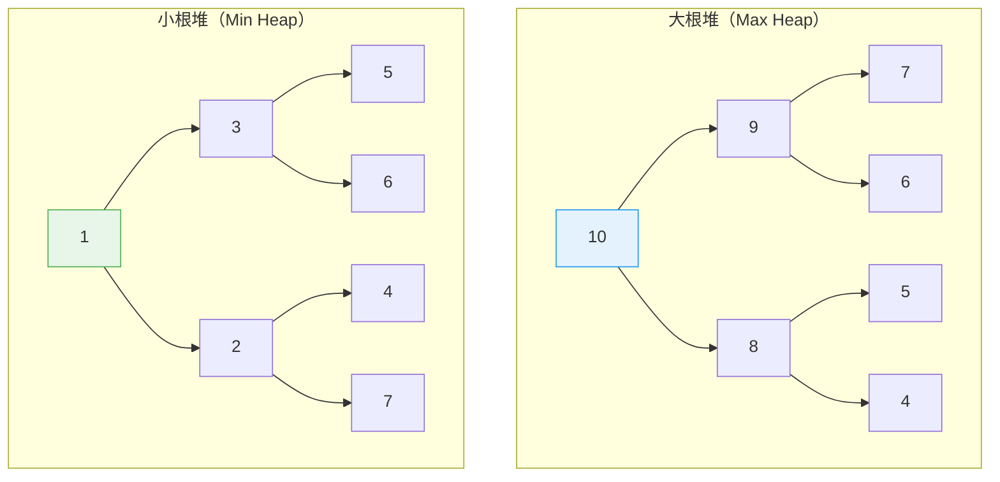
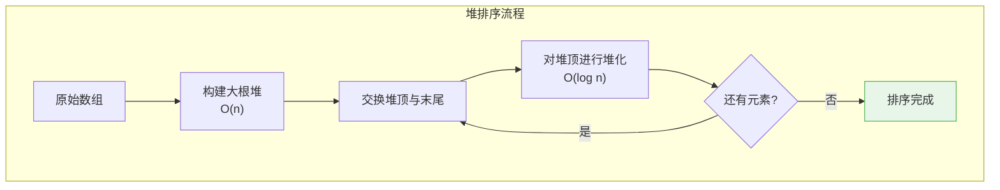
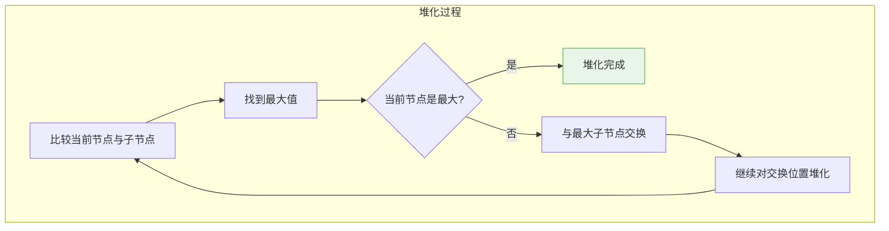
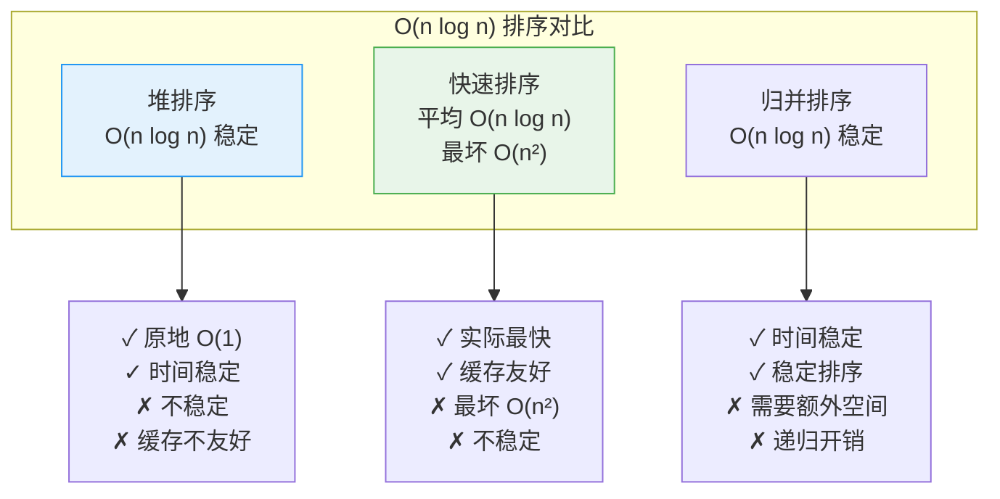
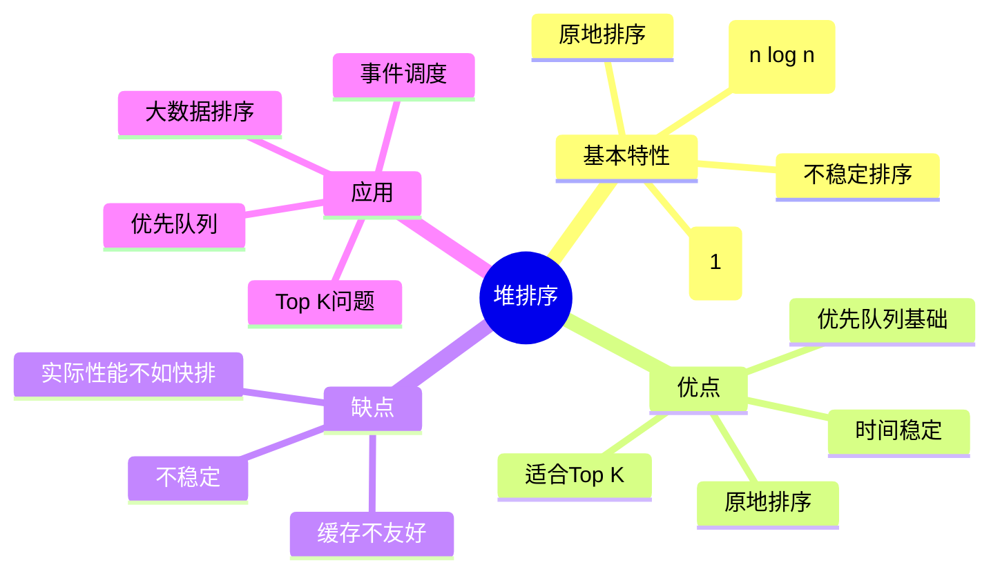

# 堆排序

## 概述

堆排序（Heap Sort）是一种基于**二叉堆**数据结构的比较排序算法。它利用堆的性质，将数组视为完全二叉树，通过构建堆并不断取出堆顶元素完成排序。

<div style="background-color: #E3F2FD; padding: 15px; margin: 10px 0; border-left: 4px solid #2196F3; border-radius: 5px;">
    <strong>核心特性</strong>
    <ul style="margin: 5px 0;">
        <li><strong>时间复杂度稳定</strong>：最坏、平均、最好都是 O(n log n)</li>
        <li><strong>原地排序</strong>：空间复杂度 O(1)</li>
        <li><strong>不稳定排序</strong>：相等元素可能改变相对顺序</li>
        <li><strong>基于比较</strong>：通过比较确定元素顺序</li>
    </ul>
</div>

!!! note "生活类比"
    想象一个公司组织架构：CEO在顶端，每个管理者管理几个下属。堆就像这样的层级结构——每个"管理者"（父节点）都比其"下属"（子节点）更有价值。堆排序就是不断选出"最有价值的人"（堆顶），然后重新调整组织架构。

## 堆的基本概念

### 完全二叉树与数组

```
完全二叉树的数组表示:

数组索引:  0   1   2   3   4   5   6
数值:     [10, 9,  8,  7,  6,  5,  4]

树形结构:
           10 (索引0)
          /  \
        9     8 (索引2)
       / \   / \
      7  6  5   4

父子关系:
┌─────────────────────────────────────────────────────────────┐
│ 对于索引 i 的节点:                                            │
│   父节点: parent(i) = (i - 1) / 2                            │
│   左孩子: left(i) = 2 * i + 1                                │
│   右孩子: right(i) = 2 * i + 2                               │
└─────────────────────────────────────────────────────────────┘
```

### 大根堆与小根堆



<div style="background-color: #F3E5F5; padding: 15px; margin: 10px 0; border-left: 4px solid #9C27B0; border-radius: 5px;">
    <strong>堆的性质</strong>
    <p><strong>大根堆</strong>：每个节点的值 ≥ 其子节点的值</p>
    <p><strong>小根堆</strong>：每个节点的值 ≤ 其子节点的值</p>
    <p>堆排序使用大根堆，每次取出堆顶（最大值）放到数组末尾。</p>
</div>

## 算法原理

### 整体流程



### 排序过程可视化

```
原始数组: [4, 10, 3, 5, 1]

步骤1: 构建大根堆
┌─────────────────────────────────────────────────────────────┐
│ 原始数组对应的树:                                             │
│           4                                                  │
│          / \                                                 │
│        10   3                                                │
│        /\                                                    │
│       5  1                                                   │
│                                                             │
│ 从最后一个非叶节点（索引1，值10）开始堆化:                      │
│   节点10已经是其子树中最大的                                  │
│                                                             │
│ 处理节点4:                                                   │
│   左孩子10 > 4 → 交换                                        │
│           10                                                 │
│          /  \                                                │
│        4     3                                               │
│        /\                                                    │
│       5  1                                                   │
│                                                             │
│ 继续堆化节点4（已在索引1）:                                   │
│   左孩子5 > 4 → 交换                                         │
│           10                                                 │
│          /  \                                                │
│        5     3                                               │
│        /\                                                    │
│       4  1                                                   │
│                                                             │
│ 大根堆构建完成: [10, 5, 3, 4, 1]                              │
└─────────────────────────────────────────────────────────────┘

步骤2: 排序过程
┌─────────────────────────────────────────────────────────────┐
│ 第1轮: 交换堆顶10和末尾1                                      │
│       [1, 5, 3, 4, 10]                                        │
│              ↑          ↑                                    │
│            堆顶      已排序                                   │
│                                                             │
│       堆化堆顶（忽略已排序部分）:                              │
│       1与孩子5比较 → 交换                                     │
│       [5, 1, 3, 4, 10]                                        │
│          ↑                                                   │
│       1与孩子4比较 → 交换                                     │
│       [5, 4, 3, 1, 10]                                        │
├─────────────────────────────────────────────────────────────┤
│ 第2轮: 交换堆顶5和末尾1                                       │
│       [1, 4, 3, 5, 10]                                        │
│                                                             │
│       堆化堆顶:                                               │
│       [4, 1, 3, 5, 10]                                        │
├─────────────────────────────────────────────────────────────┤
│ 第3轮: 交换堆顶4和末尾3                                       │
│       [3, 1, 4, 5, 10]                                        │
│                                                             │
│       堆化堆顶:                                               │
│       [3, 1, 4, 5, 10]  (1<3，不变)                          │
├─────────────────────────────────────────────────────────────┤
│ 第4轮: 交换堆顶3和末尾1                                       │
│       [1, 3, 4, 5, 10]                                        │
│                                                             │
│ 排序完成!                                                     │
└─────────────────────────────────────────────────────────────┘

最终结果: [1, 3, 4, 5, 10]
```

## 堆化操作

### 下沉堆化（Sift Down）



```
堆化示例: 对索引0进行堆化（假设数组为[1, 5, 3, 4, 2]）

初始状态:
           1  ← 要堆化的节点
          / \
        5    3
        /\ 
       4  2

步骤1: 比较节点1与子节点5、3
┌─────────────────────────────────────────────────────────────┐
│ largest = 0 (当前节点)                                        │
│ left = 1 (值5), right = 2 (值3)                              │
│                                                             │
│ arr[left]=5 > arr[largest]=1 → largest = 1                   │
│ arr[right]=3 < arr[largest]=5 → 不变                         │
│                                                             │
│ largest ≠ 0 → 交换 arr[0] 和 arr[1]                          │
└─────────────────────────────────────────────────────────────┘

交换后:
           5
          / \
        1    3   ← 继续堆化节点1
        /\ 
       4  2

步骤2: 继续堆化索引1
┌─────────────────────────────────────────────────────────────┐
│ largest = 1                                                  │
│ left = 3 (值4), right = 4 (值2)                             │
│                                                             │
│ arr[left]=4 > arr[largest]=1 → largest = 3                   │
│ arr[right]=2 < arr[largest]=4 → 不变                         │
│                                                             │
│ largest ≠ 1 → 交换 arr[1] 和 arr[3]                          │
└─────────────────────────────────────────────────────────────┘

最终结果:
           5
          / \
        4    3
        /\ 
       1  2

数组: [5, 4, 3, 1, 2] ✓ 大根堆
```

## 代码实现

### 基本实现

=== "C"
    ```c
    #include <stdio.h>

    // 打印数组
    void printArray(int arr[], int n, const char *msg) {
        printf("%s: ", msg);
        for (int i = 0; i < n; i++) {
            printf("%d ", arr[i]);
        }
        printf("\n");
    }

    // 打印堆结构
    void printHeap(int arr[], int n) {
        printf("堆结构:\n");
        int level = 0;
        int count = 0;
        int levelSize = 1;
        
        while (count < n) {
            printf("  ");
            for (int i = 0; i < levelSize && count < n; i++) {
                printf("%d ", arr[count]);
                count++;
            }
            printf("\n");
            level++;
            levelSize *= 2;
        }
    }

    // 堆化（下沉）
    void heapify(int arr[], int n, int i) {
        int largest = i;        // 初始化最大值为当前节点
        int left = 2 * i + 1;   // 左孩子
        int right = 2 * i + 2;  // 右孩子
        
        // 找出当前节点和两个孩子中的最大值
        if (left < n && arr[left] > arr[largest]) {
            largest = left;
        }
        
        if (right < n && arr[right] > arr[largest]) {
            largest = right;
        }
        
        // 如果最大值不是当前节点，交换并继续堆化
        if (largest != i) {
            int temp = arr[i];
            arr[i] = arr[largest];
            arr[largest] = temp;
            
            printf("    交换 arr[%d]=%d 和 arr[%d]=%d\n", 
                   i, arr[largest], largest, arr[i]);
            
            // 递归堆化受影响的子树
            heapify(arr, n, largest);
        }
    }

    // 构建大根堆
    void buildMaxHeap(int arr[], int n) {
        printf("\n构建大根堆:\n");
        
        // 从最后一个非叶节点开始，自底向上堆化
        for (int i = n / 2 - 1; i >= 0; i--) {
            printf("  堆化节点 %d (值=%d):\n", i, arr[i]);
            heapify(arr, n, i);
            printHeap(arr, n);
        }
    }

    // 堆排序
    void heapSort(int arr[], int n) {
        printf("堆排序:\n");
        printArray(arr, n, "原始数组");
        
        // 步骤1: 构建大根堆
        buildMaxHeap(arr, n);
        
        printArray(arr, n, "\n初始堆");
        printf("\n开始排序:\n");
        
        // 步骤2: 逐个取出堆顶元素
        for (int i = n - 1; i > 0; i--) {
            // 交换堆顶和当前末尾元素
            int temp = arr[0];
            arr[0] = arr[i];
            arr[i] = temp;
            
            printf("\n第 %d 轮: 交换堆顶 %d 和末尾 %d\n", 
                   n - i, arr[i], arr[0]);
            printArray(arr, n, "交换后");
            
            // 对新的堆顶进行堆化
            printf("  堆化堆顶:\n");
            heapify(arr, i, 0);
            
            printArray(arr, n, "  堆化后");
        }
        
        printArray(arr, n, "\n排序结果");
    }

    int main() {
        int arr[] = {4, 10, 3, 5, 1};
        int n = sizeof(arr) / sizeof(arr[0]);
        
        heapSort(arr, n);
        
        return 0;
    }
    ```

=== "C++"
    ```cpp
    #include <vector>
    #include <iostream>
    #include <algorithm>

    template<typename T>
    void heapify(std::vector<T>& arr, int n, int i) {
        int largest = i;
        int left = 2 * i + 1;
        int right = 2 * i + 2;
        
        if (left < n && arr[left] > arr[largest]) {
            largest = left;
        }
        
        if (right < n && arr[right] > arr[largest]) {
            largest = right;
        }
        
        if (largest != i) {
            std::swap(arr[i], arr[largest]);
            heapify(arr, n, largest);
        }
    }

    template<typename T>
    void heapSort(std::vector<T>& arr) {
        int n = arr.size();
        
        // 构建大根堆
        for (int i = n / 2 - 1; i >= 0; i--) {
            heapify(arr, n, i);
        }
        
        // 排序
        for (int i = n - 1; i > 0; i--) {
            std::swap(arr[0], arr[i]);
            heapify(arr, i, 0);
        }
    }

    int main() {
        std::vector<int> arr = {4, 10, 3, 5, 1};
        
        std::cout << "排序前: ";
        for (int num : arr) std::cout << num << " ";
        std::cout << std::endl;
        
        heapSort(arr);
        
        std::cout << "排序后: ";
        for (int num : arr) std::cout << num << " ";
        std::cout << std::endl;
        
        return 0;
    }
    ```

=== "Python"
    ```python
    def heapify(arr, n, i):
        largest = i
        left = 2 * i + 1
        right = 2 * i + 2
        
        if left < n and arr[left] > arr[largest]:
            largest = left
        
        if right < n and arr[right] > arr[largest]:
            largest = right
        
        if largest != i:
            arr[i], arr[largest] = arr[largest], arr[i]
            heapify(arr, n, largest)

    def heap_sort(arr):
        n = len(arr)
        
        # 构建大根堆
        for i in range(n // 2 - 1, -1, -1):
            heapify(arr, n, i)
        
        # 排序
        for i in range(n - 1, 0, -1):
            arr[0], arr[i] = arr[i], arr[0]
            heapify(arr, i, 0)

    if __name__ == "__main__":
        arr = [4, 10, 3, 5, 1]
        print(f"排序前: {arr}")
        heap_sort(arr)
        print(f"排序后: {arr}")
    ```

=== "Java"
    ```java
    public class HeapSort {
        public static void heapify(int[] arr, int n, int i) {
            int largest = i;
            int left = 2 * i + 1;
            int right = 2 * i + 2;
            
            if (left < n && arr[left] > arr[largest]) {
                largest = left;
            }
            
            if (right < n && arr[right] > arr[largest]) {
                largest = right;
            }
            
            if (largest != i) {
                int temp = arr[i];
                arr[i] = arr[largest];
                arr[largest] = temp;
                
                heapify(arr, n, largest);
            }
        }
        
        public static void heapSort(int[] arr) {
            int n = arr.length;
            
            // 构建大根堆
            for (int i = n / 2 - 1; i >= 0; i--) {
                heapify(arr, n, i);
            }
            
            // 排序
            for (int i = n - 1; i > 0; i--) {
                int temp = arr[0];
                arr[0] = arr[i];
                arr[i] = temp;
                
                heapify(arr, i, 0);
            }
        }
        
        public static void main(String[] args) {
            int[] arr = {4, 10, 3, 5, 1};
            
            System.out.print("排序前: ");
            for (int num : arr) System.out.print(num + " ");
            System.out.println();
            
            heapSort(arr);
            
            System.out.print("排序后: ");
            for (int num : arr) System.out.print(num + " ");
            System.out.println();
        }
    }
    ```

=== "Go"
    ```go
    package main

    import "fmt"

    func heapify(arr []int, n, i int) {
        largest := i
        left := 2*i + 1
        right := 2*i + 2
        
        if left < n && arr[left] > arr[largest] {
            largest = left
        }
        
        if right < n && arr[right] > arr[largest] {
            largest = right
        }
        
        if largest != i {
            arr[i], arr[largest] = arr[largest], arr[i]
            heapify(arr, n, largest)
        }
    }

    func heapSort(arr []int) {
        n := len(arr)
        
        // 构建大根堆
        for i := n/2 - 1; i >= 0; i-- {
            heapify(arr, n, i)
        }
        
        // 排序
        for i := n - 1; i > 0; i-- {
            arr[0], arr[i] = arr[i], arr[0]
            heapify(arr, i, 0)
        }
    }

    func main() {
        arr := []int{4, 10, 3, 5, 1}
        fmt.Println("排序前:", arr)
        heapSort(arr)
        fmt.Println("排序后:", arr)
    }
    ```

=== "Rust"
    ```rust
    fn heapify(arr: &mut [i32], n: usize, i: usize) {
        let mut largest = i;
        let left = 2 * i + 1;
        let right = 2 * i + 2;
        
        if left < n && arr[left] > arr[largest] {
            largest = left;
        }
        
        if right < n && arr[right] > arr[largest] {
            largest = right;
        }
        
        if largest != i {
            arr.swap(i, largest);
            heapify(arr, n, largest);
        }
    }

    fn heap_sort(arr: &mut [i32]) {
        let n = arr.len();
        
        // 构建大根堆
        for i in (0..n / 2).rev() {
            heapify(arr, n, i);
        }
        
        // 排序
        for i in (1..n).rev() {
            arr.swap(0, i);
            heapify(arr, i, 0);
        }
    }

    fn main() {
        let mut arr = vec![4, 10, 3, 5, 1];
        println!("排序前: {:?}", arr);
        heap_sort(&mut arr);
        println!("排序后: {:?}", arr);
    }
    ```

### 迭代堆化

=== "C"
    ```c
    // 迭代版本的堆化（避免递归栈开销）
    void heapifyIterative(int arr[], int n, int i) {
        while (1) {
            int largest = i;
            int left = 2 * i + 1;
            int right = 2 * i + 2;
            
            if (left < n && arr[left] > arr[largest]) {
                largest = left;
            }
            
            if (right < n && arr[right] > arr[largest]) {
                largest = right;
            }
            
            // 如果当前节点已经是最大的，结束
            if (largest == i) {
                break;
            }
            
            // 交换
            int temp = arr[i];
            arr[i] = arr[largest];
            arr[largest] = temp;
            
            // 继续对交换位置堆化
            i = largest;
        }
    }
    ```

=== "Python"
    ```python
    def heapify_iterative(arr, n, i):
        while True:
            largest = i
            left = 2 * i + 1
            right = 2 * i + 2
            
            if left < n and arr[left] > arr[largest]:
                largest = left
            
            if right < n and arr[right] > arr[largest]:
                largest = right
            
            if largest == i:
                break
            
            arr[i], arr[largest] = arr[largest], arr[i]
            i = largest
    ```

=== "Java"
    ```java
    public static void heapifyIterative(int[] arr, int n, int i) {
        while (true) {
            int largest = i;
            int left = 2 * i + 1;
            int right = 2 * i + 2;
            
            if (left < n && arr[left] > arr[largest]) {
                largest = left;
            }
            
            if (right < n && arr[right] > arr[largest]) {
                largest = right;
            }
            
            if (largest == i) {
                break;
            }
            
            int temp = arr[i];
            arr[i] = arr[largest];
            arr[largest] = temp;
            
            i = largest;
        }
    }
    ```

## 建堆复杂度证明

<div style="background-color: #F3E5F5; padding: 15px; margin: 10px 0; border-left: 4px solid #9C27B0; border-radius: 5px;">
    <strong>建堆时间复杂度 = O(n)</strong>
    <p>证明：</p>
    <ol style="margin: 5px 0;">
        <li>高度为 h 的节点数量 ≤ n / 2^(h+1)</li>
        <li>高度为 h 的节点堆化时间为 O(h)</li>
        <li>总时间 = Σ(h=0 to log n) (n/2^(h+1) × h)</li>
        <li>= (n/2) × Σ(h=0 to ∞) (h/2^h)</li>
        <li>= (n/2) × 2 = O(n)</li>
    </ol>
</div>

```
建堆过程示例（n=7）:

数组: [4, 10, 3, 5, 1, 2, 8]

树结构及节点高度:
           4 (h=2)
          / \
        10   3 (h=1)
        /\   /\
       5 1  2  8 (h=0)

建堆从下往上:
┌─────────────────────────────────────────────────────────────┐
│ 高度0的节点（叶节点）: 索引3,4,5,6                            │
│   无需堆化，本身已是堆                                        │
│                                                             │
│ 高度1的节点: 索引1, 2                                        │
│   索引1: 节点10，堆化时间O(1)                                 │
│   索引2: 节点3，堆化时间O(1)                                  │
│                                                             │
│ 高度2的节点: 索引0                                           │
│   索引0: 节点4，堆化时间O(2)                                  │
│                                                             │
│ 总时间 = 0×4 + 1×2 + 2×1 = 4 = O(n)                         │
└─────────────────────────────────────────────────────────────┘
```

## 堆排序应用

### 1. 求第 K 大元素

```c
int findKthLargest(int arr[], int n, int k) {
    // 构建大根堆
    for (int i = n / 2 - 1; i >= 0; i--) {
        heapify(arr, n, i);
    }
    
    // 执行 k-1 次取出堆顶
    for (int i = n - 1; i > n - k; i--) {
        int temp = arr[0];
        arr[0] = arr[i];
        arr[i] = temp;
        heapify(arr, i, 0);
    }
    
    // 堆顶就是第 K 大元素
    return arr[0];
}

// 时间复杂度: O(n + k log n)
// 当 k << n 时，效率比完全排序高
```

### 2. Top K 最小元素

```c
// 使用小根堆求最小的 K 个元素
void heapifyMin(int arr[], int n, int i) {
    int smallest = i;
    int left = 2 * i + 1;
    int right = 2 * i + 2;
    
    if (left < n && arr[left] < arr[smallest]) {
        smallest = left;
    }
    
    if (right < n && arr[right] < arr[smallest]) {
        smallest = right;
    }
    
    if (smallest != i) {
        int temp = arr[i];
        arr[i] = arr[smallest];
        arr[smallest] = temp;
        heapifyMin(arr, n, smallest);
    }
}

void topKSmallest(int arr[], int n, int k) {
    printf("求最小的 %d 个元素:\n", k);
    
    // 构建大小为 k 的大根堆
    for (int i = k / 2 - 1; i >= 0; i--) {
        heapify(arr, k, i);
    }
    
    // 遍历剩余元素
    for (int i = k; i < n; i++) {
        if (arr[i] < arr[0]) {
            arr[0] = arr[i];
            heapify(arr, k, 0);
        }
    }
    
    printf("结果: ");
    for (int i = 0; i < k; i++) {
        printf("%d ", arr[i]);
    }
    printf("\n");
}
```

### 3. 优先队列实现

```c
typedef struct {
    int *data;
    int size;
    int capacity;
} PriorityQueue;

PriorityQueue* createPQ(int capacity) {
    PriorityQueue *pq = (PriorityQueue*)malloc(sizeof(PriorityQueue));
    pq->data = (int*)malloc(sizeof(int) * capacity);
    pq->size = 0;
    pq->capacity = capacity;
    return pq;
}

void push(PriorityQueue *pq, int value) {
    if (pq->size == pq->capacity) return;
    
    // 插入末尾
    int i = pq->size++;
    pq->data[i] = value;
    
    // 上浮
    while (i > 0) {
        int parent = (i - 1) / 2;
        if (pq->data[parent] >= pq->data[i]) break;
        
        int temp = pq->data[parent];
        pq->data[parent] = pq->data[i];
        pq->data[i] = temp;
        
        i = parent;
    }
}

int pop(PriorityQueue *pq) {
    if (pq->size == 0) return -1;
    
    int result = pq->data[0];
    pq->data[0] = pq->data[--pq->size];
    
    heapify(pq->data, pq->size, 0);
    
    return result;
}
```

## 复杂度分析

| 操作 | 时间复杂度 | 说明 |
|------|------------|------|
| 建堆 | O(n) | 从最后一个非叶节点开始堆化 |
| 单次堆化 | O(log n) | 堆的高度 |
| 排序 | O(n log n) | n 次堆化 |
| 取堆顶 | O(1) | 直接访问 |
| 插入元素 | O(log n) | 上浮调整 |

| 情况 | 时间复杂度 |
|------|------------|
| 最好 | O(n log n) |
| 平均 | O(n log n) |
| 最坏 | O(n log n) |

## 稳定性分析

```
堆排序是不稳定排序:

示例: [3A, 3B, 1]

初始大根堆:
           3A
          /  \
        3B    1

第1轮: 交换堆顶 3A 和末尾 1
       [1, 3B, 3A]
              ↑
            已排序

堆化后:
           3B
          /
        1

第2轮: 交换堆顶 3B 和末尾 1
       [1, 3B, 3A]

结果: 3B 在 3A 之前，相对顺序改变！

结论: 堆排序不稳定
```

## 与其他排序算法对比



| 特性 | 堆排序 | 快速排序 | 归并排序 |
|------|--------|----------|----------|
| 最好时间 | O(n log n) | O(n log n) | O(n log n) |
| 平均时间 | O(n log n) | O(n log n) | O(n log n) |
| 最坏时间 | O(n log n) | O(n²) | O(n log n) |
| 空间复杂度 | O(1) | O(log n) | O(n) |
| 稳定性 | 不稳定 | 不稳定 | 稳定 |
| 缓存友好 | 不友好 | 友好 | 中等 |

## 适用场景

<div style="background-color: #E8F5E9; padding: 15px; margin: 10px 0; border-left: 4px solid #4CAF50; border-radius: 5px;">
    <strong>适合使用堆排序的场景</strong>
    <ul style="margin: 5px 0;">
        <li><strong>原地排序需求</strong>：空间受限，不能使用额外空间</li>
        <li><strong>时间要求稳定</strong>：必须保证 O(n log n)</li>
        <li><strong>Top K 问题</strong>：只需求前 K 大/小的元素</li>
        <li><strong>优先队列</strong>：需要频繁取最大/最小元素</li>
    </ul>
</div>

<div style="background-color: #FFF3E0; padding: 15px; margin: 10px 0; border-left: 4px solid #FF9800; border-radius: 5px;">
    <strong>不适合使用堆排序的场景</strong>
    <ul style="margin: 5px 0;">
        <li><strong>小规模数据</strong>：插入排序更简单高效</li>
        <li><strong>追求极致性能</strong>：快速排序实际更快（缓存友好）</li>
        <li><strong>需要稳定排序</strong>：应选择归并排序</li>
    </ul>
</div>

## 常见问题与陷阱

### 1. 数组索引从 1 开始的错误

```c
// 错误：如果使用 1 开始的索引，父子关系公式需要调整
int left = 2 * i;      // 正确（对于1开始的索引）
int right = 2 * i + 1; // 正确（对于1开始的索引）
int parent = i / 2;    // 正确（对于1开始的索引）

// 正确：使用 0 开始的索引
int left = 2 * i + 1;
int right = 2 * i + 2;
int parent = (i - 1) / 2;
```

### 2. 建堆起始位置错误

```c
// 错误：从第一个元素开始堆化
void wrongBuildHeap(int arr[], int n) {
    for (int i = 0; i < n; i++) {  // 错误：应该从 n/2-1 开始
        heapify(arr, n, i);
    }
}

// 正确：从最后一个非叶节点开始
void correctBuildHeap(int arr[], int n) {
    for (int i = n / 2 - 1; i >= 0; i--) {  // 正确
        heapify(arr, n, i);
    }
}
```

## 总结

### 算法特点



### 学习建议

1. **理解堆结构**：掌握完全二叉树与数组的关系
2. **掌握堆化操作**：理解下沉和上浮两种方式
3. **理解建堆过程**：从下往上，O(n) 复杂度
4. **分析稳定性**：通过实例理解为什么不稳定
5. **实践应用**：实现优先队列、Top K 问题

## 参考资料

- 《算法导论》第6章 - 堆排序
- 《数据结构与算法分析》第7章 - 排序
- [Heapsort - Wikipedia](https://en.wikipedia.org/wiki/Heapsort)
- [Binary Heap - Wikipedia](https://en.wikipedia.org/wiki/Binary_heap)
