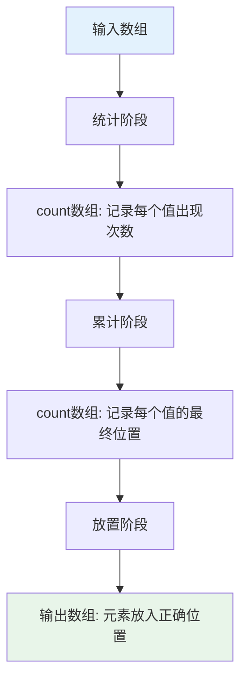
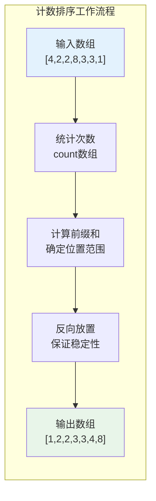
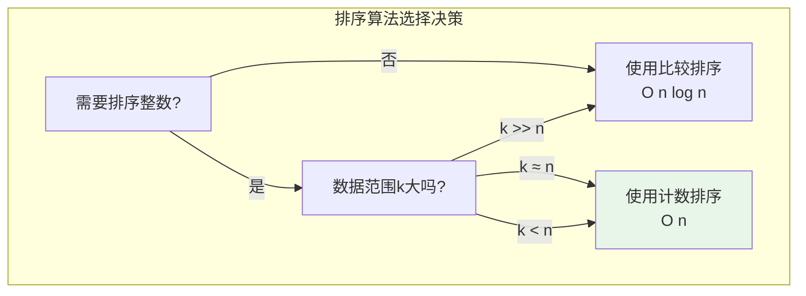
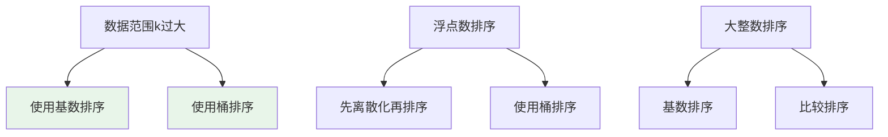

# 计数排序

## 概述

计数排序（Counting Sort）是一种**非比较排序算法**，通过统计每个元素出现的次数来进行排序。它打破了比较排序O(n log n)的下界限制，适用于**整数排序**，时间复杂度为O(n+k)，其中k是数据范围。

!!! note "计数排序的突破性"
    计数排序是线性时间排序算法，它不通过比较元素大小来排序，而是利用元素的整数值直接确定其位置。当数据范围k不大时，计数排序是最快的排序算法。

## 算法思想详解

计数排序的核心思想：**统计出现次数，计算目标位置**



### 三个关键步骤

1. **统计（Counting）**：遍历数组，统计每个元素出现的次数
2. **累计（Prefix Sum）**：计算前缀和，确定每个元素的最终位置范围
3. **放置（Placement）**：根据累计结果，将元素放到正确位置

## 算法可视化演示

### 完整排序过程

```
输入数组: [4, 2, 2, 8, 3, 3, 1]
数据范围: min=1, max=8, k=8

┌─────────────────────────────────────────────────────┐
│ 第一步: 统计每个元素出现次数                          │
└─────────────────────────────────────────────────────┘

    值:    1   2   3   4   5   6   7   8
           ↓   ↓   ↓   ↓   ↓   ↓   ↓   ↓
    输入:  4   2   2   8   3   3   1
    
    统计过程:
    arr[0]=4 → count[4]++ → count[4]=1
    arr[1]=2 → count[2]++ → count[2]=1
    arr[2]=2 → count[2]++ → count[2]=2
    arr[3]=8 → count[8]++ → count[8]=1
    arr[4]=3 → count[3]++ → count[3]=1
    arr[5]=3 → count[3]++ → count[3]=2
    arr[6]=1 → count[1]++ → count[1]=1
    
    count数组: [1, 2, 2, 1, 0, 0, 0, 1]
               ↑  ↑  ↑  ↑              ↑
               1  2  3  4  ...         8

┌─────────────────────────────────────────────────────┐
│ 第二步: 计算前缀和（累计计数）                        │
└─────────────────────────────────────────────────────┘

    前缀和计算:
    count[1] = 1 (值为1的元素位置: 0)
    count[2] = 1+2 = 3 (值为2的元素位置: 1-2)
    count[3] = 3+2 = 5 (值为3的元素位置: 3-4)
    count[4] = 5+1 = 6 (值为4的元素位置: 5)
    count[5] = 6+0 = 6
    count[6] = 6+0 = 6
    count[7] = 6+0 = 6
    count[8] = 6+1 = 7 (值为8的元素位置: 6)
    
    累计数组: [1, 3, 5, 6, 6, 6, 6, 7]
    
    位置含义: count[i]表示值i的最后一个元素的位置+1
            即值i应该放在位置count[i]-1

┌─────────────────────────────────────────────────────┐
│ 第三步: 从后向前遍历，将元素放到正确位置              │
└─────────────────────────────────────────────────────┘

    从后向前遍历（保证稳定性）:
    
    i=6: arr[6]=1
         pos = count[1]-1 = 0
         output[0] = 1, count[1] = 0
         output: [1, _, _, _, _, _, _]
    
    i=5: arr[5]=3
         pos = count[3]-1 = 4
         output[4] = 3, count[3] = 4
         output: [1, _, _, _, 3, _, _]
    
    i=4: arr[4]=3
         pos = count[3]-1 = 3
         output[3] = 3, count[3] = 3
         output: [1, _, _, 3, 3, _, _]
    
    i=3: arr[3]=8
         pos = count[8]-1 = 6
         output[6] = 8, count[8] = 6
         output: [1, _, _, 3, 3, _, 8]
    
    i=2: arr[2]=2
         pos = count[2]-1 = 2
         output[2] = 2, count[2] = 2
         output: [1, _, 2, 3, 3, _, 8]
    
    i=1: arr[1]=2
         pos = count[2]-1 = 1
         output[1] = 2, count[2] = 1
         output: [1, 2, 2, 3, 3, _, 8]
    
    i=0: arr[0]=4
         pos = count[4]-1 = 5
         output[5] = 4, count[4] = 5
         output: [1, 2, 2, 3, 3, 4, 8]

最终结果: [1, 2, 2, 3, 3, 4, 8]
```

### 内存布局可视化

```
内存中的数据结构:

输入数组 arr:
┌───┬───┬───┬───┬───┬───┬───┐
│ 4 │ 2 │ 2 │ 8 │ 3 │ 3 │ 1 │
└───┴───┴───┴───┴───┴───┴───┘
  0   1   2   3   4   5   6

计数数组 count (大小为max+1=9):
┌───┬───┬───┬───┬───┬───┬───┬───┬───┐
│ 0 │ 1 │ 2 │ 2 │ 1 │ 0 │ 0 │ 0 │ 1 │  初始统计
└───┴───┴───┴───┴───┴───┴───┴───┴───┘
  0   1   2   3   4   5   6   7   8

累计后:
┌───┬───┬───┬───┬───┬───┬───┬───┬───┐
│ 0 │ 1 │ 3 │ 5 │ 6 │ 6 │ 6 │ 6 │ 7 │  累计计数
└───┴───┴───┴───┴───┴───┴───┴───┴───┘
  0   1   2   3   4   5   6   7   8

输出数组 output:
┌───┬───┬───┬───┬───┬───┬───┐
│ 1 │ 2 │ 2 │ 3 │ 3 │ 4 │ 8 │  最终结果
└───┴───┴───┴───┴───┴───┴───┘
  0   1   2   3   4   5   6
```



## 基本实现

### 简单版本（适用于非负整数）

=== "C"
    ```c
    #include <stdlib.h>
    #include <string.h>

    void countingSort(int arr[], int n) {
        if (n <= 0) return;
        
        // 找最大值
        int max = arr[0];
        for (int i = 1; i < n; i++) {
            if (arr[i] > max) max = arr[i];
        }
        
        // 分配计数数组并初始化为0
        int *count = (int*)calloc(max + 1, sizeof(int));
        
        // 统计每个元素出现次数
        for (int i = 0; i < n; i++) {
            count[arr[i]]++;
        }
        
        // 根据计数重构数组
        int index = 0;
        for (int i = 0; i <= max; i++) {
            while (count[i] > 0) {
                arr[index++] = i;
                count[i]--;
            }
        }
        
        free(count);
    }
    ```

=== "C++"
    ```cpp
    #include <vector>
    #include <algorithm>

    void countingSort(std::vector<int>& arr) {
        if (arr.empty()) return;
        
        // 找数据范围
        auto [minIt, maxIt] = std::minmax_element(arr.begin(), arr.end());
        int minVal = *minIt;
        int maxVal = *maxIt;
        int range = maxVal - minVal + 1;
        
        // 统计
        std::vector<int> count(range, 0);
        for (int num : arr) {
            count[num - minVal]++;
        }
        
        // 重构
        int index = 0;
        for (int i = 0; i < range; i++) {
            while (count[i] > 0) {
                arr[index++] = i + minVal;
                count[i]--;
            }
        }
    }
    ```

=== "Python"
    ```python
    def counting_sort(arr):
        if not arr:
            return arr
        
        min_val = min(arr)
        max_val = max(arr)
        range_val = max_val - min_val + 1
        
        # 统计
        count = [0] * range_val
        for num in arr:
            count[num - min_val] += 1
        
        # 重构
        result = []
        for i in range(range_val):
            result.extend([i + min_val] * count[i])
        
        return result

    if __name__ == "__main__":
        arr = [4, 2, 2, 8, 3, 3, 1]
        print(f"排序前: {arr}")
        arr = counting_sort(arr)
        print(f"排序后: {arr}")
    ```

=== "Java"
    ```java
    import java.util.Arrays;

    public class CountingSort {
        public static void countingSort(int[] arr) {
            if (arr.length == 0) return;
            
            int min = arr[0], max = arr[0];
            for (int num : arr) {
                min = Math.min(min, num);
                max = Math.max(max, num);
            }
            
            int range = max - min + 1;
            int[] count = new int[range];
            
            // 统计
            for (int num : arr) {
                count[num - min]++;
            }
            
            // 重构
            int index = 0;
            for (int i = 0; i < range; i++) {
                while (count[i] > 0) {
                    arr[index++] = i + min;
                    count[i]--;
                }
            }
        }
        
        public static void main(String[] args) {
            int[] arr = {4, 2, 2, 8, 3, 3, 1};
            System.out.println("排序前: " + Arrays.toString(arr));
            countingSort(arr);
            System.out.println("排序后: " + Arrays.toString(arr));
        }
    }
    ```

=== "Go"
    ```go
    package main

    import "fmt"

    func countingSort(arr []int) {
        if len(arr) == 0 {
            return
        }
        
        min, max := arr[0], arr[0]
        for _, num := range arr {
            if num < min {
                min = num
            }
            if num > max {
                max = num
            }
        }
        
        range_ := max - min + 1
        count := make([]int, range_)
        
        // 统计
        for _, num := range arr {
            count[num-min]++
        }
        
        // 重构
        index := 0
        for i := 0; i < range_; i++ {
            for count[i] > 0 {
                arr[index] = i + min
                index++
                count[i]--
            }
        }
    }

    func main() {
        arr := []int{4, 2, 2, 8, 3, 3, 1}
        fmt.Println("排序前:", arr)
        countingSort(arr)
        fmt.Println("排序后:", arr)
    }
    ```

=== "Rust"
    ```rust
    fn counting_sort(arr: &mut [i32]) {
        if arr.is_empty() {
            return;
        }
        
        let min = *arr.iter().min().unwrap();
        let max = *arr.iter().max().unwrap();
        let range = (max - min + 1) as usize;
        
        let mut count = vec![0; range];
        
        // 统计
        for &num in arr.iter() {
            count[(num - min) as usize] += 1;
        }
        
        // 重构
        let mut index = 0;
        for i in 0..range {
            while count[i] > 0 {
                arr[index] = i as i32 + min;
                index += 1;
                count[i] -= 1;
            }
        }
    }

    fn main() {
        let mut arr = vec![4, 2, 2, 8, 3, 3, 1];
        println!("排序前: {:?}", arr);
        counting_sort(&mut arr);
        println!("排序后: {:?}", arr);
    }
    ```

### 稳定版本（支持负数）

=== "C"
    ```c
    void countingSortStable(int arr[], int n) {
        if (n <= 0) return;
        
        // 找最大值和最小值
        int max = arr[0], min = arr[0];
        for (int i = 1; i < n; i++) {
            if (arr[i] > max) max = arr[i];
            if (arr[i] < min) min = arr[i];
        }
        
        int range = max - min + 1;  // 数据范围
        
        // 分配计数数组和输出数组
        int *count = (int*)calloc(range, sizeof(int));
        int *output = (int*)malloc(n * sizeof(int));
        
        // 统计每个元素出现次数
        for (int i = 0; i < n; i++) {
            count[arr[i] - min]++;  // 偏移处理负数
        }
        
        // 计算前缀和
        for (int i = 1; i < range; i++) {
            count[i] += count[i - 1];
        }
        
        // 从后向前放置元素（保证稳定性）
        for (int i = n - 1; i >= 0; i--) {
            int idx = arr[i] - min;
            output[count[idx] - 1] = arr[i];
            count[idx]--;
        }
        
        // 复制回原数组
        for (int i = 0; i < n; i++) {
            arr[i] = output[i];
        }
        
        free(count);
        free(output);
    }
    ```

=== "C++"
    ```cpp
    // 稳定版本
    std::vector<int> countingSortStable(const std::vector<int>& arr) {
        if (arr.empty()) return {};
        
        auto [minIt, maxIt] = std::minmax_element(arr.begin(), arr.end());
        int minVal = *minIt;
        int maxVal = *maxIt;
        int range = maxVal - minVal + 1;
        
        std::vector<int> count(range, 0);
        std::vector<int> output(arr.size());
        
        // 统计
        for (int num : arr) {
            count[num - minVal]++;
        }
        
        // 前缀和
        for (int i = 1; i < range; i++) {
            count[i] += count[i - 1];
        }
        
        // 反向放置
        for (int i = arr.size() - 1; i >= 0; i--) {
            int idx = arr[i] - minVal;
            output[count[idx] - 1] = arr[i];
            count[idx]--;
        }
        
        return output;
    }
    ```

=== "Python"
    ```python
    def counting_sort_stable(arr):
        if not arr:
            return arr
        
        min_val = min(arr)
        max_val = max(arr)
        range_val = max_val - min_val + 1
        
        count = [0] * range_val
        output = [0] * len(arr)
        
        # 统计
        for num in arr:
            count[num - min_val] += 1
        
        # 前缀和
        for i in range(1, range_val):
            count[i] += count[i - 1]
        
        # 反向放置（保证稳定性）
        for i in range(len(arr) - 1, -1, -1):
            idx = arr[i] - min_val
            output[count[idx] - 1] = arr[i]
            count[idx] -= 1
        
        return output
    ```

=== "Java"
    ```java
    public static int[] countingSortStable(int[] arr) {
        if (arr.length == 0) return arr;
        
        int min = arr[0], max = arr[0];
        for (int num : arr) {
            min = Math.min(min, num);
            max = Math.max(max, num);
        }
        
        int range = max - min + 1;
        int[] count = new int[range];
        int[] output = new int[arr.length];
        
        // 统计
        for (int num : arr) {
            count[num - min]++;
        }
        
        // 前缀和
        for (int i = 1; i < range; i++) {
            count[i] += count[i - 1];
        }
        
        // 反向放置
        for (int i = arr.length - 1; i >= 0; i--) {
            int idx = arr[i] - min;
            output[count[idx] - 1] = arr[i];
            count[idx]--;
        }
        
        return output;
    }
    ```

=== "Go"
    ```go
    func countingSortStable(arr []int) []int {
        if len(arr) == 0 {
            return arr
        }
        
        min, max := arr[0], arr[0]
        for _, num := range arr {
            if num < min {
                min = num
            }
            if num > max {
                max = num
            }
        }
        
        range_ := max - min + 1
        count := make([]int, range_)
        output := make([]int, len(arr))
        
        // 统计
        for _, num := range arr {
            count[num-min]++
        }
        
        // 前缀和
        for i := 1; i < range_; i++ {
            count[i] += count[i-1]
        }
        
        // 反向放置
        for i := len(arr) - 1; i >= 0; i-- {
            idx := arr[i] - min
            output[count[idx]-1] = arr[i]
            count[idx]--
        }
        
        return output
    }
    ```

=== "Rust"
    ```rust
    fn counting_sort_stable(arr: &[i32]) -> Vec<i32> {
        if arr.is_empty() {
            return arr.to_vec();
        }
        
        let min = *arr.iter().min().unwrap();
        let max = *arr.iter().max().unwrap();
        let range = (max - min + 1) as usize;
        
        let mut count = vec![0; range];
        let mut output = vec![0; arr.len()];
        
        // 统计
        for &num in arr.iter() {
            count[(num - min) as usize] += 1;
        }
        
        // 前缀和
        for i in 1..range {
            count[i] += count[i - 1];
        }
        
        // 反向放置
        for i in (0..arr.len()).rev() {
            let idx = (arr[i] - min) as usize;
            output[count[idx] - 1] = arr[i];
            count[idx] -= 1;
        }
        
        output
    }
    ```

## 复杂度分析

### 时间复杂度

| 情况 | 时间复杂度 | 说明 |
|------|-----------|------|
| 所有 | O(n + k) | n次统计 + k次累计 + n次放置 |

```
详细分析:
- 找最大最小值: O(n)
- 统计次数: O(n)
- 计算前缀和: O(k)
- 放置元素: O(n)

总计: O(n) + O(n) + O(k) + O(n) = O(n + k)

当 k = O(n) 时, 时间复杂度为 O(n)
当 k >> n 时, 时间复杂度接近 O(k)
```

### 空间复杂度

| 情况 | 空间复杂度 | 说明 |
|------|-----------|------|
| 基本版本 | O(k) | 计数数组 |
| 稳定版本 | O(n + k) | 计数数组 + 输出数组 |

```
空间消耗:
- count数组: k+1 个整数
- output数组: n 个整数 (稳定版本)
- 总计: O(k) 或 O(n+k)
```

## 稳定性

计数排序是**稳定排序**：

```
稳定性证明:

从后向前遍历放置元素时:
- 对于相同的元素，后出现的先被放置
- count值递减，先出现的放在更靠前的位置
- 因此相等元素的相对顺序保持不变

示例:
原序列: [3A, 1, 2, 3B, 3C]
          ↑        ↑   ↑
        先出现   后出现

反向放置:
3C 放在位置 count[3]-1
3B 放在位置 count[3]-2
3A 放在位置 count[3]-3

最终: [1, 2, 3A, 3B, 3C]
             ↑   ↑   ↑
           原顺序保持
```

## 适用条件

<div style="background-color: #E8F5E9; padding: 15px; border-radius: 5px; border-left: 5px solid #4CAF50;">
<b>计数排序的适用条件:</b>

1. **元素必须是整数**：需要直接索引count数组
2. **数据范围有限**：k不能太大，否则空间消耗过大
3. **非负整数**：需要处理负数偏移

<b>最佳使用场景:</b>
- k = O(n)：数据范围与元素个数同阶
- k 较小：如考试成绩(0-100)、年龄(0-150)
</div>

## 计数排序 vs 其他排序



| 特性 | 计数排序 | 快速排序 | 归并排序 | 堆排序 |
|------|---------|---------|---------|--------|
| 时间复杂度 | O(n+k) | O(n log n) | O(n log n) | O(n log n) |
| 空间复杂度 | O(k) | O(log n) | O(n) | O(1) |
| 稳定性 | 稳定 | 不稳定 | 稳定 | 不稳定 |
| 适用数据 | 整数 | 通用 | 通用 | 通用 |
| 数据范围限制 | 需要 | 不需要 | 不需要 | 不需要 |

## 应用场景

### 1. 成绩排序

```c
// 学生成绩排序（0-100分）
void sortScores(int scores[], int n) {
    int count[101] = {0};  // 分数范围固定
    
    for (int i = 0; i < n; i++) {
        count[scores[i]]++;
    }
    
    int index = 0;
    for (int score = 0; score <= 100; score++) {
        while (count[score] > 0) {
            scores[index++] = score;
            count[score]--;
        }
    }
}
```

### 2. 字符统计与排序

```c
#include <ctype.h>

// 字符串按字符ASCII值排序
void sortString(char str[]) {
    int count[256] = {0};  // ASCII字符范围
    int n = strlen(str);
    
    for (int i = 0; i < n; i++) {
        count[(unsigned char)str[i]]++;
    }
    
    int index = 0;
    for (int c = 0; c < 256; c++) {
        while (count[c] > 0) {
            str[index++] = (char)c;
            count[c]--;
        }
    }
}
```

### 3. 作为基数排序的子过程

计数排序是基数排序的基础：

```c
// 按某一位进行计数排序
void countingSortByDigit(int arr[], int n, int exp) {
    int count[10] = {0};  // 0-9
    int *output = (int*)malloc(n * sizeof(int));
    
    // 统计该位数字出现次数
    for (int i = 0; i < n; i++) {
        count[(arr[i] / exp) % 10]++;
    }
    
    // 前缀和
    for (int i = 1; i < 10; i++) {
        count[i] += count[i - 1];
    }
    
    // 放置
    for (int i = n - 1; i >= 0; i--) {
        int digit = (arr[i] / exp) % 10;
        output[count[digit] - 1] = arr[i];
        count[digit]--;
    }
    
    // 复制
    for (int i = 0; i < n; i++) {
        arr[i] = output[i];
    }
    
    free(output);
}
```

### 4. 统计频率最高的元素

```c
int findMostFrequent(int arr[], int n) {
    int max = arr[0], min = arr[0];
    for (int i = 1; i < n; i++) {
        if (arr[i] > max) max = arr[i];
        if (arr[i] < min) min = arr[i];
    }
    
    int range = max - min + 1;
    int *count = (int*)calloc(range, sizeof(int));
    
    for (int i = 0; i < n; i++) {
        count[arr[i] - min]++;
    }
    
    int maxCount = 0, result = arr[0];
    for (int i = 0; i < range; i++) {
        if (count[i] > maxCount) {
            maxCount = count[i];
            result = i + min;
        }
    }
    
    free(count);
    return result;
}
```

## 局限性与改进

### 局限性

```
不适用情况:

1. 数据范围远大于元素个数
   例: [1, 1000000, 2] 
   k = 1000000, n = 3
   空间消耗: O(1000000) 不可接受

2. 浮点数排序
   例: [1.5, 2.7, 3.2]
   无法直接作为数组索引

3. 大整数排序
   例: [10^9, 10^10, 10^11]
   count数组无法分配
```

### 改进方案



## 参考资料

- 《算法导论》第8章 - 线性时间排序
- Knuth, 《计算机程序设计艺术》第3卷
- [Counting Sort - Wikipedia](https://en.wikipedia.org/wiki/Counting_sort)
