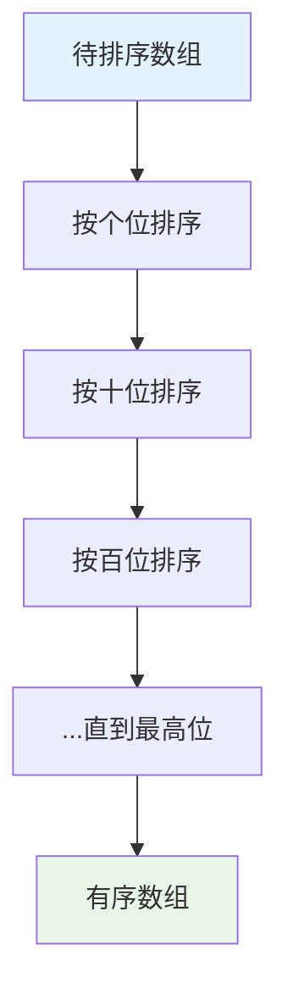
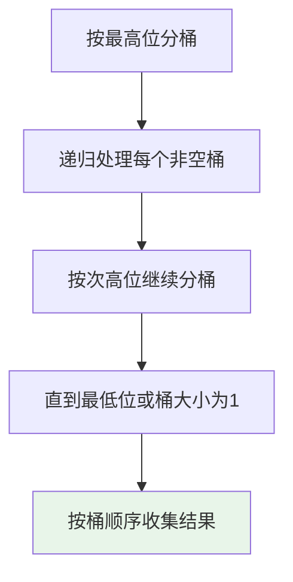
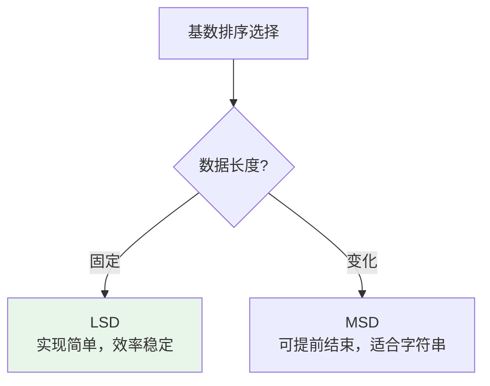

# 基数排序

## 概述

基数排序（Radix Sort）是一种**非比较排序算法**，通过按位排序实现整数排序。它从最低位（或最高位）开始，依次对每一位进行稳定排序（通常使用计数排序），最终得到有序序列。

!!! note "基数排序的突破性"
    基数排序打破了比较排序O(n log n)的下界限制，适用于整数排序。当数据位数d固定时，时间复杂度为O(n)，是线性时间排序算法。

## 算法思想详解

### 核心思想

基数排序将整数按位分解，从低位到高位（LSD）或从高位到低位（MSD）逐位排序。



### 为什么必须使用稳定排序

```
关键: 每一位的排序必须是稳定的！

示例:
初始: [21, 12, 32]  (待按十位排序)

如果排序稳定:
按个位排序后: [21, 12, 32]
  个位: 1, 2, 2 (已有序)
按十位排序后: [12, 21, 32] ✓
  
如果排序不稳定:
按个位排序后可能: [21, 32, 12] (12和32位置交换)
  个位: 1, 2, 2 (顺序被打乱)
按十位排序后: [12, 21, 32] 或 [12, 32, 21] ✗
  结果可能不正确！
```

## 算法可视化演示

### LSD基数排序过程

```
初始数组: [170, 45, 75, 90, 802, 24, 2, 66]
最大数: 802 (3位)

┌─────────────────────────────────────────────────────┐
│ 第1轮: 按个位排序                                   │
└─────────────────────────────────────────────────────┘

提取个位:
170 → 0,  45 → 5,  75 → 5,  90 → 0
802 → 2,  24 → 4,   2 → 2,  66 → 6

按个位(0-9)分配:
桶0: 170, 90
桶1: 
桶2: 802, 2
桶3: 
桶4: 24
桶5: 45, 75
桶6: 66
桶7-9: (空)

收集: [170, 90, 802, 2, 24, 45, 75, 66]

┌─────────────────────────────────────────────────────┐
│ 第2轮: 按十位排序                                   │
└─────────────────────────────────────────────────────┘

当前数组: [170, 90, 802, 2, 24, 45, 75, 66]

提取十位:
170 → 7,  90 → 9,  802 → 0,   2 → 0
24 → 2,  45 → 4,   75 → 7,  66 → 6

按十位(0-9)分配:
桶0: 802, 2
桶1: 
桶2: 24
桶3: 
桶4: 45
桶5: 
桶6: 66
桶7: 170, 75
桶8: 
桶9: 90

收集: [802, 2, 24, 45, 66, 170, 75, 90]

┌─────────────────────────────────────────────────────┐
│ 第3轮: 按百位排序                                   │
└─────────────────────────────────────────────────────┘

当前数组: [802, 2, 24, 45, 66, 170, 75, 90]

提取百位:
802 → 8,   2 → 0,  24 → 0,  45 → 0
66 → 0, 170 → 1,  75 → 0,  90 → 0

按百位(0-9)分配:
桶0: 2, 24, 45, 66, 75, 90
桶1: 170
桶2-7: (空)
桶8: 802
桶9: (空)

收集: [2, 24, 45, 66, 75, 90, 170, 802]

最终结果: [2, 24, 45, 66, 75, 90, 170, 802]
```

### 位分解示意图

```
数字 802 的位分解:

      百位    十位    个位
        ↓       ↓       ↓
      ┌───┐   ┌───┐   ┌───┐
802 = │ 8 │ × │ 0 │ × │ 2 │
      └───┘   └───┘   └───┘
        ↓       ↓       ↓
      10²     10¹     10⁰

提取第k位 (从右向左，从0开始):
digit(num, k) = (num / 10^k) % 10

示例: 提取802的第1位(十位)
digit(802, 1) = (802 / 10) % 10 = 80 % 10 = 0
```

## 基本实现（LSD）

=== "C"
    ```c
    #include <stdlib.h>

    // 获取最大值
    int getMax(int arr[], int n) {
        int max = arr[0];
        for (int i = 1; i < n; i++) {
            if (arr[i] > max) max = arr[i];
        }
        return max;
    }

    // 按第exp位进行计数排序
    void countSort(int arr[], int n, int exp) {
        int *output = (int*)malloc(n * sizeof(int));
        int count[10] = {0};  // 0-9十个数字
        
        // 统计每个数字出现次数
        for (int i = 0; i < n; i++) {
            count[(arr[i] / exp) % 10]++;
        }
        
        // 计算累计位置
        for (int i = 1; i < 10; i++) {
            count[i] += count[i - 1];
        }
        
        // 从后向前放置（保证稳定性）
        for (int i = n - 1; i >= 0; i--) {
            int digit = (arr[i] / exp) % 10;
            output[count[digit] - 1] = arr[i];
            count[digit]--;
        }
        
        // 复制回原数组
        for (int i = 0; i < n; i++) {
            arr[i] = output[i];
        }
        
        free(output);
    }

    // LSD基数排序
    void radixSort(int arr[], int n) {
        int max = getMax(arr, n);
        
        // 对每一位进行计数排序
        // exp = 1, 10, 100, 1000, ...
        for (int exp = 1; max / exp > 0; exp *= 10) {
            countSort(arr, n, exp);
        }
    }
    ```

=== "C++"
    ```cpp
    #include <vector>
    #include <algorithm>

    void radixSort(std::vector<int>& arr) {
        if (arr.empty()) return;
        
        int maxVal = *std::max_element(arr.begin(), arr.end());
        
        for (int exp = 1; maxVal / exp > 0; exp *= 10) {
            std::vector<int> output(arr.size());
            int count[10] = {0};
            
            // 统计
            for (int num : arr) {
                count[(num / exp) % 10]++;
            }
            
            // 累计
            for (int i = 1; i < 10; i++) {
                count[i] += count[i - 1];
            }
            
            // 放置
            for (int i = arr.size() - 1; i >= 0; i--) {
                int digit = (arr[i] / exp) % 10;
                output[--count[digit]] = arr[i];
            }
            
            arr = output;
        }
    }
    ```

=== "Python"
    ```python
    def radix_sort(arr):
        if not arr:
            return arr
        
        max_val = max(arr)
        exp = 1
        
        while max_val // exp > 0:
            # 计数排序
            output = [0] * len(arr)
            count = [0] * 10
            
            # 统计
            for num in arr:
                count[(num // exp) % 10] += 1
            
            # 累计
            for i in range(1, 10):
                count[i] += count[i - 1]
            
            # 放置
            for i in range(len(arr) - 1, -1, -1):
                digit = (arr[i] // exp) % 10
                output[count[digit] - 1] = arr[i]
                count[digit] -= 1
            
            arr = output
            exp *= 10
        
        return arr

    if __name__ == "__main__":
        arr = [170, 45, 75, 90, 802, 24, 2, 66]
        print(f"排序前: {arr}")
        arr = radix_sort(arr)
        print(f"排序后: {arr}")
    ```

=== "Java"
    ```java
    import java.util.Arrays;

    public class RadixSort {
        public static void radixSort(int[] arr) {
            int max = Arrays.stream(arr).max().getAsInt();
            
            for (int exp = 1; max / exp > 0; exp *= 10) {
                countSort(arr, exp);
            }
        }
        
        private static void countSort(int[] arr, int exp) {
            int[] output = new int[arr.length];
            int[] count = new int[10];
            
            // 统计
            for (int num : arr) {
                count[(num / exp) % 10]++;
            }
            
            // 累计
            for (int i = 1; i < 10; i++) {
                count[i] += count[i - 1];
            }
            
            // 放置
            for (int i = arr.length - 1; i >= 0; i--) {
                int digit = (arr[i] / exp) % 10;
                output[count[digit] - 1] = arr[i];
                count[digit]--;
            }
            
            System.arraycopy(output, 0, arr, 0, arr.length);
        }
        
        public static void main(String[] args) {
            int[] arr = {170, 45, 75, 90, 802, 24, 2, 66};
            System.out.println("排序前: " + Arrays.toString(arr));
            radixSort(arr);
            System.out.println("排序后: " + Arrays.toString(arr));
        }
    }
    ```

=== "Go"
    ```go
    package main

    import "fmt"

    func radixSort(arr []int) {
        if len(arr) == 0 {
            return
        }
        
        max := arr[0]
        for _, num := range arr {
            if num > max {
                max = num
            }
        }
        
        for exp := 1; max/exp > 0; exp *= 10 {
            countSort(arr, exp)
        }
    }

    func countSort(arr []int, exp int) {
        output := make([]int, len(arr))
        count := make([]int, 10)
        
        // 统计
        for _, num := range arr {
            count[(num/exp)%10]++
        }
        
        // 累计
        for i := 1; i < 10; i++ {
            count[i] += count[i-1]
        }
        
        // 放置
        for i := len(arr) - 1; i >= 0; i-- {
            digit := (arr[i] / exp) % 10
            output[count[digit]-1] = arr[i]
            count[digit]--
        }
        
        copy(arr, output)
    }

    func main() {
        arr := []int{170, 45, 75, 90, 802, 24, 2, 66}
        fmt.Println("排序前:", arr)
        radixSort(arr)
        fmt.Println("排序后:", arr)
    }
    ```

=== "Rust"
    ```rust
    fn radix_sort(arr: &mut [i32]) {
        if arr.is_empty() {
            return;
        }
        
        let max = *arr.iter().max().unwrap();
        let mut exp = 1;
        
        while max / exp > 0 {
            count_sort(arr, exp);
            exp *= 10;
        }
    }

    fn count_sort(arr: &mut [i32], exp: i32) {
        let mut output = vec![0; arr.len()];
        let mut count = [0; 10];
        
        // 统计
        for &num in arr.iter() {
            count[((num / exp) % 10) as usize] += 1;
        }
        
        // 累计
        for i in 1..10 {
            count[i] += count[i - 1];
        }
        
        // 放置
        for i in (0..arr.len()).rev() {
            let digit = ((arr[i] / exp) % 10) as usize;
            output[count[digit] - 1] = arr[i];
            count[digit] -= 1;
        }
        
        arr.copy_from_slice(&output);
    }

    fn main() {
        let mut arr = vec![170, 45, 75, 90, 802, 24, 2, 66];
        println!("排序前: {:?}", arr);
        radix_sort(&mut arr);
        println!("排序后: {:?}", arr);
    }
    ```

## MSD基数排序

MSD从最高位开始，递归处理每个桶。



```c
void radixSortMSD(int arr[], int n, int exp) {
    if (exp == 0 || n <= 1) return;
    
    int *buckets[10];
    int count[10] = {0};
    
    // 分配桶
    for (int i = 0; i < 10; i++) {
        buckets[i] = (int*)malloc(n * sizeof(int));
    }
    
    // 分配元素到桶
    for (int i = 0; i < n; i++) {
        int digit = (arr[i] / exp) % 10;
        buckets[digit][count[digit]++] = arr[i];
    }
    
    // 递归处理每个桶并收集
    int index = 0;
    for (int i = 0; i < 10; i++) {
        if (count[i] > 0) {
            radixSortMSD(buckets[i], count[i], exp / 10);
            for (int j = 0; j < count[i]; j++) {
                arr[index++] = buckets[i][j];
            }
        }
    }
    
    // 释放桶
    for (int i = 0; i < 10; i++) {
        free(buckets[i]);
    }
}
```

## 处理负数

```c
void radixSortWithNegative(int arr[], int n) {
    // 分离正负数
    int *positive = (int*)malloc(n * sizeof(int));
    int *negative = (int*)malloc(n * sizeof(int));
    int posCount = 0, negCount = 0;
    
    for (int i = 0; i < n; i++) {
        if (arr[i] >= 0) {
            positive[posCount++] = arr[i];
        } else {
            negative[negCount++] = -arr[i];  // 取绝对值
        }
    }
    
    // 分别排序
    radixSort(positive, posCount);
    radixSort(negative, negCount);
    
    // 合并：负数逆序，正数顺序
    int index = 0;
    for (int i = negCount - 1; i >= 0; i--) {
        arr[index++] = -negative[i];
    }
    for (int i = 0; i < posCount; i++) {
        arr[index++] = positive[i];
    }
    
    free(positive);
    free(negative);
}
```

## 字符串基数排序

```c
#include <string.h>

void radixSortString(char *strs[], int n, int maxLen) {
    // 从最后一个字符开始
    for (int pos = maxLen - 1; pos >= 0; pos--) {
        char **output = (char**)malloc(n * sizeof(char*));
        int count[256] = {0};  // ASCII字符
        
        // 统计
        for (int i = 0; i < n; i++) {
            char ch = pos < strlen(strs[i]) ? strs[i][pos] : 0;
            count[(unsigned char)ch]++;
        }
        
        // 累计
        for (int i = 1; i < 256; i++) {
            count[i] += count[i - 1];
        }
        
        // 放置
        for (int i = n - 1; i >= 0; i--) {
            char ch = pos < strlen(strs[i]) ? strs[i][pos] : 0;
            output[--count[(unsigned char)ch]] = strs[i];
        }
        
        // 复制
        for (int i = 0; i < n; i++) {
            strs[i] = output[i];
        }
        
        free(output);
    }
}
```

## 复杂度分析

### 时间复杂度

| 情况 | 时间复杂度 | 说明 |
|------|-----------|------|
| 所有 | O(d × (n + k)) | d是最大位数，k是基数(通常10) |

```
详细分析:
- 最大位数: d = ⌈log_k(max)⌉
- 每轮排序: O(n + k) (计数排序)
- 总轮数: d 轮
- 总计: O(d × (n + k))

当d为常数时: O(n)
当d = O(log n)时: O(n log n)
```

### 空间复杂度

| 实现 | 空间复杂度 | 说明 |
|------|-----------|------|
| LSD | O(n + k) | 输出数组 + 计数数组 |
| MSD | O(n × k) | 递归栈 + 桶 |

## 稳定性

基数排序是**稳定排序**（前提是子排序稳定）：

```
稳定性证明:

计数排序是稳定的 → 每一轮排序保持相等元素的相对顺序
低位排序不影响高位的相对顺序 → 最终结果稳定

示例:
初始: [21A, 21B, 12]  (两个21，A先于B)

按个位排序: [21A, 21B, 12]  (稳定，A仍在B前)
按十位排序: [12, 21A, 21B]  (稳定，A仍在B前)

结果: [12, 21A, 21B] ✓ 保持稳定性
```

## LSD vs MSD

| 特性 | LSD | MSD |
|------|-----|-----|
| 排序方向 | 低位 → 高位 | 高位 → 低位 |
| 实现复杂度 | 简单（迭代） | 复杂（递归） |
| 空间效率 | O(n+k) | O(n×k) |
| 提前结束 | 否 | 是（可提前确定顺序） |
| 适用场景 | 固定长度数据 | 变长字符串 |



## 基数排序 vs 其他线性排序

| 特性 | 基数排序 | 计数排序 | 桶排序 |
|------|---------|---------|--------|
| 数据类型 | 整数/字符串 | 整数 | 任意（可比较） |
| 时间复杂度 | O(d(n+k)) | O(n+k) | O(n+k)平均 |
| 空间复杂度 | O(n+k) | O(k) | O(n+k) |
| 数据范围 | 无限制 | 需有限范围 | 需均匀分布 |
| 稳定性 | 稳定 | 稳定 | 取决于桶内排序 |

## 应用场景

### 1. 大范围整数排序

```c
// 当数据范围很大但位数不多时，基数排序很高效
// 例: 排序100万个32位整数
// 计数排序: O(n + 2^32) = O(2^32) 不可行
// 基数排序: O(10 × n) = O(n) 可行
```

### 2. 字符串字典序排序

```c
// 按字典序排序字符串
char *words[] = {"cat", "bat", "bar", "car", "bag"};
radixSortString(words, 5, 3);
// 结果: ["bag", "bar", "bat", "car", "cat"]
```

### 3. 日期排序

```c
// 分别按日、月、年排序
typedef struct {
    int year, month, day;
} Date;

void sortDates(Date dates[], int n) {
    // 按日排序(1-31)
    // 按月排序(1-12)
    // 按年排序
    // 三次计数排序完成
}
```

### 4. IP地址排序

```c
// IP地址可视为4个0-255的数字
typedef struct {
    unsigned char a, b, c, d;
} IPAddress;

void sortIP(IPAddress ips[], int n) {
    // 分别按d, c, b, a排序（从低位到高位）
}
```

## 基数优化

### 不同基数的选择

```c
// 基数为2^k时，可用位运算优化
void radixSortBinary(int arr[], int n) {
    int max = getMax(arr, n);
    
    // 按16位一组处理（基数65536）
    for (int shift = 0; (max >> shift) > 0; shift += 16) {
        // 使用(arr[i] >> shift) & 0xFFFF 提取16位
        // 计数排序...
    }
}
```

## 参考资料

- 《算法导论》第8章 - 线性时间排序
- Knuth, 《计算机程序设计艺术》第3卷
- [Radix Sort - Wikipedia](https://en.wikipedia.org/wiki/Radix_sort)
