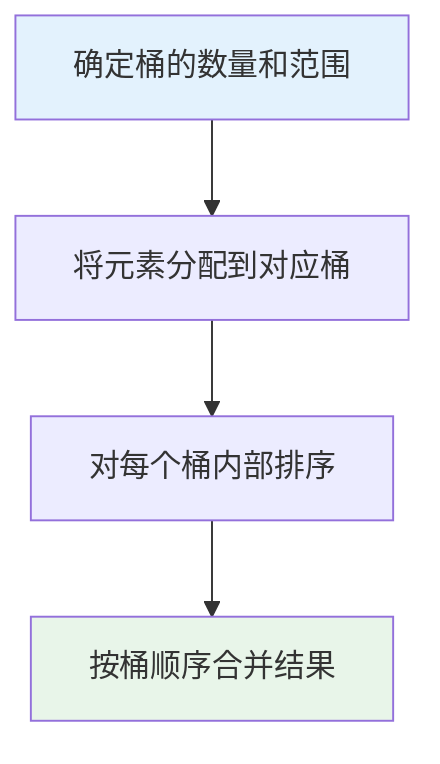
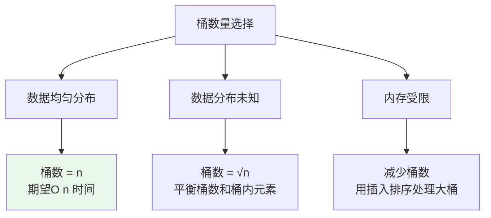
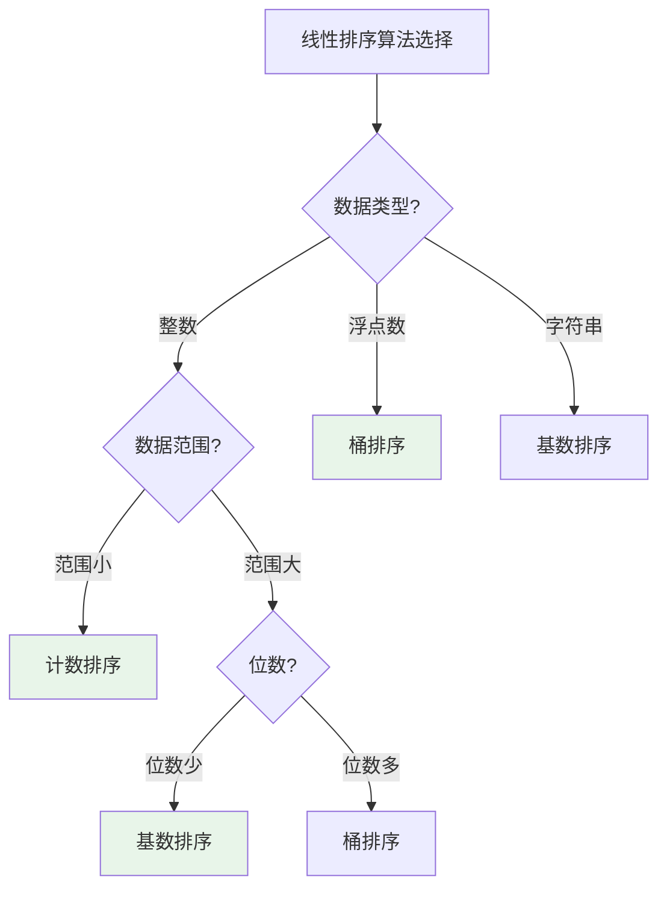

# 桶排序

## 概述

桶排序（Bucket Sort）是一种分布排序算法，将数据分到多个有序的桶中，每个桶内单独排序，然后按桶的顺序合并所有桶的结果。它适用于**均匀分布**的数据，期望时间复杂度为O(n)。

!!! note "桶排序的核心思想"
    桶排序利用数据的分布特性，将大规模排序问题分解为多个小规模排序问题。当数据均匀分布时，每个桶内元素很少，排序效率极高。

## 算法思想详解

### 核心步骤



### 桶的映射

```
映射函数: bucketIndex = (value - min) × n / (max - min)

其中:
- n: 元素个数
- min, max: 数据最小最大值
- bucketIndex ∈ [0, n-1]

示例: 数据范围[0, 1)，n个元素
- 值 0.0 → 桶 0
- 值 0.5 → 桶 n/2
- 值 0.99 → 桶 n-1
```

## 算法可视化演示

### 完整排序过程

```
输入数组: [0.78, 0.17, 0.39, 0.26, 0.72, 0.94, 0.21, 0.12, 0.23, 0.68]
数据范围: [0.0, 1.0)
桶数量: 10

┌─────────────────────────────────────────────────────┐
│ 第1步: 分配元素到桶                                 │
└─────────────────────────────────────────────────────┘

桶编号    范围           元素
────────────────────────────────────────
桶0      [0.0-0.1)      
桶1      [0.1-0.2)      0.17, 0.12
桶2      [0.2-0.3)      0.26, 0.21, 0.23
桶3      [0.3-0.4)      0.39
桶4      [0.4-0.5)      
桶5      [0.5-0.6)      
桶6      [0.6-0.7)      0.68
桶7      [0.7-0.8)      0.78, 0.72
桶8      [0.8-0.9)      
桶9      [0.9-1.0)      0.94

可视化:
桶0: [                    ]
桶1: [●●                  ] 0.17, 0.12
桶2: [●●●                 ] 0.26, 0.21, 0.23
桶3: [●                   ] 0.39
桶4: [                    ]
桶5: [                    ]
桶6: [●                   ] 0.68
桶7: [●●                  ] 0.78, 0.72
桶8: [                    ]
桶9: [●                   ] 0.94

┌─────────────────────────────────────────────────────┐
│ 第2步: 桶内排序                                     │
└─────────────────────────────────────────────────────┘

桶1: [0.12, 0.17]      排序后
桶2: [0.21, 0.23, 0.26] 排序后
桶3: [0.39]            已有序
桶6: [0.68]            已有序
桶7: [0.72, 0.78]      排序后
桶9: [0.94]            已有序

┌─────────────────────────────────────────────────────┐
│ 第3步: 合并所有桶                                   │
└─────────────────────────────────────────────────────┘

按桶顺序依次输出:
桶0 → (空)
桶1 → 0.12, 0.17
桶2 → 0.21, 0.23, 0.26
桶3 → 0.39
桶4 → (空)
桶5 → (空)
桶6 → 0.68
桶7 → 0.72, 0.78
桶8 → (空)
桶9 → 0.94

最终结果: [0.12, 0.17, 0.21, 0.23, 0.26, 0.39, 0.68, 0.72, 0.78, 0.94]
```

### 数据分布对效率的影响

```
均匀分布（理想情况）:
─────────────────────────────────────────────────────
每个桶约 n/k 个元素
桶内排序: O((n/k)²)
总计: k × O((n/k)²) = O(n²/k)
当 k = n 时: O(n) ✓

不均匀分布（最坏情况）:
─────────────────────────────────────────────────────
所有元素落入同一个桶
退化为 O(n²) ✗

例: 所有元素都在 [0.4, 0.5) 范围内
    → 全部落入桶4
    → 需要对整个数组排序
```

## 基本实现

### 浮点数桶排序（[0,1)范围）

=== "C"
    ```c
    #include <stdlib.h>

    typedef struct Node {
        double value;
        struct Node *next;
    } Node;

    void bucketSort(double arr[], int n) {
        // 创建n个桶
        Node **buckets = (Node**)calloc(n, sizeof(Node*));
        
        // 分配元素到桶
        for (int i = 0; i < n; i++) {
            int index = (int)(n * arr[i]);  // 映射到桶
            
            // 插入到链表头部
            Node *newNode = (Node*)malloc(sizeof(Node));
            newNode->value = arr[i];
            newNode->next = buckets[index];
            buckets[index] = newNode;
        }
        
        // 对每个桶排序（插入排序）
        for (int i = 0; i < n; i++) {
            Node *curr = buckets[i];
            while (curr) {
                Node *next = curr->next;
                while (next) {
                    if (curr->value > next->value) {
                        double temp = curr->value;
                        curr->value = next->value;
                        next->value = temp;
                    }
                    next = next->next;
                }
                curr = curr->next;
            }
        }
        
        // 合并所有桶
        int index = 0;
        for (int i = 0; i < n; i++) {
            Node *curr = buckets[i];
            while (curr) {
                arr[index++] = curr->value;
                Node *temp = curr;
                curr = curr->next;
                free(temp);
            }
        }
        
        free(buckets);
    }
    ```

=== "C++"
    ```cpp
    #include <vector>
    #include <algorithm>

    void bucketSort(std::vector<double>& arr) {
        int n = arr.size();
        if (n <= 1) return;
        
        // 创建n个桶
        std::vector<std::vector<double>> buckets(n);
        
        // 分配元素到桶
        for (double num : arr) {
            int index = (int)(n * num);
            if (index >= n) index = n - 1;  // 边界处理
            buckets[index].push_back(num);
        }
        
        // 对每个桶排序
        for (auto& bucket : buckets) {
            std::sort(bucket.begin(), bucket.end());
        }
        
        // 合并
        int index = 0;
        for (const auto& bucket : buckets) {
            for (double num : bucket) {
                arr[index++] = num;
            }
        }
    }

    int main() {
        std::vector<double> arr = {0.78, 0.17, 0.39, 0.26, 0.72, 0.94, 0.21, 0.12, 0.23, 0.68};
        
        std::cout << "排序前: ";
        for (double num : arr) std::cout << num << " ";
        std::cout << std::endl;
        
        bucketSort(arr);
        
        std::cout << "排序后: ";
        for (double num : arr) std::cout << num << " ";
        std::cout << std::endl;
        
        return 0;
    }
    ```

=== "Python"
    ```python
    def bucket_sort(arr):
        if len(arr) <= 1:
            return arr
        
        n = len(arr)
        buckets = [[] for _ in range(n)]
        
        # 分配元素到桶
        for num in arr:
            index = int(n * num)
            if index >= n:
                index = n - 1
            buckets[index].append(num)
        
        # 对每个桶排序
        for bucket in buckets:
            bucket.sort()
        
        # 合并
        result = []
        for bucket in buckets:
            result.extend(bucket)
        
        return result

    if __name__ == "__main__":
        arr = [0.78, 0.17, 0.39, 0.26, 0.72, 0.94, 0.21, 0.12, 0.23, 0.68]
        print(f"排序前: {arr}")
        arr = bucket_sort(arr)
        print(f"排序后: {arr}")
    ```

=== "Java"
    ```java
    import java.util.*;

    public class BucketSort {
        public static void bucketSort(double[] arr) {
            int n = arr.length;
            if (n <= 1) return;
            
            // 创建n个桶
            List<List<Double>> buckets = new ArrayList<>();
            for (int i = 0; i < n; i++) {
                buckets.add(new ArrayList<>());
            }
            
            // 分配元素到桶
            for (double num : arr) {
                int index = (int)(n * num);
                if (index >= n) index = n - 1;
                buckets.get(index).add(num);
            }
            
            // 对每个桶排序
            for (List<Double> bucket : buckets) {
                Collections.sort(bucket);
            }
            
            // 合并
            int index = 0;
            for (List<Double> bucket : buckets) {
                for (double num : bucket) {
                    arr[index++] = num;
                }
            }
        }
        
        public static void main(String[] args) {
            double[] arr = {0.78, 0.17, 0.39, 0.26, 0.72, 0.94, 0.21, 0.12, 0.23, 0.68};
            System.out.println("排序前: " + Arrays.toString(arr));
            bucketSort(arr);
            System.out.println("排序后: " + Arrays.toString(arr));
        }
    }
    ```

=== "Go"
    ```go
    package main

    import (
        "fmt"
        "sort"
    )

    func bucketSort(arr []float64) {
        n := len(arr)
        if n <= 1 {
            return
        }
        
        // 创建n个桶
        buckets := make([][]float64, n)
        for i := range buckets {
            buckets[i] = make([]float64, 0)
        }
        
        // 分配元素到桶
        for _, num := range arr {
            index := int(float64(n) * num)
            if index >= n {
                index = n - 1
            }
            buckets[index] = append(buckets[index], num)
        }
        
        // 对每个桶排序
        for _, bucket := range buckets {
            sort.Float64s(bucket)
        }
        
        // 合并
        index := 0
        for _, bucket := range buckets {
            for _, num := range bucket {
                arr[index] = num
                index++
            }
        }
    }

    func main() {
        arr := []float64{0.78, 0.17, 0.39, 0.26, 0.72, 0.94, 0.21, 0.12, 0.23, 0.68}
        fmt.Println("排序前:", arr)
        bucketSort(arr)
        fmt.Println("排序后:", arr)
    }
    ```

=== "Rust"
    ```rust
    fn bucket_sort(arr: &mut [f64]) {
        let n = arr.len();
        if n <= 1 {
            return;
        }
        
        // 创建n个桶
        let mut buckets: Vec<Vec<f64>> = vec![vec![]; n];
        
        // 分配元素到桶
        for &num in arr.iter() {
            let index = ((n as f64) * num) as usize;
            let index = if index >= n { n - 1 } else { index };
            buckets[index].push(num);
        }
        
        // 对每个桶排序
        for bucket in buckets.iter_mut() {
            bucket.sort_by(|a, b| a.partial_cmp(b).unwrap());
        }
        
        // 合并
        let mut index = 0;
        for bucket in buckets.iter() {
            for &num in bucket.iter() {
                arr[index] = num;
                index += 1;
            }
        }
    }

    fn main() {
        let mut arr = vec![0.78, 0.17, 0.39, 0.26, 0.72, 0.94, 0.21, 0.12, 0.23, 0.68];
        println!("排序前: {:?}", arr);
        bucket_sort(&mut arr);
        println!("排序后: {:?}", arr);
    }
    ```

### 整数桶排序

=== "C"
    ```c
    #include <stdlib.h>

    void bucketSortInt(int arr[], int n, int maxVal) {
        // 确定桶数量和每个桶的范围
        int bucketCount = maxVal / 100 + 1;
        int bucketSize = 100;
        
        // 创建桶
        int **buckets = (int**)malloc(bucketCount * sizeof(int*));
        int *counts = (int*)calloc(bucketCount, sizeof(int));
        int *sizes = (int*)malloc(bucketCount * sizeof(int));
        
        for (int i = 0; i < bucketCount; i++) {
            sizes[i] = 100;  // 初始大小
            buckets[i] = (int*)malloc(sizes[i] * sizeof(int));
        }
        
        // 分配元素到桶
        for (int i = 0; i < n; i++) {
            int index = arr[i] / bucketSize;
            
            // 动态扩容
            if (counts[index] >= sizes[index]) {
                sizes[index] *= 2;
                buckets[index] = (int*)realloc(buckets[index], 
                                               sizes[index] * sizeof(int));
            }
            buckets[index][counts[index]++] = arr[i];
        }
        
        // 对每个桶排序
        for (int i = 0; i < bucketCount; i++) {
            if (counts[i] > 1) {
                // 使用快速排序
                qsort(buckets[i], counts[i], sizeof(int), 
                      (int(*)(const void*, const void*))
                      [](const int *a, const int *b) { return *a - *b; });
            }
        }
        
        // 合并
        int index = 0;
        for (int i = 0; i < bucketCount; i++) {
            for (int j = 0; j < counts[i]; j++) {
                arr[index++] = buckets[i][j];
            }
            free(buckets[i]);
        }
        
        free(buckets);
        free(counts);
        free(sizes);
    }
    ```

=== "Python"
    ```python
    def bucket_sort_int(arr, max_val):
        if not arr:
            return arr
        
        bucket_count = max_val // 100 + 1
        bucket_size = 100
        
        buckets = [[] for _ in range(bucket_count)]
        
        # 分配元素到桶
        for num in arr:
            index = num // bucket_size
            buckets[index].append(num)
        
        # 对每个桶排序
        for bucket in buckets:
            bucket.sort()
        
        # 合并
        result = []
        for bucket in buckets:
            result.extend(bucket)
        
        return result
    ```

=== "Java"
    ```java
    public static void bucketSortInt(int[] arr, int maxVal) {
        int bucketCount = maxVal / 100 + 1;
        int bucketSize = 100;
        
        List<List<Integer>> buckets = new ArrayList<>();
        for (int i = 0; i < bucketCount; i++) {
            buckets.add(new ArrayList<>());
        }
        
        // 分配元素到桶
        for (int num : arr) {
            int index = num / bucketSize;
            buckets.get(index).add(num);
        }
        
        // 对每个桶排序
        for (List<Integer> bucket : buckets) {
            Collections.sort(bucket);
        }
        
        // 合并
        int index = 0;
        for (List<Integer> bucket : buckets) {
            for (int num : bucket) {
                arr[index++] = num;
            }
        }
    }
    ```

## 桶数量选择策略



| 策略 | 桶数量 | 适用场景 | 时间复杂度 |
|------|--------|----------|-----------|
| 标准选择 | n | 均匀分布 | O(n) |
| 平衡选择 | √n | 分布未知 | O(n√n) |
| 内存优先 | 固定值 | 内存受限 | O(n²/k) |

## 并行桶排序

```cpp
#include <thread>
#include <mutex>
#include <vector>
#include <algorithm>

void parallelBucketSort(std::vector<int>& arr, int numThreads) {
    int n = arr.size();
    int minVal = *std::min_element(arr.begin(), arr.end());
    int maxVal = *std::max_element(arr.begin(), arr.end());
    
    int range = maxVal - minVal + 1;
    int bucketSize = (range + numThreads - 1) / numThreads;
    
    std::vector<std::vector<int>> buckets(numThreads);
    std::mutex mtx;
    
    // 并行分配
    auto worker = [&](int start, int end) {
        for (int i = start; i < end; i++) {
            int index = (arr[i] - minVal) / bucketSize;
            if (index >= numThreads) index = numThreads - 1;
            
            std::lock_guard<std::mutex> lock(mtx);
            buckets[index].push_back(arr[i]);
        }
    };
    
    std::vector<std::thread> threads;
    int chunkSize = n / numThreads;
    
    for (int i = 0; i < numThreads; i++) {
        int start = i * chunkSize;
        int end = (i == numThreads - 1) ? n : start + chunkSize;
        threads.emplace_back(worker, start, end);
    }
    
    for (auto& t : threads) t.join();
    
    // 并行排序每个桶
    for (auto& bucket : buckets) {
        std::sort(bucket.begin(), bucket.end());
    }
    
    // 合并
    int index = 0;
    for (const auto& bucket : buckets) {
        for (int num : bucket) {
            arr[index++] = num;
        }
    }
}
```

## 复杂度分析

### 时间复杂度

| 情况 | 时间复杂度 | 说明 |
|------|-----------|------|
| 最好 | O(n) | 均匀分布，桶内元素O(1) |
| 平均 | O(n + k) | k是桶数量 |
| 最坏 | O(n²) | 所有元素在一个桶 |

```
详细分析:

设n个元素，k个桶，每个桶期望n/k个元素

分配阶段: O(n)
排序阶段: k × O((n/k) × log(n/k)) = O(n × log(n/k))
合并阶段: O(n)

总计: O(n + n × log(n/k))

当 k = n 时: O(n) ✓
当 k = 1 时: O(n log n) 退化为普通排序
```

### 空间复杂度

| 情况 | 空间复杂度 | 说明 |
|------|-----------|------|
| 所有 | O(n + k) | 桶 + 元素存储 |

## 稳定性

桶排序的稳定性取决于**桶内排序算法**：

```
稳定桶排序:
- 使用稳定的桶内排序（如插入排序、归并排序）
- 按顺序合并桶

不稳定桶排序:
- 使用不稳定的桶内排序（如快速排序、堆排序）
```

## 桶排序 vs 计数排序 vs 基数排序



| 特性 | 桶排序 | 计数排序 | 基数排序 |
|------|--------|---------|---------|
| 数据类型 | 任意可比较 | 整数 | 整数/字符串 |
| 数据范围 | 不限 | 需有限范围 | 不限 |
| 分布要求 | 均匀分布最好 | 无要求 | 无要求 |
| 时间复杂度 | O(n+k)平均 | O(n+k) | O(d(n+k)) |
| 空间复杂度 | O(n+k) | O(k) | O(n+k) |
| 并行性 | 好 | 差 | 一般 |

## 应用场景

### 1. 浮点数排序

```c
// [0, 1)范围的浮点数排序是桶排序的典型应用
double arr[] = {0.42, 0.32, 0.33, 0.52, 0.37, 0.47, 0.51};
bucketSort(arr, 7);
```

### 2. 成绩分段统计

```c
// 将成绩分桶，快速统计各分数段人数
void scoreBuckets(int scores[], int n) {
    int buckets[10] = {0};  // 0-9, 10-19, ..., 90-99
    
    for (int i = 0; i < n; i++) {
        int bucket = scores[i] / 10;
        buckets[bucket]++;
    }
    
    printf("分数段统计:\n");
    for (int i = 0; i < 10; i++) {
        printf("%d-%d分: %d人\n", i*10, i*10+9, buckets[i]);
    }
}
```

### 3. 大数据外部排序

```c
// 数据量超过内存时，每个桶写入文件
void externalBucketSort(FILE *input, int n, int bucketCount) {
    FILE *buckets[bucketCount];
    
    // 创建临时文件作为桶
    for (int i = 0; i < bucketCount; i++) {
        char filename[20];
        sprintf(filename, "bucket_%d.tmp", i);
        buckets[i] = fopen(filename, "w");
    }
    
    // 分配数据到桶文件
    int value;
    while (fscanf(input, "%d", &value) == 1) {
        int index = value / (MAX_VAL / bucketCount);
        fprintf(buckets[index], "%d\n", value);
    }
    
    // 对每个桶文件排序并合并
    for (int i = 0; i < bucketCount; i++) {
        fclose(buckets[i]);
        // 对bucket_i.tmp排序...
    }
}
```

### 4. 均匀分布数据

```c
// 检验数据是否均匀分布
int isUniformDistribution(int arr[], int n, int buckets) {
    int *count = (int*)calloc(buckets, sizeof(int));
    int max = arr[0], min = arr[0];
    
    for (int i = 1; i < n; i++) {
        if (arr[i] > max) max = arr[i];
        if (arr[i] < min) min = arr[i];
    }
    
    for (int i = 0; i < n; i++) {
        int index = (arr[i] - min) * buckets / (max - min + 1);
        count[index]++;
    }
    
    // 检查每个桶的元素数是否接近 n/buckets
    int expected = n / buckets;
    int threshold = expected * 2;  // 允许2倍偏差
    
    for (int i = 0; i < buckets; i++) {
        if (abs(count[i] - expected) > threshold) {
            free(count);
            return 0;  // 分布不均匀
        }
    }
    
    free(count);
    return 1;  // 分布均匀
}
```

## 参考资料

- 《算法导论》第8章 - 线性时间排序
- Knuth, 《计算机程序设计艺术》第3卷
- [Bucket Sort - Wikipedia](https://en.wikipedia.org/wiki/Bucket_sort)
