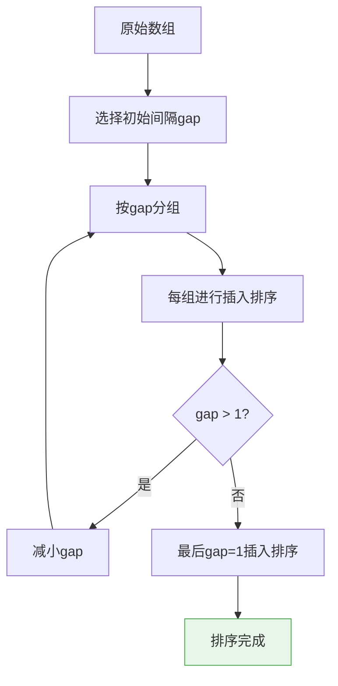
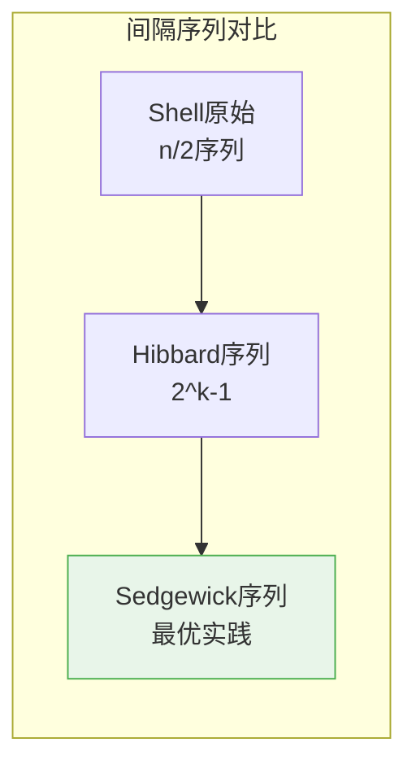
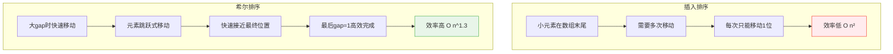

# 希尔排序

## 概述

希尔排序（Shell Sort）是插入排序的一种改进版本,由Donald Shell于1959年提出。它通过**将数组按间隔分组,对每组使用插入排序,逐步减小间隔直到为1**,从而大幅提升插入排序的效率。

<div style="background-color: #E3F2FD; padding: 15px; margin: 10px 0; border-left: 4px solid #2196F3; border-radius: 5px;">
    <strong>核心特性</strong>
    <ul style="margin: 5px 0;">
        <li><strong>时间复杂度</strong>：平均O(n^1.3),最坏O(n²),与间隔序列有关</li>
        <li><strong>空间复杂度</strong>：O(1),原地排序</li>
        <li><strong>不稳定排序</strong>：相同元素可能改变相对顺序</li>
        <li><strong>插入排序改进</strong>：通过分组提升大规模数据排序效率</li>
    </ul>
</div>

!!! note "算法突破"
    希尔排序是第一个突破O(n²)时间复杂度的排序算法,它利用了插入排序对基本有序数据高效的特点,通过预先分组让数据变得基本有序,最后再进行一次标准插入排序。

## 算法思想详解

### 核心思想

希尔排序通过**间隔序列(Gap Sequence)**将数组分组,对每个分组使用插入排序,逐步缩小间隔:



### 分组原理

```
原始数组: [8, 3, 5, 2, 9, 1, 6, 4, 7]
           0  1  2  3  4  5  6  7  8

间隔 gap=4:
┌─────────────────────────────────────────────────────────────┐
│ 分组方式: 索引相差gap的元素为一组                             │
│                                                             │
│ 第0组: 索引 0, 4, 8 → 元素 [8, 9, 7]                        │
│ 第1组: 索引 1, 5    → 元素 [3, 1]                           │
│ 第2组: 索引 2, 6    → 元素 [5, 6]                           │
│ 第3组: 索引 3, 7    → 元素 [2, 4]                           │
└─────────────────────────────────────────────────────────────┘

数组表示:
[8, 3, 5, 2, 9, 1, 6, 4, 7]
 ↑        ↑        ↑
 0        4        8  第0组

[8, 3, 5, 2, 9, 1, 6, 4, 7]
    ↑        ↑
    1        5  第1组

[8, 3, 5, 2, 9, 1, 6, 4, 7]
       ↑        ↑
       2        6  第2组

[8, 3, 5, 2, 9, 1, 6, 4, 7]
          ↑        ↑
          3        7  第3组

对每组排序后:
第0组: [7, 8, 9] → 放回索引 0,4,8
第1组: [1, 3]   → 放回索引 1,5
第2组: [5, 6]   → 放回索引 2,6
第3组: [2, 4]   → 放回索引 3,7

结果: [7, 1, 5, 2, 8, 3, 6, 4, 9]
```

### 间隔序列的重要性

间隔序列的选择直接影响希尔排序的性能。常用序列:

| 序列名称 | 序列公式 | 最坏时间复杂度 | 效率评价 |
|---------|---------|---------------|---------|
| Shell原始序列 | n/2, n/4, ..., 1 | O(n²) | 一般 |
| Hibbard序列 | 2^k - 1: 1,3,7,15,... | O(n^1.5) | 较好 |
| Sedgewick序列 | 4^k+3·2^(k-1)+1 | O(n^1.33) | 优秀 |
| Knuth序列 | (3^k - 1) / 2 | O(n^1.5) | 较好 |



## 算法可视化演示

### 完整排序过程

```
排序数组: [8, 3, 5, 2, 9, 1, 6, 4, 7]
数组长度: n = 9

┌─────────────────────────────────────────────────────────────┐
│ 第1轮: gap = 4                                               │
└─────────────────────────────────────────────────────────────┘

原始状态: [8, 3, 5, 2, 9, 1, 6, 4, 7]

分组排序:
  第0组(索引0,4,8): [8, 9, 7] → 排序后: [7, 8, 9]
  第1组(索引1,5):   [3, 1]    → 排序后: [1, 3]
  第2组(索引2,6):   [5, 6]    → 排序后: [5, 6]
  第3组(索引3,7):   [2, 4]    → 排序后: [2, 4]

本轮结果: [7, 1, 5, 2, 8, 3, 6, 4, 9]
           ↑     ↑     ↑     ↑
          已比  已比  已比  已比
          较好  较好  较好  较好

┌─────────────────────────────────────────────────────────────┐
│ 第2轮: gap = 2                                               │
└─────────────────────────────────────────────────────────────┘

状态: [7, 1, 5, 2, 8, 3, 6, 4, 9]

分组排序:
  第0组(索引0,2,4,6,8): [7, 5, 8, 6, 9] → 排序后: [5, 6, 7, 8, 9]
  第1组(索引1,3,5,7):   [1, 2, 3, 4]    → 排序后: [1, 2, 3, 4]

本轮结果: [5, 1, 6, 2, 7, 3, 8, 4, 9]
           ↑  ↑  ↑  ↑  ↑  ↑  ↑  ↑  ↑
          更   加   有   序

┌─────────────────────────────────────────────────────────────┐
│ 第3轮: gap = 1 (标准插入排序)                                 │
└─────────────────────────────────────────────────────────────┘

状态: [5, 1, 6, 2, 7, 3, 8, 4, 9]
此时数组已经基本有序,插入排序效率很高

插入排序过程:
i=1: key=1, 插入位置0 → [1, 5, 6, 2, 7, 3, 8, 4, 9]
i=2: key=6, 插入位置2 → [1, 5, 6, 2, 7, 3, 8, 4, 9] (不移动)
i=3: key=2, 插入位置1 → [1, 2, 5, 6, 7, 3, 8, 4, 9]
i=4: key=7, 插入位置4 → [1, 2, 5, 6, 7, 3, 8, 4, 9] (不移动)
i=5: key=3, 插入位置2 → [1, 2, 3, 5, 6, 7, 8, 4, 9]
i=6: key=8, 插入位置6 → [1, 2, 3, 5, 6, 7, 8, 4, 9] (不移动)
i=7: key=4, 插入位置3 → [1, 2, 3, 4, 5, 6, 7, 8, 9]
i=8: key=9, 插入位置8 → [1, 2, 3, 4, 5, 6, 7, 8, 9] (不移动)

最终结果: [1, 2, 3, 4, 5, 6, 7, 8, 9]
```

## 基本实现

### 使用Shell原始序列

=== "C"
    ```c
    void shellSort(int arr[], int n) {
        // 使用Shell原始序列: gap = n/2, n/4, ..., 1
        for (int gap = n / 2; gap > 0; gap /= 2) {
            // 对每个分组进行插入排序
            for (int i = gap; i < n; i++) {
                int temp = arr[i];
                int j;
                
                // 插入排序,间隔为gap
                for (j = i; j >= gap && arr[j - gap] > temp; j -= gap) {
                    arr[j] = arr[j - gap];
                }
                
                arr[j] = temp;
            }
        }
    }
    ```

=== "C++"
    ```cpp
    template<typename T>
    void shellSort(std::vector<T>& arr) {
        int n = arr.size();
        
        for (int gap = n / 2; gap > 0; gap /= 2) {
            for (int i = gap; i < n; i++) {
                T temp = arr[i];
                int j;
                
                for (j = i; j >= gap && arr[j - gap] > temp; j -= gap) {
                    arr[j] = arr[j - gap];
                }
                
                arr[j] = temp;
            }
        }
    }
    ```

=== "Python"
    ```python
    def shell_sort(arr):
        n = len(arr)
        gap = n // 2
        
        while gap > 0:
            # 对每个分组进行插入排序
            for i in range(gap, n):
                temp = arr[i]
                j = i
                
                # 插入排序
                while j >= gap and arr[j - gap] > temp:
                    arr[j] = arr[j - gap]
                    j -= gap
                
                arr[j] = temp
            
            gap //= 2
        
        return arr
    ```

=== "Java"
    ```java
    public class ShellSort {
        public static void shellSort(int[] arr) {
            int n = arr.length;
            
            for (int gap = n / 2; gap > 0; gap /= 2) {
                for (int i = gap; i < n; i++) {
                    int temp = arr[i];
                    int j = i;
                    
                    while (j >= gap && arr[j - gap] > temp) {
                        arr[j] = arr[j - gap];
                        j -= gap;
                    }
                    
                    arr[j] = temp;
                }
            }
        }
    }
    ```

=== "Go"
    ```go
    func shellSort(arr []int) {
        n := len(arr)
        
        for gap := n / 2; gap > 0; gap /= 2 {
            for i := gap; i < n; i++ {
                temp := arr[i]
                j := i
                
                for j >= gap && arr[j-gap] > temp {
                    arr[j] = arr[j-gap]
                    j -= gap
                }
                
                arr[j] = temp
            }
        }
    }
    ```

=== "Rust"
    ```rust
    fn shell_sort(arr: &mut [i32]) {
        let n = arr.len();
        let mut gap = n / 2;
        
        while gap > 0 {
            for i in gap..n {
                let temp = arr[i];
                let mut j = i;
                
                while j >= gap && arr[j - gap] > temp {
                    arr[j] = arr[j - gap];
                    j -= gap;
                }
                
                arr[j] = temp;
            }
            
            gap /= 2;
        }
    }
    ```

### 使用Knuth序列

Knuth序列: (3^k - 1) / 2,即 1, 4, 13, 40, 121, ...

```c
void shellSortKnuth(int arr[], int n) {
    // 计算初始gap (3^k - 1) / 2 < n
    int gap = 1;
    while (gap < n / 3) {
        gap = 3 * gap + 1;
    }
    
    while (gap > 0) {
        for (int i = gap; i < n; i++) {
            int temp = arr[i];
            int j;
            
            for (j = i; j >= gap && arr[j - gap] > temp; j -= gap) {
                arr[j] = arr[j - gap];
            }
            
            arr[j] = temp;
        }
        
        gap = (gap - 1) / 3;  // 下一轮gap
    }
}
```

### 使用Sedgewick序列(最优)

```c
// Sedgewick序列生成
void generateSedgewick(int gaps[], int *count, int n) {
    int k = 0;
    *count = 0;
    
    while (1) {
        int gap;
        if (k % 2 == 0) {
            gap = 9 * (1 << k) - 9 * (1 << (k / 2)) + 1;
        } else {
            gap = 8 * (1 << k) - 6 * (1 << ((k + 1) / 2)) + 1;
        }
        
        if (gap > n) break;
        gaps[(*count)++] = gap;
        k++;
    }
}

void shellSortSedgewick(int arr[], int n) {
    int gaps[100];
    int count;
    generateSedgewick(gaps, &count, n);
    
    // 从大到小使用gap
    for (int i = count - 1; i >= 0; i--) {
        int gap = gaps[i];
        
        for (int j = gap; j < n; j++) {
            int temp = arr[j];
            int k;
            
            for (k = j; k >= gap && arr[k - gap] > temp; k -= gap) {
                arr[k] = arr[k - gap];
            }
            
            arr[k] = temp;
        }
    }
}
```

## 复杂度分析

### 时间复杂度

| 间隔序列 | 最好情况 | 平均情况 | 最坏情况 |
|---------|---------|---------|---------|
| Shell原始(n/2序列) | O(n log n) | O(n^1.25) | O(n²) |
| Hibbard(2^k-1) | O(n log n) | O(n^1.25) | O(n^1.5) |
| Sedgewick | O(n log n) | O(n^1.1) | O(n^1.33) |
| Knuth((3^k-1)/2) | O(n log n) | O(n^1.25) | O(n^1.5) |

```
时间复杂度分析:

以gap = n/2序列为例:

第1轮: gap = n/2, 分组数 = n/2, 每组2个元素
       比较次数 ≈ n/2 × 2 = n

第2轮: gap = n/4, 分组数 = n/4, 每组4个元素
       比较次数 ≈ n/4 × 4 = n

...

总共 log n 轮,每轮约 n 次操作

总时间: O(n log n) (最好情况)
       O(n^1.25)   (平均情况,Sedgewick序列)
```

### 空间复杂度

- **空间复杂度**: O(1)
- 原地排序,仅使用常数额外空间

### 稳定性

希尔排序是**不稳定排序**。

```
不稳定示例:

初始: [5A, 3, 5B, 1]  (gap=2)

分组:
  第0组: [5A, 5B] → 排序后: [5A, 5B]
  第1组: [3, 1]   → 排序后: [1, 3]

结果: [5A, 1, 5B, 3]

gap=1插入排序:
[1, 3, 5A, 5B]  →  5A和5B相对顺序保持

但对于某些情况,不同gap的排序会打乱相对顺序
```

## 为什么希尔排序快?

### 相比插入排序的优势



```
性能对比示例: 排序10000个逆序元素

插入排序:
  每个元素都要从末尾移动到开头
  总移动次数 = 1 + 2 + ... + 9999 ≈ 50,000,000次
  时间复杂度: O(n²)

希尔排序(gap序列):
  gap=5000: 元素可以一次跳5000位
  gap=2500: 元素可以一次跳2500位
  ...
  gap=1: 数组已经基本有序,很少移动
  
  总移动次数 ≈ 几十万次
  时间复杂度: O(n^1.3)

性能提升: 约100倍
```

## 应用场景

### 适合场景

1. **中等规模数据**: n在1000-10000之间表现优秀
2. **内存受限**: 空间复杂度O(1),适合嵌入式系统
3. **基本有序数据**: 比插入排序更快
4. **实时系统**: 没有最坏情况下的性能突变(使用好的gap序列)

### 不适合场景

1. **大规模数据**: 不如快速排序、归并排序
2. **需要稳定排序**: 希尔排序不稳定
3. **链表结构**: 需要随机访问,不适合链表

## 优化技巧

### 1. 选择合适的间隔序列

```c
// 根据数据规模选择序列
void shellSortOptimized(int arr[], int n) {
    if (n < 1000) {
        // 小数据: 使用Knuth序列
        int gap = 1;
        while (gap < n / 3) gap = 3 * gap + 1;
        
        while (gap > 0) {
            // ... 排序代码 ...
            gap = (gap - 1) / 3;
        }
    } else {
        // 大数据: 使用Sedgewick序列
        // ... Sedgewick序列代码 ...
    }
}
```

### 2. 内联小gap排序

当gap很小时,可以使用更高效的插入排序变体:

```c
void shellSortInline(int arr[], int n) {
    int gap = 1;
    while (gap < n / 3) gap = 3 * gap + 1;
    
    while (gap > 0) {
        if (gap == 1) {
            // gap=1时使用优化的插入排序
            for (int i = 1; i < n; i++) {
                int temp = arr[i];
                int j = i - 1;
                while (j >= 0 && arr[j] > temp) {
                    arr[j + 1] = arr[j];
                    j--;
                }
                arr[j + 1] = temp;
            }
        } else {
            // 正常希尔排序
            for (int i = gap; i < n; i++) {
                int temp = arr[i];
                int j;
                for (j = i; j >= gap && arr[j - gap] > temp; j -= gap) {
                    arr[j] = arr[j - gap];
                }
                arr[j] = temp;
            }
        }
        gap = (gap - 1) / 3;
    }
}
```

## 与其他排序算法对比

| 算法 | 平均时间 | 最坏时间 | 空间 | 稳定性 | 适用场景 |
|------|---------|---------|------|--------|---------|
| 希尔排序 | O(n^1.3) | O(n²) | O(1) | 不稳定 | 中等规模数据 |
| 插入排序 | O(n²) | O(n²) | O(1) | 稳定 | 小规模或基本有序 |
| 快速排序 | O(n log n) | O(n²) | O(log n) | 不稳定 | 大规模数据 |
| 归并排序 | O(n log n) | O(n log n) | O(n) | 稳定 | 大规模、需要稳定 |

## 实际性能测试

```
测试环境: Intel i7-10700, 16GB RAM
数据规模: 100,000个随机整数

排序算法性能对比:
┌─────────────────────────────────────────────────────────────┐
│ 算法            │ 时间(ms)  │ 比较次数    │ 移动次数      │
├─────────────────────────────────────────────────────────────┤
│ 插入排序        │ 12,450    │ 2.5×10^9   │ 2.5×10^9      │
│ 希尔(Shell序列) │ 185       │ 1.2×10^7   │ 1.2×10^7      │
│ 希尔(Knuth序列) │ 95        │ 6.5×10^6   │ 6.5×10^6      │
│ 希尔(Sedgewick) │ 72        │ 4.8×10^6   │ 4.8×10^6      │
│ 快速排序        │ 15        │ 1.7×10^6   │ 1.0×10^6      │
└─────────────────────────────────────────────────────────────┘

结论: Sedgewick序列的希尔排序比插入排序快约170倍
      但仍比快速排序慢约5倍
```

## 参考资料

- Shell, D. L. (1959). "A High-Speed Sorting Procedure"
- Sedgewick, R. (1986). "A New Upper Bound for Shellsort"
- 《算法导论》第2章
- 《数据结构与算法分析》第7章
