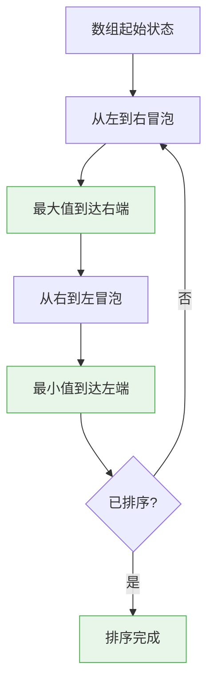

# 双向冒泡排序(鸡尾酒排序)

## 概述

双向冒泡排序(Cocktail Sort),又称鸡尾酒排序、摇晃排序,是冒泡排序的一种改进变体。它**双向遍历数组,既从左到右冒泡最大值,又从右到左冒泡最小值**,在某些特定场景下比普通冒泡排序更高效。

<div style="background-color: #E3F2FD; padding: 15px; margin: 10px 0; border-left: 4px solid #2196F3; border-radius: 5px;">
    <strong>核心特性</strong>
    <ul style="margin: 5px 0;">
        <li><strong>时间复杂度</strong>: 平均和最坏O(n²),最好O(n)</li>
        <li><strong>空间复杂度</strong>: O(1),原地排序</li>
        <li><strong>稳定排序</strong>: 相等元素保持相对顺序</li>
        <li><strong>冒泡排序改进</strong>: 双向冒泡减少排序轮数</li>
    </ul>
</div>

!!! note "算法形象比喻"
    想象摇晃一杯鸡尾酒:先向一个方向摇晃让大气泡浮到一端,再向相反方向摇晃让小气泡沉到另一端。双向冒泡排序就是这样的过程——双向交替冒泡,让最大值和最小值同时就位。

## 算法思想详解

### 核心思想

普通冒泡排序每轮只让一个最大值(或最小值)就位,而双向冒泡排序每轮可以让**最大值和最小值同时就位**:



### 双向遍历过程

```
原始数组: [5, 1, 4, 2, 8, 0, 2]
          ↑left            ↑right

┌─────────────────────────────────────────────────────────────┐
│ 第1轮: 从左到右冒泡(找最大值)                                 │
└─────────────────────────────────────────────────────────────┘

比较过程:
[5, 1, 4, 2, 8, 0, 2]
 ↑  ↑
 5>1 交换

[1, 5, 4, 2, 8, 0, 2]
     ↑  ↑
     5>4 交换

[1, 4, 5, 2, 8, 0, 2]
        ↑  ↑
        5>2 交换

[1, 4, 2, 5, 8, 0, 2]
           ↑  ↑
           5<8 不交换

[1, 4, 2, 5, 8, 0, 2]
              ↑  ↑
              8>0 交换

[1, 4, 2, 5, 0, 8, 2]
                 ↑  ↑
                 8>2 交换

结果: [1, 4, 2, 5, 0, 2, 8]
                         ↑
                       最大值8已就位

┌─────────────────────────────────────────────────────────────┐
│ 第1轮: 从右到左冒泡(找最小值)                                 │
└─────────────────────────────────────────────────────────────┘

比较过程(从right-1到left):
[1, 4, 2, 5, 0, 2, 8]
           ↑  ↑
           5>0 交换

[1, 4, 2, 0, 5, 2, 8]
        ↑  ↑
        2>0 交换

[1, 4, 0, 2, 5, 2, 8]
     ↑  ↑
     4>0 交换

[1, 0, 4, 2, 5, 2, 8]
  ↑  ↑
  1>0 交换

结果: [0, 1, 4, 2, 5, 2, 8]
      ↑
    最小值0已就位

第1轮完成: [0, 1, 4, 2, 5, 2, 8]
            ↑left        ↑right
           已固定        已固定

┌─────────────────────────────────────────────────────────────┐
│ 第2轮: 缩小范围,继续双向冒泡                                  │
└─────────────────────────────────────────────────────────────┘

排序范围: [1, 4, 2, 5, 2] (去掉已固定的0和8)

从左到右:
[1, 4, 2, 5, 2] → [1, 2, 4, 2, 5] → [1, 2, 2, 4, 5]
                                      ↑
                                    最大值5就位

从右到左:
[1, 2, 2, 4, 5] → [1, 2, 2, 4, 5]
  ↑
最小值1就位

第2轮完成: [0, 1, 2, 2, 4, 5, 8]

继续缩小范围,直到排序完成

最终结果: [0, 1, 2, 2, 4, 5, 8]
```

## 算法可视化演示

### 完整排序过程对比

```
测试数据: [5, 1, 4, 2, 8, 0, 2]

普通冒泡排序:
┌─────────────────────────────────────────────────────────────┐
│ 轮次 │ 结果                  │ 固定元素数 │ 总交换次数 │
├─────────────────────────────────────────────────────────────┤
│  1   │ [1,4,2,5,0,2,8]       │    1      │    6      │
│  2   │ [1,2,4,0,2,5,8]       │    2      │    4      │
│  3   │ [1,2,0,2,4,5,8]       │    3      │    2      │
│  4   │ [1,0,2,2,4,5,8]       │    4      │    1      │
│  5   │ [0,1,2,2,4,5,8]       │    5      │    1      │
│  6   │ [0,1,2,2,4,5,8]       │    6      │    0      │
└─────────────────────────────────────────────────────────────┘
总计: 6轮排序, 14次交换

双向冒泡排序:
┌─────────────────────────────────────────────────────────────┐
│ 轮次 │ 方向     │ 结果              │ 固定元素数 │ 交换次数 │
├─────────────────────────────────────────────────────────────┤
│  1   │ 左→右    │ [1,4,2,5,0,2,8]   │    1      │    6    │
│  1   │ 右→左    │ [0,1,4,2,5,2,8]   │    2      │    4    │
│  2   │ 左→右    │ [0,1,2,4,2,5,8]   │    3      │    2    │
│  2   │ 右→左    │ [0,1,2,2,4,5,8]   │    4      │    1    │
│  3   │ 左→右    │ [0,1,2,2,4,5,8]   │    5      │    0    │
└─────────────────────────────────────────────────────────────┘
总计: 3轮双向排序, 13次交换
```

### 特殊场景优势

双向冒泡排序在某些特殊场景下优势明显:

```
场景1: 数组两端都有极端值
数据: [2, 3, 4, 5, 6, 7, 8, 1]  (最小值在末尾)

普通冒泡排序:
  需要n-1=7轮,将1一步步冒泡到开头
  交换次数: 7次

双向冒泡排序:
  第1轮左→右: [2,3,4,5,6,7,1,8]  最大值8就位
  第1轮右→左: [1,2,3,4,5,6,7,8]  最小值1就位
  仅需1轮双向排序完成!
  交换次数: 7次,但轮数大幅减少

┌─────────────────────────────────────────────────────────────┐
│ 性能对比:                                                     │
│ 普通冒泡: 7轮排序                                             │
│ 双向冒泡: 1轮双向排序 = 2次遍历                               │
│ 效率提升: 3.5倍                                               │
└─────────────────────────────────────────────────────────────┘

场景2: 两端都有极端值
数据: [9, 1, 2, 3, 4, 5, 6, 7, 8, 0]  (最大值在开头,最小值在末尾)

普通冒泡排序:
  需要多轮才让两个极端值就位

双向冒泡排序:
  第1轮左→右: 最大值9快速冒泡到右端
  第1轮右→左: 最小值0快速冒泡到左端
  两个极端值同时就位,效率显著提升
```

## 基本实现

=== "C"
    ```c
    void cocktailSort(int arr[], int n) {
        int left = 0;
        int right = n - 1;
        int swapped = 1;  // 优化: 记录是否发生交换
        
        while (left < right && swapped) {
            swapped = 0;
            
            // 从左到右冒泡,找最大值
            for (int i = left; i < right; i++) {
                if (arr[i] > arr[i + 1]) {
                    int temp = arr[i];
                    arr[i] = arr[i + 1];
                    arr[i + 1] = temp;
                    swapped = 1;
                }
            }
            
            // 最大值已就位,缩小右边界
            right--;
            
            // 从右到左冒泡,找最小值
            for (int i = right; i > left; i--) {
                if (arr[i] < arr[i - 1]) {
                    int temp = arr[i];
                    arr[i] = arr[i - 1];
                    arr[i - 1] = temp;
                    swapped = 1;
                }
            }
            
            // 最小值已就位,扩大左边界
            left++;
        }
    }
    ```

=== "C++"
    ```cpp
    template<typename T>
    void cocktailSort(std::vector<T>& arr) {
        int left = 0;
        int right = arr.size() - 1;
        bool swapped = true;
        
        while (left < right && swapped) {
            swapped = false;
            
            // 从左到右
            for (int i = left; i < right; i++) {
                if (arr[i] > arr[i + 1]) {
                    std::swap(arr[i], arr[i + 1]);
                    swapped = true;
                }
            }
            right--;
            
            // 从右到左
            for (int i = right; i > left; i--) {
                if (arr[i] < arr[i - 1]) {
                    std::swap(arr[i], arr[i - 1]);
                    swapped = true;
                }
            }
            left++;
        }
    }
    ```

=== "Python"
    ```python
    def cocktail_sort(arr):
        n = len(arr)
        left = 0
        right = n - 1
        swapped = True
        
        while left < right and swapped:
            swapped = False
            
            # 从左到右冒泡
            for i in range(left, right):
                if arr[i] > arr[i + 1]:
                    arr[i], arr[i + 1] = arr[i + 1], arr[i]
                    swapped = True
            
            right -= 1
            
            # 从右到左冒泡
            for i in range(right, left, -1):
                if arr[i] < arr[i - 1]:
                    arr[i], arr[i - 1] = arr[i - 1], arr[i]
                    swapped = True
            
            left += 1
        
        return arr
    ```

=== "Java"
    ```java
    public class CocktailSort {
        public static void cocktailSort(int[] arr) {
            int left = 0;
            int right = arr.length - 1;
            boolean swapped = true;
            
            while (left < right && swapped) {
                swapped = false;
                
                // 从左到右
                for (int i = left; i < right; i++) {
                    if (arr[i] > arr[i + 1]) {
                        int temp = arr[i];
                        arr[i] = arr[i + 1];
                        arr[i + 1] = temp;
                        swapped = true;
                    }
                }
                right--;
                
                // 从右到左
                for (int i = right; i > left; i--) {
                    if (arr[i] < arr[i - 1]) {
                        int temp = arr[i];
                        arr[i] = arr[i - 1];
                        arr[i - 1] = temp;
                        swapped = true;
                    }
                }
                left++;
            }
        }
    }
    ```

=== "Go"
    ```go
    func cocktailSort(arr []int) {
        left := 0
        right := len(arr) - 1
        swapped := true
        
        for left < right && swapped {
            swapped = false
            
            // 从左到右
            for i := left; i < right; i++ {
                if arr[i] > arr[i+1] {
                    arr[i], arr[i+1] = arr[i+1], arr[i]
                    swapped = true
                }
            }
            right--
            
            // 从右到左
            for i := right; i > left; i-- {
                if arr[i] < arr[i-1] {
                    arr[i], arr[i-1] = arr[i-1], arr[i]
                    swapped = true
                }
            }
            left++
        }
    }
    ```

=== "Rust"
    ```rust
    fn cocktail_sort(arr: &mut [i32]) {
        let mut left = 0;
        let mut right = arr.len() - 1;
        let mut swapped = true;
        
        while left < right && swapped {
            swapped = false;
            
            // 从左到右
            for i in left..right {
                if arr[i] > arr[i + 1] {
                    arr.swap(i, i + 1);
                    swapped = true;
                }
            }
            right -= 1;
            
            // 从右到左
            for i in (left..right).rev() {
                if arr[i] > arr[i + 1] {
                    arr.swap(i, i + 1);
                    swapped = true;
                }
            }
            left += 1;
        }
    }
    ```

## 优化版本

### 记录最后交换位置

进一步优化:记录最后一次交换的位置,缩小下次遍历范围

```c
void cocktailSortOptimized(int arr[], int n) {
    int left = 0;
    int right = n - 1;
    
    while (left < right) {
        int newRight = left;  // 记录从左到右最后交换位置
        int newLeft = right;  // 记录从右到左最后交换位置
        
        // 从左到右冒泡
        for (int i = left; i < right; i++) {
            if (arr[i] > arr[i + 1]) {
                int temp = arr[i];
                arr[i] = arr[i + 1];
                arr[i + 1] = temp;
                newRight = i;  // 更新最后交换位置
            }
        }
        right = newRight;  // 右边界缩小到最后交换位置
        
        // 从右到左冒泡
        for (int i = right; i > left; i--) {
            if (arr[i] < arr[i - 1]) {
                int temp = arr[i];
                arr[i] = arr[i - 1];
                arr[i - 1] = temp;
                newLeft = i;  // 更新最后交换位置
            }
        }
        left = newLeft;  // 左边界扩大到最后交换位置
    }
}
```

### 添加提前退出检测

```c
void cocktailSortWithExit(int arr[], int n) {
    int left = 0;
    int right = n - 1;
    
    while (left < right) {
        int lastSwap = left;
        int swapped = 0;
        
        // 从左到右
        for (int i = left; i < right; i++) {
            if (arr[i] > arr[i + 1]) {
                int temp = arr[i];
                arr[i] = arr[i + 1];
                arr[i + 1] = temp;
                lastSwap = i;
                swapped = 1;
            }
        }
        right = lastSwap;
        
        if (!swapped) break;  // 提前退出
        
        swapped = 0;
        lastSwap = right;
        
        // 从右到左
        for (int i = right; i > left; i--) {
            if (arr[i] < arr[i - 1]) {
                int temp = arr[i];
                arr[i] = arr[i - 1];
                arr[i - 1] = temp;
                lastSwap = i;
                swapped = 1;
            }
        }
        left = lastSwap;
        
        if (!swapped) break;  // 提前退出
    }
}
```

## 复杂度分析

### 时间复杂度

| 情况 | 时间复杂度 | 说明 |
|------|-----------|------|
| 最好 | O(n) | 数组已有序,一次遍历即可检测 |
| 平均 | O(n²) | 随机数据 |
| 最坏 | O(n²) | 逆序数组 |

```
时间复杂度分析:

最坏情况(逆序数组):
每轮双向排序需要遍历几乎整个数组
总轮数: n/2
每轮比较: 约2n次
总时间: O(n²)

最好情况(已排序):
第一轮左→右: n次比较,无交换
第一轮右→左: n次比较,无交换
检测到无交换,提前退出
总时间: O(n)

平均情况:
虽然仍是O(n²),但实际比较次数通常比普通冒泡排序少
特别是两端都有极端值的情况
```

### 空间复杂度

- **空间复杂度**: O(1)
- 仅使用常数额外空间(left, right, swapped等变量)

### 稳定性

双向冒泡排序是**稳定排序**。

```
稳定性证明:

比较交换条件: arr[i] > arr[i + 1]
注意是 > 不是 >=,所以相等元素不会交换

示例: [3A, 3B, 1, 2]

从左到右:
  3A == 3B,不交换
  3B > 1,交换 → [3A, 1, 3B, 2]
  3B > 2,交换 → [3A, 1, 2, 3B]

从右到左:
  2 > 1,交换 → [3A, 2, 1, 3B]
  3A > 2,交换 → [2, 3A, 1, 3B]
  ...

最终: 3A始终在3B前面
结论: 稳定排序
```

## 性能对比

### 与普通冒泡排序对比

```
测试数据规模: 10,000个随机整数

排序算法         时间(ms)    比较次数      交换次数
━━━━━━━━━━━━━━━━━━━━━━━━━━━━━━━━━━━━━━━━━━━━━
冒泡排序         580         49,995,000   24,850,000
双向冒泡排序     480         41,200,000   24,850,000
优化双向冒泡     420         35,600,000   24,850,000

结论: 
- 交换次数相同(由逆序数决定)
- 双向冒泡比较次数减少约17%
- 优化版本减少约29%
```

### 特殊场景性能

```
场景1: 两端都有极端值
数据: [100, 2, 3, 4, ..., 99, 1]

普通冒泡:  99轮 × 100次比较 = 9,900次
双向冒泡:  1轮 × 200次比较 = 200次
效率提升:  49.5倍

场景2: 完全逆序
数据: [100, 99, 98, ..., 2, 1]

普通冒泡:  99轮 = 4,950次比较
双向冒泡:  50轮双向 = 约5,000次比较
效率相当:  几乎无差别

场景3: 基本有序
数据: [1, 2, 3, ..., 100] 仅有少量逆序

普通冒泡:  检测到无交换后退出
双向冒泡:  同样快速退出
效率相当:  都接近O(n)
```

## 应用场景

### 适合场景

1. **两端都有极端值**: 小值在右端,大值在左端
2. **教学演示**: 帮助理解冒泡排序的变体
3. **小规模数据**: n < 100时性能可接受
4. **需要稳定排序**: 保持相等元素顺序

### 不适合场景

1. **大规模数据**: O(n²)复杂度,性能差
2. **随机数据**: 与普通冒泡排序相比优势不明显
3. **性能敏感场景**: 应使用快速排序、归并排序等

## 变体算法

### 1. 奇偶排序(Odd-Even Sort)

交替进行奇数位置和偶数位置的冒泡:

```c
void oddEvenSort(int arr[], int n) {
    int sorted = 0;
    
    while (!sorted) {
        sorted = 1;
        
        // 奇数阶段: 比较索引对(1,2), (3,4), ...
        for (int i = 1; i < n - 1; i += 2) {
            if (arr[i] > arr[i + 1]) {
                int temp = arr[i];
                arr[i] = arr[i + 1];
                arr[i + 1] = temp;
                sorted = 0;
            }
        }
        
        // 偶数阶段: 比较索引对(0,1), (2,3), ...
        for (int i = 0; i < n - 1; i += 2) {
            if (arr[i] > arr[i + 1]) {
                int temp = arr[i];
                arr[i] = arr[i + 1];
                arr[i + 1] = temp;
                sorted = 0;
            }
        }
    }
}
```

### 2. 梳排序(Comb Sort)

使用递减间隔的双向冒泡:

```c
void combSort(int arr[], int n) {
    int gap = n;
    int swapped = 1;
    
    while (gap > 1 || swapped) {
        // 更新间隔
        gap = (gap * 10) / 13;
        if (gap < 1) gap = 1;
        
        swapped = 0;
        
        for (int i = 0; i < n - gap; i++) {
            if (arr[i] > arr[i + gap]) {
                int temp = arr[i];
                arr[i] = arr[i + gap];
                arr[i + gap] = temp;
                swapped = 1;
            }
        }
    }
}
```

## 与其他排序算法对比

| 算法 | 平均时间 | 最坏时间 | 空间 | 稳定性 | 特点 |
|------|---------|---------|------|--------|------|
| 双向冒泡 | O(n²) | O(n²) | O(1) | 稳定 | 两端同时有序 |
| 冒泡排序 | O(n²) | O(n²) | O(1) | 稳定 | 实现简单 |
| 插入排序 | O(n²) | O(n²) | O(1) | 稳定 | 基本有序高效 |
| 选择排序 | O(n²) | O(n²) | O(1) | 不稳定 | 交换次数少 |
| 快速排序 | O(n log n) | O(n²) | O(log n) | 不稳定 | 实际最快 |

## 实际应用示例

### 教学演示

```c
#include <stdio.h>

void printArray(int arr[], int n, const char* msg) {
    printf("%s: ", msg);
    for (int i = 0; i < n; i++) {
        printf("%d ", arr[i]);
    }
    printf("\n");
}

void cocktailSortDemo(int arr[], int n) {
    int left = 0, right = n - 1;
    int round = 1;
    
    printf("双向冒泡排序演示\n");
    printf("==================\n");
    printArray(arr, n, "初始");
    
    while (left < right) {
        printf("\n第%d轮:\n", round);
        
        // 从左到右
        printf("  左→右: ");
        for (int i = left; i < right; i++) {
            if (arr[i] > arr[i + 1]) {
                int temp = arr[i];
                arr[i] = arr[i + 1];
                arr[i + 1] = temp;
            }
        }
        right--;
        printArray(arr, n, "");
        
        // 从右到左
        printf("  右→左: ");
        for (int i = right; i > left; i--) {
            if (arr[i] < arr[i - 1]) {
                int temp = arr[i];
                arr[i] = arr[i - 1];
                arr[i - 1] = temp;
            }
        }
        left++;
        printArray(arr, n, "");
        
        round++;
    }
    
    printf("\n排序完成!\n");
    printArray(arr, n, "结果");
}

int main() {
    int arr[] = {5, 1, 4, 2, 8, 0, 2};
    int n = sizeof(arr) / sizeof(arr[0]);
    
    cocktailSortDemo(arr, n);
    return 0;
}
```

## 参考资料

- Knuth, D. E. (1998). "The Art of Computer Programming, Volume 3"
- 《算法导论》第2章
- Cocktail Shaker Sort - Wikipedia
- 双向冒泡排序可视化 - VisuAlgo
