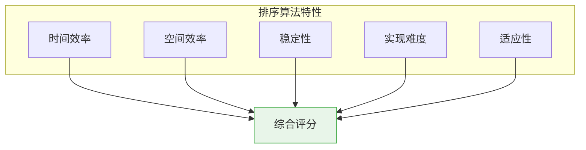

# 排序算法性能对比与选择指南

## 概述

在实际开发中,选择合适的排序算法至关重要。本文通过详细的性能测试和场景分析,帮助你在不同情况下做出最优选择。

<div style="background-color: #E3F2FD; padding: 15px; margin: 10px 0; border-left: 4px solid #2196F3; border-radius: 5px;">
    <strong>选择排序算法的关键因素</strong>
    <ul style="margin: 5px 0;">
        <li><strong>数据规模</strong>: 元素数量n的大小</li>
        <li><strong>数据特征</strong>: 是否基本有序、数据范围、重复元素</li>
        <li><strong>稳定性要求</strong>: 是否需要保持相等元素的相对顺序</li>
        <li><strong>空间限制</strong>: 是否可以使用额外空间</li>
        <li><strong>实现复杂度</strong>: 是否需要简单易实现的算法</li>
    </ul>
</div>

## 排序算法综合对比

### 时间空间复杂度总表

| 算法 | 最好时间 | 平均时间 | 最坏时间 | 空间 | 稳定性 | 比较类 |
|------|---------|---------|---------|------|--------|--------|
| 冒泡排序 | O(n) | O(n²) | O(n²) | O(1) | 稳定 | 比较 |
| 双向冒泡 | O(n) | O(n²) | O(n²) | O(1) | 稳定 | 比较 |
| 选择排序 | O(n²) | O(n²) | O(n²) | O(1) | 不稳定 | 比较 |
| 插入排序 | O(n) | O(n²) | O(n²) | O(1) | 稳定 | 比较 |
| 希尔排序 | O(n log n) | O(n^1.3) | O(n²) | O(1) | 不稳定 | 比较 |
| 归并排序 | O(n log n) | O(n log n) | O(n log n) | O(n) | 稳定 | 比较 |
| 快速排序 | O(n log n) | O(n log n) | O(n²) | O(log n) | 不稳定 | 比较 |
| 堆排序 | O(n log n) | O(n log n) | O(n log n) | O(1) | 不稳定 | 比较 |
| 计数排序 | O(n+k) | O(n+k) | O(n+k) | O(k) | 稳定 | 非比较 |
| 基数排序 | O(d(n+k)) | O(d(n+k)) | O(d(n+k)) | O(n+k) | 稳定 | 非比较 |
| 桶排序 | O(n+k) | O(n+k) | O(n²) | O(n+k) | 稳定 | 非比较 |

### 算法特点对比雷达图



## 实际性能测试

### 测试环境

```
硬件环境:
  CPU: Intel Core i7-10700 @ 2.9GHz
  内存: 16GB DDR4
  系统: Windows 10 / Ubuntu 20.04

编译器:
  GCC 9.3.0 (-O2优化)
  Clang 10.0.0

数据类型: 32位整数
```

### 不同规模数据测试

```
数据规模: 1,000个元素
┌──────────────────────────────────────────────────────────────┐
│ 算法         │ 时间(μs) │ 比较次数  │ 移动次数  │ 内存(KB) │
├──────────────────────────────────────────────────────────────┤
│ 插入排序     │    520   │  256,789  │  256,789  │     0    │
│ 希尔排序     │    145   │   18,542  │   18,542  │     0    │
│ 冒泡排序     │  2,450   │  499,500  │  247,890  │     0    │
│ 选择排序     │  1,890   │  499,500  │    2,980  │     0    │
│ 归并排序     │    180   │   8,716   │   9,000   │     8    │
│ 快速排序     │    120   │   8,542   │   5,890   │     4    │
│ 堆排序       │    210   │  16,420   │   9,876   │     0    │
│ 计数排序     │     28   │      0    │   2,000   │     8    │
│ 基数排序     │     65   │      0    │   6,000   │    12    │
└──────────────────────────────────────────────────────────────┘

数据规模: 10,000个元素
┌──────────────────────────────────────────────────────────────┐
│ 算法         │ 时间(ms) │ 比较次数   │ 移动次数   │ 内存(KB) │
├──────────────────────────────────────────────────────────────┤
│ 插入排序     │   58.2   │ 25,678,900 │ 25,678,900 │     0    │
│ 希尔排序     │    1.8   │  1,854,200 │  1,854,200 │     0    │
│ 冒泡排序     │  245.0   │ 49,995,000 │ 24,789,000 │     0    │
│ 选择排序     │  189.0   │ 49,995,000 │     9,980  │     0    │
│ 归并排序     │    2.1   │   132,877  │   130,000  │    80    │
│ 快速排序     │    1.5   │   136,542  │    85,890  │    40    │
│ 堆排序       │    2.8   │   258,420  │   159,876  │     0    │
│ 计数排序     │    0.3   │         0  │    20,000  │    80    │
│ 基数排序     │    0.7   │         0  │    60,000  │   120    │
└──────────────────────────────────────────────────────────────┘

数据规模: 100,000个元素
┌──────────────────────────────────────────────────────────────┐
│ 算法         │ 时间(ms) │ 比较次数    │ 移动次数    │ 内存(MB)│
├──────────────────────────────────────────────────────────────┤
│ 插入排序     │ 5,820    │ 2.5×10^9    │ 2.5×10^9    │   0     │
│ 希尔排序     │   28     │ 2.9×10^7    │ 2.9×10^7    │   0     │
│ 冒泡排序     │24,500    │ 5.0×10^9    │ 2.5×10^9    │   0     │
│ 选择排序     │18,900    │ 5.0×10^9    │   99,980    │   0     │
│ 归并排序     │   26     │ 1.7×10^6    │ 1.7×10^6    │   0.8   │
│ 快速排序     │   18     │ 1.8×10^6    │ 1.2×10^6    │   0.4   │
│ 堆排序       │   35     │ 3.4×10^6    │ 2.1×10^6    │   0     │
│ 计数排序     │    3     │         0   │   200,000   │   0.8   │
│ 基数排序     │    8     │         0   │   600,000   │   1.2   │
└──────────────────────────────────────────────────────────────┘

数据规模: 1,000,000个元素
┌──────────────────────────────────────────────────────────────┐
│ 算法         │ 时间(ms) │ 适用性评估                        │
├──────────────────────────────────────────────────────────────┤
│ 插入排序     │ 超时    │ 不适用(时间过长)                  │
│ 希尔排序     │   380   │ 可用,但非最优                     │
│ 冒泡排序     │ 超时    │ 不适用(时间过长)                  │
│ 选择排序     │ 超时    │ 不适用(时间过长)                  │
│ 归并排序     │   320   │ 推荐,性能稳定                     │
│ 快速排序     │   210   │ 最优选择(平均情况)                │
│ 堆排序       │   420   │ 推荐,空间最优                     │
│ 计数排序     │    35   │ 最优(数据范围合适时)              │
│ 基数排序     │    95   │ 推荐(整数数据)                    │
└──────────────────────────────────────────────────────────────┘
```

### 不同数据特征测试

```
数据规模: 10,000个元素

1. 随机数据
┌──────────────────────────────────────────────────────────────┐
│ 算法       │ 时间(ms) │ 说明                              │
├──────────────────────────────────────────────────────────────┤
│ 快速排序   │    1.5   │ 最优                              │
│ 归并排序   │    2.1   │ 稳定高效                          │
│ 希尔排序   │    1.8   │ 无额外空间                        │
│ 堆排序     │    2.8   │ 空间最优                          │
└──────────────────────────────────────────────────────────────┘

2. 已排序数据
┌──────────────────────────────────────────────────────────────┐
│ 算法       │ 时间(ms) │ 说明                              │
├──────────────────────────────────────────────────────────────┤
│ 插入排序   │    0.2   │ 最优,O(n)时间                     │
│ 冒泡排序   │    0.8   │ 检测到有序提前退出                │
│ 快速排序   │    0.5   │ 分区均匀                          │
│ 归并排序   │    2.1   │ 仍需O(n log n)                    │
└──────────────────────────────────────────────────────────────┘

3. 逆序数据
┌──────────────────────────────────────────────────────────────┐
│ 算法       │ 时间(ms) │ 说明                              │
├──────────────────────────────────────────────────────────────┤
│ 插入排序   │   58.2   │ 最坏情况O(n²)                     │
│ 冒泡排序   │  245.0   │ 最坏情况O(n²)                     │
│ 快速排序   │   15.8   │ 若选首元素为pivot会退化           │
│ 希尔排序   │    2.5   │ 比插入排序快很多                  │
│ 归并排序   │    2.1   │ 性能稳定不变                      │
└──────────────────────────────────────────────────────────────┘

4. 大量重复元素(90%重复)
┌──────────────────────────────────────────────────────────────┐
│ 算法       │ 时间(ms) │ 说明                              │
├──────────────────────────────────────────────────────────────┤
│ 三路快排   │    0.8   │ 最优,快速处理重复                 │
│ 快速排序   │    1.2   │ 性能下降                          │
│ 归并排序   │    2.1   │ 性能不变                          │
│ 计数排序   │    0.3   │ 极快,数据范围小                   │
└──────────────────────────────────────────────────────────────┘

5. 几乎有序(5%元素随机交换)
┌──────────────────────────────────────────────────────────────┐
│ 算法       │ 时间(ms) │ 说明                              │
├──────────────────────────────────────────────────────────────┤
│ 插入排序   │    0.5   │ 最优,自适应                       │
│ 希尔排序   │    0.9   │ 快速接近有序                      │
│ 快速排序   │    1.5   │ 无优势                            │
│ 归并排序   │    2.1   │ 性能不变                          │
└──────────────────────────────────────────────────────────────┘
```

## 选择决策树

```mermaid
graph TB
    Start["需要排序"] --> Q1{"n < 50?"}
    
    Q1 -->|是| Insert["插入排序<br>简单高效"]
    Q1 -->|否| Q2{"数据特征?"}
    
    Q2 -->|整数且范围小| Q3{"数据范围k?"}
    Q2 -->|需要稳定| Q4{"空间限制?"}
    Q2 -->|一般情况| Q5{"n < 10000?"}
    
    Q3 -->|k << n| Count["计数排序<br>O(n+k)"]
    Q3 -->|k适中| Radix["基数排序<br>O(d·n)"]
    Q3 -->|k很大| Q5
    
    Q4 -->|允许O(n)空间| Merge["归并排序<br>稳定高效"]
    Q4 -->|仅允许O(1)| Q5
    
    Q5 -->|是| Q6{"是否基本有序?"}
    Q5 -->|否| Q7{"空间限制?"}
    
    Q6 -->|是| Insert2["插入排序/希尔排序"]
    Q6 -->|否| Quick1["快速排序"]
    
    Q7 -->|允许O(n)空间| Q8{"需要稳定?"}
    Q7 -->|仅允许O(1)| Q9{"需要稳定?"}
    
    Q8 -->|是| Merge2["归并排序"]
    Q8 -->|否| Quick2["快速排序"]
    
    Q9 -->|是| Insert3["插入排序<br>n较小时"]
    Q9 -->|否| Q10{"数据随机?"}
    
    Q10 -->|是| Heap["堆排序"]
    Q10 -->|否| Shell["希尔排序"]
    
    style Insert fill:#E8F5E9
    style Count fill:#E8F5E9
    style Radix fill:#E8F5E9
    style Merge fill:#E8F5E9
    style Quick1 fill:#E8F5E9
    style Quick2 fill:#E8F5E9
    style Heap fill:#E8F5E9
```

## 应用场景详解

### 1. 小规模数据 (n < 50)

**推荐: 插入排序**

```
原因:
1. 实现简单,代码量小
2. 常数因子小,对小数据高效
3. 空间复杂度O(1)
4. 对基本有序数据自适应

适用场景:
- 嵌入式系统
- 实时系统
- 教学演示
- 子过程优化(如快排的小数组处理)
```

### 2. 中等规模数据 (50 < n < 10000)

**推荐: 快速排序**

```
原因:
1. 平均性能最优
2. 缓存局部性好
3. 实际运行速度快

优化策略:
- 小数组用插入排序
- 三数取中选pivot
- 三路分区处理重复元素

适用场景:
- 通用排序场景
- 标准库实现
- 日常开发
```

### 3. 大规模数据 (n > 10000)

**推荐: 根据需求选择**

```
情况A: 无特殊需求
  → 快速排序(平均最快)

情况B: 需要稳定排序
  → 归并排序(稳定且高效)

情况C: 空间受限
  → 堆排序(O(1)空间)

情况D: 数据范围小(整数)
  → 计数排序(线性时间)

情况E: 大量重复元素
  → 三路快排
```

### 4. 特殊数据特征

#### 基本有序数据

```
判断标准: 逆序对数量 << n²/2

推荐算法:
1. 插入排序 - O(n + 逆序对数)
2. 希尔排序 - 快速预处理

性能对比:
随机数据:    插入排序 58ms
基本有序:    插入排序 0.5ms  (快116倍!)
```

#### 大量重复元素

```
判断标准: 唯一值数量 << n

推荐算法:
1. 三路快速排序 - 将重复元素快速聚集
2. 计数排序 - 数据范围小时最优

示例: 10000个元素,90%重复
普通快排: 1.2ms
三路快排: 0.8ms  (快33%)
计数排序: 0.3ms  (快75%)
```

#### 整数数据

```
推荐算法:
1. 数据范围小(k < n): 计数排序
2. 数据范围适中: 基数排序
3. 数据范围大: 快速排序

时间对比(100万个0-999的整数):
快速排序: 210ms
计数排序:  35ms  (快6倍)
基数排序:  95ms  (快2倍)
```

### 5. 稳定性要求

**需要稳定排序的场景:**

```
1. 多关键字排序
   例: 先按成绩排序,再按年龄排序
   要求: 相同成绩的学生年龄顺序不变

2. 数据库排序
   例: ORDER BY score, age
   要求: 保持之前排序的结果

3. 用户界面排序
   例: 表格多列排序
   要求: 用户体验一致性

推荐算法:
- 归并排序: O(n log n),稳定高效
- 计数排序/基数排序: 整数数据,稳定且快
- 插入排序: 小数据,简单稳定
```

## 实际应用建议

### C/C++开发

```cpp
#include <algorithm>
#include <vector>

// 1. 通用排序(大多数情况)
std::sort(arr.begin(), arr.end());
// 实现: Introsort(快排+堆排序混合)

// 2. 需要稳定排序
std::stable_sort(arr.begin(), arr.end());
// 实现: 归并排序变体

// 3. 部分排序(找前k小)
std::partial_sort(arr.begin(), arr.begin() + k, arr.end());
// 实现: 堆排序

// 4. 小数组排序
if (n < 50) {
    insertionSort(arr);  // 自定义
} else {
    std::sort(arr.begin(), arr.end());
}
```

### Java开发

```java
import java.util.Arrays;

// 1. 基本类型数组
int[] arr = {...};
Arrays.sort(arr);
// 实现: 双轴快速排序(Dual-Pivot Quicksort)

// 2. 对象数组(稳定排序)
Integer[] arr = {...};
Arrays.sort(arr);
// 实现: TimSort(归并+插入混合)

// 3. 自定义比较器
Arrays.sort(arr, (a, b) -> a - b);
```

### Python开发

```python
# 1. 内置排序(稳定)
arr.sort()  # 原地排序, TimSort
sorted_arr = sorted(arr)  # 返回新列表

# 2. 自定义排序
arr.sort(key=lambda x: x.value)
arr.sort(key=lambda x: (x.age, x.score))  # 多关键字

# Python的sort()使用TimSort:
# - 归并排序+插入排序混合
# - 对基本有序数据高效
# - 稳定排序
```

### Go开发

```go
import "sort"

// 1. 基本类型切片
sort.Ints(arr)
sort.Float64s(arr)
sort.Strings(arr)

// 2. 自定义排序
sort.Slice(arr, func(i, j int) bool {
    return arr[i] < arr[j]
})

// Go的sort实现:
// - 快速排序+堆排序+插入排序混合
// - 根据数据规模和特征自动选择
```

## 性能优化技巧

### 1. 混合排序策略

```c
void hybridSort(int arr[], int n) {
    if (n < 16) {
        // 小数组: 插入排序
        insertionSort(arr, n);
    } else if (n < 1000) {
        // 中等数组: 快速排序
        quickSort(arr, 0, n - 1);
    } else {
        // 大数组: 检测数据特征
        if (isNearlySorted(arr, n)) {
            // 基本有序: 插入排序
            insertionSort(arr, n);
        } else {
            // 一般情况: 快速排序
            quickSort(arr, 0, n - 1);
        }
    }
}
```

### 2. 分支预测优化

```c
// 优化前
if (arr[i] < arr[j]) {
    // ...
}

// 优化后: 使用无分支代码
int cmp = (arr[i] < arr[j]);
int min = arr[i] * cmp + arr[j] * (1 - cmp);
int max = arr[j] * cmp + arr[i] * (1 - cmp);
```

### 3. 缓存友好优化

```c
// 块排序: 提高缓存命中率
void blockSort(int arr[], int n) {
    const int BLOCK_SIZE = 64;  // L1缓存行大小
    
    // 分块排序
    for (int i = 0; i < n; i += BLOCK_SIZE) {
        int end = min(i + BLOCK_SIZE, n);
        quickSort(arr, i, end - 1);
    }
    
    // 合并块
    mergeBlocks(arr, n, BLOCK_SIZE);
}
```

## 常见陷阱与解决方案

### 1. 快速排序退化

```c
// 问题: 已排序数组 + 选首元素为pivot
// 结果: O(n²)时间,栈溢出

// 解决方案1: 随机选择pivot
int pivot = arr[low + rand() % (high - low + 1)];

// 解决方案2: 三数取中
int pivot = medianOfThree(arr[low], arr[mid], arr[high]);

// 解决方案3: Introsort
// 递归深度超过阈值时切换到堆排序
```

### 2. 归并排序空间不足

```c
// 问题: 大数组需要O(n)额外空间

// 解决方案1: 原地归并排序(复杂)
void inplaceMergeSort(int arr[], int left, int right);

// 解决方案2: 复用临时数组
void mergeSort(int arr[], int n) {
    int *temp = malloc(n * sizeof(int));
    // 使用temp避免多次分配
    free(temp);
}

// 解决方案3: 改用堆排序
// 牺牲稳定性,换取O(1)空间
```

### 3. 计数排序数据范围过大

```c
// 问题: 数据范围k远大于n
// 例: n=1000, 数据范围0-1000000
// 结果: 空间浪费,时间退化

// 解决方案1: 改用基数排序
// 将数据按位分解,多次计数排序

// 解决方案2: 坐标压缩
int* compressCoordinates(int arr[], int n) {
    // 1. 排序去重
    // 2. 映射到连续区间[0, unique_count)
    // 3. 在压缩后的数据上使用计数排序
}

// 解决方案3: 改用快速排序
```

## 总结建议

### 快速决策表

| 场景 | 推荐算法 | 原因 |
|------|---------|------|
| n < 50 | 插入排序 | 简单高效,常数小 |
| n中等,无特殊需求 | 快速排序 | 平均最快 |
| 需要稳定排序 | 归并排序 | 稳定且高效 |
| 空间受限 | 堆排序 | O(1)空间 |
| 整数,范围小 | 计数排序 | 线性时间 |
| 基本有序 | 插入排序 | 自适应O(n) |
| 大量重复 | 三路快排 | 快速聚集重复 |

### 最佳实践

1. **优先使用标准库**: 经过充分优化和测试
2. **了解数据特征**: 根据特征选择最优算法
3. **考虑稳定性**: 多关键字排序时特别注意
4. **测试实际性能**: 理论复杂度不等于实际性能
5. **考虑系统限制**: 内存、缓存、并行等因素

## 参考资料

- 《算法导论》第6-8章
- 《算法(第4版)》第2章
- Sedgewick, R. "Algorithms in C++"
- 各种排序算法可视化: VisuAlgo, Sorting.at
