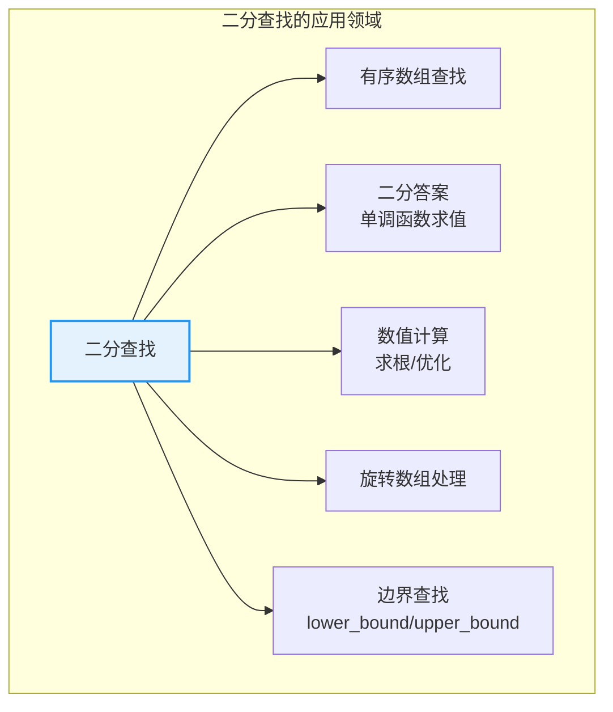
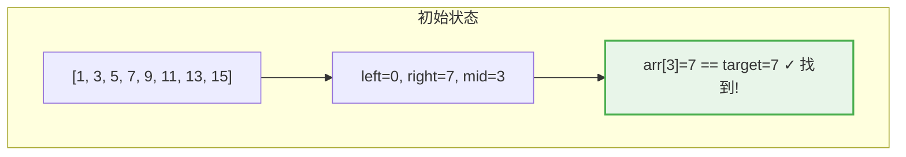
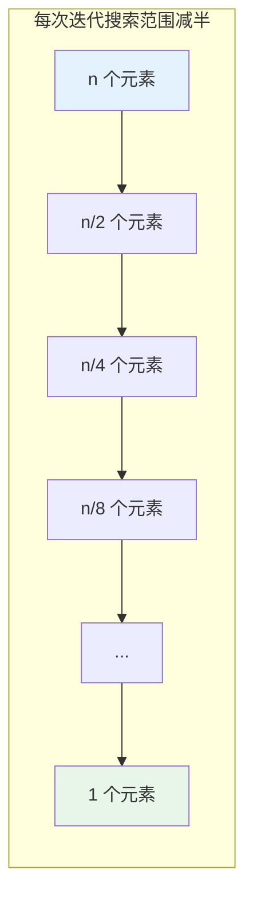
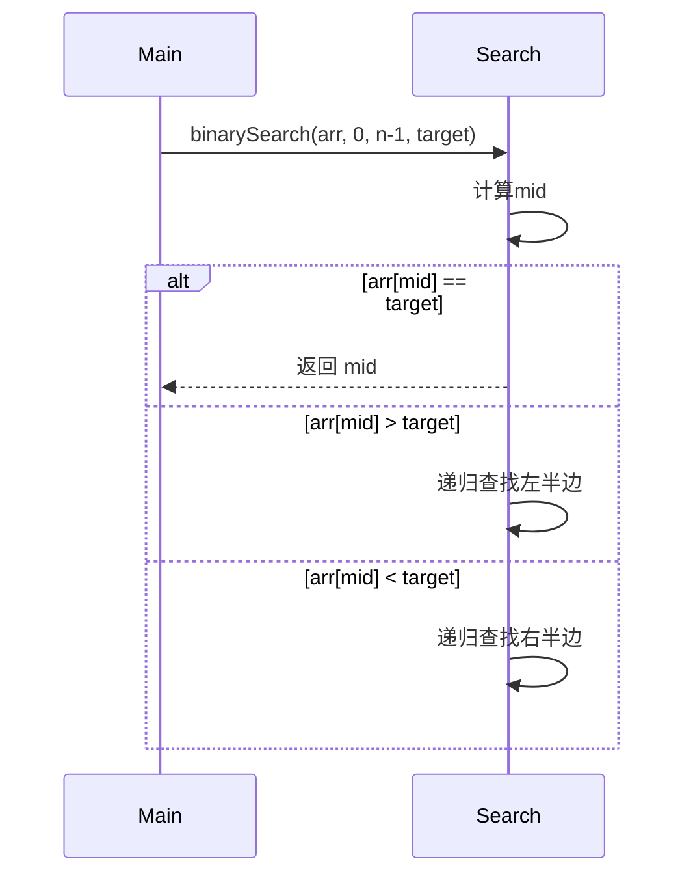
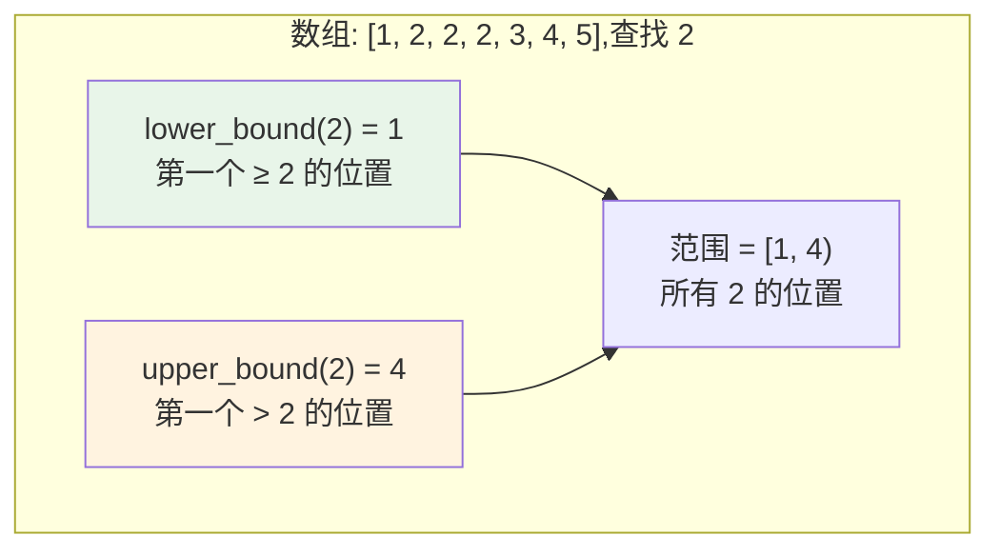
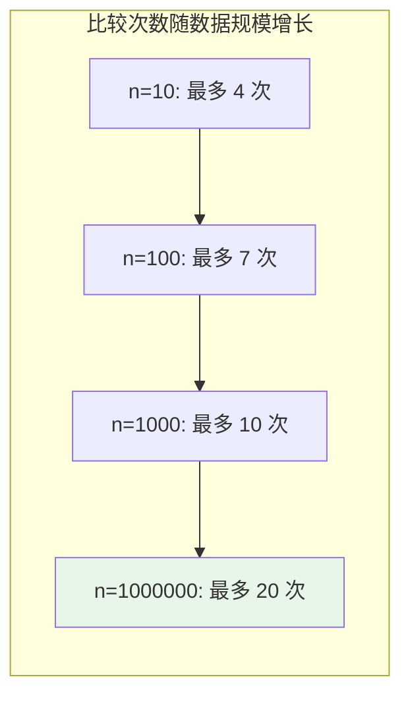

# 二分查找

## 概述

二分查找(Binary Search)是一种在**有序数组**中查找目标元素的高效算法。通过不断将搜索范围减半,实现对数级别的时间复杂度 **O(log n)**,是计算机科学中最经典的算法之一。

<div style="background-color: #E3F2FD; border-left: 4px solid #2196F3; padding: 12px; margin: 10px 0;">
<strong>核心思想:</strong>二分查找利用数组的<strong>有序性</strong>,每次比较中间元素,将搜索范围缩小一半。就像查字典时,先翻到中间,判断目标在左半边还是右半边,然后继续在该半边查找。
</div>

### 二分查找的重要性

```
查找效率对比(n = 1,000,000):

顺序查找: O(n) → 1,000,000 次比较
二分查找: O(log n) → 20 次比较

提升 50,000 倍!
```



## 二分查找特点

| 特点 | 说明 | 影响 |
|------|------|------|
| **有序前提** | 要求数组有序 | 预处理或维护有序性 |
| **高效查找** | O(log n) 时间复杂度 | 大规模数据高效 |
| **跳跃访问** | 非连续内存访问 | 缓存不友好 |
| **边界处理** | 整数溢出、边界条件 | 容易出错 |

## 核心原理

### 二分查找过程

```mermaid
flowchart TB
    A["开始查找"] --> B["计算中间位置<br/>mid = left + (right-left)/2"]
    B --> C{arr[mid] == target?}
    C -->|是| D["找到! 返回 mid"]
    C -->|否| E{arr[mid] < target?}
    E -->|是| F["目标在右半边<br/>left = mid + 1"]
    E -->|否| G["目标在左半边<br/>right = mid - 1"]
    F --> H{left <= right?}
    G --> H
    H -->|是| B
    H -->|否| I["未找到, 返回 -1"]
    
    style D fill:#E8F5E9,stroke:#4CAF50,stroke-width:2px
    style I fill:#FFCDD2,stroke:#F44336,stroke-width:2px
```

### 查找过程可视化

**示例:在 [1, 3, 5, 7, 9, 11, 13, 15] 中查找 7**



**示例:在 [1, 3, 5, 7, 9, 11, 13, 15] 中查找 11**

```
步骤1: left=0, right=7, mid=3
       arr[3]=7 < 11
       搜索范围: [9, 11, 13, 15] (右半边)
       
       [1, 3, 5, 7 | 9, 11, 13, 15]
                     ↑___________↑
                     新搜索范围

步骤2: left=4, right=7, mid=5
       arr[5]=11 == 11 ✓ 找到!
       
       [9, 11, 13, 15]
            ↑
          找到!

总共 2 次比较
```

### 搜索范围变化



```
搜索次数分析:

第1次: n 个元素
第2次: n/2 个元素
第3次: n/4 个元素
...
第k次: n/2^(k-1) 个元素

当 n/2^(k-1) = 1 时:
k = log₂n + 1

时间复杂度: O(log n)
```

## 基本实现

### 迭代版本(推荐)

=== "C"
    ```c
    int binarySearch(int arr[], int n, int target) {
        int left = 0, right = n - 1;
        
        while (left <= right) {
            int mid = left + (right - left) / 2;  // 避免溢出
            
            if (arr[mid] == target) return mid;   // 找到
            if (arr[mid] < target) 
                left = mid + 1;                    // 搜索右半边
            else 
                right = mid - 1;                   // 搜索左半边
        }
        
        return -1;  // 未找到
    }
    ```

=== "C++"
    ```cpp
    #include <vector>
    using namespace std;

    int binarySearch(const vector<int>& arr, int target) {
        int left = 0, right = arr.size() - 1;
        
        while (left <= right) {
            int mid = left + (right - left) / 2;
            
            if (arr[mid] == target) return mid;
            if (arr[mid] < target)
                left = mid + 1;
            else
                right = mid - 1;
        }
        
        return -1;
    }
    ```

=== "Python"
    ```python
    def binary_search(arr, target):
        """二分查找 - 迭代版本"""
        left, right = 0, len(arr) - 1
        
        while left <= right:
            mid = left + (right - left) // 2
            
            if arr[mid] == target:
                return mid
            elif arr[mid] < target:
                left = mid + 1
            else:
                right = mid - 1
        
        return -1
    ```

=== "Java"
    ```java
    public class BinarySearch {
        public static int binarySearch(int[] arr, int target) {
            int left = 0, right = arr.length - 1;
            
            while (left <= right) {
                int mid = left + (right - left) / 2;
                
                if (arr[mid] == target) return mid;
                if (arr[mid] < target)
                    left = mid + 1;
                else
                    right = mid - 1;
            }
            
            return -1;
        }
    }
    ```

=== "Go"
    ```go
    func binarySearch(arr []int, target int) int {
        left, right := 0, len(arr)-1
        
        for left <= right {
            mid := left + (right-left)/2
            
            if arr[mid] == target {
                return mid
            }
            if arr[mid] < target {
                left = mid + 1
            } else {
                right = mid - 1
            }
        }
        
        return -1
    }
    ```

=== "Rust"
    ```rust
    fn binary_search(arr: &[i32], target: i32) -> Option<usize> {
        let mut left = 0;
        let mut right = arr.len();
        
        while left < right {
            let mid = left + (right - left) / 2;
            
            if arr[mid] == target {
                return Some(mid);
            } else if arr[mid] < target {
                left = mid + 1;
            } else {
                right = mid;
            }
        }
        
        None
    }
    ```

### 递归版本



=== "C"
    ```c
    int binarySearchRecursive(int arr[], int left, int right, int target) {
        // 基础情况:搜索范围为空
        if (left > right) return -1;
        
        // 计算中间位置(避免溢出)
        int mid = left + (right - left) / 2;
        
        if (arr[mid] == target) return mid;           // 找到
        if (arr[mid] > target)                        // 目标在左半边
            return binarySearchRecursive(arr, left, mid - 1, target);
        return binarySearchRecursive(arr, mid + 1, right, target);  // 目标在右半边
    }
    ```

=== "C++"
    ```cpp
    int binarySearchRecursive(const vector<int>& arr, int left, int right, int target) {
        if (left > right) return -1;
        
        int mid = left + (right - left) / 2;
        
        if (arr[mid] == target) return mid;
        if (arr[mid] > target)
            return binarySearchRecursive(arr, left, mid - 1, target);
        return binarySearchRecursive(arr, mid + 1, right, target);
    }
    ```

=== "Python"
    ```python
    def binary_search_recursive(arr, left, right, target):
        """二分查找 - 递归版本"""
        if left > right:
            return -1
        
        mid = left + (right - left) // 2
        
        if arr[mid] == target:
            return mid
        elif arr[mid] > target:
            return binary_search_recursive(arr, left, mid - 1, target)
        else:
            return binary_search_recursive(arr, mid + 1, right, target)
    ```

=== "Java"
    ```java
    public static int binarySearchRecursive(int[] arr, int left, int right, int target) {
        if (left > right) return -1;
        
        int mid = left + (right - left) / 2;
        
        if (arr[mid] == target) return mid;
        if (arr[mid] > target)
            return binarySearchRecursive(arr, left, mid - 1, target);
        return binarySearchRecursive(arr, mid + 1, right, target);
    }
    ```

=== "Go"
    ```go
    func binarySearchRecursive(arr []int, left, right, target int) int {
        if left > right {
            return -1
        }
        
        mid := left + (right-left)/2
        
        if arr[mid] == target {
            return mid
        }
        if arr[mid] > target {
            return binarySearchRecursive(arr, left, mid-1, target)
        }
        return binarySearchRecursive(arr, mid+1, right, target)
    }
    ```

=== "Rust"
    ```rust
    fn binary_search_recursive(arr: &[i32], left: usize, right: usize, target: i32) -> Option<usize> {
        if left > right {
            return None;
        }
        
        let mid = left + (right - left) / 2;
        
        if arr[mid] == target {
            Some(mid)
        } else if arr[mid] > target && mid > 0 {
            binary_search_recursive(arr, left, mid - 1, target)
        } else if arr[mid] < target {
            binary_search_recursive(arr, mid + 1, right, target)
        } else {
            None
        }
    }
    ```

## 查找边界

在有序数组中查找特定边界是二分查找的重要应用。

### 边界类型



### lower_bound(查找左边界)

查找第一个 **≥ target** 的位置:

```
数组: [1, 2, 2, 2, 3, 4, 5]
索引:  0  1  2  3  4  5  6

lower_bound(2) = 1  ← 第一个 ≥ 2 的位置
lower_bound(3) = 4  ← 第一个 ≥ 3 的位置
lower_bound(6) = 7  ← 不存在,返回数组长度
```

=== "C"
    ```c
    int lowerBound(int arr[], int n, int target) {
        int left = 0, right = n;  // 注意: right = n,不是 n-1
        
        while (left < right) {    // 注意: < 而不是 <=
            int mid = left + (right - left) / 2;
            
            if (arr[mid] < target)
                left = mid + 1;
            else
                right = mid;      // 注意: 不是 mid - 1
        }
        
        return left;  // 或 right,两者相等
    }
    ```

=== "C++"
    ```cpp
    int lowerBound(const vector<int>& arr, int target) {
        int left = 0, right = arr.size();
        
        while (left < right) {
            int mid = left + (right - left) / 2;
            
            if (arr[mid] < target)
                left = mid + 1;
            else
                right = mid;
        }
        
        return left;
    }
    ```

=== "Python"
    ```python
    def lower_bound(arr, target):
        """查找第一个 >= target 的位置"""
        left, right = 0, len(arr)
        
        while left < right:
            mid = left + (right - left) // 2
            
            if arr[mid] < target:
                left = mid + 1
            else:
                right = mid
        
        return left
    ```

=== "Java"
    ```java
    public static int lowerBound(int[] arr, int target) {
        int left = 0, right = arr.length;
        
        while (left < right) {
            int mid = left + (right - left) / 2;
            
            if (arr[mid] < target)
                left = mid + 1;
            else
                right = mid;
        }
        
        return left;
    }
    ```

=== "Go"
    ```go
    func lowerBound(arr []int, target int) int {
        left, right := 0, len(arr)
        
        for left < right {
            mid := left + (right-left)/2
            
            if arr[mid] < target {
                left = mid + 1
            } else {
                right = mid
            }
        }
        
        return left
    }
    ```

=== "Rust"
    ```rust
    fn lower_bound(arr: &[i32], target: i32) -> usize {
        let mut left = 0;
        let mut right = arr.len();
        
        while left < right {
            let mid = left + (right - left) / 2;
            
            if arr[mid] < target {
                left = mid + 1;
            } else {
                right = mid;
            }
        }
        
        left
    }
    ```

### upper_bound(查找右边界)

查找第一个 **> target** 的位置:

=== "C"
    ```c
    int upperBound(int arr[], int n, int target) {
        int left = 0, right = n;
        
        while (left < right) {
            int mid = left + (right - left) / 2;
            
            if (arr[mid] <= target)
                left = mid + 1;
            else
                right = mid;
        }
        
        return left;
    }
    ```

=== "C++"
    ```cpp
    int upperBound(const vector<int>& arr, int target) {
        int left = 0, right = arr.size();
        
        while (left < right) {
            int mid = left + (right - left) / 2;
            
            if (arr[mid] <= target)
                left = mid + 1;
            else
                right = mid;
        }
        
        return left;
    }
    ```

=== "Python"
    ```python
    def upper_bound(arr, target):
        """查找第一个 > target 的位置"""
        left, right = 0, len(arr)
        
        while left < right:
            mid = left + (right - left) // 2
            
            if arr[mid] <= target:
                left = mid + 1
            else:
                right = mid
        
        return left
    ```

=== "Java"
    ```java
    public static int upperBound(int[] arr, int target) {
        int left = 0, right = arr.length;
        
        while (left < right) {
            int mid = left + (right - left) / 2;
            
            if (arr[mid] <= target)
                left = mid + 1;
            else
                right = mid;
        }
        
        return left;
    }
    ```

=== "Go"
    ```go
    func upperBound(arr []int, target int) int {
        left, right := 0, len(arr)
        
        for left < right {
            mid := left + (right-left)/2
            
            if arr[mid] <= target {
                left = mid + 1
            } else {
                right = mid
            }
        }
        
        return left
    }
    ```

=== "Rust"
    ```rust
    fn upper_bound(arr: &[i32], target: i32) -> usize {
        let mut left = 0;
        let mut right = arr.len();
        
        while left < right {
            let mid = left + (right - left) / 2;
            
            if arr[mid] <= target {
                left = mid + 1;
            } else {
                right = mid;
            }
        }
        
        left
    }
    ```

### 边界查找示例

```
数组: [1, 2, 2, 2, 3, 4, 5]
索引:  0  1  2  3  4  5  6

═══════════════════════════════════════════════════════════════
查找 target = 2
═══════════════════════════════════════════════════════════════

lower_bound(2) = 1  ← 第一个 ≥ 2
upper_bound(2) = 4  ← 第一个 > 2

所有 2 的范围: [lower_bound, upper_bound) = [1, 4)
2 的数量: upper_bound - lower_bound = 3

═══════════════════════════════════════════════════════════════
查找 target = 3
═══════════════════════════════════════════════════════════════

lower_bound(3) = 4  ← 第一个 ≥ 3
upper_bound(3) = 5  ← 第一个 > 3

只有一个 3,位置为 4
```

## 可视化演示

### 完整查找过程

```
在 [1, 3, 5, 7, 9, 11, 13, 15, 17, 19] 中查找 13

数组: [1, 3, 5, 7, 9, 11, 13, 15, 17, 19]
索引:  0  1  2  3  4   5   6   7   8   9

═══════════════════════════════════════════════════════════════
第1次迭代
═══════════════════════════════════════════════════════════════

left=0, right=9, mid=4
arr[4]=9 < 13,目标在右半边
left = mid + 1 = 5

搜索范围: [11, 13, 15, 17, 19]
           ↑_______________↑
           新搜索范围

═══════════════════════════════════════════════════════════════
第2次迭代
═══════════════════════════════════════════════════════════════

left=5, right=9, mid=7
arr[7]=15 > 13,目标在左半边
right = mid - 1 = 6

搜索范围: [11, 13]
           ↑___↑
           新搜索范围

═══════════════════════════════════════════════════════════════
第3次迭代
═══════════════════════════════════════════════════════════════

left=5, right=6, mid=5
arr[5]=11 < 13,目标在右半边
left = mid + 1 = 6

搜索范围: [13]
              ↑
           新搜索范围

═══════════════════════════════════════════════════════════════
第4次迭代
═══════════════════════════════════════════════════════════════

left=6, right=6, mid=6
arr[6]=13 == 13 ✓ 找到!

返回 6

总共 4 次比较,log₂(10) ≈ 3.32,符合预期
```

## C++ STL

```cpp
#include <algorithm>
#include <vector>

std::vector<int> arr = {1, 2, 3, 4, 5, 6, 7, 8};

// 基本二分查找
bool found = std::binary_search(arr.begin(), arr.end(), 5);
// found = true

// lower_bound: 第一个 ≥ 5 的位置
auto it1 = std::lower_bound(arr.begin(), arr.end(), 5);
int lower = it1 - arr.begin();  // lower = 4

// upper_bound: 第一个 > 5 的位置
auto it2 = std::upper_bound(arr.begin(), arr.end(), 5);
int upper = it2 - arr.begin();  // upper = 5

// 计算元素 5 的数量
int count = upper - lower;  // count = 1

// 查找范围
auto range = std::equal_range(arr.begin(), arr.end(), 5);
// range.first 是 lower_bound
// range.second 是 upper_bound
```

## 常见错误

### 1. 整数溢出

=== "C"
    ```c
    // ❌ 错误:当 left + right > INT_MAX 时溢出
    int mid = (left + right) / 2;
    
    // ✅ 正确:避免溢出
    int mid = left + (right - left) / 2;
    
    // ✅ 另一种正确写法
    int mid = left + ((right - left) >> 1);
    ```

=== "C++"
    ```cpp
    // ❌ 错误:可能溢出
    int mid = (left + right) / 2;
    
    // ✅ 正确:避免溢出
    int mid = left + (right - left) / 2;
    
    // ✅ 使用无符号右移
    int mid = left + ((right - left) >> 1);
    ```

=== "Python"
    ```python
    # Python 整数不会溢出,但推荐使用标准写法
    mid = left + (right - left) // 2
    ```

=== "Java"
    ```java
    // ❌ 错误:可能溢出
    int mid = (left + right) / 2;
    
    // ✅ 正确:避免溢出
    int mid = left + (right - left) / 2;
    
    // ✅ 使用无符号右移
    int mid = (left + right) >>> 1;
    ```

=== "Go"
    ```go
    // ✅ Go 推荐写法
    mid := left + (right-left)/2
    ```

=== "Rust"
    ```rust
    // ✅ Rust 推荐写法
    let mid = left + (right - left) / 2;
    ```

### 2. 死循环

```c
// ❌ 错误:可能死循环
while (left < right) {
    int mid = left + (right - left) / 2;  // 下取整
    if (arr[mid] < target) 
        left = mid;      // ← 可能死循环!当 left = mid 时
    else 
        right = mid;
}

// ✅ 正确:配合下取整,left = mid + 1
while (left < right) {
    int mid = left + (right - left) / 2;
    if (arr[mid] < target) 
        left = mid + 1;  // ✓
    else 
        right = mid;
}

// ✅ 正确:使用上取整,配合 left = mid
while (left < right) {
    int mid = left + (right - left + 1) / 2;  // 上取整
    if (arr[mid] > target) 
        right = mid - 1;
    else 
        left = mid;       // ✓
}
```

### 3. 边界条件

```c
// ❌ 可能漏掉最后一个元素
while (left < right) {  // 当 left == right 时退出
    ...
}
return arr[left];  // 必须检查 left 是否有效

// ✅ 使用 <= 包含所有情况
while (left <= right) {
    ...
}
return -1;  // 未找到
```

## 时间复杂度分析

| 情况 | 时间复杂度 | 说明 |
|------|-----------|------|
| **最好** | O(1) | 第一次就找到 |
| **平均** | O(log n) | 每次减半 |
| **最坏** | O(log n) | 搜索到最后一个元素 |



## 应用场景

| 应用场景 | 说明 | 复杂度 |
|---------|------|--------|
| **有序数组查找** | 基础应用 | O(log n) |
| **二分答案** | 单调函数求值 | O(log n × check) |
| **旋转数组** | 查找特定元素 | O(log n) |
| **数值计算** | 求根、优化问题 | O(log n × precision) |
| **边界查找** | lower_bound/upper_bound | O(log n) |
| **插入位置** | 查找应该插入的位置 | O(log n) |

## 参考资料

- 《算法导论》第4章:分治策略
