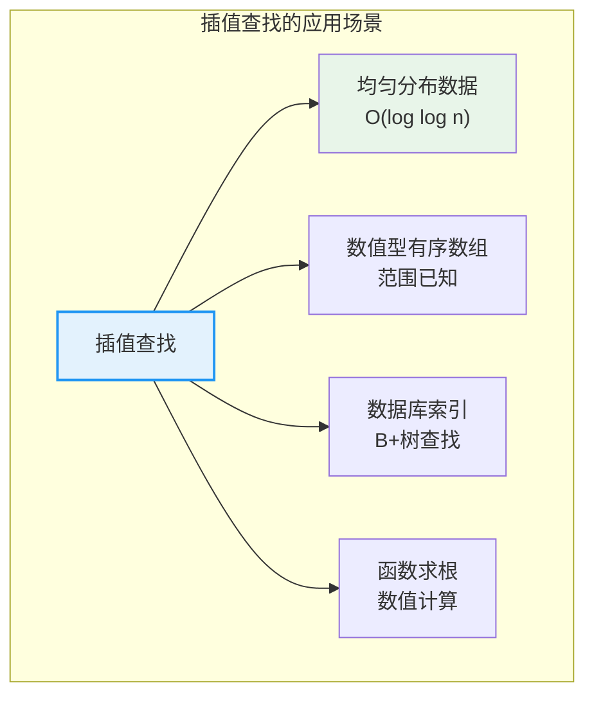
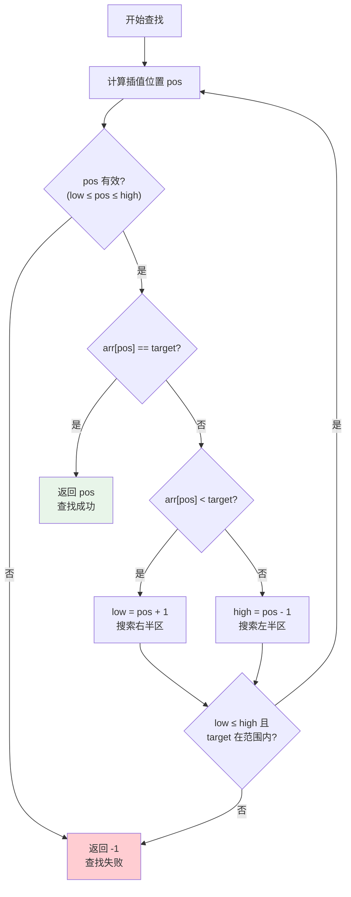
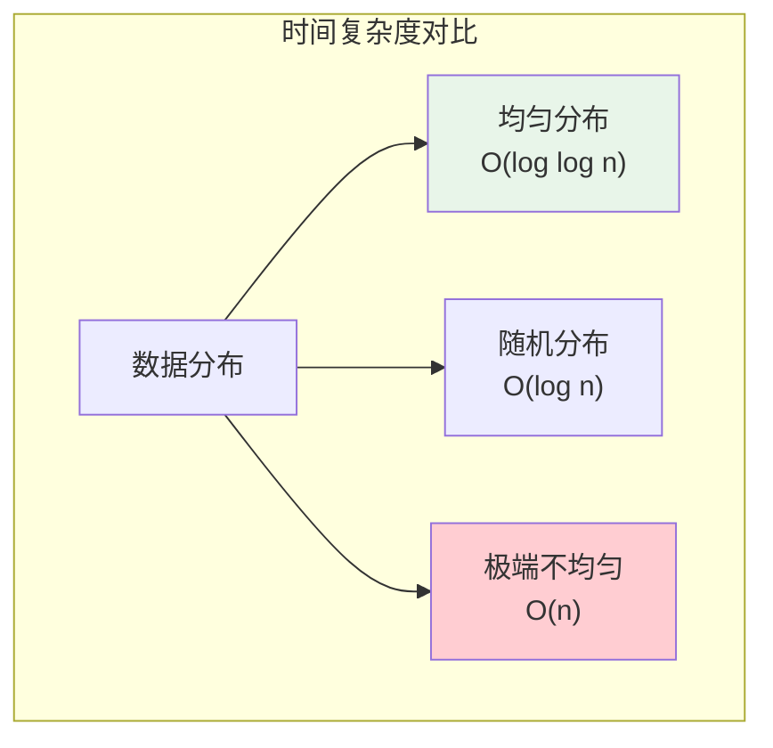
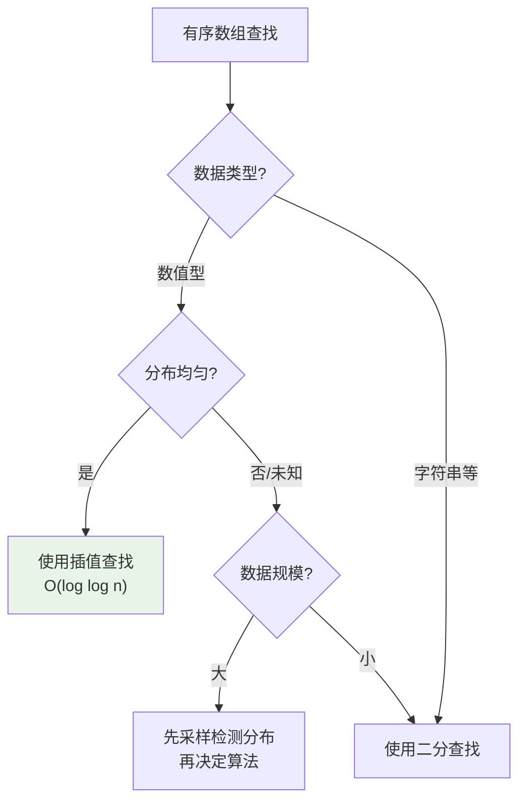

# 插值查找

## 概述

插值查找(Interpolation Search)是二分查找的改进版本,通过**估计元素位置**进行查找,适用于**均匀分布**的有序数据。其核心思想是:根据目标值在数组取值范围中的相对位置,估计其在数组中的索引位置。

<div style="background-color: #E3F2FD; border-left: 4px solid #2196F3; padding: 12px; margin: 10px 0;">
<strong>核心优势:</strong>在数据均匀分布时,插值查找的时间复杂度为 O(log log n),远优于二分查找的 O(log n)。一次查找可能直接命中目标!
</div>

### 插值查找的重要性



## 数学原理推导

### 线性插值公式

假设数组 `arr` 的元素服从均匀分布,目标值为 `target`,则可以建立如下比例关系:

```
目标值在数组范围中的相对位置 = 目标值在索引范围中的相对位置

(target - arr[low]) / (arr[high] - arr[low]) = (pos - low) / (high - low)
```

解这个方程,得到插值位置:

```
pos = low + (high - low) × (target - arr[low]) / (arr[high] - arr[low])
```

### 几何解释

```
数组值分布示意:

arr[low]                                    arr[high]
   |                                            |
   v                                            v
   ●────●────●────●────●────●────●────●────●────●
   |<------------ 数组索引范围 -------------->|
        low                                high

目标值 target 的位置估计:
   
   arr[low]        target                    arr[high]
      |              |                          |
      v              v                          v
      ●────●────●────★────●────●────●────●────●
      |<---- 已知范围 ---->|
      
插值公式:
pos = low + (high - low) × (target - arr[low]) / (arr[high] - arr[low])

即:pos ≈ low + 相对比例 × 区间长度
```

<div style="background-color: #E8F5E9; border-left: 4px solid #4CAF50; padding: 12px; margin: 10px 0;">
<strong>关键洞察:</strong>当数据均匀分布时,线性插值能准确估计目标位置;当数据分布不均匀时,估计误差较大,可能退化为 O(n)。
</div>

### 为什么均匀分布时效率更高?

```
均匀分布数据的查找过程:

数组: [10, 20, 30, 40, 50, 60, 70, 80, 90, 100]
目标: 70

二分查找:
第1次: mid = 4, arr[4] = 50 < 70 → 搜索右半区
第2次: mid = 7, arr[7] = 80 > 70 → 搜索左半区
第3次: mid = 5, arr[5] = 60 < 70 → 搜索右半区
第4次: mid = 6, arr[6] = 70 ✓

插值查找:
第1次: pos = 0 + 9 × (70-10)/(100-10) = 0 + 9 × 60/90 = 6
       arr[6] = 70 ✓
       
一次命中!
```

## 算法思想对比

### 二分查找 vs 插值查找


### 分割点选择策略

```
                    查找区间 [low, high]
                          |
          ┌───────────────┴───────────────┐
          │                               │
    二分查找                         插值查找
          │                               │
    mid = (low + high) / 2          pos = low + (high - low) × (target - arr[low]) / (arr[high] - arr[low])
          │                               │
    固定选择中点                     根据目标值自适应选择
          │                               │
    ┌─────┴─────┐                   ┌─────┴─────┐
    │           │                   │           │
  左半区     右半区              左半区     右半区
  [low,mid-1] [mid+1,high]       [low,pos-1] [pos+1,high]
```

## 算法演示

### 示例1:均匀分布数据

```
数组: [10, 20, 30, 40, 50, 60, 70, 80, 90, 100]
索引:   0   1   2   3   4   5   6   7   8   9
目标: 70

═══════════════════════════════════════════════════════════════
第1次查找
═══════════════════════════════════════════════════════════════

计算插值位置:
pos = low + (high - low) × (target - arr[low]) / (arr[high] - arr[low])
pos = 0 + (9 - 0) × (70 - 10) / (100 - 10)
pos = 0 + 9 × 60 / 90
pos = 6

数组状态:
[10, 20, 30, 40, 50, 60, 70, 80, 90, 100]
                       ↑
                     pos=6, arr[6]=70

比较: arr[6] = 70 == target ✓

查找成功!位置 = 6,查找次数 = 1
═══════════════════════════════════════════════════════════════
```

### 示例2:非均匀分布数据

```
数组: [1, 2, 3, 4, 5, 100, 200, 300, 400, 500]
索引:  0  1  2  3  4    5    6    7    8    9
目标: 4

═══════════════════════════════════════════════════════════════
第1次查找
═══════════════════════════════════════════════════════════════

pos = 0 + 9 × (4 - 1) / (500 - 1) = 0 + 9 × 3 / 499 ≈ 0

数组状态:
[1, 2, 3, 4, 5, 100, 200, 300, 400, 500]
 ↑
pos=0, arr[0]=1

比较: arr[0] = 1 < target = 4
更新: low = pos + 1 = 1

═══════════════════════════════════════════════════════════════
第2次查找
═══════════════════════════════════════════════════════════════

pos = 1 + 8 × (4 - 2) / (500 - 2) = 1 + 8 × 2 / 498 ≈ 1

数组状态:
[1, 2, 3, 4, 5, 100, 200, 300, 400, 500]
    ↑
   pos=1, arr[1]=2

比较: arr[1] = 2 < target = 4
更新: low = pos + 1 = 2

═══════════════════════════════════════════════════════════════
第3次查找
═══════════════════════════════════════════════════════════════

pos = 2 + 7 × (4 - 3) / (500 - 3) = 2 + 7 × 1 / 497 ≈ 2

数组状态:
[1, 2, 3, 4, 5, 100, 200, 300, 400, 500]
       ↑
      pos=2, arr[2]=3

比较: arr[2] = 3 < target = 4
更新: low = pos + 1 = 3

═══════════════════════════════════════════════════════════════
第4次查找
═══════════════════════════════════════════════════════════════

pos = 3 + 6 × (4 - 4) / (500 - 4) = 3 + 6 × 0 / 496 = 3

数组状态:
[1, 2, 3, 4, 5, 100, 200, 300, 400, 500]
          ↑
         pos=3, arr[3]=4

比较: arr[3] = 4 == target ✓

查找成功!位置 = 3,查找次数 = 4
═══════════════════════════════════════════════════════════════

注意:由于数据分布极不均匀,插值查找退化为接近线性查找!
```

### 查找过程可视化



## 基本实现

=== "C"
    ```c
    int interpolationSearch(int arr[], int n, int target) {
        int low = 0, high = n - 1;
        
        while (low <= high && target >= arr[low] && target <= arr[high]) {
            // 防止除零错误
            if (arr[high] == arr[low]) {
                return arr[low] == target ? low : -1;
            }
            
            // 计算插值位置(使用 long long 防止溢出)
            int pos = low + ((long long)(high - low) * (target - arr[low])) / 
                           (arr[high] - arr[low]);
            
            // 边界检查
            if (pos < low || pos > high) break;
            
            // 比较
            if (arr[pos] == target) {
                return pos;
            }
            
            // 更新搜索范围
            if (arr[pos] < target) {
                low = pos + 1;
            } else {
                high = pos - 1;
            }
        }
        
        return -1;
    }
    ```

=== "C++"
    ```cpp
    #include <vector>
    #include <algorithm>
    using namespace std;

    int interpolationSearch(const vector<int>& arr, int target) {
        if (arr.empty()) return -1;
        
        int low = 0, high = arr.size() - 1;
        
        while (low <= high && target >= arr[low] && target <= arr[high]) {
            if (arr[high] == arr[low]) {
                return arr[low] == target ? low : -1;
            }
            
            // 计算插值位置
            int pos = low + (long long)(high - low) * (target - arr[low]) / 
                           (arr[high] - arr[low]);
            
            // 限制在有效范围内
            pos = max(low, min(high, pos));
            
            if (arr[pos] == target) return pos;
            
            if (arr[pos] < target) low = pos + 1;
            else high = pos - 1;
        }
        
        return -1;
    }
    ```

=== "Python"
    ```python
    def interpolation_search(arr, target):
        """插值查找算法"""
        low, high = 0, len(arr) - 1
        
        while low <= high and arr[low] <= target <= arr[high]:
            # 防止除零错误
            if arr[high] == arr[low]:
                return low if arr[low] == target else -1
            
            # 计算插值位置
            pos = low + (high - low) * (target - arr[low]) // (arr[high] - arr[low])
            
            # 边界检查
            if pos < low or pos > high:
                break
            
            if arr[pos] == target:
                return pos
            elif arr[pos] < target:
                low = pos + 1
            else:
                high = pos - 1
        
        return -1
    ```

=== "Java"
    ```java
    public class InterpolationSearch {
        public static int interpolationSearch(int[] arr, int target) {
            int low = 0, high = arr.length - 1;
            
            while (low <= high && target >= arr[low] && target <= arr[high]) {
                if (arr[high] == arr[low]) {
                    return arr[low] == target ? low : -1;
                }
                
                // 计算插值位置(防止溢出)
                int pos = low + (int)((long)(high - low) * (target - arr[low]) / 
                                     (arr[high] - arr[low]));
                
                // 边界检查
                if (pos < low || pos > high) break;
                
                if (arr[pos] == target) return pos;
                
                if (arr[pos] < target) low = pos + 1;
                else high = pos - 1;
            }
            
            return -1;
        }
    }
    ```

=== "Go"
    ```go
    func interpolationSearch(arr []int, target int) int {
        low, high := 0, len(arr)-1
        
        for low <= high && target >= arr[low] && target <= arr[high] {
            if arr[high] == arr[low] {
                if arr[low] == target {
                    return low
                }
                return -1
            }
            
            // 计算插值位置
            pos := low + (high-low)*(target-arr[low])/(arr[high]-arr[low])
            
            // 边界检查
            if pos < low || pos > high {
                break
            }
            
            if arr[pos] == target {
                return pos
            }
            
            if arr[pos] < target {
                low = pos + 1
            } else {
                high = pos - 1
            }
        }
        
        return -1
    }
    ```

=== "Rust"
    ```rust
    fn interpolation_search(arr: &[i32], target: i32) -> Option<usize> {
        let mut low = 0;
        let mut high = arr.len() - 1;
        
        while low <= high && target >= arr[low] && target <= arr[high] {
            if arr[high] == arr[low] {
                return if arr[low] == target { Some(low) } else { None };
            }
            
            // 计算插值位置
            let pos = low + (high - low) * (target - arr[low]) as usize / 
                      (arr[high] - arr[low]) as usize;
            
            // 边界检查
            if pos < low || pos > high {
                break;
            }
            
            if arr[pos] == target {
                return Some(pos);
            }
            
            if arr[pos] < target {
                low = pos + 1;
            } else {
                high = pos - 1;
            }
        }
        
        None
    }
    ```

## 复杂度分析

### 时间复杂度



| 情况 | 时间复杂度 | 说明 |
|------|-----------|------|
| **最好** | O(1) | 目标值在估计位置 |
| **平均(均匀分布)** | O(log log n) | 数据均匀分布 |
| **平均(随机分布)** | O(log n) | 数据随机分布 |
| **最坏** | O(n) | 数据分布极度不均匀 |

### 空间复杂度

- **迭代实现**:O(1)
- **递归实现**:O(log n)(递归栈深度)

### 复杂度推导(均匀分布情况)

```
设 n 为数组大小,每次查找后区间缩小为原来的 1/√n

第1次: 区间大小 = n
第2次: 区间大小 = √n
第3次: 区间大小 = √(√n) = n^(1/4)
...
第k次: 区间大小 = n^(1/2^k)

当 n^(1/2^k) = 1 时停止:
1/2^k × log n = 0
2^k = log n
k = log(log n) = log log n

因此时间复杂度为 O(log log n)
```

## 二分查找 vs 插值查找

### 详细对比

| 特性 | 二分查找 | 插值查找 |
|------|---------|---------|
| **分割方式** | 固定中点 | 估计位置 |
| **中点计算** | `(low+high)/2` | `low + 比例×(high-low)` |
| **运算类型** | 加法、除法 | 加法、乘法、除法 |
| **平均时间** | O(log n) | O(log log n)(均匀) |
| **最坏时间** | O(log n) | O(n) |
| **数据要求** | 有序 | 有序 + 均匀分布更佳 |
| **稳定性** | 稳定 | 依赖数据分布 |
| **适用场景** | 通用有序数组 | 数值型、均匀分布数据 |

### 性能对比图

```
查找次数对比(n = 1000000):

数据类型           二分查找      插值查找
─────────────────────────────────────────
均匀分布              20           5
随机分布              20          12
指数分布              20          35
极端不均匀            20         500

注意:log₂(1000000) ≈ 20
      log₂(log₂(1000000)) ≈ 4.3
```

## 应用场景

### 1. 数据库索引查找


### 2. 数值计算中的函数求根

=== "C"
    ```c
    // 使用插值查找思想求函数零点
    double findRoot(double (*f)(double), double a, double b, double epsilon) {
        while (b - a > epsilon) {
            double fa = f(a), fb = f(b);
            
            // 线性插值估计零点位置
            double c = a - fa * (b - a) / (fb - fa);
            
            double fc = f(c);
            
            if (fabs(fc) < epsilon) return c;
            
            if (fa * fc < 0) b = c;
            else a = c;
        }
        
        return (a + b) / 2;
    }
    ```

=== "Python"
    ```python
    def find_root(f, a, b, epsilon=1e-10):
        """使用插值法求函数零点"""
        while b - a > epsilon:
            fa, fb = f(a), f(b)
            
            # 线性插值估计零点位置
            c = a - fa * (b - a) / (fb - fa)
            fc = f(c)
            
            if abs(fc) < epsilon:
                return c
            
            if fa * fc < 0:
                b = c
            else:
                a = c
        
        return (a + b) / 2
    ```

## 注意事项与陷阱

### 1. 除零错误

=== "C"
    ```c
    // 错误示例:当 arr[high] == arr[low] 时除零
    int pos = low + (high - low) * (target - arr[low]) / (arr[high] - arr[low]);
    
    // 正确处理
    if (arr[high] == arr[low]) {
        return arr[low] == target ? low : -1;
    }
    ```

=== "Python"
    ```python
    # 错误示例:除零错误
    pos = low + (high - low) * (target - arr[low]) // (arr[high] - arr[low])
    
    # 正确处理
    if arr[high] == arr[low]:
        return low if arr[low] == target else -1
    ```

### 2. 整数溢出

=== "C"
    ```c
    // 错误示例:大数相乘溢出
    int pos = low + (high - low) * (target - arr[low]) / (arr[high] - arr[low]);
    
    // 正确处理:使用 long long
    int pos = low + ((long long)(high - low) * (target - arr[low])) / 
                   (arr[high] - arr[low]);
    ```

=== "Java"
    ```java
    // 错误示例:可能溢出
    int pos = low + (high - low) * (target - arr[low]) / (arr[high] - arr[low]);
    
    // 正确处理:使用 long
    int pos = low + (int)((long)(high - low) * (target - arr[low]) / 
                         (arr[high] - arr[low]));
    ```

### 3. 位置越界

=== "C++"
    ```cpp
    // 插值位置可能超出 [low, high] 范围
    if (pos < low || pos > high) break;
    
    // 或限制在有效范围
    pos = std::max(low, std::min(high, pos));
    ```

=== "Python"
    ```python
    # 插值位置可能超出 [low, high] 范围
    if pos < low or pos > high:
        break
    
    # 或限制在有效范围
    pos = max(low, min(high, pos))
    ```

### 4. 数据分布要求

<div style="background-color: #FFF3E0; border-left: 4px solid #FF9800; padding: 12px; margin: 10px 0;">
<strong>⚠️ 警告:</strong>插值查找对数据分布敏感!
<ul>
<li>均匀分布:性能优异,O(log log n)</li>
<li>随机分布:与二分查找相当,O(log n)</li>
<li>极端不均匀:退化为 O(n),不如二分查找</li>
</ul>
</div>

## 最佳实践

### 何时选择插值查找?



### 混合策略

=== "C"
    ```c
    // 根据数据分布动态选择算法
    int hybridSearch(int arr[], int n, int target) {
        // 检测数据分布
        int range = arr[n-1] - arr[0];
        double avgGap = (double)range / (n - 1);
        
        // 计算方差估计均匀性
        double variance = 0;
        for (int i = 1; i < n && i < 100; i++) {
            double gap = arr[i] - arr[i-1];
            variance += (gap - avgGap) * (gap - avgGap);
        }
        variance /= (n < 100 ? n - 1 : 99);
        
        // 方差小则分布均匀,使用插值查找
        if (variance < avgGap * avgGap * 0.5) {
            return interpolationSearch(arr, n, target);
        }
        
        // 否则使用二分查找
        return binarySearch(arr, n, target);
    }
    ```

=== "Python"
    ```python
    def hybrid_search(arr, target):
        """根据数据分布动态选择算法"""
        n = len(arr)
        
        # 检测数据分布
        range_val = arr[-1] - arr[0]
        avg_gap = range_val / (n - 1)
        
        # 计算方差估计均匀性
        variance = 0
        for i in range(1, min(n, 100)):
            gap = arr[i] - arr[i-1]
            variance += (gap - avg_gap) ** 2
        variance /= min(n - 1, 99)
        
        # 方差小则分布均匀,使用插值查找
        if variance < avg_gap * avg_gap * 0.5:
            return interpolation_search(arr, target)
        
        # 否则使用二分查找
        return binary_search(arr, target)
    ```

## 参考资料

- 《算法导论》第4章 - 分治策略
- 《编程珠玑》第4章 - 编写正确的程序
- [Interpolation Search - Wikipedia](https://en.wikipedia.org/wiki/Interpolation_search)
- Weiss, M. A. "Data Structures and Algorithm Analysis"
