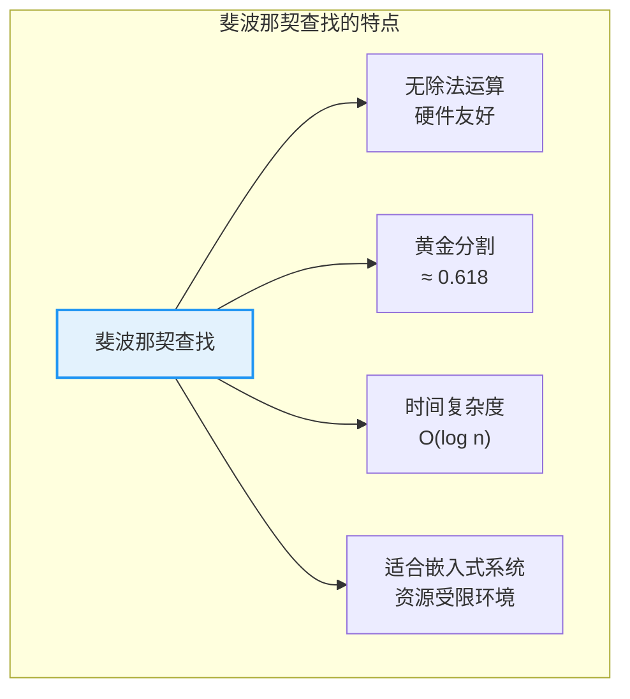
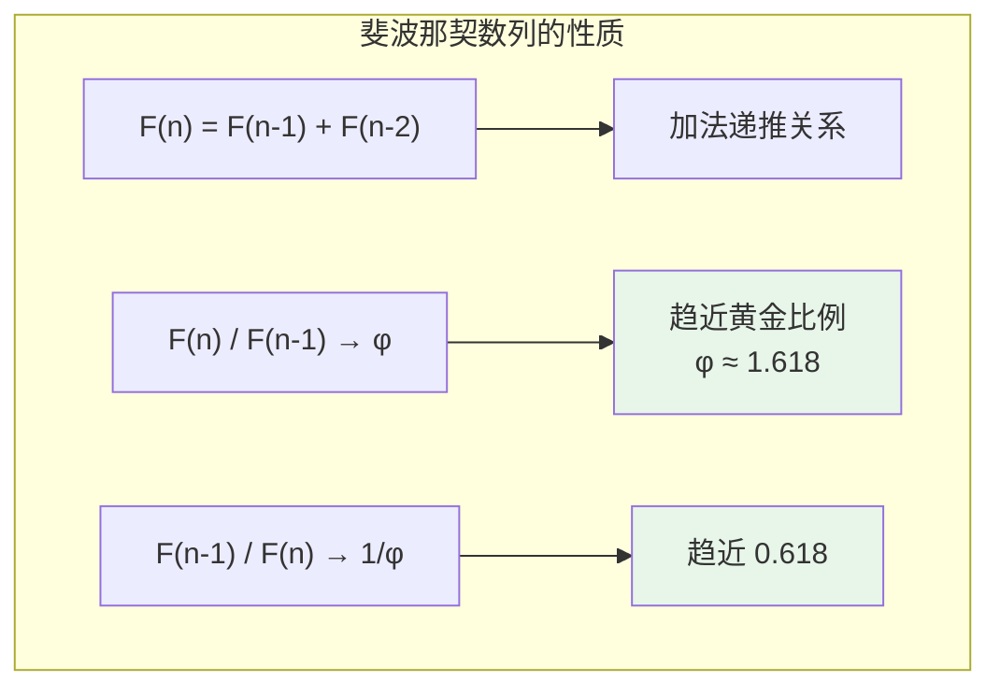

# 斐波那契查找

## 概述

斐波那契查找(Fibonacci Search)是二分查找的变种,使用**黄金分割比例**分割数组。其最大特点是**只使用加减运算**,避免了除法运算,特别适合硬件实现和对除法运算敏感的场景。

<div style="background-color: #E3F2FD; border-left: 4px solid #2196F3; padding: 12px; margin: 10px 0;">
<strong>核心优势:</strong>斐波那契查找只使用加减法运算,不需要除法,在硬件实现和某些特定环境下具有优势。分割比例接近黄金分割(≈ 0.618),具有良好的数学性质。
</div>

### 斐波那契查找的重要性



## 斐波那契数列

### 定义与性质

斐波那契数列定义:
```
F(0) = 1
F(1) = 1
F(n) = F(n-1) + F(n-2)  (n ≥ 2)
```

前几项:1, 1, 2, 3, 5, 8, 13, 21, 34, 55, 89, 144, 233, 377, ...

### 重要性质



### 黄金比例

```
φ = (1 + √5) / 2 ≈ 1.6180339887...
1/φ = (√5 - 1) / 2 ≈ 0.6180339887...

斐波那契数列的比值:
F(2)/F(1) = 2/1 = 2.000
F(3)/F(2) = 3/2 = 1.500
F(4)/F(3) = 5/3 ≈ 1.667
F(5)/F(4) = 8/5 = 1.600
F(6)/F(5) = 13/8 ≈ 1.625
F(7)/F(6) = 21/13 ≈ 1.615
F(8)/F(7) = 34/21 ≈ 1.619
...
→ 趋近于 φ ≈ 1.618
```

## 算法思想

### 分割策略

斐波那契查找将长度为 F(k) 的数组分割为:
- 左半部分:F(k-1) 个元素
- 右半部分:F(k-2) 个元素

```
分割比例:F(k-1) : F(k-2) ≈ 1 : 0.618 ≈ φ : 1

数组长度为 F(k) 的分割示意:

┌─────────────────────────────────────────────────────────────┐
│                     数组 (长度 F(k))                         │
├─────────────────────────────┬───────────────────────────────┤
│    左半部分 F(k-1) 个元素     │    右半部分 F(k-2) 个元素       │
│         ↑                   │                               │
│       分割点                 │                               │
│   mid = low + F(k-1) - 1    │                               │
└─────────────────────────────┴───────────────────────────────┘
```

### 与二分查找的对比


### 分割比例的意义

```
黄金分割的美妙性质:

1. 自相似性:如果整体被分为 φ 和 1 两部分,则 φ/1 = 1/(φ-1)

2. 斐波那契分割的递归性质:
   F(k) = F(k-1) + F(k-2)
   左半部分再次分割时:F(k-1) = F(k-2) + F(k-3)
   右半部分再次分割时:F(k-2) = F(k-3) + F(k-4)

3. 分割点计算无需除法:
   mid = low + F(k-1) - 1
   只需要加法!
```

## 算法详解

### 预处理:扩展数组

由于数组长度 n 不一定是斐波那契数,需要找到最小的 F(k) ≥ n,并将数组扩展到 F(k) 长度。

```
原始数组: [10, 20, 30, 40, 50, 60, 70, 80, 90, 100]
长度 n = 10

找最小的 F(k) ≥ 10:
F(0) = 1
F(1) = 1
F(2) = 2
F(3) = 3
F(4) = 5
F(5) = 8
F(6) = 13 ≥ 10 ✓

扩展后数组: [10, 20, 30, 40, 50, 60, 70, 80, 90, 100, 100, 100, 100]
长度 = 13 = F(6)

扩展方法:用原数组最后一个元素填充
```

### 查找过程

```mermaid
flowchart TB
    A["开始查找"] --> B["找到最小 F(k) ≥ n"]
    B --> C["扩展数组到 F(k) 长度"]
    C --> D["初始化:<br/>fib2 = F(k-2)<br/>fib1 = F(k-1)<br/>fib = F(k)"]
    D --> E["计算位置 i = offset + fib2"]
    E --> F{"arr[i] vs target"}
    F -->|arr[i] < target| G["向右搜索<br/>fib = fib1<br/>fib1 = fib2<br/>fib2 = fib - fib1<br/>offset = i"]
    F -->|arr[i] > target| H["向左搜索<br/>fib = fib2<br/>fib1 = fib1 - fib2<br/>fib2 = fib - fib1"]
    F -->|arr[i] == target| I["返回 i<br/>(若 i < n)"]
    G --> J{"fib > 1?"}
    H --> J
    J -->|是| E
    J -->|否| K["检查最后一个元素"]
    K --> L{"找到?"}
    L -->|是| I
    L -->|否| M["返回 -1"]
    
    style I fill:#E8F5E9
    style M fill:#FFCDD2
```

## 算法演示

### 完整示例

```
数组: [10, 22, 35, 40, 52, 61, 70, 82, 95, 100]
长度 n = 10
目标 target = 82

═══════════════════════════════════════════════════════════════
预处理
═══════════════════════════════════════════════════════════════

找到最小 F(k) ≥ 10:
F(6) = 13 ≥ 10 ✓

斐波那契数: fib2 = F(4) = 5, fib1 = F(5) = 8, fib = F(6) = 13
offset = -1

扩展后数组: [10, 22, 35, 40, 52, 61, 70, 82, 95, 100, 100, 100, 100]
             0   1   2   3   4   5   6   7   8   9   10  11  12

═══════════════════════════════════════════════════════════════
第1次查找
═══════════════════════════════════════════════════════════════

i = offset + fib2 = -1 + 5 = 4
arr[4] = 52

比较: arr[4] = 52 < target = 82

更新(向右搜索):
  fib = fib1 = 8
  fib1 = fib2 = 5
  fib2 = fib - fib1 = 8 - 5 = 3
  offset = i = 4

数组状态:
[10, 22, 35, 40, 52, 61, 70, 82, 95, 100, 100, 100, 100]
                   ↑
                 i=4, 向右搜索

═══════════════════════════════════════════════════════════════
第2次查找
═══════════════════════════════════════════════════════════════

i = offset + fib2 = 4 + 3 = 7
arr[7] = 82

比较: arr[7] = 82 == target = 82 ✓

查找成功!位置 = 7,查找次数 = 2
═══════════════════════════════════════════════════════════════
```

## 基本实现

=== "C"
    ```c
    int fibonacciSearch(int arr[], int n, int target) {
        if (n == 0) return -1;
        if (n == 1) return arr[0] == target ? 0 : -1;
        
        // 初始化斐波那契数
        int fib2 = 1;  // F(k-2)
        int fib1 = 1;  // F(k-1)
        int fib = fib2 + fib1;  // F(k)
        
        // 找到最小的 F(k) >= n
        while (fib < n) {
            fib2 = fib1;
            fib1 = fib;
            fib = fib2 + fib1;
        }
        
        int offset = -1;  // 偏移量
        
        while (fib > 1) {
            // 计算检查位置(不超过 n-1)
            int i = (offset + fib2 < n - 1) ? offset + fib2 : n - 1;
            
            if (arr[i] < target) {
                // 向右搜索
                fib = fib1;
                fib1 = fib2;
                fib2 = fib - fib1;
                offset = i;
            } else if (arr[i] > target) {
                // 向左搜索
                fib = fib2;
                fib1 = fib1 - fib2;
                fib2 = fib - fib1;
            } else {
                return i;  // 找到目标
            }
        }
        
        // 检查最后一个元素
        if (fib1 && arr[offset + 1] == target) {
            return offset + 1;
        }
        
        return -1;  // 未找到
    }
    ```

=== "C++"
    ```cpp
    #include <vector>
    #include <algorithm>
    using namespace std;

    int fibonacciSearch(const vector<int>& arr, int target) {
        int n = arr.size();
        if (n == 0) return -1;
        
        // 初始化斐波那契数
        int fib2 = 1, fib1 = 1, fib = 2;
        
        // 找到最小的 F(k) >= n
        while (fib < n) {
            fib2 = fib1;
            fib1 = fib;
            fib = fib2 + fib1;
        }
        
        int offset = -1;
        
        while (fib > 1) {
            // 计算检查位置
            int i = min(offset + fib2, n - 1);
            
            if (arr[i] < target) {
                // 向右搜索
                fib = fib1;
                fib1 = fib2;
                fib2 = fib - fib1;
                offset = i;
            } else if (arr[i] > target) {
                // 向左搜索
                fib = fib2;
                fib1 = fib1 - fib2;
                fib2 = fib - fib1;
            } else {
                return i;  // 找到目标
            }
        }
        
        // 检查最后一个元素
        if (fib1 && offset + 1 < n && arr[offset + 1] == target) {
            return offset + 1;
        }
        
        return -1;  // 未找到
    }
    ```

=== "Python"
    ```python
    def fibonacci_search(arr, target):
        """斐波那契查找算法"""
        n = len(arr)
        if n == 0:
            return -1
        if n == 1:
            return 0 if arr[0] == target else -1
        
        # 初始化斐波那契数
        fib2, fib1, fib = 1, 1, 2
        
        # 找到最小的 F(k) >= n
        while fib < n:
            fib2, fib1 = fib1, fib
            fib = fib2 + fib1
        
        offset = -1
        
        while fib > 1:
            # 计算检查位置
            i = min(offset + fib2, n - 1)
            
            if arr[i] < target:
                # 向右搜索
                fib = fib1
                fib1 = fib2
                fib2 = fib - fib1
                offset = i
            elif arr[i] > target:
                # 向左搜索
                fib = fib2
                fib1 = fib1 - fib2
                fib2 = fib - fib1
            else:
                return i
        
        # 检查最后一个元素
        if fib1 and offset + 1 < n and arr[offset + 1] == target:
            return offset + 1
        
        return -1
    ```

=== "Java"
    ```java
    public class FibonacciSearch {
        public static int fibonacciSearch(int[] arr, int target) {
            int n = arr.length;
            if (n == 0) return -1;
            if (n == 1) return arr[0] == target ? 0 : -1;
            
            // 初始化斐波那契数
            int fib2 = 1, fib1 = 1, fib = 2;
            
            // 找到最小的 F(k) >= n
            while (fib < n) {
                fib2 = fib1;
                fib1 = fib;
                fib = fib2 + fib1;
            }
            
            int offset = -1;
            
            while (fib > 1) {
                // 计算检查位置
                int i = Math.min(offset + fib2, n - 1);
                
                if (arr[i] < target) {
                    // 向右搜索
                    fib = fib1;
                    fib1 = fib2;
                    fib2 = fib - fib1;
                    offset = i;
                } else if (arr[i] > target) {
                    // 向左搜索
                    fib = fib2;
                    fib1 = fib1 - fib2;
                    fib2 = fib - fib1;
                } else {
                    return i;
                }
            }
            
            // 检查最后一个元素
            if (fib1 != 0 && offset + 1 < n && arr[offset + 1] == target) {
                return offset + 1;
            }
            
            return -1;
        }
    }
    ```

=== "Go"
    ```go
    func fibonacciSearch(arr []int, target int) int {
        n := len(arr)
        if n == 0 {
            return -1
        }
        if n == 1 {
            if arr[0] == target {
                return 0
            }
            return -1
        }
        
        // 初始化斐波那契数
        fib2, fib1, fib := 1, 1, 2
        
        // 找到最小的 F(k) >= n
        for fib < n {
            fib2, fib1 = fib1, fib
            fib = fib2 + fib1
        }
        
        offset := -1
        
        for fib > 1 {
            // 计算检查位置
            i := offset + fib2
            if i > n-1 {
                i = n - 1
            }
            
            if arr[i] < target {
                // 向右搜索
                fib = fib1
                fib1 = fib2
                fib2 = fib - fib1
                offset = i
            } else if arr[i] > target {
                // 向左搜索
                fib = fib2
                fib1 = fib1 - fib2
                fib2 = fib - fib1
            } else {
                return i
            }
        }
        
        // 检查最后一个元素
        if fib1 != 0 && offset+1 < n && arr[offset+1] == target {
            return offset + 1
        }
        
        return -1
    }
    ```

=== "Rust"
    ```rust
    fn fibonacci_search(arr: &[i32], target: i32) -> Option<usize> {
        let n = arr.len();
        if n == 0 {
            return None;
        }
        if n == 1 {
            return if arr[0] == target { Some(0) } else { None };
        }
        
        // 初始化斐波那契数
        let mut fib2 = 1;
        let mut fib1 = 1;
        let mut fib = 2;
        
        // 找到最小的 F(k) >= n
        while fib < n {
            fib2 = fib1;
            fib1 = fib;
            fib = fib2 + fib1;
        }
        
        let mut offset: i64 = -1;
        
        while fib > 1 {
            // 计算检查位置
            let i = std::cmp::min((offset + fib2 as i64) as usize, n - 1);
            
            if arr[i] < target {
                // 向右搜索
                fib = fib1;
                fib1 = fib2;
                fib2 = fib - fib1;
                offset = i as i64;
            } else if arr[i] > target {
                // 向左搜索
                fib = fib2;
                fib1 = fib1 - fib2;
                fib2 = fib - fib1;
            } else {
                return Some(i);
            }
        }
        
        // 检查最后一个元素
        if fib1 != 0 && (offset + 1) as usize < n && arr[(offset + 1) as usize] == target {
            return Some((offset + 1) as usize);
        }
        
        None
    }
    ```

## 复杂度分析

### 时间复杂度

| 情况 | 时间复杂度 | 说明 |
|------|-----------|------|
| **最好** | O(1) | 目标在第一个检查位置 |
| **平均** | O(log n) | 与二分查找相同 |
| **最坏** | O(log n) | 对数级别 |

### 空间复杂度

| 实现 | 空间复杂度 | 说明 |
|------|-----------|------|
| 优化版本 | O(1) | 无需扩展数组 |
| 基本实现 | O(n) | 需要扩展数组 |

### 复杂度推导

```
每次查找后区间缩小:

设当前区间长度为 F(k)
- 向左搜索:新区间长度 = F(k-1) ≈ F(k) / φ ≈ 0.618 × F(k)
- 向右搜索:新区间长度 = F(k-2) ≈ F(k) / φ² ≈ 0.382 × F(k)

查找次数 k 满足:
F(k) ≥ n
φ^k / √5 ≥ n  (使用斐波那契通项公式)
k × log(φ) ≥ log(n × √5)
k ≥ log(n) / log(φ)
k = O(log n)

因此时间复杂度为 O(log n)
```

## 三种查找算法比较

### 详细对比表

| 特性 | 二分查找 | 插值查找 | 斐波那契查找 |
|------|---------|---------|-------------|
| **分割方式** | 中点 | 估计位置 | 黄金分割点 |
| **分割比例** | 1:1 | 自适应 | ≈ 1:0.618 |
| **中点计算** | `(low+high)/2` | 插值公式 | `low + F(k-1) - 1` |
| **运算类型** | 加法、除法 | 加法、乘法、除法 | 仅加减法 |
| **平均时间** | O(log n) | O(log log n)(均匀) | O(log n) |
| **最坏时间** | O(log n) | O(n) | O(log n) |
| **数据要求** | 有序 | 有序 + 均匀更佳 | 有序 |
| **硬件友好** | 一般 | 一般 | 好 |
| **稳定性** | 稳定 | 依赖分布 | 稳定 |

### 分割点对比可视化

```
原始数组:[10, 20, 30, 40, 50, 60, 70, 80, 90, 100]
          索引:  0   1   2   3   4   5   6   7   8   9

二分查找分割:
[10, 20, 30, 40, 50 | 60, 70, 80, 90, 100]
                    ↑ mid = 4
      左: 5个        右: 5个
      比例 1:1

插值查找分割(target = 70):
[10, 20, 30, 40, 50, 60 | 70, 80, 90, 100]
                        ↑ pos = 6
      左: 6个            右: 3个
      比例 ≈ 2:1(自适应)

斐波那契查找分割(F(6)=13 扩展后):
[10, 20, 30, 40, 50 | 60, 70, 80, 90, 100, ...]
                    ↑ mid = 4 (F(5)-1 = 8-1 = 7, 实际位置调整)
      左: F(5) = 8    右: F(4) = 5
      比例 ≈ 1:0.618(黄金分割)
```

## 应用场景

### 1. 嵌入式系统


### 2. 硬件实现

=== "C"
    ```c
    // 硬件友好的斐波那契查找(避免除法)
    int fibonacciSearchHardware(int arr[], int n, int target) {
        // 使用查找表存储斐波那契数
        static const int fibTable[] = {1, 1, 2, 3, 5, 8, 13, 21, 34, 55, 
                                        89, 144, 233, 377, 610, 987, 1597};
        
        int k = 0;
        while (fibTable[k] < n) k++;
        
        int fib2 = fibTable[k - 2];
        int fib1 = fibTable[k - 1];
        int fib = fibTable[k];
        
        int offset = -1;
        
        while (fib > 1) {
            int i = (offset + fib2 < n - 1) ? offset + fib2 : n - 1;
            
            // 硬件比较器
            int cmp = arr[i] - target;
            
            if (cmp < 0) {
                fib = fib1; fib1 = fib2; fib2 = fib - fib1;
                offset = i;
            } else if (cmp > 0) {
                fib = fib2; fib1 = fib1 - fib2; fib2 = fib - fib1;
            } else {
                return i;
            }
        }
        
        return -1;
    }
    ```

=== "Python"
    ```python
    def fibonacci_search_hardware(arr, target):
        """硬件友好的斐波那契查找(避免除法)"""
        # 使用查找表存储斐波那契数
        fib_table = [1, 1, 2, 3, 5, 8, 13, 21, 34, 55, 
                     89, 144, 233, 377, 610, 987, 1597]
        
        n = len(arr)
        k = 0
        while fib_table[k] < n:
            k += 1
        
        fib2, fib1, fib = fib_table[k-2], fib_table[k-1], fib_table[k]
        offset = -1
        
        while fib > 1:
            i = min(offset + fib2, n - 1)
            
            if arr[i] < target:
                fib, fib1, fib2 = fib1, fib2, fib - fib1
                offset = i
            elif arr[i] > target:
                fib, fib1, fib2 = fib2, fib1 - fib2, fib - fib1
            else:
                return i
        
        return -1
    ```

## 黄金分割比例深入

### 数学推导

```
黄金比例 φ 满足:
φ = 1 + 1/φ
φ² = φ + 1
φ = (1 + √5) / 2 ≈ 1.6180339887...

斐波那契通项公式(Binet公式):
F(n) = (φⁿ - ψⁿ) / √5

其中 ψ = (1 - √5) / 2 ≈ -0.618

当 n 较大时:
F(n) ≈ φⁿ / √5

因此:
F(n) / F(n-1) ≈ φ
F(n-1) / F(n) ≈ 1/φ ≈ 0.618
```

### 黄金分割在算法中的意义

```
斐波那契查找的分割比例 ≈ 0.618(黄金分割)

黄金分割的美妙性质:
1. 自相似性:大区间和小区间保持相同的分割比例
2. 最优性:在某种意义下是最"均匀"的不对称分割
3. 无理数:避免了周期性的最坏情况

与二分查找的对比:
- 二分查找:对称分割,比例 0.5
- 斐波那契查找:黄金分割,比例 ≈ 0.618
- 插值查找:自适应分割,比例动态变化
```

## 注意事项

### 1. 整数溢出

=== "C"
    ```c
    // 斐波那契数增长很快,需要注意溢出
    // F(46) = 1836311903 < 2^31
    // F(47) = 2971215073 > 2^31(32位整数溢出)
    
    // 使用 long long 防止溢出
    long long fib[50];
    ```

=== "Java"
    ```java
    // 使用 long 防止溢出
    long fib2 = 1, fib1 = 1, fib = 2;
    ```

=== "Python"
    ```python
    # Python 整数不会溢出
    fib2, fib1, fib = 1, 1, 2
    ```

### 2. 数组扩展的开销

```c
// 基本实现需要扩展数组,有额外空间开销
// 优化版本通过逻辑处理避免实际扩展
```

### 3. 小数组退化

=== "C"
    ```c
    // 对于小数组,斐波那契查找的优势不明显
    if (n < 10) {
        return linearSearch(arr, n, target);  // 小数组用线性查找
    }
    ```

=== "Python"
    ```python
    # 对于小数组,斐波那契查找的优势不明显
    if n < 10:
        return linear_search(arr, target)  # 小数组用线性查找
    ```

## 参考资料

- 《算法导论》第4章 - 分治策略
- Kiefer, J. (1953) "Sequential minimax search for a maximum"
- Horowitz, E., Sahni, S. "Fundamentals of Data Structures"
- [Fibonacci Search - GeeksforGeeks](https://www.geeksforgeeks.org/fibonacci-search/)
- [Golden Ratio - Wikipedia](https://en.wikipedia.org/wiki/Golden_ratio)
