## 一、图的定义

### 1.1 数据结构

在了解图结构之前，先简单了解下数据结构。[数据结构](https://zhida.zhihu.com/search?content_id=246876880&content_type=Article&match_order=1&q=%E6%95%B0%E6%8D%AE%E7%BB%93%E6%9E%84&zhida_source=entity)是计算机科学中的重要组成部分，它定义了如何在计算机中组织、管理和存储数据。数据结构就是相互之间存在一种或多种特定关系的数据元素的集合。而我们学习数据结构，实际上就是在学习这些数据元素相互之间的关系。

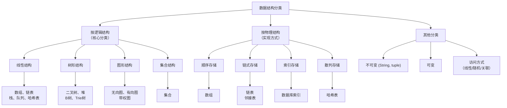

这里主要说明下按照逻辑结构分类

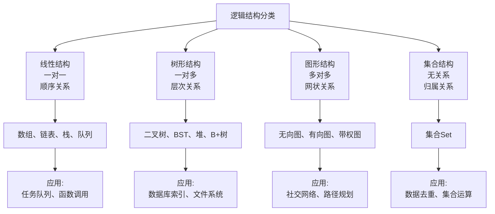

- **线性结构：** 数据元素之间存在“一对一”的线性关系。

    - **数组：** 一维数组、多维数组、动态数组（vector、ArrayList），元素在内存中连续存放。

    - **链表：** 单链表、双链表、循环连表，元素通过指针链接，在内存中不必连续。

    - **栈：** 后进先出（LIFO）的线性表，只能在栈顶进行插入和删除。常用于递归计算、表达式求值

    - **队列：** 先进先出（FIFO）的线性表，在队尾插入，在队头删除。循环队列。任务调度、广度优先搜索（BFS）、消息传递。

    - **字符串：** 字符构成的线性序列。

    - **双端队列：** 允许在队首和队尾进行插入和删除操作。滑动窗口、双向遍历

    - **哈希表：** 有些地方也把哈希表归类到数组中，从其逻辑呈现上看，是键值对的线性集合

- **树形结构：** 数据元素之间存在“一对多”的层次关系。

    - **二叉树：** 每个节点最多有两个子节点。主要有满二叉树、完全二叉树

    - **二叉搜索树（BST）：** 有序的二叉树，便于搜索。

    - **平衡二叉树（如AVL树、红黑树）：** 通过自平衡操作保证搜索效率。

    - **堆：** 也是一种完全二叉树，有最大堆和最小堆

    - **B树和B+树：** 一种多叉平衡树，为解决二叉树过高而提出按照

        - **B树** ：每个节点包含多个键和子树，所有叶子节点的深度相同，搜索、插入、删除的时间复杂度为O(log n)

        - **B+树** ：所有键值都出现在叶子节点，非叶子节点只存储索引，提高了数据访问的效率，复杂度与B树一样。

    - **字典树：** 用于高效存储和检索字符串集合。

- **图形结构：** 数据元素之间存在“多对多”的任意关系。这是最复杂的一种结构。

    - **无向图** ：边没有方向。社交网络、网络拓扑、地铁线路图、最小生成树问题（Kruskal、Prim算法）

    - **有向图** ：边有方向。网页链接关系（Google的PageRank）、任务依赖关系（Makefile）、课程先修关系、状态机建模

    - **带权图（网络）** ：边上有权值或成本。导航系统的最短路径（Dijkstra算法）、物流网络的成本优化、网络流量分析、电路设计

- **集合结构：** 数据元素之间除了"同属一个集合"外，没有其他特定关系。元素是无序的，且通常不允许重复。

    - **集合(Set)：** 元素无序且唯一。用户ID去重、词汇表构建、数学上的集合运算（并、交、差）、数据库的DISTINCT操作

### 1.2 图

图（Graph）是一种表示多对多关系的非线性数据结构。下面通过详细的说明和Mermaid图示来讲解图的各类概念和术语。

图G由两个集合V和E组成，记为$G = (V, E)$

- **V**：顶点的有穷非空集合
- **E**：边的集合，边是V中顶点的偶对

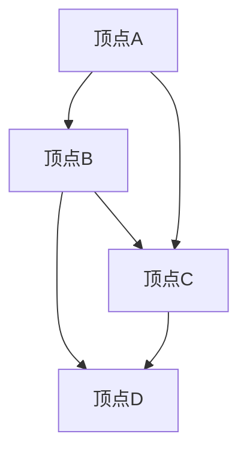

**说明**：

* ○ 表示 **顶点**（Vertex/Node）
* → 表示 **边**（Edge/Arc）
* 上图包含4个顶点：A, B, C, D
* 包含5条边：A→B, A→C, B→C, B→D, C→D


## 二、图的术语

### 2.1 基本关系术语

#### 2.1.1 顶点 (Vertex/Node)

- **定义**：图中的基本数据单元，也称为节点
- **示例**：在社交网络中，每个用户就是一个顶点


#### 2.1.2 边 (Edge/Arc)

- **定义**：顶点之间的连接关系
- **示例**：在社交网络中，好友关系就是边


#### 2.1.3 无向图 (Undirected Graph)

- **定义**：边没有方向的图，边(u,v)和(v,u)表示同一条边
- **数学表示**：E是无序偶对(u,v)的集合


```plaintext
顶点：A, B, C, D
边：(A,B), (A,C), (B,C), (C,D)
```

表示A与B相连，B与A也相连

#### 2.1.4 有向图 (Directed Graph/Digraph)

- **定义**：边有方向的图，边&lt;u,v>和&lt;v,u>是不同的边
- **数学表示**：E是有序偶对&lt;u,v>的集合
* 示例


```plaintext
顶点：A, B, C, D
边：<A,B>, <B,C>, <C,A>, <C,D>
```

表示A指向B，B指向C，C指向A和D

#### 2.1.5 权 (Weight)

- **定义**：边或弧上的数值，表示距离、成本、时间等
- **示例**：在道路网络中，边的权值可以表示道路长度或通行时间


#### 2.1.6 带权图/网络 (Weighted Graph/Network)

- **定义**：边带有权值的图
- **示例**：
```plaintext
顶点：城市A, 城市B, 城市C
边：(A,B,100), (A,C,150), (B,C,200)
```
顶点：城市A, 城市B, 城市C 边：(A,B,100), (A,C,150), (B,C,200)
表示城市之间的距离


### 2.2 顶点关系术语

#### 2.2.1 邻接点 (Adjacent Vertex)

- **定义**：如果(u,v)是图中的一条边，则称u和v互为邻接点
- **示例**：在边(A,B)中，A和B互为邻接点


#### 2.2.2 关联边 (Incident Edge)

- **定义**：与顶点相连的边称为该顶点的关联边
- **示例**：顶点A有边(A,B)和(A,C)，则这两条边是A的关联边


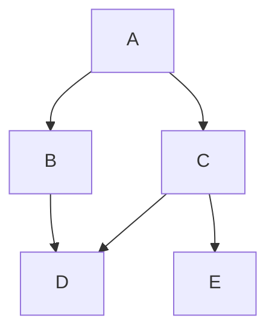

**术语**：

- **邻接点**：B和C是A的邻接点

- **关联边**：边A→B和A→C是顶点A的关联边

#### 2.2.3 顶点的度 (Degree of Vertex)

- **无向图**：与顶点v关联的边的数目，记为TD(v)
- **有向图**：
    - **入度 (In-degree)**：以v为终点的边的数目，记为ID(v)
    - **出度 (Out-degree)**：以v为起点的边的数目，记为OD(v)
    - **总度**：$TD(v) = ID(v) + OD(v)$


**无向图的度**：

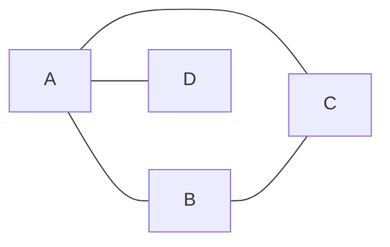

* TD(A) = 3（A的度为3）

* TD(B) = 2, TD(C) = 2, TD(D) = 1

**有向图的入度和出度**：

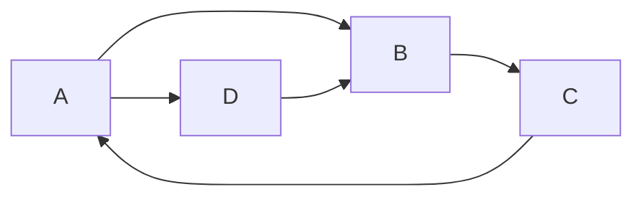

* A：ID(A)=1, OD(A)=2, TD(A)=3

* B：ID(B)=2, OD(B)=1, TD(B)=3

* C：ID(C)=1, OD(C)=1, TD(C)=2

* D：ID(D)=1, OD(D)=1, TD(D)=2

#### 2.2.4 握手定理 (Handshaking Lemma)

- **定理**：无向图中所有顶点的度之和等于边数的2倍
- **公式**：$∑TD(v) = 2\|E\|$
- **推论**：无向图中度为奇数的顶点必有偶数个


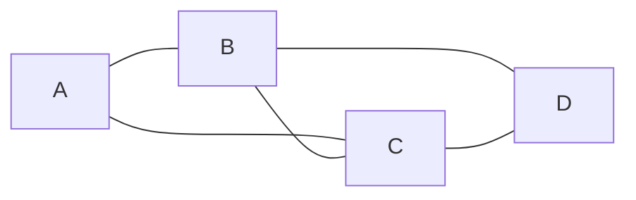

**计算**：

* $∑TD(v) = TD(A)+TD(B)+TD(C)+TD(D) = 2+3+3+2 = 10$

* 边数$ \|E\| = 5$

* $2\|E\| = 2×5 = 10$

* $∴ ∑TD(v) = 2\|E\|$ 成立

### 2.3 路径相关术语

#### 2.3.1 路径 (Path)

- **定义**：从顶点v到顶点v'的路径是一个顶点序列


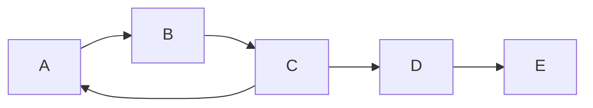

**路径示例**：

- **简单路径**：A→B→C→D（顶点不重复）

- **回路**：A→B→C→A（首尾相同）

- **简单回路**：A→B→C→A（除首尾外不重复）

#### 2.3.2 路径长度 (Path Length)

- **定义**：路径上边或弧的数目
- **带权图**：路径上各边权值之和


#### 2.3.3 简单路径 (Simple Path)

- **定义**：序列中顶点不重复出现的路径
- **示例**：A→B→C是简单路径，A→B→A→C不是简单路径


#### 2.3.4 回路/环 (Cycle/Circuit)

- **定义**：第一个顶点和最后一个顶点相同的路径
- **示例**：A→B→C→A形成一个回路


#### 2.3.5 简单回路 (Simple Cycle)

- **定义**：除了第一个和最后一个顶点外，其余顶点不重复的回路
- **示例**：A→B→C→A是简单回路，A→B→A→C→A不是简单回路


### 2.4 连通性术语

#### 2.4.1 连通图 (Connected Graph)

- **定义**：在无向图中，如果任意两个顶点之间都存在路径
- **示例**：


**连通图**：

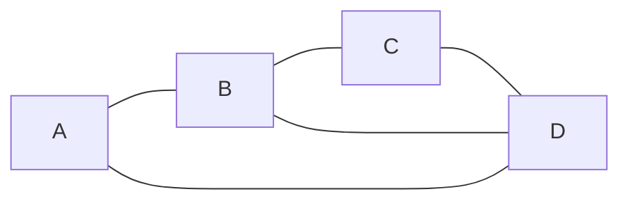

*所有顶点都连通*

**非连通图**：

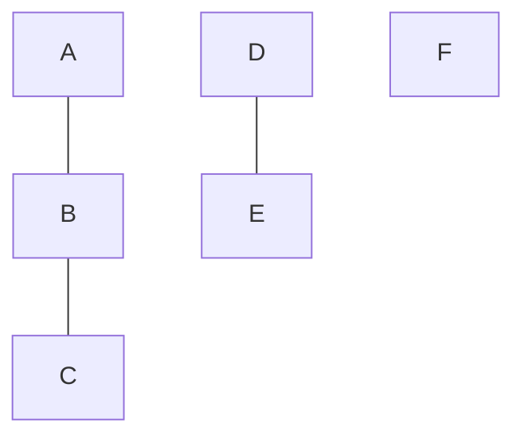

*包含3个连通分量*

#### 2.4.2 连通分量 (Connected Component)

- **定义**：无向图中的极大连通子图
- **示例**：如果一个图有3个互不连通的部分，则它有3个连通分量


#### 2.4.3 强连通图 (Strongly Connected Graph)

- **定义**：在有向图中，如果任意两个顶点u和v，既存在u到v的路径，也存在v到u的路径
- **示例**：
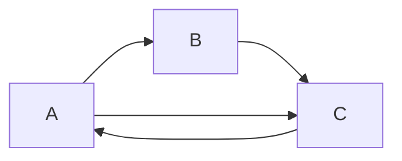
*任意两顶点双向可达*


#### 2.4.4 强连通分量 (Strongly Connected Component)

- **定义**：有向图中的极大强连通子图
- **示例**：一个有向图可能由多个强连通分量组成


#### 2.4.5 弱连通图 (Weakly Connected Graph)

- **定义**：如果有向图的基图（忽略方向后的无向图）是连通图
- **示例**：A→B←C是弱连通但不是强连通


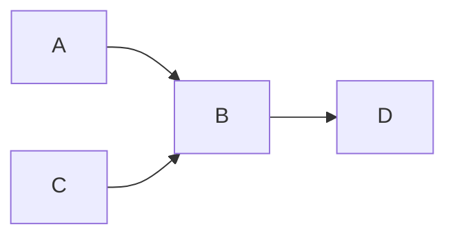

*基图连通但不是强连通*

## 三、图的分类

### 3.1 无向图vs有向图

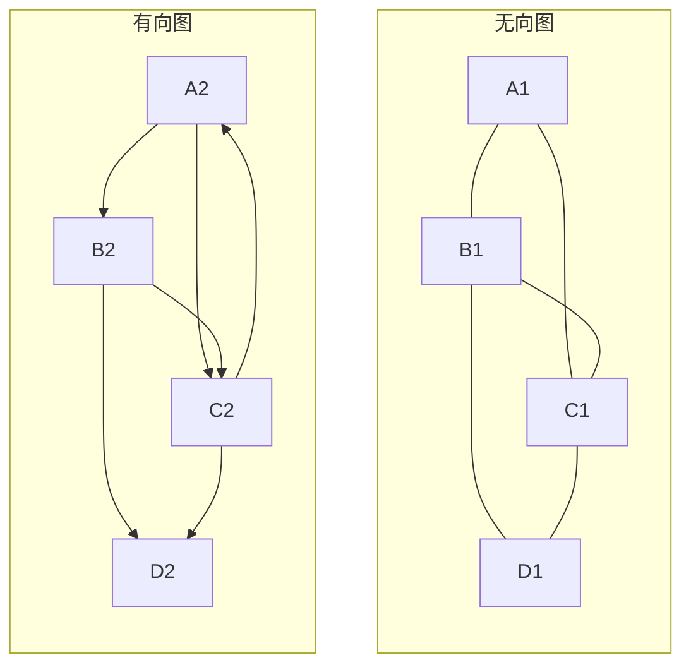

**对比**：

|特征|无向图|有向图|
|---|---|---|
|边表示|$(u,v)$|$&lt;u,v>$|
|对称性|$(u,v) = (v,u)$|$&lt;u,v> ≠ &lt;v,u>$|
|边数|$2\|E\| = ∑TD(v)$|$\|E\| = ∑ID(v) = ∑OD(v)$|

### 3.2 带权图（网络）

**带权图**：边上带有权值

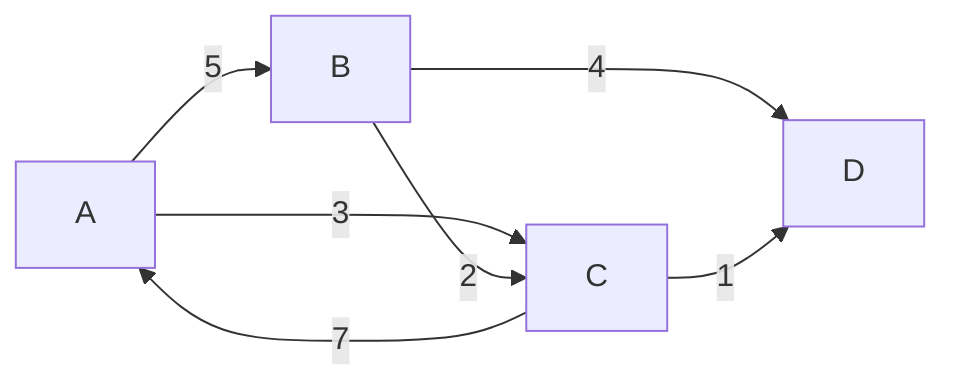

### 3.3 完全图

- **定义**：任意两个顶点之间都有边相连的图
- **无向完全图**：有n个顶点的无向完全图有$n(n-1)/2$条边
- **有向完全图**：有n个顶点的有向完全图有$n(n-1)$条边

**无向完全图 K₄**：

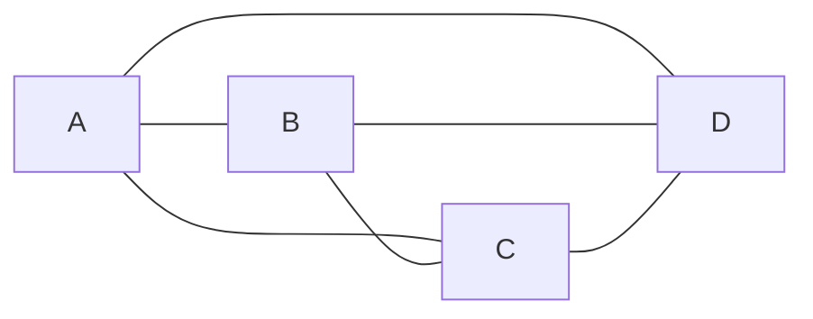

*4个顶点，6条边 = $4×(4-1)/2$*

**有向完全图**：

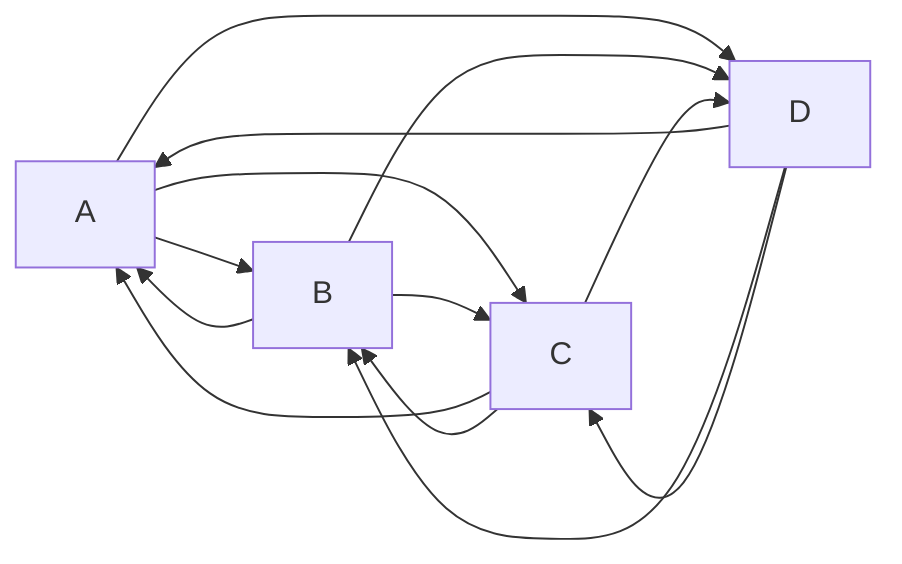

*4个顶点，12条边 = 4×(4\-1)*

### 3.4 稀疏图 vs 稠密图

**稀疏图**：

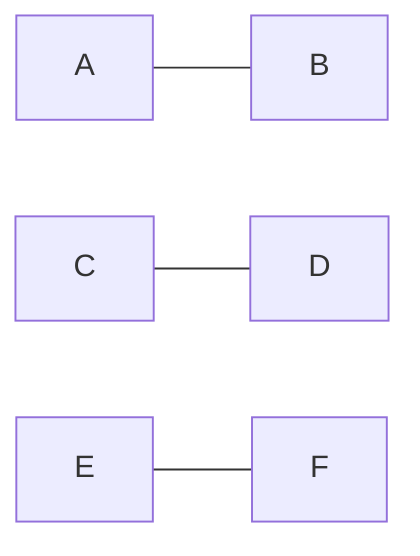

*边数远少于完全图*

**稠密图**：


*边数接近完全图*

### 3.5 子图

- **定义**：$如果V'⊆V且E'⊆E，则G'=(V',E')是G=(V,E)的子图$


**原图G**：


**子图G'**：

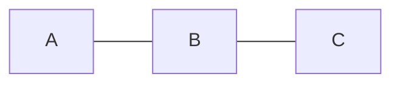

*$V' = {A,B,C}, E' = {(A,B), (B,C)}$*

### 3.6 生成树

- **定义**：包含图中所有顶点的极小连通子图（树）
- **性质**：有n个顶点的连通图的生成树有n\-1条边


**原连通图**：

```mermaid
graph LR
    A --- B
    A --- C
    B --- C
    B --- D
    C --- D
    A --- D
```

**生成树**：

```mermaid
graph LR
    A --- B
    B --- C
    C --- D
```

*包含所有顶点的极小连通子图*
