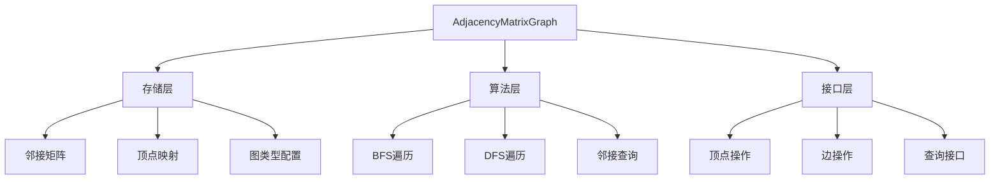

# 邻接矩阵图类设计总结

## 一、设计思路

### 1.1 核心设计理念
- **模板化设计**：支持任意顶点类型和权重类型，提高代码复用性
- **类型安全**：通过枚举类型明确图的有向/无向、带权/无权特性
- **分离关注点**：将存储结构、算法、接口清晰分离
- **异常安全**：完善的错误处理和边界检查

### 1.2 架构设计


## 二、特性说明

### 2.1 核心特性
| 特性类别 | 具体功能 | 实现方式 |
|---------|---------|----------|
| **存储特性** | 邻接矩阵存储 | 二维vector动态管理 |
| | 顶点映射 | unordered_map快速查找 |
| | 动态扩容 | 自动调整矩阵大小 |
| **图类型** | 有向/无向图 | GraphType枚举控制 |
| | 带权/无权图 | GraphWeightType枚举控制 |
| **顶点操作** | 添加顶点 | 动态扩展矩阵 |
| | 删除顶点 | 收缩矩阵并更新映射 |
| **边操作** | 添加/删除边 | 矩阵元素操作 |
| | 权重管理 | 模板化权重类型 |
| **遍历算法** | BFS广度优先 | 队列实现 |
| | DFS深度优先 | 递归/栈实现 |
| **查询功能** | 邻接点查询 | 矩阵行扫描 |
| | 边存在性检查 | O(1)直接访问 |

### 2.2 技术亮点
1. **零内存浪费**：删除顶点时正确收缩矩阵
2. **快速查找**：哈希表维护顶点到索引的映射
3. **类型安全**：编译期检查图类型操作合法性
4. **异常安全**：所有操作都有完善的错误处理

## 三、主要接口详解

### 3.1 构造与配置接口
```cpp
// 构造函数：支持图类型、权重类型、无边标记值配置
AdjacencyMatrixGraph(GraphType type, GraphWeightType weight_type, WeightType no_edge)

// 图信息查询
getVertexCount(), getEdgeCount(), getGraphType(), getWeightType()
```

### 3.2 顶点操作接口
```cpp
// 顶点管理
bool addVertex(const VertexType& vertex)        // 添加顶点
bool removeVertex(const VertexType& vertex)     // 删除顶点及关联边

// 顶点查询
int getVertexIndex(const VertexType& vertex) const  // 获取顶点索引
```

### 3.3 边操作接口
```cpp
// 边管理
bool addEdge(v1, v2, weight)    // 添加边（自动处理对称性）
bool removeEdge(v1, v2)         // 删除边

// 边查询
bool hasEdge(v1, v2) const              // 边存在性检查
WeightType getEdgeWeight(v1, v2) const  // 获取边权重
```

### 3.4 邻接查询接口
```cpp
// 邻接关系
vector<VertexType> getAdjacentVertices(vertex) const  // 所有邻接点
VertexType getFirstAdjacentVertex(vertex) const       // 第一个邻接点  
VertexType getNextAdjacentVertex(vertex, prev) const  // 下一个邻接点
```

### 3.5 遍历算法接口
```cpp
// 图遍历
vector<VertexType> bfs(start_vertex) const  // 广度优先遍历
vector<VertexType> dfs(start_vertex) const  // 深度优先遍历
```

### 3.6 工具接口
```cpp
// 调试输出
void printMatrix() const  // 打印邻接矩阵
void printGraph() const   // 打印图结构信息
```

## 四、性能分析

### 4.1 时间复杂度
| 操作 | 时间复杂度 | 说明 |
|------|------------|------|
| 添加顶点 | O(n²) | 需要调整矩阵大小 |
| 删除顶点 | O(n²) | 需要调整矩阵大小 |
| 添加边 | O(1) | 直接修改矩阵元素 |
| 删除边 | O(1) | 直接修改矩阵元素 |
| 查找边 | O(1) | 直接访问矩阵元素 |
| 获取邻接点 | O(n) | 需要扫描矩阵行 |
| BFS/DFS | O(n²) | 最坏情况访问整个矩阵 |

### 4.2 空间复杂度
- **主要存储**：O(n²) - 邻接矩阵
- **辅助存储**：O(n) - 顶点数组和映射表
- **总空间**：O(n²)

## 五、后续扩展方向

### 5.1 算法扩展
```cpp
// 最短路径算法
vector<VertexType> dijkstra(const VertexType& start, const VertexType& end) const
vector<VertexType> floydWarshall() const

// 最小生成树
vector<Edge<VertexType, WeightType>> prim() const
vector<Edge<VertexType, WeightType>> kruskal() const

// 拓扑排序（有向无环图）
vector<VertexType> topologicalSort() const

// 连通分量
vector<vector<VertexType>> connectedComponents() const
```

### 5.2 功能扩展
```cpp
// 序列化/反序列化
void saveToFile(const string& filename) const
static AdjacencyMatrixGraph loadFromFile(const string& filename)

// 图修改操作
void transpose()  // 转置有向图
void complement() // 补图

// 属性查询
bool isConnected() const           // 连通性判断
bool hasCycle() const              // 环检测
int getDegree(const VertexType& v) const // 顶点度数

// 迭代器支持
class VertexIterator
class EdgeIterator
class AdjacencyIterator
```

### 5.3 性能优化
```cpp
// 稀疏矩阵优化
class SparseMatrixAdapter {
    // 对稀疏图使用压缩存储
}

// 并行算法
vector<VertexType> parallelBfs(const VertexType& start) const
vector<VertexType> parallelDfs(const VertexType& start) const

// 缓存优化
class CachedGraph : public AdjacencyMatrixGraph {
    // 缓存常用查询结果
}
```

### 5.4 接口增强
```cpp
// 流操作符重载
friend ostream& operator<<(ostream& os, const AdjacencyMatrixGraph& graph)
friend istream& operator>>(istream& is, AdjacencyMatrixGraph& graph)

// STL兼容接口
begin(), end()  // 顶点迭代器
edges_begin(), edges_end()  // 边迭代器

// 函数式接口
template<typename Func>
void forEachVertex(Func func) const

template<typename Func>  
void forEachEdge(Func func) const

// 图算法策略模式
class GraphAlgorithmStrategy {
    virtual vector<VertexType> execute(const AdjacencyMatrixGraph& graph) = 0;
}
```

## 六、使用建议

### 6.1 适用场景
- ✅ **稠密图**：边数接近n²的情况
- ✅ **小规模图**：顶点数在可接受范围内
- ✅ **频繁边查询**：需要快速判断边是否存在
- ✅ **算法教学**：直观理解图算法原理

### 6.2 不适用场景
- ❌ **超大规模图**：内存限制无法存储n²矩阵
- ❌ **极度稀疏图**：空间利用率过低
- ❌ **动态顶点频繁变化**：调整矩阵开销过大

### 6.3 最佳实践
```cpp
// 1. 根据图特性选择存储结构
if (isDenseGraph) {
    AdjacencyMatrixGraph graph;  // 选择邻接矩阵
} else {
    AdjacencyListGraph graph;    // 选择邻接表
}

// 2. 批量操作优化
graph.batchAddVertices(vertices);  // 避免频繁调整矩阵
graph.batchAddEdges(edges);

// 3. 利用模板特性
AdjacencyMatrixGraph<string, double> cityGraph;  // 城市距离图
AdjacencyMatrixGraph<int, bool> socialGraph;     // 社交关系图
```

## 七、总结

这个邻接矩阵图类设计体现了现代C++的最佳实践：
- **类型安全**：通过模板和枚举确保编译期检查
- **资源安全**：RAII原则管理动态内存
- **接口清晰**：提供完整且一致的API
- **扩展性强**：为后续算法和优化预留接口
- **实用性强**：兼顾教学用途和实际应用

该实现既可作为学习图论的教具，也可作为实际项目中的图算法基础组件。

## 八、完整代码实现

=== "头文件定义"

    ```cpp
    #ifndef ADJACENCY_MATRIX_GRAPH_H
    #define ADJACENCY_MATRIX_GRAPH_H
    
    #include <iostream>
    #include <vector>
    #include <queue>
    #include <stack>
    #include <unordered_map>
    #include <limits>
    #include <stdexcept>
    #include <algorithm>
    
    enum GraphType {
        UNDIRECTED,
        DIRECTED
    };
    
    enum GraphWeightType {
        UNWEIGHTED,
        WEIGHTED
    };
    
    template<typename VertexType = int, typename WeightType = int>
    class AdjacencyMatrixGraph {
    private:
        std::vector<std::vector<WeightType>> matrix_;
        std::vector<VertexType> vertices_;
        std::unordered_map<VertexType, int> vertex_index_map_;
        GraphType graph_type_;
        GraphWeightType weight_type_;
        WeightType no_edge_value_;
        int vertex_count_;
        int edge_count_;
    
    public:
        // 构造函数
        AdjacencyMatrixGraph(GraphType type = UNDIRECTED, 
                            GraphWeightType weight_type = UNWEIGHTED,
                            WeightType no_edge = std::numeric_limits<WeightType>::max());
        
        // 基本操作
        bool addVertex(const VertexType& vertex);
        bool removeVertex(const VertexType& vertex);
        bool addEdge(const VertexType& v1, const VertexType& v2, WeightType weight = WeightType(1));
        bool removeEdge(const VertexType& v1, const VertexType& v2);
        
        // 查询操作
        int getVertexIndex(const VertexType& vertex) const;
        std::vector<VertexType> getAdjacentVertices(const VertexType& vertex) const;
        VertexType getFirstAdjacentVertex(const VertexType& vertex) const;
        VertexType getNextAdjacentVertex(const VertexType& vertex, const VertexType& prev) const;
        bool hasEdge(const VertexType& v1, const VertexType& v2) const;
        WeightType getEdgeWeight(const VertexType& v1, const VertexType& v2) const;
        
        // 图信息
        int getVertexCount() const { return vertex_count_; }
        int getEdgeCount() const { return edge_count_; }
        GraphType getGraphType() const { return graph_type_; }
        GraphWeightType getWeightType() const { return weight_type_; }
        
        // 遍历算法
        std::vector<VertexType> bfs(const VertexType& start_vertex) const;
        std::vector<VertexType> dfs(const VertexType& start_vertex) const;
        
        // 工具函数
        void printMatrix() const;
        void printGraph() const;
    
    private:
        // 内部辅助函数
        void resizeMatrix(int new_size);
        void dfsUtil(int vertex_index, std::vector<bool>& visited, std::vector<VertexType>& result) const;
        bool isValidVertexIndex(int index) const;
    };
    
    #include "adjacency_matrix_graph.tpp"
    
    #endif // ADJACENCY_MATRIX_GRAPH_H
    ```

=== "模板实现"
    
    ```cpp
    // adjacency_matrix_graph.tpp
    #ifndef ADJACENCY_MATRIX_GRAPH_TPP
    #define ADJACENCY_MATRIX_GRAPH_TPP
    
    template<typename VertexType, typename WeightType>
    AdjacencyMatrixGraph<VertexType, WeightType>::AdjacencyMatrixGraph(
        GraphType type, GraphWeightType weight_type, WeightType no_edge)
        : graph_type_(type), weight_type_(weight_type), no_edge_value_(no_edge),
          vertex_count_(0), edge_count_(0) {
        // 初始化空矩阵
        matrix_ = std::vector<std::vector<WeightType>>(0, std::vector<WeightType>(0, no_edge_value_));
    }
    
    template<typename VertexType, typename WeightType>
    bool AdjacencyMatrixGraph<VertexType, WeightType>::addVertex(const VertexType& vertex) {
        // 检查顶点是否已存在
        if (vertex_index_map_.find(vertex) != vertex_index_map_.end()) {
            return false;
        }
        
        // 添加新顶点
        int new_index = vertex_count_;
        vertices_.push_back(vertex);
        vertex_index_map_[vertex] = new_index;
        vertex_count_++;
        
        // 调整矩阵大小
        resizeMatrix(vertex_count_);
        
        return true;
    }
    
    template<typename VertexType, typename WeightType>
    bool AdjacencyMatrixGraph<VertexType, WeightType>::removeVertex(const VertexType& vertex) {
        // 查找顶点索引
        auto it = vertex_index_map_.find(vertex);
        if (it == vertex_index_map_.end()) {
            return false;
        }
        
        int index_to_remove = it->second;
        
        // 计算要删除的边数
        int edges_removed = 0;
        for (int i = 0; i < vertex_count_; i++) {
            if (matrix_[index_to_remove][i] != no_edge_value_) {
                edges_removed++;
            }
            if (matrix_[i][index_to_remove] != no_edge_value_) {
                edges_removed++;
            }
        }
        
        // 如果是无向图，每条边被计算了两次
        if (graph_type_ == UNDIRECTED) {
            edges_removed /= 2;
        }
        
        // 从顶点列表中移除
        vertices_.erase(vertices_.begin() + index_to_remove);
        vertex_index_map_.erase(vertex);
        
        // 更新其他顶点的索引映射
        for (auto& pair : vertex_index_map_) {
            if (pair.second > index_to_remove) {
                pair.second--;
            }
        }
        
        // 从矩阵中移除对应的行和列
        matrix_.erase(matrix_.begin() + index_to_remove);
        for (auto& row : matrix_) {
            row.erase(row.begin() + index_to_remove);
        }
        
        vertex_count_--;
        edge_count_ -= edges_removed;
        
        return true;
    }
    
    template<typename VertexType, typename WeightType>
    bool AdjacencyMatrixGraph<VertexType, WeightType>::addEdge(
        const VertexType& v1, const VertexType& v2, WeightType weight) {
        
        // 查找顶点索引
        auto it1 = vertex_index_map_.find(v1);
        auto it2 = vertex_index_map_.find(v2);
        if (it1 == vertex_index_map_.end() || it2 == vertex_index_map_.end()) {
            return false;
        }
        
        int idx1 = it1->second;
        int idx2 = it2->second;
        
        // 无权图使用固定权重1
        if (weight_type_ == UNWEIGHTED) {
            weight = WeightType(1);
        }
        
        // 添加边
        if (matrix_[idx1][idx2] == no_edge_value_) {
            matrix_[idx1][idx2] = weight;
            edge_count_++;
        } else {
            matrix_[idx1][idx2] = weight; // 更新已存在边的权重
        }
        
        // 如果是无向图，添加对称边
        if (graph_type_ == UNDIRECTED && idx1 != idx2) {
            if (matrix_[idx2][idx1] == no_edge_value_) {
                matrix_[idx2][idx1] = weight;
            } else {
                matrix_[idx2][idx1] = weight;
            }
        }
        
        return true;
    }
    
    template<typename VertexType, typename WeightType>
    bool AdjacencyMatrixGraph<VertexType, WeightType>::removeEdge(
        const VertexType& v1, const VertexType& v2) {
        
        auto it1 = vertex_index_map_.find(v1);
        auto it2 = vertex_index_map_.find(v2);
        if (it1 == vertex_index_map_.end() || it2 == vertex_index_map_.end()) {
            return false;
        }
        
        int idx1 = it1->second;
        int idx2 = it2->second;
        
        if (matrix_[idx1][idx2] == no_edge_value_) {
            return false;
        }
        
        // 移除边
        matrix_[idx1][idx2] = no_edge_value_;
        edge_count_--;
        
        // 如果是无向图，移除对称边
        if (graph_type_ == UNDIRECTED) {
            matrix_[idx2][idx1] = no_edge_value_;
        }
        
        return true;
    }
    
    template<typename VertexType, typename WeightType>
    int AdjacencyMatrixGraph<VertexType, WeightType>::getVertexIndex(const VertexType& vertex) const {
        auto it = vertex_index_map_.find(vertex);
        return (it != vertex_index_map_.end()) ? it->second : -1;
    }
    
    template<typename VertexType, typename WeightType>
    std::vector<VertexType> AdjacencyMatrixGraph<VertexType, WeightType>::getAdjacentVertices(
        const VertexType& vertex) const {
        
        std::vector<VertexType> adjacent;
        auto it = vertex_index_map_.find(vertex);
        if (it == vertex_index_map_.end()) {
            return adjacent;
        }
        
        int idx = it->second;
        for (int i = 0; i < vertex_count_; i++) {
            if (matrix_[idx][i] != no_edge_value_) {
                adjacent.push_back(vertices_[i]);
            }
        }
        
        return adjacent;
    }
    
    template<typename VertexType, typename WeightType>
    VertexType AdjacencyMatrixGraph<VertexType, WeightType>::getFirstAdjacentVertex(
        const VertexType& vertex) const {
        
        auto it = vertex_index_map_.find(vertex);
        if (it == vertex_index_map_.end()) {
            throw std::invalid_argument("Vertex not found");
        }
        
        int idx = it->second;
        for (int i = 0; i < vertex_count_; i++) {
            if (matrix_[idx][i] != no_edge_value_) {
                return vertices_[i];
            }
        }
        
        throw std::runtime_error("No adjacent vertices found");
    }
    
    template<typename VertexType, typename WeightType>
    VertexType AdjacencyMatrixGraph<VertexType, WeightType>::getNextAdjacentVertex(
        const VertexType& vertex, const VertexType& prev) const {
        
        auto it_vertex = vertex_index_map_.find(vertex);
        auto it_prev = vertex_index_map_.find(prev);
        if (it_vertex == vertex_index_map_.end() || it_prev == vertex_index_map_.end()) {
            throw std::invalid_argument("Vertex not found");
        }
        
        int idx_vertex = it_vertex->second;
        int idx_prev = it_prev->second;
        
        // 从prev的下一个位置开始查找
        for (int i = idx_prev + 1; i < vertex_count_; i++) {
            if (matrix_[idx_vertex][i] != no_edge_value_) {
                return vertices_[i];
            }
        }
        
        throw std::runtime_error("No next adjacent vertex found");
    }
    
    template<typename VertexType, typename WeightType>
    bool AdjacencyMatrixGraph<VertexType, WeightType>::hasEdge(
        const VertexType& v1, const VertexType& v2) const {
        
        auto it1 = vertex_index_map_.find(v1);
        auto it2 = vertex_index_map_.find(v2);
        if (it1 == vertex_index_map_.end() || it2 == vertex_index_map_.end()) {
            return false;
        }
        
        return matrix_[it1->second][it2->second] != no_edge_value_;
    }
    
    template<typename VertexType, typename WeightType>
    WeightType AdjacencyMatrixGraph<VertexType, WeightType>::getEdgeWeight(
        const VertexType& v1, const VertexType& v2) const {
        
        auto it1 = vertex_index_map_.find(v1);
        auto it2 = vertex_index_map_.find(v2);
        if (it1 == vertex_index_map_.end() || it2 == vertex_index_map_.end()) {
            throw std::invalid_argument("Vertex not found");
        }
        
        WeightType weight = matrix_[it1->second][it2->second];
        if (weight == no_edge_value_) {
            throw std::runtime_error("Edge does not exist");
        }
        
        return weight;
    }
    
    template<typename VertexType, typename WeightType>
    std::vector<VertexType> AdjacencyMatrixGraph<VertexType, WeightType>::bfs(
        const VertexType& start_vertex) const {
        
        std::vector<VertexType> result;
        auto it = vertex_index_map_.find(start_vertex);
        if (it == vertex_index_map_.end()) {
            return result;
        }
        
        int start_index = it->second;
        std::vector<bool> visited(vertex_count_, false);
        std::queue<int> q;
        
        visited[start_index] = true;
        q.push(start_index);
        
        while (!q.empty()) {
            int current = q.front();
            q.pop();
            result.push_back(vertices_[current]);
            
            for (int i = 0; i < vertex_count_; i++) {
                if (matrix_[current][i] != no_edge_value_ && !visited[i]) {
                    visited[i] = true;
                    q.push(i);
                }
            }
        }
        
        return result;
    }
    
    template<typename VertexType, typename WeightType>
    std::vector<VertexType> AdjacencyMatrixGraph<VertexType, WeightType>::dfs(
        const VertexType& start_vertex) const {
        
        std::vector<VertexType> result;
        auto it = vertex_index_map_.find(start_vertex);
        if (it == vertex_index_map_.end()) {
            return result;
        }
        
        std::vector<bool> visited(vertex_count_, false);
        dfsUtil(it->second, visited, result);
        return result;
    }
    
    template<typename VertexType, typename WeightType>
    void AdjacencyMatrixGraph<VertexType, WeightType>::dfsUtil(
        int vertex_index, std::vector<bool>& visited, std::vector<VertexType>& result) const {
        
        visited[vertex_index] = true;
        result.push_back(vertices_[vertex_index]);
        
        for (int i = 0; i < vertex_count_; i++) {
            if (matrix_[vertex_index][i] != no_edge_value_ && !visited[i]) {
                dfsUtil(i, visited, result);
            }
        }
    }
    
    template<typename VertexType, typename WeightType>
    void AdjacencyMatrixGraph<VertexType, WeightType>::resizeMatrix(int new_size) {
        // 保存旧矩阵
        auto old_matrix = matrix_;
        int old_size = old_matrix.size();
        
        // 创建新矩阵
        matrix_.resize(new_size);
        for (int i = 0; i < new_size; i++) {
            matrix_[i].resize(new_size, no_edge_value_);
        }
        
        // 复制旧数据
        for (int i = 0; i < std::min(old_size, new_size); i++) {
            for (int j = 0; j < std::min(old_size, new_size); j++) {
                matrix_[i][j] = old_matrix[i][j];
            }
        }
    }
    
    template<typename VertexType, typename WeightType>
    bool AdjacencyMatrixGraph<VertexType, WeightType>::isValidVertexIndex(int index) const {
        return index >= 0 && index < vertex_count_;
    }
    
    template<typename VertexType, typename WeightType>
    void AdjacencyMatrixGraph<VertexType, WeightType>::printMatrix() const {
        std::cout << "Adjacency Matrix:" << std::endl;
        std::cout << "  ";
        for (int i = 0; i < vertex_count_; i++) {
            std::cout << vertices_[i] << " ";
        }
        std::cout << std::endl;
        
        for (int i = 0; i < vertex_count_; i++) {
            std::cout << vertices_[i] << " ";
            for (int j = 0; j < vertex_count_; j++) {
                if (matrix_[i][j] == no_edge_value_) {
                    std::cout << "0 ";
                } else {
                    std::cout << matrix_[i][j] << " ";
                }
            }
            std::cout << std::endl;
        }
    }
    
    template<typename VertexType, typename WeightType>
    void AdjacencyMatrixGraph<VertexType, WeightType>::printGraph() const {
        std::cout << "Graph Information:" << std::endl;
        std::cout << "Type: " << (graph_type_ == UNDIRECTED ? "Undirected" : "Directed") << std::endl;
        std::cout << "Weight Type: " << (weight_type_ == UNWEIGHTED ? "Unweighted" : "Weighted") << std::endl;
        std::cout << "Vertices: " << vertex_count_ << std::endl;
        std::cout << "Edges: " << edge_count_ << std::endl;
        
        std::cout << "Vertices: ";
        for (const auto& vertex : vertices_) {
            std::cout << vertex << " ";
        }
        std::cout << std::endl;
        
        std::cout << "Edges:" << std::endl;
        for (int i = 0; i < vertex_count_; i++) {
            for (int j = 0; j < vertex_count_; j++) {
                if (matrix_[i][j] != no_edge_value_) {
                    if (graph_type_ == UNDIRECTED && i <= j) {
                        std::cout << "  " << vertices_[i] << " - " << vertices_[j];
                        if (weight_type_ == WEIGHTED) {
                            std::cout << " (" << matrix_[i][j] << ")";
                        }
                        std::cout << std::endl;
                    } else if (graph_type_ == DIRECTED) {
                        std::cout << "  " << vertices_[i] << " -> " << vertices_[j];
                        if (weight_type_ == WEIGHTED) {
                            std::cout << " (" << matrix_[i][j] << ")";
                        }
                        std::cout << std::endl;
                    }
                }
            }
        }
    }
    
    #endif // ADJACENCY_MATRIX_GRAPH_TPP
    ```

=== "测试用例"

    ```cpp
    // main.cpp
    #include "adjacency_matrix_graph.h"
    #include <iostream>
    
    void testUnweightedUndirectedGraph() {
      std::cout << "=== Testing Unweighted Undirected Graph ===" << std::endl;
      
      AdjacencyMatrixGraph<char> graph(UNDIRECTED, UNWEIGHTED);
      
      // 添加顶点
      graph.addVertex('A');
      graph.addVertex('B');
      graph.addVertex('C');
      graph.addVertex('D');
      
      // 添加边
      graph.addEdge('A', 'B');
      graph.addEdge('A', 'C');
      graph.addEdge('B', 'C');
      graph.addEdge('B', 'D');
      graph.addEdge('C', 'D');
      
      graph.printGraph();
      graph.printMatrix();
      
      // 测试遍历
      std::cout << "BFS from A: ";
      auto bfs_result = graph.bfs('A');
      for (char v : bfs_result) {
          std::cout << v << " ";
      }
      std::cout << std::endl;
      
      std::cout << "DFS from A: ";
      auto dfs_result = graph.dfs('A');
      for (char v : dfs_result) {
          std::cout << v << " ";
      }
      std::cout << std::endl;
      
      // 测试邻接点查询
      std::cout << "Adjacent vertices of B: ";
      auto adjacent = graph.getAdjacentVertices('B');
      for (char v : adjacent) {
          std::cout << v << " ";
      }
      std::cout << std::endl;
      
      std::cout << "First adjacent vertex of A: " << graph.getFirstAdjacentVertex('A') << std::endl;
      std::cout << "Next adjacent vertex of A after B: " << graph.getNextAdjacentVertex('A', 'B') << std::endl;
      
      std::cout << std::endl;
    }
    
    void testWeightedDirectedGraph() {
      std::cout << "=== Testing Weighted Directed Graph ===" << std::endl;
      
      AdjacencyMatrixGraph<std::string, int> graph(DIRECTED, WEIGHTED, 0);
      
      // 添加顶点
      graph.addVertex("NYC");
      graph.addVertex("LA");
      graph.addVertex("Chicago");
      graph.addVertex("Miami");
      
      // 添加带权边
      graph.addEdge("NYC", "LA", 2800);
      graph.addEdge("NYC", "Chicago", 800);
      graph.addEdge("LA", "Chicago", 2000);
      graph.addEdge("Chicago", "NYC", 800);
      graph.addEdge("Chicago", "Miami", 1200);
      graph.addEdge("Miami", "NYC", 1100);
      
      graph.printGraph();
      graph.printMatrix();
      
      // 测试边查询
      std::cout << "Distance from NYC to LA: " << graph.getEdgeWeight("NYC", "LA") << " miles" << std::endl;
      std::cout << "Is there a flight from Miami to NYC? " << (graph.hasEdge("Miami", "NYC") ? "Yes" : "No") << std::endl;
      
      std::cout << "BFS from NYC: ";
      auto bfs_result = graph.bfs("NYC");
      for (const auto& v : bfs_result) {
          std::cout << v << " ";
      }
      std::cout << std::endl;
      
      std::cout << std::endl;
    }
    
    void testVertexOperations() {
      std::cout << "=== Testing Vertex Operations ===" << std::endl;
      
      AdjacencyMatrixGraph<int> graph(UNDIRECTED, UNWEIGHTED);
      
      // 添加顶点
      for (int i = 1; i <= 5; i++) {
          graph.addVertex(i);
      }
      
      // 添加边
      graph.addEdge(1, 2);
      graph.addEdge(1, 3);
      graph.addEdge(2, 3);
      graph.addEdge(2, 4);
      graph.addEdge(3, 5);
      graph.addEdge(4, 5);
      
      std::cout << "Before removing vertex 3:" << std::endl;
      graph.printGraph();
      
      // 移除顶点
      graph.removeVertex(3);
      
      std::cout << "After removing vertex 3:" << std::endl;
      graph.printGraph();
      
      // 测试边操作
      graph.removeEdge(2, 4);
      std::cout << "After removing edge (2,4):" << std::endl;
      graph.printGraph();
      
      std::cout << std::endl;
    }
    
    int main() {
      testUnweightedUndirectedGraph();
      testWeightedDirectedGraph();
      testVertexOperations();
      
      return 0;
    }
    ```
