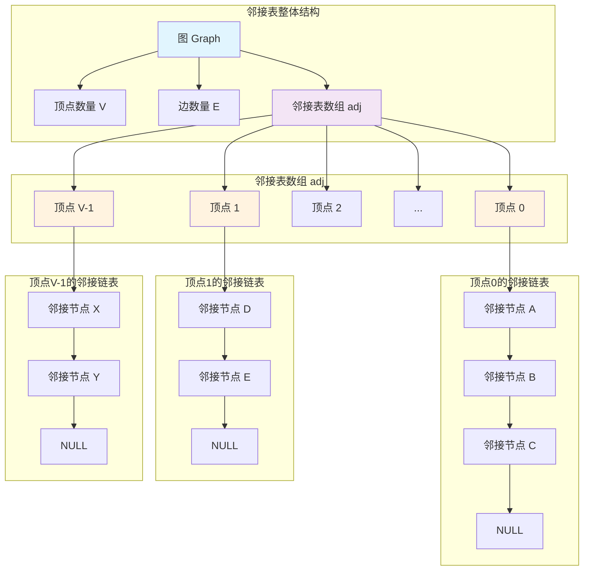
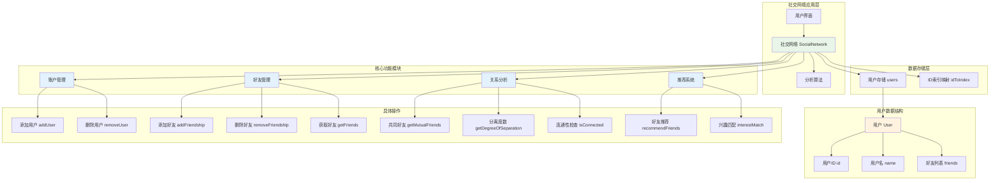

# 邻接表（Adjacency List）详细解析

## 1. 核心设计思路

### 基本概念

邻接表是一种图的存储结构，其核心思想是**为每个顶点维护一个链表（或动态数组），存储所有与该顶点直接相连的邻接顶点**。

### 设计哲学

- **空间效率优先**：只为实际存在的边分配存储空间
- **局部性原理**：将每个顶点的邻接关系集中存储，便于快速访问
- **动态适应性**：天然支持动态添加/删除边操作

## 2. 架构设计

### 2.1 基础架构



### 2.2 详细数据结构

=== "无权重图实现"

    ```cpp
    // 基础版本 - 使用vector
    class Graph {
    private:
        int V; // 顶点数
        vector<vector<int>> adj; // 邻接表
        
    public:
        Graph(int vertices) : V(vertices), adj(vertices) {}
        
        void addEdge(int u, int v) {
            adj[u].push_back(v);
            adj[v].push_back(u); // 无向图
        }
    };
    ```

=== "带权重图实现"

    ```cpp
    // 带权图版本
    class WeightedGraph {
    private:
        int V;
        vector<vector<pair<int, int>>> adj; // 存储(邻接顶点, 权重)
        
    public:
        WeightedGraph(int vertices) : V(vertices), adj(vertices) {}
        
        void addEdge(int u, int v, int weight) {
            adj[u].emplace_back(v, weight);
            adj[v].emplace_back(u, weight); // 无向图
        }
    };
    ```
    
=== "邻接表核心组件关系图"

    ```mermaid
    classDiagram
        class Graph {
            -int V
            -int E
            -vector~vector~int~~ adj
            +addEdge(int u, int v)
            +removeEdge(int u, int v)
            +hasEdge(int u, int v) bool
            +getNeighbors(int v) vector~int~
            +getDegree(int v) int
            +bfs(int start, function~void(int)~ visit)
            +dfs(int start, function~void(int)~ visit)
        }
        
        class Vertex {
            -int id
            -vector~int~ neighbors
            +addNeighbor(int v)
            +removeNeighbor(int v)
            +hasNeighbor(int v) bool
            +getNeighbors() vector~int~
        }
        
        class Edge {
            -int source
            -int destination
            -int weight
            +getSource() int
            +getDestination() int
            +getWeight() int
        }
        
        class GraphInterface {
            <<interface>>
            +addEdge(int u, int v)*
            +removeEdge(int u, int v)*
            +hasEdge(int u, int v) bool*
            +getNeighbors(int v) vector~int~*
            +getDegree(int v) int*
        }
        
        class WeightedGraph {
            -vector~vector~pair~int, int~~ adj
            +addEdge(int u, int v, int weight)
            +getWeight(int u, int v) int
        }
        
        GraphInterface <|.. Graph
        GraphInterface <|.. WeightedGraph
        Graph *-- Vertex : contains
        Graph *-- Edge : contains
        Vertex o-- Edge : connected through
    ```

## 3. 特性分析

### 3.1 优势特性

- **空间高效**：O(V + E)空间复杂度
- **快速邻接遍历**：O(deg(v))时间遍历顶点v的所有邻居
- **动态操作友好**：支持边的动态添加和删除
- **缓存友好**：连续存储邻接关系，提高缓存命中率

### 3.2 局限性

- **边查询慢**：判断边(u,v)存在性需要O(deg(u))时间
- **删除顶点复杂**：删除顶点需要更新所有相关链表
- **存储开销**：链表指针带来的额外空间开销

## 4. 主要接口设计

### 4.1 核心操作接口

#### 接口

```cpp
class GraphInterface {
public:
    // 基础操作
    virtual void addEdge(int u, int v) = 0;
    virtual void removeEdge(int u, int v) = 0;
    virtual bool hasEdge(int u, int v) const = 0;
    
    // 查询操作
    virtual const vector<int>& getNeighbors(int v) const = 0;
    virtual int getDegree(int v) const = 0;
    virtual int getVertexCount() const = 0;
    virtual int getEdgeCount() const = 0;
    
    // 遍历操作
    virtual void bfs(int start, function<void(int)> visit) const = 0;
    virtual void dfs(int start, function<void(int)> visit) const = 0;
};
```

#### 邻接表操作流程图  

```mermaid
flowchart TD
    Start([开始]) --> Init[初始化图结构]
    Init --> Menu{选择操作}
    
    Menu --> AddEdge[添加边]
    Menu --> RemoveEdge[删除边]
    Menu --> QueryEdge[查询边]
    Menu --> Traverse[遍历图]
    Menu --> End([结束])
    
    subgraph AddEdgeFlow [添加边流程]
        AE1[接收顶点u, v] --> AE2[验证顶点有效性]
        AE2 --> AE3{边是否存在?}
        AE3 -->|否| AE4[在adj[u]中添加v]
        AE4 --> AE5[在adj[v]中添加u<br>无向图]
        AE5 --> AE6[边计数E++]
        AE3 -->|是| AE7[返回错误或忽略]
        AE6 --> AEResult[返回成功]
        AE7 --> AEResult
    end
    
    subgraph RemoveEdgeFlow [删除边流程]
        RE1[接收顶点u, v] --> RE2[验证顶点有效性]
        RE2 --> RE3{边是否存在?}
        RE3 -->|是| RE4[从adj[u]中删除v]
        RE4 --> RE5[从adj[v]中删除u<br>无向图]
        RE5 --> RE6[边计数E--]
        RE3 -->|否| RE7[返回错误]
        RE6 --> REResult[返回成功]
        RE7 --> REResult
    end
    
    subgraph QueryEdgeFlow [查询边流程]
        QE1[接收顶点u, v] --> QE2[验证顶点有效性]
        QE2 --> QE3[遍历adj[u]查找v]
        QE3 --> QE4{找到v?}
        QE4 -->|是| QE5[返回true]
        QE4 -->|否| QE6[返回false]
    end
    
    subgraph TraverseFlow [遍历图流程]
        T1[选择遍历算法] --> T2{BFS 或 DFS?}
        T2 -->|BFS| T3[初始化队列和访问标记]
        T3 --> T4[从起始顶点开始]
        T4 --> T5[处理当前顶点]
        T5 --> T6[将未访问邻居入队]
        T6 --> T7{队列为空?}
        T7 -->|否| T8[出队下一个顶点]
        T8 --> T5
        T7 -->|是| T9[遍历完成]
        
        T2 -->|DFS| T10[初始化栈和访问标记]
        T10 --> T11[从起始顶点开始]
        T11 --> T12[处理当前顶点]
        T12 --> T13[将未访问邻居入栈]
        T13 --> T14{栈为空?}
        T14 -->|否| T15[出栈下一个顶点]
        T15 --> T12
        T14 -->|是| T16[遍历完成]
    end
    
    AddEdge --> AddEdgeFlow
    RemoveEdge --> RemoveEdgeFlow
    QueryEdge --> QueryEdgeFlow
    Traverse --> TraverseFlow
    
    AddEdgeFlow --> Menu
    RemoveEdgeFlow --> Menu
    QueryEdgeFlow --> Menu
    TraverseFlow --> Menu
```

### 4.2 完整实现示例

```cpp
class AdvancedGraph : public GraphInterface {
private:
    int V;
    int E;
    vector<vector<int>> adj;
    mutable vector<bool> visited; // 用于遍历的访问标记
    
public:
    AdvancedGraph(int vertices) : V(vertices), E(0), adj(vertices), visited(vertices, false) {}
    
    // 添加边
    void addEdge(int u, int v) override {
        if (u < 0 || u >= V || v < 0 || v >= V) return;
        if (!hasEdge(u, v)) {
            adj[u].push_back(v);
            adj[v].push_back(u);
            E++;
        }
    }
    
    // 删除边
    void removeEdge(int u, int v) override {
        if (u < 0 || u >= V || v < 0 || v >= V) return;
        
        // 从u的邻接表中删除v
        auto it = find(adj[u].begin(), adj[u].end(), v);
        if (it != adj[u].end()) {
            adj[u].erase(it);
            E--;
        }
        
        // 从v的邻接表中删除u
        it = find(adj[v].begin(), adj[v].end(), u);
        if (it != adj[v].end()) {
            adj[v].erase(it);
        }
    }
    
    // 检查边是否存在
    bool hasEdge(int u, int v) const override {
        if (u < 0 || u >= V || v < 0 || v >= V) return false;
        return find(adj[u].begin(), adj[u].end(), v) != adj[u].end();
    }
    
    // 获取邻居列表
    const vector<int>& getNeighbors(int v) const override {
        static const vector<int> empty;
        if (v < 0 || v >= V) return empty;
        return adj[v];
    }
    
    // 获取顶点度数
    int getDegree(int v) const override {
        if (v < 0 || v >= V) return 0;
        return adj[v].size();
    }
    
    int getVertexCount() const override { return V; }
    int getEdgeCount() const override { return E; }
    
    // BFS遍历
    void bfs(int start, function<void(int)> visit) const override {
        if (start < 0 || start >= V) return;
        
        fill(visited.begin(), visited.end(), false);
        queue<int> q;
        
        visited[start] = true;
        q.push(start);
        
        while (!q.empty()) {
            int current = q.front();
            q.pop();
            visit(current);
            
            for (int neighbor : adj[current]) {
                if (!visited[neighbor]) {
                    visited[neighbor] = true;
                    q.push(neighbor);
                }
            }
        }
    }
    
    // DFS遍历
    void dfs(int start, function<void(int)> visit) const override {
        if (start < 0 || start >= V) return;
        
        fill(visited.begin(), visited.end(), false);
        dfsUtil(start, visit);
    }
    
private:
    void dfsUtil(int v, function<void(int)> visit) const {
        visited[v] = true;
        visit(v);
        
        for (int neighbor : adj[v]) {
            if (!visited[neighbor]) {
                dfsUtil(neighbor, visit);
            }
        }
    }
};
```

## 5. 性能分析

### 5.1 时间复杂度

| 操作 | 时间复杂度 | 说明 |
|------|------------|------|
| 添加边 | O(1) | 在链表/向量末尾添加 |
| 删除边 | O(deg(u)) | 需要遍历u的邻接表 |
| 查询边 | O(deg(u)) | 需要遍历u的邻接表 |
| 遍历邻居 | O(deg(v)) | 直接访问邻接表 |
| 空间复杂度 | O(V + E) | 顶点数 + 边数 |

### 5.2 空间复杂度分析

- **基础存储**：V个顶点，每个顶点存储一个链表头指针
- **边存储**：每条边在对应两个顶点的链表中各存储一次（无向图）
- **总空间**：$O(V + 2E) ≈ O(V + E)$

## 6. 扩展方向

### 6.1 性能优化扩展

```cpp
// 优化版本：使用unordered_set快速查询边
class OptimizedGraph {
private:
    int V;
    vector<unordered_set<int>> adj;
    
public:
    OptimizedGraph(int vertices) : V(vertices), adj(vertices) {}
    
    void addEdge(int u, int v) {
        adj[u].insert(v);
        adj[v].insert(u);
    }
    
    bool hasEdge(int u, int v) const {
        return adj[u].find(v) != adj[u].end();
    }
    
    void removeEdge(int u, int v) {
        adj[u].erase(v);
        adj[v].erase(u);
    }
};
```

### 6.2 功能扩展

```cpp
// 支持多种图类型的通用邻接表
template<typename VertexType, typename EdgeType = int>
class GenericGraph {
private:
    unordered_map<VertexType, vector<pair<VertexType, EdgeType>>> adj;
    bool directed;
    
public:
    GenericGraph(bool isDirected = false) : directed(isDirected) {}
    
    void addEdge(const VertexType& u, const VertexType& v, const EdgeType& weight = EdgeType{}) {
        adj[u].emplace_back(v, weight);
        if (!directed) {
            adj[v].emplace_back(u, weight);
        }
    }
    
    // 支持自定义顶点类型的各种操作...
};
```

## 7. 使用场景建议

### 7.1 推荐使用场景

- **稀疏图**$（E << V²）$
- **需要频繁遍历邻居**的算法（BFS、DFS、Dijkstra等）
- **动态图**（频繁添加/删除边）
- **内存敏感**的应用场景

### 7.2 不推荐使用场景

- **稠密图**（E ≈ V²）
- **需要频繁查询边存在性**的应用
- **固定图结构**且需要极致性能的场景

## 8. 应用实例：社交网络分析

### 8.1 问题描述

构建一个社交网络图，分析用户之间的关系，实现好友推荐功能。

### 8.2 应用架构图



### 8.3 完整实现

```cpp
#include <iostream>
#include <vector>
#include <queue>
#include <unordered_set>
#include <algorithm>
#include <functional>

class SocialNetwork {
private:
    struct User {
        int id;
        string name;
        vector<int> friends;
        
        User(int userId, string userName) : id(userId), name(userName) {}
    };
    
    vector<User> users;
    unordered_map<int, int> idToIndex; // 用户ID到索引的映射
    
public:
    // 添加用户
    void addUser(int userId, const string& name) {
        if (idToIndex.find(userId) != idToIndex.end()) return;
        
        idToIndex[userId] = users.size();
        users.emplace_back(userId, name);
    }
    
    // 添加好友关系
    void addFriendship(int user1, int user2) {
        if (idToIndex.find(user1) == idToIndex.end() || 
            idToIndex.find(user2) == idToIndex.end()) return;
            
        int idx1 = idToIndex[user1];
        int idx2 = idToIndex[user2];
        
        // 避免重复添加
        if (find(users[idx1].friends.begin(), users[idx1].friends.end(), user2) == users[idx1].friends.end()) {
            users[idx1].friends.push_back(user2);
            users[idx2].friends.push_back(user1);
        }
    }
    
    // 获取共同好友
    vector<int> getMutualFriends(int user1, int user2) {
        if (idToIndex.find(user1) == idToIndex.end() || 
            idToIndex.find(user2) == idToIndex.end()) return {};
            
        int idx1 = idToIndex[user1];
        int idx2 = idToIndex[user2];
        
        unordered_set<int> friends1(users[idx1].friends.begin(), users[idx1].friends.end());
        vector<int> mutual;
        
        for (int friendId : users[idx2].friends) {
            if (friends1.find(friendId) != friends1.end()) {
                mutual.push_back(friendId);
            }
        }
        
        return mutual;
    }
    
    // 好友推荐：基于共同好友数量
    vector<pair<int, int>> recommendFriends(int userId) {
        if (idToIndex.find(userId) == idToIndex.end()) return {};
        
        int userIdx = idToIndex[userId];
        unordered_set<int> currentFriends(
            users[userIdx].friends.begin(), 
            users[userIdx].friends.end()
        );
        currentFriends.insert(userId); // 包含自己
        
        // 统计共同好友数
        unordered_map<int, int> mutualCount;
        
        for (int friendId : users[userIdx].friends) {
            int friendIdx = idToIndex[friendId];
            for (int friendOfFriend : users[friendIdx].friends) {
                if (currentFriends.find(friendOfFriend) == currentFriends.end()) {
                    mutualCount[friendOfFriend]++;
                }
            }
        }
        
        // 按共同好友数排序
        vector<pair<int, int>> recommendations(
            mutualCount.begin(), mutualCount.end()
        );
        sort(recommendations.begin(), recommendations.end(),
             [](const pair<int, int>& a, const pair<int, int>& b) {
                 return a.second > b.second;
             });
        
        return recommendations;
    }
    
    // 计算两个用户之间的最短路径（度数）
    int getDegreeOfSeparation(int user1, int user2) {
        if (idToIndex.find(user1) == idToIndex.end() || 
            idToIndex.find(user2) == idToIndex.end()) return -1;
            
        if (user1 == user2) return 0;
        
        int startIdx = idToIndex[user1];
        int target = user2;
        
        vector<bool> visited(users.size(), false);
        queue<pair<int, int>> q; // (用户索引, 距离)
        
        visited[startIdx] = true;
        q.push({startIdx, 0});
        
        while (!q.empty()) {
            auto [currentIdx, distance] = q.front();
            q.pop();
            
            for (int friendId : users[currentIdx].friends) {
                int friendIdx = idToIndex[friendId];
                
                if (friendId == target) {
                    return distance + 1;
                }
                
                if (!visited[friendIdx]) {
                    visited[friendIdx] = true;
                    q.push({friendIdx, distance + 1});
                }
            }
        }
        
        return -1; // 不可达
    }
    
    // 打印用户信息
    void printUserInfo(int userId) {
        if (idToIndex.find(userId) == idToIndex.end()) {
            cout << "用户不存在" << endl;
            return;
        }
        
        int idx = idToIndex[userId];
        cout << "用户ID: " << users[idx].id << ", 姓名: " << users[idx].name << endl;
        cout << "好友列表: ";
        for (int friendId : users[idx].friends) {
            cout << friendId << " ";
        }
        cout << endl;
    }
};

// 使用示例
int main() {
    SocialNetwork network;
    
    // 添加用户
    network.addUser(1, "Alice");
    network.addUser(2, "Bob");
    network.addUser(3, "Charlie");
    network.addUser(4, "David");
    network.addUser(5, "Eve");
    network.addUser(6, "Frank");
    
    // 建立好友关系
    network.addFriendship(1, 2);
    network.addFriendship(1, 3);
    network.addFriendship(2, 4);
    network.addFriendship(3, 4);
    network.addFriendship(4, 5);
    network.addFriendship(5, 6);
    
    // 分析社交网络
    cout << "=== 用户信息 ===" << endl;
    network.printUserInfo(1);
    
    cout << "\n=== 共同好友 ===" << endl;
    auto mutual = network.getMutualFriends(1, 4);
    cout << "用户1和用户4的共同好友: ";
    for (int id : mutual) cout << id << " ";
    cout << endl;
    
    cout << "\n=== 好友推荐 ===" << endl;
    auto recommendations = network.recommendFriends(1);
    cout << "为用户1推荐的好友: ";
    for (auto [userId, score] : recommendations) {
        cout << userId << "(评分:" << score << ") ";
    }
    cout << endl;
    
    cout << "\n=== 分离度数 ===" << endl;
    int degree = network.getDegreeOfSeparation(1, 6);
    cout << "用户1和用户6的分离度数: " << degree << endl;
    
    return 0;
}
```

### 8.4 实例分析

这个社交网络应用展示了邻接表的优势：

1. **高效遍历**：快速获取用户的好友列表
2. **动态更新**：轻松添加新的好友关系
3. **复杂查询**：支持共同好友、好友推荐等复杂分析
4. **路径查找**：基于BFS的最短路径查找

邻接表在这个场景中完美匹配了需求，因为社交网络通常是稀疏的，且需要频繁进行基于邻居的查询和分析操作。

## 总结

邻接表作为图存储的核心数据结构，在空间效率和遍历性能方面表现出色，特别适合处理稀疏图和需要频繁进行局部操作的场景。通过合理的扩展和优化，它可以满足各种复杂图算法的需求。
