# 图的遍历

## 概述

图的遍历是访问图中所有顶点的系统化过程，是图算法的基础。主要有两种遍历策略：深度优先搜索（DFS）和广度优先搜索（BFS），它们分别使用栈和队列的思想，适用于不同的问题场景。

<div style="background: #E3F2FD; border-left: 4px solid #2196F3; padding: 12px; margin: 10px 0;">
<strong>核心区别</strong>：DFS 倾向于"一条路走到黑"，深入探索后再回溯；BFS 则是"层层推进"，先访问距离近的所有节点。
</div>

## 图的表示

### 邻接矩阵 vs 邻接表

```
示例图:
    0 --- 1
    |     |
    4 --- 2 --- 3
```

**邻接矩阵**：

```
      0   1   2   3   4
    ┌───┬───┬───┬───┬───┐
  0 │ 0 │ 1 │ 0 │ 0 │ 1 │
    ├───┼───┼───┼───┼───┤
  1 │ 1 │ 0 │ 1 │ 0 │ 0 │
    ├───┼───┼───┼───┼───┤
  2 │ 0 │ 1 │ 0 │ 1 │ 1 │
    ├───┼───┼───┼───┼───┤
  3 │ 0 │ 0 │ 1 │ 0 │ 0 │
    ├───┼───┼───┼───┼───┤
  4 │ 1 │ 0 │ 1 │ 0 │ 0 │
    └───┴───┴───┴───┴───┘
```

**邻接表**：

```
0 → [1, 4]
1 → [0, 2]
2 → [1, 3, 4]
3 → [2]
4 → [0, 2]
```

## 深度优先搜索（DFS）

### 基本思想

从起始顶点出发，访问一个邻接顶点后，继续深入访问该邻接顶点的邻接顶点，直到无法继续时回溯。

### DFS 过程可视化

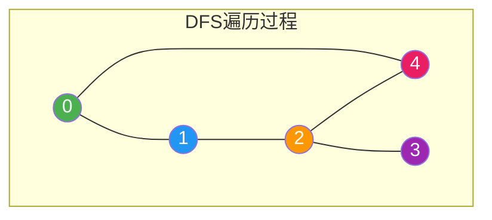

**DFS 访问顺序（从节点 0 开始）**：

```
步骤1: 访问 0, 标记 visited[0] = 1
       路径: [0]
       
步骤2: 发现邻居 1, 递归访问 1
       路径: [0, 1]
       
步骤3: 发现邻居 2 (1的邻居), 递归访问 2
       路径: [0, 1, 2]
       
步骤4: 发现邻居 3 (2的邻居), 递归访问 3
       路径: [0, 1, 2, 3]
       
步骤5: 3 无未访问邻居, 回溯到 2
       路径: [0, 1, 2]
       
步骤6: 发现邻居 4 (2的邻居), 递归访问 4
       路径: [0, 1, 2, 4]
       
步骤7: 4 的邻居 0, 2 都已访问, 回溯
       最终路径: 0 → 1 → 2 → 3 → 4
```

### DFS 搜索树

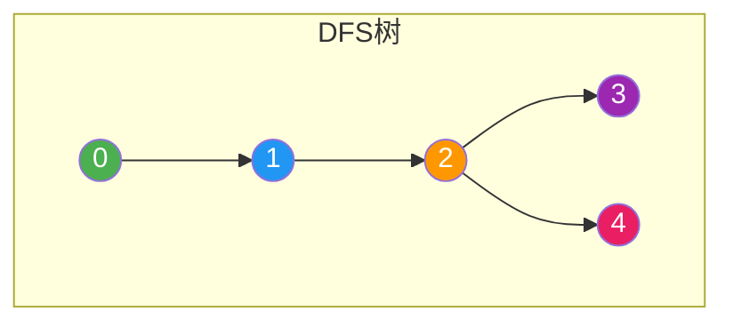

### 递归实现

```c
#define MAX_V 100

int visited[MAX_V];

void dfs(int graph[MAX_V][MAX_V], int v, int n) {
    visited[v] = 1;          // 标记已访问
    printf("%d ", v);        // 访问当前节点
    
    // 递归访问所有未访问的邻接节点
    for (int i = 0; i < n; i++) {
        if (graph[v][i] && !visited[i]) {
            dfs(graph, i, n);
        }
    }
}

void dfsTraverse(int graph[MAX_V][MAX_V], int n) {
    // 初始化访问标记
    for (int i = 0; i < n; i++) visited[i] = 0;
    
    // 遍历所有顶点，处理非连通图
    for (int i = 0; i < n; i++) {
        if (!visited[i]) {
            dfs(graph, i, n);
        }
    }
}
```

### 栈实现（非递归）

```c
void dfsStack(int graph[MAX_V][MAX_V], int start, int n) {
    int visited[MAX_V] = {0};
    int stack[MAX_V];
    int top = -1;
    
    stack[++top] = start;     // 起点入栈
    visited[start] = 1;
    
    while (top >= 0) {
        int v = stack[top--]; // 出栈
        printf("%d ", v);
        
        // 将邻接节点入栈（逆序保证顺序一致）
        for (int i = n - 1; i >= 0; i--) {
            if (graph[v][i] && !visited[i]) {
                stack[++top] = i;
                visited[i] = 1;
            }
        }
    }
}
```

### DFS 执行流程

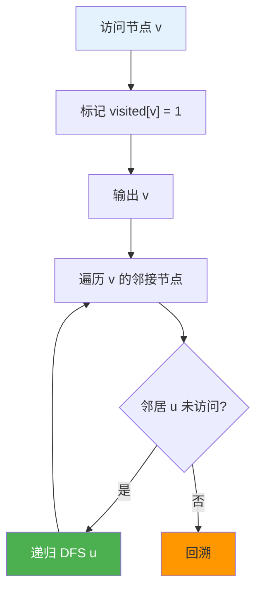

## 广度优先搜索（BFS）

### 基本思想

从起始顶点出发，先访问所有邻接顶点，再访问这些邻接顶点的邻接顶点，层层向外扩展。

### BFS 过程可视化

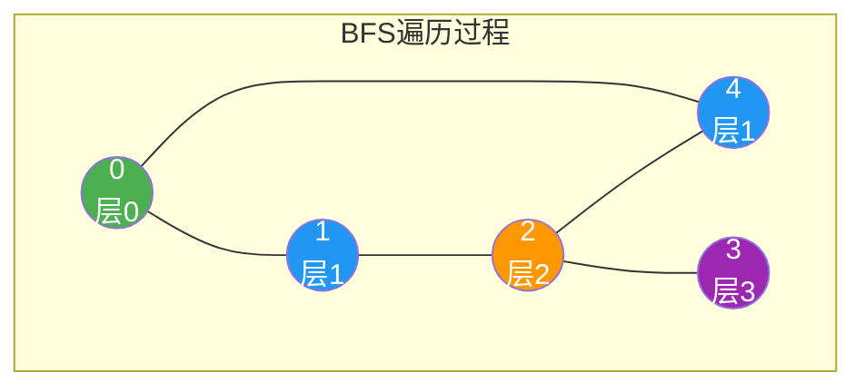

**BFS 访问顺序（从节点 0 开始）**：

```
初始: 队列 = [0], visited = {0}

步骤1: 出队 0, 访问 0
       入队邻居 1, 4
       队列 = [1, 4], visited = {0, 1, 4}
       
步骤2: 出队 1, 访问 1
       邻居 2 入队
       队列 = [4, 2], visited = {0, 1, 4, 2}
       
步骤3: 出队 4, 访问 4
       邻居 0, 2 已访问
       队列 = [2]
       
步骤4: 出队 2, 访问 2
       邻居 3 入队
       队列 = [3], visited = {0, 1, 4, 2, 3}
       
步骤5: 出队 3, 访问 3
       无新邻居入队
       队列 = [], 结束

最终顺序: 0 → 1 → 4 → 2 → 3
```

### BFS 搜索树

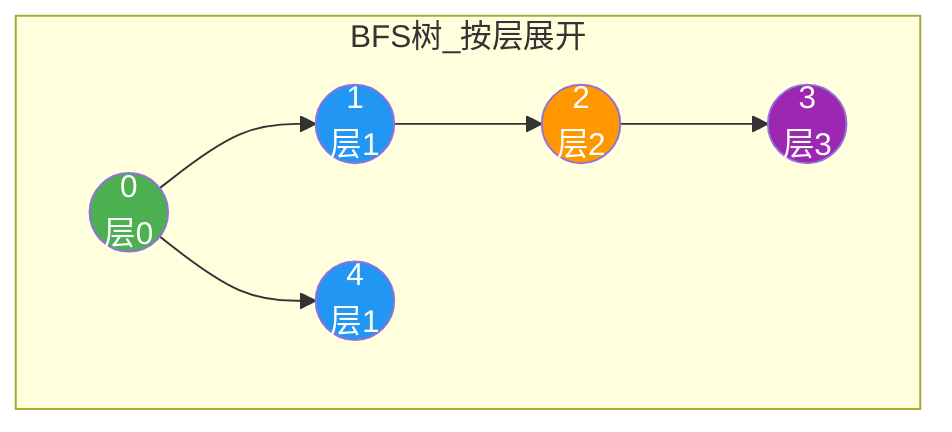

<div style="background: #E8F5E9; border-left: 4px solid #4CAF50; padding: 12px; margin: 10px 0;">
<strong>BFS 重要性质</strong>：在无权图中，BFS 能找到从起点到任意节点的最短路径（边数最少）。BFS 树的每一层对应到起点距离相同的所有节点。
</div>

### 队列实现

```c
void bfs(int graph[MAX_V][MAX_V], int start, int n) {
    int visited[MAX_V] = {0};
    int queue[MAX_V];
    int front = 0, rear = 0;
    
    queue[rear++] = start;    // 起点入队
    visited[start] = 1;
    
    while (front < rear) {
        int v = queue[front++]; // 出队
        printf("%d ", v);
        
        // 将未访问的邻接节点入队
        for (int i = 0; i < n; i++) {
            if (graph[v][i] && !visited[i]) {
                queue[rear++] = i;
                visited[i] = 1;
            }
        }
    }
}
```

### 带距离的 BFS

```c
void bfsWithDistance(int graph[MAX_V][MAX_V], int start, int n, int dist[]) {
    int visited[MAX_V] = {0};
    int queue[MAX_V];
    int front = 0, rear = 0;
    
    queue[rear++] = start;
    visited[start] = 1;
    dist[start] = 0;
    
    while (front < rear) {
        int v = queue[front++];
        
        for (int i = 0; i < n; i++) {
            if (graph[v][i] && !visited[i]) {
                queue[rear++] = i;
                visited[i] = 1;
                dist[i] = dist[v] + 1;  // 距离加 1
            }
        }
    }
}
```

### BFS 执行流程

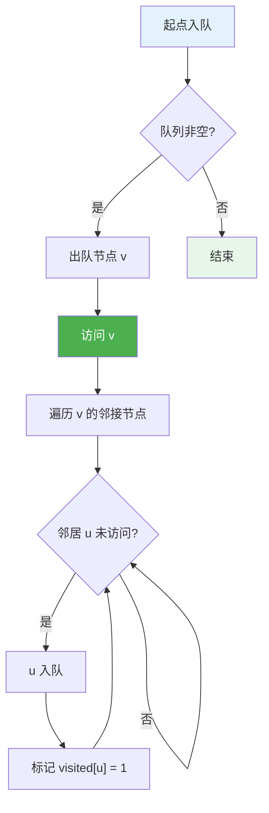

## 邻接表实现

### 数据结构定义

```c
typedef struct EdgeNode {
    int dest;                   // 目标顶点
    int weight;                 // 边权值（可选）
    struct EdgeNode *next;      // 下一条边
} EdgeNode;

typedef struct {
    EdgeNode *head;             // 邻接表头指针
} Vertex;

typedef struct {
    Vertex vertices[MAX_V];     // 顶点数组
    int numVertices;            // 顶点数
} Graph;
```

### DFS（邻接表）

```c
void dfsAdjList(Graph *g, int v, int visited[]) {
    visited[v] = 1;
    printf("%d ", v);
    
    EdgeNode *edge = g->vertices[v].head;
    while (edge) {
        if (!visited[edge->dest]) {
            dfsAdjList(g, edge->dest, visited);
        }
        edge = edge->next;
    }
}
```

### BFS（邻接表）

```c
void bfsAdjList(Graph *g, int start) {
    int visited[MAX_V] = {0};
    int queue[MAX_V];
    int front = 0, rear = 0;
    
    queue[rear++] = start;
    visited[start] = 1;
    
    while (front < rear) {
        int v = queue[front++];
        printf("%d ", v);
        
        EdgeNode *edge = g->vertices[v].head;
        while (edge) {
            if (!visited[edge->dest]) {
                queue[rear++] = edge->dest;
                visited[edge->dest] = 1;
            }
            edge = edge->next;
        }
    }
}
```

## C++ 实现

```cpp
#include <vector>
#include <queue>
#include <stack>
#include <iostream>

class Graph {
private:
    std::vector<std::vector<int>> adj;  // 邻接表
    int n;
    
public:
    Graph(int vertices) : n(vertices), adj(vertices) {}
    
    void addEdge(int u, int v) {
        adj[u].push_back(v);
        adj[v].push_back(u);  // 无向图
    }
    
    void addDirectedEdge(int u, int v) {
        adj[u].push_back(v);  // 有向图
    }
    
    // DFS 递归
    void dfs(int start) {
        std::vector<bool> visited(n, false);
        dfsUtil(start, visited);
    }
    
    void dfsUtil(int v, std::vector<bool>& visited) {
        visited[v] = true;
        std::cout << v << " ";
        
        for (int u : adj[v]) {
            if (!visited[u]) {
                dfsUtil(u, visited);
            }
        }
    }
    
    // DFS 非递归
    void dfsStack(int start) {
        std::vector<bool> visited(n, false);
        std::stack<int> s;
        
        s.push(start);
        visited[start] = true;
        
        while (!s.empty()) {
            int v = s.top();
            s.pop();
            std::cout << v << " ";
            
            for (auto it = adj[v].rbegin(); it != adj[v].rend(); ++it) {
                if (!visited[*it]) {
                    s.push(*it);
                    visited[*it] = true;
                }
            }
        }
    }
    
    // BFS
    void bfs(int start) {
        std::vector<bool> visited(n, false);
        std::queue<int> q;
        
        q.push(start);
        visited[start] = true;
        
        while (!q.empty()) {
            int v = q.front();
            q.pop();
            std::cout << v << " ";
            
            for (int u : adj[v]) {
                if (!visited[u]) {
                    q.push(u);
                    visited[u] = true;
                }
            }
        }
    }
    
    // BFS 带距离
    std::vector<int> bfsWithDistance(int start) {
        std::vector<bool> visited(n, false);
        std::vector<int> dist(n, -1);
        std::queue<int> q;
        
        q.push(start);
        visited[start] = true;
        dist[start] = 0;
        
        while (!q.empty()) {
            int v = q.front();
            q.pop();
            
            for (int u : adj[v]) {
                if (!visited[u]) {
                    q.push(u);
                    visited[u] = true;
                    dist[u] = dist[v] + 1;
                }
            }
        }
        
        return dist;
    }
};
```

## DFS vs BFS 对比

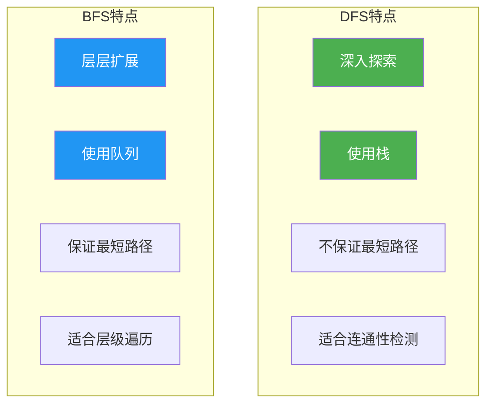

| 特性 | DFS | BFS |
|------|-----|-----|
| 数据结构 | 栈（递归或显式栈） | 队列 |
| 遍历顺序 | 深入优先 | 层次优先 |
| 路径特点 | 任意路径 | 最短路径（无权图） |
| 空间复杂度 | O(V) | O(V) |
| 适用场景 | 连通性、环检测、拓扑排序 | 最短路径、层级遍历、二分图 |

## 复杂度分析

| 算法 | 邻接矩阵 | 邻接表 | 说明 |
|------|---------|--------|------|
| DFS | O(V²) | O(V + E) | 每个顶点和边访问一次 |
| BFS | O(V²) | O(V + E) | 每个顶点和边访问一次 |

### 复杂度分析详解

```
邻接矩阵:
- 遍历每个顶点: O(V)
- 检查每个顶点的所有邻接点: O(V)
- 总复杂度: O(V × V) = O(V²)

邻接表:
- 遍历每个顶点: O(V)
- 遍历所有边: O(E)
- 总复杂度: O(V + E)
```

<div style="background: #FFF3E0; border-left: 4px solid #FF9800; padding: 12px; margin: 10px 0;">
<strong>注意</strong>：对于稀疏图（E << V²），邻接表效率更高；对于稠密图（E ≈ V²），邻接矩阵可能更合适（缓存友好）。
</div>

## 应用场景

### 1. 连通分量计数

```c
int connectedComponents(int graph[MAX_V][MAX_V], int n) {
    int visited[MAX_V] = {0};
    int count = 0;
    
    for (int i = 0; i < n; i++) {
        if (!visited[i]) {
            dfs(graph, i, n);  // 一次 DFS 访问一个连通分量
            count++;
        }
    }
    
    return count;
}
```

**连通分量可视化**：

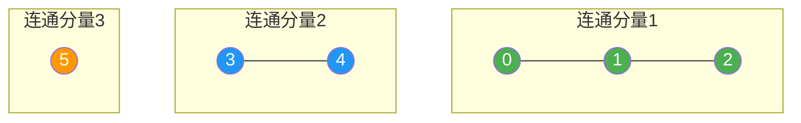

### 2. 环检测

**无向图环检测**：

```c
int hasCycleUtil(int graph[MAX_V][MAX_V], int v, int visited[], int parent, int n) {
    visited[v] = 1;
    
    for (int i = 0; i < n; i++) {
        if (graph[v][i]) {
            if (!visited[i]) {
                if (hasCycleUtil(graph, i, visited, v, n)) return 1;
            } else if (i != parent) {
                // 访问到已访问节点且不是父节点，说明有环
                return 1;
            }
        }
    }
    
    return 0;
}

int hasCycle(int graph[MAX_V][MAX_V], int n) {
    int visited[MAX_V] = {0};
    
    for (int i = 0; i < n; i++) {
        if (!visited[i]) {
            if (hasCycleUtil(graph, i, visited, -1, n)) return 1;
        }
    }
    
    return 0;
}
```

**环检测原理**：

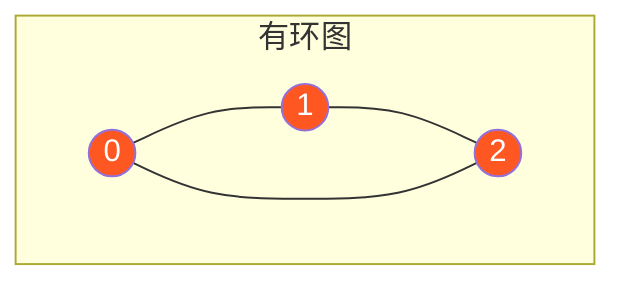

```
环检测过程:
1. DFS(0): visited[0] = 1
2. 发现邻居 1, DFS(1): visited[1] = 1, parent = 0
3. 发现邻居 2, DFS(2): visited[2] = 1, parent = 1
4. 发现邻居 0, visited[0] = 1 且 0 != parent(1)
5. 检测到环！
```

### 3. 拓扑排序（DFS）

```c
void topologicalSortUtil(int graph[MAX_V][MAX_V], int v, int visited[], 
                         int stack[], int *top, int n) {
    visited[v] = 1;
    
    for (int i = 0; i < n; i++) {
        if (graph[v][i] && !visited[i]) {
            topologicalSortUtil(graph, i, visited, stack, top, n);
        }
    }
    
    stack[(*top)++] = v;  // 回溯时入栈
}

void topologicalSort(int graph[MAX_V][MAX_V], int n) {
    int visited[MAX_V] = {0};
    int stack[MAX_V];
    int top = 0;
    
    for (int i = 0; i < n; i++) {
        if (!visited[i]) {
            topologicalSortUtil(graph, i, visited, stack, &top, n);
        }
    }
    
    // 逆序输出
    for (int i = n - 1; i >= 0; i--) {
        printf("%d ", stack[i]);
    }
}
```

**拓扑排序可视化**：

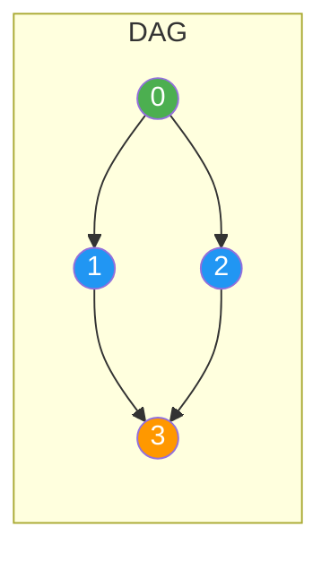

```
拓扑排序结果之一: 0 → 2 → 1 → 3 或 0 → 1 → 2 → 3
```

### 4. 二分图检测（BFS）

```c
int isBipartite(int graph[MAX_V][MAX_V], int n) {
    int color[MAX_V];
    for (int i = 0; i < n; i++) color[i] = -1;
    
    for (int start = 0; start < n; start++) {
        if (color[start] != -1) continue;
        
        int queue[MAX_V];
        int front = 0, rear = 0;
        queue[rear++] = start;
        color[start] = 0;
        
        while (front < rear) {
            int v = queue[front++];
            
            for (int i = 0; i < n; i++) {
                if (graph[v][i]) {
                    if (color[i] == -1) {
                        color[i] = 1 - color[v];  // 染相反颜色
                        queue[rear++] = i;
                    } else if (color[i] == color[v]) {
                        return 0;  // 相邻节点同色，不是二分图
                    }
                }
            }
        }
    }
    
    return 1;
}
```

**二分图可视化**：

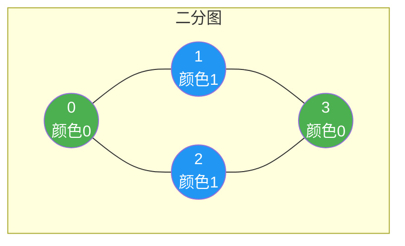

### 5. 最短路径（BFS 无权图）

```c
void shortestPath(int graph[MAX_V][MAX_V], int start, int end, int n) {
    int visited[MAX_V] = {0};
    int parent[MAX_V];
    int dist[MAX_V];
    int queue[MAX_V];
    int front = 0, rear = 0;
    
    for (int i = 0; i < n; i++) {
        parent[i] = -1;
        dist[i] = -1;
    }
    
    queue[rear++] = start;
    visited[start] = 1;
    dist[start] = 0;
    
    while (front < rear) {
        int v = queue[front++];
        
        if (v == end) break;
        
        for (int i = 0; i < n; i++) {
            if (graph[v][i] && !visited[i]) {
                queue[rear++] = i;
                visited[i] = 1;
                parent[i] = v;
                dist[i] = dist[v] + 1;
            }
        }
    }
    
    // 输出路径
    if (dist[end] != -1) {
        printf("最短距离: %d\n", dist[end]);
        printf("路径: ");
        printPath(parent, end);
    }
}
```

### 6. 网格 BFS（迷宫问题）

```cpp
vector<vector<int>> dirs = {{0, 1}, {1, 0}, {0, -1}, {-1, 0}};

int shortestPathBinaryMatrix(vector<vector<int>>& grid) {
    int n = grid.size();
    if (grid[0][0] == 1 || grid[n-1][n-1] == 1) return -1;
    
    queue<pair<int,int>> q;
    q.push({0, 0});
    grid[0][0] = 1;
    int dist = 1;
    
    while (!q.empty()) {
        int size = q.size();
        for (int i = 0; i < size; i++) {
            auto [r, c] = q.front();
            q.pop();
            
            if (r == n-1 && c == n-1) return dist;
            
            for (auto& d : dirs) {
                int nr = r + d[0], nc = c + d[1];
                if (nr >= 0 && nr < n && nc >= 0 && nc < n && grid[nr][nc] == 0) {
                    q.push({nr, nc});
                    grid[nr][nc] = 1;
                }
            }
        }
        dist++;
    }
    
    return -1;
}
```

## 时间复杂度总结

| 操作 | DFS | BFS | 说明 |
|------|-----|-----|------|
| 基本遍历 | O(V + E) | O(V + E) | 邻接表 |
| 基本遍历 | O(V²) | O(V²) | 邻接矩阵 |
| 连通分量 | O(V + E) | O(V + E) | 一次遍历 |
| 环检测 | O(V + E) | - | DFS |
| 拓扑排序 | O(V + E) | - | DFS |
| 二分图 | - | O(V + E) | BFS 染色 |
| 最短路径（无权） | - | O(V + E) | BFS |

## 典型问题示例

### LeetCode 200. 岛屿数量

```cpp
void dfs(vector<vector<char>>& grid, int i, int j) {
    if (i < 0 || i >= grid.size() || j < 0 || j >= grid[0].size()) return;
    if (grid[i][j] != '1') return;
    
    grid[i][j] = '2';  // 标记已访问
    
    dfs(grid, i + 1, j);
    dfs(grid, i - 1, j);
    dfs(grid, i, j + 1);
    dfs(grid, i, j - 1);
}

int numIslands(vector<vector<char>>& grid) {
    int count = 0;
    for (int i = 0; i < grid.size(); i++) {
        for (int j = 0; j < grid[0].size(); j++) {
            if (grid[i][j] == '1') {
                dfs(grid, i, j);
                count++;
            }
        }
    }
    return count;
}
```

### LeetCode 207. 课程表（拓扑排序）

```cpp
bool canFinish(int numCourses, vector<vector<int>>& prerequisites) {
    vector<vector<int>> adj(numCourses);
    vector<int> indegree(numCourses, 0);
    
    for (auto& p : prerequisites) {
        adj[p[1]].push_back(p[0]);
        indegree[p[0]]++;
    }
    
    queue<int> q;
    for (int i = 0; i < numCourses; i++) {
        if (indegree[i] == 0) q.push(i);
    }
    
    int count = 0;
    while (!q.empty()) {
        int course = q.front();
        q.pop();
        count++;
        
        for (int next : adj[course]) {
            if (--indegree[next] == 0) {
                q.push(next);
            }
        }
    }
    
    return count == numCourses;
}
```

## 参考资料

- 《算法导论》第22章：基本图算法
- 《数据结构与算法分析》第9章：图论算法
- 《算法》（Sedgewick）第4章：图
