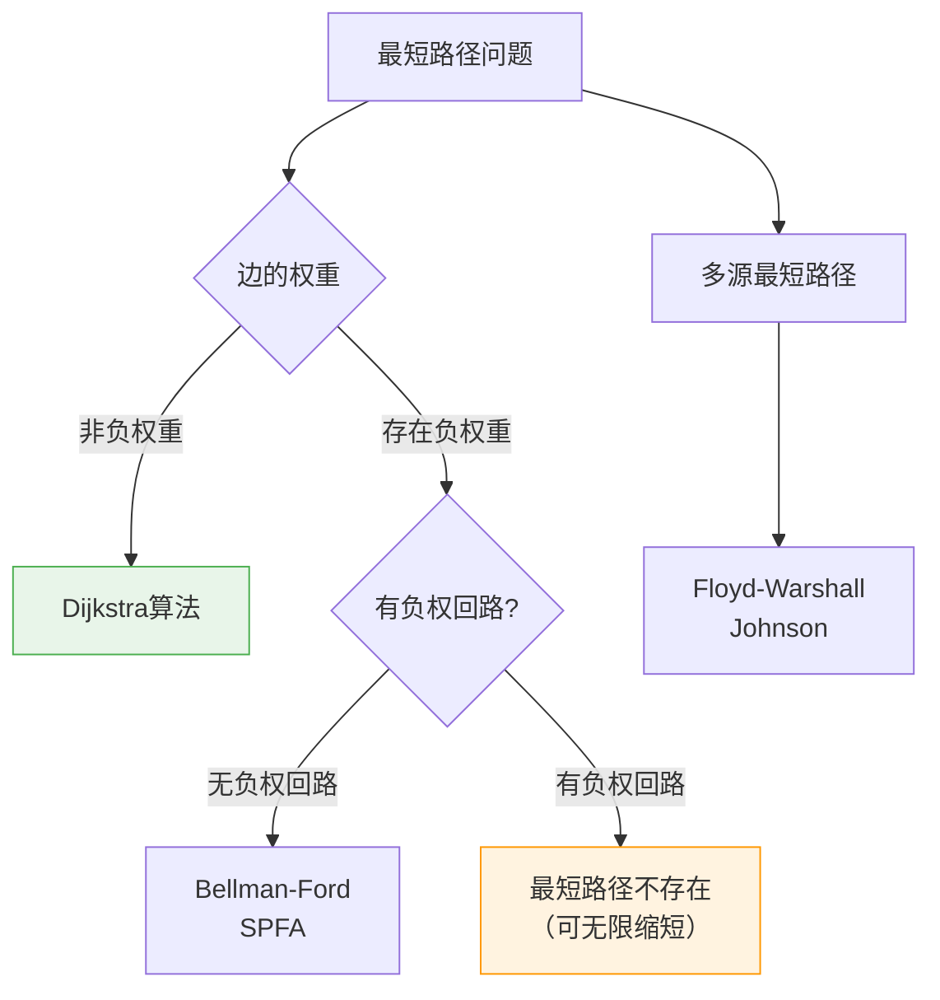
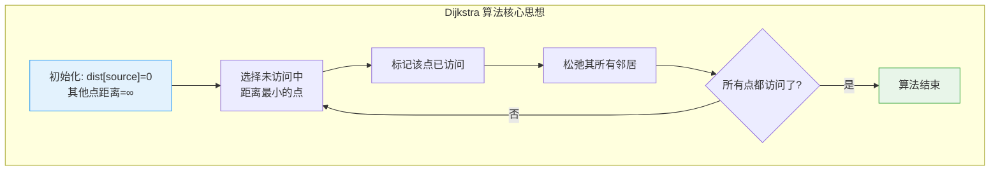
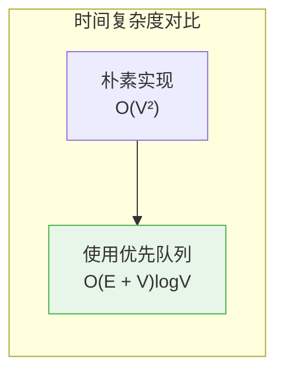
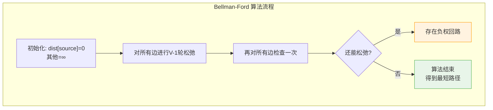
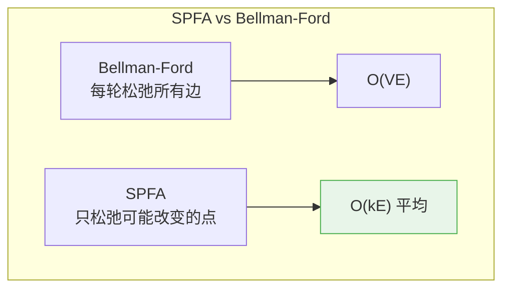
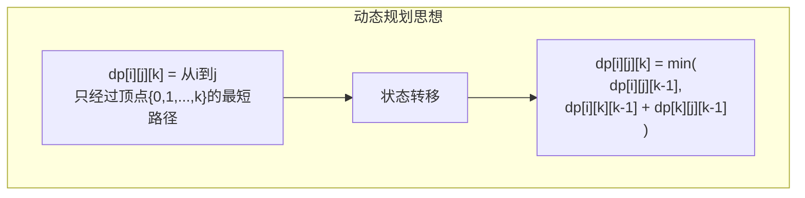
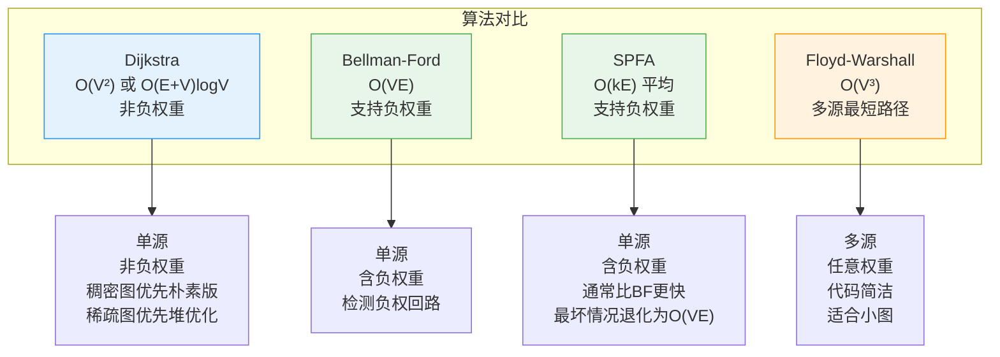

# 最短路径算法

## 概述

最短路径问题是图论中的经典问题，目标是找到图中两个顶点之间的最短路径。根据问题类型，可分为：

<div style="background-color: #E3F2FD; padding: 15px; margin: 10px 0; border-left: 4px solid #2196F3; border-radius: 5px;">
    <strong>问题类型</strong>
    <ul style="margin: 5px 0;">
        <li><strong>单源最短路径</strong>：求一个源点到所有其他点的最短路径</li>
        <li><strong>多源最短路径</strong>：求任意两点之间的最短路径</li>
        <li><strong>单对最短路径</strong>：求特定两点之间的最短路径</li>
    </ul>
</div>

!!! note "生活类比"
    想象你使用导航软件规划路线：从当前位置到目的地可能有多条路径，导航会找出最短（或最快）的那条。最短路径算法就是解决这类问题的数学工具。

## 问题分类与算法选择



## Dijkstra 算法

### 算法原理

Dijkstra 算法由荷兰计算机科学家 Edsger W. Dijkstra 于 1956 年提出，适用于**非负权重图**的单源最短路径问题。



### 松弛操作

<div style="background-color: #F3E5F5; padding: 15px; margin: 10px 0; border-left: 4px solid #9C27B0; border-radius: 5px;">
    <strong>松弛（Relaxation）操作</strong>
    <p>对边 (u, v)，如果 dist[u] + weight(u,v) < dist[v]，则更新 dist[v]：</p>
    <p style="text-align: center; font-size: 1.2em;"><code>dist[v] = min(dist[v], dist[u] + weight(u, v))</code></p>
    <p>含义：如果经过 u 到达 v 的路径更短，则更新 v 的最短距离。</p>
</div>

### 算法执行过程

```
示例图:
        10
    A ──────→ B
    │╲        │╲
   5│ ╲15    1│ ╲2
    ↓  ╲      ↓  ╲
    C───→E───→D───→F
       2     3     4

从 A 出发，求到所有点的最短路径

步骤1: 初始化
┌────────────────────────────────────────────────────┐
│ 顶点   │  A  │  B  │  C  │  D  │  E  │  F  │      │
├────────────────────────────────────────────────────┤
│ 距离   │  0  │  ∞  │  ∞  │  ∞  │  ∞  │  ∞  │      │
│ 状态   │ ✓   │     │     │     │     │     │      │
└────────────────────────────────────────────────────┘
              ↑
           当前点: A

步骤2: 选择 A，松弛邻居 B, C, E
┌────────────────────────────────────────────────────┐
│ 松弛 B: dist[A] + 10 = 10 < ∞ → dist[B] = 10      │
│ 松弛 C: dist[A] + 5 = 5 < ∞ → dist[C] = 5         │
│ 松弛 E: dist[A] + 15 = 15 < ∞ → dist[E] = 15      │
└────────────────────────────────────────────────────┘
┌────────────────────────────────────────────────────┐
│ 顶点   │  A  │  B  │  C  │  D  │  E  │  F  │      │
├────────────────────────────────────────────────────┤
│ 距离   │  0  │ 10  │  5  │  ∞  │ 15  │  ∞  │      │
│ 状态   │ ✓   │     │ ✓   │     │     │     │      │
└────────────────────────────────────────────────────┘
              ↑
           当前点: C (距离最小)

步骤3: 选择 C，松弛邻居 E
┌────────────────────────────────────────────────────┐
│ 松弛 E: dist[C] + 2 = 7 < 15 → dist[E] = 7 ✓      │
└────────────────────────────────────────────────────┘
┌────────────────────────────────────────────────────┐
│ 顶点   │  A  │  B  │  C  │  D  │  E  │  F  │      │
├────────────────────────────────────────────────────┤
│ 距离   │  0  │ 10  │  5  │  ∞  │  7  │  ∞  │      │
│ 状态   │ ✓   │     │ ✓   │     │ ✓   │     │      │
└────────────────────────────────────────────────────┘
              ↑
           当前点: E (距离最小)

步骤4: 选择 E，松弛邻居 D
┌────────────────────────────────────────────────────┐
│ 松弛 D: dist[E] + 3 = 10 < ∞ → dist[D] = 10       │
└────────────────────────────────────────────────────┘
┌────────────────────────────────────────────────────┐
│ 顶点   │  A  │  B  │  C  │  D  │  E  │  F  │      │
├────────────────────────────────────────────────────┤
│ 距离   │  0  │ 10  │  5  │ 10  │  7  │  ∞  │      │
│ 状态   │ ✓   │     │ ✓   │     │ ✓   │     │      │
└────────────────────────────────────────────────────┘
              ↑
           当前点: B 或 D (都是10)

步骤5: 选择 B，松弛邻居 D, F
┌────────────────────────────────────────────────────┐
│ 松弛 D: dist[B] + 1 = 11 > 10 → 不更新            │
│ 松弛 F: dist[B] + 2 = 12 < ∞ → dist[F] = 12       │
└────────────────────────────────────────────────────┘
┌────────────────────────────────────────────────────┐
│ 顶点   │  A  │  B  │  C  │  D  │  E  │  F  │      │
├────────────────────────────────────────────────────┤
│ 距离   │  0  │ 10  │  5  │ 10  │  7  │ 12  │      │
│ 状态   │ ✓   │ ✓   │ ✓   │     │ ✓   │     │      │
└────────────────────────────────────────────────────┘
              ↑
           当前点: D

步骤6: 选择 D，松弛邻居 F
┌────────────────────────────────────────────────────┐
│ 松弛 F: dist[D] + 4 = 14 > 12 → 不更新            │
└────────────────────────────────────────────────────┘
┌────────────────────────────────────────────────────┐
│ 顶点   │  A  │  B  │  C  │  D  │  E  │  F  │      │
├────────────────────────────────────────────────────┤
│ 距离   │  0  │ 10  │  5  │ 10  │  7  │ 12  │      │
│ 状态   │ ✓   │ ✓   │ ✓   │ ✓   │ ✓   │ ✓   │      │
└────────────────────────────────────────────────────┘

最终结果:
A→A: 0
A→B: 10 (A→B)
A→C: 5 (A→C)
A→D: 10 (A→C→E→D 或 A→B→D)
A→E: 7 (A→C→E)
A→F: 12 (A→B→F)
```

### 基本实现（邻接矩阵）

```c
#include <stdio.h>
#include <limits.h>

#define V 6
#define INF INT_MAX

// 找到未访问顶点中距离最小的
int minDistance(int dist[], int visited[]) {
    int min = INF, minIndex = -1;
    
    for (int v = 0; v < V; v++) {
        if (!visited[v] && dist[v] <= min) {
            min = dist[v];
            minIndex = v;
        }
    }
    
    return minIndex;
}

// 打印最短路径
void printPath(int parent[], int j) {
    if (parent[j] == -1) {
        printf("%c", 'A' + j);
        return;
    }
    printPath(parent, parent[j]);
    printf(" -> %c", 'A' + j);
}

// Dijkstra 算法
void dijkstra(int graph[V][V], int src) {
    int dist[V];       // 最短距离数组
    int visited[V];    // 访问标记
    int parent[V];     // 路径前驱
    
    // 初始化
    for (int i = 0; i < V; i++) {
        dist[i] = INF;
        visited[i] = 0;
        parent[i] = -1;
    }
    dist[src] = 0;
    
    printf("Dijkstra 算法执行过程:\n\n");
    
    // 对所有顶点执行
    for (int count = 0; count < V - 1; count++) {
        // 选择未访问中距离最小的顶点
        int u = minDistance(dist, visited);
        if (u == -1) break;  // 无法到达的顶点
        
        visited[u] = 1;
        printf("选择顶点 %c, 距离=%d\n", 'A' + u, dist[u]);
        
        // 松弛所有邻居
        for (int v = 0; v < V; v++) {
            if (!visited[v] && graph[u][v] != INF && 
                dist[u] != INF && 
                dist[u] + graph[u][v] < dist[v]) {
                
                dist[v] = dist[u] + graph[u][v];
                parent[v] = u;
                printf("  松弛 %c: dist[%c] = %d\n", 
                       'A' + v, 'A' + v, dist[v]);
            }
        }
        printf("\n");
    }
    
    // 打印结果
    printf("\n最短路径结果:\n");
    printf("目标\t距离\t路径\n");
    for (int i = 0; i < V; i++) {
        printf("%c\t", 'A' + i);
        if (dist[i] == INF) {
            printf("不可达\t-\n");
        } else {
            printf("%d\t", dist[i]);
            printPath(parent, i);
            printf("\n");
        }
    }
}

int main() {
    // 邻接矩阵表示的图
    int graph[V][V] = {
        //A    B    C    D    E    F
        {INF,  10,   5, INF,  15, INF},  // A
        {INF, INF, INF,   1, INF,   2},  // B
        {INF, INF, INF, INF,   2, INF},  // C
        {INF, INF, INF, INF, INF,   4},  // D
        {INF, INF, INF,   3, INF, INF},  // E
        {INF, INF, INF, INF, INF, INF}   // F
    };
    
    dijkstra(graph, 0);  // 从 A 开始
    
    return 0;
}
```

### 优先队列优化版本



```c
#include <stdio.h>
#include <stdlib.h>
#include <limits.h>

#define V 6
#define INF INT_MAX

typedef struct {
    int vertex;
    int distance;
} HeapNode;

typedef struct {
    HeapNode *nodes;
    int size;
    int capacity;
} MinHeap;

// 创建最小堆
MinHeap* createMinHeap(int capacity) {
    MinHeap *heap = (MinHeap*)malloc(sizeof(MinHeap));
    heap->nodes = (HeapNode*)malloc(capacity * sizeof(HeapNode));
    heap->size = 0;
    heap->capacity = capacity;
    return heap;
}

// 交换堆节点
void swapHeapNodes(HeapNode *a, HeapNode *b) {
    HeapNode temp = *a;
    *a = *b;
    *b = temp;
}

// 最小堆化
void minHeapify(MinHeap *heap, int idx) {
    int smallest = idx;
    int left = 2 * idx + 1;
    int right = 2 * idx + 2;
    
    if (left < heap->size && 
        heap->nodes[left].distance < heap->nodes[smallest].distance)
        smallest = left;
    
    if (right < heap->size && 
        heap->nodes[right].distance < heap->nodes[smallest].distance)
        smallest = right;
    
    if (smallest != idx) {
        swapHeapNodes(&heap->nodes[idx], &heap->nodes[smallest]);
        minHeapify(heap, smallest);
    }
}

// 插入堆
void insertHeap(MinHeap *heap, int vertex, int distance) {
    if (heap->size == heap->capacity) return;
    
    int i = heap->size++;
    heap->nodes[i].vertex = vertex;
    heap->nodes[i].distance = distance;
    
    // 向上调整
    while (i != 0 && 
           heap->nodes[(i-1)/2].distance > heap->nodes[i].distance) {
        swapHeapNodes(&heap->nodes[i], &heap->nodes[(i-1)/2]);
        i = (i - 1) / 2;
    }
}

// 提取最小值
HeapNode extractMin(MinHeap *heap) {
    if (heap->size == 0) {
        HeapNode empty = {-1, INF};
        return empty;
    }
    
    HeapNode min = heap->nodes[0];
    heap->nodes[0] = heap->nodes[--heap->size];
    minHeapify(heap, 0);
    
    return min;
}

// Dijkstra 优先队列优化版本
void dijkstraOptimized(int graph[V][V], int src) {
    int dist[V];
    int parent[V];
    int visited[V] = {0};
    
    for (int i = 0; i < V; i++) {
        dist[i] = INF;
        parent[i] = -1;
    }
    dist[src] = 0;
    
    MinHeap *heap = createMinHeap(V * V);
    insertHeap(heap, src, 0);
    
    printf("优先队列优化的 Dijkstra:\n\n");
    
    while (heap->size > 0) {
        HeapNode min = extractMin(heap);
        int u = min.vertex;
        
        if (visited[u]) continue;
        visited[u] = 1;
        
        printf("处理顶点 %c, 距离=%d\n", 'A' + u, dist[u]);
        
        // 遍历所有邻接顶点
        for (int v = 0; v < V; v++) {
            if (graph[u][v] != INF && !visited[v]) {
                int newDist = dist[u] + graph[u][v];
                if (newDist < dist[v]) {
                    dist[v] = newDist;
                    parent[v] = u;
                    insertHeap(heap, v, newDist);
                    printf("  更新 %c: dist=%d\n", 'A' + v, dist[v]);
                }
            }
        }
    }
    
    printf("\n最短距离:\n");
    for (int i = 0; i < V; i++) {
        printf("%c: %d\n", 'A' + i, dist[i] == INF ? -1 : dist[i]);
    }
    
    free(heap->nodes);
    free(heap);
}
```

## Bellman-Ford 算法

### 算法原理

Bellman-Ford 算法适用于**包含负权边**的图，并能检测负权回路。



### 为什么需要 V-1 轮松弛？

<div style="background-color: #F3E5F5; padding: 15px; margin: 10px 0; border-left: 4px solid #9C27B0; border-radius: 5px;">
    <strong>原理说明</strong>
    <p>最短路径最多包含 V-1 条边（经过 V 个顶点）</p>
    <p>第 i 轮松弛后，确定了最多经过 i 条边的最短路径</p>
    <p>因此 V-1 轮后，所有最短路径都已确定</p>
</div>

```
示例图（含负权边）:

    A ──4──→ B
    │        │
    3        -2
    ↓        ↓
    C ──1──→ D

从 A 出发:

初始化:
┌─────────────────────────────────┐
│ 顶点  │  A  │  B  │  C  │  D  │
├─────────────────────────────────┤
│ 距离  │  0  │  ∞  │  ∞  │  ∞  │
└─────────────────────────────────┘

第1轮松弛（对所有边）:
┌─────────────────────────────────────────────────────┐
│ 边(A,B): dist[A]+4=4 < ∞ → dist[B]=4               │
│ 边(A,C): dist[A]+3=3 < ∞ → dist[C]=3               │
│ 边(B,D): dist[B]+(-2)=2 < ∞ → dist[D]=2            │
│ 边(C,D): dist[C]+1=4 > 2 → 不更新                  │
└─────────────────────────────────────────────────────┘
┌─────────────────────────────────┐
│ 顶点  │  A  │  B  │  C  │  D  │
├─────────────────────────────────┤
│ 距离  │  0  │  4  │  3  │  2  │
└─────────────────────────────────┘

第2轮松弛:
┌─────────────────────────────────────────────────────┐
│ 边(A,B): 0+4=4 ≥ 4 → 不更新                        │
│ 边(A,C): 0+3=3 ≥ 3 → 不更新                        │
│ 边(B,D): 4+(-2)=2 ≥ 2 → 不更新                     │
│ 边(C,D): 3+1=4 > 2 → 不更新                        │
└─────────────────────────────────────────────────────┘
没有变化，算法收敛

最终结果: A→D 的最短距离是 2 (A→B→D)
```

### 负权回路检测

```
负权回路示例:

    A ──3──→ B
    ↑        │
    │        -4
    └─────────┘

从 A 出发:

每轮松弛后 dist[B] 和 dist[A] 都会减小:
┌─────────────────────────────────────────────────────┐
│ 第1轮: dist[A]=0, dist[B]=3                        │
│ 第2轮: dist[A]=-1, dist[B]=2  (A→B→A 形成负回路)  │
│ 第3轮: dist[A]=-5, dist[B]=-2                      │
│ ...无限减小...                                      │
└─────────────────────────────────────────────────────┘

结论: 存在负权回路，最短路径无定义
```

### 实现

```c
#include <stdio.h>
#include <limits.h>

#define V 4
#define E 4
#define INF INT_MAX

typedef struct {
    int src, dest, weight;
} Edge;

void bellmanFord(Edge edges[], int src) {
    int dist[V];
    int parent[V];
    
    // 初始化
    for (int i = 0; i < V; i++) {
        dist[i] = INF;
        parent[i] = -1;
    }
    dist[src] = 0;
    
    printf("Bellman-Ford 算法执行:\n\n");
    
    // V-1 轮松弛
    for (int i = 1; i < V; i++) {
        printf("第 %d 轮松弛:\n", i);
        int updated = 0;
        
        for (int j = 0; j < E; j++) {
            int u = edges[j].src;
            int v = edges[j].dest;
            int w = edges[j].weight;
            
            if (dist[u] != INF && dist[u] + w < dist[v]) {
                dist[v] = dist[u] + w;
                parent[v] = u;
                updated = 1;
                printf("  边(%c,%c): dist[%c] = %d\n", 
                       'A' + u, 'A' + v, 'A' + v, dist[v]);
            }
        }
        
        if (!updated) {
            printf("  无更新，提前终止\n");
            break;
        }
    }
    
    // 检查负权回路
    printf("\n检查负权回路:\n");
    int hasNegativeCycle = 0;
    for (int j = 0; j < E; j++) {
        int u = edges[j].src;
        int v = edges[j].dest;
        int w = edges[j].weight;
        
        if (dist[u] != INF && dist[u] + w < dist[v]) {
            printf("检测到负权回路！边(%c,%c) 还能松弛\n", 
                   'A' + u, 'A' + v);
            hasNegativeCycle = 1;
        }
    }
    
    if (!hasNegativeCycle) {
        printf("无负权回路\n\n");
        printf("最短距离:\n");
        for (int i = 0; i < V; i++) {
            printf("%c: ", 'A' + i);
            if (dist[i] == INF) printf("不可达\n");
            else printf("%d\n", dist[i]);
        }
    }
}

int main() {
    Edge edges[E] = {
        {0, 1, 4},  // A → B, weight 4
        {0, 2, 3},  // A → C, weight 3
        {1, 3, -2}, // B → D, weight -2
        {2, 3, 1}   // C → D, weight 1
    };
    
    bellmanFord(edges, 0);
    
    return 0;
}
```

## SPFA 算法

SPFA（Shortest Path Faster Algorithm）是 Bellman-Ford 的队列优化版本。



```c
#include <stdio.h>
#include <stdlib.h>
#include <limits.h>

#define V 4
#define INF INT_MAX

typedef struct {
    int vertex;
    int weight;
} Edge;

typedef struct {
    Edge edges[100];
    int count;
} AdjList;

void spfa(AdjList adj[], int src) {
    int dist[V];
    int inQueue[V] = {0};
    int count[V] = {0};  // 入队次数，检测负权回路
    
    for (int i = 0; i < V; i++) {
        dist[i] = INF;
    }
    dist[src] = 0;
    
    // 队列
    int queue[V * V];
    int front = 0, rear = 0;
    queue[rear++] = src;
    inQueue[src] = 1;
    
    printf("SPFA 执行过程:\n\n");
    
    while (front != rear) {
        int u = queue[front++];
        inQueue[u] = 0;
        
        printf("处理顶点 %c, dist=%d\n", 'A' + u, dist[u]);
        
        // 松弛所有邻居
        for (int i = 0; i < adj[u].count; i++) {
            int v = adj[u].edges[i].vertex;
            int w = adj[u].edges[i].weight;
            
            if (dist[u] != INF && dist[u] + w < dist[v]) {
                dist[v] = dist[u] + w;
                printf("  更新 %c: dist=%d\n", 'A' + v, dist[v]);
                
                if (!inQueue[v]) {
                    queue[rear++] = v;
                    inQueue[v] = 1;
                    count[v]++;
                    
                    if (count[v] >= V) {
                        printf("\n检测到负权回路！\n");
                        return;
                    }
                }
            }
        }
    }
    
    printf("\n最短距离:\n");
    for (int i = 0; i < V; i++) {
        printf("%c: %d\n", 'A' + i, dist[i] == INF ? -1 : dist[i]);
    }
}
```

## Floyd-Warshall 算法

### 算法原理

Floyd-Warshall 是**多源最短路径**算法，使用动态规划思想。



<div style="background-color: #E8F5E9; padding: 15px; margin: 10px 0; border-left: 4px solid #4CAF50; border-radius: 5px;">
    <strong>核心思想</strong>
    <p>对于中间顶点 k，从 i 到 j 的最短路径有两种情况：</p>
    <ol style="margin: 5px 0;">
        <li>不经过 k：保持原来的距离</li>
        <li>经过 k：距离 = dist[i][k] + dist[k][j]</li>
    </ol>
    <p>取两者的较小值即可。</p>
</div>

### 算法执行过程

```
示例图:
    0 ──3──→ 1
    │        │
    8        4
    ↓        ↓
    2 ──1──→ 3

初始距离矩阵:
┌────────────────────────────────┐
│      │  0  │  1  │  2  │  3  │
├────────────────────────────────┤
│  0   │  0  │  3  │  8  │  ∞  │
│  1   │  ∞  │  0  │  ∞  │  4  │
│  2   │  ∞  │  ∞  │  0  │  1  │
│  3   │  ∞  │  ∞  │  ∞  │  0  │
└────────────────────────────────┘

k=0（考虑经过顶点0的路径）:
┌────────────────────────────────────────────────────┐
│ dist[1][2] = min(∞, dist[1][0]+dist[0][2]) = ∞    │
│ dist[2][1] = min(∞, dist[2][0]+dist[0][1]) = ∞   │
│ ...（无更新）                                      │
└────────────────────────────────────────────────────┘

k=1（考虑经过顶点1的路径）:
┌────────────────────────────────────────────────────┐
│ dist[0][3] = min(∞, dist[0][1]+dist[1][3]) = 7 ✓  │
│ ...                                                │
└────────────────────────────────────────────────────┘
┌────────────────────────────────┐
│      │  0  │  1  │  2  │  3  │
├────────────────────────────────┤
│  0   │  0  │  3  │  8  │  7  │ ← 更新
│  1   │  ∞  │  0  │  ∞  │  4  │
│  2   │  ∞  │  ∞  │  0  │  1  │
│  3   │  ∞  │  ∞  │  ∞  │  0  │
└────────────────────────────────┘

k=2（考虑经过顶点2的路径）:
┌────────────────────────────────────────────────────┐
│ dist[0][3] = min(7, dist[0][2]+dist[2][3]) = 7    │
│ dist[1][3] = min(4, dist[1][2]+dist[2][3]) = 4   │
└────────────────────────────────────────────────────┘

k=3（考虑经过顶点3的路径）:
┌────────────────────────────────────────────────────┐
│ 无更新                                            │
└────────────────────────────────────────────────────┘

最终距离矩阵:
┌────────────────────────────────┐
│      │  0  │  1  │  2  │  3  │
├────────────────────────────────┤
│  0   │  0  │  3  │  8  │  7  │
│  1   │  ∞  │  0  │  ∞  │  4  │
│  2   │  ∞  │  ∞  │  0  │  1  │
│  3   │  ∞  │  ∞  │  ∞  │  0  │
└────────────────────────────────┘
```

### 实现

```c
#include <stdio.h>
#include <limits.h>

#define V 4
#define INF INT_MAX

void floydWarshall(int dist[V][V]) {
    int next[V][V];  // 用于路径重建
    
    // 初始化 next 数组
    for (int i = 0; i < V; i++) {
        for (int j = 0; j < V; j++) {
            if (dist[i][j] != INF && i != j) {
                next[i][j] = j;
            } else {
                next[i][j] = -1;
            }
        }
    }
    
    printf("Floyd-Warshall 算法执行:\n\n");
    
    // 三重循环
    for (int k = 0; k < V; k++) {
        printf("k = %d:\n", k);
        
        for (int i = 0; i < V; i++) {
            for (int j = 0; j < V; j++) {
                if (dist[i][k] != INF && dist[k][j] != INF &&
                    dist[i][k] + dist[k][j] < dist[i][j]) {
                    
                    dist[i][j] = dist[i][k] + dist[k][j];
                    next[i][j] = next[i][k];
                    
                    printf("  dist[%d][%d] = %d\n", i, j, dist[i][j]);
                }
            }
        }
    }
    
    // 打印最终距离矩阵
    printf("\n最终距离矩阵:\n");
    printf("     ");
    for (int i = 0; i < V; i++) printf("%4d ", i);
    printf("\n");
    
    for (int i = 0; i < V; i++) {
        printf("%4d ", i);
        for (int j = 0; j < V; j++) {
            if (dist[i][j] == INF) printf("  INF ");
            else printf("%5d ", dist[i][j]);
        }
        printf("\n");
    }
    
    // 检测负权回路
    printf("\n检测负权回路:\n");
    int hasNegativeCycle = 0;
    for (int i = 0; i < V; i++) {
        if (dist[i][i] < 0) {
            printf("顶点 %d 存在负权回路\n", i);
            hasNegativeCycle = 1;
        }
    }
    if (!hasNegativeCycle) {
        printf("无负权回路\n");
    }
}

// 打印路径
void printPath(int next[V][V], int u, int v) {
    if (next[u][v] == -1) {
        printf("无路径");
        return;
    }
    printf("%d", u);
    while (u != v) {
        u = next[u][v];
        printf(" -> %d", u);
    }
}

int main() {
    int graph[V][V] = {
        {0,   3,   8, INF},
        {INF, 0, INF,   4},
        {INF, INF, 0,   1},
        {INF, INF, INF, 0}
    };
    
    floydWarshall(graph);
    
    return 0;
}
```

## 算法对比总结



### 详细对比表

```
┌─────────────────────────────────────────────────────────────────────────────┐
│ 算法          │ 时间复杂度       │ 空间复杂度 │ 适用场景           │ 特点   │
├─────────────────────────────────────────────────────────────────────────────┤
│ Dijkstra      │ O(V²) 或         │ O(V)       │ 非负权图，单源     │ 快     │
│               │ O((V+E)logV)     │            │                    │        │
├─────────────────────────────────────────────────────────────────────────────┤
│ Bellman-Ford  │ O(VE)            │ O(V)       │ 含负权边，单源     │ 检测负 │
│               │                  │            │                    │ 权回路 │
├─────────────────────────────────────────────────────────────────────────────┤
│ SPFA          │ O(kE) 平均       │ O(V)       │ 含负权边，单源     │ 通常更 │
│               │ O(VE) 最坏       │            │                    │ 快     │
├─────────────────────────────────────────────────────────────────────────────┤
│ Floyd-Warshall│ O(V³)            │ O(V²)      │ 多源最短路径       │ 代码简 │
│               │                  │            │                    │ 洁     │
└─────────────────────────────────────────────────────────────────────────────┘
```

## 应用场景

### 1. 导航系统

```c
// 城市间道路网络的最短路径规划
typedef struct {
    char name[50];
    double lat, lng;
} City;

void planRoute(City cities[], int graph[][MAX], int src, int dest) {
    // 使用 Dijkstra 计算最短路径
    int dist[MAX], parent[MAX];
    dijkstra(graph, src, dist, parent);
    
    printf("从 %s 到 %s 的最短路线:\n", 
           cities[src].name, cities[dest].name);
    printf("总距离: %d km\n", dist[dest]);
    
    // 打印路径
    printf("路线: ");
    printRoute(parent, src, dest, cities);
}
```

### 2. 网络路由

```c
// OSPF 协议使用 Dijkstra 计算路由表
typedef struct {
    int network;
    int mask;
    int nextHop;
    int cost;
} RouteEntry;

void computeRoutingTable(int topology[][MAX], int routerId) {
    int dist[MAX], parent[MAX];
    dijkstra(topology, routerId, dist, parent);
    
    RouteEntry routingTable[MAX];
    int count = 0;
    
    for (int i = 0; i < MAX; i++) {
        if (i != routerId && dist[i] != INF) {
            // 找到下一跳
            int next = i;
            while (parent[next] != routerId) {
                next = parent[next];
            }
            
            routingTable[count].network = i;
            routingTable[count].nextHop = next;
            routingTable[count].cost = dist[i];
            count++;
        }
    }
}
```

### 3. 游戏寻路

```c
// 使用 Dijkstra 变种进行 A* 寻路
// 结合启发式函数提高效率

typedef struct {
    int x, y;
    int g, h, f;  // g:已走距离, h:启发估计, f=g+h
    struct Node *parent;
} Node;

int heuristic(int x1, int y1, int x2, int y2) {
    // 曼哈顿距离
    return abs(x1 - x2) + abs(y1 - y2);
}

void aStar(int map[][MAX], int startX, int startY, 
           int endX, int endY) {
    // A* 是 Dijkstra 的启发式优化版本
    // 当 h=0 时退化为 Dijkstra
    // 当 h 为启发式函数时通常更快
}
```

### 4. 社交网络分析

```c
// 计算用户间的最短关系链（六度分隔理论）
void analyzeSocialNetwork(int graph[][MAX], int user) {
    int dist[MAX];
    dijkstra(graph, user, dist);
    
    printf("用户 %d 的社交网络分析:\n", user);
    
    // 统计不同距离的人数
    int distance[10] = {0};
    for (int i = 0; i < MAX; i++) {
        if (dist[i] != INF && dist[i] < 10) {
            distance[dist[i]]++;
        }
    }
    
    printf("直接好友: %d 人\n", distance[1]);
    printf("二度好友: %d 人\n", distance[2]);
    printf("三度好友: %d 人\n", distance[3]);
}
```

## 复杂度总结

| 算法 | 时间复杂度 | 空间复杂度 | 最优情况 |
|------|------------|------------|----------|
| Dijkstra（朴素） | O(V²) | O(V) | 稠密图 |
| Dijkstra（堆优化） | O((V+E)logV) | O(V) | 稀疏图 |
| Bellman-Ford | O(VE) | O(V) | 含负权边 |
| SPFA | O(kE) 平均 | O(V) | 随机图 |
| Floyd-Warshall | O(V³) | O(V²) | 多源查询 |

## 参考资料

- 《算法导论》第24-25章 - 单源最短路径、所有节点对的最短路径
- 《数据结构与算法分析》第9章 - 图论算法
- [Dijkstra's Algorithm - Wikipedia](https://en.wikipedia.org/wiki/Dijkstra%27s_algorithm)
- [Bellman-Ford Algorithm - Wikipedia](https://en.wikipedia.org/wiki/Bellman%E2%80%93Ford_algorithm)
- [Floyd-Warshall Algorithm - Wikipedia](https://en.wikipedia.org/wiki/Floyd%E2%80%93Warshall_algorithm)
