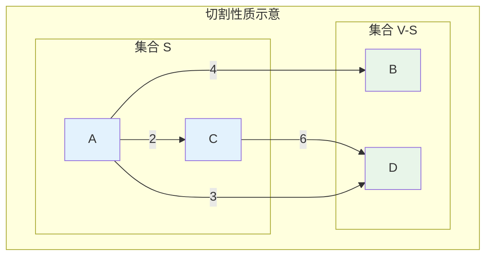
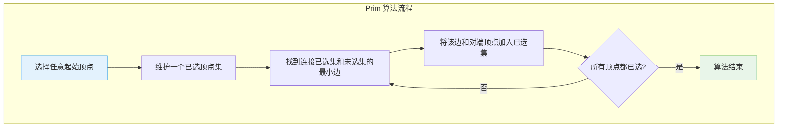
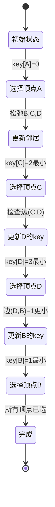
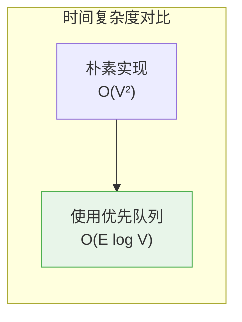
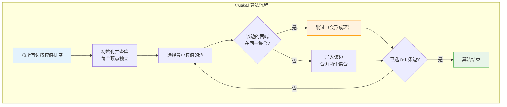
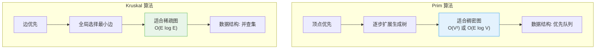
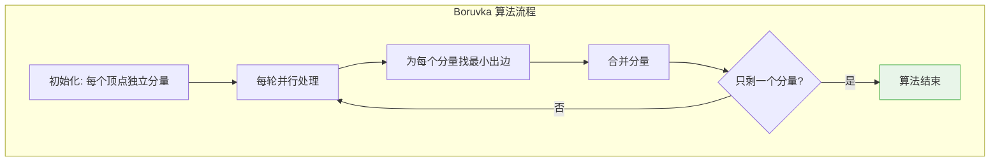

# 最小生成树

## 概述

最小生成树（Minimum Spanning Tree, MST）是连通加权图中**边权值之和最小的生成树**。生成树是包含图中所有顶点的无环连通子图。

<div style="background-color: #E3F2FD; padding: 15px; margin: 10px 0; border-left: 4px solid #2196F3; border-radius: 5px;">
    <strong>最小生成树性质</strong>
    <ul style="margin: 5px 0;">
        <li><strong>包含所有顶点</strong>：n 个顶点的生成树有 n-1 条边</li>
        <li><strong>无环连通</strong>：是一棵树，没有回路</li>
        <li><strong>权值最小</strong>：所有生成树中边权值之和最小</li>
        <li><strong>可能不唯一</strong>：如果存在权值相同的边，MST 可能不唯一</li>
    </ul>
</div>

!!! note "生活类比"
    想象你要为 n 个城市铺设电缆，使得所有城市都能连通，且电缆总长度最短。这就是最小生成树问题——每个城市是顶点，城市间可能的电缆路线是边，电缆长度是权重。

## 问题定义

### 生成树 vs 最小生成树

```
原图:
        4
    A ────── B
    │╲       │╲
   2│ ╲3    1│ ╲5
    ↓  ╲     ↓  ╲
    C───────D────E
        6       3
         ╲
          ╲
           F
        2

生成树示例（只是连通，不一定最小）:
┌────────────────────────────────────────────────────┐
│ 树1: 边(A-B, A-C, B-D, D-E, E-F) 权值=4+2+1+3+3=13 │
│ 树2: 边(A-C, C-D, B-D, D-E, E-F) 权值=2+6+1+3+3=15 │
│ 树3: 边(A-B, A-D, A-C, D-E, E-F) 权值=4+3+2+3+3=15 │
└────────────────────────────────────────────────────┘

最小生成树（MST）:
┌────────────────────────────────────────────────────┐
│ MST: 边(A-C, B-D, A-D, E-F, D-E)                   │
│      权值 = 2 + 1 + 3 + 3 + 2 = 11                │
│      这是最小的可能权值                            │
└────────────────────────────────────────────────────┘
```

### MST 的切割性质

<div style="background-color: #F3E5F5; padding: 15px; margin: 10px 0; border-left: 4px solid #9C27B0; border-radius: 5px;">
    <strong>切割性质（Cut Property）</strong>
    <p>对于图的任意切割（将顶点分为两个非空集合），跨越切割的<strong>最小权重边</strong>一定在某个 MST 中。</p>
    <p>这是 Prim 和 Kruskal 算法的理论基础。</p>
</div>



## Prim 算法

### 算法原理

Prim 算法从任意顶点开始，逐步扩展生成树，每次选择连接已选顶点集和未选顶点集的**最小权重边**。



### 算法执行过程

```
示例图:
        4
    A ────── B
    │╲       │
   2│ ╲3    1│
    ↓  ╲     ↓
    C───────D
        6

从顶点 A 开始执行 Prim 算法:

步骤1: 初始化
┌────────────────────────────────────────────────────┐
│ 已选顶点: {A}                                      │
│ 候选边: (A,B)=4, (A,C)=2, (A,D)=3                 │
│ key[]: A=0, B=4, C=2, D=3                         │
└────────────────────────────────────────────────────┘

步骤2: 选择最小 key 的未选顶点（C, key=2）
┌────────────────────────────────────────────────────┐
│ 选择边 (A,C), 权值 2                               │
│ 已选顶点: {A, C}                                   │
│ 更新候选边: C的邻居 D, 边(C,D)=6 > key[D]=3, 不更新│
│ key[]: A=0, B=4, C=2, D=3                         │
└────────────────────────────────────────────────────┘

步骤3: 选择最小 key 的未选顶点（D, key=3）
┌────────────────────────────────────────────────────┐
│ 选择边 (A,D), 权值 3                               │
│ 已选顶点: {A, C, D}                                │
│ D的邻居 B, 边(D,B)=1 < key[B]=4, 更新!            │
│ key[]: A=0, B=1, C=2, D=3                         │
└────────────────────────────────────────────────────┘

步骤4: 选择最小 key 的未选顶点（B, key=1）
┌────────────────────────────────────────────────────┐
│ 选择边 (D,B), 权值 1                               │
│ 已选顶点: {A, B, C, D}                             │
│ 所有顶点已选，算法结束                              │
└────────────────────────────────────────────────────┘

最终 MST:
┌────────────────────────────────────────────────────┐
│ 边: (A,C), (A,D), (D,B)                           │
│ 总权值: 2 + 3 + 1 = 6                             │
└────────────────────────────────────────────────────┘
```

### 算法状态转移图



### 基本实现（邻接矩阵）

```c
#include <stdio.h>
#include <limits.h>

#define V 4
#define INF INT_MAX

// 找到 key 值最小且未包含在 MST 中的顶点
int minKey(int key[], int mstSet[]) {
    int min = INF, minIndex = -1;
    
    for (int v = 0; v < V; v++) {
        if (!mstSet[v] && key[v] < min) {
            min = key[v];
            minIndex = v;
        }
    }
    
    return minIndex;
}

// 打印 MST
void printMST(int parent[], int graph[V][V]) {
    printf("边\t\t权值\n");
    int totalWeight = 0;
    for (int i = 1; i < V; i++) {
        printf("%c - %c\t\t%d\n", 
               'A' + parent[i], 'A' + i, graph[i][parent[i]]);
        totalWeight += graph[i][parent[i]];
    }
    printf("总权值: %d\n", totalWeight);
}

// Prim 算法
void primMST(int graph[V][V]) {
    int parent[V];   // MST 中各顶点的父节点
    int key[V];      // 连接到 MST 的最小权值
    int mstSet[V];   // 是否已加入 MST
    
    // 初始化
    for (int i = 0; i < V; i++) {
        key[i] = INF;
        mstSet[i] = 0;
        parent[i] = -1;
    }
    
    // 从顶点 0 开始
    key[0] = 0;
    parent[0] = -1;  // 第一个顶点是根
    
    printf("Prim 算法执行过程:\n\n");
    
    // 构建 MST
    for (int count = 0; count < V - 1; count++) {
        // 选择 key 最小的未选顶点
        int u = minKey(key, mstSet);
        mstSet[u] = 1;
        
        printf("步骤 %d: 选择顶点 %c\n", count + 1, 'A' + u);
        if (parent[u] != -1) {
            printf("  加入边: (%c, %c), 权值=%d\n", 
                   'A' + parent[u], 'A' + u, key[u]);
        }
        
        // 更新相邻顶点的 key 值
        for (int v = 0; v < V; v++) {
            if (graph[u][v] && !mstSet[v] && graph[u][v] < key[v]) {
                parent[v] = u;
                key[v] = graph[u][v];
                printf("  更新 key[%c] = %d\n", 'A' + v, key[v]);
            }
        }
        printf("\n");
    }
    
    printf("\n最小生成树:\n");
    printMST(parent, graph);
}

int main() {
    // 邻接矩阵
    int graph[V][V] = {
        //A    B    C    D
        {0,   4,   2,   3},   // A
        {4,   0, INF,   1},   // B
        {2, INF,   0,   6},   // C
        {3,   1,   6,   0}    // D
    };
    
    primMST(graph);
    
    return 0;
}
```

### 优先队列优化版本



```c
#include <stdio.h>
#include <stdlib.h>
#include <limits.h>

#define V 4
#define INF INT_MAX

typedef struct {
    int vertex;
    int key;
} HeapNode;

typedef struct {
    HeapNode *nodes;
    int size;
    int capacity;
} MinHeap;

// 创建最小堆
MinHeap* createMinHeap(int capacity) {
    MinHeap *heap = (MinHeap*)malloc(sizeof(MinHeap));
    heap->nodes = (HeapNode*)malloc(capacity * sizeof(HeapNode));
    heap->size = 0;
    heap->capacity = capacity;
    return heap;
}

// 交换
void swap(HeapNode *a, HeapNode *b) {
    HeapNode temp = *a;
    *a = *b;
    *b = temp;
}

// 最小堆化
void minHeapify(MinHeap *heap, int idx) {
    int smallest = idx;
    int left = 2 * idx + 1;
    int right = 2 * idx + 2;
    
    if (left < heap->size && 
        heap->nodes[left].key < heap->nodes[smallest].key)
        smallest = left;
    
    if (right < heap->size && 
        heap->nodes[right].key < heap->nodes[smallest].key)
        smallest = right;
    
    if (smallest != idx) {
        swap(&heap->nodes[idx], &heap->nodes[smallest]);
        minHeapify(heap, smallest);
    }
}

// 插入
void insertHeap(MinHeap *heap, int vertex, int key) {
    int i = heap->size++;
    heap->nodes[i].vertex = vertex;
    heap->nodes[i].key = key;
    
    while (i != 0 && 
           heap->nodes[(i-1)/2].key > heap->nodes[i].key) {
        swap(&heap->nodes[i], &heap->nodes[(i-1)/2]);
        i = (i - 1) / 2;
    }
}

// 提取最小
HeapNode extractMin(MinHeap *heap) {
    if (heap->size == 0) {
        HeapNode empty = {-1, INF};
        return empty;
    }
    
    HeapNode min = heap->nodes[0];
    heap->nodes[0] = heap->nodes[--heap->size];
    minHeapify(heap, 0);
    
    return min;
}

// 减小键值
void decreaseKey(MinHeap *heap, int vertex, int newKey) {
    int i;
    for (i = 0; i < heap->size; i++) {
        if (heap->nodes[i].vertex == vertex) {
            heap->nodes[i].key = newKey;
            break;
        }
    }
    
    while (i != 0 && 
           heap->nodes[(i-1)/2].key > heap->nodes[i].key) {
        swap(&heap->nodes[i], &heap->nodes[(i-1)/2]);
        i = (i - 1) / 2;
    }
}

// Prim 算法（优先队列优化）
void primOptimized(int graph[V][V]) {
    int parent[V];
    int key[V];
    int inMST[V] = {0};
    
    for (int i = 0; i < V; i++) {
        key[i] = INF;
        parent[i] = -1;
    }
    
    key[0] = 0;
    MinHeap *heap = createMinHeap(V);
    insertHeap(heap, 0, 0);
    
    printf("Prim 算法（优先队列优化）:\n\n");
    
    while (heap->size > 0) {
        HeapNode min = extractMin(heap);
        int u = min.vertex;
        
        if (inMST[u]) continue;
        inMST[u] = 1;
        
        printf("选择顶点 %c, key=%d\n", 'A' + u, key[u]);
        
        for (int v = 0; v < V; v++) {
            if (graph[u][v] && !inMST[v] && graph[u][v] < key[v]) {
                key[v] = graph[u][v];
                parent[v] = u;
                insertHeap(heap, v, key[v]);
                printf("  更新: key[%c] = %d, parent[%c] = %c\n", 
                       'A' + v, key[v], 'A' + v, 'A' + u);
            }
        }
    }
    
    printf("\nMST 边:\n");
    for (int i = 1; i < V; i++) {
        printf("(%c, %c) = %d\n", 
               'A' + parent[i], 'A' + i, graph[i][parent[i]]);
    }
    
    free(heap->nodes);
    free(heap);
}
```

## Kruskal 算法

### 算法原理

Kruskal 算法按照**边权值从小到大**的顺序选择边，每次选择不会形成环的边，直到选出 n-1 条边。



### 算法执行过程

```
示例图（同上）:
        4
    A ────── B
    │╲       │
   2│ ╲3    1│
    ↓  ╲     ↓
    C───────D
        6

步骤1: 边排序
┌────────────────────────────────────────────────────┐
│ 按权值排序的边:                                    │
│ 1. (B,D) = 1                                      │
│ 2. (A,C) = 2                                      │
│ 3. (A,D) = 3                                      │
│ 4. (A,B) = 4                                      │
│ 5. (C,D) = 6                                      │
└────────────────────────────────────────────────────┘

初始并查集: {A}, {B}, {C}, {D}

步骤2: 选择边 (B,D) = 1
┌────────────────────────────────────────────────────┐
│ B 和 D 在不同集合 → 接受                           │
│ 合并: {A}, {B,D}, {C}                             │
│ MST 边: {(B,D)}                                   │
└────────────────────────────────────────────────────┘

步骤3: 选择边 (A,C) = 2
┌────────────────────────────────────────────────────┐
│ A 和 C 在不同集合 → 接受                           │
│ 合并: {A,C}, {B,D}                                │
│ MST 边: {(B,D), (A,C)}                            │
└────────────────────────────────────────────────────┘

步骤4: 选择边 (A,D) = 3
┌────────────────────────────────────────────────────┐
│ A 在 {A,C}, D 在 {B,D} → 不同集合 → 接受           │
│ 合并: {A,B,C,D}                                   │
│ MST 边: {(B,D), (A,C), (A,D)}                     │
│ 已选 3 条边 = V-1 → 算法结束                      │
└────────────────────────────────────────────────────┘

最终 MST:
┌────────────────────────────────────────────────────┐
│ 边: (B,D), (A,C), (A,D)                           │
│ 总权值: 1 + 2 + 3 = 6                             │
│ （与 Prim 结果相同，只是边的顺序不同）              │
└────────────────────────────────────────────────────┘
```

### 环检测示意

```
为什么不选择边 (A,B) = 4？

假设已经选择了 (B,D), (A,C), (A,D):
┌────────────────────────────────────────────────────┐
│                                                    │
│       A ─────────── D                              │
│       │╲            │                              │
│       │ ╲           │                              │
│       │  ╲          │                              │
│       C             B                              │
│                                                    │
│ 如果再选 (A,B):                                    │
│ A → D → B → A 形成环！                             │
│ 所以跳过边 (A,B)                                   │
└────────────────────────────────────────────────────┘
```

### 基本实现

```c
#include <stdio.h>
#include <stdlib.h>

#define V 4

typedef struct {
    int src, dest, weight;
} Edge;

// 并查集
int parent[V];
int rank[V];

// 初始化并查集
void initUnionFind() {
    for (int i = 0; i < V; i++) {
        parent[i] = i;
        rank[i] = 0;
    }
}

// 查找（带路径压缩）
int find(int i) {
    if (parent[i] != i) {
        parent[i] = find(parent[i]);  // 路径压缩
    }
    return parent[i];
}

// 合并（按秩合并）
int unionSets(int i, int j) {
    int rootI = find(i);
    int rootJ = find(j);
    
    if (rootI == rootJ) {
        return 0;  // 已经在同一集合
    }
    
    // 按秩合并
    if (rank[rootI] < rank[rootJ]) {
        parent[rootI] = rootJ;
    } else if (rank[rootI] > rank[rootJ]) {
        parent[rootJ] = rootI;
    } else {
        parent[rootJ] = rootI;
        rank[rootI]++;
    }
    
    return 1;  // 合并成功
}

// 边比较函数（用于排序）
int compareEdges(const void *a, const void *b) {
    return ((Edge*)a)->weight - ((Edge*)b)->weight;
}

// Kruskal 算法
void kruskalMST(Edge edges[], int E) {
    // 按权值排序边
    qsort(edges, E, sizeof(Edge), compareEdges);
    
    printf("排序后的边:\n");
    for (int i = 0; i < E; i++) {
        printf("%d. (%c,%c) = %d\n", i + 1, 
               'A' + edges[i].src, 'A' + edges[i].dest, 
               edges[i].weight);
    }
    printf("\n");
    
    initUnionFind();
    
    Edge result[V - 1];
    int e = 0;  // 已选边数
    int i = 0;  // 当前检查的边索引
    
    printf("Kruskal 算法执行过程:\n\n");
    
    while (e < V - 1 && i < E) {
        Edge next = edges[i++];
        
        printf("检查边 (%c,%c) = %d\n", 
               'A' + next.src, 'A' + next.dest, next.weight);
        
        int rootSrc = find(next.src);
        int rootDest = find(next.dest);
        
        if (rootSrc != rootDest) {
            // 不形成环，接受该边
            result[e++] = next;
            unionSets(next.src, next.dest);
            printf("  接受！合并集合\n");
            
            printf("  当前集合: ");
            for (int j = 0; j < V; j++) {
                printf("{");
                for (int k = 0; k < V; k++) {
                    if (find(k) == j) printf("%c ", 'A' + k);
                }
                printf("} ");
            }
            printf("\n\n");
        } else {
            printf("  拒绝！会形成环\n\n");
        }
    }
    
    // 输出结果
    printf("最小生成树:\n");
    printf("边\t\t权值\n");
    int totalWeight = 0;
    for (i = 0; i < e; i++) {
        printf("(%c,%c)\t\t%d\n", 
               'A' + result[i].src, 'A' + result[i].dest, 
               result[i].weight);
        totalWeight += result[i].weight;
    }
    printf("总权值: %d\n", totalWeight);
}

int main() {
    // 边列表
    Edge edges[] = {
        {0, 1, 4},  // A-B
        {0, 2, 2},  // A-C
        {0, 3, 3},  // A-D
        {1, 3, 1},  // B-D
        {2, 3, 6}   // C-D
    };
    int E = sizeof(edges) / sizeof(edges[0]);
    
    kruskalMST(edges, E);
    
    return 0;
}
```

## Prim vs Kruskal 对比



### 详细对比

```
┌─────────────────────────────────────────────────────────────────────────────┐
│ 特性           │ Prim                    │ Kruskal                       │
├─────────────────────────────────────────────────────────────────────────────┤
│ 选择策略       │ 顶点优先，局部扩展       │ 边优先，全局选择              │
│ 时间复杂度     │ O(V²) 或 O(E log V)     │ O(E log E)                    │
│ 数据结构       │ 优先队列（最小堆）       │ 并查集                        │
│ 预处理         │ 无需排序                 │ 需要排序所有边                │
│ 适用图类型     │ 稠密图                   │ 稀疏图                        │
│ 空间复杂度     │ O(V)                     │ O(E)                          │
│ 实现复杂度     │ 中等                     │ 简单（使用现成并查集）        │
│ 图表示         │ 邻接矩阵或邻接表         │ 边列表                        │
├─────────────────────────────────────────────────────────────────────────────┤
│ 稠密图(E≈V²)   │ O(V² log V)             │ O(V² log V)                   │
│ 稀疏图(E≈V)    │ O(V log V)              │ O(V log V)                    │
└─────────────────────────────────────────────────────────────────────────────┘
```

### 选择建议

<div style="background-color: #E8F5E9; padding: 15px; margin: 10px 0; border-left: 4px solid #4CAF50; border-radius: 5px;">
    <strong>算法选择建议</strong>
    <ul style="margin: 5px 0;">
        <li><strong>稠密图（E ≈ V²）</strong>：Prim 朴素版本 O(V²) 更优</li>
        <li><strong>稀疏图（E ≈ V）</strong>：Kruskal 或 Prim 堆优化版本更优</li>
        <li><strong>只有边列表</strong>：使用 Kruskal</li>
        <li><strong>需要增量构建</strong>：使用 Prim</li>
    </ul>
</div>

## Boruvka 算法

### 算法原理

Boruvka 算法适合并行计算，每轮为每个连通分量选择最小出边。



```c
void boruvkaMST(Edge edges[], int E, int V) {
    int parent[V];
    int rank[V];
    
    // 初始化并查集
    for (int i = 0; i < V; i++) {
        parent[i] = i;
        rank[i] = 0;
    }
    
    int numComponents = V;
    int totalWeight = 0;
    
    printf("Boruvka 算法:\n\n");
    
    while (numComponents > 1) {
        // 存储每个分量的最小出边
        int cheapest[V];
        for (int i = 0; i < V; i++) {
            cheapest[i] = -1;
        }
        
        // 为每个分量找最小出边
        for (int i = 0; i < E; i++) {
            int set1 = find(edges[i].src);
            int set2 = find(edges[i].dest);
            
            if (set1 != set2) {
                // 更新 set1 的最小出边
                if (cheapest[set1] == -1 || 
                    edges[cheapest[set1]].weight > edges[i].weight) {
                    cheapest[set1] = i;
                }
                // 更新 set2 的最小出边
                if (cheapest[set2] == -1 || 
                    edges[cheapest[set2]].weight > edges[i].weight) {
                    cheapest[set2] = i;
                }
            }
        }
        
        // 添加选中的边
        printf("本轮选择的边:\n");
        for (int i = 0; i < V; i++) {
            if (cheapest[i] != -1) {
                int set1 = find(edges[cheapest[i]].src);
                int set2 = find(edges[cheapest[i]].dest);
                
                if (set1 != set2) {
                    unionSets(set1, set2);
                    printf("  (%c,%c) = %d\n", 
                           'A' + edges[cheapest[i]].src,
                           'A' + edges[cheapest[i]].dest,
                           edges[cheapest[i]].weight);
                    totalWeight += edges[cheapest[i]].weight;
                    numComponents--;
                }
            }
        }
        printf("\n");
    }
    
    printf("MST 总权值: %d\n", totalWeight);
}
```

## 应用场景

### 1. 网络设计

```c
// 最低成本网络布线
typedef struct {
    char name[50];
    int x, y;  // 坐标
} Node;

void designNetwork(Node nodes[], int n) {
    // 计算所有节点对之间的距离
    int graph[MAX][MAX];
    for (int i = 0; i < n; i++) {
        for (int j = 0; j < n; j++) {
            if (i != j) {
                int dx = nodes[i].x - nodes[j].x;
                int dy = nodes[i].y - nodes[j].y;
                graph[i][j] = (int)sqrt(dx*dx + dy*dy);
            } else {
                graph[i][j] = 0;
            }
        }
    }
    
    // 使用 Prim 或 Kruskal 求最小生成树
    primMST(graph);
    
    printf("网络设计方案:\n");
    printf("总布线长度最小\n");
}
```

### 2. 电路设计

```c
// PCB 布线优化
void optimizePCBRouting(Component components[], int n) {
    // 建立连接图
    // 边权重 = 布线成本
    // MST = 最低成本连接方案
}
```

### 3. 图像分割

```c
// 基于最小生成树的图像分割
typedef struct {
    int pixel1, pixel2;
    int weight;  // 像素差异
} PixelEdge;

void imageSegmentation(PixelEdge edges[], int E, int threshold) {
    // 对边按权重排序
    qsort(edges, E, sizeof(PixelEdge), compareEdges);
    
    // Kruskal 过程中，如果边权重超过阈值，不合并
    // 形成多个区域
}
```

### 4. 聚类算法

```c
// 层次聚类
void hierarchicalClustering(Point points[], int n, int k) {
    // 计算所有点对距离
    // 求最小生成树
    // 删除 k-1 条最长边，得到 k 个聚类
}
```

## 复杂度总结

| 算法 | 时间复杂度 | 空间复杂度 | 最佳场景 |
|------|------------|------------|----------|
| Prim（朴素） | O(V²) | O(V) | 稠密图 |
| Prim（堆优化） | O(E log V) | O(V) | 一般图 |
| Kruskal | O(E log E) | O(E) | 稀疏图 |
| Boruvka | O(E log V) | O(V) | 并行计算 |

## 参考资料

- 《算法导论》第23章 - 最小生成树
- 《数据结构与算法分析》第9章 - 图论算法
- [Minimum Spanning Tree - Wikipedia](https://en.wikipedia.org/wiki/Minimum_spanning_tree)
- [Prim's Algorithm - Wikipedia](https://en.wikipedia.org/wiki/Prim%27s_algorithm)
- [Kruskal's Algorithm - Wikipedia](https://en.wikipedia.org/wiki/Kruskal%27s_algorithm)
