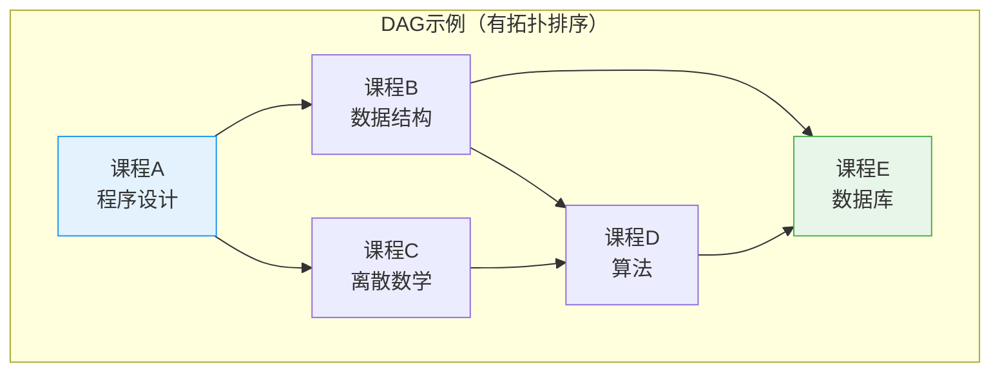
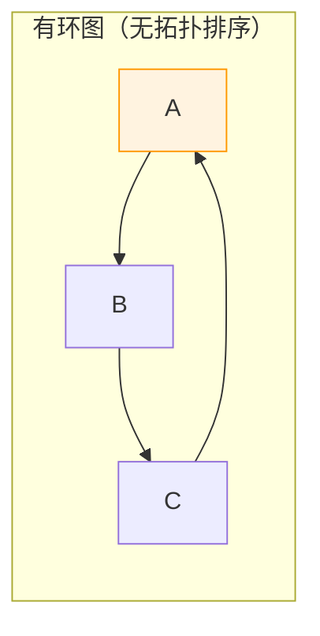
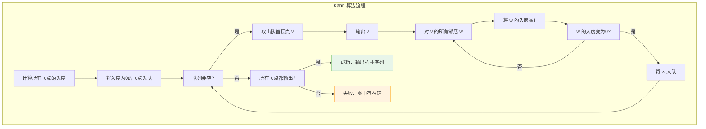
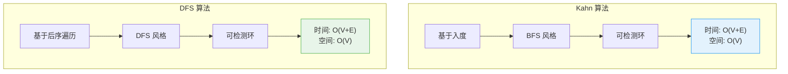

# 拓扑排序

## 概述

拓扑排序（Topological Sort）是对**有向无环图（DAG）**顶点的一种线性排序，使得对于每条有向边 (u, v)，顶点 u 都出现在顶点 v 之前。

<div style="background-color: #E3F2FD; padding: 15px; margin: 10px 0; border-left: 4px solid #2196F3; border-radius: 5px;">
    <strong>拓扑排序特性</strong>
    <ul style="margin: 5px 0;">
        <li><strong>仅适用于 DAG</strong>：有环图不存在拓扑排序</li>
        <li><strong>结果不唯一</strong>：一个 DAG 可能有多个合法的拓扑排序</li>
        <li><strong>线性序列</strong>：所有顶点排成线性序列</li>
        <li><strong>依赖关系</strong>：完美刻画先决条件/依赖关系</li>
    </ul>
</div>

!!! note "生活类比"
    想象大学课程安排：有些课程需要先修其他课程（如"数据结构"需要先修"程序设计"）。拓扑排序就是找到一个合理的课程学习顺序，确保每门课的先修课都已学完。

## 核心概念

### DAG 与拓扑排序



```
合法的拓扑排序:
┌─────────────────────────────────────────────────────────────┐
│ 排序1: A → B → C → D → E                                     │
│ 排序2: A → C → B → D → E                                     │
│ 排序3: A → B → C → E → D  ✗ 错误！D必须在E之前              │
│ 排序4: C → A → B → D → E                                     │
└─────────────────────────────────────────────────────────────┘

验证: 对于每条边 (u, v)，u 在序列中位于 v 之前
  边(A,B): A在B前 ✓    边(A,C): A在C前 ✓
  边(B,D): B在D前 ✓    边(C,D): C在D前 ✓
  边(B,E): B在E前 ✓    边(D,E): D在E前 ✓
```

### 有环图无拓扑排序



```
为什么有环图不存在拓扑排序?

假设存在拓扑排序，考虑环 A → B → C → A:
  由边(A,B): A 必须在 B 之前
  由边(B,C): B 必须在 C 之前
  由边(C,A): C 必须在 A 之前
  
  传递性: A 在 B 之前，B 在 C 之前 → A 在 C 之前
  但边(C,A)要求 C 在 A 之前
  
  矛盾！所以不存在拓扑排序。
```

## 入度与出度

<div style="background-color: #F3E5F5; padding: 15px; margin: 10px 0; border-left: 4px solid #9C27B0; border-radius: 5px;">
    <strong>入度（In-degree）与出度（Out-degree）</strong>
    <p><strong>入度</strong>：指向该顶点的边的数量</p>
    <p><strong>出度</strong>：从该顶点出发的边的数量</p>
    <p>在拓扑排序中，入度为 0 的顶点可以优先输出。</p>
</div>

```
示例图的入度计算:
        A ──→ B ──→ D
        │     │     │
        ↓     ↓     ↓
        C ──→ E ←───┘

┌─────────────────────────────────────────────────────────────┐
│ 顶点   │ 入度   │ 入边来源                          │
├─────────────────────────────────────────────────────────────┤
│   A    │   0    │ 无 (起点)                          │
│   B    │   1    │ A                                  │
│   C    │   1    │ A                                  │
│   D    │   1    │ B                                  │
│   E    │   3    │ C, B, D                           │
└─────────────────────────────────────────────────────────────┘
```

## Kahn 算法（BFS）

### 算法原理

Kahn 算法基于入度，不断选择入度为 0 的顶点输出。



### 算法执行过程

```
示例图:
        A ──→ B ──→ D
        │     │
        ↓     ↓
        C     E

初始状态:
┌─────────────────────────────────────────────────────────────┐
│ 入度: A=0, B=1, C=1, D=1, E=1                               │
│ 队列: [A] (入度为0的顶点)                                    │
│ 输出: []                                                     │
└─────────────────────────────────────────────────────────────┘

步骤1: 取出 A
┌─────────────────────────────────────────────────────────────┐
│ 输出: [A]                                                    │
│ A 的邻居: B, C                                               │
│   B 的入度: 1 → 0, 入队                                      │
│   C 的入度: 1 → 0, 入队                                      │
│ 队列: [B, C]                                                 │
└─────────────────────────────────────────────────────────────┘

步骤2: 取出 B
┌─────────────────────────────────────────────────────────────┐
│ 输出: [A, B]                                                 │
│ B 的邻居: D, E                                               │
│   D 的入度: 1 → 0, 入队                                      │
│   E 的入度: 1 → 0, 入队                                      │
│ 队列: [C, D, E]                                              │
└─────────────────────────────────────────────────────────────┘

步骤3: 取出 C
┌─────────────────────────────────────────────────────────────┐
│ 输出: [A, B, C]                                              │
│ C 没有邻居                                                   │
│ 队列: [D, E]                                                 │
└─────────────────────────────────────────────────────────────┘

步骤4: 取出 D
┌─────────────────────────────────────────────────────────────┐
│ 输出: [A, B, C, D]                                           │
│ D 没有邻居                                                   │
│ 队列: [E]                                                    │
└─────────────────────────────────────────────────────────────┘

步骤5: 取出 E
┌─────────────────────────────────────────────────────────────┐
│ 输出: [A, B, C, D, E]                                        │
│ E 没有邻居                                                   │
│ 队列: []                                                     │
└─────────────────────────────────────────────────────────────┘

最终结果: A → B → C → D → E （或 A → B → C → E → D 等多种可能）
```

### 实现

```c
#include <stdio.h>
#include <stdlib.h>
#include <string.h>

#define MAX_V 100

int* topologicalSortKahn(int graph[MAX_V][MAX_V], int n, int *returnSize) {
    // 计算入度
    int *inDegree = (int*)calloc(n, sizeof(int));
    
    printf("计算入度:\n");
    for (int i = 0; i < n; i++) {
        for (int j = 0; j < n; j++) {
            if (graph[i][j]) {
                inDegree[j]++;
            }
        }
    }
    
    for (int i = 0; i < n; i++) {
        printf("  顶点 %c: 入度 = %d\n", 'A' + i, inDegree[i]);
    }
    printf("\n");
    
    // 初始化队列（入度为0的顶点）
    int *queue = (int*)malloc(sizeof(int) * n);
    int front = 0, rear = 0;
    
    for (int i = 0; i < n; i++) {
        if (inDegree[i] == 0) {
            queue[rear++] = i;
            printf("顶点 %c 入度=0，入队\n", 'A' + i);
        }
    }
    printf("\n");
    
    // 拓扑排序
    int *result = (int*)malloc(sizeof(int) * n);
    int count = 0;
    
    printf("Kahn 算法执行:\n");
    
    while (front < rear) {
        int v = queue[front++];
        result[count++] = v;
        printf("步骤 %d: 输出 %c\n", count, 'A' + v);
        
        // 更新邻居的入度
        for (int i = 0; i < n; i++) {
            if (graph[v][i]) {
                inDegree[i]--;
                printf("  邻居 %c 入度: %d → %d", 'A' + i, inDegree[i] + 1, inDegree[i]);
                
                if (inDegree[i] == 0) {
                    queue[rear++] = i;
                    printf(", 入队");
                }
                printf("\n");
            }
        }
    }
    
    free(inDegree);
    free(queue);
    
    // 检查是否有环
    if (count != n) {
        printf("\n检测到环！只输出了 %d/%d 个顶点\n", count, n);
        free(result);
        *returnSize = 0;
        return NULL;
    }
    
    printf("\n拓扑排序结果: ");
    for (int i = 0; i < n; i++) {
        printf("%c ", 'A' + result[i]);
    }
    printf("\n");
    
    *returnSize = n;
    return result;
}

int main() {
    // 示例图
    int n = 5;
    int graph[MAX_V][MAX_V] = {0};
    
    // 添加边: A→B, A→C, B→D, B→E
    graph[0][1] = 1;  // A → B
    graph[0][2] = 1;  // A → C
    graph[1][3] = 1;  // B → D
    graph[1][4] = 1;  // B → E
    
    printf("图的边:\n");
    printf("  A → B\n  A → C\n  B → D\n  B → E\n\n");
    
    int returnSize;
    int *order = topologicalSortKahn(graph, n, &returnSize);
    
    if (order) {
        free(order);
    }
    
    return 0;
}
```

## DFS 算法

### 算法原理

DFS 算法基于后序遍历，顶点完成时加入结果，最后逆序输出。


### 算法执行过程

```
示例图:
        A ──→ B ──→ D
        │     │
        ↓     ↓
        C     E

DFS 从 A 开始:
┌─────────────────────────────────────────────────────────────┐
│ DFS(A):                                                      │
│   访问 A                                                      │
│   DFS(B):  (A→B)                                             │
│     访问 B                                                    │
│     DFS(D):  (B→D)                                           │
│       访问 D                                                  │
│       D 无邻居，完成，加入结果: [D]                           │
│     DFS(E):  (B→E)                                           │
│       访问 E                                                  │
│       E 无邻居，完成，加入结果: [D, E]                        │
│     B 完成，加入结果: [D, E, B]                               │
│   DFS(C):  (A→C)                                             │
│     访问 C                                                    │
│     C 无邻居，完成，加入结果: [D, E, B, C]                    │
│   A 完成，加入结果: [D, E, B, C, A]                           │
└─────────────────────────────────────────────────────────────┘

逆序输出: A → B → C → E → D （或 A → B → C → D → E 等）
```

### 实现

```c
#include <stdio.h>
#include <stdlib.h>
#include <string.h>

#define MAX_V 100

int visited[MAX_V];
int inStack[MAX_V];    // 检测环
int result[MAX_V];
int resultIndex;
int hasCycle;

void dfsTopo(int graph[MAX_V][MAX_V], int v, int n) {
    if (hasCycle) return;
    
    visited[v] = 1;
    inStack[v] = 1;
    
    printf("  进入 %c\n", 'A' + v);
    
    for (int i = 0; i < n; i++) {
        if (graph[v][i]) {
            if (!visited[i]) {
                dfsTopo(graph, i, n);
            } else if (inStack[i]) {
                // 发现回边，存在环
                printf("  检测到环: %c → %c 形成回边\n", 'A' + v, 'A' + i);
                hasCycle = 1;
                return;
            }
        }
    }
    
    inStack[v] = 0;
    result[resultIndex++] = v;
    printf("  完成 %c, 加入结果\n", 'A' + v);
}

int* topologicalSortDFS(int graph[MAX_V][MAX_V], int n, int *returnSize) {
    memset(visited, 0, sizeof(visited));
    memset(inStack, 0, sizeof(inStack));
    resultIndex = 0;
    hasCycle = 0;
    
    printf("DFS 拓扑排序:\n");
    
    for (int i = 0; i < n; i++) {
        if (!visited[i]) {
            printf("DFS 从 %c 开始:\n", 'A' + i);
            dfsTopo(graph, i, n);
        }
    }
    
    if (hasCycle) {
        printf("\n图中存在环，无拓扑排序\n");
        *returnSize = 0;
        return NULL;
    }
    
    // 逆序输出
    int *topoOrder = (int*)malloc(sizeof(int) * n);
    for (int i = 0; i < n; i++) {
        topoOrder[i] = result[n - 1 - i];
    }
    
    printf("\nDFS 后序: ");
    for (int i = 0; i < n; i++) {
        printf("%c ", 'A' + result[i]);
    }
    printf("\n");
    
    printf("拓扑排序: ");
    for (int i = 0; i < n; i++) {
        printf("%c ", 'A' + topoOrder[i]);
    }
    printf("\n");
    
    *returnSize = n;
    return topoOrder;
}
```

## Kahn vs DFS 对比



| 特性 | Kahn 算法 | DFS 算法 |
|------|-----------|----------|
| 基本思想 | 入度为 0 优先输出 | 后序遍历逆序 |
| 数据结构 | 队列 | 递归栈 |
| 环检测 | 输出数量 < 顶点数 | 回边检测 |
| 适合场景 | 需要特定顺序时 | 自然递归问题 |
| 实现方式 | 迭代 | 递归 |

## 应用场景

### 1. 课程安排

```
问题: 判断能否完成所有课程，并给出学习顺序

示例: numCourses = 4, prerequisites = [[1,0], [2,0], [3,1], [3,2]]

图:
        0 ──→ 1 ──→ 3
        │          ↑
        └──→ 2 ────┘

解读:
  课程 1 需要先修课程 0
  课程 2 需要先修课程 0
  课程 3 需要先修课程 1 和 2

拓扑排序: 0 → 1 → 2 → 3 或 0 → 2 → 1 → 3
学习顺序: 先学 0，再学 1 和 2（顺序可换），最后学 3
```

```c
int canFinish(int numCourses, int prerequisites[][2], int prerequisitesSize) {
    int **graph = (int**)malloc(sizeof(int*) * numCourses);
    int *inDegree = (int*)calloc(numCourses, sizeof(int));
    
    for (int i = 0; i < numCourses; i++) {
        graph[i] = (int*)calloc(numCourses, sizeof(int));
    }
    
    // 建图: prerequisites[i] = [course, prereq]
    for (int i = 0; i < prerequisitesSize; i++) {
        int course = prerequisites[i][0];
        int prereq = prerequisites[i][1];
        graph[prereq][course] = 1;
        inDegree[course]++;
    }
    
    // Kahn 算法
    int *queue = (int*)malloc(sizeof(int) * numCourses);
    int front = 0, rear = 0;
    
    for (int i = 0; i < numCourses; i++) {
        if (inDegree[i] == 0) {
            queue[rear++] = i;
        }
    }
    
    int count = 0;
    while (front < rear) {
        int v = queue[front++];
        count++;
        
        for (int i = 0; i < numCourses; i++) {
            if (graph[v][i]) {
                inDegree[i]--;
                if (inDegree[i] == 0) {
                    queue[rear++] = i;
                }
            }
        }
    }
    
    // 释放内存
    for (int i = 0; i < numCourses; i++) free(graph[i]);
    free(graph);
    free(inDegree);
    free(queue);
    
    return count == numCourses;
}
```

### 2. 编译依赖

```
问题: Makefile 中目标的编译顺序

示例依赖关系:
  main.o: main.c utils.h
  utils.o: utils.c utils.h
  app: main.o utils.o

依赖图:
  main.c ──→ main.o ──┐
                      │
                      ├──→ app
                      │
  utils.c ──→ utils.o ─┘
              ↑
  utils.h ────┘

编译顺序: main.c, utils.h, utils.c → main.o, utils.o → app
```

### 3. 关键路径（AOE 网）

```c
void criticalPath(int graph[MAX_V][MAX_V], int n, int weights[MAX_V][MAX_V]) {
    int returnSize;
    int *topoOrder = topologicalSortKahn(graph, n, &returnSize);
    
    if (topoOrder == NULL) {
        printf("图中有环，无法计算关键路径\n");
        return;
    }
    
    // 计算最早发生时间
    int *earliest = (int*)calloc(n, sizeof(int));
    
    for (int i = 0; i < n; i++) {
        int v = topoOrder[i];
        for (int j = 0; j < n; j++) {
            if (graph[j][v]) {
                int finish = earliest[j] + weights[j][v];
                if (finish > earliest[v]) {
                    earliest[v] = finish;
                }
            }
        }
    }
    
    // 计算最晚发生时间
    int *latest = (int*)malloc(sizeof(int) * n);
    for (int i = 0; i < n; i++) {
        latest[i] = earliest[topoOrder[n - 1]];
    }
    
    for (int i = n - 1; i >= 0; i--) {
        int v = topoOrder[i];
        for (int j = 0; j < n; j++) {
            if (graph[v][j]) {
                int start = latest[j] - weights[v][j];
                if (start < latest[v]) {
                    latest[v] = start;
                }
            }
        }
    }
    
    // 输出关键活动
    printf("关键活动（松弛时间为0）:\n");
    for (int i = 0; i < n; i++) {
        for (int j = 0; j < n; j++) {
            if (graph[i][j]) {
                int e = earliest[i];
                int l = latest[j] - weights[i][j];
                if (e == l) {
                    printf("  %c → %c (权值=%d)\n", 
                           'A' + i, 'A' + j, weights[i][j]);
                }
            }
        }
    }
    
    free(earliest);
    free(latest);
    free(topoOrder);
}
```

### 4. 死锁检测

```
资源分配图转换为等待图，检测是否存在环

如果等待图中存在环 → 可能发生死锁
```

## 复杂度分析

| 操作 | 时间复杂度 | 空间复杂度 | 说明 |
|------|------------|------------|------|
| Kahn 算法 | O(V + E) | O(V) | 遍历所有顶点和边 |
| DFS 算法 | O(V + E) | O(V) | 递归栈深度 |

## 常见问题

### 1. 判断图中是否有环

```c
int hasCycle(int graph[MAX_V][MAX_V], int n) {
    int returnSize;
    int *order = topologicalSortKahn(graph, n, &returnSize);
    
    if (order) {
        free(order);
        return 0;  // 无环
    }
    return 1;  // 有环
}
```

### 2. 所有拓扑排序

```c
// 使用回溯法生成所有拓扑排序
void allTopologicalSorts(int graph[MAX_V][MAX_V], int n, 
                         int *result, int count, 
                         int *inDegree, int *visited) {
    if (count == n) {
        // 输出一个排序
        for (int i = 0; i < n; i++) {
            printf("%c ", 'A' + result[i]);
        }
        printf("\n");
        return;
    }
    
    for (int i = 0; i < n; i++) {
        if (!visited[i] && inDegree[i] == 0) {
            // 选择顶点 i
            result[count] = i;
            visited[i] = 1;
            
            // 更新入度
            int temp[MAX_V];
            for (int j = 0; j < n; j++) {
                temp[j] = inDegree[j];
                if (graph[i][j]) {
                    inDegree[j]--;
                }
            }
            
            // 递归
            allTopologicalSorts(graph, n, result, count + 1, inDegree, visited);
            
            // 回溯
            visited[i] = 0;
            for (int j = 0; j < n; j++) {
                inDegree[j] = temp[j];
            }
        }
    }
}
```

### 3. 字典序最小的拓扑排序

```c
// 使用最小堆（优先队列）替代普通队列
int* topologicalSortLexicographically(int graph[MAX_V][MAX_V], int n, int *returnSize) {
    int *inDegree = (int*)calloc(n, sizeof(int));
    
    for (int i = 0; i < n; i++) {
        for (int j = 0; j < n; j++) {
            if (graph[i][j]) {
                inDegree[j]++;
            }
        }
    }
    
    // 使用最小堆（这里简化实现）
    int *result = (int*)malloc(sizeof(int) * n);
    int count = 0;
    
    while (count < n) {
        // 找入度为0的最小顶点
        int min = -1;
        for (int i = 0; i < n; i++) {
            if (inDegree[i] == 0) {
                if (min == -1 || i < min) {
                    min = i;
                }
            }
        }
        
        if (min == -1) {
            free(result);
            *returnSize = 0;
            return NULL;
        }
        
        result[count++] = min;
        inDegree[min] = -1;  // 标记已处理
        
        for (int i = 0; i < n; i++) {
            if (graph[min][i]) {
                inDegree[i]--;
            }
        }
    }
    
    *returnSize = n;
    return result;
}
```

## 参考资料

- 《算法导论》第22章 - 基本图算法
- 《数据结构与算法分析》第9章 - 图论算法
- [Topological Sorting - Wikipedia](https://en.wikipedia.org/wiki/Topological_sorting)
- [Kahn's Algorithm - GeeksforGeeks](https://www.geeksforgeeks.org/topological-sorting-indegree-using-kahns-algo/)
