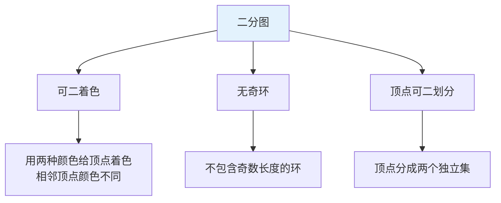
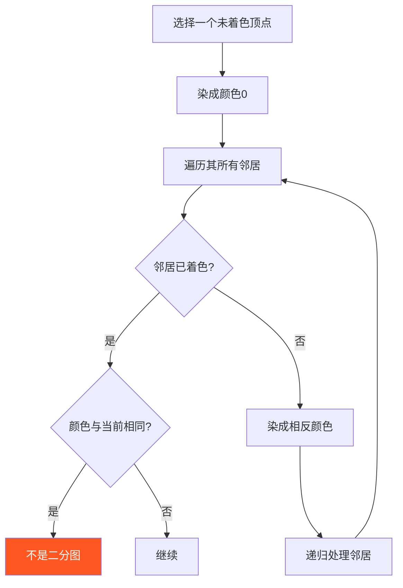
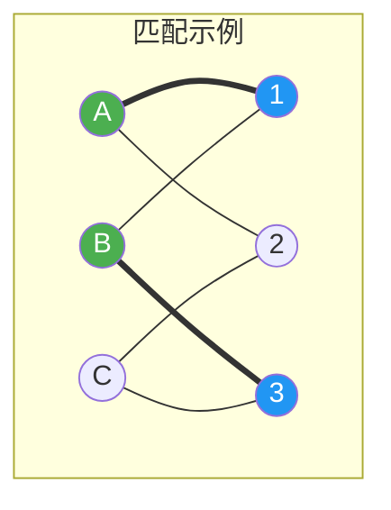
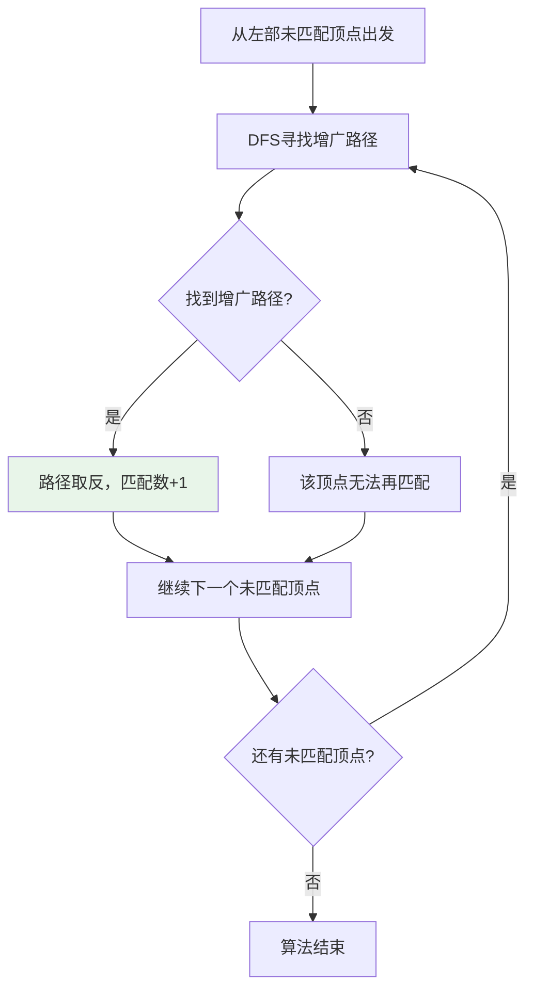
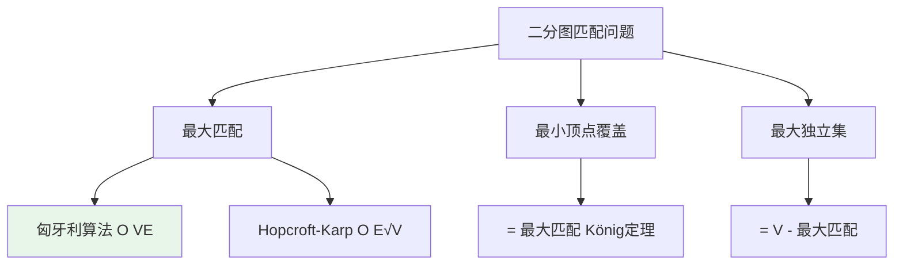

# 二分图

## 概述

二分图（Bipartite Graph）是图论中的重要概念，又称二部图。其顶点可以分成两个不相交的集合U和V，使得图中的每一条边都连接U中的一个顶点和V中的一个顶点。

!!! note "二分图的重要性"
    二分图在匹配理论、任务分配、网络流等领域有广泛应用。许多实际问题可以建模为二分图匹配问题，如学生选课、工人任务分配、婚姻匹配等。

## 二分图定义与性质

### 形式化定义

```
二分图定义:
G = (V, E) 是二分图，当且仅当顶点集 V 可以分解为两个不相交集合 U 和 V'，
使得 E 中每条边 (u, v) 都满足 u ∈ U 且 v ∈ V'。

即：不存在边连接同一个集合内的两个顶点。
```

### 等价条件



### 可视化示例

```
二分图示例:
┌─────────────────────────────────────────────────────┐
│ 集合U (左侧): A, B, C                               │
│ 集合V (右侧): 1, 2, 3                               │
│                                                     │
│      A ──────── 1                                   │
│      │╲       ╱│                                    │
│      │ ╲     ╱ │                                    │
│      │  ╲   ╱  │                                    │
│      B ────X─── 2   （所有边都连接U和V）            │
│      │  ╱   ╲  │                                    │
│      │ ╱     ╲ │                                    │
│      │╱       ╲│                                    │
│      C ──────── 3                                   │
└─────────────────────────────────────────────────────┘

非二分图示例（存在奇环）:
      A ──── B
      │    ╱ │
      │   ╱  │
      │  ╱   │
      C ──── D    三角形（长度为3的奇环）
      
无法用两种颜色着色，不是二分图
```

## 二分图判定算法

### 染色法（DFS）

通过DFS尝试对图进行二着色，如果成功则是二分图。



```
染色过程示例:

图: A-1, A-2, B-1, B-3, C-2

Step 1: A染成颜色0 (红色)
        A[红] ───── 1[?]
           ╲
            ╲
             2[?]

Step 2: A的邻居1和2染成颜色1 (蓝色)
        A[红] ───── 1[蓝]
           ╲
            ╲
             2[蓝]

Step 3: B未着色，染成颜色0 (红色)
        B[红] ───── 1[蓝] ✓ 颜色不同
        B[红] ───── 3[?]  → 3染成蓝色

Step 4: C未着色，染成颜色0 (红色)
        C[红] ───── 2[蓝] ✓ 颜色不同

成功！是二分图

最终着色:
集合U (红色): A, B, C
集合V (蓝色): 1, 2, 3
```

### DFS实现

```c
#define MAX_V 100

int colors[MAX_V];  // -1: 未着色, 0: 颜色0, 1: 颜色1

int isBipartiteDFS(int graph[MAX_V][MAX_V], int v, int color, int n) {
    colors[v] = color;
    
    for (int i = 0; i < n; i++) {
        if (graph[v][i]) {  // v和i有边
            if (colors[i] == -1) {
                // 邻居未着色，染成相反颜色
                if (!isBipartiteDFS(graph, i, 1 - color, n)) {
                    return 0;
                }
            } else if (colors[i] == color) {
                // 邻居颜色相同，不是二分图
                return 0;
            }
        }
    }
    
    return 1;
}

int isBipartite(int graph[MAX_V][MAX_V], int n) {
    // 初始化所有顶点未着色
    for (int i = 0; i < n; i++) {
        colors[i] = -1;
    }
    
    // 处理所有连通分量
    for (int i = 0; i < n; i++) {
        if (colors[i] == -1) {
            if (!isBipartiteDFS(graph, i, 0, n)) {
                return 0;
            }
        }
    }
    
    return 1;
}
```

### BFS实现

```c
int isBipartiteBFS(int graph[MAX_V][MAX_V], int n) {
    int color[MAX_V];
    for (int i = 0; i < n; i++) color[i] = -1;
    
    for (int start = 0; start < n; start++) {
        if (color[start] != -1) continue;
        
        int queue[MAX_V];
        int front = 0, rear = 0;
        
        queue[rear++] = start;
        color[start] = 0;
        
        while (front < rear) {
            int v = queue[front++];
            
            for (int i = 0; i < n; i++) {
                if (graph[v][i]) {
                    if (color[i] == -1) {
                        color[i] = 1 - color[v];
                        queue[rear++] = i;
                    } else if (color[i] == color[v]) {
                        return 0;  // 不是二分图
                    }
                }
            }
        }
    }
    
    return 1;
}
```

## 二分图最大匹配

### 匹配定义

```
匹配: 图的一个边子集，其中任意两条边都没有公共顶点

最大匹配: 包含边数最多的匹配

完美匹配: 所有顶点都被匹配（匹配边数 = |V|/2）
```



```
粗线表示匹配边: (A,1), (B,3)
匹配大小: 2
注意: C和2未被匹配

最大匹配需要找到最多的不共享端点的边
```

### 匈牙利算法

匈牙利算法通过**增广路径**寻找最大匹配。



#### 增广路径

```
增广路径定义:
- 起点和终点都是未匹配顶点
- 路径上交替出现非匹配边和匹配边
- 长度必为奇数

增广路径的作用:
路径取反后，匹配边变非匹配边，非匹配边变匹配边
匹配数增加1

示例:
原匹配: (B,1)

增广路径: A → 1 → B → 2
         非匹配  匹配   非匹配

取反后: (A,1)和(B,2)成为匹配边
        匹配数从1增加到2
```

#### 实现

```c
int match[MAX_V];     // match[v] = 与右部顶点v匹配的左部顶点
int visited[MAX_V];   // 本轮DFS访问标记

// 寻找从u出发的增广路径
int dfs(int graph[MAX_V][MAX_V], int u, int n, int m) {
    for (int v = 0; v < m; v++) {
        if (graph[u][v] && !visited[v]) {
            visited[v] = 1;
            
            // v未匹配，或v的匹配点可以找到其他匹配
            if (match[v] == -1 || dfs(graph, match[v], n, m)) {
                match[v] = u;  // 更新匹配
                return 1;
            }
        }
    }
    return 0;
}

// 匈牙利算法求最大匹配
int maxMatching(int graph[MAX_V][MAX_V], int n, int m) {
    // n: 左部顶点数, m: 右部顶点数
    for (int i = 0; i < m; i++) match[i] = -1;
    
    int result = 0;
    
    for (int u = 0; u < n; u++) {
        for (int i = 0; i < m; i++) visited[i] = 0;
        
        if (dfs(graph, u, n, m)) {
            result++;  // 找到增广路径，匹配数+1
        }
    }
    
    return result;
}
```

#### 匈牙利算法执行过程

```
二分图:
左部 U = {A, B, C} (编号 0, 1, 2)
右部 V = {1, 2, 3} (编号 0, 1, 2)
边: A-1, A-2, B-1, B-3, C-2

邻接矩阵 graph:
     0  1  2  (右部)
  0 [1, 1, 0]  A
  1 [1, 0, 1]  B
  2 [0, 1, 0]  C
  (左部)

┌─────────────────────────────────────────────────────┐
│ 匈牙利算法过程                                       │
└─────────────────────────────────────────────────────┘

初始: match = [-1, -1, -1]

处理 u=0 (A):
  尝试 A → 0 (1号):
    match[0] = -1, 可以匹配
    match = [0, -1, -1]  (A-1匹配)
    result = 1

处理 u=1 (B):
  尝试 B → 0 (1号):
    match[0] = 0 (A), 需要给A找新匹配
    DFS(A):
      尝试 A → 0: visited
      尝试 A → 1 (2号):
        match[1] = -1, 可以匹配
        match[1] = 0 (A-2匹配)
    成功! A改匹配到2
    match = [1, 0, -1]  (B-1, A-2)
    result = 2

处理 u=2 (C):
  尝试 C → 1 (2号):
    match[1] = 0 (A), 需要给A找新匹配
    DFS(A):
      尝试 A → 0: match[0]=1(B), 给B找新匹配
        DFS(B):
          尝试 B → 0: visited
          尝试 B → 2 (3号):
            match[2] = -1, 可以匹配
            match[2] = 1 (B-3匹配)
      成功! B改匹配到3
    成功! A改匹配到1
    match = [2, 0, 1]  (C-2, A-1, B-3)
    result = 3

最大匹配数: 3 (完美匹配)
匹配: (A,1), (B,3), (C,2)
```

## 最大权匹配（KM算法）

### 问题定义

当二分图的边带有权值时，求权值和最大的匹配。

```
示例:
     1    2    3
   ┌───┬───┬───┐
 A │ 3 │ 2 │ 0 │   A匹配1: 权值=3
   ├───┼───┼───┤   A匹配2: 权值=2
 B │ 0 │ 1 │ 4 │   B匹配3: 权值=4
   ├───┼───┼───┤   C匹配2: 权值=5
 C │ 0 │ 5 │ 0 │
   └───┴───┴───┘

最大权匹配: (A,1) + (B,3) + (C,2) = 3 + 4 + 5 = 12
```

### KM算法实现

```c
#define INF 1000000000

int lx[MAX_V], ly[MAX_V];  // 顶点标号
int slack[MAX_V];          // 松弛量

int dfsKM(int graph[MAX_V][MAX_V], int u, int n) {
    visited[u] = 1;
    
    for (int v = 0; v < n; v++) {
        if (!visited[v]) {
            int t = lx[u] + ly[v] - graph[u][v];
            
            if (t == 0) {
                visited[v] = 1;
                if (match[v] == -1 || dfsKM(graph, match[v], n)) {
                    match[v] = u;
                    return 1;
                }
            } else if (slack[v] > t) {
                slack[v] = t;
            }
        }
    }
    return 0;
}

int maxWeightMatching(int graph[MAX_V][MAX_V], int n) {
    // 初始化标号
    for (int i = 0; i < n; i++) {
        lx[i] = -INF;
        ly[i] = 0;
        match[i] = -1;
        
        for (int j = 0; j < n; j++) {
            if (graph[i][j] > lx[i]) {
                lx[i] = graph[i][j];
            }
        }
    }
    
    // KM算法主循环
    for (int u = 0; u < n; u++) {
        for (int i = 0; i < n; i++) slack[i] = INF;
        
        while (1) {
            for (int i = 0; i < n; i++) visited[i] = 0;
            
            if (dfsKM(graph, u, n)) break;
            
            // 更新标号
            int d = INF;
            for (int i = 0; i < n; i++) {
                if (!visited[i] && slack[i] < d) {
                    d = slack[i];
                }
            }
            
            for (int i = 0; i < n; i++) {
                if (visited[i]) lx[i] -= d;
                if (!visited[i]) ly[i] += d;
            }
        }
    }
    
    // 计算最大权值
    int result = 0;
    for (int i = 0; i < n; i++) {
        if (match[i] != -1) {
            result += graph[match[i]][i];
        }
    }
    
    return result;
}
```

## C++ 实现

```cpp
#include <vector>

class BipartiteMatching {
private:
    std::vector<std::vector<int>> adj;
    std::vector<int> match;
    std::vector<bool> visited;
    int n, m;  // n: 左部大小, m: 右部大小
    
    bool dfs(int u) {
        for (int v : adj[u]) {
            if (!visited[v]) {
                visited[v] = true;
                if (match[v] == -1 || dfs(match[v])) {
                    match[v] = u;
                    return true;
                }
            }
        }
        return false;
    }
    
public:
    BipartiteMatching(int leftSize, int rightSize) 
        : n(leftSize), m(rightSize), adj(leftSize) {}
    
    void addEdge(int u, int v) {
        adj[u].push_back(v);
    }
    
    int maxMatching() {
        match.assign(m, -1);
        int result = 0;
        
        for (int u = 0; u < n; u++) {
            visited.assign(m, false);
            if (dfs(u)) result++;
        }
        
        return result;
    }
    
    std::vector<std::pair<int, int>> getMatching() {
        std::vector<std::pair<int, int>> result;
        for (int v = 0; v < m; v++) {
            if (match[v] != -1) {
                result.push_back({match[v], v});
            }
        }
        return result;
    }
};
```

## 复杂度分析

| 算法 | 时间复杂度 | 空间复杂度 | 说明 |
|------|-----------|-----------|------|
| 二分图判定 | O(V + E) | O(V) | DFS/BFS遍历 |
| 匈牙利算法 | O(V × E) | O(V + E) | 每个顶点最多E次DFS |
| Hopcroft-Karp | O(E√V) | O(V + E) | 多增广路径并行 |
| KM算法 | O(V³) | O(V²) | 最坏情况 |

## 应用场景

### 1. 任务分配问题

```c
// 工人集合 U, 任务集合 V
// edge(u, v) 表示工人u可以做任务v
// 求最多能分配多少任务

int taskAssignment(int graph[MAX_V][MAX_V], int workers, int tasks) {
    return maxMatching(graph, workers, tasks);
}
```

### 2. 课程安排问题

```c
// 学生集合 U, 课程集合 V
// edge(s, c) 表示学生s选了课程c
// 求一种安排使每个学生上一门课，每门课一个学生

int canAssign(int graph[MAX_V][MAX_V], int n, int m, int assign[]) {
    for (int i = 0; i < m; i++) match[i] = -1;
    
    for (int u = 0; u < n; u++) {
        for (int i = 0; i < m; i++) visited[i] = 0;
        
        if (!dfs(graph, u, n, m)) {
            return 0;  // 无法完全匹配
        }
    }
    
    // 提取分配方案
    for (int i = 0; i < m; i++) {
        if (match[i] != -1) {
            assign[match[i]] = i;
        }
    }
    
    return 1;
}
```

### 3. 二分图最大独立集

```
定理: 二分图的最大独立集 = |V| - 最大匹配

独立集: 顶点子集，其中任意两个顶点不相邻
```

### 4. 最小顶点覆盖

```
König定理: 二分图的最小顶点覆盖 = 最大匹配

顶点覆盖: 顶点子集，每条边至少有一个端点在集合中
```



## 二分图 vs 一般图

| 特性 | 二分图 | 一般图 |
|------|--------|--------|
| 最大匹配 | O(E√V) | O(V²·E) |
| 判定 | O(V+E) | - |
| 结构 | 简单 | 复杂 |
| 应用 | 任务分配、婚姻 | 一般匹配 |

## 参考资料

- 《算法导论》第26章 - 最大二分匹配
- 《图论》- 匹配理论
- König, D. (1931). "Graphs and matrices"
- Hopcroft, J. E., & Karp, R. M. (1973). "An n^5/2 algorithm for maximum matchings in bipartite graphs"
