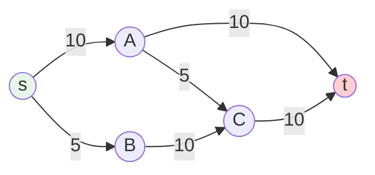
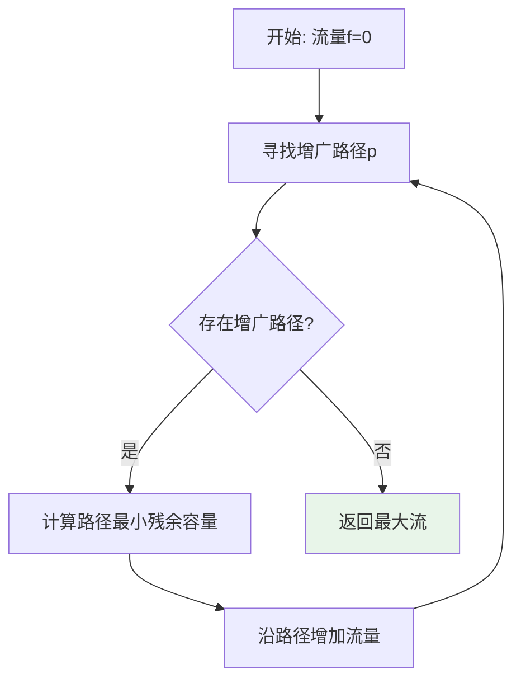
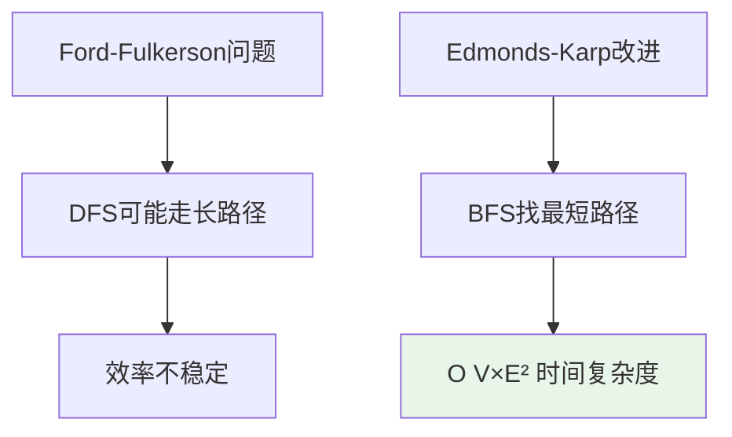
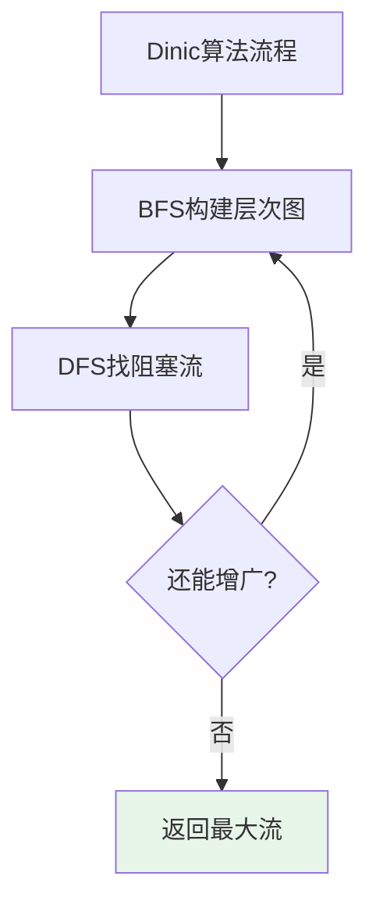

# 网络流

## 概述

网络流（Network Flow）是图论中的重要问题，研究在容量限制下从源点到汇点的最大流量问题。它是许多优化问题的理论基础，广泛应用于运输调度、资源分配、匹配问题等领域。

!!! note "网络流的实际意义"
    想象一个管道网络：水从水源出发，通过各种管道流向目的地。每根管道有容量限制，如何安排使得从源到目的地的水流量最大？这就是网络流问题。

## 基本概念

### 网络定义

```
网络 N = (G, s, t, c):
- G = (V, E): 有向图
- s: 源点（Source）
- t: 汇点（Sink）
- c: 容量函数，c(u,v) 表示边(u,v)的最大流量
```

### 核心概念

| 概念 | 定义 | 说明 |
|------|------|------|
| **源点** | 流的起点 | 只有流出，没有流入 |
| **汇点** | 流的终点 | 只有流入，没有流出 |
| **容量** | 边的最大流量 | 非负值 |
| **流量** | 边的实际流量 | 0 ≤ f(u,v) ≤ c(u,v) |
| **残余容量** | c(u,v) - f(u,v) | 还能增加的流量 |

### 流的约束条件

```
1. 容量约束: 0 ≤ f(u,v) ≤ c(u,v)
   流量不能超过容量

2. 流量守恒: Σf(u,v) = Σf(v,u) (对于中间节点v)
   流入 = 流出

3. 源汇约束: 流量值 = Σf(s,v) - Σf(v,s) = Σf(v,t) - Σf(t,v)
   从源流出的总流量 = 流入汇的总流量
```

## 网络可视化

```
示例网络:

         容量
    s ─────────→ A ─────────→ t
    │    10       │    10      ↑
    │             │            │
    │    5        │    5       │ 10
    ↓             ↓            │
    B ─────────→ C ────────────┘
         10          10

最大流 = 15
路径1: s→A→t, 流量=10
路径2: s→B→C→t, 流量=5
```



## Ford-Fulkerson方法

### 核心思想

通过不断寻找**增广路径**来增加流量，直到无法找到增广路径为止。



### 增广路径

增广路径是从源到汇的路径，路径上每条边的残余容量 > 0。

```
残余容量计算:
- 正向边(u,v): residual = c(u,v) - f(u,v)
- 反向边(v,u): residual = f(u,v)  (可以"撤销"之前的流量)

增广量: min{residual(u,v)} 路径上所有边
```

### DFS实现

```c
#define MAX_V 100
#define INF 1000000000

int capacity[MAX_V][MAX_V];
int flow[MAX_V][MAX_V];
int visited[MAX_V];

int dfs(int u, int t, int minCap, int n) {
    if (u == t) return minCap;  // 到达汇点
    
    visited[u] = 1;
    
    for (int v = 0; v < n; v++) {
        int residual = capacity[u][v] - flow[u][v];
        
        if (!visited[v] && residual > 0) {
            int augment = dfs(v, t, 
                             (minCap < residual) ? minCap : residual, n);
            
            if (augment > 0) {
                flow[u][v] += augment;   // 增加正向流量
                flow[v][u] -= augment;   // 减少反向流量
                return augment;
            }
        }
    }
    
    return 0;
}

int fordFulkerson(int s, int t, int n) {
    // 初始化流量为0
    for (int i = 0; i < n; i++) {
        for (int j = 0; j < n; j++) {
            flow[i][j] = 0;
        }
    }
    
    int maxFlow = 0;
    
    while (1) {
        for (int i = 0; i < n; i++) visited[i] = 0;
        
        int augment = dfs(s, t, INF, n);
        
        if (augment == 0) break;  // 无法找到增广路径
        
        maxFlow += augment;
    }
    
    return maxFlow;
}
```

## Edmonds-Karp算法

### 改进：使用BFS

BFS保证找到**最短增广路径**，使得算法时间复杂度可控。



### 实现

```c
int parent[MAX_V];

int bfs(int s, int t, int n) {
    for (int i = 0; i < n; i++) visited[i] = 0;
    
    int queue[MAX_V];
    int front = 0, rear = 0;
    
    queue[rear++] = s;
    visited[s] = 1;
    parent[s] = -1;
    
    while (front < rear) {
        int u = queue[front++];
        
        for (int v = 0; v < n; v++) {
            int residual = capacity[u][v] - flow[u][v];
            
            if (!visited[v] && residual > 0) {
                visited[v] = 1;
                parent[v] = u;
                queue[rear++] = v;
                
                if (v == t) return 1;  // 找到增广路径
            }
        }
    }
    
    return 0;
}

int edmondsKarp(int s, int t, int n) {
    for (int i = 0; i < n; i++) {
        for (int j = 0; j < n; j++) {
            flow[i][j] = 0;
        }
    }
    
    int maxFlow = 0;
    
    while (bfs(s, t, n)) {
        // 找路径上的最小残余容量
        int pathFlow = INF;
        
        for (int v = t; v != s; v = parent[v]) {
            int u = parent[v];
            int residual = capacity[u][v] - flow[u][v];
            if (residual < pathFlow) pathFlow = residual;
        }
        
        // 更新流量
        for (int v = t; v != s; v = parent[v]) {
            int u = parent[v];
            flow[u][v] += pathFlow;
            flow[v][u] -= pathFlow;
        }
        
        maxFlow += pathFlow;
    }
    
    return maxFlow;
}
```

## Dinic算法

### 核心思想

使用**层次图**和**阻塞流**的概念，一次BFS+DFS处理多条增广路径。



### 层次图

将顶点按到源点的距离分层，只保留从第i层到第i+1层的边。

```
层次图示例:

原图:
    s → A → t
    s → B → C → t

层次图:
    层0: s
    层1: A, B
    层2: C
    层3: t

只保留: s→A, s→B, A→t, B→C, C→t
```

### 实现

```c
int level[MAX_V];

// BFS构建层次图
int bfsLevel(int s, int t, int n) {
    for (int i = 0; i < n; i++) level[i] = -1;
    
    int queue[MAX_V];
    int front = 0, rear = 0;
    
    queue[rear++] = s;
    level[s] = 0;
    
    while (front < rear) {
        int u = queue[front++];
        
        for (int v = 0; v < n; v++) {
            int residual = capacity[u][v] - flow[u][v];
            
            if (level[v] == -1 && residual > 0) {
                level[v] = level[u] + 1;
                queue[rear++] = v;
            }
        }
    }
    
    return level[t] != -1;  // 能到达汇点
}

// DFS找阻塞流
int dfsDinic(int u, int t, int minCap, int n, int start[]) {
    if (u == t) return minCap;
    
    // 当前弧优化：从上次停止的位置继续
    for (int &v = start[u]; v < n; v++) {
        int residual = capacity[u][v] - flow[u][v];
        
        if (level[v] == level[u] + 1 && residual > 0) {
            int augment = dfsDinic(v, t, 
                                   (minCap < residual) ? minCap : residual, 
                                   n, start);
            
            if (augment > 0) {
                flow[u][v] += augment;
                flow[v][u] -= augment;
                return augment;
            }
        }
    }
    
    return 0;
}

int dinic(int s, int t, int n) {
    for (int i = 0; i < n; i++) {
        for (int j = 0; j < n; j++) {
            flow[i][j] = 0;
        }
    }
    
    int maxFlow = 0;
    
    while (bfsLevel(s, t, n)) {
        int start[MAX_V];
        for (int i = 0; i < n; i++) start[i] = 0;
        
        while (1) {
            int augment = dfsDinic(s, t, INF, n, start);
            if (augment == 0) break;
            maxFlow += augment;
        }
    }
    
    return maxFlow;
}
```

## 最大流最小割定理

### 割的定义

将顶点分成两部分S和T，其中s∈S，t∈T。

```
割的容量: cap(S,T) = Σc(u,v), 其中u∈S, v∈T
割的流量: f(S,T) = Σf(u,v) - Σf(v,u), 其中u∈S, v∈T
```

### 定理内容

```
最大流 = 最小割

即: max flow = min cut

意义:
- 最大流量等于最小割的容量
- 找到最大流的同时，也找到了最小割
- 最小割是网络的"瓶颈"
```


### 找最小割

```c
void findMinCut(int s, int t, int n, int inS[]) {
    // 在残余网络中从s做BFS/DFS
    // 能到达的顶点属于S，不能到达的属于T
    
    for (int i = 0; i < n; i++) inS[i] = 0;
    
    int queue[MAX_V];
    int front = 0, rear = 0;
    
    queue[rear++] = s;
    inS[s] = 1;
    
    while (front < rear) {
        int u = queue[front++];
        
        for (int v = 0; v < n; v++) {
            int residual = capacity[u][v] - flow[u][v];
            
            if (!inS[v] && residual > 0) {
                inS[v] = 1;
                queue[rear++] = v;
            }
        }
    }
    
    // inS[i]=1 表示顶点i在S中
    // inS[i]=0 表示顶点i在T中
}
```

## C++ 实现

```cpp
#include <vector>
#include <queue>
#include <algorithm>

class MaxFlow {
private:
    struct Edge {
        int to, capacity, flow;
        Edge(int t, int c) : to(t), capacity(c), flow(0) {}
        int residual() const { return capacity - flow; }
    };
    
    std::vector<std::vector<int>> adj;  // 邻接表存储边的编号
    std::vector<Edge> edges;             // 边集
    int n;
    
    bool bfs(int s, int t, std::vector<int>& level) {
        level.assign(n, -1);
        std::queue<int> q;
        
        level[s] = 0;
        q.push(s);
        
        while (!q.empty()) {
            int u = q.front(); q.pop();
            
            for (int eid : adj[u]) {
                int v = edges[eid].to;
                if (level[v] == -1 && edges[eid].residual() > 0) {
                    level[v] = level[u] + 1;
                    q.push(v);
                }
            }
        }
        
        return level[t] != -1;
    }
    
    int dfs(int u, int t, int minCap, 
            std::vector<int>& level, std::vector<int>& start) {
        if (u == t) return minCap;
        
        for (int &i = start[u]; i < adj[u].size(); i++) {
            int eid = adj[u][i];
            int v = edges[eid].to;
            
            if (level[v] == level[u] + 1 && edges[eid].residual() > 0) {
                int augment = dfs(v, t, 
                                  std::min(minCap, edges[eid].residual()), 
                                  level, start);
                if (augment > 0) {
                    edges[eid].flow += augment;
                    edges[eid ^ 1].flow -= augment;  // 反向边
                    return augment;
                }
            }
        }
        
        return 0;
    }
    
public:
    MaxFlow(int vertices) : n(vertices), adj(vertices) {}
    
    void addEdge(int u, int v, int cap) {
        adj[u].push_back(edges.size());
        edges.emplace_back(v, cap);      // 正向边
        adj[v].push_back(edges.size());
        edges.emplace_back(u, 0);        // 反向边（容量为0）
    }
    
    int dinic(int s, int t) {
        int maxFlow = 0;
        std::vector<int> level, start;
        
        while (bfs(s, t, level)) {
            start.assign(n, 0);
            while (int augment = dfs(s, t, INT_MAX, level, start)) {
                maxFlow += augment;
            }
        }
        
        return maxFlow;
    }
};
```

## 复杂度分析

| 算法 | 时间复杂度 | 空间复杂度 | 特点 |
|------|-----------|-----------|------|
| Ford-Fulkerson | O(E × maxFlow) | O(V²) | 简单，但可能很慢 |
| Edmonds-Karp | O(V × E²) | O(V²) | 保证多项式时间 |
| Dinic | O(V² × E) | O(V²) | 实践中最快 |
| ISAP | O(V² × E) | O(V²) | 无需多次BFS |

```
特殊情况:
- 单位容量网络: Dinic = O(min(V^(2/3), E^(1/2)) × E)
- 二分图匹配: Dinic = O(V^(1/2) × E)
```

## 应用场景

### 1. 二分图最大匹配

```c
// 二分图最大匹配 = 最大流
// 构造：源点连左部所有点，右部所有点连汇点，边容量为1
int bipartiteMatching(int graph[MAX_V][MAX_V], int n, int m) {
    MaxFlow mf(n + m + 2);
    int s = n + m, t = n + m + 1;
    
    // 源点连左部
    for (int i = 0; i < n; i++) {
        mf.addEdge(s, i, 1);
    }
    
    // 左部连右部
    for (int i = 0; i < n; i++) {
        for (int j = 0; j < m; j++) {
            if (graph[i][j]) {
                mf.addEdge(i, n + j, 1);
            }
        }
    }
    
    // 右部连汇点
    for (int j = 0; j < m; j++) {
        mf.addEdge(n + j, t, 1);
    }
    
    return mf.dinic(s, t);
}
```

### 2. 多源多汇最大流

```c
// 添加超级源和超级汇
int multiSourceSink(int sources[], int srcCount, 
                   int sinks[], int sinkCount) {
    int superS = n, superT = n + 1;
    
    // 超级源连所有源点（容量无穷）
    for (int i = 0; i < srcCount; i++) {
        addEdge(superS, sources[i], INF);
    }
    
    // 所有汇点连超级汇（容量无穷）
    for (int i = 0; i < sinkCount; i++) {
        addEdge(sinks[i], superT, INF);
    }
    
    return dinic(superS, superT, n + 2);
}
```

### 3. 项目选择问题

```c
// 选择一组项目，使得总收益最大
// 约束：选择某项目必须同时选择其依赖项目
int projectSelection(int profit[], int n, 
                    int depends[][2], int depCount) {
    // 正收益项目连源点，负收益项目连汇点
    // 依赖关系建模为无穷容量边
    // 答案 = 正收益总和 - 最小割
}
```

## 参考资料

- 《算法导论》第26章 - 最大流
- Ford, L. R., & Fulkerson, D. R. (1956). "Maximal flow through a network"
- Dinic, E. A. (1970). "Algorithm for solution of a problem of maximum flow"
- [Network Flow - Wikipedia](https://en.wikipedia.org/wiki/Network_flow)
