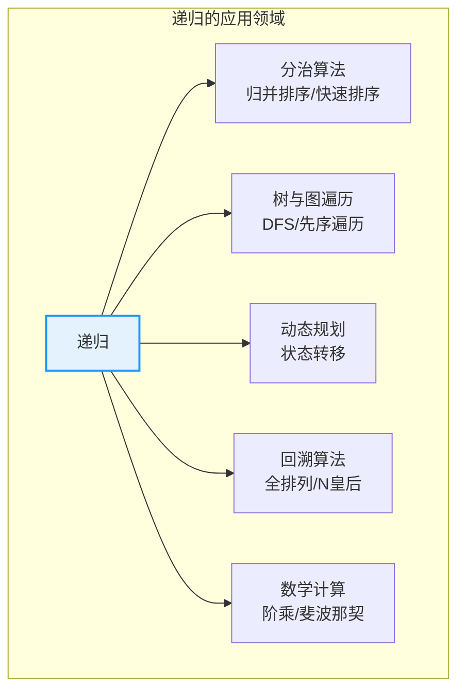
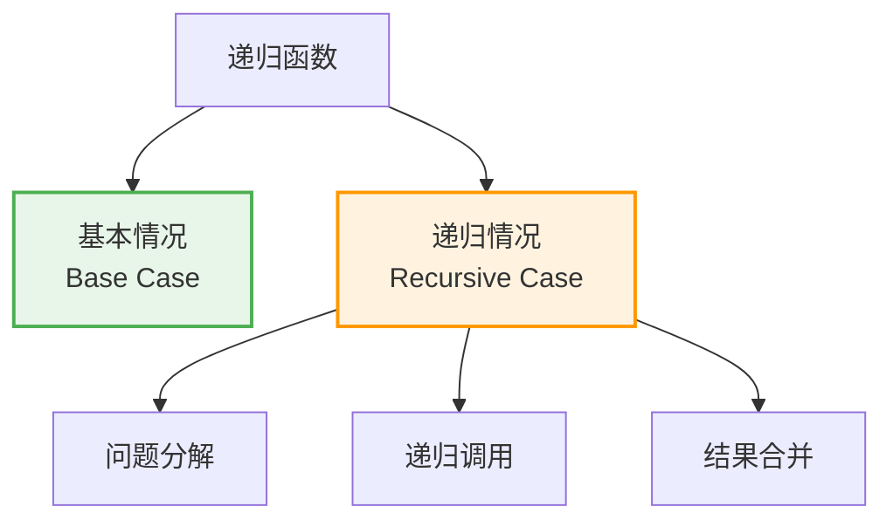
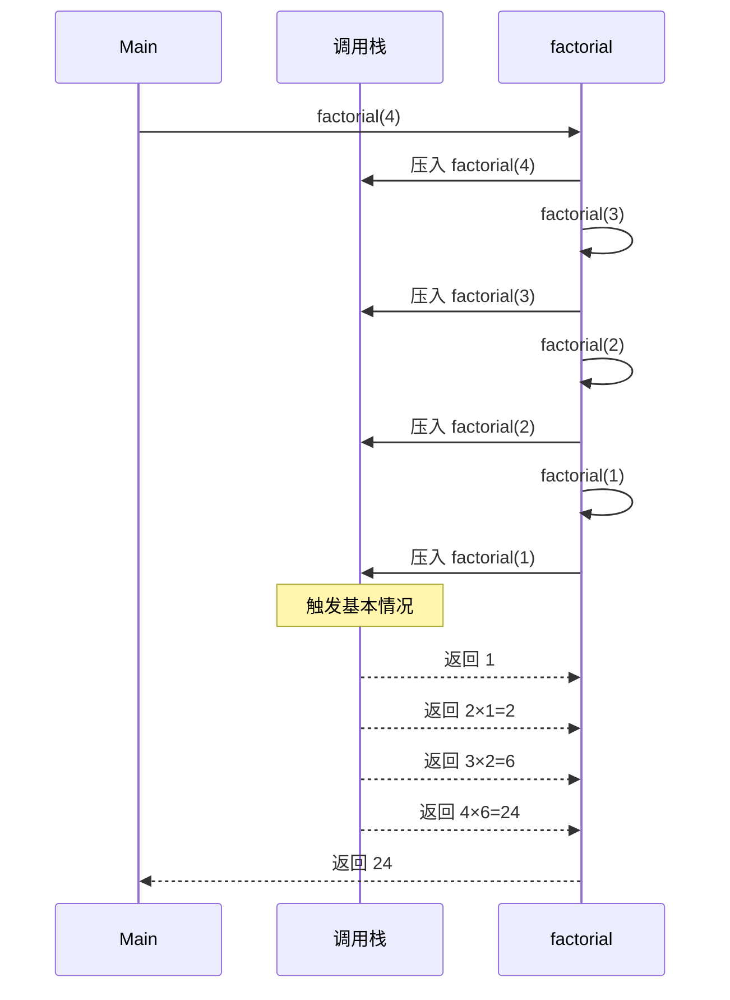
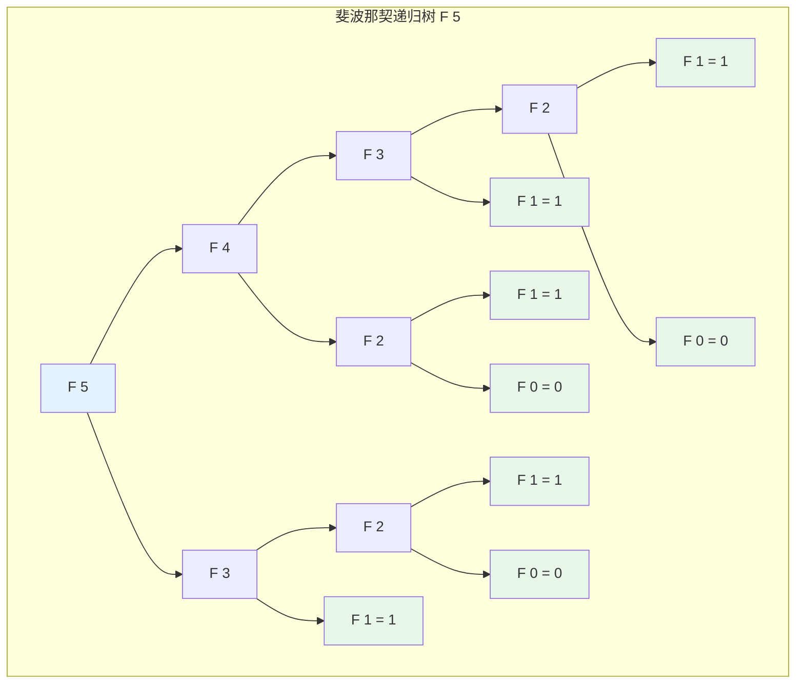
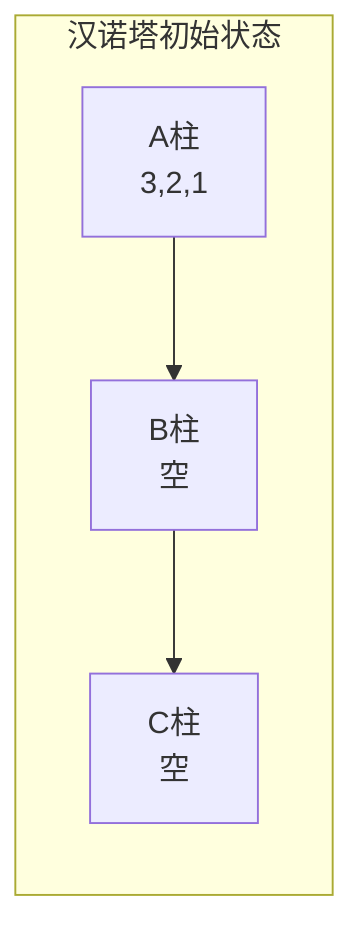
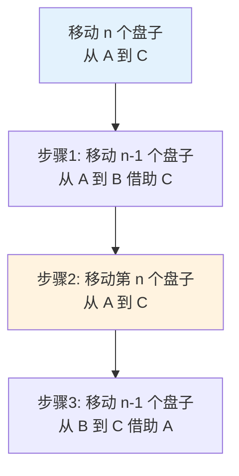
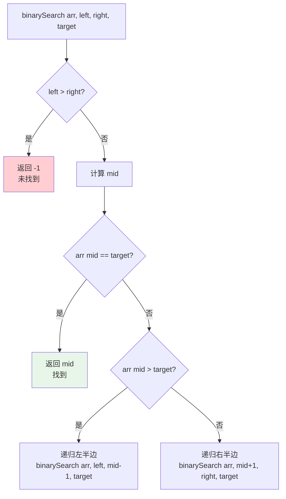
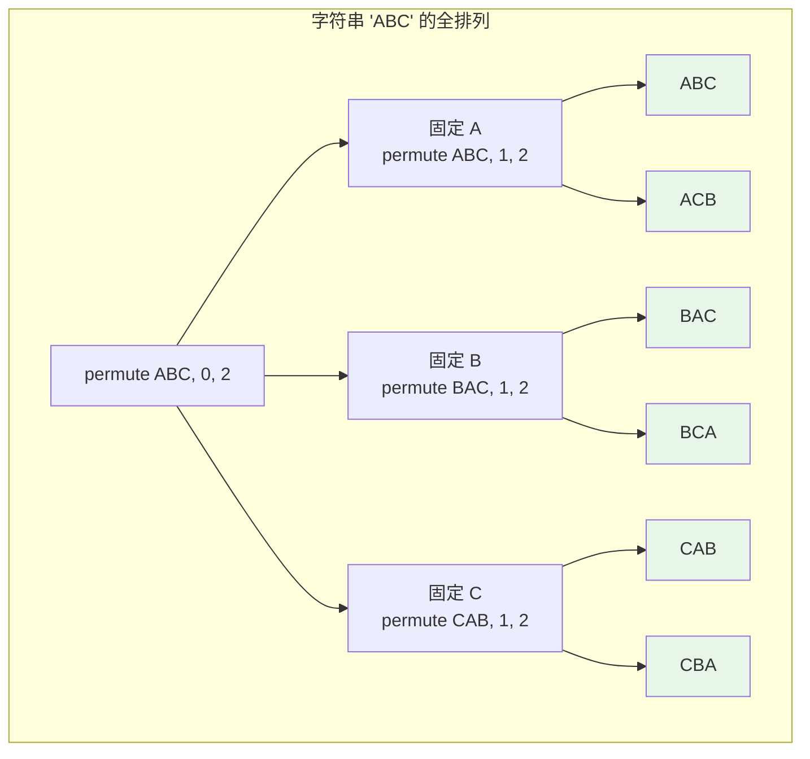
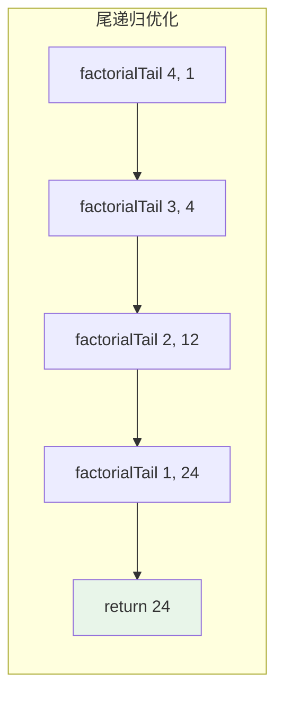
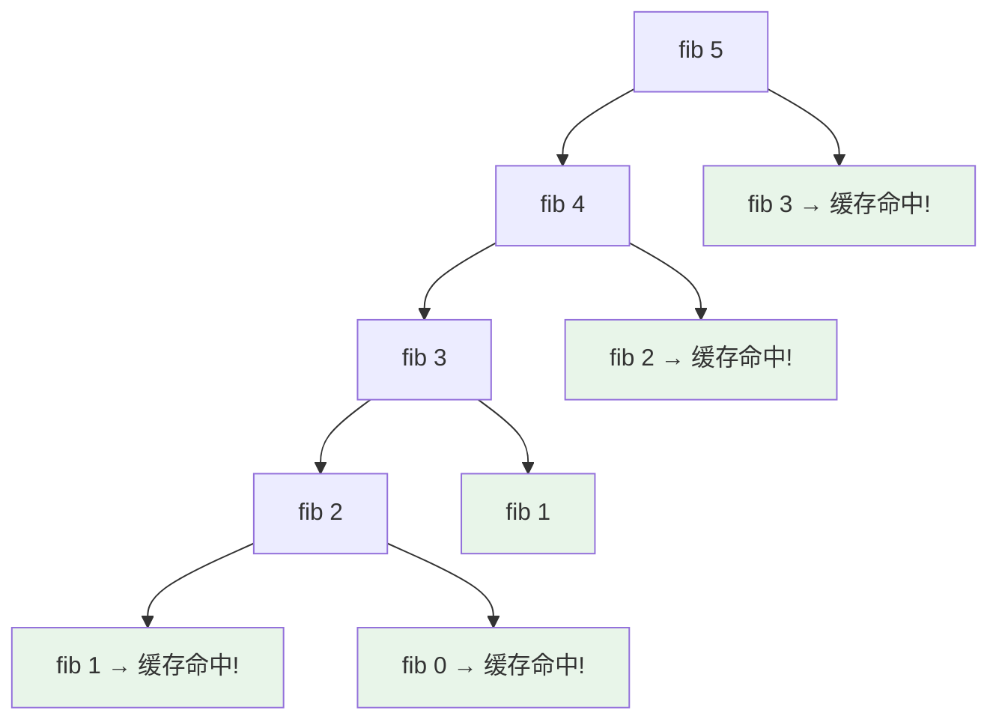

# 递归算法

## 概述

递归（Recursion）是一种函数直接或间接调用自身的编程技术。通过将复杂问题分解为相同性质但规模更小的子问题，递归提供了一种优雅且直观的问题求解方式。

<div style="background-color: #E3F2FD; border-left: 4px solid #2196F3; padding: 12px; margin: 10px 0;">
<strong>核心思想：</strong>递归的核心是<strong>分治思想</strong>——将大问题分解为小问题，小问题的解组合成大问题的解。递归函数必须有两个要素：<strong>基本情况（终止条件）</strong>和<strong>递归情况（问题分解）</strong>。
</div>

### 递归的重要性



## 递归要素

每个递归函数都必须包含两个基本要素：



| 要素 | 说明 | 作用 |
|------|------|------|
| **基本情况** | 直接返回结果的终止条件 | 防止无限递归 |
| **递归情况** | 问题分解为更小的子问题 | 推进问题求解 |
| **递归关系** | 原问题与子问题的关系 | 定义解的组合方式 |

## 递归执行原理

### 调用栈机制

递归通过**调用栈**（Call Stack）实现：



### 阶乘递归过程详解

```
计算 4! 的递归过程:

═══════════════════════════════════════════════════════════════
递推阶段（向下调用）
═══════════════════════════════════════════════════════════════

factorial(4)
    └─ 4 * factorial(3)          ← 等待 factorial(3) 的结果
           └─ 3 * factorial(2)   ← 等待 factorial(2) 的结果
                  └─ 2 * factorial(1)  ← 等待 factorial(1) 的结果
                         └─ return 1  ← 基本情况，返回 1

═══════════════════════════════════════════════════════════════
回归阶段（向上返回）
═══════════════════════════════════════════════════════════════

factorial(1) = 1
factorial(2) = 2 * 1 = 2
factorial(3) = 3 * 2 = 6
factorial(4) = 4 * 6 = 24

最终结果: 24
```

```c
long long factorial(int n) {
    // 基本情况
    if (n <= 1) return 1;
    // 递归情况
    return n * factorial(n - 1);
}
```

## 经典递归示例

### 1. 斐波那契数列

斐波那契数列定义：$F(n) = F(n-1) + F(n-2)$，其中 $F(0) = 0, F(1) = 1$



<div style="background-color: #FFF3E0; border-left: 4px solid #FF9800; padding: 12px; margin: 10px 0;">
<strong>⚠️ 注意：</strong>朴素的斐波那契递归有严重的<strong>重复计算</strong>问题！从图中可见 F(3)、F(2) 被多次计算，时间复杂度为 O(2^n)。使用记忆化可优化到 O(n)。
</div>

```c
// 朴素递归（效率低）
long long fibonacci(int n) {
    if (n <= 1) return n;  // 基本情况
    return fibonacci(n - 1) + fibonacci(n - 2);  // 递归情况
}

// 记忆化递归（效率高）
long long fib[1000] = {0};
long long fibonacciMemo(int n) {
    if (n <= 1) return n;
    if (fib[n] != 0) return fib[n];  // 查缓存
    return fib[n] = fibonacciMemo(n - 1) + fibonacciMemo(n - 2);
}

// 迭代版本（最优）
long long fibonacciOptimized(int n) {
    if (n <= 1) return n;
    
    long long a = 0, b = 1;
    for (int i = 2; i <= n; i++) {
        long long temp = a + b;
        a = b;
        b = temp;
    }
    return b;
}
```

### 2. 汉诺塔

汉诺塔是最经典的递归问题：将 n 个盘子从柱子 A 移到柱子 C，借助柱子 B。



**递归思路：**



**汉诺塔移动过程（n=3）：**

```
═══════════════════════════════════════════════════════════════
初始状态
═══════════════════════════════════════════════════════════════

A: [3, 2, 1]    B: [ ]        C: [ ]

═══════════════════════════════════════════════════════════════
步骤1: 移动 2 个盘子从 A 到 B
═══════════════════════════════════════════════════════════════

  移动盘子 1: A → C
  A: [3, 2]      B: [ ]        C: [1]
  
  移动盘子 2: A → B
  A: [3]         B: [2]        C: [1]
  
  移动盘子 1: C → B
  A: [3]         B: [2, 1]     C: [ ]

═══════════════════════════════════════════════════════════════
步骤2: 移动盘子 3 从 A 到 C
═══════════════════════════════════════════════════════════════

  移动盘子 3: A → C
  A: [ ]         B: [2, 1]     C: [3]

═══════════════════════════════════════════════════════════════
步骤3: 移动 2 个盘子从 B 到 C
═══════════════════════════════════════════════════════════════

  移动盘子 1: B → A
  A: [1]         B: [2]        C: [3]
  
  移动盘子 2: B → C
  A: [1]         B: [ ]        C: [3, 2]
  
  移动盘子 1: A → C
  A: [ ]         B: [ ]        C: [3, 2, 1]

═══════════════════════════════════════════════════════════════
完成！总共需要 2³ - 1 = 7 次移动
═══════════════════════════════════════════════════════════════
```

```c
void hanoi(int n, char from, char to, char aux) {
    // 基本情况：只有一个盘子
    if (n == 1) {
        printf("Move disk 1 from %c to %c\n", from, to);
        return;
    }
    
    // 递归情况：
    // 1. 将 n-1 个盘子从 from 移到 aux
    hanoi(n - 1, from, aux, to);
    
    // 2. 将第 n 个盘子从 from 移到 to
    printf("Move disk %d from %c to %c\n", n, from, to);
    
    // 3. 将 n-1 个盘子从 aux 移到 to
    hanoi(n - 1, aux, to, from);
}
```

### 3. 二分查找（递归版）



```c
int binarySearch(int arr[], int left, int right, int target) {
    // 基本情况：搜索范围为空
    if (left > right) return -1;
    
    int mid = left + (right - left) / 2;
    
    if (arr[mid] == target) return mid;  // 找到
    if (arr[mid] > target)
        return binarySearch(arr, left, mid - 1, target);  // 搜索左半边
    return binarySearch(arr, mid + 1, right, target);      // 搜索右半边
}
```

### 4. 数组求和

```c
int sum(int arr[], int n) {
    // 基本情况：空数组
    if (n <= 0) return 0;
    // 递归情况：最后一个元素 + 前面所有元素的和
    return arr[n - 1] + sum(arr, n - 1);
}
```

```
sum([1, 2, 3, 4, 5], 5) 的递归过程:

sum([1,2,3,4,5], 5) = 5 + sum([1,2,3,4], 4)
                             = 5 + (4 + sum([1,2,3], 3))
                                      = 5 + 4 + (3 + sum([1,2], 2))
                                               = 5 + 4 + 3 + (2 + sum([1], 1))
                                                        = 5 + 4 + 3 + 2 + (1 + sum([], 0))
                                                                 = 5 + 4 + 3 + 2 + 1 + 0
                                                                 = 15
```

### 5. 字符串反转

```c
void reverseString(char str[], int left, int right) {
    // 基本情况：空串或单字符
    if (left >= right) return;
    
    // 交换首尾字符
    char temp = str[left];
    str[left] = str[right];
    str[right] = temp;
    
    // 递归处理中间部分
    reverseString(str, left + 1, right - 1);
}
```

### 6. 全排列



```c
void swap(char *a, char *b) {
    char temp = *a;
    *a = *b;
    *b = temp;
}

void permute(char str[], int left, int right) {
    // 基本情况：只剩一个字符
    if (left == right) {
        printf("%s\n", str);
        return;
    }
    
    // 递归情况：依次固定每个位置的字符
    for (int i = left; i <= right; i++) {
        swap(&str[left], &str[i]);      // 交换到当前位置
        permute(str, left + 1, right);  // 递归处理剩余部分
        swap(&str[left], &str[i]);      // 回溯，恢复原状
    }
}
```

## 递归转迭代

递归虽然优雅，但存在栈溢出和性能问题。可以转换为迭代：

### 方法1：使用数组缓存（记忆化）

```c
long long fib[1000];

long long fibonacciMemo(int n) {
    if (n <= 1) return n;
    if (fib[n] != 0) return fib[n];  // 查缓存
    return fib[n] = fibonacciMemo(n - 1) + fibonacciMemo(n - 2);
}
```

### 方法2：使用尾递归

尾递归：递归调用是函数的最后操作，可以被编译器优化为迭代。

```c
// 尾递归版本的阶乘
long long factorialTail(int n, long long accumulator) {
    if (n <= 1) return accumulator;
    return factorialTail(n - 1, n * accumulator);  // 尾调用
}

long long factorial(int n) {
    return factorialTail(n, 1);
}
```



### 方法3：显式使用栈

```c
void traverseIterative(TreeNode *root) {
    if (root == NULL) return;
    
    Stack *stack = createStack();
    push(stack, root);
    
    while (!isEmpty(stack)) {
        TreeNode *node = pop(stack);
        printf("%d ", node->data);
        
        if (node->right) push(stack, node->right);
        if (node->left) push(stack, node->left);
    }
}
```

## 递归复杂度分析

### 递推关系

通过递推关系分析递归时间复杂度：

| 递推关系 | 时间复杂度 | 示例 | 说明 |
|---------|-----------|------|------|
| T(n) = T(n-1) + O(1) | O(n) | 阶乘 | 每次减少1，线性 |
| T(n) = 2T(n-1) + O(1) | O(2^n) | 汉诺塔 | 每次分两路，指数 |
| T(n) = T(n/2) + O(1) | O(log n) | 二分查找 | 每次减半，对数 |
| T(n) = 2T(n/2) + O(n) | O(n log n) | 归并排序 | 分治合并 |
| T(n) = T(n-1) + T(n-2) | O(φ^n) | 斐波那契 | φ≈1.618黄金比例 |

### 主定理

对于递推式 **T(n) = aT(n/b) + f(n)**：

```
设 n^log_b(a) 为临界函数

情况1: 若 f(n) = O(n^(log_b(a) - ε))，则 T(n) = Θ(n^log_b(a))
情况2: 若 f(n) = Θ(n^log_b(a))，则 T(n) = Θ(n^log_b(a) * log n)
情况3: 若 f(n) = Ω(n^(log_b(a) + ε))，则 T(n) = Θ(f(n))
```

**主定理应用示例：**

```
归并排序: T(n) = 2T(n/2) + n
- a=2, b=2, f(n)=n
- log_b(a) = log₂(2) = 1
- n^log_b(a) = n
- f(n) = Θ(n)，符合情况2
- T(n) = Θ(n log n)

二分查找: T(n) = T(n/2) + 1
- a=1, b=2, f(n)=1
- log_b(a) = log₂(1) = 0
- n^log_b(a) = 1
- f(n) = Θ(1)，符合情况2
- T(n) = Θ(log n)
```

## 递归优化技术

### 1. 记忆化搜索

缓存已计算的子问题结果，避免重复计算：



```c
#define MAX 1000
int memo[MAX];

void initMemo() {
    for (int i = 0; i < MAX; i++) memo[i] = -1;
}

int fibMemo(int n) {
    if (n <= 1) return n;
    if (memo[n] != -1) return memo[n];  // 缓存命中
    return memo[n] = fibMemo(n - 1) + fibMemo(n - 2);
}
```

### 2. 剪枝优化

在递归过程中提前终止不可能的分支：

```c
int canSum(int target, int nums[], int n, int memo[]) {
    if (target == 0) return 1;   // 找到解
    if (target < 0) return 0;    // 剪枝：不可能
    if (memo[target] != -1) return memo[target];  // 记忆化
    
    for (int i = 0; i < n; i++) {
        if (canSum(target - nums[i], nums, n, memo)) {
            memo[target] = 1;
            return 1;
        }
    }
    
    memo[target] = 0;
    return 0;
}
```

## 递归陷阱与解决

### 1. 栈溢出

```c
// 危险：深度递归可能栈溢出
void recurse(int n) {
    if (n == 0) return;
    recurse(n - 1);
}

recurse(1000000);  // 可能栈溢出！

// 解决：转换为迭代
void recurseIterative(int n) {
    while (n > 0) {
        n--;
    }
}
```

### 2. 重复计算

```c
// 危险：大量重复计算
long long fib(int n) {
    if (n <= 1) return n;
    return fib(n-1) + fib(n-2);  // fib(n-2) 会被多次计算
}

// 解决：记忆化或迭代
```

### 3. 递归深度限制

```
不同语言的递归深度限制:

Python: 默认 1000（可设置 sys.setrecursionlimit）
Java: 取决于栈大小，通常几千到几万
C/C++: 取决于栈大小，通常几万
```

## 递归与迭代对比

| 特性 | 递归 | 迭代 |
|------|------|------|
| **代码简洁性** | 通常更简洁 | 可能更复杂 |
| **空间复杂度** | O(深度) 调用栈 | O(1) 通常更优 |
| **时间效率** | 函数调用开销 | 通常更快 |
| **可读性** | 问题自然表达 | 需要理解状态变化 |
| **调试难度** | 较难跟踪 | 相对容易 |
| **栈溢出风险** | 存在 | 不存在 |

## 递归思想总结

| 思想 | 描述 | 典型应用 |
|------|------|----------|
| **分解** | 问题分解为子问题 | 归并排序、快速排序 |
| **减治** | 减少问题规模 | 二分查找、插入排序 |
| **回溯** | 试探所有可能 | 全排列、N皇后 |
| **记忆** | 缓存子问题结果 | 动态规划 |
| **分治** | 分解→求解→合并 | 大整数乘法 |

## 参考资料

- 《算法导论》第4章：分治策略
- 《数据结构与算法分析》第1章：递归
- [Wikipedia - Recursion](https://en.wikipedia.org/wiki/Recursion)
