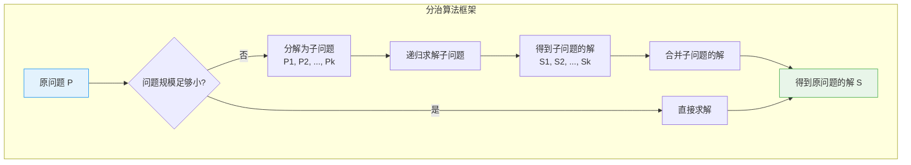
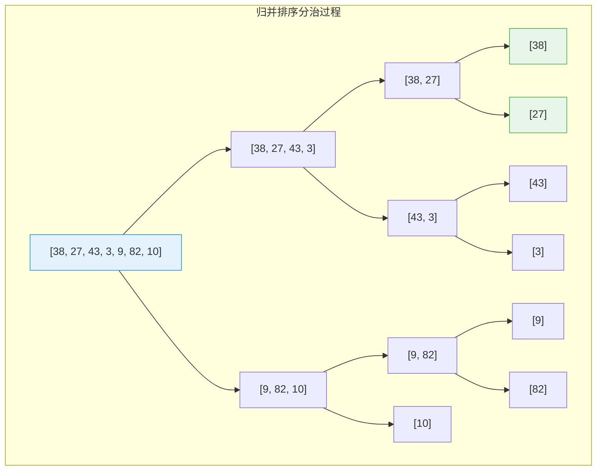
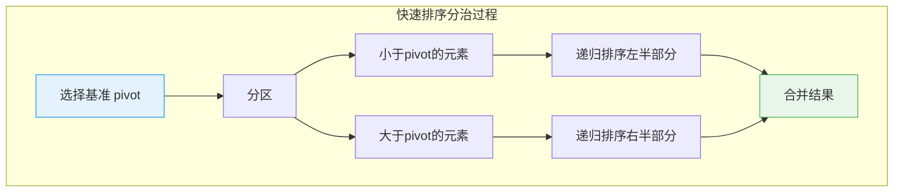
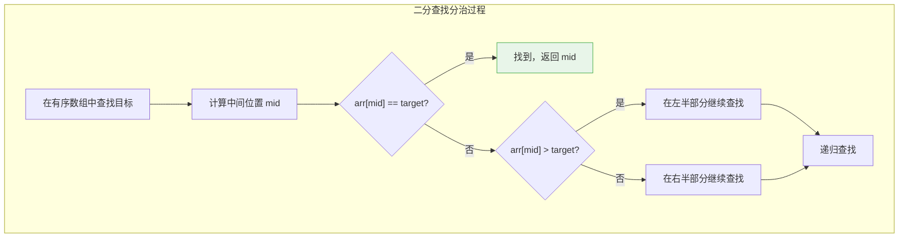
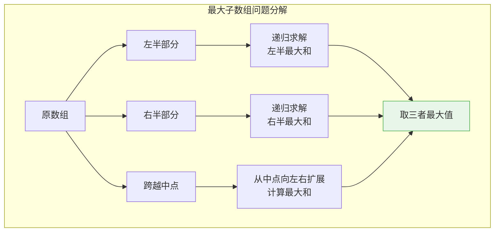
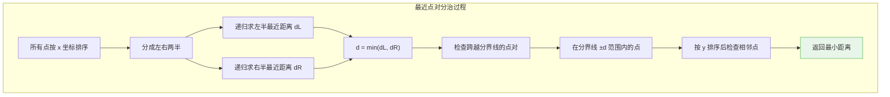
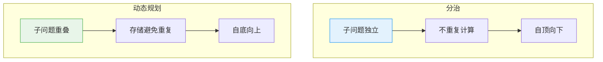
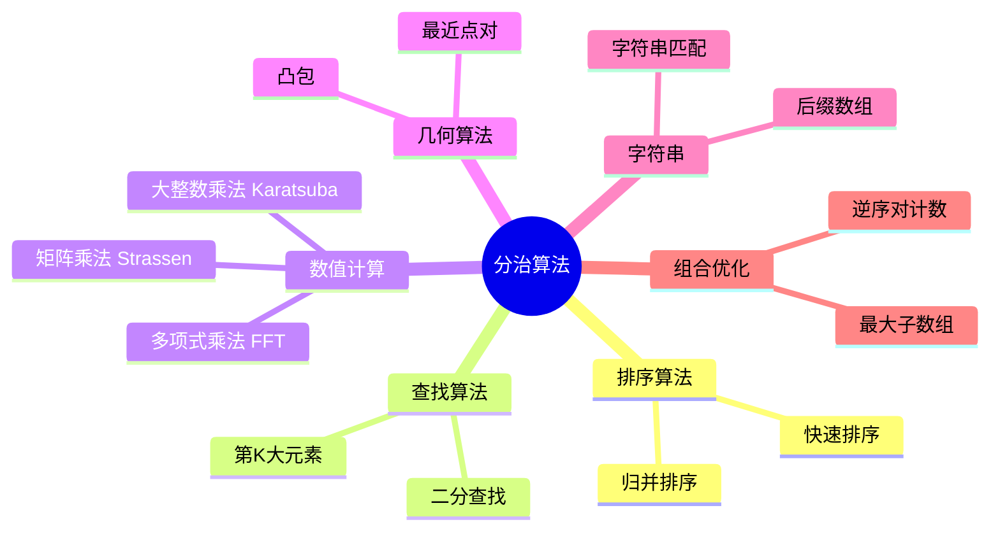

# 分治算法

## 概述

分治算法（Divide and Conquer）是一种重要的算法设计范式，其核心思想是：**将一个复杂问题分解为若干规模较小的相同子问题，递归求解子问题，然后将子问题的解合并得到原问题的解**。

<div style="background-color: #E3F2FD; padding: 15px; margin: 10px 0; border-left: 4px solid #2196F3; border-radius: 5px;">
    <strong>分治三步骤</strong>
    <ul style="margin: 5px 0;">
        <li><strong>分解（Divide）</strong>：将原问题分解为若干规模较小的子问题</li>
        <li><strong>解决（Conquer）</strong>：递归求解子问题，若子问题足够小则直接求解</li>
        <li><strong>合并（Combine）</strong>：将子问题的解合并为原问题的解</li>
    </ul>
</div>

!!! note "生活类比"
    想象你要在一堆硬币中找出假币（重量不同）：你可以把硬币分成两半，分别称重，找出较轻的那一半，然后继续在那半中找，直到找到假币。这就是分治的思想——大问题拆成小问题，逐个解决。

## 分治框架



### 伪代码模板

```
def divide_and_conquer(problem):
    # 基本情况：问题足够小，直接求解
    if problem is small enough:
        return solve_directly(problem)
    
    # 分解：将问题分成子问题
    subproblems = divide(problem)
    
    # 解决：递归求解子问题
    subsolutions = []
    for subproblem in subproblems:
        subsolutions.append(divide_and_conquer(subproblem))
    
    # 合并：将子问题的解合并
    result = combine(subsolutions)
    
    return result
```

## 经典分治算法

### 归并排序

#### 算法原理



#### 合并过程

```
合并 [27, 38] 和 [3, 43]:

步骤1: 比较 27 和 3
┌─────────────────────────────────────────────────────────────┐
│ 左数组: [27, 38]     右数组: [3, 43]                         │
│        ↑                    ↑                               │
│       i=0                  j=0                              │
│                                                             │
│ arr[i]=27 > arr[j]=3 → 取 3, j++                            │
│ 结果: [3]                                                    │
└─────────────────────────────────────────────────────────────┘

步骤2: 比较 27 和 43
┌─────────────────────────────────────────────────────────────┐
│ 左数组: [27, 38]     右数组: [3, 43]                         │
│        ↑                       ↑                            │
│       i=0                     j=1                           │
│                                                             │
│ arr[i]=27 < arr[j]=43 → 取 27, i++                          │
│ 结果: [3, 27]                                                │
└─────────────────────────────────────────────────────────────┘

步骤3: 比较 38 和 43
┌─────────────────────────────────────────────────────────────┐
│ arr[i]=38 < arr[j]=43 → 取 38, i++                          │
│ 结果: [3, 27, 38]                                            │
└─────────────────────────────────────────────────────────────┘

步骤4: 左数组已空，添加右数组剩余元素
┌─────────────────────────────────────────────────────────────┐
│ 结果: [3, 27, 38, 43]                                        │
└─────────────────────────────────────────────────────────────┘
```

#### 实现

```c
#include <stdio.h>
#include <stdlib.h>

// 合并两个有序数组
void merge(int arr[], int left, int mid, int right, int temp[]) {
    int i = left;      // 左数组起始
    int j = mid + 1;   // 右数组起始
    int k = left;      // 临时数组起始
    
    printf("  合并 [%d, %d] 和 [%d, %d]: ", left, mid, mid + 1, right);
    
    while (i <= mid && j <= right) {
        if (arr[i] <= arr[j]) {
            temp[k++] = arr[i++];
        } else {
            temp[k++] = arr[j++];
        }
    }
    
    // 处理剩余元素
    while (i <= mid) temp[k++] = arr[i++];
    while (j <= right) temp[k++] = arr[j++];
    
    // 复制回原数组
    for (i = left; i <= right; i++) {
        arr[i] = temp[i];
    }
    
    // 打印
    for (i = left; i <= right; i++) {
        printf("%d ", arr[i]);
    }
    printf("\n");
}

// 归并排序
void mergeSort(int arr[], int left, int right, int temp[]) {
    if (left >= right) return;
    
    int mid = left + (right - left) / 2;
    
    printf("分解 [%d, %d] 为 [%d, %d] 和 [%d, %d]\n", 
           left, right, left, mid, mid + 1, right);
    
    // 分治
    mergeSort(arr, left, mid, temp);
    mergeSort(arr, mid + 1, right, temp);
    
    // 合并
    merge(arr, left, mid, right, temp);
}

int main() {
    int arr[] = {38, 27, 43, 3, 9, 82, 10};
    int n = sizeof(arr) / sizeof(arr[0]);
    int *temp = (int*)malloc(sizeof(int) * n);
    
    printf("原始数组: ");
    for (int i = 0; i < n; i++) printf("%d ", arr[i]);
    printf("\n\n");
    
    mergeSort(arr, 0, n - 1, temp);
    
    printf("\n排序结果: ");
    for (int i = 0; i < n; i++) printf("%d ", arr[i]);
    printf("\n");
    
    free(temp);
    return 0;
}
```

### 快速排序

#### 算法原理



#### 分区过程

```
分区数组 [38, 27, 43, 3, 9, 82, 10], 选择 pivot = 10

初始状态:
┌─────────────────────────────────────────────────────────────┐
│ [38, 27, 43, 3, 9, 82, 10]                                   │
│  ↑                        ↑                                 │
│ i=-1                    pivot                               │
│                          j遍历                              │
└─────────────────────────────────────────────────────────────┘

j=0: arr[0]=38 > pivot=10 → 不交换
j=1: arr[1]=27 > pivot=10 → 不交换
j=2: arr[2]=43 > pivot=10 → 不交换
j=3: arr[3]=3 < pivot=10 → 交换
┌─────────────────────────────────────────────────────────────┐
│ [3, 27, 43, 38, 9, 82, 10]                                   │
│      ↑                       ↑                              │
│     i=0                      j=3                            │
└─────────────────────────────────────────────────────────────┘

j=4: arr[4]=9 < pivot=10 → 交换
┌─────────────────────────────────────────────────────────────┐
│ [3, 9, 43, 38, 27, 82, 10]                                   │
│         ↑                    ↑                              │
│        i=1                  j=4                             │
└─────────────────────────────────────────────────────────────┘

j=5: arr[5]=82 > pivot=10 → 不交换

最后: 交换 arr[i+1] 和 pivot
┌─────────────────────────────────────────────────────────────┐
│ [3, 9, 10, 38, 27, 82, 43]                                   │
│         ↑                                                    │
│       pivot位置                                              │
└─────────────────────────────────────────────────────────────┘

结果: 左边 [3, 9] < 10, 右边 [38, 27, 82, 43] > 10
```

#### 实现

```c
#include <stdio.h>

int partition(int arr[], int low, int high) {
    int pivot = arr[high];
    int i = low - 1;
    
    printf("  分区 [%d, %d], pivot=%d: ", low, high, pivot);
    
    for (int j = low; j < high; j++) {
        if (arr[j] <= pivot) {
            i++;
            // 交换
            int temp = arr[i];
            arr[i] = arr[j];
            arr[j] = temp;
        }
    }
    
    // 将 pivot 放到正确位置
    int temp = arr[i + 1];
    arr[i + 1] = arr[high];
    arr[high] = temp;
    
    // 打印
    for (int k = low; k <= high; k++) {
        printf("%d ", arr[k]);
    }
    printf("\n");
    
    return i + 1;
}

void quickSort(int arr[], int low, int high) {
    if (low >= high) return;
    
    int pi = partition(arr, low, high);
    
    // 递归排序两部分
    quickSort(arr, low, pi - 1);
    quickSort(arr, pi + 1, high);
}
```

### 二分查找

#### 算法原理



#### 查找过程

```
在 [1, 3, 5, 7, 9, 11, 13, 15] 中查找 7:

步骤1:
┌─────────────────────────────────────────────────────────────┐
│ [1, 3, 5, 7, 9, 11, 13, 15]                                  │
│  ↑              ↑              ↑                            │
│ left=0        mid=3          right=7                       │
│                                                             │
│ arr[mid]=7 == target=7 → 找到！返回 3                       │
└─────────────────────────────────────────────────────────────┘

在 [1, 3, 5, 7, 9, 11, 13, 15] 中查找 11:

步骤1:
┌─────────────────────────────────────────────────────────────┐
│ [1, 3, 5, 7, 9, 11, 13, 15]                                  │
│  ↑              ↑              ↑                            │
│ left=0        mid=3          right=7                       │
│                                                             │
│ arr[mid]=7 < target=11 → 在右半部分查找                      │
│ left = mid + 1 = 4                                          │
└─────────────────────────────────────────────────────────────┘

步骤2:
┌─────────────────────────────────────────────────────────────┐
│ [1, 3, 5, 7, 9, 11, 13, 15]                                  │
│              ↑     ↑        ↑                               │
│            left=4 mid=5   right=7                          │
│                                                             │
│ arr[mid]=11 == target=11 → 找到！返回 5                     │
└─────────────────────────────────────────────────────────────┘
```

#### 实现

```c
int binarySearch(int arr[], int left, int right, int target) {
    if (left > right) {
        printf("未找到目标值 %d\n", target);
        return -1;
    }
    
    int mid = left + (right - left) / 2;
    
    printf("查找范围 [%d, %d], mid=%d, arr[mid]=%d\n", 
           left, right, mid, arr[mid]);
    
    if (arr[mid] == target) {
        printf("找到 %d 在位置 %d\n", target, mid);
        return mid;
    }
    
    if (arr[mid] > target) {
        return binarySearch(arr, left, mid - 1, target);
    }
    
    return binarySearch(arr, mid + 1, right, target);
}
```

### 最大子数组和

#### 问题分析

```
问题: 找到数组中连续子数组的最大和

分治思路:
1. 将数组分成左右两半
2. 最大子数组要么完全在左半部分，要么完全在右半部分，要么跨越中点
3. 递归求解左半部分和右半部分的最大和
4. 单独计算跨越中点的最大和
5. 返回三者的最大值
```



#### 实现

```c
#include <stdio.h>
#include <limits.h>

// 跨越中点的最大和
int maxCrossingSum(int arr[], int left, int mid, int right) {
    // 从中点向左找最大和
    int leftSum = INT_MIN;
    int sum = 0;
    for (int i = mid; i >= left; i--) {
        sum += arr[i];
        if (sum > leftSum) leftSum = sum;
    }
    
    // 从中点向右找最大和
    int rightSum = INT_MIN;
    sum = 0;
    for (int i = mid + 1; i <= right; i++) {
        sum += arr[i];
        if (sum > rightSum) rightSum = sum;
    }
    
    return leftSum + rightSum;
}

// 最大子数组和
int maxSubArray(int arr[], int left, int right) {
    // 基本情况
    if (left == right) return arr[left];
    
    int mid = left + (right - left) / 2;
    
    // 三种情况
    int leftMax = maxSubArray(arr, left, mid);
    int rightMax = maxSubArray(arr, mid + 1, right);
    int crossMax = maxCrossingSum(arr, left, mid, right);
    
    // 返回最大值
    int max = leftMax;
    if (rightMax > max) max = rightMax;
    if (crossMax > max) max = crossMax;
    
    return max;
}
```

### Karatsuba 大整数乘法

#### 算法原理

<div style="background-color: #F3E5F5; padding: 15px; margin: 10px 0; border-left: 4px solid #9C27B0; border-radius: 5px;">
    <strong>Karatsuba 算法</strong>
    <p>传统乘法: T(n) = 4T(n/2) + O(n) = O(n²)</p>
    <p>Karatsuba: T(n) = 3T(n/2) + O(n) = O(n^1.58)</p>
    <p>通过减少一次乘法，降低复杂度！</p>
</div>

```
计算 x × y:

分解: x = a × 10^n + b
      y = c × 10^n + d

普通方法:
  x × y = ac × 10^2n + (ad + bc) × 10^n + bd
  需要 4 次乘法: ac, ad, bc, bd

Karatsuba 优化:
  ad + bc = (a+b)(c+d) - ac - bd
  只需要 3 次乘法: ac, bd, (a+b)(c+d)
  
  x × y = ac × 10^2n + [(a+b)(c+d) - ac - bd] × 10^n + bd
```

#### 实现

```c
#include <stdio.h>

long long karatsuba(long long x, long long y) {
    // 基本情况
    if (x < 10 || y < 10) {
        return x * y;
    }
    
    // 计算位数
    int n = 0;
    long long temp = x > y ? x : y;
    while (temp > 0) {
        temp /= 10;
        n++;
    }
    n = (n + 1) / 2;
    
    // 分解
    long long pow = 1;
    for (int i = 0; i < n; i++) pow *= 10;
    
    long long a = x / pow;
    long long b = x % pow;
    long long c = y / pow;
    long long d = y % pow;
    
    printf("x=%lld = %lld×10^%d + %lld\n", x, a, n, b);
    printf("y=%lld = %lld×10^%d + %lld\n", y, c, n, d);
    
    // 递归计算
    long long ac = karatsuba(a, c);
    long long bd = karatsuba(b, d);
    long long adbc = karatsuba(a + b, c + d) - ac - bd;
    
    printf("ac=%lld, bd=%lld, adbc=%lld\n", ac, bd, adbc);
    
    // 合并结果
    long long result = ac * pow * pow + adbc * pow + bd;
    printf("结果: %lld\n", result);
    
    return result;
}
```

### 最近点对

#### 算法原理



#### 实现

```c
#include <stdio.h>
#include <stdlib.h>
#include <math.h>
#include <float.h>

typedef struct {
    double x, y;
} Point;

double distance(Point p1, Point p2) {
    return sqrt((p1.x - p2.x) * (p1.x - p2.x) + 
                (p1.y - p2.y) * (p1.y - p2.y));
}

int compareX(const void *a, const void *b) {
    double diff = ((Point*)a)->x - ((Point*)b)->x;
    return diff > 0 ? 1 : -1;
}

int compareY(const void *a, const void *b) {
    double diff = ((Point*)a)->y - ((Point*)b)->y;
    return diff > 0 ? 1 : -1;
}

// 暴力求解（点数较少时）
double bruteForce(Point points[], int n) {
    double min = DBL_MAX;
    for (int i = 0; i < n; i++) {
        for (int j = i + 1; j < n; j++) {
            double d = distance(points[i], points[j]);
            if (d < min) min = d;
        }
    }
    return min;
}

// 检查跨越分界线的点对
double stripClosest(Point strip[], int n, double d) {
    qsort(strip, n, sizeof(Point), compareY);
    
    double min = d;
    for (int i = 0; i < n; i++) {
        for (int j = i + 1; j < n && (strip[j].y - strip[i].y) < min; j++) {
            double dist = distance(strip[i], strip[j]);
            if (dist < min) min = dist;
        }
    }
    
    return min;
}

// 最近点对主函数
double closestPair(Point points[], int n) {
    // 基本情况
    if (n <= 3) {
        return bruteForce(points, n);
    }
    
    // 按 x 排序
    qsort(points, n, sizeof(Point), compareX);
    
    // 分成两半
    int mid = n / 2;
    Point midPoint = points[mid];
    
    // 递归求解
    double dl = closestPair(points, mid);
    double dr = closestPair(points + mid, n - mid);
    double d = dl < dr ? dl : dr;
    
    // 构建带状区域
    Point *strip = (Point*)malloc(sizeof(Point) * n);
    int stripCount = 0;
    
    for (int i = 0; i < n; i++) {
        if (fabs(points[i].x - midPoint.x) < d) {
            strip[stripCount++] = points[i];
        }
    }
    
    // 检查带状区域
    double result = stripClosest(strip, stripCount, d);
    
    free(strip);
    return result;
}
```

## 主定理

<div style="background-color: #E8F5E9; padding: 15px; margin: 10px 0; border-left: 4px solid #4CAF50; border-radius: 5px;">
    <strong>主定理（Master Theorem）</strong>
    <p>对于递推式 T(n) = aT(n/b) + f(n)，令 c = log_b(a)：</p>
    <ol style="margin: 5px 0;">
        <li>若 f(n) = O(n^(c-ε))，则 T(n) = Θ(n^c)</li>
        <li>若 f(n) = Θ(n^c)，则 T(n) = Θ(n^c × log n)</li>
        <li>若 f(n) = Ω(n^(c+ε))，则 T(n) = Θ(f(n))</li>
    </ol>
</div>

### 应用示例

| 算法 | 递推式 | a | b | c | f(n) | 情况 | 复杂度 |
|------|--------|---|---|---|------|------|--------|
| 二分查找 | T(n) = T(n/2) + O(1) | 1 | 2 | 0 | O(1) | 情况2 | O(log n) |
| 归并排序 | T(n) = 2T(n/2) + O(n) | 2 | 2 | 1 | O(n) | 情况2 | O(n log n) |
| 快速排序(平均) | T(n) = 2T(n/2) + O(n) | 2 | 2 | 1 | O(n) | 情况2 | O(n log n) |
| Strassen | T(n) = 7T(n/2) + O(n²) | 7 | 2 | 2.81 | O(n²) | 情况1 | O(n^2.81) |
| Karatsuba | T(n) = 3T(n/2) + O(n) | 3 | 2 | 1.58 | O(n) | 情况1 | O(n^1.58) |

## 分治优化技巧

### 1. 减少递归深度

```c
// 快速排序优化：尾递归优化
void quickSortOptimized(int arr[], int low, int high) {
    while (low < high) {
        int pi = partition(arr, low, high);
        
        // 先处理较小的子问题
        if (pi - low < high - pi) {
            quickSortOptimized(arr, low, pi - 1);
            low = pi + 1;  // 尾递归变为循环
        } else {
            quickSortOptimized(arr, pi + 1, high);
            high = pi - 1;
        }
    }
}
```

### 2. 避免不必要的分解

```c
// 归并排序：小数组使用插入排序
void mergeSortHybrid(int arr[], int left, int right, int temp[]) {
    if (right - left < 16) {
        // 小数组用插入排序
        insertionSort(arr, left, right);
        return;
    }
    
    int mid = left + (right - left) / 2;
    mergeSortHybrid(arr, left, mid, temp);
    mergeSortHybrid(arr, mid + 1, right, temp);
    merge(arr, left, mid, right, temp);
}
```

### 3. 记忆化重复子问题

```c
// 分治 + 记忆化（转为动态规划）
int memo[MAX][MAX];

int divideConquerMemo(int arr[], int left, int right) {
    if (memo[left][right] != -1) {
        return memo[left][right];
    }
    
    // ... 计算结果 ...
    
    memo[left][right] = result;
    return result;
}
```

## 分治 vs 动态规划



| 特性 | 分治 | 动态规划 |
|------|------|---------|
| 子问题关系 | 独立 | 重叠 |
| 计算顺序 | 自顶向下（递归） | 自底向上（迭代） |
| 存储 | 通常不需要 | 需要记忆化/表格 |
| 适用问题 | 子问题不重叠 | 子问题重叠 |
| 典型例子 | 归并排序、快速排序 | 背包问题、最短路径 |

## 应用场景总结



## 参考资料

- 《算法导论》第4章 - 分治策略
- 《算法设计》第2章 - 分治算法
- [Divide and Conquer - Wikipedia](https://en.wikipedia.org/wiki/Divide_and_conquer_algorithm)
- [Master Theorem - Wikipedia](https://en.wikipedia.org/wiki/Master_theorem)
