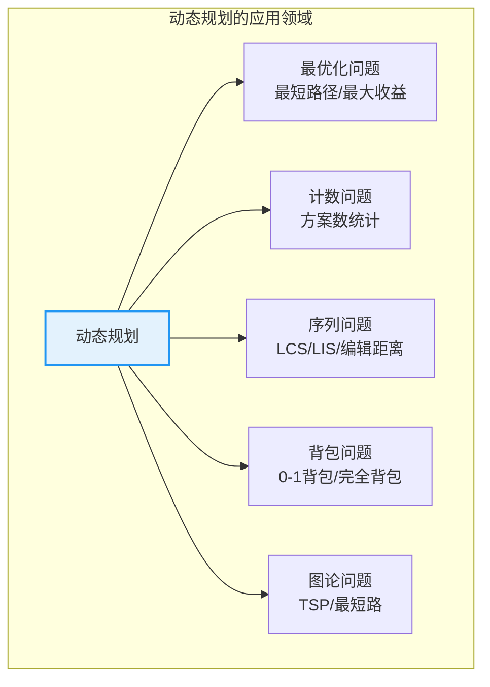
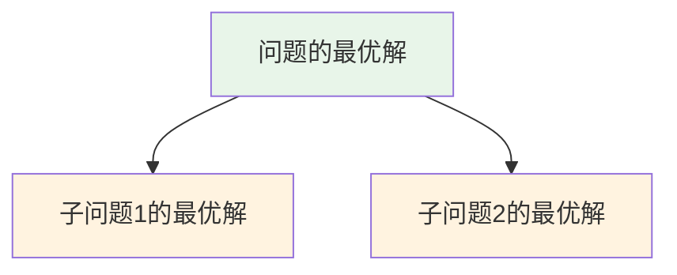
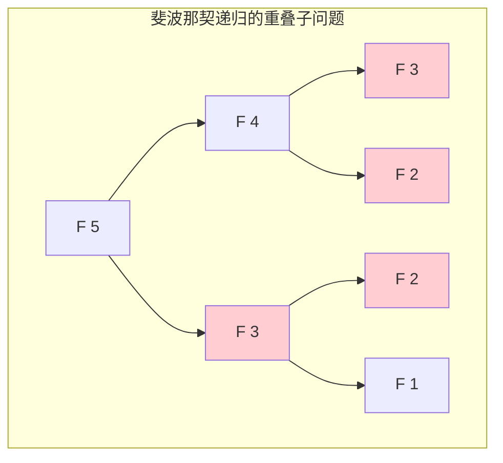
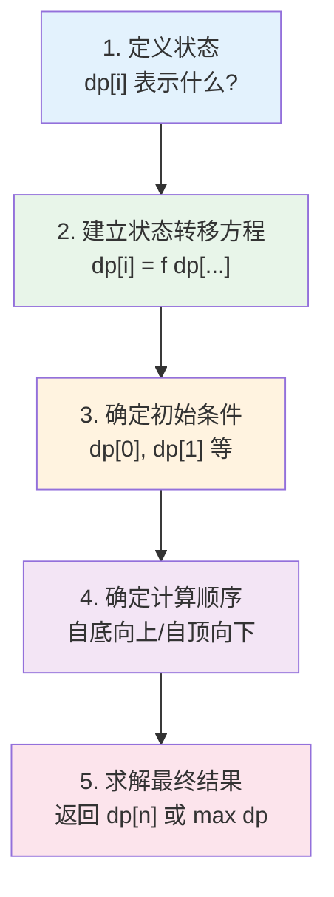
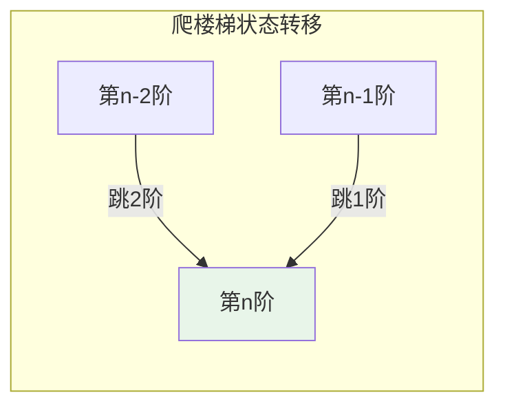
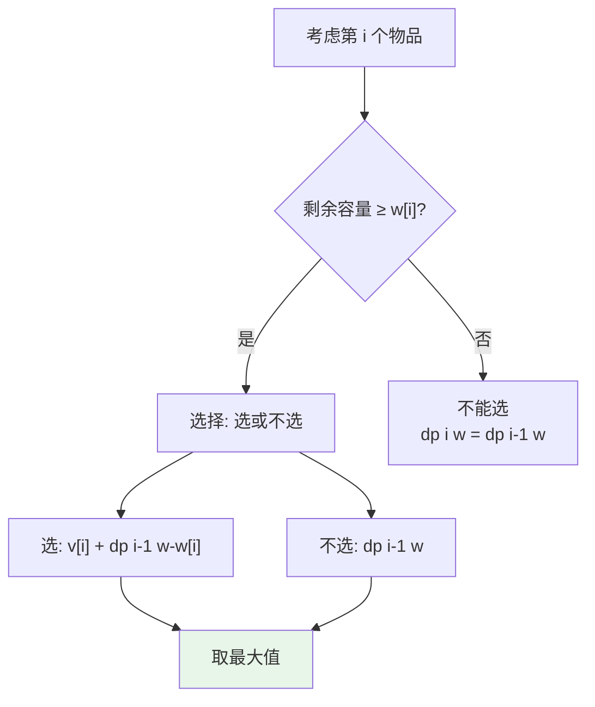
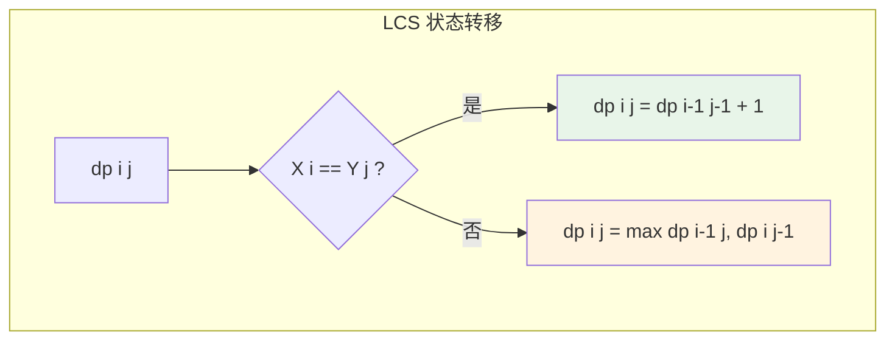
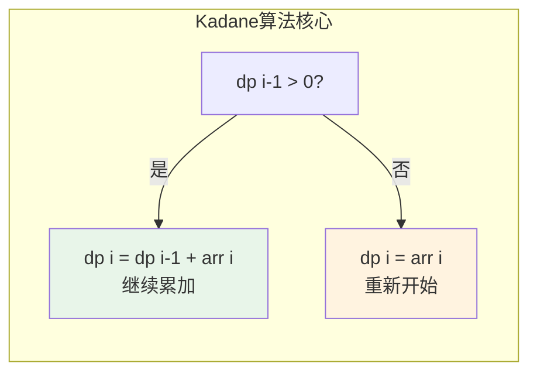
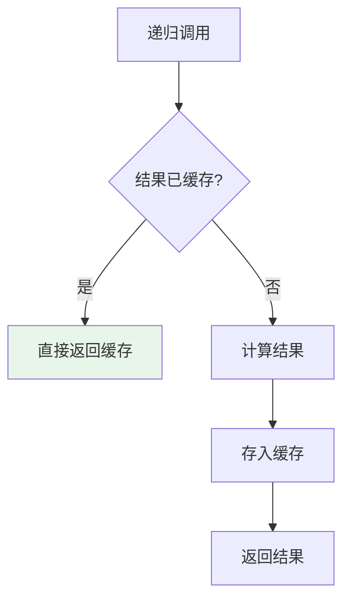

# 动态规划

## 概述

动态规划（Dynamic Programming，DP）是一种通过将复杂问题分解为**重叠子问题**，并存储子问题的解以避免重复计算的算法设计技术。它适用于具有**最优子结构**性质的问题，是算法设计中最重要、最强大的技术之一。

<div style="background-color: #E3F2FD; border-left: 4px solid #2196F3; padding: 12px; margin: 10px 0;">
<strong>核心思想：</strong>动态规划通过<strong>状态定义</strong>和<strong>状态转移方程</strong>，将问题分解为子问题，并使用表格（DP表）存储中间结果，实现以空间换时间的优化。递归+记忆化 = 动态规划。
</div>

### 动态规划的重要性



## 动态规划三要素

### 1. 最优子结构

问题的最优解包含子问题的最优解。



**示例**：最短路径问题
- 从 A 到 C 的最短路径 = 从 A 到 B 的最短路径 + 从 B 到 C 的最短路径

### 2. 重叠子问题

子问题会被多次计算，这是动态规划发挥作用的关键。



<div style="background-color: #FFF3E0; border-left: 4px solid #FF9800; padding: 12px; margin: 10px 0;">
<strong>重叠子问题的价值：</strong>F(3)、F(2) 被重复计算，使用DP存储后只需计算一次，将 O(2^n) 优化为 O(n)。
</div>

### 3. 无后效性

当前状态一旦确定，之前的状态不影响之后的决策（未来与过去无关）。

```
无后效性示例 - 爬楼梯：

当前在第 i 阶：
- 不需要知道是如何到达第 i 阶的
- 只需要知道从第 i 阶可以跳到第 i+1 或 i+2 阶
- 过去的路径不影响未来的选择
```

## 解题步骤

动态规划的标准解题流程：



| 步骤 | 说明 | 关键点 |
|------|------|--------|
| **定义状态** | 确定 dp[i] 的含义 | 状态要能描述问题 |
| **状态转移** | 建立递推关系 | 利用子问题的解 |
| **初始条件** | 边界情况 | 保证转移方程正确 |
| **计算顺序** | 保证依赖已计算 | 通常从小到大 |
| **求解结果** | 返回最终答案 | 可能需要额外处理 |

## 经典问题详解

### 1. 斐波那契数列

**问题**：求第 n 个斐波那契数，F(n) = F(n-1) + F(n-2)

**状态定义**：dp[i] = 第 i 个斐波那契数

**状态转移**：dp[i] = dp[i-1] + dp[i-2]

**DP表格填充过程：**

```
计算 F(6):

初始: dp[0]=0, dp[1]=1

i=2: dp[2] = dp[1] + dp[0] = 1 + 0 = 1
i=3: dp[3] = dp[2] + dp[1] = 1 + 1 = 2
i=4: dp[4] = dp[3] + dp[2] = 2 + 1 = 3
i=5: dp[5] = dp[4] + dp[3] = 3 + 2 = 5
i=6: dp[6] = dp[5] + dp[4] = 5 + 3 = 8

DP表: [0, 1, 1, 2, 3, 5, 8]
```

```c
long long fibonacciDP(int n) {
    if (n <= 1) return n;
    
    long long dp[n + 1];
    dp[0] = 0;
    dp[1] = 1;
    
    for (int i = 2; i <= n; i++) {
        dp[i] = dp[i - 1] + dp[i - 2];
    }
    
    return dp[n];
}

// 空间优化版本（只保留前两个状态）
long long fibonacciOptimized(int n) {
    if (n <= 1) return n;
    
    long long a = 0, b = 1;
    for (int i = 2; i <= n; i++) {
        long long temp = a + b;
        a = b;
        b = temp;
    }
    return b;
}
```

### 2. 爬楼梯问题

**问题**：每次可以爬 1 或 2 个台阶，问爬到第 n 阶有多少种方法？



**分析：**
- 要到达第 n 阶，只能从第 n-1 阶跳 1 阶，或从第 n-2 阶跳 2 阶
- 状态定义：dp[i] = 到达第 i 阶的方法数
- 状态转移：dp[n] = dp[n-1] + dp[n-2]

```
爬到第 5 阶的方法数：

dp[1] = 1  (1)
dp[2] = 2  (1+1, 2)
dp[3] = 3  (1+1+1, 1+2, 2+1)
dp[4] = 5  (1+1+1+1, 1+1+2, 1+2+1, 2+1+1, 2+2)
dp[5] = 8

实际上就是斐波那契数列！
```

```c
int climbStairs(int n) {
    if (n <= 2) return n;
    
    int dp[n + 1];
    dp[1] = 1;
    dp[2] = 2;
    
    for (int i = 3; i <= n; i++) {
        dp[i] = dp[i - 1] + dp[i - 2];
    }
    
    return dp[n];
}
```

### 3. 0-1 背包问题

**问题**：有 n 个物品，每个物品有重量 w[i] 和价值 v[i]，背包容量为 W，求最大价值。



**状态定义**：dp[i][w] = 考虑前 i 个物品，容量为 w 时的最大价值

**状态转移**：
```
dp[i][w] = max(dp[i-1][w], dp[i-1][w-w[i]] + v[i])  如果 w >= w[i]
dp[i][w] = dp[i-1][w]                                如果 w < w[i]
```

**DP表格示例：**

```
物品: [(w=2, v=3), (w=3, v=4), (w=4, v=5), (w=5, v=6)]
背包容量: W = 8

DP表格（行=物品，列=容量）:

      w=0  w=1  w=2  w=3  w=4  w=5  w=6  w=7  w=8
i=0    0    0    0    0    0    0    0    0    0
i=1    0    0    3    3    3    3    3    3    3
i=2    0    0    3    4    4    7    7    7    7
i=3    0    0    3    4    5    7    8    9    9
i=4    0    0    3    4    5    7    8    9   10

最大价值 = dp[4][8] = 10
选择方案: 物品1(w=2,v=3) + 物品4(w=5,v=6) = 总价值10
```

```c
int knapsack(int weights[], int values[], int n, int W) {
    int dp[n + 1][W + 1];
    
    // 初始化
    for (int i = 0; i <= n; i++) {
        for (int w = 0; w <= W; w++) {
            if (i == 0 || w == 0) {
                dp[i][w] = 0;
            } else if (weights[i - 1] <= w) {
                // 可以选，取选或不选的最大值
                int include = values[i - 1] + dp[i - 1][w - weights[i - 1]];
                int exclude = dp[i - 1][w];
                dp[i][w] = include > exclude ? include : exclude;
            } else {
                // 不能选
                dp[i][w] = dp[i - 1][w];
            }
        }
    }
    
    return dp[n][W];
}

// 空间优化：一维数组
int knapsackOptimized(int weights[], int values[], int n, int W) {
    int dp[W + 1];
    
    for (int w = 0; w <= W; w++) dp[w] = 0;
    
    for (int i = 0; i < n; i++) {
        // 逆序遍历，保证每个物品只选一次
        for (int w = W; w >= weights[i]; w--) {
            int include = values[i] + dp[w - weights[i]];
            if (include > dp[w]) dp[w] = include;
        }
    }
    
    return dp[W];
}
```

### 4. 最长公共子序列（LCS）

**问题**：求两个字符串的最长公共子序列长度。

**状态定义**：dp[i][j] = X[0..i-1] 和 Y[0..j-1] 的 LCS 长度

**状态转移**：
```
if X[i-1] == Y[j-1]: dp[i][j] = dp[i-1][j-1] + 1
else: dp[i][j] = max(dp[i-1][j], dp[i][j-1])
```



**DP表格示例：**

```
X = "ABCDGH"
Y = "AEDFHR"

      ""   A   E   D   F   H   R
""     0   0   0   0   0   0   0
A      0   1   1   1   1   1   1
B      0   1   1   1   1   1   1
C      0   1   1   1   1   1   1
D      0   1   1   2   2   2   2
G      0   1   1   2   2   2   2
H      0   1   1   2   2   3   3

LCS = 3，为 "ADH"
```

```c
int lcs(char *X, char *Y, int m, int n) {
    int dp[m + 1][n + 1];
    
    for (int i = 0; i <= m; i++) {
        for (int j = 0; j <= n; j++) {
            if (i == 0 || j == 0) {
                dp[i][j] = 0;
            } else if (X[i - 1] == Y[j - 1]) {
                dp[i][j] = dp[i - 1][j - 1] + 1;
            } else {
                dp[i][j] = dp[i - 1][j] > dp[i][j - 1] ? 
                           dp[i - 1][j] : dp[i][j - 1];
            }
        }
    }
    
    return dp[m][n];
}
```

### 5. 最长递增子序列（LIS）

**问题**：求数组的最长严格递增子序列长度。

**状态定义**：dp[i] = 以 arr[i] 结尾的 LIS 长度

**状态转移**：dp[i] = max(dp[j] + 1)，其中 j < i 且 arr[j] < arr[i]

```
数组: [10, 9, 2, 5, 3, 7, 101, 18]

dp[0] = 1  (10)
dp[1] = 1  (9)
dp[2] = 1  (2)
dp[3] = 2  (2, 5)
dp[4] = 2  (2, 3)
dp[5] = 3  (2, 5, 7) 或 (2, 3, 7)
dp[6] = 4  (2, 5, 7, 101) 或 (2, 3, 7, 101)
dp[7] = 4  (2, 5, 7, 18) 或 (2, 3, 7, 18)

LIS = 4
```

```c
int lis(int arr[], int n) {
    int dp[n];
    
    // 初始化：每个元素自身构成长度为1的LIS
    for (int i = 0; i < n; i++) dp[i] = 1;
    
    for (int i = 1; i < n; i++) {
        for (int j = 0; j < i; j++) {
            if (arr[j] < arr[i] && dp[j] + 1 > dp[i]) {
                dp[i] = dp[j] + 1;
            }
        }
    }
    
    int max = 0;
    for (int i = 0; i < n; i++) {
        if (dp[i] > max) max = dp[i];
    }
    
    return max;
}
```

### 6. 编辑距离

**问题**：将字符串 s1 转换为 s2 的最少操作次数（插入、删除、替换）。

**状态定义**：dp[i][j] = s1[0..i-1] 转换为 s2[0..j-1] 的最少操作数

**状态转移**：
```
if s1[i-1] == s2[j-1]: dp[i][j] = dp[i-1][j-1]
else: dp[i][j] = 1 + min(dp[i-1][j], dp[i][j-1], dp[i-1][j-1])
       (删除)         (插入)         (替换)
```

```c
int editDistance(char *s1, char *s2, int m, int n) {
    int dp[m + 1][n + 1];
    
    // 初始化
    for (int i = 0; i <= m; i++) dp[i][0] = i;  // 全部删除
    for (int j = 0; j <= n; j++) dp[0][j] = j;  // 全部插入
    
    for (int i = 1; i <= m; i++) {
        for (int j = 1; j <= n; j++) {
            if (s1[i - 1] == s2[j - 1]) {
                dp[i][j] = dp[i - 1][j - 1];  // 字符相同，无需操作
            } else {
                int insert = dp[i][j - 1];
                int delete = dp[i - 1][j];
                int replace = dp[i - 1][j - 1];
                
                int min = insert < delete ? insert : delete;
                min = min < replace ? min : replace;
                dp[i][j] = 1 + min;
            }
        }
    }
    
    return dp[m][n];
}
```

### 7. 最大子数组和（Kadane算法）

**问题**：求连续子数组的最大和。

**状态定义**：dp[i] = 以 arr[i] 结尾的最大子数组和

**状态转移**：dp[i] = max(arr[i], dp[i-1] + arr[i])



```c
int maxSubArray(int arr[], int n) {
    int dp[n];
    dp[0] = arr[0];
    int max = dp[0];
    
    for (int i = 1; i < n; i++) {
        if (dp[i - 1] > 0) {
            dp[i] = dp[i - 1] + arr[i];  // 继续累加
        } else {
            dp[i] = arr[i];              // 重新开始
        }
        if (dp[i] > max) max = dp[i];
    }
    
    return max;
}

// 空间优化版本
int maxSubArrayOptimized(int arr[], int n) {
    int sum = arr[0], max = arr[0];
    
    for (int i = 1; i < n; i++) {
        if (sum > 0) {
            sum += arr[i];
        } else {
            sum = arr[i];
        }
        if (sum > max) max = sum;
    }
    
    return max;
}
```

## 记忆化搜索（自顶向下）

记忆化搜索是递归形式的动态规划，通过缓存避免重复计算：



```c
#define MAX 1000
int memo[MAX][MAX];

int lcsMemo(char *X, char *Y, int m, int n) {
    // 基本情况
    if (m == 0 || n == 0) return 0;
    
    // 查缓存
    if (memo[m][n] != -1) return memo[m][n];
    
    // 计算并存缓存
    if (X[m - 1] == Y[n - 1]) {
        memo[m][n] = 1 + lcsMemo(X, Y, m - 1, n - 1);
    } else {
        int left = lcsMemo(X, Y, m - 1, n);
        int right = lcsMemo(X, Y, m, n - 1);
        memo[m][n] = left > right ? left : right;
    }
    
    return memo[m][n];
}
```

## 动态规划 vs 其他方法

| 方法 | 特点 | 适用场景 |
|------|------|----------|
| **暴力递归** | 简单直接，效率低 | 问题规模小 |
| **记忆化搜索** | 递归+缓存，直观 | 状态转移复杂 |
| **动态规划** | 迭代，效率高 | 标准DP问题 |
| **贪心** | 局部最优→全局最优 | 特殊最优化问题 |

## DP问题分类

| 类型 | 典型问题 | 状态定义 | 复杂度 |
|------|----------|----------|--------|
| **线性DP** | 最大子数组和、LIS、爬楼梯 | 一维状态 dp[i] | O(n) ~ O(n²) |
| **二维DP** | LCS、编辑距离、0-1背包 | 二维状态 dp[i][j] | O(n²) ~ O(n²W) |
| **区间DP** | 矩阵链乘法、回文分割 | 区间 dp[i][j] | O(n³) |
| **树形DP** | 树的最大独立集 | 树上递推 | O(n) |
| **状态压缩DP** | TSP、棋盘覆盖 | 位运算表示状态 | O(n·2ⁿ) |
| **数位DP** | 数字统计问题 | 按位处理 | O(log n) |

## 复杂度分析

| 问题 | 时间复杂度 | 空间复杂度 | 优化后空间 |
|------|-----------|-----------|-----------|
| 斐波那契 | O(n) | O(n) | O(1) |
| 爬楼梯 | O(n) | O(n) | O(1) |
| 0-1背包 | O(nW) | O(nW) | O(W) |
| LCS | O(mn) | O(mn) | O(min(m,n)) |
| LIS | O(n²) | O(n) | - |
| 编辑距离 | O(mn) | O(mn) | O(min(m,n)) |

## 参考资料

- 《算法导论》第15章：动态规划
- 《算法设计》第6章：动态规划算法
- [LeetCode 动态规划专题](https://leetcode.com/tag/dynamic-programming/)
