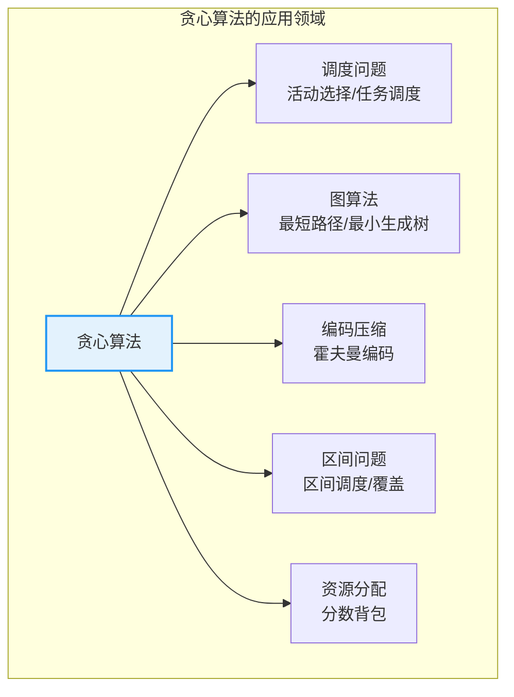
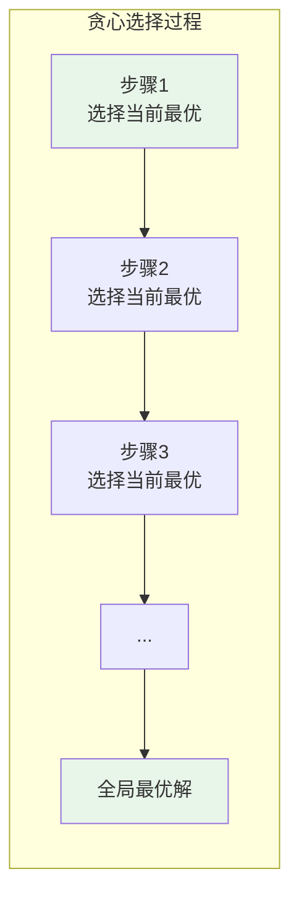
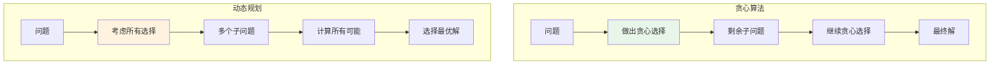
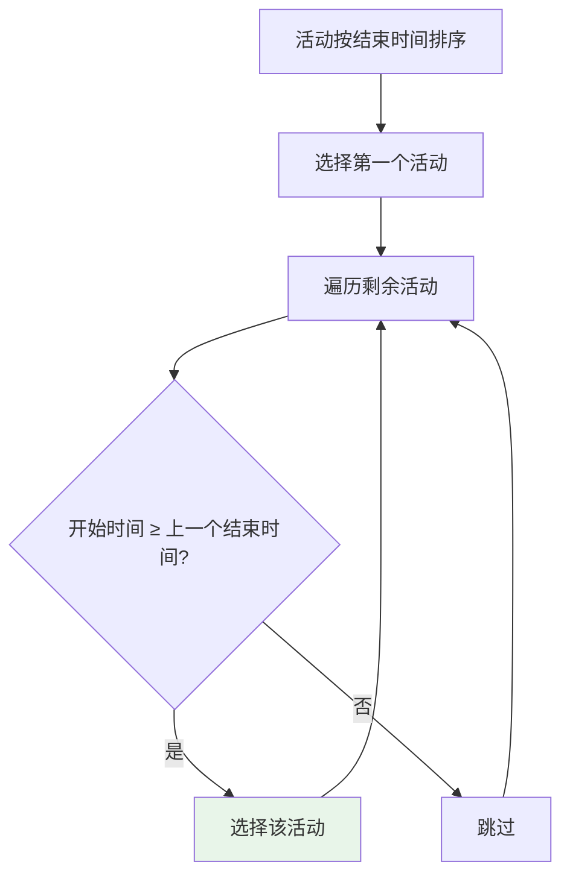
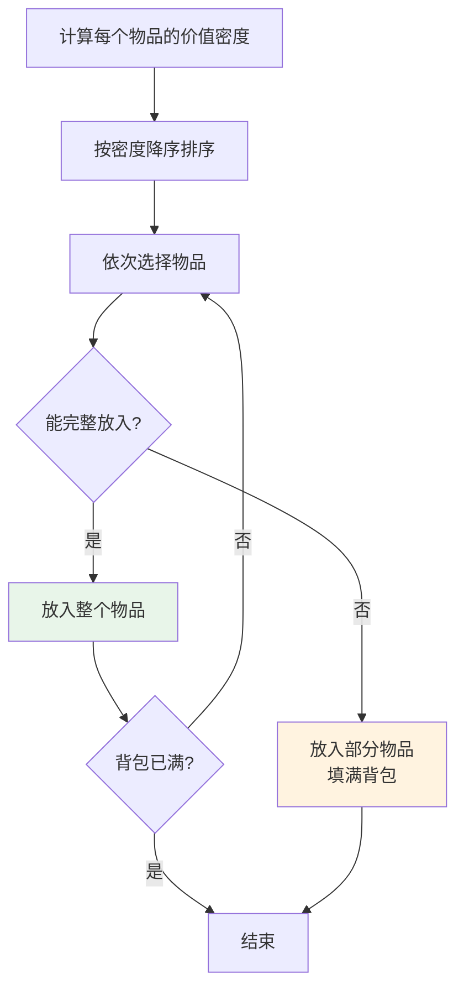
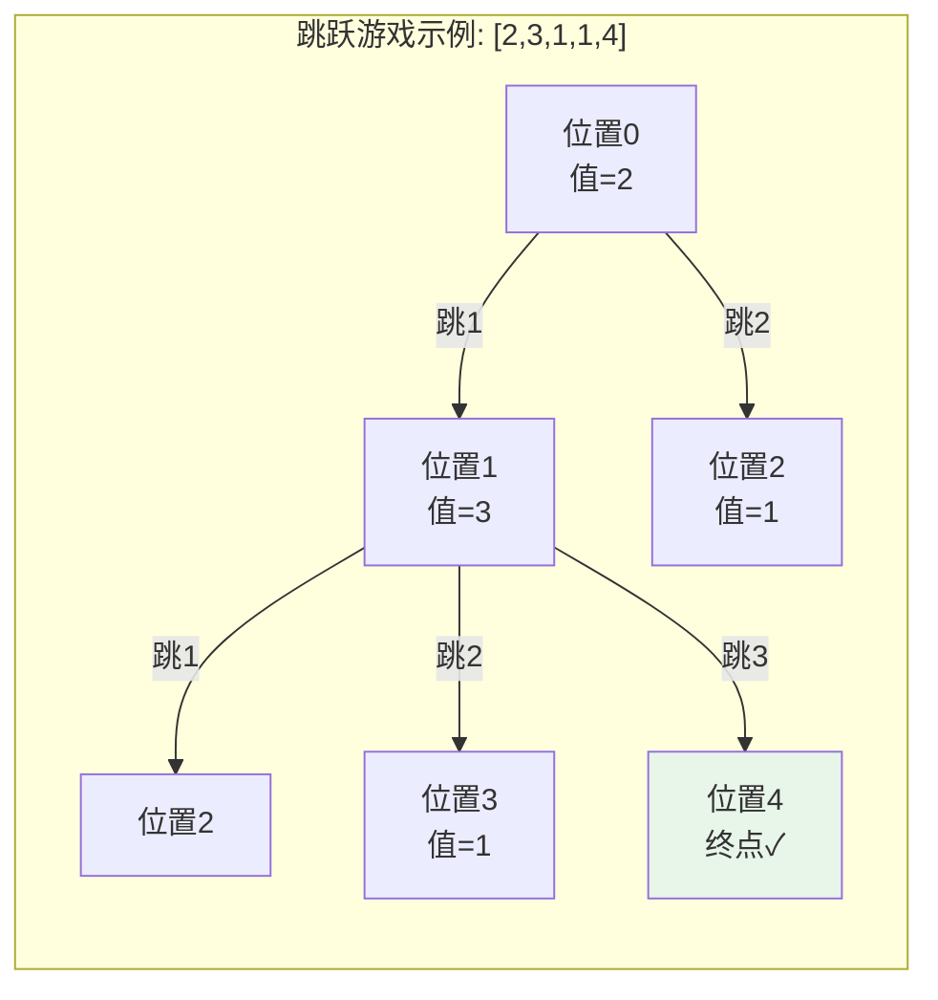
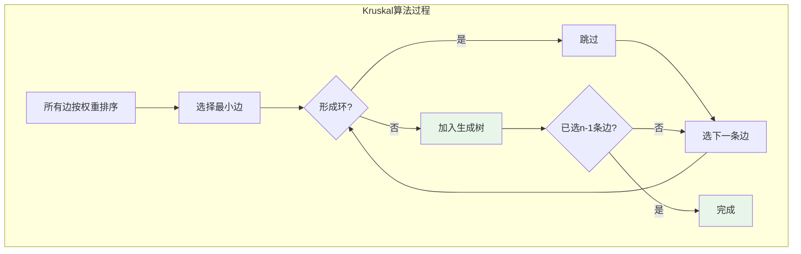
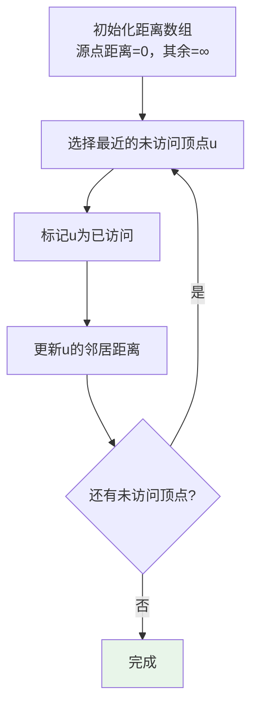

# 贪心算法

## 概述

贪心算法（Greedy Algorithm）是一种在每一步选择中都采取**当前状态下最优选择**的算法策略。希望通过一系列局部最优选择，最终达到全局最优解。贪心算法简单、高效，但只适用于具有**贪心选择性质**的问题。

<div style="background-color: #E3F2FD; border-left: 4px solid #2196F3; padding: 12px; margin: 10px 0;">
<strong>核心思想：</strong>贪心算法在每一步都做出<strong>局部最优</strong>的选择，并期望这些局部最优选择能够导向<strong>全局最优</strong>。与动态规划不同，贪心算法不考虑整体情况，只关注当前步骤的最优解。
</div>

### 贪心算法的重要性



## 贪心两要素

贪心算法能正确求解问题的两个必要条件：

### 1. 贪心选择性质

**局部最优选择能导向全局最优**：每一步所做的贪心选择都能最终导向问题的最优解。



### 2. 最优子结构

**问题的最优解包含子问题的最优解**：做出贪心选择后，原问题变为子问题，子问题的最优解与贪心选择组合构成原问题的最优解。

| 要素 | 含义 | 作用 |
|------|------|------|
| **贪心选择性质** | 局部最优→全局最优 | 保证贪心策略正确 |
| **最优子结构** | 子问题最优解可组合 | 问题可递归/迭代求解 |

## 贪心 vs 动态规划



| 特性 | 贪心算法 | 动态规划 |
|------|----------|----------|
| **选择方式** | 每步最优（不回溯） | 考虑所有可能 |
| **时间复杂度** | 通常 O(n log n) | 通常 O(n²) 或更高 |
| **空间复杂度** | O(1) 或 O(n) | 通常 O(n²) |
| **适用条件** | 贪心选择性质 + 最优子结构 | 最优子结构 + 重叠子问题 |
| **正确性** | 需要证明 | 自然保证 |

## 经典问题详解

### 1. 活动选择问题

**问题**：给定 n 个活动的开始和结束时间，选择最多的互不重叠活动。


**贪心策略**：按结束时间排序，每次选择结束最早的活动。



**算法执行过程：**

```
活动（已按结束时间排序）:
[(1,4), (3,5), (0,6), (5,7), (3,9), (5,9), (6,10), (8,11), (8,12), (2,14), (12,16)]

═══════════════════════════════════════════════════════════════
贪心选择过程
═══════════════════════════════════════════════════════════════

步骤1: 选择活动(1,4)，结束时间=4
       ┌─────────────────────────────────────┐
       │ ■■■■                                │  (1-4)
       └─────────────────────────────────────┘

步骤2: 活动(3,5) 开始时间3 < 4，跳过
步骤3: 活动(0,6) 开始时间0 < 4，跳过

步骤4: 选择活动(5,7)，结束时间=7
       ┌─────────────────────────────────────┐
       │ ■■■■              ■■■              │  (1-4), (5-7)
       └─────────────────────────────────────┘

步骤5: 活动(3,9) 开始时间3 < 7，跳过
步骤6: 活动(5,9) 开始时间5 < 7，跳过

步骤7: 选择活动(8,11)，结束时间=11
       ┌─────────────────────────────────────┐
       │ ■■■■      ■■■      ■■■            │
       └─────────────────────────────────────┘

步骤8-10: 开始时间 < 11，跳过

步骤11: 选择活动(12,16)，结束时间=16
       ┌─────────────────────────────────────┐
       │ ■■■■  ■■■  ■■■        ■■■■       │
       └─────────────────────────────────────┘

最优解: 4个活动 - (1,4), (5,7), (8,11), (12,16)
```

```c
typedef struct {
    int start;
    int end;
} Activity;

int compare(const void *a, const void *b) {
    return ((Activity*)a)->end - ((Activity*)b)->end;
}

int activitySelection(Activity activities[], int n, int selected[]) {
    // 按结束时间排序
    qsort(activities, n, sizeof(Activity), compare);
    
    int count = 1;
    selected[0] = 0;  // 选择第一个活动
    int lastEnd = activities[0].end;
    
    for (int i = 1; i < n; i++) {
        if (activities[i].start >= lastEnd) {
            selected[count++] = i;
            lastEnd = activities[i].end;
        }
    }
    
    return count;  // 返回选择的活动数量
}
```

### 2. 分数背包问题

**问题**：物品可以分割，求背包能装的最大价值。

**贪心策略**：按价值密度（价值/重量）降序排列，优先选择密度最高的物品。



**算法执行示例：**

```
物品: (重量, 价值) = (10,60), (20,100), (30,120)
背包容量: 50

═══════════════════════════════════════════════════════════════
计算价值密度
═══════════════════════════════════════════════════════════════

物品1: 密度 = 60/10 = 6
物品2: 密度 = 100/20 = 5
物品3: 密度 = 120/30 = 4

按密度排序: 物品1(6) > 物品2(5) > 物品3(4)

═══════════════════════════════════════════════════════════════
贪心选择
═══════════════════════════════════════════════════════════════

步骤1: 选择物品1，重量10，价值60，剩余容量40
步骤2: 选择物品2，重量20，价值100，剩余容量20
步骤3: 选择物品3的20/30，价值 = 120 × (20/30) = 80

总价值 = 60 + 100 + 80 = 240
```

```c
typedef struct {
    int weight;
    int value;
    double ratio;
} Item;

int compare(const void *a, const void *b) {
    return ((Item*)b)->ratio > ((Item*)a)->ratio ? 1 : -1;
}

double fractionalKnapsack(Item items[], int n, int capacity) {
    // 计算价值密度
    for (int i = 0; i < n; i++) {
        items[i].ratio = (double)items[i].value / items[i].weight;
    }
    
    // 按密度降序排序
    qsort(items, n, sizeof(Item), compare);
    
    double totalValue = 0;
    int remaining = capacity;
    
    for (int i = 0; i < n && remaining > 0; i++) {
        if (items[i].weight <= remaining) {
            // 完整放入
            totalValue += items[i].value;
            remaining -= items[i].weight;
        } else {
            // 放入部分
            totalValue += items[i].ratio * remaining;
            remaining = 0;
        }
    }
    
    return totalValue;
}
```

### 3. 跳跃游戏

**问题**：给定数组，每个元素表示最大跳跃距离，判断能否到达终点。

**贪心策略**：维护能到达的最远位置。



```
数组: [2, 3, 1, 1, 4]

i=0: maxReach = 0 + 2 = 2
     可到达位置: [0, 1, 2]

i=1: maxReach = max(2, 1 + 3) = 4
     可到达位置: [0, 1, 2, 3, 4] ← 到达终点!

结果: true
```

```c
int canJump(int nums[], int n) {
    int maxReach = 0;
    
    for (int i = 0; i < n; i++) {
        // 当前位置无法到达
        if (i > maxReach) return 0;
        // 已经可以到达终点
        if (maxReach >= n - 1) return 1;
        
        // 更新最远可到达位置
        int reach = i + nums[i];
        if (reach > maxReach) maxReach = reach;
    }
    
    return 1;
}
```

### 4. 加油站问题

**问题**：环形加油站，判断从哪个站出发能走完一圈。

**贪心策略**：如果总油量 ≥ 总消耗，则存在解；起点是累积油量首次变负后的下一站。

```c
int canCompleteCircuit(int gas[], int cost[], int n) {
    int total = 0, tank = 0, start = 0;
    
    for (int i = 0; i < n; i++) {
        total += gas[i] - cost[i];  // 总剩余油量
        tank += gas[i] - cost[i];   // 当前油箱
        
        if (tank < 0) {
            // 从当前起点无法到达i+1，换起点
            start = i + 1;
            tank = 0;
        }
    }
    
    return total >= 0 ? start : -1;
}
```

### 5. 最小生成树（Kruskal）

**问题**：在加权连通图中找到权重最小的生成树。

**贪心策略**：按边权重排序，依次选择不形成环的边。



```c
typedef struct {
    int src, dest, weight;
} Edge;

int parent[100];

int find(int i) {
    while (parent[i] != i) {
        i = parent[i];
    }
    return i;
}

void unionSets(int i, int j) {
    int a = find(i);
    int b = find(j);
    parent[a] = b;
}

void kruskalMST(Edge edges[], int E, int V) {
    // 初始化并查集
    for (int i = 0; i < V; i++) parent[i] = i;
    
    // 按权重排序（省略）
    // qsort(edges, E, sizeof(Edge), compare);
    
    Edge result[V - 1];
    int e = 0, i = 0;
    
    while (e < V - 1 && i < E) {
        Edge next = edges[i++];
        
        int x = find(next.src);
        int y = find(next.dest);
        
        if (x != y) {
            result[e++] = next;
            unionSets(x, y);
        }
    }
}
```

### 6. 单源最短路径（Dijkstra）

**问题**：求从源点到所有其他点的最短路径（非负权边）。

**贪心策略**：每次选择距离源点最近的未访问顶点。



```c
#define V 5
#define INF INT_MAX

void dijkstra(int graph[V][V], int src) {
    int dist[V];    // 最短距离
    int visited[V]; // 访问标记
    
    // 初始化
    for (int i = 0; i < V; i++) {
        dist[i] = INF;
        visited[i] = 0;
    }
    dist[src] = 0;
    
    // 找最短路径
    for (int count = 0; count < V - 1; count++) {
        // 找最小距离的未访问顶点
        int min = INF, u;
        for (int v = 0; v < V; v++) {
            if (!visited[v] && dist[v] <= min) {
                min = dist[v];
                u = v;
            }
        }
        
        visited[u] = 1;
        
        // 更新邻居距离
        for (int v = 0; v < V; v++) {
            if (!visited[v] && graph[u][v] && 
                dist[u] != INF && 
                dist[u] + graph[u][v] < dist[v]) {
                dist[v] = dist[u] + graph[u][v];
            }
        }
    }
}
```

## 贪心正确性证明

贪心算法的正确性需要严格证明，常用方法：

### 1. 交换论证

证明贪心选择与最优解可以交换而不影响最优性。

```
活动选择问题的交换论证:

假设 OPT 是最优解，贪心选择第一个活动 A₁

情况1: OPT 也选择 A₁ → 直接归纳
情况2: OPT 选择其他活动 B₁

由于 A₁ 结束最早，A₁ 结束时间 ≤ B₁ 结束时间
将 B₁ 替换为 A₁，不影响其他活动的选择
新解也是最优解

归纳: 对子问题继续应用交换论证
结论: 贪心算法正确
```

### 2. 贪心保持领先

证明贪心解在每个步骤都不劣于最优解。

### 3. 反证法

假设贪心解不是最优解，推导矛盾。

## 贪心失败案例

贪心算法不能解决所有问题：

### 0-1背包问题

```
物品: (价值, 重量) = (60, 10), (100, 20), (120, 30)
容量: 50

贪心策略（价值密度）:
- 物品1密度=6, 物品2密度=5, 物品3密度=4
- 选择物品1(60,10), 物品2(100,20)
- 剩余容量20，物品3重量30放不下
- 贪心结果: 60 + 100 = 160

最优解:
- 选择物品2(100,20) + 物品3(120,30)
- 总价值: 100 + 120 = 220

贪心失败！160 < 220
```

<div style="background-color: #FFCDD2; border-left: 4px solid #F44336; padding: 12px; margin: 10px 0;">
<strong>⚠️ 注意：</strong>0-1背包问题物品不可分割，贪心选择的局部最优可能导致无法选择全局最优组合。这类问题需要使用<strong>动态规划</strong>求解。
</div>

## 应用场景总结

| 问题类型 | 贪心策略 | 时间复杂度 |
|---------|---------|-----------|
| **活动选择** | 按结束时间排序 | O(n log n) |
| **分数背包** | 按价值密度排序 | O(n log n) |
| **跳跃游戏** | 维护最远可达 | O(n) |
| **加油站** | 累积油量判断 | O(n) |
| **Kruskal** | 按边权重排序 | O(E log E) |
| **Dijkstra** | 选择最近顶点 | O(V²) |
| **霍夫曼编码** | 合并最小频率 | O(n log n) |

## 参考资料

- 《算法导论》第16章：贪心算法
- 《算法设计》第4章：贪心策略
- [LeetCode 贪心专题](https://leetcode.com/tag/greedy/)
