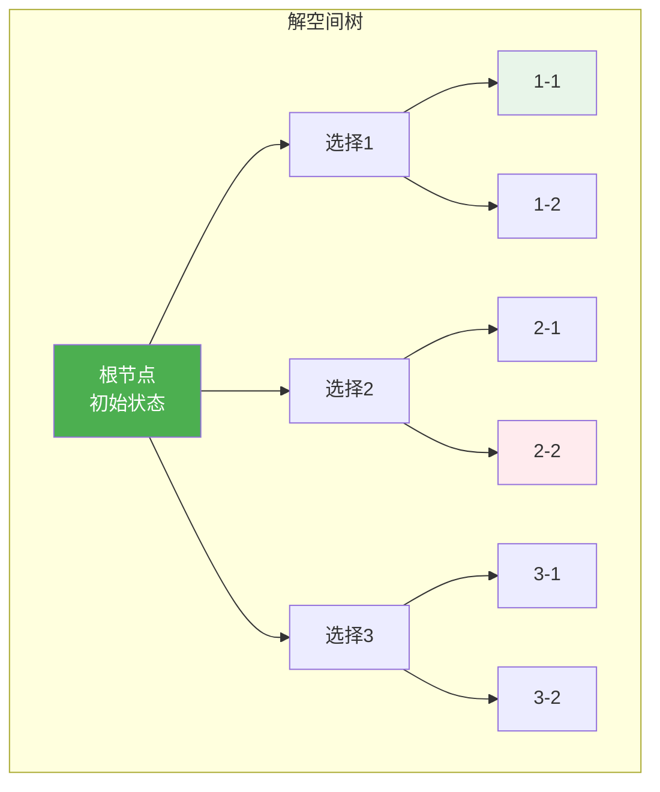
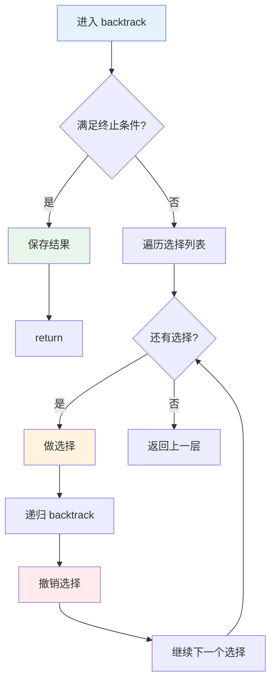
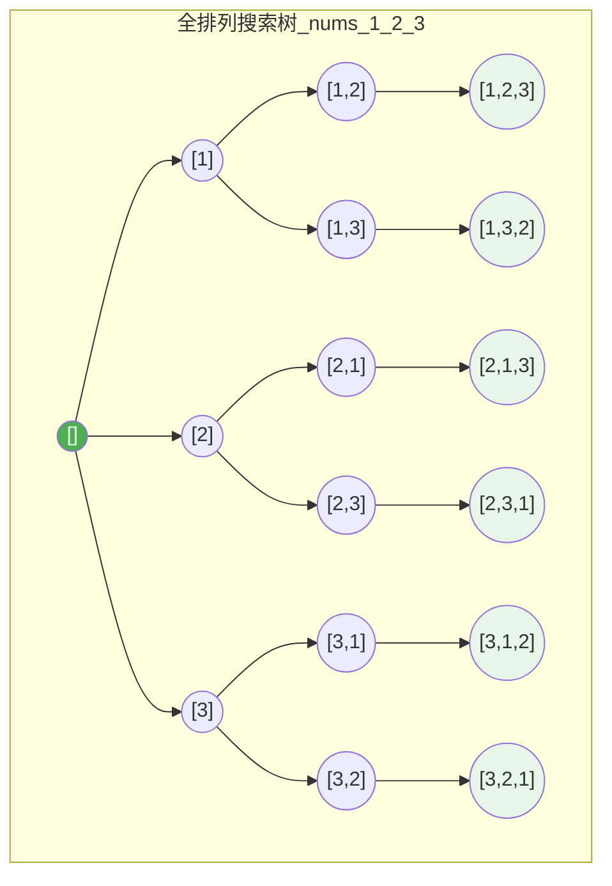
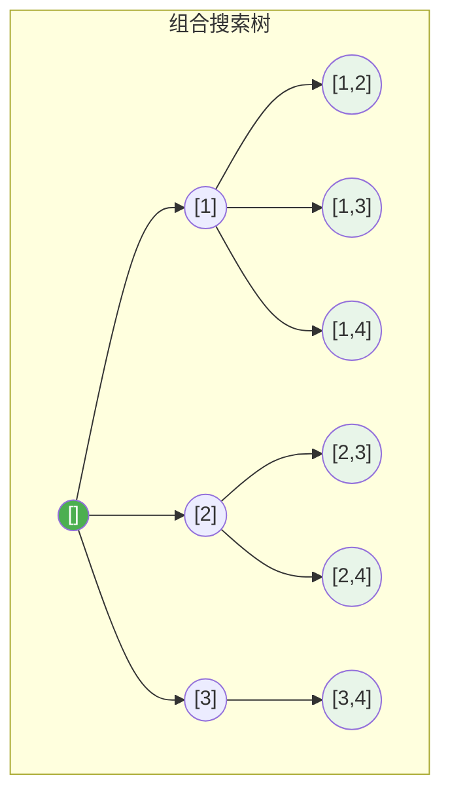
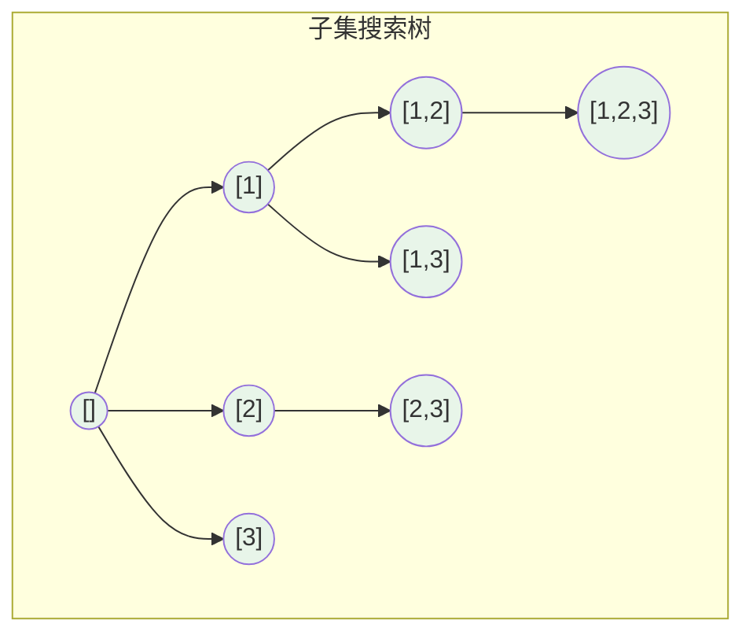
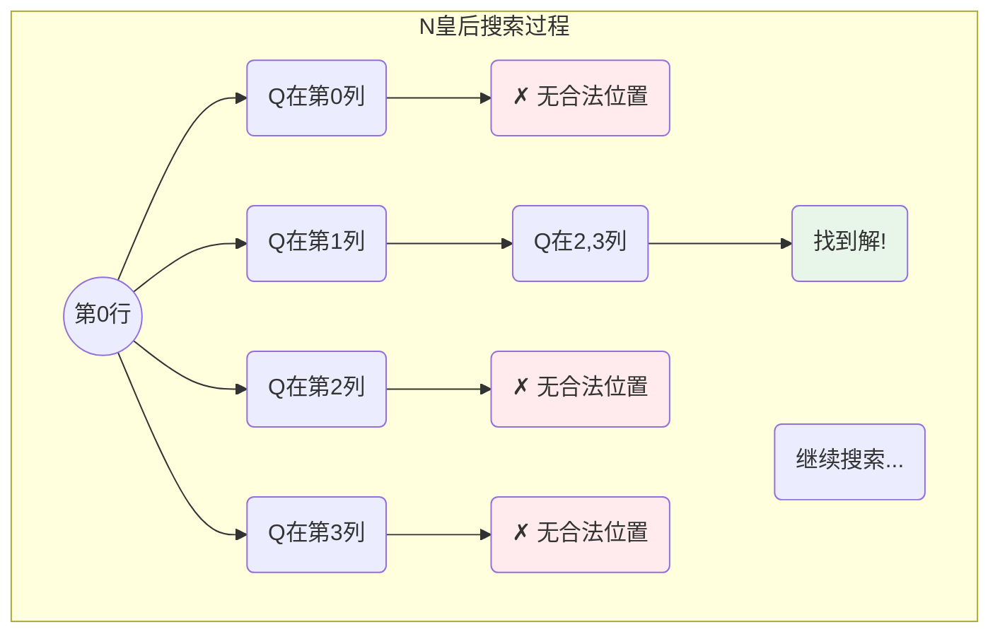
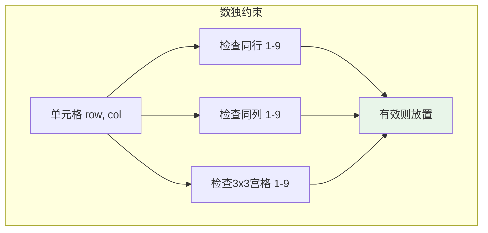
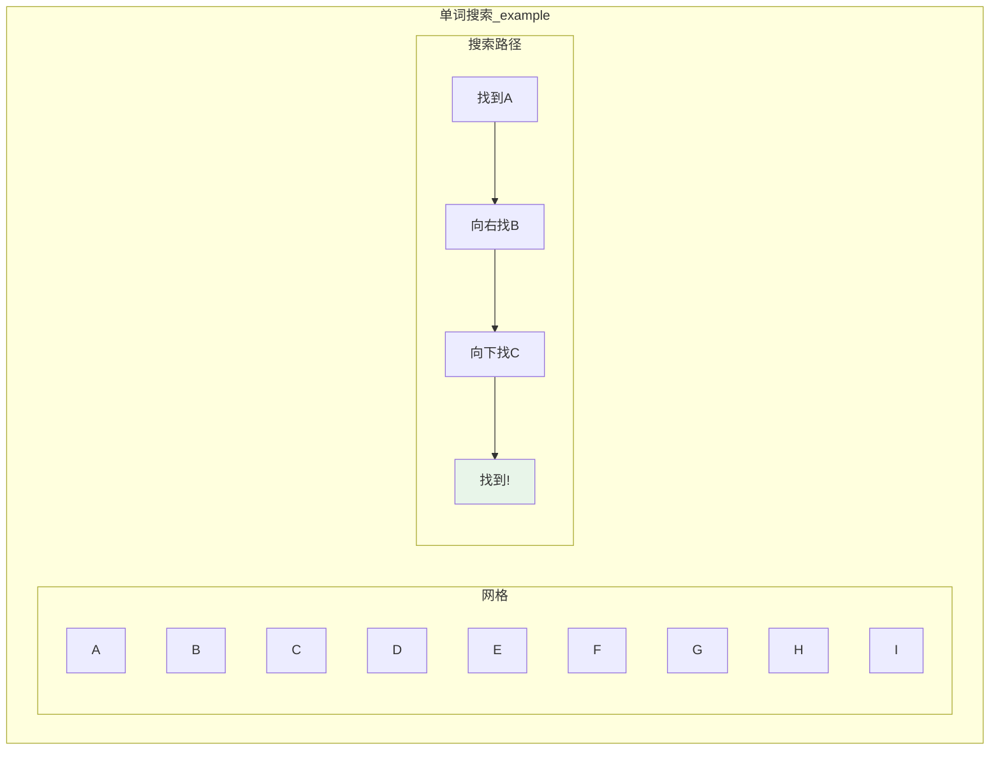
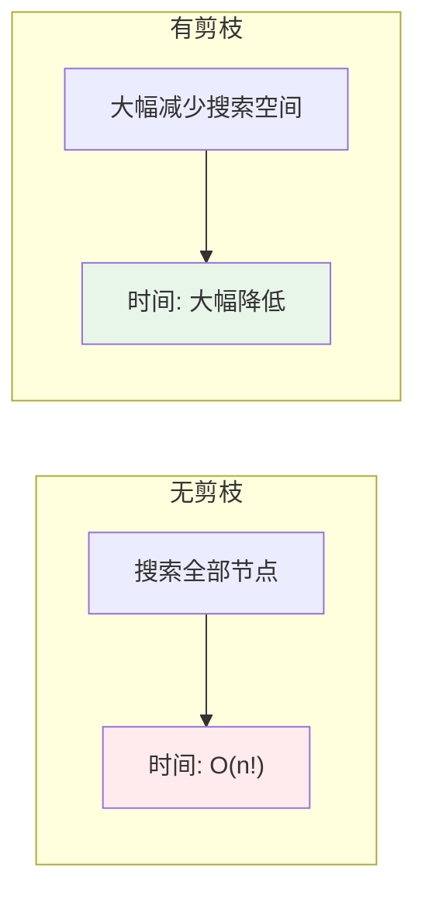
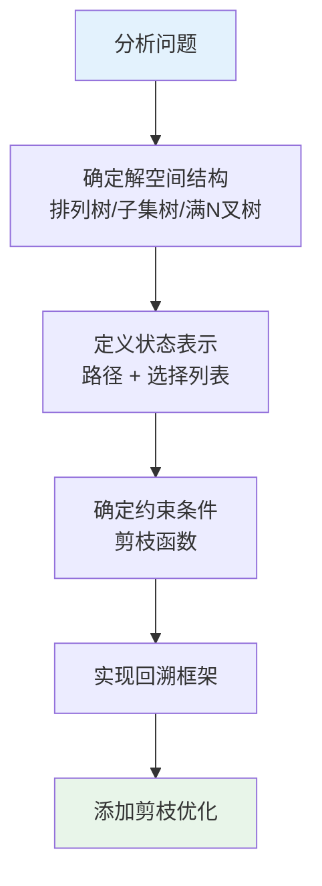

# 回溯算法

## 概述

回溯算法（Backtracking）是一种通过探索所有可能的候选解来找出所有解的算法。如果候选解被确认不是一个解（或者至少不是最后一个解），回溯算法会通过在上一步进行一些变化丢弃该解，即"回溯"并再次尝试。

<div style="background: #E3F2FD; border-left: 4px solid #2196F3; padding: 12px; margin: 10px 0;">
<strong>核心思想</strong>：走不通就回头。本质是带剪枝的深度优先搜索（DFS），通过系统地搜索问题的解空间树，在搜索过程中用约束条件减去那些实际上不可能产生解的子树。
</div>

## 回溯算法本质

### 解空间树

回溯法将问题的解空间组织成一棵树，通过深度优先搜索遍历这棵树：



**说明**：
- 绿色节点：满足约束，继续搜索
- 红色节点：不满足约束，剪枝回溯
- 白色节点：待探索

### 回溯三要素

| 要素 | 说明 | 示例 |
|------|------|------|
| 路径 | 已经做出的选择 | 已选的数字、已放置的皇后位置 |
| 选择列表 | 当前可以做的选择 | 剩余可选的数字、可放置的列 |
| 结束条件 | 达到决策树的叶节点 | 已选够k个数、所有皇后已放置 |

## 回溯框架

### 通用框架

```c
void backtrack(参数) {
    if (终止条件) {
        保存结果;
        return;
    }
    
    for (选择 : 选择列表) {
        做选择;           // 将选择加入路径
        backtrack(新参数); // 递归进入下一层
        撤销选择;         // 回溯，撤销刚才的选择
    }
}
```

### 框架流程图



<div style="background: #E8F5E9; border-left: 4px solid #4CAF50; padding: 12px; margin: 10px 0;">
<strong>关键点</strong>：撤销选择是回溯的核心，它保证了每次递归返回后，状态恢复到进入前的状态，使得同一层的选择不会相互影响。
</div>

## 经典问题

### 1. 全排列

**问题**：给定一个不含重复数字的数组，返回所有可能的全排列。

**搜索树可视化**：



**实现**：

```c
void swap(int *a, int *b) {
    int temp = *a;
    *a = *b;
    *b = temp;
}

void permute(int nums[], int n, int index) {
    // 终止条件：已选择所有元素
    if (index == n) {
        for (int i = 0; i < n; i++) printf("%d ", nums[i]);
        printf("\n");
        return;
    }
    
    // 遍历所有可选元素
    for (int i = index; i < n; i++) {
        swap(&nums[index], &nums[i]);  // 做选择
        permute(nums, n, index + 1);    // 递归
        swap(&nums[index], &nums[i]);  // 撤销选择
    }
}
```

**执行过程示例**（nums = [1,2,3]）：

```
permute([1,2,3], 0)
  index=0: 遍历 i=0,1,2
    i=0: swap(0,0) → [1,2,3]
      permute([1,2,3], 1)
        i=1: swap(1,1) → [1,2,3]
          permute([1,2,3], 2)
            i=2: swap(2,2) → [1,2,3]
              permute([1,2,3], 3) → 输出: 1 2 3
        i=2: swap(1,2) → [1,3,2]
          permute([1,3,2], 2)
            输出: 1 3 2
          swap(1,2) → [1,2,3]  // 回溯
    i=1: swap(0,1) → [2,1,3]
      permute([2,1,3], 1)
        ... 输出: 2 1 3, 2 3 1
      swap(0,1) → [1,2,3]  // 回溯
    i=2: swap(0,2) → [3,2,1]
      permute([3,2,1], 1)
        ... 输出: 3 2 1, 3 1 2
      swap(0,2) → [1,2,3]  // 回溯
```

### 2. 组合

**问题**：给定两个整数 n 和 k，返回 1...n 中所有可能的 k 个数的组合。

**搜索树可视化**（n=4, k=2）：



**实现**：

```c
void combine(int n, int k, int result[], int index, int start) {
    // 终止条件：已选择 k 个元素
    if (index == k) {
        for (int i = 0; i < k; i++) printf("%d ", result[i]);
        printf("\n");
        return;
    }
    
    // 剪枝：i <= n - k + index + 1
    for (int i = start; i <= n - k + index + 1; i++) {
        result[index] = i;                   // 做选择
        combine(n, k, result, index + 1, i + 1);  // 递归
        // 撤销选择：result[index] 会被覆盖，无需显式撤销
    }
}
```

<div style="background: #FFF3E0; border-left: 4px solid #FF9800; padding: 12px; margin: 10px 0;">
<strong>剪枝优化</strong>：当剩余可选元素不足以填满还需要的位置时，提前终止。循环上界从 n 改为 n - k + index + 1。
</div>

### 3. 子集

**问题**：给定一组不含重复元素的整数数组，返回该数组所有可能的子集。

**搜索树可视化**（nums = [1,2,3]）：



**实现**：

```c
void subsets(int nums[], int n, int result[], int resultSize, int start) {
    // 每个节点都是有效子集，直接输出
    for (int i = 0; i < resultSize; i++) printf("%d ", result[i]);
    printf("\n");
    
    // 遍历所有可选元素
    for (int i = start; i < n; i++) {
        result[resultSize] = nums[i];               // 做选择
        subsets(nums, n, result, resultSize + 1, i + 1);  // 递归
        // 撤销选择：result[resultSize] 会被覆盖
    }
}
```

### 4. N 皇后

**问题**：在 n×n 的棋盘上放置 n 个皇后，使其互不攻击。

**约束条件**：
- 同一行不能有两个皇后
- 同一列不能有两个皇后
- 同一对角线不能有两个皇后

**N=4 的搜索过程**：



**N=4 的一个解**：

```
. Q . .     皇后位置: (0,1)
. . . Q     皇后位置: (1,3)
Q . . .     皇后位置: (2,0)
. . Q .     皇后位置: (3,2)
```

**实现**：

```c
int isSafe(int board[], int row, int col) {
    for (int i = 0; i < row; i++) {
        // 检查同列
        if (board[i] == col) return 0;
        // 检查对角线
        if (abs(board[i] - col) == abs(i - row)) return 0;
    }
    return 1;
}

void solveNQueens(int board[], int n, int row) {
    // 终止条件：所有皇后已放置
    if (row == n) {
        for (int i = 0; i < n; i++) printf("%d ", board[i]);
        printf("\n");
        return;
    }
    
    // 尝试在当前行的每一列放置皇后
    for (int col = 0; col < n; col++) {
        if (isSafe(board, row, col)) {
            board[row] = col;              // 做选择
            solveNQueens(board, n, row + 1);  // 递归下一行
            // 撤销选择：board[row] 会被覆盖
        }
    }
}
```

### 5. 数独求解

**问题**：填充 9×9 数独，使每行、每列、每个 3×3 宫格包含数字 1-9。

**约束检查**：



**实现**：

```c
int isValid(int board[9][9], int row, int col, int num) {
    // 检查同行和同列
    for (int i = 0; i < 9; i++) {
        if (board[row][i] == num) return 0;
        if (board[i][col] == num) return 0;
    }
    
    // 检查 3x3 宫格
    int boxRow = row / 3 * 3;
    int boxCol = col / 3 * 3;
    for (int i = 0; i < 3; i++) {
        for (int j = 0; j < 3; j++) {
            if (board[boxRow + i][boxCol + j] == num) return 0;
        }
    }
    
    return 1;
}

int solveSudoku(int board[9][9]) {
    // 寻找空格
    for (int row = 0; row < 9; row++) {
        for (int col = 0; col < 9; col++) {
            if (board[row][col] == 0) {
                // 尝试填入 1-9
                for (int num = 1; num <= 9; num++) {
                    if (isValid(board, row, col, num)) {
                        board[row][col] = num;       // 做选择
                        if (solveSudoku(board)) return 1;  // 递归
                        board[row][col] = 0;         // 撤销选择
                    }
                }
                return 0;  // 无解，回溯
            }
        }
    }
    return 1;  // 所有空格已填满，找到解
}
```

### 6. 括号生成

**问题**：生成所有有效的括号组合（n 对括号）。

**搜索树可视化**（n=3）：

```mermaid
graph TB
    subgraph 括号生成搜索树
        root((""))
        n1(("("))
        n2(("(("))
        n3(("()"))
        n4((("(((")))
        n5((("(()")))
        n6((("()(")))
        n7(((")))"))
        n8((("()()")))
        n9((("((())))"))
        n10((("(()())")))
        n11((("()(())")))
        n12((("()()()")))
        
        root --> n1 --> n2 --> n4 --> n9
        n2 --> n5 --> n10
        n1 --> n3 --> n6 --> n11
        n3 --> n8 --> n12
    end
    
    style n9 fill:#E8F5E9
    style n10 fill:#E8F5E9
    style n11 fill:#E8F5E9
    style n12 fill:#E8F5E9
```

**约束条件**：
- 左括号数量 ≤ n
- 右括号数量 ≤ 左括号数量

**实现**：

```c
void generateParenthesis(int n, int open, int close, char result[], int index) {
    // 终止条件：已生成 2n 个字符
    if (index == 2 * n) {
        result[index] = '\0';
        printf("%s\n", result);
        return;
    }
    
    // 可以放左括号
    if (open < n) {
        result[index] = '(';
        generateParenthesis(n, open + 1, close, result, index + 1);
    }
    
    // 可以放右括号
    if (close < open) {
        result[index] = ')';
        generateParenthesis(n, open, close + 1, result, index + 1);
    }
}
```

### 7. 组合总和

**问题**：找出 candidates 中所有和为 target 的组合（可重复选择）。

**实现**：

```c
void combinationSum(int candidates[], int n, int target, 
                    int result[], int resultSize, int start) {
    // 终止条件：目标和为 0
    if (target == 0) {
        for (int i = 0; i < resultSize; i++) printf("%d ", result[i]);
        printf("\n");
        return;
    }
    
    // 剪枝：从小到大选择
    for (int i = start; i < n; i++) {
        if (candidates[i] > target) continue;  // 剪枝
        
        result[resultSize] = candidates[i];
        combinationSum(candidates, n, target - candidates[i], 
                       result, resultSize + 1, i);  // 可重复，传入 i
    }
}
```

### 8. 单词搜索

**问题**：在二维字符网格中搜索单词。

**搜索过程可视化**：



**实现**：

```c
int exist(char board[][10], int m, int n, char *word, 
          int row, int col, int index, int visited[][10]) {
    // 终止条件：匹配完整个单词
    if (word[index] == '\0') return 1;
    
    // 边界检查
    if (row < 0 || row >= m || col < 0 || col >= n) return 0;
    // 已访问或不匹配
    if (visited[row][col] || board[row][col] != word[index]) return 0;
    
    visited[row][col] = 1;  // 做选择
    
    // 四个方向搜索
    int found = exist(board, m, n, word, row + 1, col, index + 1, visited) ||
                exist(board, m, n, word, row - 1, col, index + 1, visited) ||
                exist(board, m, n, word, row, col + 1, index + 1, visited) ||
                exist(board, m, n, word, row, col - 1, index + 1, visited);
    
    visited[row][col] = 0;  // 撤销选择
    
    return found;
}
```

## 剪枝优化

### 1. 排序剪枝

对于组合问题，排序后可以提前终止：

```c
// 预先排序 candidates
void combinationSum2(int candidates[], int n, int target, 
                     int result[], int resultSize, int start) {
    if (target == 0) {
        for (int i = 0; i < resultSize; i++) printf("%d ", result[i]);
        printf("\n");
        return;
    }
    
    for (int i = start; i < n; i++) {
        // 去重剪枝
        if (i > start && candidates[i] == candidates[i - 1]) continue;
        // 排序剪枝：后续元素更大，不可能满足条件
        if (candidates[i] > target) break;
        
        result[resultSize] = candidates[i];
        combinationSum2(candidates, n, target - candidates[i], 
                        result, resultSize + 1, i + 1);
    }
}
```

### 2. 提前终止

只求一个解时，找到后立即返回：

```c
int found = 0;

void solveNQueensOne(int board[], int n, int row) {
    if (found) return;  // 已找到，剪枝
    
    if (row == n) {
        for (int i = 0; i < n; i++) printf("%d ", board[i]);
        printf("\n");
        found = 1;
        return;
    }
    
    for (int col = 0; col < n; col++) {
        if (isSafe(board, row, col)) {
            board[row] = col;
            solveNQueensOne(board, n, row + 1);
        }
    }
}
```

### 3. 可行性剪枝

判断当前状态是否可能到达解：

```c
// 示例：目标和剪枝
void backtrack(int target, int currentSum, ...) {
    // 如果当前和已经超过目标，剪枝
    if (currentSum > target) return;
    
    // 继续搜索...
}
```

### 4. 对称性剪枝

利用问题的对称性减少搜索：

```c
// N皇后：利用对称性只搜索一半
void solveNQueensSym(int board[], int n, int row) {
    if (row == 0) {
        // 第一行只搜索前 n/2 列
        for (int col = 0; col < (n + 1) / 2; col++) {
            // ...
        }
    }
    // ...
}
```

## 剪枝效果对比



## 时间复杂度分析

| 问题 | 时间复杂度 | 空间复杂度 | 说明 |
|------|-----------|-----------|------|
| 全排列 | O(n × n!) | O(n) | n! 种排列，每种 n 个元素 |
| 组合 | O(C(n,k) × k) | O(k) | C(n,k) 种组合，每种 k 个元素 |
| 子集 | O(n × 2^n) | O(n) | 2^n 个子集，每个最多 n 个元素 |
| N皇后 | O(N!) | O(N) | 每行最多 N 个选择 |
| 括号生成 | O(4^n / √n) | O(n) | 第 n 个卡特兰数 |
| 数独 | O(9^(n×n)) | O(n²) | n×n 个格子，每个最多 9 种选择 |

<div style="background: #FFF3E0; border-left: 4px solid #FF9800; padding: 12px; margin: 10px 0;">
<strong>注意</strong>：回溯算法本质是暴力搜索，时间复杂度通常是指数级。剪枝只能减少常数因子，不会改变渐进复杂度。对于大规模问题，需要考虑动态规划、贪心等更高效的算法。
</div>

## 回溯 vs 其他算法

| 特性 | 回溯 | 动态规划 | 贪心 | DFS/BFS |
|------|------|---------|------|---------|
| 目的 | 找所有解/最优解 | 找最优解 | 找局部最优解 | 遍历所有状态 |
| 状态恢复 | 需要撤销选择 | 不需要 | 不需要 | 不需要 |
| 剪枝 | 常用 | 不适用 | 不需要 | 较少使用 |
| 重叠子问题 | 不处理 | 利用 | 不处理 | 不处理 |
| 复杂度 | 指数级 | 多项式 | 多项式 | 线性/指数 |

## C++ 模板实现

```cpp
class Backtracking {
public:
    // 全排列
    vector<vector<int>> permute(vector<int>& nums) {
        vector<vector<int>> result;
        backtrackPermute(nums, 0, result);
        return result;
    }
    
    void backtrackPermute(vector<int>& nums, int index, 
                          vector<vector<int>>& result) {
        if (index == nums.size()) {
            result.push_back(nums);
            return;
        }
        
        for (int i = index; i < nums.size(); i++) {
            swap(nums[index], nums[i]);
            backtrackPermute(nums, index + 1, result);
            swap(nums[index], nums[i]);
        }
    }
    
    // 组合
    vector<vector<int>> combine(int n, int k) {
        vector<vector<int>> result;
        vector<int> path;
        backtrackCombine(n, k, 1, path, result);
        return result;
    }
    
    void backtrackCombine(int n, int k, int start, 
                          vector<int>& path, vector<vector<int>>& result) {
        if (path.size() == k) {
            result.push_back(path);
            return;
        }
        
        for (int i = start; i <= n - k + path.size() + 1; i++) {
            path.push_back(i);
            backtrackCombine(n, k, i + 1, path, result);
            path.pop_back();
        }
    }
    
    // 子集
    vector<vector<int>> subsets(vector<int>& nums) {
        vector<vector<int>> result;
        vector<int> path;
        backtrackSubsets(nums, 0, path, result);
        return result;
    }
    
    void backtrackSubsets(vector<int>& nums, int start, 
                          vector<int>& path, vector<vector<int>>& result) {
        result.push_back(path);
        
        for (int i = start; i < nums.size(); i++) {
            path.push_back(nums[i]);
            backtrackSubsets(nums, i + 1, path, result);
            path.pop_back();
        }
    }
};
```

## 应用场景总结

| 应用场景 | 典型问题 | 关键技巧 |
|---------|---------|---------|
| 排列组合 | 全排列、组合、子集 | 交换、顺序控制 |
| 约束满足 | N皇后、数独、图着色 | 约束检查、剪枝 |
| 路径搜索 | 迷宫、单词搜索 | 方向数组、访问标记 |
| 分割问题 | 字符串分割、分割回文串 | 子串枚举、有效性检查 |
| 括号问题 | 括号生成、有效括号 | 计数约束、平衡检查 |
| 组合优化 | 组合总和、目标和 | 排序剪枝、去重 |

## 实际问题示例

### LeetCode 46. 全排列

```cpp
vector<vector<int>> permute(vector<int>& nums) {
    vector<vector<int>> result;
    sort(nums.begin(), nums.end());
    do {
        result.push_back(nums);
    } while (next_permutation(nums.begin(), nums.end()));
    return result;
}
```

### LeetCode 51. N皇后

```cpp
vector<vector<string>> solveNQueens(int n) {
    vector<vector<string>> result;
    vector<string> board(n, string(n, '.'));
    backtrack(board, 0, result);
    return result;
}

void backtrack(vector<string>& board, int row, vector<vector<string>>& result) {
    if (row == board.size()) {
        result.push_back(board);
        return;
    }
    
    for (int col = 0; col < board.size(); col++) {
        if (isValid(board, row, col)) {
            board[row][col] = 'Q';
            backtrack(board, row + 1, result);
            board[row][col] = '.';
        }
    }
}
```

## 设计模式

### 回溯问题设计步骤



<div style="background: #E8F5E9; border-left: 4px solid #4CAF50; padding: 12px; margin: 10px 0;">
<strong>设计要点</strong>：
1. 明确什么是"路径"、什么是"选择列表"
2. 确定递归的终止条件
3. 思考如何做选择和撤销选择
4. 分析约束条件，设计剪枝函数
5. 考虑是否需要去重、排序等预处理
</div>

## 参考资料

- 《算法导论》第35章：回溯法
- 《算法设计》第5章：回溯与分支限界
- 《挑战程序设计竞赛》搜索与剪枝
- Knuth, D. E. (2015). The Art of Computer Programming, Volume 4, Fascicle 5: Backtracking
