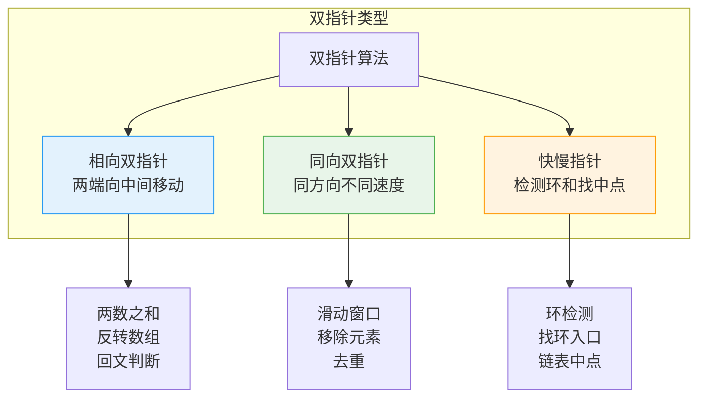
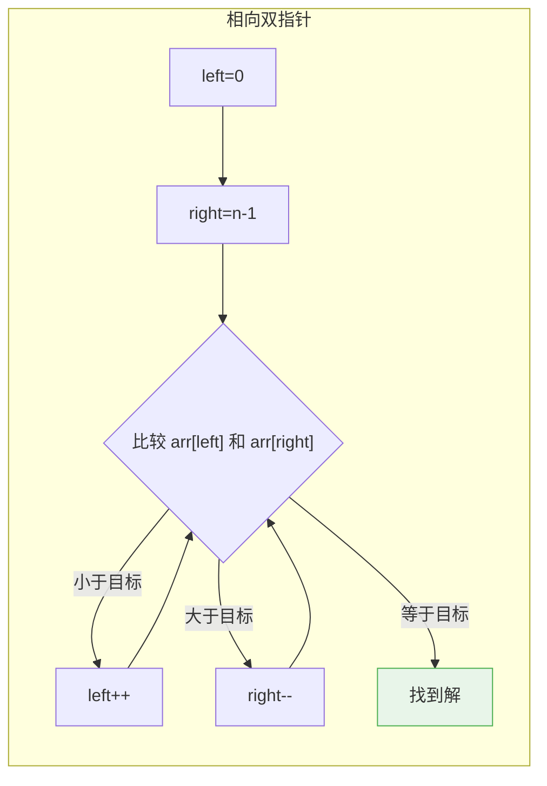
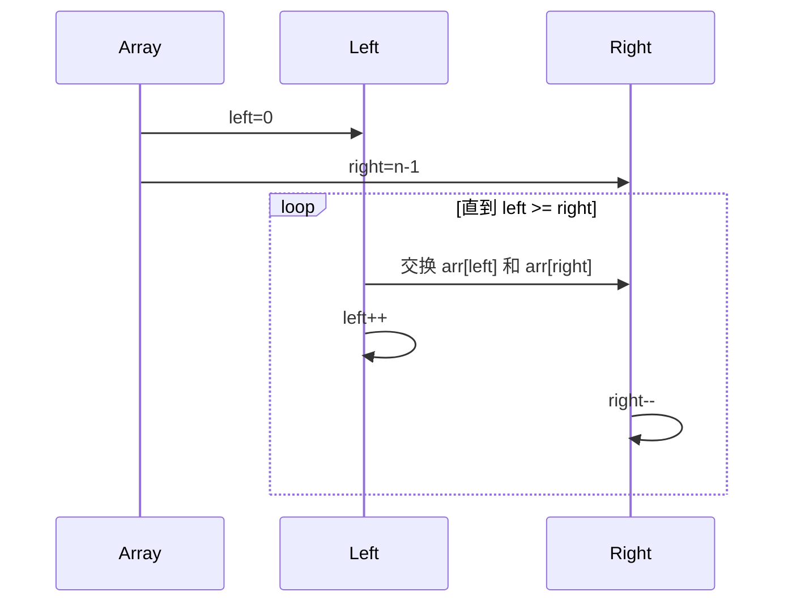
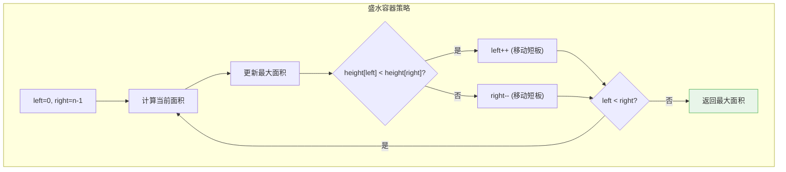
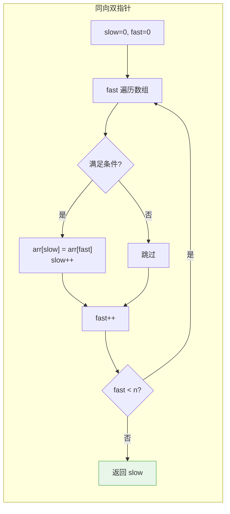
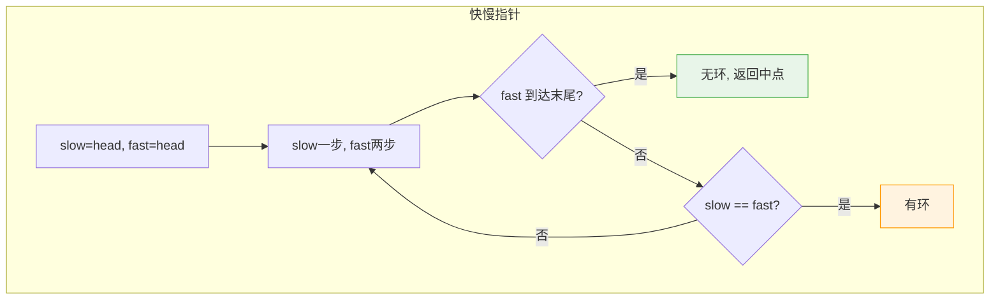
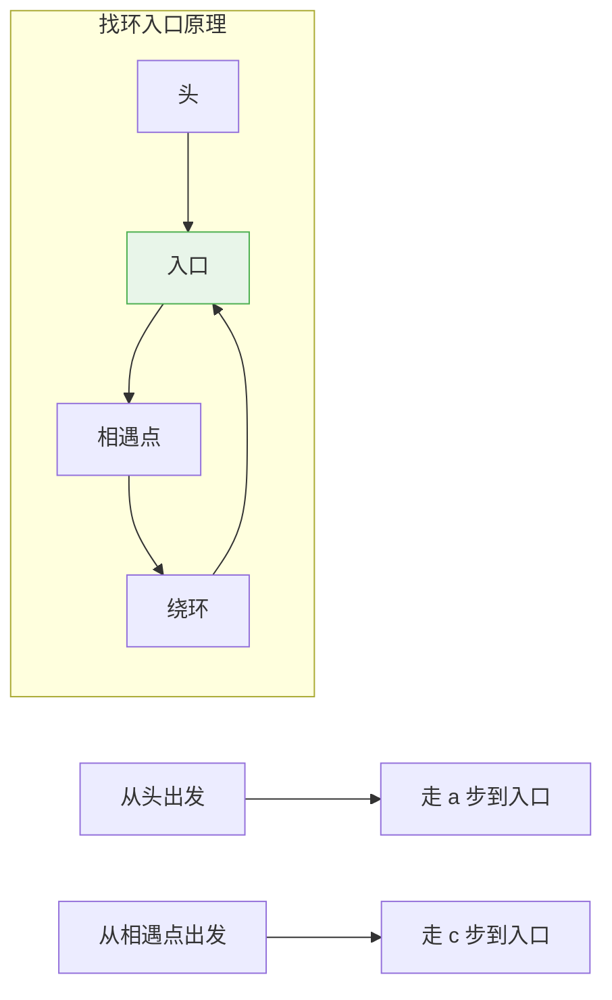
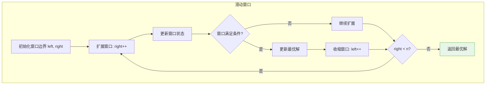
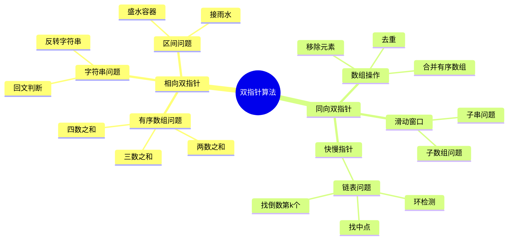

# 双指针算法

## 概述

双指针算法是一种使用**两个指针协同遍历数据结构**的技术，常用于数组、链表、字符串等线性结构。巧妙运用双指针可以将 O(n²) 的暴力解法优化为 O(n)。

<div style="background-color: #E3F2FD; padding: 15px; margin: 10px 0; border-left: 4px solid #2196F3; border-radius: 5px;">
    <strong>双指针核心思想</strong>
    <ul style="margin: 5px 0;">
        <li><strong>减少遍历次数</strong>：用两个指针代替嵌套循环</li>
        <li><strong>利用有序性</strong>：根据比较结果决定指针移动方向</li>
        <li><strong>避免重复计算</strong>：利用之前的结果进行增量更新</li>
    </ul>
</div>

!!! note "生活类比"
    想象在书中查找两个内容相关的段落：你可以一个指针从前往后找，另一个从后往前找，根据内容的相关性决定哪个指针移动，这样比从头到尾逐对检查要快得多。

## 双指针类型



| 类型 | 描述 | 移动方式 | 典型应用 |
|------|------|----------|----------|
| 相向双指针 | 从两端向中间移动 | left++, right-- | 两数之和、反转数组、回文判断 |
| 同向双指针 | 同方向移动 | slow++, fast++ | 滑动窗口、移除元素、去重 |
| 快慢指针 | 不同速度同向移动 | slow++, fast+=2 | 环检测、找中点、找环入口 |

## 相向双指针

### 工作原理



### 两数之和（有序数组）

```
问题: 在有序数组中找到两个数，使它们的和等于目标值

示例: arr = [1, 2, 3, 4, 6, 8, 11], target = 10

执行过程:
┌─────────────────────────────────────────────────────────────┐
│ 初始: left=0, right=6                                       │
│       [1, 2, 3, 4, 6, 8, 11]                                │
│        ↑                 ↑                                  │
│      left              right                                │
│       sum = 1 + 11 = 12 > 10 → right--                      │
├─────────────────────────────────────────────────────────────┤
│ 步骤1: left=0, right=5                                      │
│       [1, 2, 3, 4, 6, 8, 11]                                │
│        ↑              ↑                                     │
│      left           right                                   │
│       sum = 1 + 8 = 9 < 10 → left++                         │
├─────────────────────────────────────────────────────────────┤
│ 步骤2: left=1, right=5                                      │
│       [1, 2, 3, 4, 6, 8, 11]                                │
│           ↑           ↑                                     │
│         left        right                                   │
│       sum = 2 + 8 = 10 = target ✓                           │
│       找到: arr[1]=2, arr[5]=8                              │
└─────────────────────────────────────────────────────────────┘
```

```c
#include <stdio.h>

// 两数之和 - 返回索引
void twoSum(int arr[], int n, int target) {
    int left = 0, right = n - 1;
    
    printf("寻找两数之和为 %d:\n\n", target);
    
    while (left < right) {
        int sum = arr[left] + arr[right];
        
        printf("arr[%d]=%d + arr[%d]=%d = %d", 
               left, arr[left], right, arr[right], sum);
        
        if (sum == target) {
            printf(" ✓\n找到: %d + %d = %d\n", 
                   arr[left], arr[right], target);
            return;
        } else if (sum < target) {
            printf(" < %d, left++\n", target);
            left++;
        } else {
            printf(" > %d, right--\n", target);
            right--;
        }
    }
    
    printf("不存在解\n");
}

int main() {
    int arr[] = {1, 2, 3, 4, 6, 8, 11};
    int n = sizeof(arr) / sizeof(arr[0]);
    
    twoSum(arr, n, 10);
    
    return 0;
}
```

### 三数之和

```
问题: 找到三个数，使它们的和等于目标值

思路: 固定一个数，转化为两数之和问题
```

```c
void threeSum(int arr[], int n, int target) {
    printf("寻找三数之和为 %d:\n\n", target);
    
    for (int i = 0; i < n - 2; i++) {
        // 跳过重复元素
        if (i > 0 && arr[i] == arr[i - 1]) continue;
        
        int left = i + 1, right = n - 1;
        
        while (left < right) {
            int sum = arr[i] + arr[left] + arr[right];
            
            if (sum == target) {
                printf("%d + %d + %d = %d\n", 
                       arr[i], arr[left], arr[right], target);
                
                // 跳过重复
                while (left < right && arr[left] == arr[left + 1]) left++;
                while (left < right && arr[right] == arr[right - 1]) right--;
                
                left++;
                right--;
            } else if (sum < target) {
                left++;
            } else {
                right--;
            }
        }
    }
}
```

### 反转数组



```
反转 [1, 2, 3, 4, 5]:

初始:   [1,  2,  3,  4,  5]
         ↑               ↑
       left            right

交换1:  [5,  2,  3,  4,  1]
             ↑       ↑
           left    right

交换2:  [5,  4,  3,  2,  1]
                 ↑
              left=right (停止)

结果:   [5, 4, 3, 2, 1]
```

```c
void reverse(int arr[], int n) {
    int left = 0, right = n - 1;
    
    printf("反转数组:\n");
    printf("原数组: ");
    for (int i = 0; i < n; i++) printf("%d ", arr[i]);
    printf("\n\n");
    
    while (left < right) {
        // 交换
        int temp = arr[left];
        arr[left] = arr[right];
        arr[right] = temp;
        
        printf("交换 arr[%d] 和 arr[%d]: ", left, right);
        for (int i = 0; i < n; i++) printf("%d ", arr[i]);
        printf("\n");
        
        left++;
        right--;
    }
    
    printf("\n结果: ");
    for (int i = 0; i < n; i++) printf("%d ", arr[i]);
    printf("\n");
}
```

### 回文判断

```c
int isPalindrome(char *s, int n) {
    int left = 0, right = n - 1;
    
    while (left < right) {
        // 跳过非字母数字字符
        while (left < right && !isalnum(s[left])) left++;
        while (left < right && !isalnum(s[right])) right--;
        
        // 比较（忽略大小写）
        if (tolower(s[left]) != tolower(s[right])) {
            return 0;
        }
        
        left++;
        right--;
    }
    
    return 1;
}
```

### 盛最多水的容器

```
问题: 给定 n 个非负整数表示柱子高度，求两根柱子能盛放的最大水量

示例: height = [1, 8, 6, 2, 5, 4, 8, 3, 7]

        8  ■           ■
        7  │■        ■ │■
        6  ││■     ■│ ││
        5  │││■  ■││ ││
        4  ││││■■││ ││
        3  ││││││││■││
        2  │││││││││││
        1 ■│││││││││││
          0 1 2 3 4 5 6 7 8

最大面积 = min(height[left], height[right]) × (right - left)
         = min(1, 7) × 8 = 1 × 8 = 8  ... 不是最大的
         = min(8, 7) × 7 = 7 × 7 = 49 ... 最大！
```



```c
int maxArea(int height[], int n) {
    int left = 0, right = n - 1;
    int maxArea = 0;
    
    printf("盛最多水的容器:\n\n");
    
    while (left < right) {
        // 当前容器高度 = min(两边高度)
        int h = height[left] < height[right] ? height[left] : height[right];
        int width = right - left;
        int area = h * width;
        
        printf("left=%d (h=%d), right=%d (h=%d), ", 
               left, height[left], right, height[right]);
        printf("area = %d × %d = %d\n", h, width, area);
        
        if (area > maxArea) {
            maxArea = area;
            printf("  更新最大面积: %d\n", maxArea);
        }
        
        // 移动较短的边
        if (height[left] < height[right]) {
            left++;
        } else {
            right--;
        }
    }
    
    printf("\n最大面积: %d\n", maxArea);
    return maxArea;
}
```

## 同向双指针

### 工作原理



### 移除元素

```
问题: 原地移除数组中等于 val 的元素

示例: arr = [3, 2, 2, 3], val = 3

执行过程:
┌─────────────────────────────────────────────────────────────┐
│ 初始: slow=0, fast=0                                        │
│       [3, 2, 2, 3]                                          │
│        ↑                                                    │
│      slow,fast                                              │
├─────────────────────────────────────────────────────────────┤
│ fast=0: arr[0]=3 = val → 跳过                               │
│         fast++                                              │
├─────────────────────────────────────────────────────────────┤
│ fast=1: arr[1]=2 ≠ val → arr[slow]=arr[fast]               │
│       [2, 2, 2, 3]                                          │
│           ↑  ↑                                              │
│         slow fast                                           │
│         slow++, fast++                                      │
├─────────────────────────────────────────────────────────────┤
│ fast=2: arr[2]=2 ≠ val → arr[slow]=arr[fast]               │
│       [2, 2, 2, 3]                                          │
│              ↑  ↑                                           │
│            slow fast                                        │
│         slow++, fast++                                      │
├─────────────────────────────────────────────────────────────┤
│ fast=3: arr[3]=3 = val → 跳过                               │
│         fast++                                              │
├─────────────────────────────────────────────────────────────┤
│ 返回 slow=2, 新数组长度为2                                   │
│ 结果: [2, 2]                                                │
└─────────────────────────────────────────────────────────────┘
```

```c
int removeElement(int arr[], int n, int val) {
    int slow = 0;
    
    printf("移除元素 %d:\n原数组: ", val);
    for (int i = 0; i < n; i++) printf("%d ", arr[i]);
    printf("\n\n");
    
    for (int fast = 0; fast < n; fast++) {
        printf("fast=%d: arr[%d]=%d ", fast, fast, arr[fast]);
        
        if (arr[fast] != val) {
            arr[slow] = arr[fast];
            printf("→ 保留, arr[%d]=%d\n", slow, arr[slow]);
            slow++;
        } else {
            printf("→ 跳过\n");
        }
    }
    
    printf("\n结果: ");
    for (int i = 0; i < slow; i++) printf("%d ", arr[i]);
    printf("\n新长度: %d\n", slow);
    
    return slow;
}
```

### 删除有序数组重复元素

```
问题: 原地删除有序数组中的重复元素

示例: arr = [1, 1, 2, 2, 2, 3, 4, 4]

执行过程:
┌─────────────────────────────────────────────────────────────┐
│ 初始: slow=1, fast=1                                        │
│       [1, 1, 2, 2, 2, 3, 4, 4]                              │
│           ↑                                                 │
│         slow,fast                                           │
├─────────────────────────────────────────────────────────────┤
│ fast=1: arr[1]=1 = arr[0] → 重复，跳过                      │
├─────────────────────────────────────────────────────────────┤
│ fast=2: arr[2]=2 ≠ arr[1] → 不重复                          │
│         arr[slow]=arr[fast], slow++                         │
│       [1, 2, 2, 2, 2, 3, 4, 4]                              │
│              ↑  ↑                                           │
│            slow fast                                        │
├─────────────────────────────────────────────────────────────┤
│ fast=3,4: arr[fast]=2 = arr[slow-1]=2 → 重复，跳过          │
├─────────────────────────────────────────────────────────────┤
│ fast=5: arr[5]=3 ≠ 2 → 不重复                               │
│       [1, 2, 3, 2, 2, 3, 4, 4]                              │
│                 ↑        ↑                                  │
│               slow      fast                                │
├─────────────────────────────────────────────────────────────┤
│ ...继续...                                                   │
├─────────────────────────────────────────────────────────────┤
│ 最终: [1, 2, 3, 4], 长度=4                                  │
└─────────────────────────────────────────────────────────────┘
```

```c
int removeDuplicates(int arr[], int n) {
    if (n <= 1) return n;
    
    int slow = 1;  // 慢指针从1开始
    
    printf("删除有序数组重复元素:\n原数组: ");
    for (int i = 0; i < n; i++) printf("%d ", arr[i]);
    printf("\n\n");
    
    for (int fast = 1; fast < n; fast++) {
        if (arr[fast] != arr[fast - 1]) {
            arr[slow] = arr[fast];
            printf("fast=%d: arr[%d]=%d 不同, 移到位置 %d\n", 
                   fast, fast, arr[fast], slow);
            slow++;
        } else {
            printf("fast=%d: arr[%d]=%d 重复, 跳过\n", 
                   fast, fast, arr[fast]);
        }
    }
    
    printf("\n结果: ");
    for (int i = 0; i < slow; i++) printf("%d ", arr[i]);
    printf("\n新长度: %d\n", slow);
    
    return slow;
}
```

### 保留K个重复元素

```c
int removeDuplicatesK(int arr[], int n, int k) {
    if (n <= k) return n;
    
    int slow = k;  // 前 k 个元素直接保留
    
    for (int fast = k; fast < n; fast++) {
        // 与位置 slow-k 比较
        // 如果不同，说明可以保留
        if (arr[fast] != arr[slow - k]) {
            arr[slow++] = arr[fast];
        }
    }
    
    return slow;
}
```

## 快慢指针

### 工作原理



### 链表环检测

```
原理: 如果链表有环，快指针最终会追上慢指针

无环情况:
┌─────────────────────────────────────────────────────────────┐
│  1 → 2 → 3 → 4 → 5 → NULL                                   │
│  ↑                                                           │
│ s,f                                                          │
│                                                             │
│  1 → 2 → 3 → 4 → 5 → NULL                                   │
│       ↑   ↑                                                  │
│       s   f                                                  │
│                                                             │
│  1 → 2 → 3 → 4 → 5 → NULL                                   │
│           ↑       ↑                                          │
│           s       f                                          │
│                                                             │
│  1 → 2 → 3 → 4 → 5 → NULL                                   │
│               ↑           ↑                                  │
│               s           f → 到达末尾，无环                 │
└─────────────────────────────────────────────────────────────┘

有环情况:
┌─────────────────────────────────────────────────────────────┐
│  1 → 2 → 3 → 4 → 5                                           │
│  ↑               │                                           │
│ s,f              ↓                                           │
│                  └─┐                                         │
│                    ↓                                         │
│                   ...                                        │
│                                                             │
│  快指针最终会在环内追上慢指针                                 │
│  slow 和 fast 在环中某点相遇 → 有环                          │
└─────────────────────────────────────────────────────────────┘
```

```c
#include <stdio.h>
#include <stdlib.h>

typedef struct ListNode {
    int val;
    struct ListNode *next;
} ListNode;

// 创建链表
ListNode* createList(int arr[], int n) {
    if (n == 0) return NULL;
    
    ListNode *head = (ListNode*)malloc(sizeof(ListNode));
    head->val = arr[0];
    ListNode *current = head;
    
    for (int i = 1; i < n; i++) {
        current->next = (ListNode*)malloc(sizeof(ListNode));
        current = current->next;
        current->val = arr[i];
    }
    current->next = NULL;
    
    return head;
}

// 创建带环的链表
ListNode* createListWithCycle(int arr[], int n, int cycleIndex) {
    ListNode *head = createList(arr, n);
    
    if (cycleIndex >= 0 && cycleIndex < n) {
        ListNode *current = head;
        ListNode *cycleNode = NULL;
        ListNode *tail = NULL;
        
        for (int i = 0; i < n; i++) {
            if (i == cycleIndex) cycleNode = current;
            if (i == n - 1) tail = current;
            current = current->next;
        }
        
        tail->next = cycleNode;  // 创建环
    }
    
    return head;
}

// 环检测
int hasCycle(ListNode *head) {
    ListNode *slow = head;
    ListNode *fast = head;
    int step = 0;
    
    printf("环检测:\n");
    
    while (fast && fast->next) {
        slow = slow->next;
        fast = fast->next->next;
        step++;
        
        printf("步骤 %d: slow=%d", step, slow->val);
        if (fast) printf(", fast=%d", fast->val);
        printf("\n");
        
        if (slow == fast) {
            printf("相遇！链表有环\n");
            return 1;
        }
    }
    
    printf("fast 到达末尾，链表无环\n");
    return 0;
}

int main() {
    // 无环测试
    int arr1[] = {1, 2, 3, 4, 5};
    ListNode *list1 = createList(arr1, 5);
    printf("=== 无环链表测试 ===\n");
    hasCycle(list1);
    
    printf("\n=== 有环链表测试 ===\n");
    // 有环测试（在索引1处创建环）
    int arr2[] = {1, 2, 3, 4, 5};
    ListNode *list2 = createListWithCycle(arr2, 5, 1);
    hasCycle(list2);
    
    return 0;
}
```

### 找环入口

```
原理:
设 a = 头到环入口的距离
设 b = 环入口到相遇点的距离
设 c = 相遇点到环入口的距离（沿环方向）

慢指针走了: a + b
快指针走了: a + b + n(b + c), n ≥ 1

因为快指针速度是慢指针的两倍:
2(a + b) = a + b + n(b + c)
a + b = n(b + c)
a = n(b + c) - b = (n-1)(b+c) + c

结论: a = c + k倍环长
所以: 从头和相遇点同时出发，会在环入口相遇
```



```c
ListNode* detectCycle(ListNode *head) {
    ListNode *slow = head;
    ListNode *fast = head;
    
    // 第一步：检测是否有环并找到相遇点
    while (fast && fast->next) {
        slow = slow->next;
        fast = fast->next->next;
        
        if (slow == fast) {
            // 有环，找入口
            ListNode *ptr = head;
            int pos = 0;
            
            printf("从头部和相遇点同时出发:\n");
            while (ptr != slow) {
                printf("  头指针: %d, 相遇指针: %d\n", ptr->val, slow->val);
                ptr = ptr->next;
                slow = slow->next;
                pos++;
            }
            
            printf("环入口: 位置 %d, 值 %d\n", pos, ptr->val);
            return ptr;
        }
    }
    
    printf("无环\n");
    return NULL;
}
```

### 链表中点

```
原理: 快指针到末尾时，慢指针正好在中点

奇数长度:
┌─────────────────────────────────────────────────────────────┐
│  1 → 2 → 3 → 4 → 5 → NULL                                   │
│  ↑                                                           │
│ s,f                                                          │
│                                                             │
│  1 → 2 → 3 → 4 → 5 → NULL                                   │
│       ↑   ↑                                                  │
│       s   f                                                  │
│                                                             │
│  1 → 2 → 3 → 4 → 5 → NULL                                   │
│           ↑       ↑                                          │
│           s       f                                          │
│                                                             │
│  中点: 3                                                     │
└─────────────────────────────────────────────────────────────┘

偶数长度:
┌─────────────────────────────────────────────────────────────┐
│  1 → 2 → 3 → 4 → NULL                                        │
│  ↑                                                           │
│ s,f                                                          │
│                                                             │
│  1 → 2 → 3 → 4 → NULL                                        │
│       ↑   ↑                                                  │
│       s   f                                                  │
│                                                             │
│  1 → 2 → 3 → 4 → NULL                                        │
│           ↑       ↑                                          │
│           s       f → NULL                                   │
│                                                             │
│  中点: 3 (或 2，取决于实现)                                   │
└─────────────────────────────────────────────────────────────┘
```

```c
ListNode* findMiddle(ListNode *head) {
    ListNode *slow = head;
    ListNode *fast = head;
    
    printf("找链表中点:\n");
    int step = 0;
    
    while (fast && fast->next) {
        printf("步骤 %d: slow=%d", ++step, slow->val);
        if (fast->next->next) {
            printf(", fast=%d\n", fast->next->next->val);
        } else {
            printf(", fast=NULL\n");
        }
        
        slow = slow->next;
        fast = fast->next->next;
    }
    
    printf("中点: %d\n", slow->val);
    return slow;
}
```

### 链表倒数第K个节点

```c
ListNode* getKthFromEnd(ListNode *head, int k) {
    ListNode *fast = head;
    ListNode *slow = head;
    
    printf("找倒数第 %d 个节点:\n", k);
    
    // fast 先走 k 步
    for (int i = 0; i < k; i++) {
        if (fast) {
            printf("fast 前进: %d\n", fast->val);
            fast = fast->next;
        } else {
            printf("k 超过链表长度\n");
            return NULL;
        }
    }
    
    // 同时前进
    while (fast) {
        slow = slow->next;
        fast = fast->next;
    }
    
    printf("倒数第 %d 个节点: %d\n", k, slow->val);
    return slow;
}
```

## 滑动窗口

### 工作原理



### 固定长度窗口

```
问题: 求数组中长度为 k 的连续子数组的最大和

示例: arr = [1, 4, 2, 5, 3], k = 3

执行过程:
┌─────────────────────────────────────────────────────────────┐
│ 初始窗口: [1, 4, 2]  sum = 7, maxSum = 7                    │
│            ↑───↑                                            │
│           left right                                        │
├─────────────────────────────────────────────────────────────┤
│ 滑动一步: arr[right+1] - arr[left] = 5 - 1 = +4             │
│           [4, 2, 5]  sum = 7 + 4 = 11, maxSum = 11          │
│                ↑───↑                                        │
│              left right                                     │
├─────────────────────────────────────────────────────────────┤
│ 滑动一步: arr[right+1] - arr[left] = 3 - 4 = -1             │
│           [2, 5, 3]  sum = 11 - 1 = 10, maxSum = 11         │
│                    ↑───↑                                    │
│                  left right                                 │
├─────────────────────────────────────────────────────────────┤
│ 结果: maxSum = 11                                           │
└─────────────────────────────────────────────────────────────┘
```

```c
int maxSumFixed(int arr[], int n, int k) {
    int sum = 0;
    
    // 初始窗口
    for (int i = 0; i < k; i++) {
        sum += arr[i];
    }
    
    int maxSum = sum;
    printf("初始窗口: sum=%d\n", sum);
    
    // 滑动窗口
    for (int i = k; i < n; i++) {
        sum += arr[i] - arr[i - k];
        printf("窗口 [%d, %d]: sum=%d\n", i - k + 1, i, sum);
        
        if (sum > maxSum) {
            maxSum = sum;
        }
    }
    
    printf("最大和: %d\n", maxSum);
    return maxSum;
}
```

### 最小覆盖子串

```
问题: 在字符串 s 中找到包含 t 所有字符的最短子串

示例: s = "ADOBECODEBANC", t = "ABC"
```

```c
#include <stdio.h>
#include <string.h>
#include <stdlib.h>

char* minWindow(char *s, char *t) {
    int count[128] = {0};       // t 中各字符的需求量
    int required = 0;            // 需要的不同字符数
    
    // 统计 t 的字符
    for (int i = 0; t[i]; i++) {
        if (count[t[i]] == 0) required++;
        count[t[i]]++;
    }
    
    int left = 0, right = 0;
    int formed = 0;              // 已满足的字符数
    int windowCounts[128] = {0};
    
    int minLen = 1e9, start = 0;
    
    printf("最小覆盖子串:\n");
    printf("目标: %s\n", t);
    printf("源串: %s\n\n", s);
    
    while (s[right]) {
        // 扩展窗口
        char c = s[right];
        windowCounts[c]++;
        
        if (windowCounts[c] == count[c]) {
            formed++;
        }
        
        // 收缩窗口
        while (formed == required) {
            if (right - left + 1 < minLen) {
                minLen = right - left + 1;
                start = left;
                printf("找到窗口: [%d, %d], 长度=%d, 子串=%.*s\n",
                       left, right, minLen, minLen, s + start);
            }
            
            char leftChar = s[left];
            windowCounts[leftChar]--;
            if (windowCounts[leftChar] < count[leftChar]) {
                formed--;
            }
            left++;
        }
        
        right++;
    }
    
    if (minLen == 1e9) {
        printf("不存在覆盖子串\n");
        return "";
    }
    
    char *result = (char*)malloc(minLen + 1);
    strncpy(result, s + start, minLen);
    result[minLen] = '\0';
    
    printf("最小覆盖子串: %s\n", result);
    return result;
}
```

## 算法复杂度总结

| 问题类型 | 暴力解法 | 双指针优化 | 说明 |
|----------|----------|------------|------|
| 两数之和 | O(n²) | O(n) | 相向双指针 |
| 三数之和 | O(n³) | O(n²) | 固定一个 + 双指针 |
| 反转数组 | O(n) | O(n) | 原地交换，空间 O(1) |
| 移除元素 | O(n²) | O(n) | 同向双指针 |
| 环检测 | O(n²) | O(n) | 快慢指针 |
| 滑动窗口 | O(n×k) | O(n) | 增量更新 |

## 应用场景总结



## 参考资料

- 《算法导论》第2章 - 算法基础
- LeetCode 双指针专题
- [Two Pointers Technique - GeeksforGeeks](https://www.geeksforgeeks.org/two-pointers-technique/)
