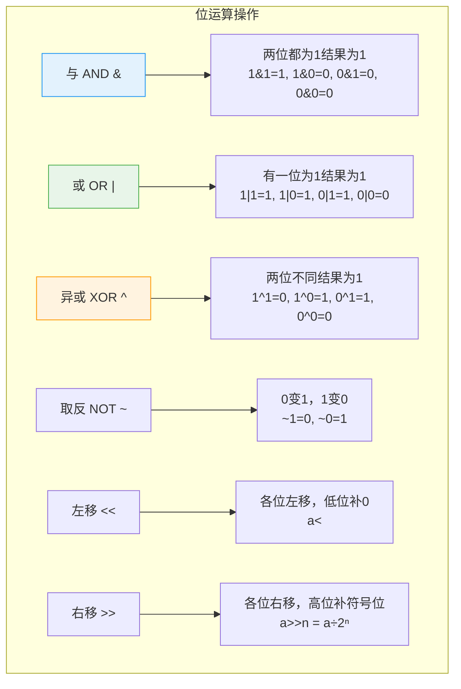
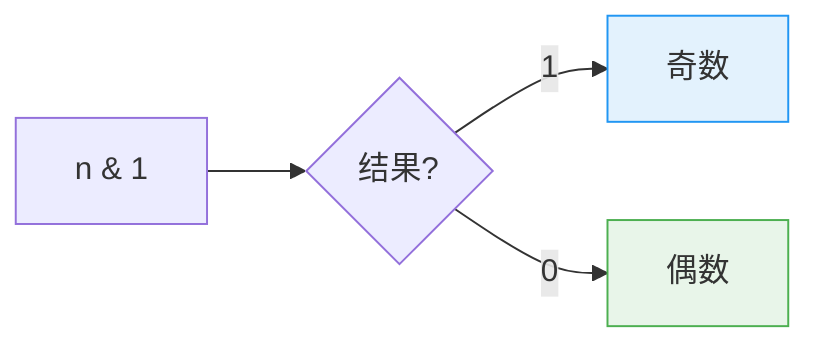
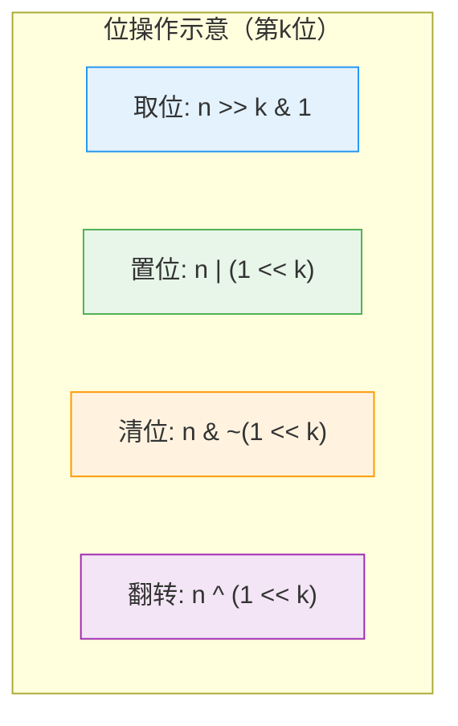
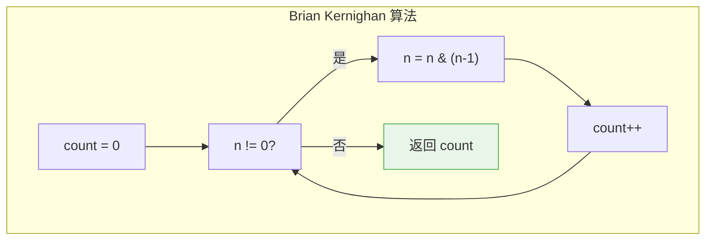
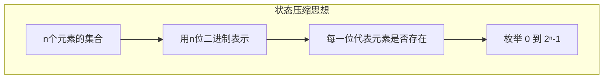
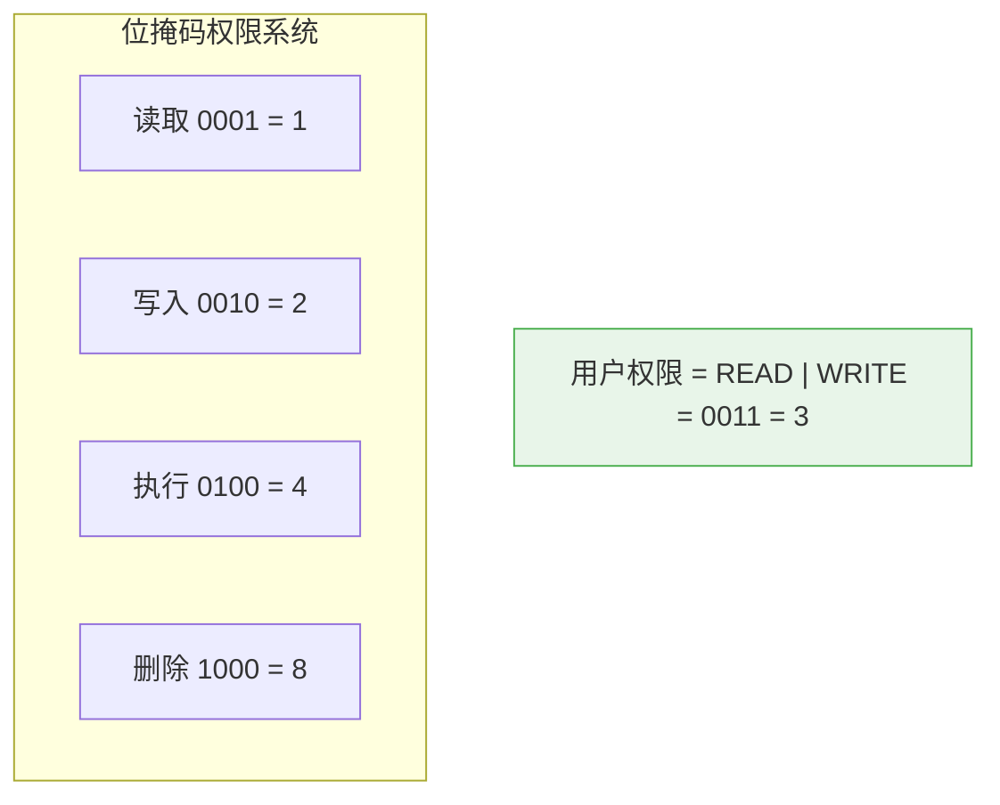
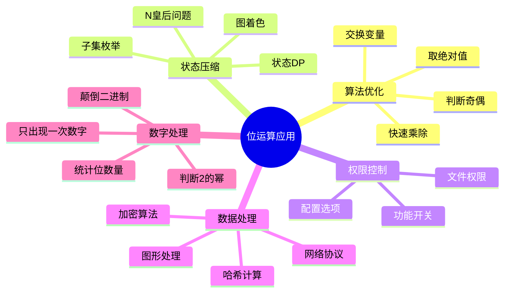

# 位运算算法

## 概述

位运算直接对整数的**二进制位**进行操作，是计算机中最底层的运算方式。由于直接操作硬件支持的位，位运算具有**极高的效率**，广泛应用于算法优化、状态压缩、权限控制、图形处理等领域。

<div style="background-color: #E3F2FD; padding: 15px; margin: 10px 0; border-left: 4px solid #2196F3; border-radius: 5px;">
    <strong>位运算优势</strong>
    <ul style="margin: 5px 0;">
        <li><strong>速度极快</strong>：单条CPU指令完成，无函数调用开销</li>
        <li><strong>节省空间</strong>：一个整数可存储多个布尔标志</li>
        <li><strong>并行处理</strong>：一次操作处理32/64个位</li>
        <li><strong>硬件友好</strong>：直接对应CPU位操作指令</li>
    </ul>
</div>

!!! note "生活类比"
    想象一排灯泡开关：每个开关只有开（1）和关（0）两种状态。位运算就像是对整排开关进行批量操作——"全部打开"、"全部关闭"、"翻转状态"、"检查某个位置是否开着"等。

## 二进制基础

### 数的二进制表示

```
十进制转二进制示例:

十进制 42 → 二进制 101010

计算过程:
42 ÷ 2 = 21 余 0  ← 最低位
21 ÷ 2 = 10 余 1
10 ÷ 2 = 5  余 0
5  ÷ 2 = 2  余 1
2  ÷ 2 = 1  余 0
1  ÷ 2 = 0  余 1  ← 最高位

从下往上读: 101010

验证: 1×32 + 0×16 + 1×8 + 0×4 + 1×2 + 0×1 = 32 + 8 + 2 = 42 ✓
```

### 位的位置和权重

```
32位整数的位位置:

位索引:  31  30  29  ...  3   2   1   0
权重:    2³¹ 2³⁰ 2²⁹ ... 2³  2²  2¹  2⁰
         ↑                              ↑
       最高位                         最低位
       (符号位)                       (LSB)

示例: 数字 13 (32位表示)
┌─────────────────────────────────────────────────────────────┐
│ 位索引:  31 ... 4   3   2   1   0                            │
│ 值:     0  ... 0   1   1   0   1                            │
│ 权重:              8   4   2   1                            │
│ 计算:   8 + 4 + 1 = 13                                       │
└─────────────────────────────────────────────────────────────┘

二进制: 00000000 00000000 00000000 00001101
```

## 基本位运算

### 六种基本运算



### 运算真值表

```
与运算 (AND):
┌─────────────────────────────────────┐
│  A  │  B  │ A & B                   │
├─────────────────────────────────────┤
│  0  │  0  │   0                     │
│  0  │  1  │   0                     │
│  1  │  0  │   0                     │
│  1  │  1  │   1  ← 只有两个都为1才为1│
└─────────────────────────────────────┘

或运算 (OR):
┌─────────────────────────────────────┐
│  A  │  B  │ A | B                   │
├─────────────────────────────────────┤
│  0  │  0  │   0                     │
│  0  │  1  │   1                     │
│  1  │  0  │   1                     │
│  1  │  1  │   1  ← 有一个为1就为1   │
└─────────────────────────────────────┘

异或运算 (XOR):
┌─────────────────────────────────────┐
│  A  │  B  │ A ^ B                   │
├─────────────────────────────────────┤
│  0  │  0  │   0                     │
│  0  │  1  │   1                     │
│  1  │  0  │   1                     │
│  1  │  1  │   0  ← 不同为1，相同为0 │
└─────────────────────────────────────┘
```

### 运算示例

```
示例: 计算 12 & 10

  12 = 1100 (二进制)
  10 = 1010 (二进制)
─────────────
  &   = 1000 = 8

逐位比较:
  位3: 1 & 1 = 1
  位2: 1 & 0 = 0
  位1: 0 & 1 = 0
  位0: 0 & 0 = 0

示例: 计算 12 | 10

  12 = 1100
  10 = 1010
─────────────
  |   = 1110 = 14

示例: 计算 12 ^ 10

  12 = 1100
  10 = 1010
─────────────
  ^   = 0110 = 6

示例: 左移 5 << 2

  5  = 0101
  左移2位: 010100 = 20
  
  计算: 5 × 2² = 5 × 4 = 20 ✓

示例: 右移 20 >> 2

  20 = 10100
  右移2位: 101 = 5
  
  计算: 20 ÷ 2² = 20 ÷ 4 = 5 ✓
```

## 常用位运算技巧

### 1. 判断奇偶



```
原理: 二进制最低位决定奇偶

奇数最低位总是1:
  3 = 0011 → 0011 & 0001 = 0001 = 1
  5 = 0101 → 0101 & 0001 = 0001 = 1
  7 = 0111 → 0111 & 0001 = 0001 = 1

偶数最低位总是0:
  2 = 0010 → 0010 & 0001 = 0000 = 0
  4 = 0100 → 0100 & 0001 = 0000 = 0
  6 = 0110 → 0110 & 0001 = 0000 = 0
```

```c
int isOdd(int n) {
    return n & 1;  // 返回1为奇数，0为偶数
}

int isEven(int n) {
    return !(n & 1);  // 返回1为偶数，0为奇数
}
```

### 2. 交换两数（不用临时变量）

```
异或交换原理:

设 a = 3 = 0011, b = 5 = 0101

步骤1: a = a ^ b
  0011 ^ 0101 = 0110 (a = 6)
  
步骤2: b = b ^ a
  0101 ^ 0110 = 0011 (b = 3, 原来的a)
  
步骤3: a = a ^ b
  0110 ^ 0011 = 0101 (a = 5, 原来的b)

结果: a = 5, b = 3 ✓ 交换成功！
```

```c
void swap(int *a, int *b) {
    *a ^= *b;  // a = a ^ b
    *b ^= *a;  // b = b ^ (a ^ b) = a
    *a ^= *b;  // a = (a ^ b) ^ a = b
}
```

### 3. 位操作（取位、置位、清位、翻转）



```
示例: 操作数字 13 = 1101 的第2位（索引从0开始）

取第2位 (n >> 2 & 1):
  1101 >> 2 = 0011
  0011 & 0001 = 0001 = 1 ✓ 第2位是1

设置第2位为1 (n | (1 << 2)):
  1 << 2 = 0100
  1101 | 0100 = 1101 (已经是1，不变)

设置第1位为1 (n | (1 << 1)):
  1 << 1 = 0010
  1101 | 0010 = 1111 = 15

清除第2位 (n & ~(1 << 2)):
  1 << 2 = 0100
  ~(0100) = 1011
  1101 & 1011 = 1001 = 9

翻转第2位 (n ^ (1 << 2)):
  1 << 2 = 0100
  1101 ^ 0100 = 1001 = 9
```

```c
// 取第k位（返回0或1）
int getBit(int n, int k) {
    return (n >> k) & 1;
}

// 设置第k位为1
int setBit(int n, int k) {
    return n | (1 << k);
}

// 清除第k位（设为0）
int clearBit(int n, int k) {
    return n & ~(1 << k);
}

// 翻转第k位
int toggleBit(int n, int k) {
    return n ^ (1 << k);
}

// 将第k位设置为指定值（0或1）
int setBitTo(int n, int k, int value) {
    if (value) {
        return n | (1 << k);
    } else {
        return n & ~(1 << k);
    }
}
```

### 4. 最低位1（Lowbit）

<div style="background-color: #F3E5F5; padding: 15px; margin: 10px 0; border-left: 4px solid #9C27B0; border-radius: 5px;">
    <strong>Lowbit 公式</strong>
    <p style="text-align: center; font-size: 1.2em;"><code>lowbit(n) = n & (-n)</code></p>
    <p>返回 n 的二进制表示中最低位的1及其后面的0组成的值。</p>
</div>

```
Lowbit 计算原理（补码）:

n = 12 = 00001100
-n = ~n + 1 = 11110100 (补码)

n & (-n):
  00001100
& 11110100
──────────
  00000100 = 4

结果: lowbit(12) = 4，表示最低位的1在第2位

更多示例:
  lowbit(6)  = lowbit(0110) = 0010 = 2
  lowbit(8)  = lowbit(1000) = 1000 = 8
  lowbit(7)  = lowbit(0111) = 0001 = 1
  lowbit(16) = lowbit(10000) = 10000 = 16
```

```c
int lowbit(int n) {
    return n & (-n);
}
```

### 5. 判断是否为2的幂

```
原理: 2的幂的二进制表示只有一个1

2⁰ = 1  = 0001  ← 1个1
2¹ = 2  = 0010  ← 1个1
2² = 4  = 0100  ← 1个1
2³ = 8  = 1000  ← 1个1

非2的幂:
3  = 0011  ← 2个1
5  = 0101  ← 2个1
6  = 0110  ← 2个1
12 = 1100  ← 2个1

判断方法: n & (n-1) 消除最低位的1
如果结果为0，说明只有一个1
```

```c
int isPowerOfTwo(int n) {
    return n > 0 && (n & (n - 1)) == 0;
}
```

### 6. 统计1的个数（Popcount）



```
Brian Kernighan 算法示例:

n = 13 = 1101

步骤1: n & (n-1) = 1101 & 1100 = 1100 = 12
       count = 1

步骤2: n & (n-1) = 1100 & 1011 = 1000 = 8
       count = 2

步骤3: n & (n-1) = 1000 & 0111 = 0000 = 0
       count = 3

结果: count = 3，13有3个1 ✓
```

```c
// 基本版本
int countBits(int n) {
    int count = 0;
    while (n) {
        count += n & 1;
        n >>= 1;
    }
    return count;
}

// Brian Kernighan 算法（更快）
int countBitsOptimized(int n) {
    int count = 0;
    while (n) {
        n &= n - 1;  // 每次消除一个1
        count++;
    }
    return count;
}

// 查表法（最快，适合多次调用）
int countBitsTable[256] = { /* 预计算0-255的popcount */ };

int countBitsLookup(unsigned int n) {
    return countBitsTable[n & 0xff] +
           countBitsTable[(n >> 8) & 0xff] +
           countBitsTable[(n >> 16) & 0xff] +
           countBitsTable[(n >> 24) & 0xff];
}
```

## 经典位运算应用

### 1. 只出现一次的数字

```
问题: 数组中所有元素出现两次，只有一个出现一次，找出它

原理: 异或的性质
  a ^ a = 0  (相同数异或为0)
  a ^ 0 = a  (与0异或不变)
  异或满足交换律和结合律

示例: [4, 1, 2, 1, 2]

计算: 4 ^ 1 ^ 2 ^ 1 ^ 2
    = 4 ^ (1 ^ 1) ^ (2 ^ 2)
    = 4 ^ 0 ^ 0
    = 4

结果: 4 ✓
```

```c
int singleNumber(int nums[], int n) {
    int result = 0;
    for (int i = 0; i < n; i++) {
        result ^= nums[i];
    }
    return result;
}
```

### 2. 只出现一次的数字（其他出现三次）

```c
// 统计每一位的出现次数
int singleNumberII(int nums[], int n) {
    int result = 0;
    
    for (int i = 0; i < 32; i++) {
        int sum = 0;
        for (int j = 0; j < n; j++) {
            if ((nums[j] >> i) & 1) {
                sum++;
            }
        }
        // 出现次数模3
        if (sum % 3) {
            result |= (1 << i);
        }
    }
    
    return result;
}

// 状态机解法（更优）
int singleNumberII_StateMachine(int nums[], int n) {
    int ones = 0, twos = 0;
    
    for (int i = 0; i < n; i++) {
        ones = (ones ^ nums[i]) & ~twos;
        twos = (twos ^ nums[i]) & ~ones;
    }
    
    return ones;
}
```

### 3. 颠倒二进制位

```
问题: 将32位无符号整数的二进制位翻转

示例: 43261596 (00000010100101000001111010011100)
结果: 964176192 (00111001011110000010100101000000)
```

```c
// 基本版本：逐位翻转
unsigned int reverseBits(unsigned int n) {
    unsigned int result = 0;
    for (int i = 0; i < 32; i++) {
        result = (result << 1) | (n & 1);
        n >>= 1;
    }
    return result;
}

// 分治版本：性能更优
unsigned int reverseBitsOptimized(unsigned int n) {
    // 交换左右16位
    n = (n >> 16) | (n << 16);
    // 交换每16位中的左右8位
    n = ((n & 0xff00ff00) >> 8) | ((n & 0x00ff00ff) << 8);
    // 交换每8位中的左右4位
    n = ((n & 0xf0f0f0f0) >> 4) | ((n & 0x0f0f0f0f) << 4);
    // 交换每4位中的左右2位
    n = ((n & 0xcccccccc) >> 2) | ((n & 0x33333333) << 2);
    // 交换每2位中的左右1位
    n = ((n & 0xaaaaaaaa) >> 1) | ((n & 0x55555555) << 1);
    return n;
}
```

### 4. 求两数平均值（避免溢出）

```c
// 传统方法可能溢出: (a + b) / 2
// 位运算方法:
int average(int a, int b) {
    return (a & b) + ((a ^ b) >> 1);
}

/*
原理:
a & b: a和b相同的位（这些位直接保留）
a ^ b: a和b不同的位（这些位求平均需要除2，即右移1位）
*/
```

### 5. 取绝对值（无分支）

```c
int absBit(int n) {
    int mask = n >> 31;  // 正数得0，负数得-1(全1)
    return (n ^ mask) - mask;
}

/*
原理:
正数: mask = 0, (n ^ 0) - 0 = n
负数: mask = -1(全1), (n ^ -1) - (-1) = ~n + 1 = -n
*/
```

## 状态压缩

### 子集枚举



```
集合 {A, B, C} 的子集用3位二进制表示:

┌─────────────────────────────────────────────────────────────┐
│ 掩码 │ 二进制 │ 子集     │ 说明                              │
├─────────────────────────────────────────────────────────────┤
│  0   │  000   │ {}       │ 空集                              │
│  1   │  001   │ {C}      │ 只有第0位为1                      │
│  2   │  010   │ {B}      │ 只有第1位为1                      │
│  3   │  011   │ {B, C}   │ 第0、1位为1                       │
│  4   │  100   │ {A}      │ 只有第2位为1                      │
│  5   │  101   │ {A, C}   │ 第0、2位为1                       │
│  6   │  110   │ {A, B}   │ 第1、2位为1                       │
│  7   │  111   │ {A,B,C}  │ 全集                              │
└─────────────────────────────────────────────────────────────┘

总共有 2³ = 8 个子集
```

```c
// 枚举所有子集
void enumerateSubsets(int n) {
    printf("枚举 %d 个元素的所有子集:\n", n);
    
    for (int mask = 0; mask < (1 << n); mask++) {
        printf("掩码 %2d (二进制 ", mask);
        
        // 打印二进制
        for (int i = n - 1; i >= 0; i--) {
            printf("%d", (mask >> i) & 1);
        }
        
        printf("): { ");
        for (int i = 0; i < n; i++) {
            if (mask & (1 << i)) {
                printf("%c ", 'A' + i);
            }
        }
        printf("}\n");
    }
}
```

### 枚举子集的子集

```c
// 枚举某个集合的所有子集
void enumerateSubSubsets(int mask) {
    printf("枚举掩码 %d 的所有子集:\n", mask);
    
    // 关键技巧: sub = (sub - 1) & mask
    for (int sub = mask; sub; sub = (sub - 1) & mask) {
        printf("  子集: %d\n", sub);
    }
    printf("  子集: 0 (空集)\n");
}
```

## 权限控制



```c
#include <stdio.h>

// 定义权限常量
#define PERMISSION_READ    1   // 0001
#define PERMISSION_WRITE   2   // 0010
#define PERMISSION_EXECUTE 4   // 0100
#define PERMISSION_DELETE  8   // 1000

// 检查权限
int hasPermission(int userPerms, int perm) {
    return (userPerms & perm) != 0;
}

// 授予权限
int grantPermission(int userPerms, int perm) {
    return userPerms | perm;
}

// 撤销权限
int revokePermission(int userPerms, int perm) {
    return userPerms & ~perm;
}

// 打印权限
void printPermissions(int perms) {
    printf("权限: ");
    if (perms & PERMISSION_READ) printf("读 ");
    if (perms & PERMISSION_WRITE) printf("写 ");
    if (perms & PERMISSION_EXECUTE) printf("执行 ");
    if (perms & PERMISSION_DELETE) printf("删除 ");
    printf("\n");
}

int main() {
    int userPerms = PERMISSION_READ | PERMISSION_WRITE;
    
    printf("初始权限: ");
    printPermissions(userPerms);
    
    printf("\n检查读权限: %s\n", 
           hasPermission(userPerms, PERMISSION_READ) ? "有" : "无");
    
    printf("检查执行权限: %s\n", 
           hasPermission(userPerms, PERMISSION_EXECUTE) ? "有" : "无");
    
    printf("\n授予执行权限...\n");
    userPerms = grantPermission(userPerms, PERMISSION_EXECUTE);
    printPermissions(userPerms);
    
    printf("\n撤销写权限...\n");
    userPerms = revokePermission(userPerms, PERMISSION_WRITE);
    printPermissions(userPerms);
    
    return 0;
}
```

## 性能对比

```
位运算 vs 传统方法性能对比:

┌─────────────────────────────────────────────────────────────┐
│ 操作           │ 传统方法        │ 位运算          │ 加速比  │
├─────────────────────────────────────────────────────────────┤
│ 判断奇偶       │ n % 2          │ n & 1          │ ~3x    │
│ 乘以2          │ n * 2          │ n << 1         │ ~2x    │
│ 除以2          │ n / 2          │ n >> 1         │ ~2x    │
│ 取模2ⁿ         │ n % (2^n)      │ n & (2^n-1)    │ ~3x    │
│ 判断2的幂      │ 循环检查        │ n & (n-1)      │ ~10x   │
│ 统计1的个数    │ 循环逐位检查    │ Brian Kernighan│ ~5x    │
└─────────────────────────────────────────────────────────────┘

注意: 现代编译器会自动优化部分操作，但显式位运算意图更清晰。
```

## 应用场景总结



## 参考资料

- 《算法竞赛入门经典》位运算章节
- Hacker's Delight (Henry S. Warren)
- [Bit Manipulation - GeeksforGeeks](https://www.geeksforgeeks.org/bit-manipulation/)
- [Bit Twiddling Hacks](https://graphics.stanford.edu/~seander/bithacks.html)
