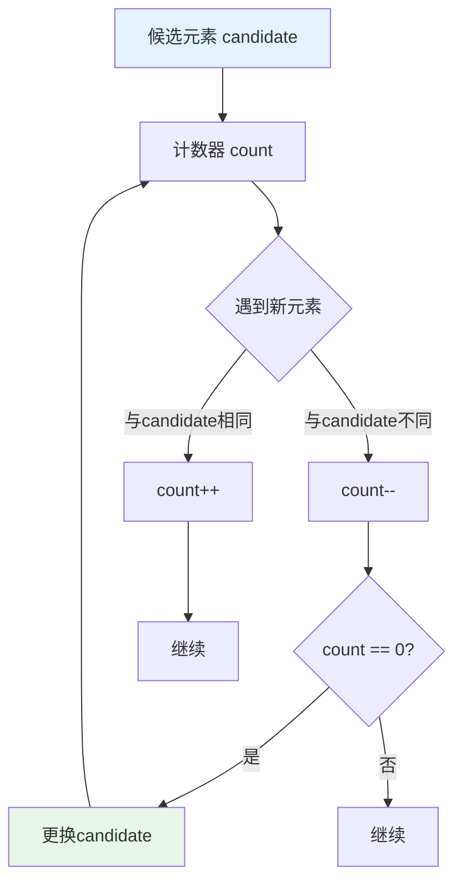
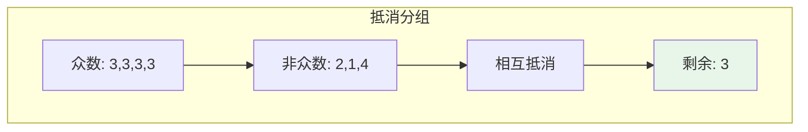
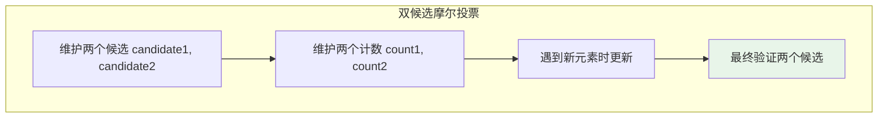
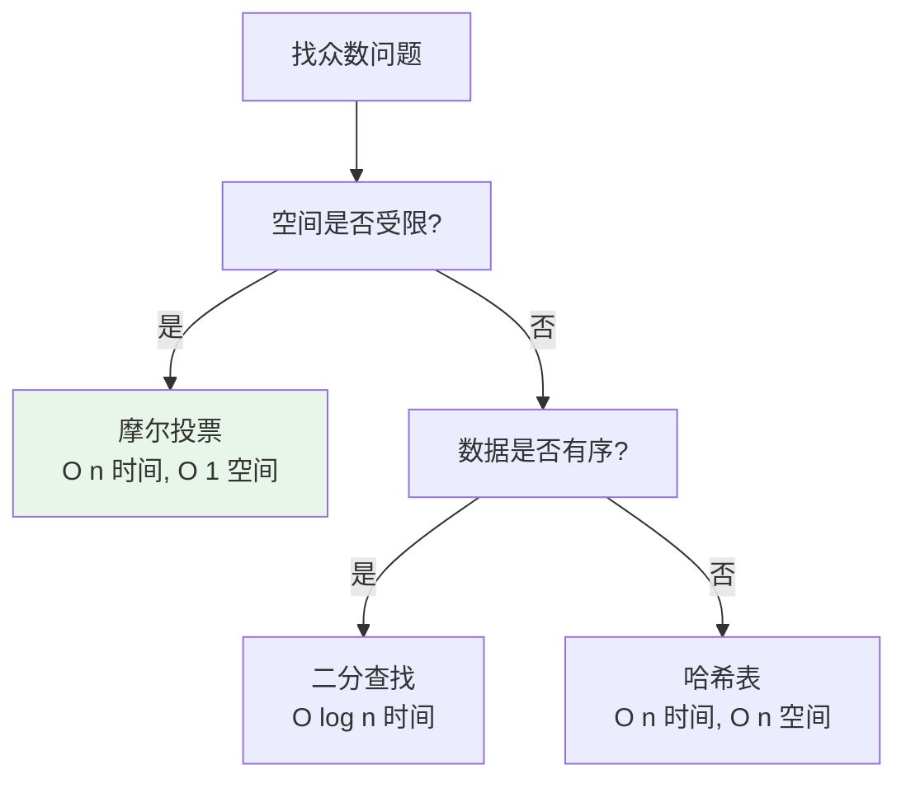

# 摩尔投票算法

## 概述

摩尔投票算法（Boyer-Moore Majority Vote Algorithm）是一种高效的算法，用于在**O(n)时间**和**O(1)空间**内找出数组中出现次数超过⌊n/2⌋的元素（众数）。该算法由Robert S. Boyer和J Strother Moore于1981年提出。

!!! note "摩尔投票的精妙之处"
    摩尔投票算法的核心思想是"抵消"——不同元素相互抵消，最终剩下的就是众数。它只需要常数空间，是解决众数问题的最优算法。

## 算法思想详解

### 投票抵消原理



### 核心思想

将数组中的元素分为两类：
- **众数x**：出现次数 > n/2
- **其他元素**：出现次数 < n/2

**抵消策略**：每遇到一个非众数元素，就消耗一个众数元素。由于众数数量超过一半，最终必然剩下众数。

```
抵消示意:

数组: [3, 2, 3, 1, 3, 4, 3]
       ↑     ↑     ↑     ↑
      众数   众数   众数   众数

抵消过程:
3 vs 2  → 3 剩下（抵消一个非众数）
3 vs 1  → 3 剩下（抵消一个非众数）
3 vs 4  → 3 剩下（抵消一个非众数）
最终: 3 是众数

众数个数 = 4 > n/2 = 3.5
即使所有非众数都与众数抵消，众数仍有剩余
```

## 算法可视化演示

### 完整投票过程

```
输入数组: [3, 2, 3, 1, 3, 4, 3]
众数: 3 (出现4次 > 7/2=3.5)

┌─────────────────────────────────────────────────────┐
│ 摩尔投票过程                                        │
└─────────────────────────────────────────────────────┘

初始状态: candidate = null, count = 0

Step 0: 遇到 3
        count == 0, 选择 3 作为候选
        candidate = 3, count = 1
        
        [3, 2, 3, 1, 3, 4, 3]
         ↑
         cand=3, cnt=1

Step 1: 遇到 2
        2 ≠ candidate, count--
        count = 0
        
        [3, 2, 3, 1, 3, 4, 3]
             ↑
             cand=3, cnt=0 (抵消)

Step 2: 遇到 3
        count == 0, 选择 3 作为候选
        candidate = 3, count = 1
        
        [3, 2, 3, 1, 3, 4, 3]
               ↑
               cand=3, cnt=1

Step 3: 遇到 1
        1 ≠ candidate, count--
        count = 0
        
        [3, 2, 3, 1, 3, 4, 3]
                   ↑
                   cand=3, cnt=0 (抵消)

Step 4: 遇到 3
        count == 0, 选择 3 作为候选
        candidate = 3, count = 1
        
        [3, 2, 3, 1, 3, 4, 3]
                      ↑
                      cand=3, cnt=1

Step 5: 遇到 4
        4 ≠ candidate, count--
        count = 0
        
        [3, 2, 3, 1, 3, 4, 3]
                          ↑
                          cand=3, cnt=0 (抵消)

Step 6: 遇到 3
        count == 0, 选择 3 作为候选
        candidate = 3, count = 1
        
        [3, 2, 3, 1, 3, 4, 3]
                             ↑
                             cand=3, cnt=1

最终结果: candidate = 3
```

### 抵消原理图解



```
抵消配对示意:

原始配对:
┌───┬───┐
│ 3 │ 2 │  → 抵消
└───┴───┘
┌───┬───┐
│ 3 │ 1 │  → 抵消
└───┴───┘
┌───┬───┐
│ 3 │ 4 │  → 抵消
└───┴───┘
┌───┐
│ 3 │  → 剩余（众数）
└───┘

众数个数(4) > 非众数个数(3)
抵消后必有剩余
```

## 基本实现

### C语言版本

```c
int majorityElement(int nums[], int n) {
    int candidate = nums[0];  // 候选元素
    int count = 1;            // 计数器
    
    for (int i = 1; i < n; i++) {
        if (count == 0) {
            // 计数为0，更换候选
            candidate = nums[i];
            count = 1;
        } else if (nums[i] == candidate) {
            // 遇到相同元素，计数+1
            count++;
        } else {
            // 遇到不同元素，计数-1（抵消）
            count--;
        }
    }
    
    return candidate;
}
```

### 验证结果

如果题目不保证众数一定存在，需要验证：

```c
// 验证候选元素是否真的是众数
int isMajority(int nums[], int n, int candidate) {
    int count = 0;
    for (int i = 0; i < n; i++) {
        if (nums[i] == candidate) {
            count++;
        }
    }
    return count > n / 2;
}

// 完整版：返回众数，如果不存在返回-1
int majorityElementVerified(int nums[], int n) {
    if (n <= 0) return -1;
    
    // 第一遍：摩尔投票找出候选
    int candidate = nums[0];
    int count = 1;
    
    for (int i = 1; i < n; i++) {
        if (count == 0) {
            candidate = nums[i];
            count = 1;
        } else if (nums[i] == candidate) {
            count++;
        } else {
            count--;
        }
    }
    
    // 第二遍：验证是否真的是众数
    if (isMajority(nums, n, candidate)) {
        return candidate;
    }
    
    return -1;  // 众数不存在
}
```

### C++ 实现

```cpp
#include <vector>

int majorityElement(const std::vector<int>& nums) {
    int candidate = 0;
    int count = 0;
    
    for (int num : nums) {
        if (count == 0) {
            candidate = num;
        }
        count += (num == candidate) ? 1 : -1;
    }
    
    return candidate;
}

// 验证版本
int majorityElementVerified(const std::vector<int>& nums) {
    if (nums.empty()) return -1;
    
    int candidate = majorityElement(nums);
    
    // 验证
    int count = 0;
    for (int num : nums) {
        if (num == candidate) count++;
    }
    
    return (count > nums.size() / 2) ? candidate : -1;
}
```

## 扩展：求众数II（超过n/3）

### 问题分析

出现次数超过⌊n/3⌋的元素最多有**2个**。

```
证明:
假设有3个元素出现次数都 > n/3
则总次数 > n/3 + n/3 + n/3 = n
矛盾！

因此超过n/3的元素最多2个
```

### 实现



```c
typedef struct {
    int *result;
    int count;
} Result;

Result majorityElementII(int nums[], int n) {
    int candidate1 = 0, candidate2 = 0;
    int count1 = 0, count2 = 0;
    
    // 第一遍：摩尔投票
    for (int i = 0; i < n; i++) {
        if (nums[i] == candidate1) {
            count1++;
        } else if (nums[i] == candidate2) {
            count2++;
        } else if (count1 == 0) {
            candidate1 = nums[i];
            count1 = 1;
        } else if (count2 == 0) {
            candidate2 = nums[i];
            count2 = 1;
        } else {
            // 与两个候选都不同，一起抵消
            count1--;
            count2--;
        }
    }
    
    // 第二遍：验证
    count1 = 0;
    count2 = 0;
    for (int i = 0; i < n; i++) {
        if (nums[i] == candidate1) count1++;
        else if (nums[i] == candidate2) count2++;
    }
    
    Result result;
    result.result = (int*)malloc(sizeof(int) * 2);
    result.count = 0;
    
    if (count1 > n / 3) {
        result.result[result.count++] = candidate1;
    }
    if (count2 > n / 3) {
        result.result[result.count++] = candidate2;
    }
    
    return result;
}
```

### C++ 实现

```cpp
std::vector<int> majorityElementII(const std::vector<int>& nums) {
    int n = nums.size();
    if (n == 0) return {};
    
    int candidate1 = 0, candidate2 = 0;
    int count1 = 0, count2 = 0;
    
    // 摩尔投票
    for (int num : nums) {
        if (num == candidate1) {
            count1++;
        } else if (num == candidate2) {
            count2++;
        } else if (count1 == 0) {
            candidate1 = num;
            count1 = 1;
        } else if (count2 == 0) {
            candidate2 = num;
            count2 = 1;
        } else {
            count1--;
            count2--;
        }
    }
    
    // 验证
    count1 = count2 = 0;
    for (int num : nums) {
        if (num == candidate1) count1++;
        else if (num == candidate2) count2++;
    }
    
    std::vector<int> result;
    if (count1 > n / 3) result.push_back(candidate1);
    if (count2 > n / 3) result.push_back(candidate2);
    
    return result;
}
```

## 扩展：求众数III（超过n/k）

### 通用实现

```cpp
#include <unordered_map>

std::vector<int> majorityElementIII(const std::vector<int>& nums, int k) {
    int n = nums.size();
    std::unordered_map<int, int> candidates;  // 候选 -> 计数
    
    // 摩尔投票
    for (int num : nums) {
        if (candidates.count(num)) {
            candidates[num]++;
        } else if (candidates.size() < k - 1) {
            candidates[num] = 1;
        } else {
            // 所有候选计数-1
            auto it = candidates.begin();
            while (it != candidates.end()) {
                it->second--;
                if (it->second == 0) {
                    it = candidates.erase(it);
                } else {
                    it++;
                }
            }
        }
    }
    
    // 验证
    std::vector<int> result;
    for (auto& [candidate, _] : candidates) {
        int count = 0;
        for (int num : nums) {
            if (num == candidate) count++;
        }
        if (count > n / k) {
            result.push_back(candidate);
        }
    }
    
    return result;
}
```

## 复杂度分析

### 时间复杂度

| 情况 | 时间复杂度 | 说明 |
|------|-----------|------|
| 摩尔投票 | O(n) | 遍历一次数组 |
| 验证结果 | O(n) | 再遍历一次验证 |
| 总计 | O(n) | 线性时间 |

```
详细分析:
- 第一遍遍历: n次操作，每次O(1)
- 第二遍验证: n次操作，每次O(1)
- 总计: 2n = O(n)
```

### 空间复杂度

| 情况 | 空间复杂度 | 说明 |
|------|-----------|------|
| 超过n/2 | O(1) | 只需两个变量 |
| 超过n/3 | O(1) | 需要四个变量 |
| 超过n/k | O(k) | 最多k-1个候选 |

## 正确性证明

```
定理: 如果存在众数（出现次数 > n/2），摩尔投票算法一定能找到。

证明:

设众数为x，出现次数为m，m > n/2。

将投票过程分为若干阶段，每个阶段以count变为0结束（除最后阶段外）。

对于每个完整阶段:
- 该阶段消耗的元素中，x的数量 ≤ 该阶段元素总数的一半
- 因为如果x超过一半，count不会变为0

设所有完整阶段共消耗a个x和b个其他元素:
- a ≤ b（每个阶段中x不超过一半）

最后剩余阶段:
- 剩余元素中x的数量 = m - a
- 剩余元素总数 = n - (a + b)

由于 m > n/2:
m - a > n/2 - a
      = (a + b)/2 + (n - 2a - 2b)/2
      ≥ b/2 + (n - 2a - 2b)/2
      ≥ (剩余阶段非x元素)

因此最后阶段x仍占多数，candidate必为x。

证毕。
```

## 算法对比

| 方法 | 时间 | 空间 | 特点 |
|------|------|------|------|
| **摩尔投票** | O(n) | O(1) | **空间最优** |
| 哈希表 | O(n) | O(n) | 通用，易理解 |
| 排序 | O(n log n) | O(1) | 简单，但慢 |
| 分治 | O(n log n) | O(log n) | 递归思路 |



## 应用场景

### 1. 投票系统

```c
// 找出得票超过半数的候选人
int findWinner(int votes[], int n) {
    int winner = majorityElement(votes, n);
    
    if (isMajority(votes, n, winner)) {
        return winner;  // 有候选人得票过半
    }
    
    return -1;  // 需要进行第二轮投票
}
```

### 2. 数据流中的主要元素

```c
typedef struct {
    int candidate;
    int count;
} MajorityTracker;

void init(MajorityTracker *tracker) {
    tracker->candidate = 0;
    tracker->count = 0;
}

void addElement(MajorityTracker *tracker, int num) {
    if (tracker->count == 0) {
        tracker->candidate = num;
        tracker->count = 1;
    } else if (num == tracker->candidate) {
        tracker->count++;
    } else {
        tracker->count--;
    }
}

int getCandidate(MajorityTracker *tracker) {
    return tracker->candidate;
}
```

### 3. 实时监控系统

```cpp
class MajorityMonitor {
private:
    int candidate;
    int count;
    std::unordered_map<int, int> verification;
    
public:
    MajorityMonitor() : candidate(0), count(0) {}
    
    void update(int value) {
        // 摩尔投票
        if (count == 0) {
            candidate = value;
            count = 1;
        } else {
            count += (value == candidate) ? 1 : -1;
        }
        
        // 验证计数
        verification[value]++;
    }
    
    int getMajorityCandidate() {
        return candidate;
    }
    
    bool isMajority() {
        return verification[candidate] > verification.size() / 2;
    }
};
```

### 4. 内存受限的大数据处理

```c
// 处理大文件中的众数（无法全部加载到内存）
int findMajorityInFile(FILE *file) {
    int candidate = 0;
    int count = 0;
    int num;
    
    // 单次遍历，O(1)内存
    while (fscanf(file, "%d", &num) == 1) {
        if (count == 0) {
            candidate = num;
            count = 1;
        } else if (num == candidate) {
            count++;
        } else {
            count--;
        }
    }
    
    return candidate;
}
```

## 常见变体问题

### 1. 检查是否是众数

```c
// 给定候选，检查是否是众数
int checkMajority(int nums[], int n, int candidate) {
    int count = 0;
    for (int i = 0; i < n; i++) {
        if (nums[i] == candidate) count++;
    }
    return count > n / 2;
}
```

### 2. 找众数的索引

```c
int findMajorityIndex(int nums[], int n) {
    int candidate = majorityElement(nums, n);
    
    for (int i = 0; i < n; i++) {
        if (nums[i] == candidate) {
            return i;  // 返回第一个众数的位置
        }
    }
    
    return -1;
}
```

### 3. 找众数的所有索引

```c
int* findAllMajorityIndices(int nums[], int n, int *resultSize) {
    int candidate = majorityElement(nums, n);
    
    int *indices = (int*)malloc(n * sizeof(int));
    *resultSize = 0;
    
    for (int i = 0; i < n; i++) {
        if (nums[i] == candidate) {
            indices[(*resultSize)++] = i;
        }
    }
    
    return indices;
}
```

## 参考资料

- Boyer, R.S., & Moore, J.S. (1981). "MJRTY - A Fast Majority Vote Algorithm"
- 《算法导论》第9章 - 中位数和顺序统计量
- [Boyer-Moore Majority Vote Algorithm - Wikipedia](https://en.wikipedia.org/wiki/Boyer%E2%80%93Moore_majority_vote_algorithm)
- LeetCode 169. Majority Element
- LeetCode 229. Majority Element II
