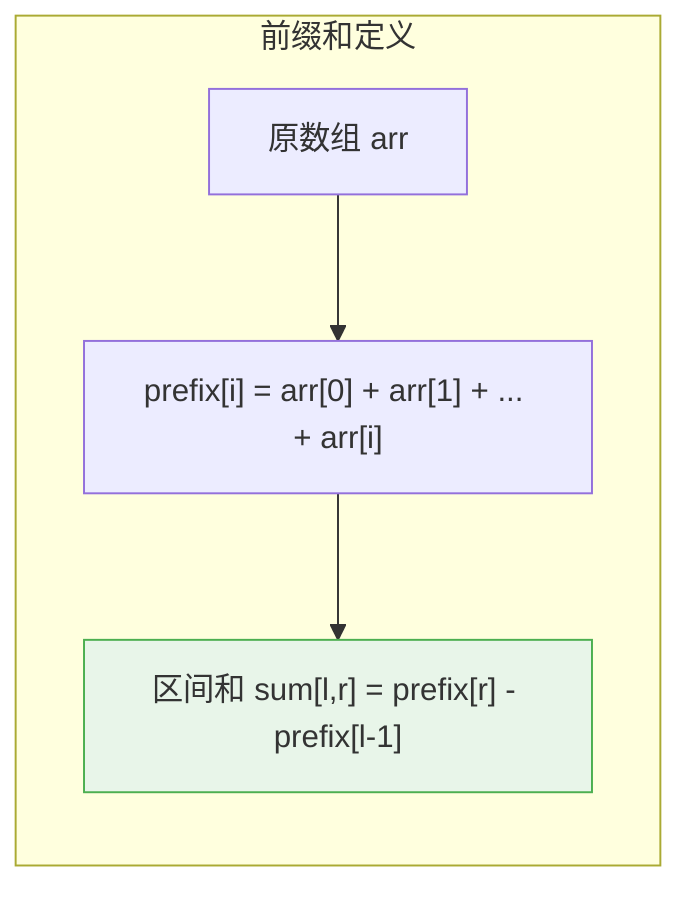
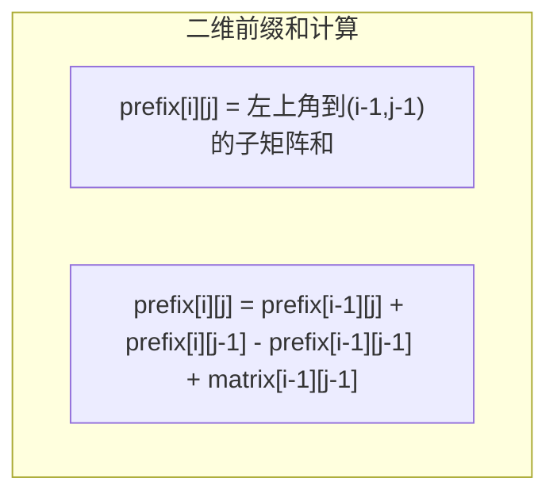
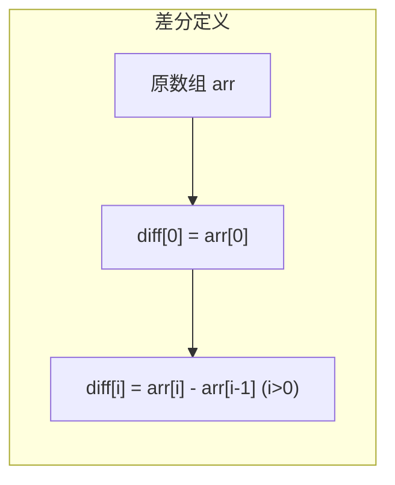
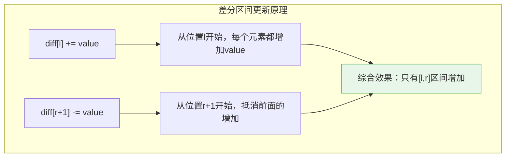
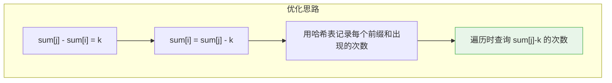
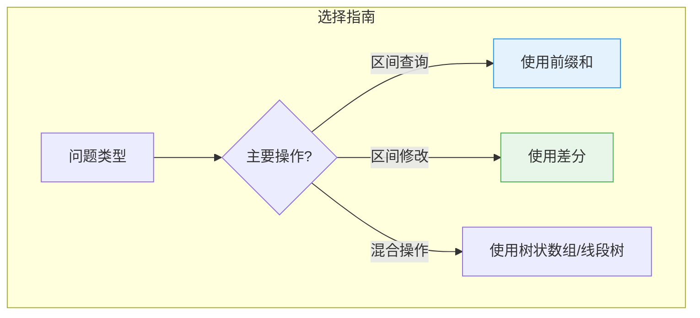
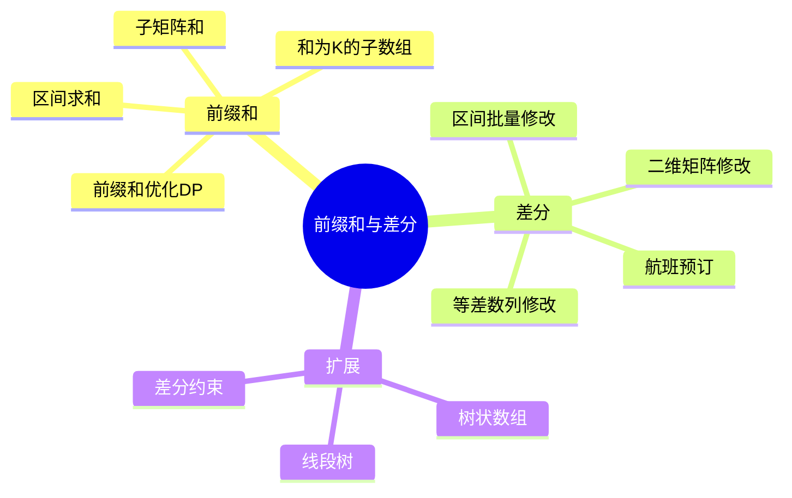

# 前缀和与差分

## 概述

前缀和与差分是一对**互为逆运算**的重要技巧，它们将区间操作的时间复杂度从 O(n) 降低到 O(1)：

<div style="background-color: #E3F2FD; padding: 15px; margin: 10px 0; border-left: 4px solid #2196F3; border-radius: 5px;">
    <strong>核心思想</strong>
    <ul style="margin: 5px 0;">
        <li><strong>前缀和</strong>：预处理后 O(1) 查询区间和</li>
        <li><strong>差分</strong>：O(1) 进行区间修改，最后 O(n) 还原</li>
        <li><strong>互逆关系</strong>：前缀和的差分是原数组，差分的前缀和是原数组</li>
    </ul>
</div>

!!! note "生活类比"
    想象银行账单：前缀和就像"累计余额"——从开户到某天的总存款；差分就像"每日变动"——每天存取的金额。知道了累计余额可以算任意时间段的存款（前缀和），知道了每天变动可以快速批量修改（差分）。

## 前缀和

### 一维前缀和

#### 基本原理



```
原数组:     [1,  3,  5,  2,  4,  6]

前缀和计算:
┌─────────────────────────────────────────────────────────────┐
│ prefix[0] = arr[0] = 1                                       │
│ prefix[1] = arr[0] + arr[1] = 1 + 3 = 4                      │
│ prefix[2] = arr[0] + arr[1] + arr[2] = 1 + 3 + 5 = 9         │
│ prefix[3] = 1 + 3 + 5 + 2 = 11                               │
│ prefix[4] = 1 + 3 + 5 + 2 + 4 = 15                           │
│ prefix[5] = 1 + 3 + 5 + 2 + 4 + 6 = 21                       │
└─────────────────────────────────────────────────────────────┘

前缀和数组: [1,  4,  9,  11, 15, 21]

索引:        0   1   2   3    4   5

可视化:
┌─────────────────────────────────────────────────────────────┐
│ 索引  0   1   2   3   4   5                                  │
│ arr   1   3   5   2   4   6                                  │
│ pref  1   4   9  11  15  21                                  │
│      └─┘ └──┘ └───┘ └───┘ └───┘                             │
│       1   4    9   11   15                                   │
└─────────────────────────────────────────────────────────────┘
```

#### 区间和查询

```
查询区间 [1, 3] 的和 = arr[1] + arr[2] + arr[3] = 3 + 5 + 2 = 10

使用前缀和:
  sum[1,3] = prefix[3] - prefix[0] = 11 - 1 = 10 ✓

图示:
┌─────────────────────────────────────────────────────────────┐
│ prefix[3] = arr[0] + arr[1] + arr[2] + arr[3]               │
│ prefix[0] = arr[0]                                           │
│ prefix[3] - prefix[0] = arr[1] + arr[2] + arr[3]             │
└─────────────────────────────────────────────────────────────┘

通用公式:
  sum[l, r] = prefix[r] - prefix[l-1]
  
  特殊情况: 当 l = 0 时，sum[0, r] = prefix[r]
```

#### 代码实现

```c
#include <stdio.h>
#include <stdlib.h>

// 构建前缀和数组（带哨兵）
int* createPrefix(int arr[], int n) {
    int *prefix = (int*)malloc(sizeof(int) * (n + 1));
    prefix[0] = 0;  // 哨兵，简化边界处理
    
    for (int i = 0; i < n; i++) {
        prefix[i + 1] = prefix[i] + arr[i];
    }
    
    return prefix;
}

// 查询区间和
int querySum(int prefix[], int l, int r) {
    return prefix[r + 1] - prefix[l];
}

// 打印数组和前缀和
void printPrefix(int arr[], int n, int prefix[]) {
    printf("原数组:   ");
    for (int i = 0; i < n; i++) {
        printf("%3d ", arr[i]);
    }
    printf("\n");
    
    printf("前缀和: 0 ");
    for (int i = 0; i < n; i++) {
        printf("%3d ", prefix[i + 1]);
    }
    printf("\n");
}

int main() {
    int arr[] = {1, 3, 5, 2, 4, 6};
    int n = sizeof(arr) / sizeof(arr[0]);
    
    int *prefix = createPrefix(arr, n);
    
    printf("前缀和演示:\n\n");
    printPrefix(arr, n, prefix);
    
    printf("\n区间查询:\n");
    printf("sum[1,3] = %d (应为 3+5+2=10)\n", querySum(prefix, 1, 3));
    printf("sum[0,2] = %d (应为 1+3+5=9)\n", querySum(prefix, 0, 2));
    printf("sum[2,5] = %d (应为 5+2+4+6=17)\n", querySum(prefix, 2, 5));
    
    free(prefix);
    return 0;
}
```

### 二维前缀和

#### 原理推导



```
矩阵:        前缀和:
┌───┬───┬───┐    ┌───┬───┬───┬───┐
│ 1 │ 2 │ 3 │    │ 0 │ 0 │ 0 │ 0 │
├───┼───┼───┤    ├───┼───┼───┼───┤
│ 4 │ 5 │ 6 │ →  │ 0 │ 1 │ 3 │ 6 │
├───┼───┼───┤    ├───┼───┼───┼───┤
│ 7 │ 8 │ 9 │    │ 0 │ 5 │12 │21 │
└───┴───┴───┘    ├───┼───┼───┼───┤
                 │ 0 │12 │27 │45 │
                 └───┴───┴───┴───┘

计算 prefix[2][2] (左上到(1,1)的和 = 1+2+4+5 = 12):
┌─────────────────────────────────────────────────────────────┐
│ prefix[2][2] = prefix[1][2] + prefix[2][1] - prefix[1][1]   │
│              + matrix[1][1]                                 │
│             = 3 + 5 - 1 + 5 = 12 ✓                          │
└─────────────────────────────────────────────────────────────┘

图示 (容斥原理):
        ┌───────────┬───┐
        │ prefix    │   │
        │ [i-1][j]  │   │
        ├───────────┼───┤
        │ prefix    │ * │ ← prefix[i][j]
        │ [i][j-1]  │   │
        └───────────┴───┘
        
公式: prefix[i][j] = prefix[i-1][j] + prefix[i][j-1] 
                       - prefix[i-1][j-1] + matrix[i-1][j-1]
```

#### 子矩阵和查询

```
查询子矩阵 (x1,y1) 到 (x2,y2) 的和:

图示:
        y1      y2
    ┌───┬───────┬───┐
    │   │       │   │
 x1 ├───┼───────┼───┤
    │   │  ???  │   │ ← 要求的区域
 x2 ├───┼───────┼───┤
    │   │       │   │
    └───┴───────┴───┘

公式:
  sum(x1,y1,x2,y2) = prefix[x2+1][y2+1] 
                   - prefix[x1][y2+1] 
                   - prefix[x2+1][y1] 
                   + prefix[x1][y1]
```

```c
// 二维前缀和
void prefixSum2D(int matrix[][100], int m, int n, int prefix[][101]) {
    // 初始化边界
    for (int i = 0; i <= m; i++) prefix[i][0] = 0;
    for (int j = 0; j <= n; j++) prefix[0][j] = 0;
    
    // 计算前缀和
    for (int i = 1; i <= m; i++) {
        for (int j = 1; j <= n; j++) {
            prefix[i][j] = matrix[i - 1][j - 1] 
                         + prefix[i - 1][j] 
                         + prefix[i][j - 1] 
                         - prefix[i - 1][j - 1];
        }
    }
}

// 查询子矩阵和
int rangeSum2D(int prefix[][101], int x1, int y1, int x2, int y2) {
    return prefix[x2 + 1][y2 + 1] 
         - prefix[x1][y2 + 1] 
         - prefix[x2 + 1][y1] 
         + prefix[x1][y1];
}
```

## 差分

### 一维差分

#### 基本原理



```
原数组:     [1,  3,  6,  10, 15]

差分计算:
┌─────────────────────────────────────────────────────────────┐
│ diff[0] = arr[0] = 1                                         │
│ diff[1] = arr[1] - arr[0] = 3 - 1 = 2                        │
│ diff[2] = arr[2] - arr[1] = 6 - 3 = 3                        │
│ diff[3] = arr[3] - arr[2] = 10 - 6 = 4                       │
│ diff[4] = arr[4] - arr[3] = 15 - 10 = 5                      │
└─────────────────────────────────────────────────────────────┘

差分数组: [1,  2,  3,  4,  5]

从差分还原原数组（前缀和）:
┌─────────────────────────────────────────────────────────────┐
│ arr[0] = diff[0] = 1                                         │
│ arr[1] = arr[0] + diff[1] = 1 + 2 = 3                        │
│ arr[2] = arr[1] + diff[2] = 3 + 3 = 6                        │
│ arr[3] = arr[2] + diff[3] = 6 + 4 = 10                       │
│ arr[4] = arr[3] + diff[4] = 10 + 5 = 15                      │
└─────────────────────────────────────────────────────────────┘
```

#### 区间更新

<div style="background-color: #F3E5F5; padding: 15px; margin: 10px 0; border-left: 4px solid #9C27B0; border-radius: 5px;">
    <strong>差分的核心应用：O(1) 区间更新</strong>
    <p>对区间 [l, r] 所有元素加上 value：</p>
    <p><code>diff[l] += value</code></p>
    <p><code>diff[r+1] -= value</code></p>
</div>

```
原数组: [0, 0, 0, 0, 0]
差分:   [0, 0, 0, 0, 0, 0]  (多一位处理边界)

操作: 对区间 [1, 3] 每个元素 +5

差分更新:
┌─────────────────────────────────────────────────────────────┐
│ diff[1] += 5  →  diff[1] = 5                                │
│ diff[4] -= 5  →  diff[4] = -5  (r+1=3+1=4)                  │
└─────────────────────────────────────────────────────────────┘

差分数组: [0, 5, 0, 0, -5, 0]

还原原数组（前缀和）:
┌─────────────────────────────────────────────────────────────┐
│ arr[0] = 0                                                   │
│ arr[1] = 0 + 5 = 5                                           │
│ arr[2] = 5 + 0 = 5                                           │
│ arr[3] = 5 + 0 = 5                                           │
│ arr[4] = 5 + (-5) = 0                                        │
└─────────────────────────────────────────────────────────────┘

结果: [0, 5, 5, 5, 0]  ✓ 区间 [1,3] 都加了5
```



#### 代码实现

```c
#include <stdio.h>
#include <stdlib.h>

// 创建差分数组
void createDifference(int arr[], int n, int diff[]) {
    diff[0] = arr[0];
    for (int i = 1; i < n; i++) {
        diff[i] = arr[i] - arr[i - 1];
    }
}

// 区间更新：对 [l, r] 区间每个元素加 value
void rangeUpdate(int diff[], int l, int r, int value, int n) {
    diff[l] += value;
    if (r + 1 < n) {
        diff[r + 1] -= value;
    }
}

// 从差分数组还原原数组
void recoverArray(int diff[], int n, int arr[]) {
    arr[0] = diff[0];
    for (int i = 1; i < n; i++) {
        arr[i] = arr[i - 1] + diff[i];
    }
}

// 批量区间更新
int* batchUpdate(int n, int updates[][3], int m) {
    int *diff = (int*)calloc(n + 1, sizeof(int));
    
    printf("批量区间更新:\n");
    
    for (int i = 0; i < m; i++) {
        int l = updates[i][0];
        int r = updates[i][1];
        int value = updates[i][2];
        
        printf("  操作 %d: [%d, %d] + %d\n", i + 1, l, r, value);
        
        diff[l] += value;
        diff[r + 1] -= value;
    }
    
    // 还原
    int *result = (int*)malloc(sizeof(int) * n);
    result[0] = diff[0];
    for (int i = 1; i < n; i++) {
        result[i] = result[i - 1] + diff[i];
    }
    
    free(diff);
    return result;
}

int main() {
    int n = 6;
    int diff[7] = {0};  // 初始化为0
    
    printf("初始数组: [0, 0, 0, 0, 0, 0]\n\n");
    
    // 区间更新操作
    rangeUpdate(diff, 1, 3, 5, n);
    printf("操作1: [1,3] + 5\n");
    
    rangeUpdate(diff, 2, 5, 3, n);
    printf("操作2: [2,5] + 3\n");
    
    // 还原数组
    int arr[6];
    recoverArray(diff, n, arr);
    
    printf("\n差分数组: ");
    for (int i = 0; i < n; i++) printf("%d ", diff[i]);
    printf("\n");
    
    printf("结果数组: ");
    for (int i = 0; i < n; i++) printf("%d ", arr[i]);
    printf("\n");
    
    return 0;
}
```

### 二维差分

#### 原理

```
二维差分更新：对子矩阵 (x1,y1) 到 (x2,y2) 每个元素加 value

差分更新公式:
┌─────────────────────────────────────────────────────────────┐
│ diff[x1][y1]     += value                                   │
│ diff[x2+1][y1]   -= value                                   │
│ diff[x1][y2+1]   -= value                                   │
│ diff[x2+1][y2+1] += value                                   │
└─────────────────────────────────────────────────────────────┘

图示:
        y1          y2+1
    ┌───┬───────────┬───┐
    │   │           │   │
 x1 ├───┼───────────┼───┤
    │ + │           │ - │
    │   │           │   │
x2+1├───┼───────────┼───┤
    │ - │           │ + │
    └───┴───────────┴───┘
```

```c
// 二维差分更新
void diff2DUpdate(int diff[][101], int x1, int y1, int x2, int y2, int value) {
    diff[x1][y1] += value;
    diff[x2 + 1][y1] -= value;
    diff[x1][y2 + 1] -= value;
    diff[x2 + 1][y2 + 1] += value;
}

// 还原二维数组
void recover2D(int diff[][101], int m, int n, int result[][100]) {
    for (int i = 1; i <= m; i++) {
        for (int j = 1; j <= n; j++) {
            diff[i][j] += diff[i - 1][j] + diff[i][j - 1] - diff[i - 1][j - 1];
            result[i - 1][j - 1] = diff[i][j];
        }
    }
}
```

## 经典应用

### 1. 和为K的子数组

```
问题: 找出数组中和为K的连续子数组个数

暴力解法: O(n²)
优化解法: 前缀和 + 哈希表 O(n)
```



```c
int subarraySum(int nums[], int n, int k) {
    int count = 0;
    int sum = 0;
    
    // 哈希表：记录前缀和出现的次数
    // 这里简化实现，实际应用用真正的哈希表
    int *hashMap = (int*)calloc(20001, sizeof(int));
    hashMap[10000] = 1;  // 初始：前缀和为0出现1次
    
    for (int i = 0; i < n; i++) {
        sum += nums[i];
        
        // 查找 sum - k 出现的次数
        int target = sum - k + 10000;
        if (target >= 0 && target <= 20000) {
            count += hashMap[target];
        }
        
        // 记录当前前缀和
        hashMap[sum + 10000]++;
    }
    
    free(hashMap);
    return count;
}
```

### 2. 航班预订统计

```c
// 每个预订 [first, last, seats] 表示预订 first 到 last 航班的 seats 个座位
int* corpFlightBookings(int bookings[][3], int m, int n, int *returnSize) {
    int *diff = (int*)calloc(n + 2, sizeof(int));
    
    printf("航班预订:\n");
    
    for (int i = 0; i < m; i++) {
        int first = bookings[i][0];
        int last = bookings[i][1];
        int seats = bookings[i][2];
        
        printf("  预订 %d: 航班 %d-%d, %d 个座位\n", 
               i + 1, first, last, seats);
        
        // 差分更新
        diff[first] += seats;
        diff[last + 1] -= seats;
    }
    
    // 还原
    int *result = (int*)malloc(sizeof(int) * n);
    *returnSize = n;
    
    result[0] = diff[1];
    for (int i = 1; i < n; i++) {
        result[i] = result[i - 1] + diff[i + 1];
    }
    
    free(diff);
    return result;
}
```

### 3. 等差数列修改

```c
// 对区间 [l, r] 进行等差数列修改：arr[i] += start + (i - l) * step
// 使用二阶差分
void arithmeticUpdate(int diff[], int diff2[], int l, int r, int start, int step) {
    // 一阶差分
    diff[l] += start;
    diff[r + 1] -= start + (r - l) * step;
    
    // 二阶差分（处理 step）
    if (step != 0) {
        diff2[l + 1] += step;
        diff2[r + 1] -= step;
    }
}
```

## 复杂度分析

### 时间复杂度

| 操作 | 暴力方法 | 前缀和 | 差分 |
|------|----------|--------|------|
| 预处理 | - | O(n) | O(n) |
| 单次区间查询 | O(n) | O(1) | - |
| 单次区间更新 | O(n) | - | O(1) |
| 还原数组 | - | - | O(n) |

### 空间复杂度

- 一维前缀和/差分：O(n)
- 二维前缀和/差分：O(m × n)

## 前缀和 vs 差分选择



<div style="background-color: #E8F5E9; padding: 15px; margin: 10px 0; border-left: 4px solid #4CAF50; border-radius: 5px;">
    <strong>使用场景</strong>
    <p><strong>前缀和</strong>：大量区间求和查询，少量修改</p>
    <p><strong>差分</strong>：大量区间修改，最后一次性查询</p>
    <p><strong>树状数组/线段树</strong>：查询和修改都很频繁</p>
</div>

## C++ 封装

```cpp
#include <vector>

class PrefixSum {
private:
    std::vector<long long> prefix;
    
public:
    PrefixSum(const std::vector<int>& arr) {
        prefix.resize(arr.size() + 1);
        prefix[0] = 0;
        for (size_t i = 0; i < arr.size(); i++) {
            prefix[i + 1] = prefix[i] + arr[i];
        }
    }
    
    // 查询区间 [l, r] 的和
    long long query(int l, int r) {
        return prefix[r + 1] - prefix[l];
    }
    
    // 查询前 k 个元素的和
    long long prefixSum(int k) {
        return prefix[k + 1];
    }
};

class Difference {
private:
    std::vector<int> diff;
    
public:
    Difference(int n) : diff(n + 1, 0) {}
    
    // 对区间 [l, r] 每个元素加 value
    void update(int l, int r, int value) {
        diff[l] += value;
        if (r + 1 < (int)diff.size()) {
            diff[r + 1] -= value;
        }
    }
    
    // 获取最终结果
    std::vector<int> getResult() {
        std::vector<int> result(diff.size() - 1);
        result[0] = diff[0];
        for (size_t i = 1; i < result.size(); i++) {
            result[i] = result[i - 1] + diff[i];
        }
        return result;
    }
};
```

## 应用场景总结



## 参考资料

- 《算法竞赛入门经典》前缀和章节
- 《数据结构与算法分析》第7章
- [Prefix Sum - Wikipedia](https://en.wikipedia.org/wiki/Prefix_sum)
