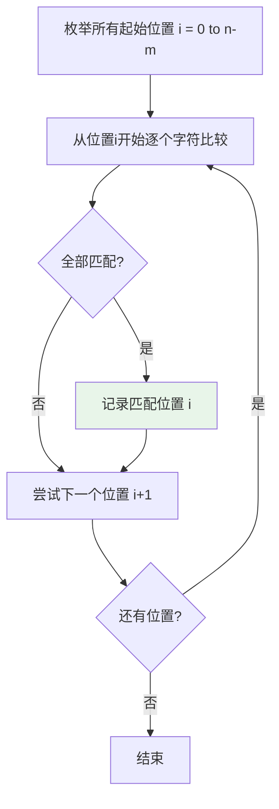
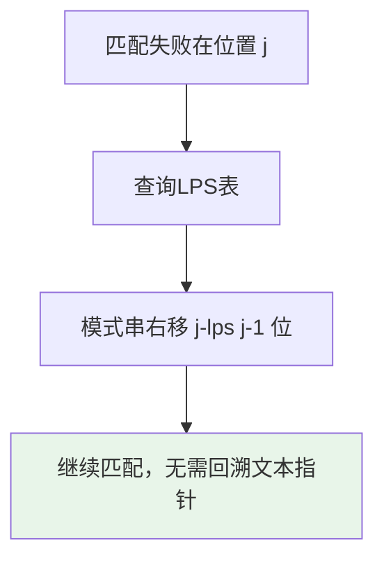
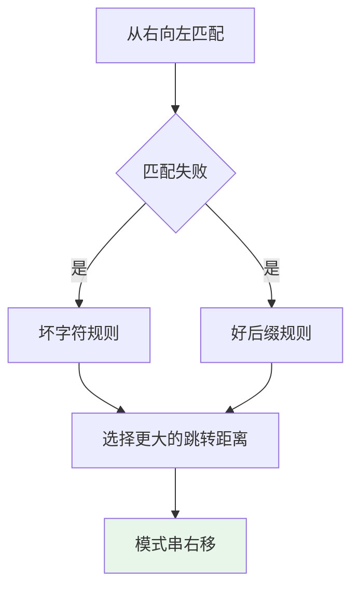
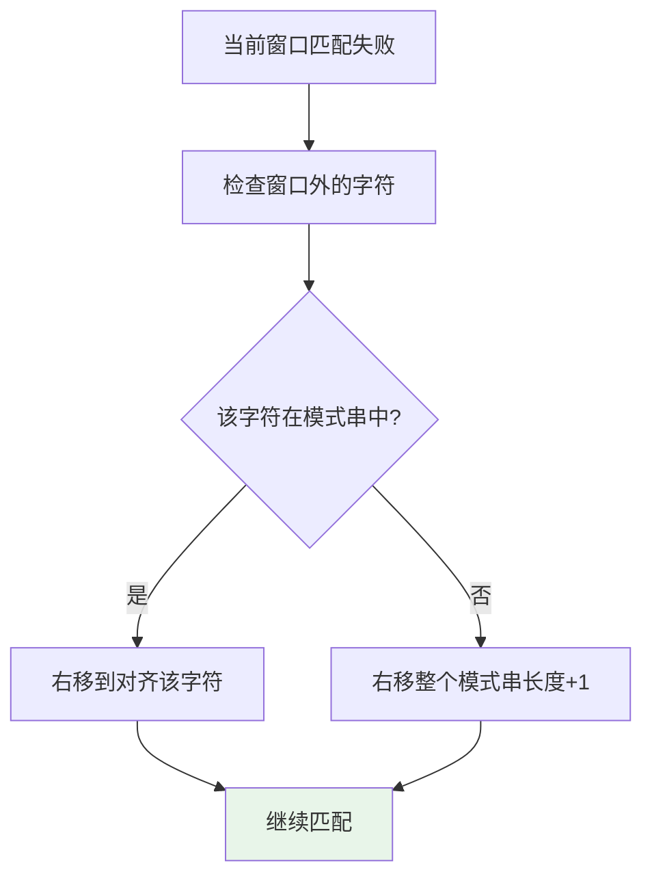
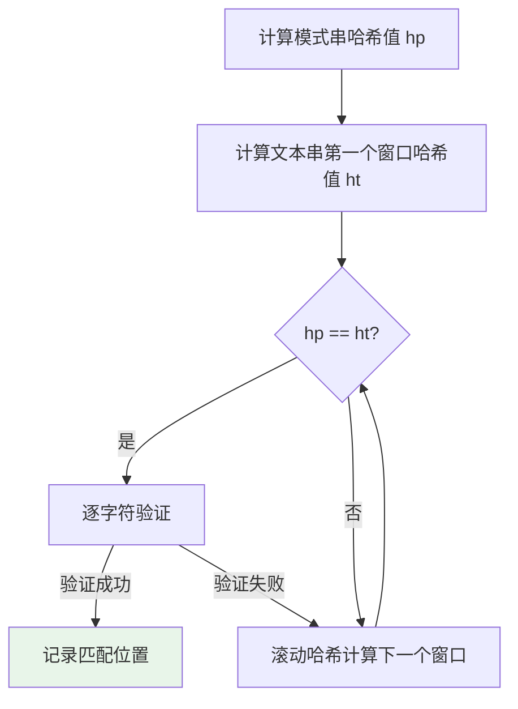
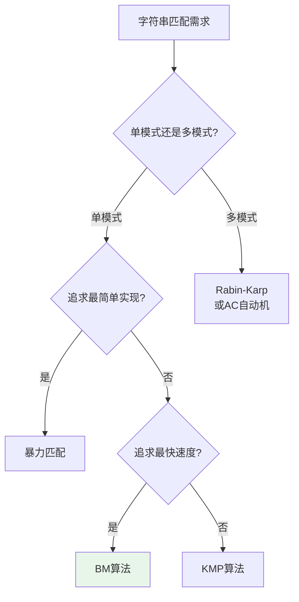

# 字符串匹配算法

## 概述

字符串匹配（String Matching）是在文本串T中查找模式串P所有出现位置的问题。这是计算机科学中最基本、最重要的问题之一，广泛应用于文本编辑、搜索引擎、生物信息学等领域。

!!! note "字符串匹配的重要性"
    字符串匹配是许多应用的核心操作：文本编辑器的查找替换、搜索引擎的关键词匹配、DNA序列分析、入侵检测系统的模式匹配等。高效的字符串匹配算法对性能至关重要。

## 问题定义

```
输入:
- 文本串 T[0..n-1]，长度为n
- 模式串 P[0..m-1]，长度为m (m ≤ n)

输出:
- 模式串在文本串中所有出现的起始位置
- 或判断模式串是否存在于文本串中

示例:
T = "ABABCABCAB"
P = "ABC"

匹配位置: 2, 5
       T: ABABCABCAB
          ^^^   ^^^
          2     5
```

## 暴力匹配算法

### 算法思想

暴力匹配（Brute Force）是最直观的方法：尝试文本串的每个可能起始位置，逐个字符比较。



### 可视化演示

```
文本串 T: ABABCABCAB (n=10)
模式串 P: ABC (m=3)

┌─────────────────────────────────────────────────────┐
│ 暴力匹配过程                                        │
└─────────────────────────────────────────────────────┘

i=0: T[0..2] = "ABA" vs P = "ABC"
     A B A B C A B C A B
     ↑ ↑ ↑
     A B C
     第3个字符不匹配 (A ≠ C)，i++

i=1: T[1..3] = "BAB" vs P = "ABC"
     A B A B C A B C A B
       ↑ ↑ ↑
       A B C
     第1个字符不匹配 (B ≠ A)，i++

i=2: T[2..4] = "ABC" vs P = "ABC"
     A B A B C A B C A B
         ↑ ↑ ↑
         A B C
     全部匹配！记录位置 2

i=3: T[3..5] = "BCA" vs P = "ABC"
     A B A B C A B C A B
           ↑ ↑ ↑
           A B C
     第1个字符不匹配 (B ≠ A)，i++

i=4: T[4..6] = "CAB" vs P = "ABC"
     A B A B C A B C A B
             ↑ ↑ ↑
             A B C
     第1个字符不匹配 (C ≠ A)，i++

i=5: T[5..7] = "ABC" vs P = "ABC"
     A B A B C A B C A B
               ↑ ↑ ↑
               A B C
     全部匹配！记录位置 5

i=6: T[6..8] = "BCA" vs P = "ABC"
     第1个字符不匹配

i=7: T[7..9] = "CAB" vs P = "ABC"
     第1个字符不匹配

结果: [2, 5]
```

### 实现

```c
int bruteForce(const char *text, const char *pattern) {
    int n = strlen(text);
    int m = strlen(pattern);
    
    for (int i = 0; i <= n - m; i++) {
        int j;
        for (j = 0; j < m; j++) {
            if (text[i + j] != pattern[j]) {
                break;
            }
        }
        if (j == m) {
            return i;  // 找到匹配
        }
    }
    
    return -1;  // 未找到
}

// 查找所有匹配位置
int* bruteForceFindAll(const char *text, const char *pattern, int *count) {
    int n = strlen(text);
    int m = strlen(pattern);
    
    int *result = (int*)malloc(sizeof(int) * n);
    *count = 0;
    
    for (int i = 0; i <= n - m; i++) {
        int j;
        for (j = 0; j < m; j++) {
            if (text[i + j] != pattern[j]) {
                break;
            }
        }
        if (j == m) {
            result[(*count)++] = i;
        }
    }
    
    return result;
}
```

### 复杂度

| 情况 | 时间复杂度 | 说明 |
|------|-----------|------|
| 最好 | O(n) | 第一次就匹配或模式串不匹配 |
| 平均 | O(n+m) | 随机文本 |
| 最坏 | O(nm) | T="AAA...A", P="AAA...B" |

## KMP算法

### 核心思想

KMP（Knuth-Morris-Pratt）算法通过预处理模式串，构建**部分匹配表（LPS）**，在匹配失败时利用已匹配信息，避免回溯。



### 部分匹配表（LPS）

LPS[i] = 模式串P[0..i]的最长相同真前缀和真后缀的长度

```
模式串 P = "ABABAC"

计算LPS过程:
┌─────────────────────────────────────────────────────┐
│ LPS数组计算                                         │
└─────────────────────────────────────────────────────┘

i=0: P[0..0] = "A"
     真前缀: 无
     真后缀: 无
     LPS[0] = 0

i=1: P[0..1] = "AB"
     真前缀: "A"
     真后缀: "B"
     无匹配, LPS[1] = 0

i=2: P[0..2] = "ABA"
     真前缀: "A", "AB"
     真后缀: "BA", "A"
     最长匹配: "A", 长度=1
     LPS[2] = 1

i=3: P[0..3] = "ABAB"
     真前缀: "A", "AB", "ABA"
     真后缀: "BAB", "AB", "B"
     最长匹配: "AB", 长度=2
     LPS[3] = 2

i=4: P[0..4] = "ABABA"
     真前缀: "A", "AB", "ABA", "ABAB"
     真后缀: "BABA", "ABA", "BA", "A"
     最长匹配: "ABA", 长度=3
     LPS[4] = 3

i=5: P[0..5] = "ABABAC"
     真前缀: "A", "AB", "ABA", "ABAB", "ABABA"
     真后缀: "BABAC", "ABAC", "BAC", "AC", "C"
     无匹配, LPS[5] = 0

LPS数组: [0, 0, 1, 2, 3, 0]
```

### LPS的意义

```
匹配失败时如何利用LPS:

假设匹配到 P[j] 时失败:
P: A B A B A C
T: A B A B A B ...
         ↑
       失败在 j=5

已匹配部分: "ABABA"
LPS[4] = 3, 说明 "ABABA" 的最长相同前后缀是 "ABA"

因此:
- "ABABA" 的前3个字符 "ABA" = 后3个字符 "ABA"
- 可以直接将模式串右移，让前缀对齐到后缀位置
- 不需要重新比较已经匹配的部分

新的比较位置: j = LPS[4] = 3
```

### KMP匹配过程

```
文本串 T: ABABABAC
模式串 P: ABABAC (LPS=[0,0,1,2,3,0])

┌─────────────────────────────────────────────────────┐
│ KMP匹配过程                                         │
└─────────────────────────────────────────────────────┘

初始: i=0, j=0

Step 1-4: 匹配成功
     T: A B A B A B A C
        ↑ ↑ ↑ ↑ ↑
        A B A B A C
        j=0,1,2,3,4

Step 5: T[4]=A vs P[4]=A, 匹配
        i=5, j=5
        
Step 6: T[5]=B vs P[5]=C, 不匹配！
        j = LPS[5-1] = LPS[4] = 3
        模式串右移 5-3=2 位
        
     T: A B A B A B A C
              ↑ ↑ ↑
              A B A B A C
              j=3

Step 7-9: 继续匹配
     T: A B A B A B A C
              ↑ ↑ ↑ ↑ ↑ ↑
              A B A B A C
              j=3,4,5,6

匹配成功！位置 = i - j = 7 - 6 = 1... 实际上
更正：位置 = i - m = 7 - 6 = 1
```

### 实现

```c
// 计算LPS数组
void computeLPS(const char *pattern, int *lps) {
    int m = strlen(pattern);
    int len = 0;    // 当前最长相同前后缀长度
    lps[0] = 0;     // LPS[0]总是0
    int i = 1;
    
    while (i < m) {
        if (pattern[i] == pattern[len]) {
            // 可以扩展相同前后缀
            len++;
            lps[i] = len;
            i++;
        } else {
            if (len != 0) {
                // 回退到更短的相同前后缀
                len = lps[len - 1];
            } else {
                // 没有相同前后缀
                lps[i] = 0;
                i++;
            }
        }
    }
}

// KMP搜索
int kmpSearch(const char *text, const char *pattern) {
    int n = strlen(text);
    int m = strlen(pattern);
    
    if (m == 0) return 0;
    if (n < m) return -1;
    
    int *lps = (int*)malloc(sizeof(int) * m);
    computeLPS(pattern, lps);
    
    int i = 0;  // 文本串指针
    int j = 0;  // 模式串指针
    
    while (i < n) {
        if (pattern[j] == text[i]) {
            i++;
            j++;
        }
        
        if (j == m) {
            free(lps);
            return i - j;  // 找到匹配
        } else if (i < n && pattern[j] != text[i]) {
            if (j != 0) {
                j = lps[j - 1];  // 利用LPS跳转
            } else {
                i++;  // 完全不匹配，前进一步
            }
        }
    }
    
    free(lps);
    return -1;
}
```

### 复杂度

| 阶段 | 时间复杂度 | 说明 |
|------|-----------|------|
| 预处理 | O(m) | 计算LPS数组 |
| 匹配 | O(n) | 每个字符最多访问常数次 |
| 总计 | O(n+m) | 线性时间 |

## BM算法

### 核心思想

Boyer-Moore算法从右向左匹配，利用**坏字符规则**和**好后缀规则**进行跳转，实践中通常是最快的字符串匹配算法。



### 坏字符规则

```
坏字符规则:
匹配失败时，文本串中导致失败的字符称为"坏字符"

如果坏字符在模式串中存在:
  右移 = 坏字符在模式串中的位置 - 坏字符在模式串中最右出现位置

如果坏字符在模式串中不存在:
  右移 = 整个模式串长度

示例:
T: A B C A B D
P: A B D

从右向左匹配:
P[2]=D vs T[2]=C, 不匹配
坏字符 = 'C'

'C' 不在模式串中，右移3位

T: A B C A B D
P:       A B D

继续匹配...
```

### 实现

```c
// 坏字符启发式预处理
void badCharHeuristic(const char *pattern, int m, int badChar[256]) {
    // 初始化为-1
    for (int i = 0; i < 256; i++) {
        badChar[i] = -1;
    }
    
    // 记录每个字符在模式串中最右出现的位置
    for (int i = 0; i < m; i++) {
        badChar[(unsigned char)pattern[i]] = i;
    }
}

// BM搜索
int bmSearch(const char *text, const char *pattern) {
    int n = strlen(text);
    int m = strlen(pattern);
    
    int badChar[256];
    badCharHeuristic(pattern, m, badChar);
    
    int s = 0;  // 模式串相对于文本串的偏移
    while (s <= n - m) {
        int j = m - 1;  // 从右向左匹配
        
        // 匹配时j递减
        while (j >= 0 && pattern[j] == text[s + j]) {
            j--;
        }
        
        if (j < 0) {
            return s;  // 找到匹配
        } else {
            // 坏字符跳转
            int bcShift = j - badChar[(unsigned char)text[s + j]];
            s += (bcShift > 1) ? bcShift : 1;
        }
    }
    
    return -1;
}
```

### 复杂度

| 情况 | 时间复杂度 | 说明 |
|------|-----------|------|
| 最好 | O(n/m) | 每次跳过整个模式串 |
| 平均 | O(n) | 实践中通常很快 |
| 最坏 | O(nm) | 特殊构造的输入 |

## Sunday算法

### 核心思想

Sunday算法考虑匹配失败时，文本串中下一个将被匹配的字符（当前窗口外的第一个字符）。



```
Sunday算法示意:

T: A B C A B D A B C
P: A B D

i=0: 比较T[0..2]与P[0..2]
     T: A B C A B D A B C
        ↑ ↑ ↑
        A B D
        
     T[2]='C' ≠ P[2]='D', 不匹配
     窗口外的字符: T[3]='A'
     
     'A' 在模式串中的位置: 0
     右移: m - 0 = 3 - 0 = 3
     但实际右移: m + 1 - shift['A'] = 3 + 1 - 3 = 1
     
     更正: shift[c] = m - i (i是c在P中最后出现位置)
           如果c不在P中, shift[c] = m + 1
```

### 实现

```c
// Sunday预处理
void sundayHeuristic(const char *pattern, int m, int shift[256]) {
    // 初始化为m+1（字符不在模式串中）
    for (int i = 0; i < 256; i++) {
        shift[i] = m + 1;
    }
    
    // 计算每个字符的跳转距离
    for (int i = 0; i < m; i++) {
        shift[(unsigned char)pattern[i]] = m - i;
    }
}

int sundaySearch(const char *text, const char *pattern) {
    int n = strlen(text);
    int m = strlen(pattern);
    
    int shift[256];
    sundayHeuristic(pattern, m, shift);
    
    int i = 0;
    while (i <= n - m) {
        int j;
        for (j = 0; j < m; j++) {
            if (text[i + j] != pattern[j]) {
                break;
            }
        }
        
        if (j == m) {
            return i;  // 找到匹配
        }
        
        // 检查窗口外的字符
        if (i + m >= n) break;
        
        // 根据窗口外字符跳转
        i += shift[(unsigned char)text[i + m]];
    }
    
    return -1;
}
```

## Rabin-Karp算法

### 核心思想

使用**滚动哈希**将模式串和文本串的子串映射为数值，通过比较哈希值快速判断是否可能匹配。



### 滚动哈希

```
滚动哈希原理:

使用多项式哈希: H(s) = s[0]*d^(m-1) + s[1]*d^(m-2) + ... + s[m-1]*d^0 (mod q)

从位置i到位置i+1的滚动:
H(T[i+1..i+m]) = d * (H(T[i..i+m-1]) - T[i]*d^(m-1)) + T[i+m] (mod q)

示例:
T = "ABCD", P = "BCD"
d = 256, q = 101

H("BCD") = (66*256^2 + 67*256 + 68) mod 101
         = (66*65536 + 67*256 + 68) mod 101
         = (4325376 + 17152 + 68) mod 101
         = 4342596 mod 101
         = 95

滚动计算H("ABC") -> H("BCD"):
H("BCD") = 256 * (H("ABC") - 65*256^2) + 68 (mod 101)
```

### 实现

```c
int rabinKarp(const char *text, const char *pattern) {
    int n = strlen(text);
    int m = strlen(pattern);
    int d = 256;   // 字符集大小
    int q = 101;   // 质数模数
    
    // 计算 h = d^(m-1) mod q
    int h = 1;
    for (int i = 0; i < m - 1; i++) {
        h = (h * d) % q;
    }
    
    // 计算模式串和第一个窗口的哈希值
    int p = 0;  // 模式串哈希
    int t = 0;  // 文本串窗口哈希
    
    for (int i = 0; i < m; i++) {
        p = (d * p + pattern[i]) % q;
        t = (d * t + text[i]) % q;
    }
    
    // 滑动窗口
    for (int i = 0; i <= n - m; i++) {
        // 哈希值匹配，验证
        if (p == t) {
            int j;
            for (j = 0; j < m; j++) {
                if (text[i + j] != pattern[j]) {
                    break;
                }
            }
            if (j == m) {
                return i;  // 找到匹配
            }
        }
        
        // 滚动哈希
        if (i < n - m) {
            t = (d * (t - text[i] * h) + text[i + m]) % q;
            if (t < 0) t += q;  // 保证正数
        }
    }
    
    return -1;
}
```

## 算法对比

| 算法 | 预处理 | 匹配时间 | 空间 | 特点 |
|------|--------|---------|------|------|
| 暴力 | O(1) | O(nm) | O(1) | 简单直观 |
| KMP | O(m) | O(n) | O(m) | 无回溯，稳定线性 |
| BM | O(m+σ) | O(n/m)~O(nm) | O(σ) | 实践中最快 |
| Sunday | O(m+σ) | O(n) | O(σ) | 简单高效 |
| Rabin-Karp | O(m) | O(n+m) | O(1) | 多模式匹配 |

其中σ是字符集大小（通常为256）



## C++ 实现

```cpp
#include <string>
#include <vector>

class KMP {
private:
    std::string pattern;
    std::vector<int> lps;
    
    void computeLPS() {
        int m = pattern.length();
        lps.resize(m);
        int len = 0;
        
        for (int i = 1; i < m; i++) {
            while (len > 0 && pattern[i] != pattern[len]) {
                len = lps[len - 1];
            }
            if (pattern[i] == pattern[len]) {
                len++;
            }
            lps[i] = len;
        }
    }
    
public:
    KMP(const std::string& p) : pattern(p) {
        computeLPS();
    }
    
    int search(const std::string& text) {
        int n = text.length();
        int m = pattern.length();
        
        for (int i = 0, j = 0; i < n; i++) {
            while (j > 0 && text[i] != pattern[j]) {
                j = lps[j - 1];
            }
            if (text[i] == pattern[j]) {
                j++;
            }
            if (j == m) {
                return i - m + 1;
            }
        }
        return -1;
    }
    
    std::vector<int> findAll(const std::string& text) {
        std::vector<int> result;
        int n = text.length();
        int m = pattern.length();
        
        for (int i = 0, j = 0; i < n; i++) {
            while (j > 0 && text[i] != pattern[j]) {
                j = lps[j - 1];
            }
            if (text[i] == pattern[j]) {
                j++;
            }
            if (j == m) {
                result.push_back(i - m + 1);
                j = lps[j - 1];  // 继续搜索下一个匹配
            }
        }
        return result;
    }
};
```

## 应用场景

1. **文本编辑器**：查找替换功能
2. **搜索引擎**：关键词匹配与高亮
3. **生物信息学**：DNA/RNA序列分析
4. **入侵检测**：特征码匹配
5. **数据压缩**：LZ系列算法的基础
6. **拼写检查**：近似字符串匹配

## 参考资料

- 《算法导论》第32章 - 字符串匹配
- Knuth, Morris, Pratt (1977). "Fast Pattern Matching in Strings"
- Boyer, Moore (1977). "A Fast String Searching Algorithm"
- [String Matching - Wikipedia](https://en.wikipedia.org/wiki/String-searching_algorithm)
