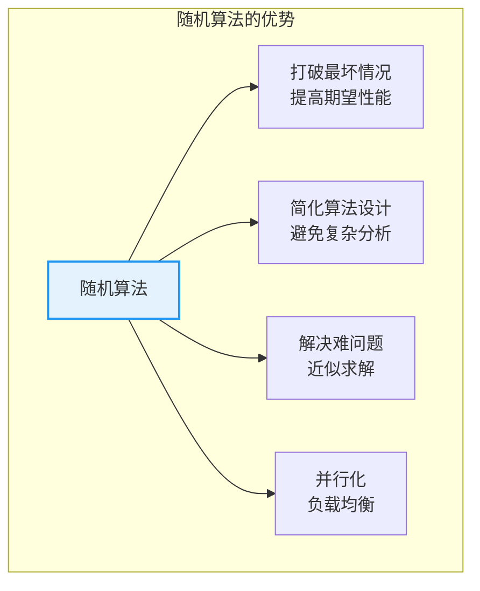
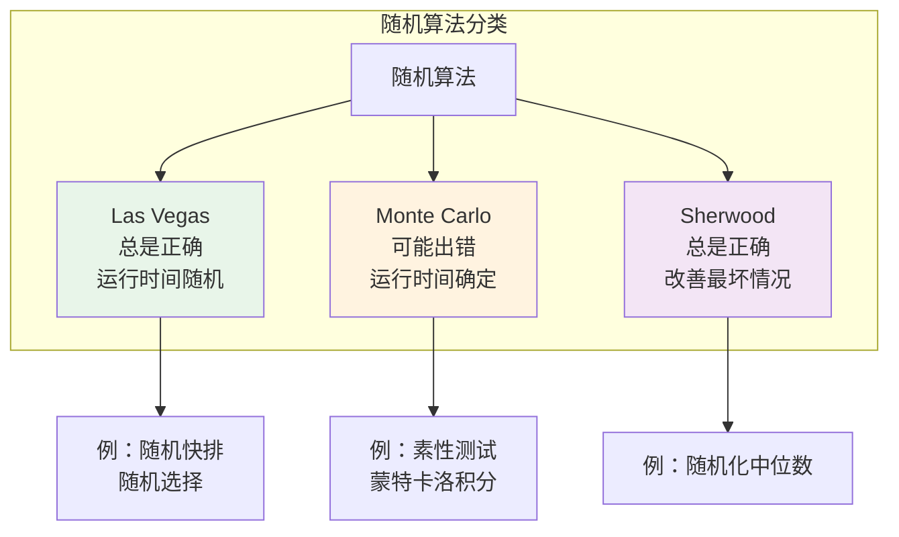
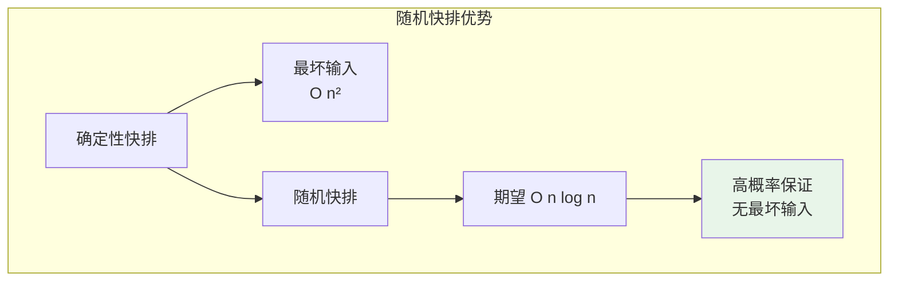
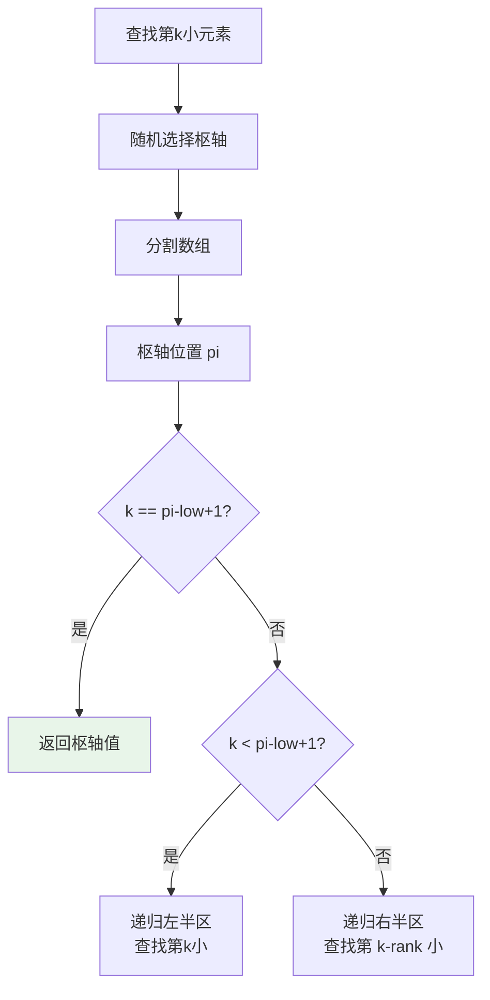
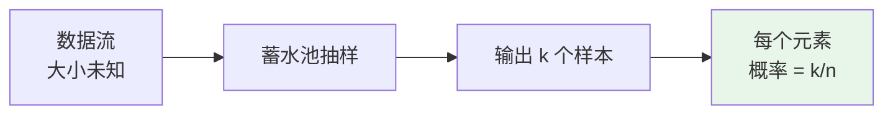
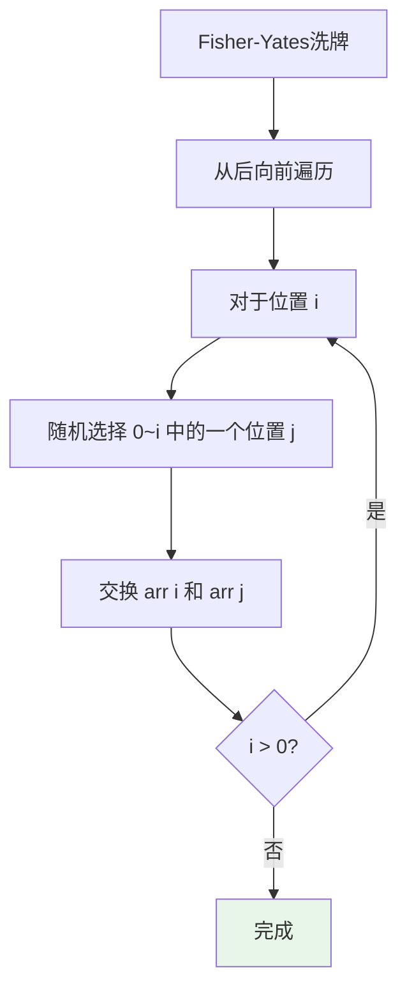
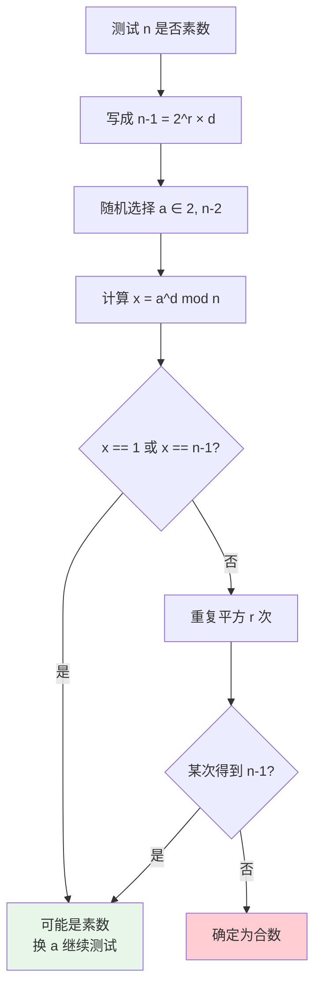
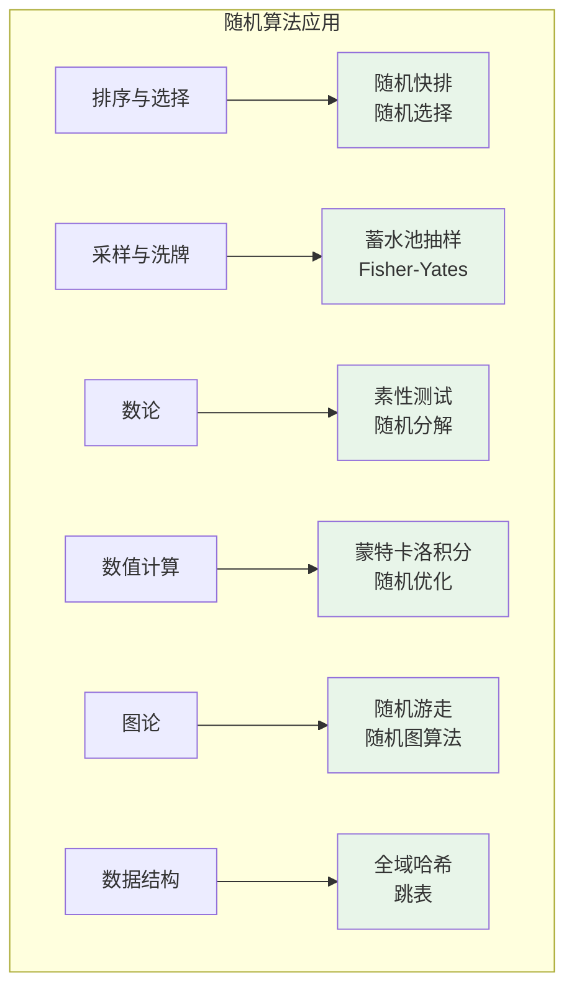

# 随机算法

## 概述

随机算法（Randomized Algorithm）使用随机数作为输入的一部分，可用于提高算法效率、简化算法设计，或解决确定性算法难以解决的问题。随机算法在排序、选择、图论、数值计算等领域有广泛应用。

<div style="background-color: #E3F2FD; border-left: 4px solid #2196F3; padding: 12px; margin: 10px 0;">
<strong>核心思想：</strong>引入随机性可以打破输入的 adversarial 性质，避免最坏情况，从而获得更好的<strong>期望</strong>性能。虽然最坏情况可能仍然存在，但其发生概率很小。
</div>

### 随机算法的重要性



## 随机算法分类

### 三种类型



| 类型 | 正确性 | 运行时间 | 特点 | 示例 |
|------|--------|----------|------|------|
| **Las Vegas** | 总是正确 | 随机 | 可能运行很长时间 | 随机快排、随机选择 |
| **Monte Carlo** | 可能出错 | 确定 | 可以控制错误概率 | 素性测试、MC积分 |
| **Sherwood** | 总是正确 | 随机 | 消除最坏情况 | 随机化算法 |

## 随机快速排序

### 算法思想

传统快速排序在选择枢轴时，如果总是选择第一个或最后一个元素，对于已排序或接近排序的数组会退化到 O(n²)。随机快速排序通过**随机选择枢轴**，打破这种 adversarial 输入。



### 工作原理

```
随机快排的核心：随机选择枢轴

传统快排：
pivot = arr[low]  或  arr[high]
问题：已排序数组总是选择最小/最大元素

随机快排：
random = low + rand % (high - low + 1)
swap(arr[random], arr[high])
pivot = arr[high]
优势：枢轴位置随机，期望分割均匀
```

### 分割过程可视化

```
数组: [3, 1, 4, 1, 5, 9, 2, 6, 5, 3]
      [0, 1, 2, 3, 4, 5, 6, 7, 8, 9]

随机选择枢轴：假设选择索引 5，值 = 9

═══════════════════════════════════════════════════════════════
分割过程
═══════════════════════════════════════════════════════════════

步骤1：交换枢轴到末尾
[3, 1, 4, 1, 5, 3, 2, 6, 5, 9]
                       ↑ 枢轴

步骤2：遍历并分割
i = -1（小于枢轴区域的边界）

j=0: arr[0]=3 < 9, i=0, swap(arr[0],arr[0])
     [3, 1, 4, 1, 5, 3, 2, 6, 5, 9]
     
j=1: arr[1]=1 < 9, i=1, swap(arr[1],arr[1])
     [3, 1, 4, 1, 5, 3, 2, 6, 5, 9]
     
...（类似处理）

j=8: arr[8]=5 < 9, i=8, swap(arr[8],arr[8])
     [3, 1, 4, 1, 5, 3, 2, 6, 5, 9]

步骤3：将枢轴放到正确位置
i=9, swap(arr[9], arr[9])
     [3, 1, 4, 1, 5, 3, 2, 6, 5, 9]
                              ↑ 枢轴位置

结果：枢轴 9 在位置 9，左边都 < 9，右边为空
═══════════════════════════════════════════════════════════════
```

### 实现

```c
#include <stdlib.h>
#include <time.h>

void swap(int *a, int *b) {
    int temp = *a;
    *a = *b;
    *b = temp;
}

int randomPartition(int arr[], int low, int high) {
    // 随机选择枢轴
    int random = low + rand() % (high - low + 1);
    swap(&arr[random], &arr[high]);
    
    int pivot = arr[high];
    int i = low - 1;
    
    for (int j = low; j < high; j++) {
        if (arr[j] <= pivot) {
            swap(&arr[++i], &arr[j]);
        }
    }
    
    swap(&arr[i + 1], &arr[high]);
    return i + 1;
}

void randomQuickSort(int arr[], int low, int high) {
    if (low < high) {
        int pi = randomPartition(arr, low, high);
        randomQuickSort(arr, low, pi - 1);
        randomQuickSort(arr, pi + 1, high);
    }
}
```

### 时间复杂度分析

```
期望时间复杂度：E[T(n)] = O(n log n)

推导：
设 T(n) 为排序 n 个元素的期望时间

T(n) = n + Σ (1/n) × [T(i) + T(n-1-i)]
              i=0 to n-1

     = n + (2/n) × Σ T(i)
                 i=0 to n-1

解得：T(n) = O(n log n)

高概率保证：
Pr[T(n) > c × n log n] < 1/n^k  （对某个常数 c 和任意 k）

即：超过 O(n log n) 的概率指数级减小
```

## 随机选择（第K小元素）

### 算法思想

随机选择算法用于在 O(n) 期望时间内找到数组中第 k 小的元素。与确定性选择算法相比，随机版本更简单且实际运行更快。



### 实现

```c
int randomSelect(int arr[], int low, int high, int k) {
    if (low == high) return arr[low];
    
    int pi = randomPartition(arr, low, high);
    int rank = pi - low + 1;  // 枢轴是第 rank 小
    
    if (k == rank) {
        return arr[pi];
    } else if (k < rank) {
        return randomSelect(arr, low, pi - 1, k);
    } else {
        return randomSelect(arr, pi + 1, high, k - rank);
    }
}
```

### 执行示例

```
数组: [3, 2, 9, 5, 7, 1, 8]
查找第 3 小元素

═══════════════════════════════════════════════════════════════
第1次调用
═══════════════════════════════════════════════════════════════

随机选择枢轴：假设选择 5
分割后：[3, 2, 1, 5, 7, 9, 8]
                  ↑ pi=3

rank = 3 - 0 + 1 = 4
k = 3 < rank = 4
→ 递归左半区 [3, 2, 1]，查找第 3 小

═══════════════════════════════════════════════════════════════
第2次调用
═══════════════════════════════════════════════════════════════

数组: [3, 2, 1]
随机选择枢轴：假设选择 2
分割后：[1, 2, 3]
           ↑ pi=1

rank = 1 - 0 + 1 = 2
k = 3 > rank = 2
→ 递归右半区 [3]，查找第 3-2=1 小

═══════════════════════════════════════════════════════════════
第3次调用
═══════════════════════════════════════════════════════════════

数组: [3]
low = high，返回 arr[0] = 3

结果：第 3 小元素是 3
═══════════════════════════════════════════════════════════════
```

## 蓄水池抽样

### 问题定义

从大小未知的数据流中随机选取 k 个元素，保证每个元素被选中的概率相等。



### 算法思想

```
算法步骤：
1. 前 k 个元素直接放入蓄水池
2. 对于第 i 个元素（i > k）：
   - 以 k/i 的概率决定是否放入蓄水池
   - 如果放入，随机替换蓄水池中的一个元素

正确性证明：
对于第 i 个元素（i > k）：
- 被选中的概率 = k/i
- 在处理第 j 个元素后（j > i）仍留在蓄水池的概率
  = ∏ (1 - 1/j) = i/n
- 最终在蓄水池的概率 = (k/i) × (i/n) = k/n
```

### 实现

```c
void reservoirSample(int stream[], int n, int k, int result[]) {
    // 前 k 个元素直接放入
    for (int i = 0; i < k; i++) {
        result[i] = stream[i];
    }
    
    // 处理剩余元素
    for (int i = k; i < n; i++) {
        // 以 k/(i+1) 的概率选择
        int j = rand() % (i + 1);
        
        // 如果 j < k，替换蓄水池中的第 j 个元素
        if (j < k) {
            result[j] = stream[i];
        }
    }
}
```

### 示例

```
数据流: [1, 2, 3, 4, 5, 6, 7, 8, 9, 10]
k = 3

═══════════════════════════════════════════════════════════════
处理过程
═══════════════════════════════════════════════════════════════

i=0,1,2: 直接放入
蓄水池: [1, 2, 3]

i=3: j = rand() % 4, 假设 j = 2 < 3
     替换 result[2] = 4
     蓄水池: [1, 2, 4]

i=4: j = rand() % 5, 假设 j = 4 ≥ 3
     不替换
     蓄水池: [1, 2, 4]

i=5: j = rand() % 6, 假设 j = 1 < 3
     替换 result[1] = 6
     蓄水池: [1, 6, 4]

...继续处理...

最终蓄水池（示例）: [1, 6, 9]

每个元素被选中的概率 = 3/10
═══════════════════════════════════════════════════════════════
```

## 洗牌算法（Fisher-Yates）

### 算法思想

生成数组的随机排列，保证每种排列出现的概率相等（1/n!）。



### 正确性证明

```
证明每个排列的概率 = 1/n!

第 n-1 个位置的元素：
- 从 n 个元素中随机选择，概率 = 1/n

第 n-2 个位置的元素：
- 从剩余 n-1 个元素中随机选择，概率 = 1/(n-1)

...

第 0 个位置的元素：
- 最后剩余的 1 个元素，概率 = 1

特定排列的概率：
= (1/n) × (1/(n-1)) × ... × 1 = 1/n!
```

### 实现

```c
void shuffle(int arr[], int n) {
    for (int i = n - 1; i > 0; i--) {
        int j = rand() % (i + 1);  // 随机选择 [0, i]
        swap(&arr[i], &arr[j]);
    }
}
```

### 洗牌过程可视化

```
数组: [1, 2, 3, 4, 5]

═══════════════════════════════════════════════════════════════
Fisher-Yates 洗牌过程
═══════════════════════════════════════════════════════════════

i=4: rand() % 5 = 2
     交换 arr[4] 和 arr[2]
     [1, 2, 5, 4, 3]
              ↑     ↑

i=3: rand() % 4 = 0
     交换 arr[3] 和 arr[0]
     [4, 2, 5, 1, 3]
     ↑        ↑

i=2: rand() % 3 = 1
     交换 arr[2] 和 arr[1]
     [4, 5, 2, 1, 3]
        ↑  ↑

i=1: rand() % 2 = 1
     交换 arr[1] 和 arr[1]（自己）
     [4, 5, 2, 1, 3]

完成！最终排列: [4, 5, 2, 1, 3]
═══════════════════════════════════════════════════════════════
```

## Miller-Rabin 素性测试

### 问题背景

判断一个大数是否为素数。确定性算法复杂度高，Miller-Rabin 是一种 Monte Carlo 算法，可以在可接受的错误概率下快速判断。

### 数学基础

**费马小定理**：如果 p 是素数，则对于任意 a（1 < a < p）：
```
a^(p-1) ≡ 1 (mod p)
```

**二次探测定理**：如果 p 是素数，且 x² ≡ 1 (mod p)，则：
```
x ≡ 1 (mod p)  或  x ≡ -1 (mod p)
```

### 算法思想



### 实现

```c
long long power(long long base, long long exp, long long mod) {
    long long result = 1;
    base %= mod;
    
    while (exp > 0) {
        if (exp & 1) {
            result = result * base % mod;
        }
        base = base * base % mod;
        exp >>= 1;
    }
    
    return result;
}

int millerRabin(long long n, int k) {
    // 处理小数
    if (n <= 1 || n == 4) return 0;
    if (n <= 3) return 1;
    
    // 写成 n-1 = 2^r × d
    long long d = n - 1;
    while (d % 2 == 0) {
        d /= 2;
    }
    
    // 进行 k 次测试
    for (int i = 0; i < k; i++) {
        long long a = 2 + rand() % (n - 4);
        long long x = power(a, d, n);
        
        if (x == 1 || x == n - 1) continue;
        
        // 二次探测
        while (d != n - 1) {
            x = x * x % n;
            d *= 2;
            
            if (x == 1) return 0;      // 确定是合数
            if (x == n - 1) break;     // 可能是素数
        }
        
        if (x != n - 1) return 0;      // 确定是合数
    }
    
    return 1;  // 很可能是素数
}
```

### 错误概率分析

```
Miller-Rabin 是 Monte Carlo 算法：

- 如果返回"合数"：n 一定是合数（正确）
- 如果返回"素数"：n 可能是素数，也可能是合数（错误）

错误概率：
- 对于奇合数 n，至少 3/4 的 a 会检测出它是合数
- k 次测试后，错误概率 ≤ (1/4)^k

实际应用：
- k = 10: 错误概率 < 10^-6
- k = 20: 错误概率 < 10^-12
- k = 40: 错误概率 < 10^-24（实际使用）
```

### 测试示例

```
测试 n = 561（Carmichael数，最小的伪素数）

═══════════════════════════════════════════════════════════════
n - 1 = 560 = 2^4 × 35，所以 r = 4，d = 35
═══════════════════════════════════════════════════════════════

测试 a = 2:
x = 2^35 mod 561 = 263
x ≠ 1 且 x ≠ 560

x = 263^2 mod 561 = 166
x = 166^2 mod 561 = 67
x = 67^2 mod 561 = 1

得到 1，但前一步不是 560
→ 检测出 561 是合数！

实际：561 = 3 × 11 × 17
═══════════════════════════════════════════════════════════════
```

## 随机游走

### 算法思想

在图中从起点出发，每步随机选择一个邻居移动，用于图搜索、采样等场景。


### 实现

```c
int randomWalk(int graph[][100], int n, int start, int target, int maxSteps) {
    int current = start;
    int steps = 0;
    
    while (current != target && steps < maxSteps) {
        // 收集邻居
        int degree = 0;
        int neighbors[100];
        
        for (int i = 0; i < n; i++) {
            if (graph[current][i]) {
                neighbors[degree++] = i;
            }
        }
        
        if (degree == 0) return -1;  // 无法继续
        
        // 随机选择邻居
        current = neighbors[rand() % degree];
        steps++;
    }
    
    return (current == target) ? steps : -1;
}
```

### 应用：PageRank

```
随机游走在 PageRank 中的应用：

网页排名 = 随机游走的稳态分布

从任意网页出发：
- 以概率 α 跳转到随机网页
- 以概率 1-α 跳转到当前网页的随机链接

α 通常取 0.15（"阻尼因子"）

稳态分布给出网页的重要性排名
```

## 哈希函数随机化

### 全域哈希

通过随机选择哈希函数，避免 adversarial 输入导致的最坏情况。

```c
typedef struct {
    int a;
    int b;
    int p;
    int m;
} HashFunction;

// 从全域哈希族中随机选择一个函数
HashFunction createRandomHash(int m, int p) {
    HashFunction hf;
    hf.a = 1 + rand() % (p - 1);  // a ∈ [1, p-1]
    hf.b = rand() % p;            // b ∈ [0, p-1]
    hf.p = p;
    hf.m = m;
    return hf;
}

// 计算哈希值
int hashValue(HashFunction hf, int key) {
    return ((hf.a * key + hf.b) % hf.p) % hf.m;
}
```

### 冲突概率分析

```
全域哈希性质：

对于任意两个不同的键 k1 ≠ k2：
Pr[h(k1) == h(k2)] ≤ 1/m

证明：
h(k) = ((a × k + b) mod p) mod m

对于固定的 k1 ≠ k2，随机选择 a、b：
- h(k1) 有 m 种可能
- h(k2) 有 m 种可能
- 冲突的情况 ≤ p/m
- 总情况 = p(p-1)
- 冲突概率 = (p/m) / (p(p-1)) ≈ 1/m
```

## 蒙特卡洛积分

### 算法思想

使用随机采样估计定积分的值。

```
∫[a,b] f(x) dx ≈ (b-a) × (1/n) × Σ f(xi)

其中 xi 是 [a,b] 上的随机点
```

### 实现

```c
double monteCarloIntegrate(double (*f)(double), double a, double b, int n) {
    double sum = 0;
    
    for (int i = 0; i < n; i++) {
        double x = a + (double)rand() / RAND_MAX * (b - a);
        sum += f(x);
    }
    
    return (b - a) * sum / n;
}
```

### 示例：估计 π

```c
double estimatePi(int n) {
    int inside = 0;
    
    for (int i = 0; i < n; i++) {
        double x = (double)rand() / RAND_MAX;
        double y = (double)rand() / RAND_MAX;
        
        if (x * x + y * y <= 1) {
            inside++;
        }
    }
    
    return 4.0 * inside / n;
}
```

```
估计 π 的可视化：

在单位正方形内随机撒点，统计落入 1/4 圆的比例

    1 |  ●  ●
      |● ●  ● ●
      |  ●●● ●
      |● ●●●● ●
    0 |________
      0       1

π ≈ 4 × (圆内点数) / (总点数)

样本数 n = 10^6：π ≈ 3.14159
样本数 n = 10^7：π ≈ 3.141592
```

## C++ 随机数工具

### 现代C++随机数

```cpp
#include <random>
#include <algorithm>

std::mt19937 rng(std::random_device{}());

int randomInt(int min, int max) {
    std::uniform_int_distribution<int> dist(min, max);
    return dist(rng);
}

double randomDouble(double min, double max) {
    std::uniform_real_distribution<double> dist(min, max);
    return dist(rng);
}

template<typename T>
void shuffleVector(std::vector<T>& v) {
    std::shuffle(v.begin(), v.end(), rng);
}
```

## 时间复杂度汇总

| 算法 | 期望时间 | 最坏时间 | 类型 |
|------|---------|---------|------|
| 随机快排 | O(n log n) | O(n²) | Las Vegas |
| 随机选择 | O(n) | O(n²) | Las Vegas |
| 蓄水池抽样 | O(n) | O(n) | 确定 |
| Fisher-Yates | O(n) | O(n) | 确定 |
| Miller-Rabin | O(k log³ n) | O(k log³ n) | Monte Carlo |
| 蒙特卡洛积分 | O(n) | O(n) | Monte Carlo |

## 应用场景总结



| 应用领域 | 算法 | 优势 |
|----------|------|------|
| **排序算法** | 随机快排 | 避免最坏情况 |
| **选择问题** | 随机选择 | 简单高效 |
| **大数据采样** | 蓄水池抽样 | 内存友好 |
| **游戏开发** | Fisher-Yates | 公平洗牌 |
| **密码学** | 素性测试 | 快速判断大素数 |
| **数值计算** | 蒙特卡洛 | 高维积分 |
| **图算法** | 随机游走 | 采样、排名 |
| **哈希表** | 全域哈希 | 避免冲突攻击 |

## 参考资料

- 《算法导论》随机算法章节
- Motwani, Raghavan "Randomized Algorithms"
- [Miller-Rabin Primality Test](https://en.wikipedia.org/wiki/Miller%E2%80%93Rabin_primality_test)
- [Reservoir Sampling](https://en.wikipedia.org/wiki/Reservoir_sampling)
- [Fisher-Yates Shuffle](https://en.wikipedia.org/wiki/Fisher%E2%80%93Yates_shuffle)
