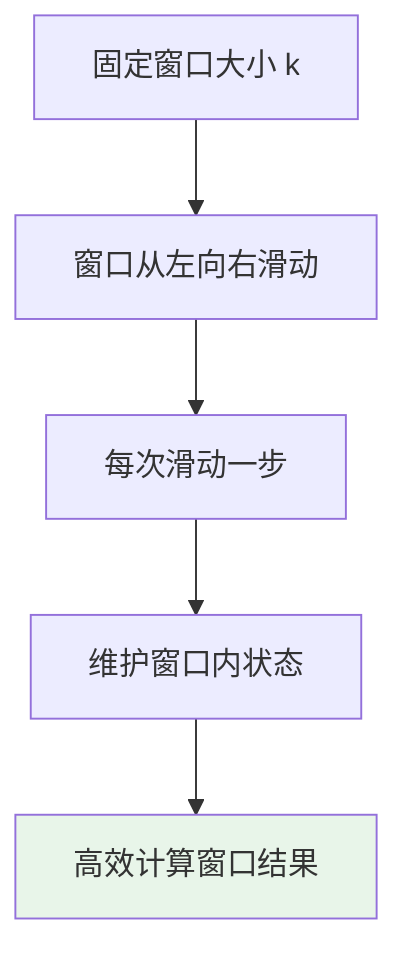
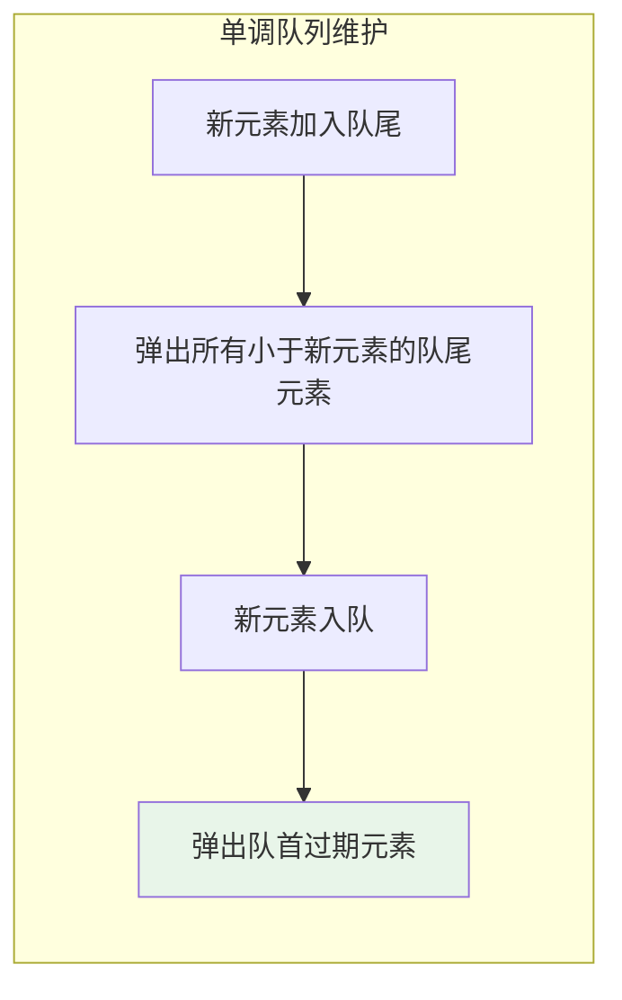
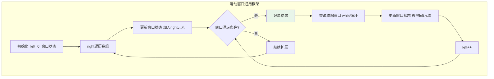
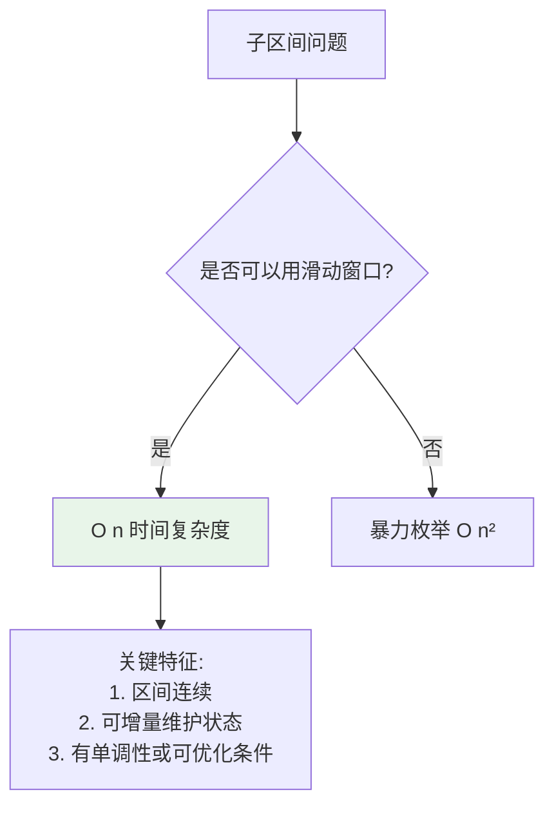

# 滑动窗口算法

## 概述

滑动窗口（Sliding Window）是一种重要的算法思想，通过维护一个动态窗口在序列上滑动，将嵌套循环问题转化为单循环问题，将时间复杂度从O(n²)降低到O(n)。

!!! note "滑动窗口的核心价值"
    滑动窗口算法是处理数组/字符串子区间问题的利器。它通过维护窗口内的状态，避免了重复计算，实现了线性时间复杂度。熟练掌握滑动窗口是算法竞赛和面试的必备技能。

## 算法思想详解

### 什么是滑动窗口



### 窗口类型

```
1. 固定大小窗口
   - 窗口大小固定为k
   - 每次右移一步
   - 应用: 求长度为k的子数组最大和

2. 可变大小窗口
   - 窗口大小动态变化
   - 根据条件扩大或缩小
   - 应用: 最小覆盖子串、最长无重复子串
```

### 可视化演示

```
数组: [1, 3, -1, -3, 5, 3, 6, 7]
窗口大小: 3
求每个窗口的最大值

┌─────────────────────────────────────────────────────┐
│ 滑动窗口过程                                        │
└─────────────────────────────────────────────────────┘

初始窗口位置 i=0:
[1, 3, -1, -3, 5, 3, 6, 7]
 └──────┘
 窗口: [1, 3, -1]
 最大值: 3

窗口右移 i=1:
[1, 3, -1, -3, 5, 3, 6, 7]
    └──────┘
    窗口: [3, -1, -3]
    最大值: 3

窗口右移 i=2:
[1, 3, -1, -3, 5, 3, 6, 7]
       └──────┘
       窗口: [-1, -3, 5]
       最大值: 5

窗口右移 i=3:
[1, 3, -1, -3, 5, 3, 6, 7]
          └──────┘
          窗口: [-3, 5, 3]
          最大值: 5

窗口右移 i=4:
[1, 3, -1, -3, 5, 3, 6, 7]
             └──────┘
             窗口: [5, 3, 6]
             最大值: 6

窗口右移 i=5:
[1, 3, -1, -3, 5, 3, 6, 7]
                └──────┘
                窗口: [3, 6, 7]
                最大值: 7

结果: [3, 3, 5, 5, 6, 7]
```

## 经典问题实现

### 1. 固定窗口最大和

```c
// 求长度为k的子数组最大和
int maxSumSubarray(int arr[], int n, int k) {
    if (n < k) return -1;
    
    // 计算第一个窗口的和
    int maxSum = 0;
    for (int i = 0; i < k; i++) {
        maxSum += arr[i];
    }
    
    int windowSum = maxSum;
    
    // 滑动窗口
    for (int i = k; i < n; i++) {
        // 加上新元素，减去最左元素
        windowSum += arr[i] - arr[i - k];
        if (windowSum > maxSum) {
            maxSum = windowSum;
        }
    }
    
    return maxSum;
}
```

```
执行过程示例:
arr = [1, 4, 2, 10, 2, 3, 1, 0, 20], k = 4

第一个窗口: [1, 4, 2, 10] sum = 17

滑动过程:
i=4: windowSum = 17 + 2 - 1 = 18
     窗口: [4, 2, 10, 2]
     
i=5: windowSum = 18 + 3 - 4 = 17
     窗口: [2, 10, 2, 3]
     
i=6: windowSum = 17 + 1 - 2 = 16
     窗口: [10, 2, 3, 1]
     
i=7: windowSum = 16 + 0 - 10 = 6
     窗口: [2, 3, 1, 0]
     
i=8: windowSum = 6 + 20 - 2 = 24
     窗口: [3, 1, 0, 20]

最大和: 24
```

### 2. 滑动窗口最大值（单调队列）

```c
#include <deque>

// 使用双端队列实现单调队列
int* maxSlidingWindow(int arr[], int n, int k, int *resultSize) {
    int *result = (int*)malloc(sizeof(int) * (n - k + 1));
    *resultSize = 0;
    
    // 双端队列存储下标，队首是当前窗口最大值
    int *deque = (int*)malloc(sizeof(int) * n);
    int front = 0, rear = -1;
    
    for (int i = 0; i < n; i++) {
        // 移除窗口外的元素
        while (front <= rear && deque[front] <= i - k) {
            front++;
        }
        
        // 维护单调递减队列（从队首到队尾递减）
        while (front <= rear && arr[deque[rear]] < arr[i]) {
            rear--;
        }
        
        // 加入当前元素
        deque[++rear] = i;
        
        // 窗口形成后，记录最大值
        if (i >= k - 1) {
            result[(*resultSize)++] = arr[deque[front]];
        }
    }
    
    free(deque);
    return result;
}
```



### 3. 最长无重复字符子串

```c
#include <string.h>

int lengthOfLongestSubstring(char *s) {
    int n = strlen(s);
    if (n == 0) return 0;
    
    int charIndex[256];  // 字符最后出现的位置
    memset(charIndex, -1, sizeof(charIndex));
    
    int maxLen = 0;
    int left = 0;  // 窗口左边界
    
    for (int right = 0; right < n; right++) {
        // 如果字符在窗口内出现过，移动左边界
        if (charIndex[(unsigned char)s[right]] >= left) {
            left = charIndex[(unsigned char)s[right]] + 1;
        }
        
        // 更新字符位置
        charIndex[(unsigned char)s[right]] = right;
        
        // 更新最大长度
        int windowLen = right - left + 1;
        if (windowLen > maxLen) {
            maxLen = windowLen;
        }
    }
    
    return maxLen;
}
```

```
执行过程示例:
s = "abcabcbb"

right=0, s[0]='a':
  left=0, charIndex['a']=0
  窗口: "a", 长度=1

right=1, s[1]='b':
  left=0, charIndex['b']=1
  窗口: "ab", 长度=2

right=2, s[2]='c':
  left=0, charIndex['c']=2
  窗口: "abc", 长度=3

right=3, s[3]='a':
  'a' 在位置0出现过，且在窗口内
  left = 0 + 1 = 1
  charIndex['a']=3
  窗口: "bca", 长度=3

right=4, s[4]='b':
  'b' 在位置1出现过，且在窗口内
  left = 1 + 1 = 2
  charIndex['b']=4
  窗口: "cab", 长度=3

right=5, s[5]='c':
  'c' 在位置2出现过，且在窗口内
  left = 2 + 1 = 3
  charIndex['c']=5
  窗口: "abc", 长度=3

right=6, s[6]='b':
  'b' 在位置4出现过，且在窗口内
  left = 4 + 1 = 5
  charIndex['b']=6
  窗口: "cb", 长度=2

right=7, s[7]='b':
  'b' 在位置6出现过，且在窗口内
  left = 6 + 1 = 7
  charIndex['b']=7
  窗口: "b", 长度=1

最长无重复子串长度: 3
```

### 4. 最小覆盖子串

```c
#include <string.h>
#include <stdlib.h>

char* minWindow(char *s, char *t) {
    int sLen = strlen(s);
    int tLen = strlen(t);
    
    if (sLen < tLen) return "";
    
    // 统计t中字符频率
    int need[256] = {0};
    int needCount = 0;
    for (int i = 0; i < tLen; i++) {
        if (need[(unsigned char)t[i]] == 0) {
            needCount++;
        }
        need[(unsigned char)t[i]]++;
    }
    
    // 滑动窗口
    int window[256] = {0};
    int have = 0;
    int left = 0;
    int minLen = sLen + 1;
    int start = -1;
    
    for (int right = 0; right < sLen; right++) {
        char c = s[right];
        window[(unsigned char)c]++;
        
        // 如果这个字符的数量达到了需要
        if (window[(unsigned char)c] == need[(unsigned char)c]) {
            have++;
        }
        
        // 当满足所有字符需求时，尝试缩小窗口
        while (have == needCount) {
            // 更新最小窗口
            int windowLen = right - left + 1;
            if (windowLen < minLen) {
                minLen = windowLen;
                start = left;
            }
            
            // 移除左边界字符
            char leftChar = s[left];
            if (window[(unsigned char)leftChar] == need[(unsigned char)leftChar]) {
                have--;
            }
            window[(unsigned char)leftChar]--;
            left++;
        }
    }
    
    if (start == -1) return "";
    
    char *result = (char*)malloc(sizeof(char) * (minLen + 1));
    strncpy(result, s + start, minLen);
    result[minLen] = '\0';
    return result;
}
```

```
执行过程示例:
s = "ADOBECODEBANC"
t = "ABC"

need: {'A':1, 'B':1, 'C':1}, needCount=3

right=0, 'A':
  window={'A':1}, have=1
  
right=1, 'D':
  window={'A':1, 'D':1}, have=1
  
right=2, 'O':
  window={'A':1, 'D':1, 'O':1}, have=1
  
right=3, 'B':
  window={'A':1, 'D':1, 'O':1, 'B':1}, have=2
  
right=4, 'E':
  window={'A':1, 'D':1, 'O':1, 'B':1, 'E':1}, have=2
  
right=5, 'C':
  window={'A':1, 'D':1, 'O':1, 'B':1, 'E':1, 'C':1}, have=3
  
  满足条件！尝试缩小窗口:
  窗口: "ADOBEC", 长度=6
  移除'A', have=2, left=1
  
right=6-12: 继续扩展和收缩...

最终找到: "BANC" 长度=4
```

## C++ 实现

```cpp
#include <string>
#include <vector>
#include <deque>
#include <unordered_map>

// 滑动窗口最大值
std::vector<int> maxSlidingWindow(std::vector<int>& nums, int k) {
    std::vector<int> result;
    std::deque<int> dq;  // 存储下标
    
    for (int i = 0; i < nums.size(); i++) {
        // 移除过期元素
        while (!dq.empty() && dq.front() <= i - k) {
            dq.pop_front();
        }
        
        // 维护单调递减队列
        while (!dq.empty() && nums[dq.back()] < nums[i]) {
            dq.pop_back();
        }
        
        dq.push_back(i);
        
        if (i >= k - 1) {
            result.push_back(nums[dq.front()]);
        }
    }
    
    return result;
}

// 最长无重复子串
int lengthOfLongestSubstring(std::string s) {
    std::unordered_map<char, int> charIndex;
    int maxLen = 0;
    int left = 0;
    
    for (int right = 0; right < s.length(); right++) {
        if (charIndex.count(s[right]) && charIndex[s[right]] >= left) {
            left = charIndex[s[right]] + 1;
        }
        charIndex[s[right]] = right;
        maxLen = std::max(maxLen, right - left + 1);
    }
    
    return maxLen;
}

// 最小覆盖子串
std::string minWindow(std::string s, std::string t) {
    std::unordered_map<char, int> need, window;
    for (char c : t) need[c]++;
    
    int left = 0, have = 0;
    int minLen = s.length() + 1, start = -1;
    
    for (int right = 0; right < s.length(); right++) {
        window[s[right]]++;
        
        if (need.count(s[right]) && window[s[right]] == need[s[right]]) {
            have++;
        }
        
        while (have == need.size()) {
            if (right - left + 1 < minLen) {
                minLen = right - left + 1;
                start = left;
            }
            
            if (need.count(s[left]) && window[s[left]] == need[s[left]]) {
                have--;
            }
            window[s[left]]--;
            left++;
        }
    }
    
    return start == -1 ? "" : s.substr(start, minLen);
}
```

## 滑动窗口框架



```c
// 滑动窗口通用框架
void slidingWindow(char *s, int n) {
    // 初始化窗口状态
    int window[256] = {0};  // 或其他数据结构
    int left = 0;
    
    for (int right = 0; right < n; right++) {
        // 加入right位置的元素
        // updateWindow(window, s[right]);
        
        // while循环：窗口满足条件时收缩
        while (/* needShrink(window) */) {
            // 记录结果
            // recordResult(left, right);
            
            // 移除left位置的元素
            // removeFromWindow(window, s[left]);
            left++;
        }
    }
}
```

## 复杂度分析

| 问题 | 时间复杂度 | 空间复杂度 | 说明 |
|------|-----------|-----------|------|
| 固定窗口最大和 | O(n) | O(1) | 每个元素进出窗口各一次 |
| 滑动窗口最大值 | O(n) | O(k) | 单调队列最多k个元素 |
| 最长无重复子串 | O(n) | O(字符集) | 哈希表存储字符位置 |
| 最小覆盖子串 | O(n) | O(字符集) | 哈希表存储字符计数 |

## 滑动窗口 vs 暴力



## 应用场景

### 1. 数组/字符串子区间问题

- 最大/最小子数组和
- 子数组平均值
- 最长/最短满足条件的子数组

### 2. 字符串匹配问题

- 最小覆盖子串
- 找到所有anagram
- 最长无重复子串

### 3. 数据流问题

- 滑动窗口中位数
- 滑动窗口第K大元素
- 移动平均值

### 4. 图像处理

- 滑动窗口滤波
- 局部特征提取

## 常见变体

### 1. 定长滑动窗口

```c
// 长度为k的所有子数组的和
int* allSubarraySums(int arr[], int n, int k, int *resultSize) {
    *resultSize = n - k + 1;
    int *result = (int*)malloc(sizeof(int) * (*resultSize));
    
    // 第一个窗口
    result[0] = 0;
    for (int i = 0; i < k; i++) {
        result[0] += arr[i];
    }
    
    // 滑动
    for (int i = 1; i < *resultSize; i++) {
        result[i] = result[i-1] + arr[i+k-1] - arr[i-1];
    }
    
    return result;
}
```

### 2. 可变长滑动窗口（双指针）

```c
// 和>=target的最短子数组长度
int minSubArrayLen(int target, int arr[], int n) {
    int minLen = n + 1;
    int sum = 0;
    int left = 0;
    
    for (int right = 0; right < n; right++) {
        sum += arr[right];
        
        while (sum >= target) {
            if (right - left + 1 < minLen) {
                minLen = right - left + 1;
            }
            sum -= arr[left];
            left++;
        }
    }
    
    return minLen == n + 1 ? 0 : minLen;
}
```

### 3. 乘积小于K的子数组个数

```c
int numSubarrayProductLessThanK(int arr[], int n, int k) {
    if (k <= 1) return 0;
    
    int count = 0;
    int product = 1;
    int left = 0;
    
    for (int right = 0; right < n; right++) {
        product *= arr[right];
        
        while (product >= k) {
            product /= arr[left];
            left++;
        }
        
        // 以right结尾的所有子数组都满足
        count += right - left + 1;
    }
    
    return count;
}
```

## 参考资料

- 《算法导论》- 分治与滑动窗口
- [Sliding Window Technique - LeetCode](https://leetcode.com/explore/learn/card/sliding-window/)
- [滑动窗口算法总结](https://blog.csdn.net/zhiyikeji/article/details/125161043)
- LeetCode 3, 76, 209, 239, 438, 567
