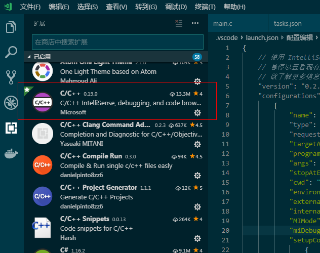
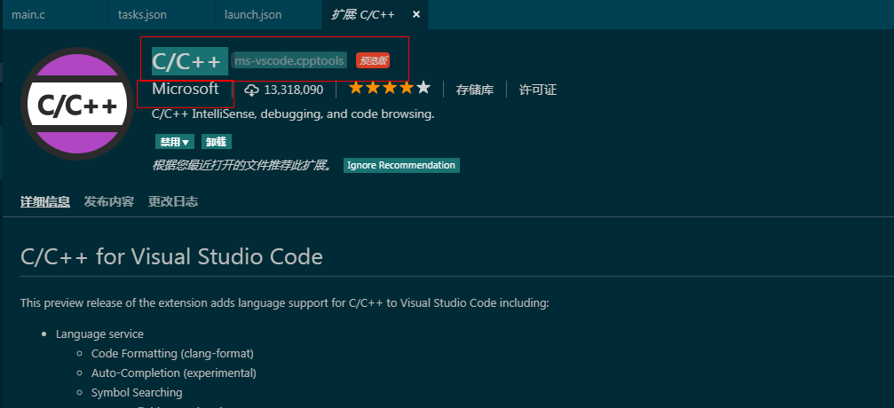
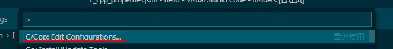
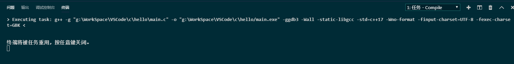

# 配置C&C++开发环境

<span style="color:rgb(100,180,246);font-size:11pt">最后更新：2022-11-19</span>

## 一、.NET CLI

需要.NET CLI 的功能，主要是一些SDK，这个可以在下面网站下载，也可能不需要安装，主要是我的VSCode有提示，所以安装下。

[https://www.microsoft.com/net/learn/dotnet/hello-world-tutorial\#windowscmd](https://www.microsoft.com/net/learn/dotnet/hello-world-tutorial#windowscmd)

## 二、安装C/C++插件



有这个就可以了，其他的一般是不需要的。


## 三、配置c\_cpp\_properties.json


编译的属性配置，类似与vs工程中的.vcproj文件。



按F1，选C/Cpp：Edit configurations  就会有这个文件。

```json
{
    "configurations": [
        {
            "name": "Win32",
            "includePath": [
                "${workspaceFolder}/**",
                "E:/TDM-GCC/lib/gcc/x86_64-w64-mingw32/5.1.0/include/c++",
                "E:/TDM-GCC/lib/gcc/x86_64-w64-mingw32/5.1.0/include/c++/x86_64-w64-mingw32",
                "E:/TDM-GCC/lib/gcc/x86_64-w64-mingw32/5.1.0/include/c++/backward",
                "E:/TDM-GCC/lib/gcc/x86_64-w64-mingw32/5.1.0/include",
                "E:/TDM-GCC/x86_64-w64-mingw32/include",
                "E:/TDM-GCC/lib/gcc/x86_64-w64-mingw32/5.1.0/include-fixed"
            ],
            "defines": [
                "_DEBUG",
                "UNICODE",
                "__GNUC__=7",
                "__cdecl=__attribute__((__cdecl__))"
            ],
            "browse": {
                "path": [
                    "${workspaceFolder}",
                    "E:/TDM-GCC-64/lib/gcc/x86_64-w64-mingw32/5.1.0/include/c++",
                    "E:/TDM-GCC-64/lib/gcc/x86_64-w64-mingw32/5.1.0/include/c++/x86_64-w64-mingw32",
                    "E:/TDM-GCC-64/lib/gcc/x86_64-w64-mingw32/5.1.0/include/c++/backward",
                    "E:/TDM-GCC-64/lib/gcc/x86_64-w64-mingw32/5.1.0/include",
                    "E:/TDM-GCC-64/x86_64-w64-mingw32/include",
                    "E:/TDM-GCC-64/lib/gcc/x86_64-w64-mingw32/5.1.0/include-fixed"
                ]
            },
            "windowsSdkVersion": "10.0.15063.0",
            "cStandard": "c11",
            "cppStandard": "c++17",
            "intelliSenseMode": "msvc-x64"
        }
    ],
    "version": 4
}
```

## 四、配置launch.json

```json
{
    // 使用 IntelliSense 了解相关属性。 
    // 悬停以查看现有属性的描述。
    // 欲了解更多信息，请访问: https://go.microsoft.com/fwlink/?linkid=830387
    "version": "0.2.0",
    "configurations": [
        {
            "name": "C++ Launch",
            "type": "cppdbg",
            "request": "launch",
            "program": "${fileDirname}/${fileBasenameNoExtension}.exe",
            "args": [],
            "stopAtEntry": false,
            "cwd": "${workspaceFolder}",
            "environment": [],
            "externalConsole": true,
            "MIMode": "gdb",
            "miDebuggerPath": "E:/TDM-GCC/bin/gdb64.exe",
            "setupCommands": [
                {
                    "description": "Enable pretty-printing for gdb",
                    "text": "-enable-pretty-printing",
                    "ignoreFailures": true
                }
            ],
            "preLaunchTask": "Compile"
        }
    ]
}
```

参考配置就行，注意，preLaunchTask必须要有，值就是task.json中的lable的值，倆一样就行，表示在运行launch之前先运行task。

program这行填写的是task中编译出来的exe文件名，这里使用的是宏代替。当然如果你不嫌麻烦，你可以先编译出exe文件，然后这里填写exe文件名，这样就不需要preLaunchTask参数了。


## 五、配置setting.json

为了不影响其他的工程属性，这里用的是工作区配置，只在当前的工作区生效。

会在工作目录下的.vscode中生成一个setting.json文件，如果在用户设置中设置则不会生成。

```json
{
    "window.zoomLevel": 0,
    "editor.snippetSuggestions": "top",
    "editor.minimap.renderCharacters": false,
    "editor.formatOnPaste": true,
    "editor.formatOnType": true,
    "editor.wordWrap": "on",
    "C_Cpp.clang_format_sortIncludes": true,
    "[cpp]": {
        "editor.quickSuggestions": true
    },
    "[c]": {
        "editor.quickSuggestions": true
    },
    "problems.decorations.enabled": true,
    "C_Cpp.intelliSenseEngineFallback": "Enabled",
    "files.associations": {
        "*.cfg": "ini",
        "*.fsh": "glsl",
        "stack": "cpp",
        "iostream": "cpp",
        "ostream": "cpp",
        "*.tcc": "cpp",
        "cctype": "cpp",
        "clocale": "cpp",
        "cmath": "cpp",
        "cstdint": "cpp",
        "cstdio": "cpp",
        "cstdlib": "cpp",
        "cwchar": "cpp",
        "cwctype": "cpp",
        "exception": "cpp",
        "initializer_list": "cpp",
        "iosfwd": "cpp",
        "istream": "cpp",
        "limits": "cpp",
        "new": "cpp",
        "stdexcept": "cpp",
        "streambuf": "cpp",
        "system_error": "cpp",
        "type_traits": "cpp",
        "typeinfo": "cpp",
        "utility": "cpp"
    }
}
```

## 六、配置task.json

如果只是写代码，不做编译运行，这里可以省略。


```json
{
    // See https://go.microsoft.com/fwlink/?LinkId=733558
    // for the documentation about the tasks.json format
    "version": "2.0.0",
    "tasks": [
        {
            "label": "Compile",
            "command": "g++",
            "args": [
                "-g",
                "\"${file}\"", //指定编译源代码文件 
                "-o",
                "\"${fileDirname}/${fileBasenameNoExtension}.exe\"", // 指定输出文件名，不加该参数则默认输出a.exe
                "-ggdb3", // 生成和调试有关的信息
                "-Wall", // 开启额外警告
                "-static-libgcc", // 静态链接
                "-std=c++17", // 使用最新的c++17标准
                "-Wno-format",
                "-finput-charset=UTF-8", //输入编译器文本编码 默认为UTF-8
                "-fexec-charset=GBK" //编译器输出文本编码 自行选择
            ],
            "type": "shell",
            "group": {
                "kind": "build",
                "isDefault": true
            },
            "presentation": {
                "echo": true,
                "reveal": "always", // 在“终端”中显示编译信息的策略，可以为always，silent，never
                "focus": false,
                "panel": "shared", // 不同的文件的编译信息共享一个终端面板
                "showReuseMessage": true,
                "clear": false
            },
            "problemMatcher": {
                "owner": "cpp",
                "fileLocation": [
                    "relative",
                    "${workspaceFolder}"
                ],
                "pattern": {
                    "regexp": "^([^\\\\s].*)\\\\((\\\\d+,\\\\d+)\\\\):\\\\s*(.*)$",
                    "file": 1,
                    "line": 2,
                    "column": 3,
                    "severity": 4,
                    "message": 5
                }
            }
        }
    ]
}
```

"args": 中的前4个参数最好不要顺序弄乱了，-g 后面跟要编译源文件，-o后面跟的是生成的文件。

任务启动的时候，如下：



g++ -g "g:\\WorkSpace\\VSCode\\c\\hello\\main.c" -o "g:\\WorkSpace\\VSCode\\c\\hello/main.exe" -ggdb3 -Wall -static-libgcc -std=c++17 -Wno-format -finput-charset=UTF-8 -fexec-charset=GBK 就是编译的参数，你在cmd中手动输入这个，也可以生成一个main.exe。

注意json中args不要写成"-g $\{file\}"，这种的出来就成了g++ "-g g:\\WorkSpace\\VSCode\\c\\hello\\main.c"，这种命令g++是不认识的。

