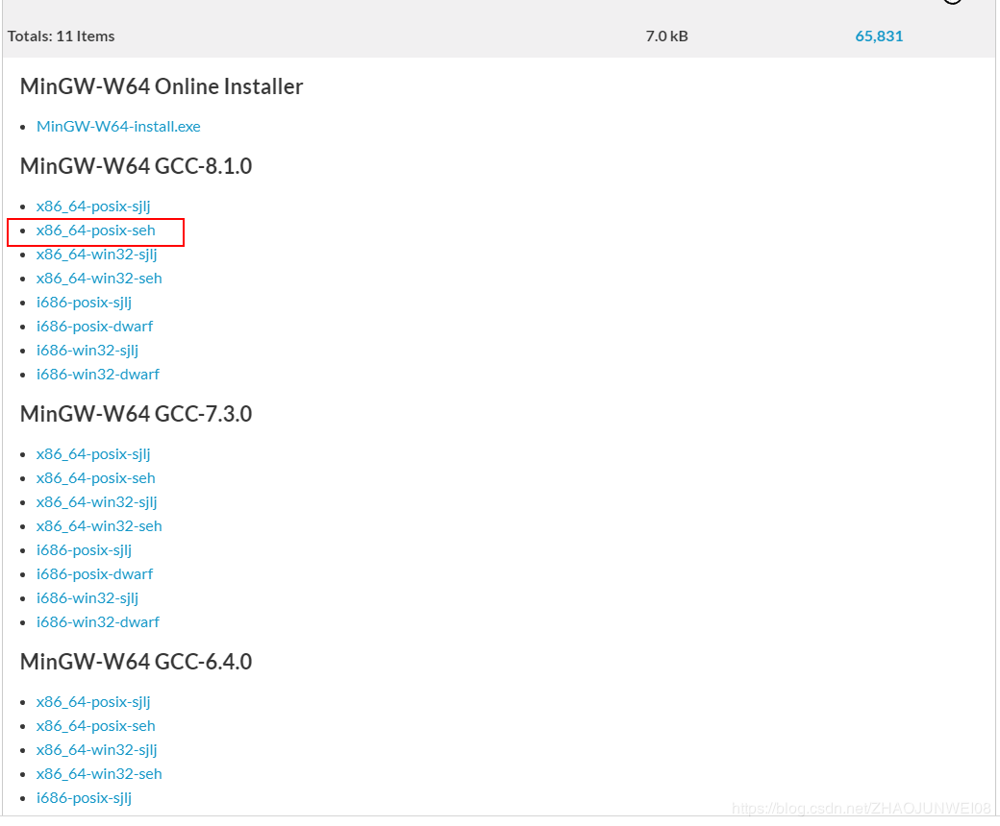
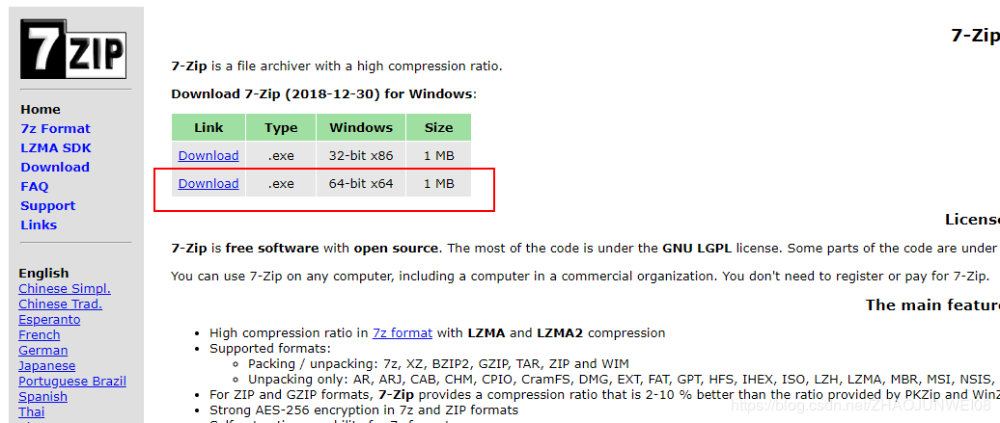
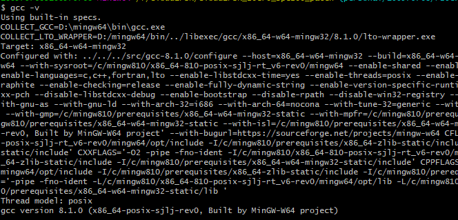
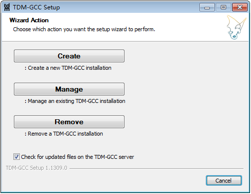
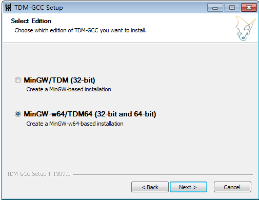
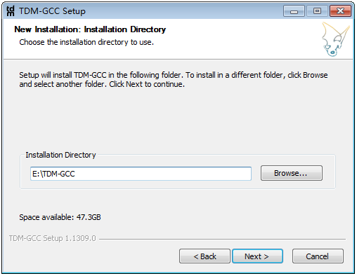
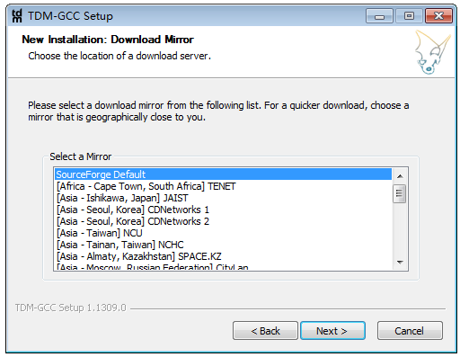
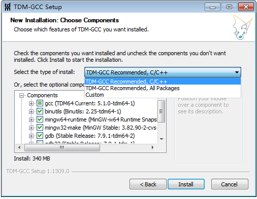
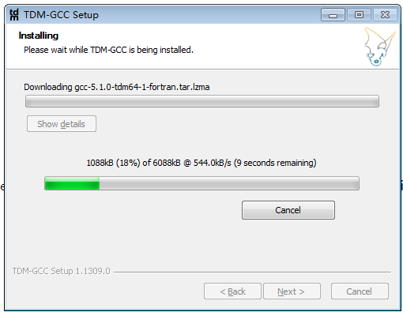
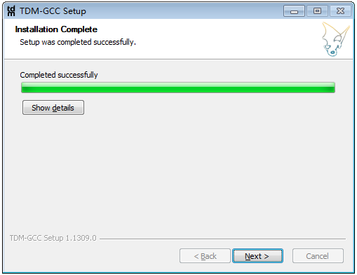

# C语言的编译器安装，二选一

最后更新：2023-05-23

## 一、MinGW64

[在windows11上安装最新版的gcc/g++](https://blog.csdn.net/weixin_46416035/article/details/127387170)

### 1.1 下载

如果你能从在线 安装，那最好就在线安装吧。

如果你能连上官网，那可以选择从官网去下载，地址：

[https://osdn.net/projects/mingw/releases/](https://osdn.net/projects/mingw/releases/)

[https://sourceforge.net/projects/mingw-w64/files/](https://sourceforge.net/projects/mingw-w64/files/)

从这里去下载，选择需要下载的文件。

如图，我这里选择的是[x86\_64-posix-seh](https://sourceforge.net/projects/mingw-w64/files/Toolchains%20targetting%20Win64/Personal%20Builds/mingw-builds/8.1.0/threads-posix/seh/x86_64-8.1.0-release-posix-seh-rt_v6-rev0.7z)

### 1.2 7-zip工具

下载下来的文件是7z文件，直接解压就行，如果没有7z的解压工具，可以去下载一个。

[https://www.7-zip.org/](https://www.7-zip.org/)

去官网下载，我的是64位系统。

安装7-zip。

### 1.3 解压

7-zip安装之后，去目录解压文件。

可以选择把下载下来的x86\_64-8.1.0-release-posix-seh-rt\_v6-rev0.7z文件拷贝到7-zip目录。

使用命令进行解压。

7z x x86\_64-8.1.0-release-posix-seh-rt\_v6-rev0.7z -o./

命令表示解压文件到当前目录下。

解压之后会得到一个mingw64的文件夹，将其拷贝到你要安装的目录。

### 1.4 环境变量

解压完毕之后需要配置环境变量

path下添加你的mingw64/bin，如：D:\\mingw64\\bin

在cmd窗口使用 gcc -v去查看下。

## 二、TDM-GCC

### 2.1 下载

[http://tdm-gcc.tdragon.net/download](http://tdm-gcc.tdragon.net/download)

根据需要下载，我用的是64位的。

### 2.2 安装

1. 看不太懂，第一个类似Install，第二个类似modify，第三个类似Uninstall，我自己电脑上没装过，选第一个。

   

2. 选择系统类型。我这里用的是64位

   

3. 设置安装目录

   

4. 选择镜像地址

   

   选个默认的吧，Africa非洲、Asia亚洲、Australia澳大利亚、Europe欧盟、American南/北美，虽然有亚洲，但是没china，只有Taiwan、Tainan。

5. 选择安装部件，这里默认就行，你如果需要全部都装上，也没关系。

   

6. 安装

   

   开始安装了，下载镜像呢应该（猜的）

   

7. 设置环境变量，TDM-GCC安装完毕默认就加好了。
