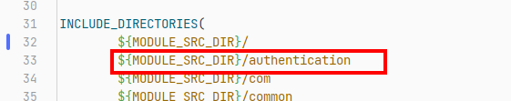
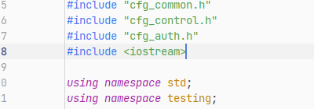
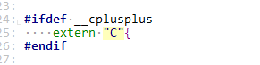

# 在CMakeList中包含了要使用的头文件，但是在编译的时候，依然报函数未定义

最后更新：2023-04-18

## 案例描述：

CMakeList.txt中定义了头文件地址

头文件中包含了对应的函数定义、cpp中包含了对应的头文件：

编译报错 `undefined reference to`  ：

## 根因分析

这里是cpp文件中包含了头文件，意味着这个是c++的编译。

头文件中的函数定义是按照c语言的方式定义的

需要加上`extern "c"`

