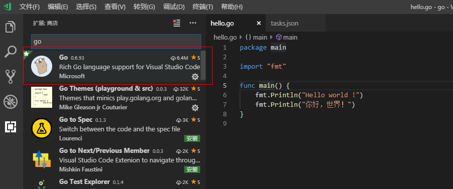
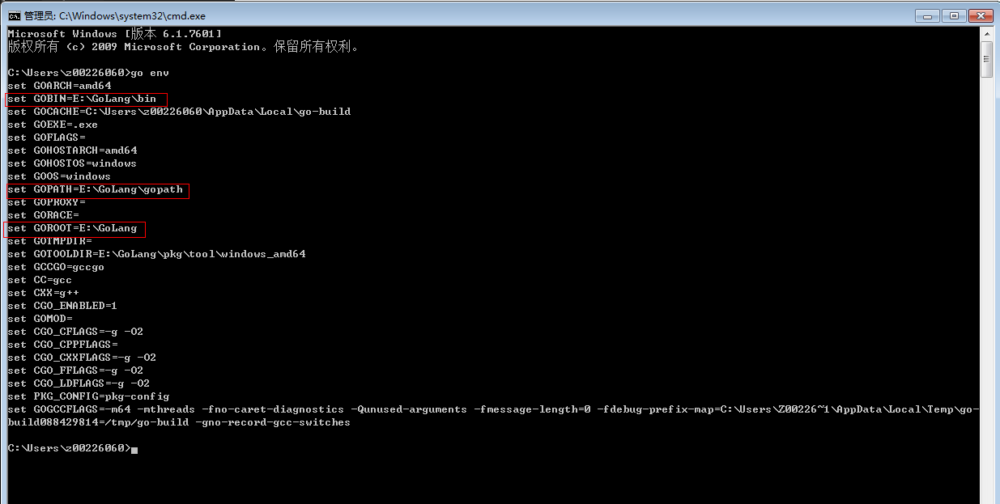
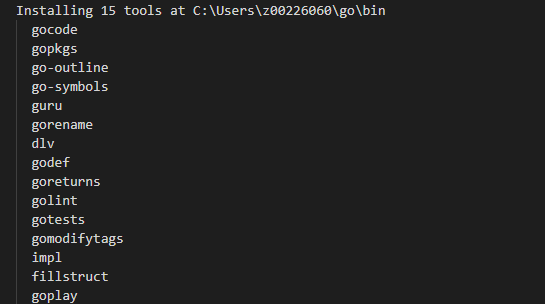
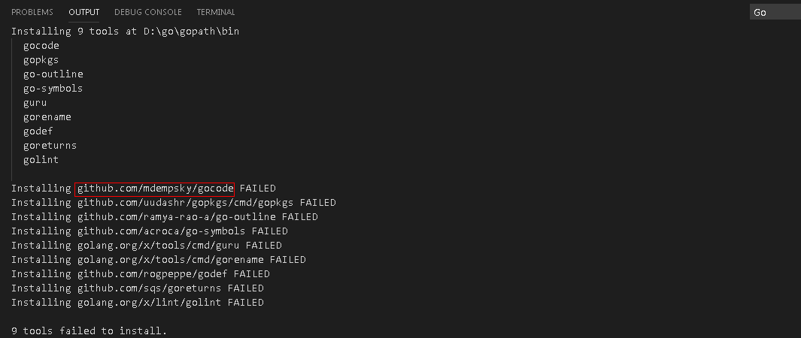
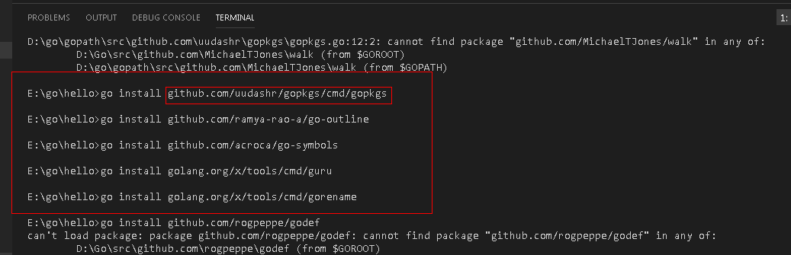
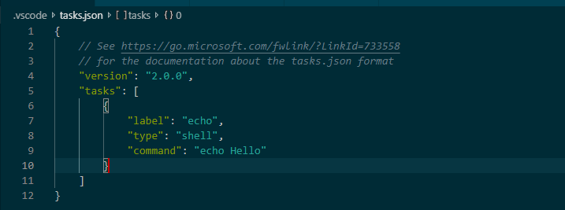
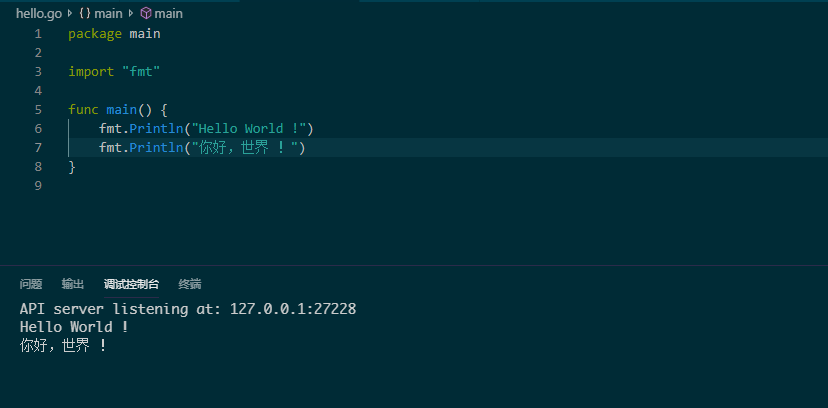

# VSCode搭建Go语言开发环境

## **Golang插件安装**

## **运行环境监测**

如果你Golang安装的比较好的话，这里其实不需要去设置，可以在cmd中用go env命令查看

用VSCode打开hello.go文件，或者在VSCode中打开hello文件夹。

打开go文件的时候，右下角会提示要安装一些工具，如图：

这些是安装Golang的时候安装好的，这里如果提示，应该是GOBIN的问题。

你可以手动将文件下载到对应的目录，然后go install去安装。

很多都安装失败了，我的bin目录是E:\\GoLang\\bin  \($\{GOBIN\}\)

所以手动在github.com上面下载响应的包，放到E:\\GoLang\\src\\github.com中。\($\{GOROOT\}\\src\\github.com\)

下载的时候拷贝github.com/mdempsky/gocode 到浏览器，enter即可跳转

手动安装go install 后面是路径，不需要写全，如果$\{GOROOT\}\\src\\github.com下没有，会到$\{GOPATH\}\\src\\github.com下去找.

## **launch-json**

行环境配置，launch.json，调试-\>打开配置，也可以用添加配置（如果VSCODE配置多个开发环境的话）：

这里一般不用配置，安装完插件后就是OK的。

## **settings-json**

系统的设置，开发环境的一些设置参数。

文件-\>首选项-\>设置  现在设置有界面了，可以选择在json中编辑。

go语言的不需要特殊配置，我这里也没有配置

当然你也可以指定gopath （注意：不管指定那个gopath，必须要保证gobin的正确，要么就是在环境变量中定义一个GOBIN，要么在你自己指定的gopath中需要有bin和src目录，并且要有相应的东西）

goroot就是go的安装目录，这个不需要去改。

## **task-json**

go语言的不需要特殊配置，默认的就行

## **调试**

按F5就可以启动调试，也可以从左侧的面板进入。

