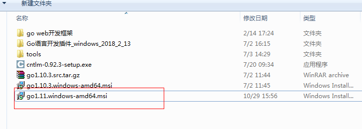
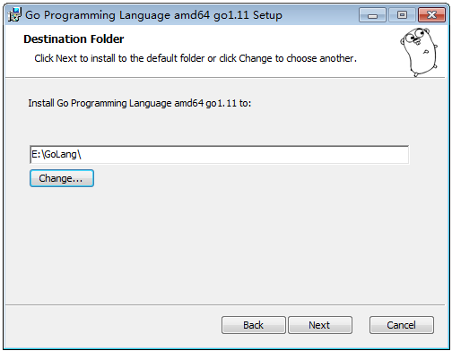
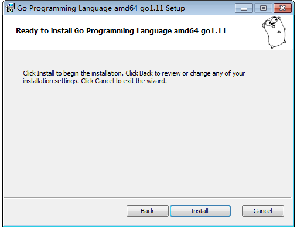
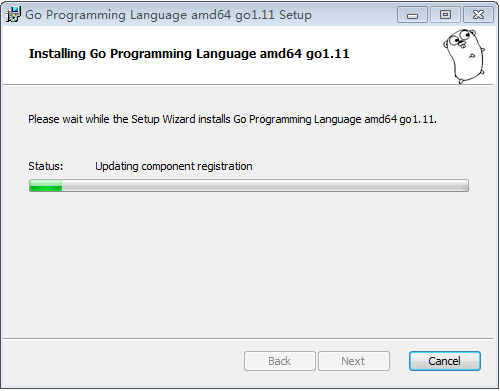
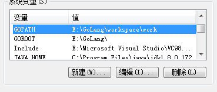
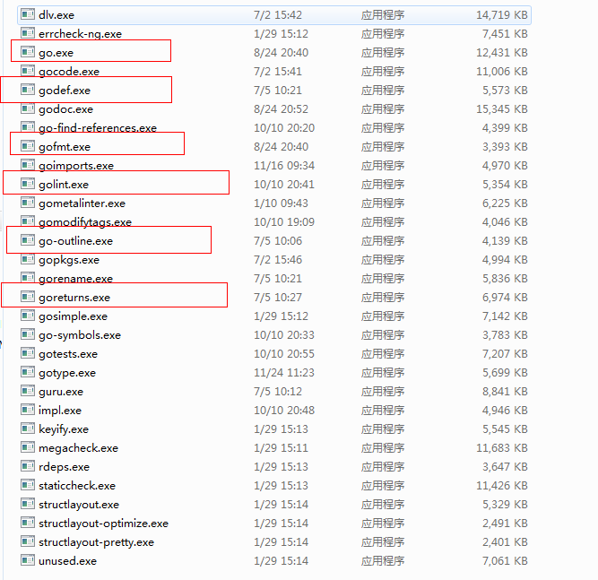
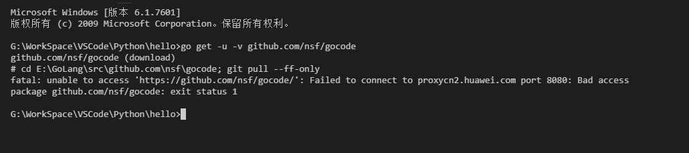

# Golang安装

## 一、安装

### 1.1 开始安装

### 1.2 选择安装路径

### 1.3 开始Install

### 1.4 安装中……

如果有旧的版本的话，这里会卸载掉，安装新的版本

### 1.5 完成

## 二、环境变量

Go 开发环境依赖于一些操作系统环境变量，你最好在安装 Go 之间就已经设置好他们。如果你使用的是 Windows 的话，你完全不用进行手动设置，Go 将被默认安装在目录c:/go下。这里列举几个最为重要的环境变量：

- \$GOROOT 表示 Go 在你的电脑上的安装位置，它的值一般都是$HOME/go，当然，你也可以安装在别的地方。
- \$GOARCH 表示目标机器的处理器架构，它的值可以是 386、amd64 或 arm。
- \$GOOS 表示目标机器的操作系统，它的值可以是 darwin、freebsd、linux 或 windows。
- \$GOBIN 表示编译器和链接器的安装位置，默认是$GOROOT/bin，如果你使用的是 Go 1.0.3 及以后的版本，一般情况下你可以将它的值设置为空，Go 将会使用前面提到的默认值。

目标机器是指你打算运行你的 Go 应用程序的机器。

Go 编译器支持交叉编译，也就是说你可以在一台机器上构建运行在具有不同操作系统和处理器架构上运行的应用程序，也就是说编写源代码的机器可以和目标机器有完全不同的特性（操作系统与处理器架构）。

为了区分本地机器和目标机器，你可以使用\$GOHOSTOS和\$GOHOSTARCH设置目标机器的参数，这两个变量只有在进行交叉编译的时候才会用到，如果你不进行显示设置，他们的值会和本地机器（\$GOOS和\$GOARCH）一样。

- \$GOPATH 默认采用和$GOROOT一样的值，但从 Go 1.1 版本开始，你必须修改为其它路径。它可以包含多个包含 Go 语言源码文件、包文件和可执行文件的路径，而这些路径下又必须分别包含三个规定的目录：src、pkg和bin，这三个目录分别用于存放源码文件、包文件和可执行文件。
- \$GOARM 专门针对基于 arm 架构的处理器，它的值可以是 5 或 6，默认为 6。
- \$GOMAXPROCS 用于设置应用程序可使用的处理器个数与核数。

说了这么多，其实我们关注下GOPATH和GOROOT就可以了。

然后在path中添加路径\$GOROOT/bin，这个是默认值。即使在path中不添加也没有关系。

注意：GOPATH是你的工作目录

## 三、下载

- GO语言中文网：https://studygolang.com/dl
- Golang官网：https://golang.org/dl/
- Golang中国：https://www.golangtc.com/download

也可以用源码编译  [https://github.com/golang/go](https://github.com/golang/go)   怎么编译，这个可以去百度

## 四、编译器和链接器

这个必须安装，不然你没法用，一般新安装的go是没有的，在$GOROOT/bin下.

有很多的，可以不需要全部安装，但是必须的要有。

这些可以自己编，也可以去下载。

如果提示联网失败，有两种解决方案：

1、去百度下载别人编译好的工具，但是可能和当前使用的go版本不能匹配

2、下载源码，自己编译，这个比较好弄，可以百度下怎么编译

[https://www.cnblogs.com/Leo\_wl/p/8242628.html](https://www.cnblogs.com/Leo_wl/p/8242628.html)

用go install去安装
