# NodeJs安装配置

最后更新：2022-11-19

## 一、安装

下载安装NodeJS

本文在windows平台下NodeJS安装实例，独立安装而不是在安装Visual Studio的过程中

NodeJS中文官网下载：  [http://nodejs.cn/download/](http://nodejs.cn/download/)

NodeJS官网：  [https://nodejs.org/](https://nodejs.org/)

安装操作过程中可以修改安装目录，这样的话如果操作系统重装后nodejs不需要再次安装，只要配置一下环境变量就可以了。

我这里安装的是node-v9.11.1-x64，基本不需要改啥，一路next就行，我这里是改了安装路径。

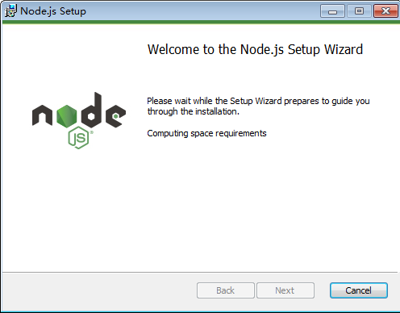

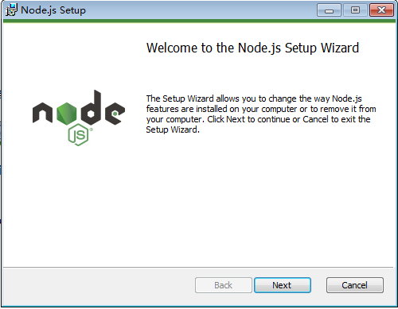

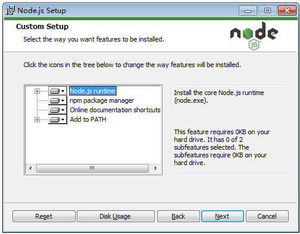

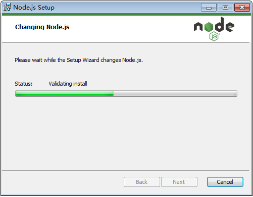

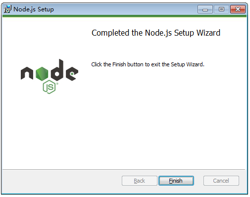

## 二、环境变量

### 2.1 配置Node.Js的环境变量

直接添加到Path中，‘E:\\nodejs\\’，此配置主要是为了node.exe,npm.cmd.

如果是使用安装包安装的此步骤在安装的过程中已经完成。

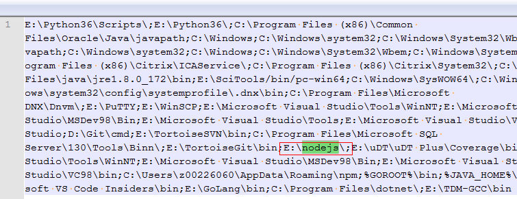

### 2.2 配置package的环境变量

如果不配置全局安装包路径的话默认在 'C:\\Users\\<用户\>\\AppData\\Roaming\\npm'。

nodejs的缓存位置：'C:\\Users\\<用户\>\\AppData\\Roaming\\npm-cache'。

配置package的环境变量，是为了全局的工具，例如：远程调试工具weinre，express模板生成工具等。

在安装目录下新建node\_cache和node\_global俩目录。如下：

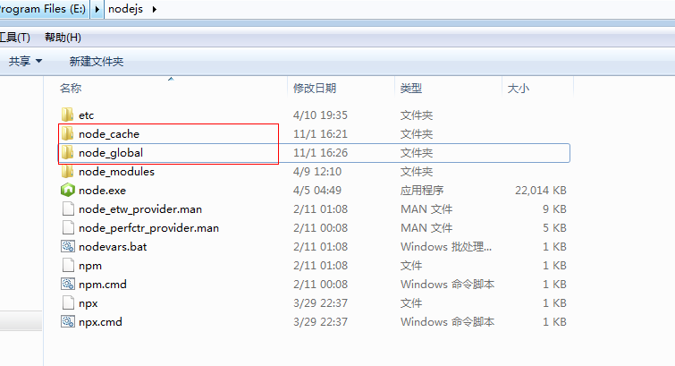

在E:\\nodejs\\node\_modules\\npm下找到npmrc文件，修改

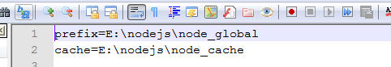

或者在cmd中使用命令修改

npm config set prefix "E:\\nodejs\\node\_global"

npm config set cache "E:\\nodejs\\node\_cache"

然后如下说明修改成功了：

## 三、其他配置

### 3.1 验证vue

version

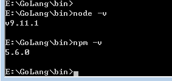

安装vue以及vue-cli

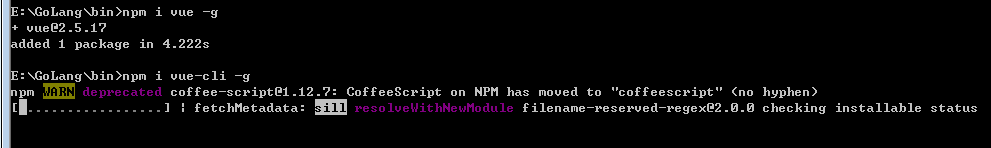

重启cmd查看版本，一定要重启，不重启查不到的。

### 3.2 配置镜像站

## 四、验证

### 4.1 安装npm工具

NodeJS安装成功后，会自带npm工具，npm作为了node\_moduls的一个模块

### 4.2 验证Node.Js是否安装成功

安装Node.js，安装过程基本上是下一步，即可完成，然后在CMD中运行如下命令：node -v 来查询当前node.js的版本号，然后输出如图所示的结果就表示node.js安装成功。

接着可以输入命令：npm -v 来查询当前npm工具的版本号\[可能需要时间稍长点\]，便会输出如图所示的结果表示npm工具可用

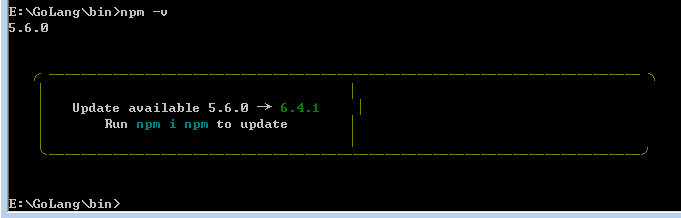

提示更新，可以更新，也可以不更新，没什么关系。

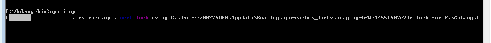

更新成功：

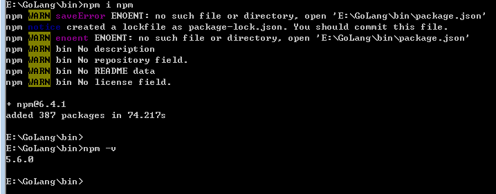

貌似更新失败了，版本号没变，好吧，先不研究了，这个还要去golang找东西
